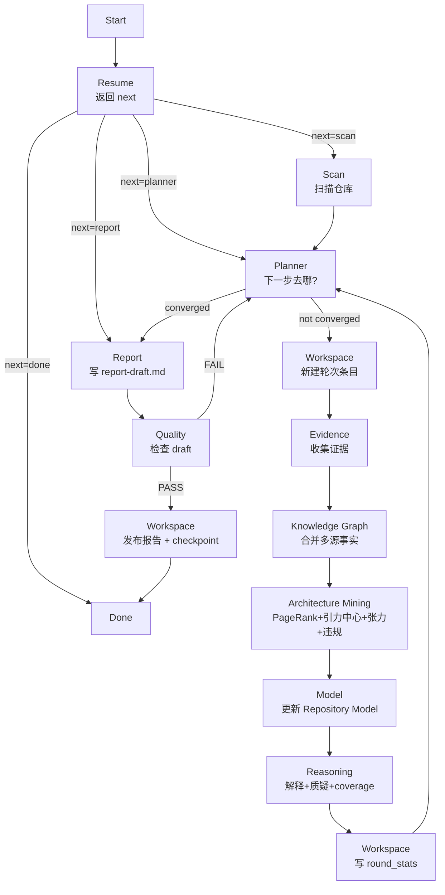

# Repository 研究

> 相关文档：[methodology.md](./methodology.md)（研究方法论） | [workspace.md](./workspace.md)（工作目录 + 文件所有权 + 缓存策略） | [question-framework.md](./question-framework.md)（问题生成与管理） | [report-schema.md](./report-schema.md)（Repository Model + 报告规范）

## 目标

构建可复用的架构知识库（Repository Model）。Repository Model 捕获实体、关系及支撑证据。报告是 Repository Model 的视图。

## 架构：Orchestrator + 9 Sub Agents + Architecture Mining

SKILL 是 Orchestrator，**只负责调度，不写任何状态文件**。每个 Agent 自己知道自己的输入/输出/规则，SKILL 不知道实现细节。状态文件的持久化全部经过 Workspace Agent。

**Architecture Mining** 是 Graph 和 LLM 之间的关键中间层：它将图谱拓扑（代码事实）转化为架构洞察（引力中心、张力、违规），LLM 消费这些架构事实而非原始 metrics。



### Architecture Mining Stage

**核心问题**：LLM 直接看代码事实会产生"代码扫描报告"，回答"仓库里有什么"而非"系统为什么长成这样"。

**解决方案**：在 Graph 和 LLM 之间插入 Architecture Mining 层，将"90 inbound dependencies"（代码事实）转化为"model module acts as architectural gravity center"（架构事实）。

**输入**：Knowledge Graph（graphology）+ Evidence Log

**输出**（`artifacts/architecture-facts.json`）：

```json
{
  "gravityCenters": [{
    "node": "org.jkiss.dbeaver.model",
    "name": "model",
    "pageRank": 0.92,
    "inDegree": 90,
    "reason": "PageRank 0.92 (top tier); 90 inbound dependencies; name indicates architectural role"
  }],
  "tensions": [{
    "axis": "generic-abstraction vs vendor-specific-capability",
    "description": "model serves as generic abstraction but is extended by vendor-specific modules",
    "evidence": ["Gravity center: model (90 dependents)", "Vendor extensions: wmi, ext.oracle"],
    "resolution": "extension points allow vendor escape hatches while maintaining common abstraction"
  }],
  "violations": [{
    "type": "platform-independence-violation",
    "description": "Class uses native code (JNI/WMI) inside OSGi bundle, breaking platform independence",
    "evidence": ["Class: JNIMetaData", "File: plugins/.../JNIMetaData.cpp"],
    "severity": "high"
  }],
  "boundaries": [{
    "name": "model→core",
    "edgeCount": 12,
    "direction": "model→core",
    "examples": ["org.jkiss.dbeaver.model → org.jkiss.dbeaver.core"]
  }],
  "extensionPoints": [{
    "name": "org.jkiss.dbeaver.runtime",
    "contributorCount": 28,
    "sampleContributors": ["wmi", "oracle", "mysql"]
  }]
}
```

**算法**：
- **PageRank**：迭代计算（30 轮，damping=0.85），识别被重要节点引用的节点
- **引力中心**：PageRank（40%）+ in-degree（30%）+ 语义相关性（30%，名称匹配 model/core/api/runtime 等）
- **张力检测**：4 种启发式——generic vs vendor、centralization vs decentralization、platform-independence vs native、stability vs extensibility
- **违规检测**：4 种启发式——layering-violation、cross-ui-coupling、platform-independence-violation、god-class（方法数≥100）

**LLM 消费方式**：架构事实通过 `formatArchitectureFactsForPrompt()` 格式化为 LLM prompt 的一部分，替代原始 metrics。LLM 被要求：
- `buildRepositoryModel`：围绕引力中心组织 modules，不是列举目录
- `interpretCore`：引用张力作为 architectural_forces，引用违规作为 engineering_constraints
- `riskAndChallenge`：center_hypothesis 描述真正架构主题（如"如何管理供应商扩展"），不是套话（如"采用OSGi"）

### 架构考古约束（p6.md §2-§7, §10）

所有 LLM prompt 共享以下约束，防止生成"代码清单报告"而非"架构研究报告"：

**禁止机械总结**：
- 禁止列举目录/文件/模块名作为架构概念
- 模块/文件/类不是架构概念，除非满足：承担架构职责、具有依赖影响力、参与运行时流程、代表设计边界

**Mechanism vs Intent 分离**（§6）：
- 每个架构机制必须分离"机制"（什么技术实现）和"意图"（解决什么架构问题）
- 禁止只报告机制而不解释意图

**Key Decision 规则**（§4）：
- Decision != implementation detail
- 错误："Created DBUtils class"
- 正确："Centralized database semantic operations behind the model layer to prevent vendor-specific behavior leaking into UI"
- Evidence 必须证明：constraint、alternative、consequence

**Confidence discipline**（§7）：
- 每个架构主张必须包含：evidence、inference level（direct/indirect/speculative）、alternative explanation
- 如果证据只显示实现，不要声称设计意图

**张力优先规则**（§3）：
- 在生成 design_decision 之前，必须先识别至少 3 个架构张力
- 没有张力的决策不是架构决策，只是实现选择

**Report Writer 不直接接 Evidence**（§9）：
- Report 从 Repository Model + Architecture Mining 输出 + Interpretation 生成
- 禁止 Report 直接从 evidence-log 推导架构结论

## Orchestrator 调度步骤

```
1. call resume              → 返回 {next: "scan"|"planner"|"report"|"workspace"|"done"}
2. switch next:
     scan     → call scan, then goto 3
     planner  → goto 3
     report   → goto 4
     workspace → goto 7（崩溃恢复：Quality PASS 但 checkpoint+publish 未完成）
     done     → end
3. loop:
     a. call planner          → 返回 {converged, next_focus}（Planner 不写状态文件）
     b. if converged: break
     c. call workspace        → 把 planner 返回值落到 summary.json + context.current_round（新建轮次条目）
     d. call evidence         → 读文件，写 evidence-log（append-only）
     e. call model            → 从 evidence 合并/更新 repository-model.json（Model 是唯一写入者）
     f. call reasoning        → 架构解释 + 质疑 + 更新 coverage/design_space/maintainer_view，返回 round_stats
     g. call workspace        → 把 reasoning 返回的 round_stats 落到 summary.json 当前轮次条目
     goto a
4. call report              → 从 Model + Architecture Mining + Interpretation 生成 report-draft.md（p6.md §9: 禁止直接从 evidence 推导架构结论）
5. call quality             → 检查 report-draft.md，返回 PASS/FAIL/reason（不修改 draft）
6. if FAIL: goto 3 (Planner 根据 failed_checks 生成针对性问题；report-draft.md 保留供下一轮覆盖)
7. if PASS:
     a. call workspace        → rename report-draft.md → report.md + 提交 checkpoint
       (meta.last_analyzed_commit = meta.analysis_target_commit; 清空 analysis_target_commit 和 pending_invalidation)
     b. end
```

### Orchestrator 不写任何状态文件

Planner 只返回决策，**不写状态文件**。Orchestrator 也**不直接写状态文件**——所有状态持久化由 Workspace Agent 执行：

- 收到 `{converged: false, round_file: "round-3.json"}` → Orchestrator 调用 Workspace，Workspace 更新 `context.current_round` 和 `questions/summary.json`
- 收到 `{converged: true}` → Orchestrator 进入 Report 阶段
- 收到 Quality `{passed: true}` → Orchestrator 调用 Workspace，Workspace 发布报告 + 提交 checkpoint

## Agent 清单

| Agent | 文件 | 一句话职责 |
|-------|------|-----------|
| Resume | [agents/resume.md](./agents/resume.md) | 恢复现场，判断代码变化，返回下一步跳转目标 |
| Scan | [agents/scan.md](./agents/scan.md) | 扫描仓库，生成可复用的 artifacts/*.json |
| Planner | [agents/planner.md](./agents/planner.md) | **只回答"下一步去哪？"**——判断收敛 + 生成下一轮问题 |
| Workspace | [agents/workspace.md](./agents/workspace.md) | **状态持久化**——把各 Agent 决策落到磁盘，Orchestrator 不写文件 |
| Evidence | [agents/evidence.md](./agents/evidence.md) | 读文件 + 写 evidence-log.jsonl（**不碰 Model**） |
| Model | [agents/model.md](./agents/model.md) | **repository-model.json 唯一写入者**——从 evidence 合并/更新 Model |
| Reasoning | [agents/reasoning.md](./agents/reasoning.md) | 架构解释 + 质疑模型 + 更新 coverage/design_space/maintainer_view |
| Report | [agents/report.md](./agents/report.md) | 从 Model + evidence 生成 `report-draft.md`（禁止新增推理） |
| Quality | [agents/quality.md](./agents/quality.md) | 检查 `report-draft.md`，返回 PASS/FAIL/reason（**不修改 draft**） |

> 工作目录结构、文件所有权矩阵、产物缓存策略详见 [workspace.md](./workspace.md)。SKILL 不重复这些实现细节。

## 成功标准

一份成功的研究应该让有经验的工程师能回答：

- 能用一句话说出系统的**架构中心**，且能回答"如果把这个中心去掉，系统还能跑吗？"
- 每个关键决策都能说出**至少一个被拒绝的替代方案**
- 报告的结论不是从源码"看"出来的，而是通过**提问 → 收集证据 → 质疑 → 修正**循环产生的
- 能回答"改 X 会炸哪里"（Blast Radius）和"哪些改动容易、哪些危险"（Change Difficulty）
- 能回答"系统为何演变成今天这样"（架构演进时间线）

### Neutrality 原则（最高优先级）

**研究是 evidence-based，禁止替 maintainer 做价值判断。**

- **禁止绝对化结论**：不用 "不可能"、"永远"（用于结论）、"deliberate trade-off"（作为结论）
- **证据范围约束**：证据只能推出其支持范围内的结论（无 TODO ≠ 永久决策）
- **术语 Neutral 化**：禁止拟人化比喻（心脏/大脑/神经），使用 neutral 术语
- **Evidence/Inference/Confidence 分离**：核心结论显式分离代码事实与研究推断
- **Coverage 可计算化**：X/Y = Z%，非主观分数

### 从 "描述系统" 到 "预测系统"

报告不仅描述系统如何工作，还要**预测系统行为**：

- **Blast Radius**：改这里会影响哪些子系统/invariant
- **Change Difficulty**：哪些改动容易（data-driven）、哪些危险（多 invariant 依赖）
- **Evolution Timeline**：系统为何演变成今天（git history 或代码注释推断）
