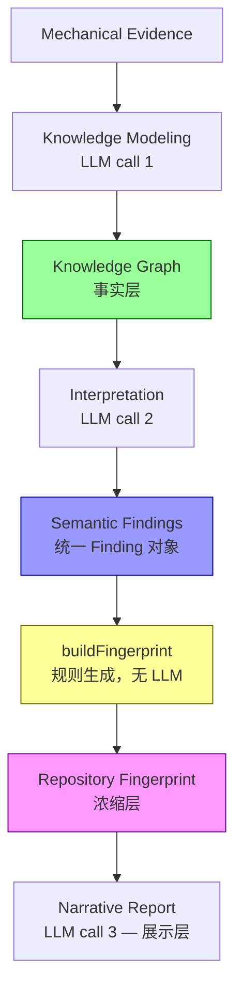

# Research Pipeline v2 — Implementation Checklist

## 目标

将 Pipeline 从 `Evidence → LLM(1 call) → Report` 升级为 3 层 LLM + 1 层规则生成的分层推理。

**核心原则：不要过度设计。** 只保留 4 种核心数据结构，主线始终是 Repository Research，不是维护本体。

---

## 四种核心数据结构

```
Mechanical Evidence          (事实层 — 已有)
        │
        ▼
Knowledge Graph              (事实层 — Entity/Relationship/Attributes)
        │
        ▼
Semantic Findings            (解释层 — 统一 Finding 对象，type 区分)
        │
        ▼
Repository Fingerprint       (浓缩层 — 规则生成，不单独 LLM)
        │
        ▼
Narrative Report             (展示层 — 只是 Renderer)
```

**设计约束**：
- Knowledge Graph **只描述事实和关系**，不掺杂评价（Leverage 不放这里）
- Semantic Findings **统一采用一种 `Finding` 结构**，通过 `type` 字段区分，不按类型拆成多个异构数组
- Repository Fingerprint **是 Derived Metadata**，由 `buildFingerprint(kg, findings)` 规则生成，不单独消耗 LLM 调用
- Narrative Report **只是 Renderer**，不再承担推理职责
- 所有 Schema 带 `version` 字段，避免未来升级时全部 prompt 坏掉
- **不要向 Palantir Ontology 演进** — 主线始终是 Mechanical Evidence → KG → Findings → Report，其它都是辅助

---

## 一、Schema 定义（带 version）

- [ ] 新建 `schemas.mjs`
  - [ ] 定义 `KNOWLEDGE_GRAPH_SCHEMA`（version: "0.1"）
  - [ ] 定义 `FINDING_SCHEMA`（统一 Finding 对象）
  - [ ] 定义 `FINGERPRINT_SCHEMA`
  - [ ] 定义 `EVIDENCE_REF_SCHEMA`（统一 Evidence 引用格式）
  - [ ] 实现 `validateKG(json)` — 校验 KG schema
  - [ ] 实现 `validateFindings(json)` — 校验 Findings schema
  - [ ] 实现 `validateFingerprint(json)` — 校验 Fingerprint schema

### Knowledge Graph Schema（事实层，不放评价）

```typescript
interface KnowledgeGraph {
  version: string;                 // "0.1"
  entities: {
    id: string;                    // "runtime", "llm-integration"
    type: "Capability";
    owns: string[];                // ["packages/agent/src/harness/"]
    attributes: {                  // 通用属性，避免不停扩展 Entity
      language?: string;           // "ts", "py", "rs"
      stability?: string;          // "stable", "experimental", "deprecated"
      visibility?: string;         // "public", "internal"
      confidence?: number;         // 0-1
      [key: string]: unknown;      // 允许扩展
    };
    evidence: EvidenceRef[];
  }[];
  relationships: {
    id: string;                    // "rel-001"
    from: string;                  // entity id
    to: string;                    // entity id
    type: "depends_on" | "uses" | "contains" | "exposes";
    evidence: EvidenceRef[];
  }[];
  metadata: {
    evolution: {
      trend: string;               // "Registry → Runtime → Plugin"
      evidence: EvidenceRef;
      direction: "forward" | "deprecated";
    }[];
  };
}
```

**注意**：
- `leverage` **不在 KG 中** — Leverage 是评估，不是事实，移到 Semantic Findings
- `evolution` **降级为 metadata** — 不是顶级 entity，是图的元信息
- KG 只保留：Entity / Relationship / Attributes / Evolution(metadata)
- **Entity 增加 `attributes`** — 通用属性容器（language/stability/visibility/confidence），避免不停扩展 Entity 字段

### EvidenceRef — 统一 Evidence 引用格式

```typescript
interface EvidenceRef {
  id: string;                      // "ev-001"
  kind: "code" | "test" | "config" | "commit" | "readme" | "adr" | "rfc" | "issue" | "metric" | "graph";
  path?: string;                   // 文件路径
  symbol?: string;                 // 函数/类/模块名
  commit?: string;                 // commit hash
  excerpt?: string;                // 代码/文本片段（≤200 字符）
  score?: number;                  // 0-1，证据强度
}
```

**为什么统一**：
以前 `evidence: { source: string; detail: string }` 无法区分来源类型，以后 README/Code/Commit/Issue/ADR 会越来越乱。现在一次统一，所有 evidence 都用 `EvidenceRef`。

### Semantic Findings Schema（统一 Finding 对象）

```typescript
interface SemanticFindings {
  version: string;                 // "0.1"
  findings: Finding[];
}

interface Finding {
  id: string;                      // "F-001"
  type: "constraint" | "decision" | "tension" | "omission" | "leverage" | "mental_model";
  title: string;                   // 一句话标题
  evidence: EvidenceRef[];         // 统一引用格式
  confidence: number;              // 0-1

  // — KG 引用：Finding 关联到 KG 中的实体和关系
  entity_refs?: string[];          // ["provider-runtime", "llm-adapter"]
  relationship_refs?: string[];    // ["rel-001", "rel-003"]

  // type-specific fields (optional):
  // — constraint
  drives?: string[];               // 哪些 decision 被这个 constraint 驱动

  // — decision (Intent 合并到 Decision，不单独存在)
  intent?: string;                 // "Future providers"
  time_horizon?: "immediate" | "near-term" | "long-term" | "temporary";
  tradeoff?: string;               // 选这个放弃了什么
  alternatives?: string[];         // 备选方案

  // — tension
  left?: string;                   // "Runtime simplicity"
  right?: string;                  // "Extension flexibility"

  // — omission
  reason?: string;                 // "Prefer explicit imports"
  philosophy?: string;             // "Convention over framework"

  // — leverage
  blast_radius?: number;           // fan-in count
  recovery_cost?: "low" | "medium" | "high";

  // — mental_model
  concepts?: {
    concept: string;               // "Conversation", "Provider", "Runtime"
    owns: string[];                // ["Messages"]
    responsibility: string;
    boundary: string;
  }[];
}
```

**关键设计**：
- **Intent 不单独 Schema** — Intent 是 Decision 的一个字段（`intent` + `time_horizon`），不是独立对象
- **Mental Model 不输出 layers** — 输出 `concepts[]`（concept / owns / responsibility / boundary），不是 `["Presentation", "Runtime", ...]`
- **Leverage 在 Semantic Findings 中** — 作为 `type: "leverage"` 的 Finding，不在 KG 中
- **统一对象** — 以后新增 Security / Performance / Reliability 只需新增一种 Finding type，不用修改 Schema 和 Pipeline
- **Finding 引用 KG** — `entity_refs` / `relationship_refs` 让 Finding 关联到 KG 实体，形成真正的知识图谱：点击 Capability → 所有相关 Findings 自动出现

### Repository Fingerprint Schema（浓缩层，规则生成）

```typescript
interface RepositoryFingerprint {
  version: string;                 // "0.1"
  style: string;                   // "Functional", "OOP", "Mixed"
  architecture: string;            // "Capability-oriented", "Layered", "Plugin"
  evolution: string;               // "Active Migration", "Stable", "Early"
  domain: string;                  // "Coding Agent", "Database", "Compiler"
  maturity: string;                // "Production", "Early", "Experimental"
  complexity: string;              // "High", "Medium", "Low"
  engineering_taste: string;       // "Minimalistic", "Enterprise", "Academic"
}
```

**Fingerprint 是 Derived Metadata，不单独 LLM**：
- `complexity` ← entity 数量 + relationship 数量 + dependency depth
- `maturity` ← ADR 存在性 + CI 配置 + test 数量 + release 数量
- `architecture` ← entity 数量 > 8 → "Capability-oriented"；plugin 目录存在 → "Plugin"
- `style` ← 主要语言 + 代码模式（class vs function 比例）
- `evolution` ← git history 分析（recent commits 模式）
- `domain` ← 从 README/package.json 关键词推断
- `engineering_taste` ← **唯一可能需要 LLM 的字段**，可在 Interpretation stage 顺带生成

---

## 二、Document Discovery（不是 README Discovery）

- [ ] 修改 `hybrid-pipeline.mjs`
  - [ ] 新增 `discoverDocuments(repoPath)` 函数
    - [ ] 按优先级搜索设计文档：
      1. `adr/` / `docs/adr/` — Architecture Decision Records
      2. `rfc/` / `docs/rfc/` — Request for Comments
      3. `architecture.md` / `docs/architecture.md` / `ARCHITECTURE.md`
      4. `docs/design/` — 设计文档目录
      5. `README.md` — 最后才看 README
    - [ ] 每个找到的文档提取前 2000 字符
    - [ ] 总量控制在 5000 字符以内
    - [ ] 返回 `[{ path, priority, content }]`
  - [ ] 在 `buildJSONEvidenceBrief()` 中新增 `brief.documents` 字段

**为什么不是只读 README**：
很多仓库的 README 只有 Badge + Install + Quick Start，真正的架构信息在 `docs/`、`adr/`、`rfcs/` 里。Document Discovery 按优先级搜索，ADR > RFC > architecture.md > docs/design > README。

---

## 三、Knowledge Modeling Stage（第一层推理，原 Discovery）

### 3.1 Knowledge Modeling Prompt

- [ ] 新建 `prompts/01-modeling.md`
  - [ ] 角色：知识建模专家，从机械证据抽象 Capability Graph，**禁止推断意图**
  - [ ] 输入：JSON Evidence Brief + Documents
  - [ ] 输出：Knowledge Graph JSON
  - [ ] 任务 1 — **Capability Modeling**
    - [ ] 将 package graph 转换为 capability graph
    - [ ] 示例：`packages/ai` → `"LLM Integration"`，`packages/storage` → `"Persistence"`，`packages/tui` → `"Presentation"`
    - [ ] 输出：`entities[]`（id / type / owns / attributes / evidence）
    - [ ] 约束：entity 数量 ≤ 20
  - [ ] 任务 2 — **Relationship Modeling**
    - [ ] 从 import graph 推断 capability 间的关系
    - [ ] 输出：`relationships[]`（id / from / to / type / evidence）
  - [ ] 任务 3 — **Evolution Modeling**
    - [ ] 从 git history 推断架构演进趋势
    - [ ] 不分析"现在是什么"，分析"未来是什么"
    - [ ] 输出：`metadata.evolution[]`（trend / evidence / direction）
  - [ ] 任务 4 — **Entity Attributes**
    - [ ] 为每个 entity 填充 `attributes`（language / stability / visibility / confidence）
  - [ ] **禁止**：推断"为什么这样设计"（那是 Interpretation 层的事）
  - [ ] **禁止**：输出 Leverage（那是评估，不是事实）
  - [ ] 约束：输出必须是合法 JSON，带 `version: "0.1"`
  - [ ] 约束：所有 evidence 使用 `EvidenceRef` 格式
  - [ ] Anti-fabrication：禁止编造不在 evidence brief 中的文件路径或数字

### 3.2 Knowledge Modeling Pipeline 实现

- [ ] 修改 `hybrid-pipeline.mjs`
  - [ ] 新增 `runModelingStage(evidenceBrief, documents, opts)` 函数
    - [ ] 读取 `prompts/01-modeling.md` 模板
    - [ ] 拼接 evidenceBrief JSON + documents + prompt
    - [ ] 调用 `invokeLLMJSON()` （JSON 模式）
    - [ ] 调用 `validateKG()` 校验输出
    - [ ] 返回 KnowledgeGraph 对象
  - [ ] 新增 `buildModelingInput(evidenceBrief)` — 精简 evidence brief

### 3.3 Knowledge Modeling Stage Quality Gate

- [ ] 在 `runModelingStage()` 中实现
  - [ ] Schema validation — KG 必须通过 `validateKG()`
  - [ ] Entity 命名检查 — entity id 不应是 package 路径（如 "packages/ai" → 应为 "LLM Integration"）
  - [ ] Relationship 完整性 — 每个 relationship 的 from/to 必须引用存在的 entity id
  - [ ] Evidence 格式检查 — 所有 evidence 必须是 `EvidenceRef` 格式（有 id / kind / path 或 excerpt）

---

## 四、Interpretation Stage（第二层推理）

### 4.1 Interpretation Prompt

- [ ] 新建 `prompts/02-interpretation.md`
  - [ ] 角色：解释专家，**允许推断意图**，但必须基于 Knowledge Graph
  - [ ] 输入：Knowledge Graph JSON + Documents + Evidence Brief（精简）
  - [ ] 输出：Semantic Findings JSON（统一 Finding 对象数组）
  - [ ] 任务 1 — **Constraint Discovery**（`type: "constraint"`）
    - [ ] 不问 "What architecture is this?"
    - [ ] 改问 "What engineering constraints forced this design?"
    - [ ] 改问 "What alternatives appear intentionally avoided?"
    - [ ] 改问 "What assumptions does the author optimize for?"
  - [ ] 任务 2 — **Decision Reconstruction**（`type: "decision"`，Intent 合并到这里）
    - [ ] 不问 "Why use Factory?"
    - [ ] 改问 "What future evolution does this decision enable?"
    - [ ] 每个 Decision 包含：`intent` + `time_horizon` + `tradeoff` + `alternatives`
    - [ ] 示例：Provider Factory → `intent: "Future providers", time_horizon: "long-term"`
    - [ ] 示例：compat layer → `intent: "Migration", time_horizon: "temporary"`
  - [ ] 任务 3 — **Mental Model Reconstruction**（`type: "mental_model"`）
    - [ ] Prompt："Imagine you are the original maintainer. Explain how you mentally divide the system."
    - [ ] **不输出 layers**，输出 `concepts[]`（concept / owns / responsibility / boundary）
    - [ ] 示例：`{ concept: "Conversation", owns: ["Messages"], responsibility: "Manages dialogue state", boundary: "Separated from tool execution" }`
  - [ ] 任务 4 — **Design Tension**（`type: "tension"`）
    - [ ] 识别对立的设计力量
    - [ ] 每个 tension 包含：`left` + `right` + `confidence` + `evidence`
  - [ ] 任务 5 — **Deliberate Omission**（`type: "omission"`）
    - [ ] Prompt："What common engineering techniques are deliberately absent? Why?"
    - [ ] 每个 omission 包含：`avoided` + `reason` + `philosophy`
  - [ ] 任务 6 — **Leverage Analysis**（`type: "leverage"`）
    - [ ] 从依赖图评估：删除每个关键模块会断什么
    - [ ] 每个 leverage 包含：`blast_radius` + `recovery_cost`
    - [ ] **Leverage 在这里**，不在 KG 中（Leverage 是评估，不是事实）
  - [ ] 任务 7 — **Engineering Taste**（顺带生成，用于 Fingerprint）
    - [ ] 输出一个 `engineering_taste` 字符串（"Minimalistic" / "Enterprise" / "Academic"）
    - [ ] 放在 `type: "mental_model"` 的 Finding 的 `attributes.engineering_taste` 中
    - [ ] 这样 Fingerprint 的规则生成可以直接读取，不需要单独 LLM
  - [ ] 约束：所有输出统一为 `Finding[]`，通过 `type` 字段区分
  - [ ] 约束：每个 Finding 必须包含 `entity_refs` 或 `relationship_refs`（关联到 KG）
  - [ ] 约束：所有 evidence 使用 `EvidenceRef` 格式
  - [ ] Anti-fabrication：所有 Finding 必须引用 KG 或 Documents 中的具体证据

### 4.2 Interpretation Pipeline 实现

- [ ] 修改 `hybrid-pipeline.mjs`
  - [ ] 新增 `runInterpretationStage(knowledgeGraph, documents, evidenceBrief, opts)` 函数
    - [ ] 读取 `prompts/02-interpretation.md` 模板
    - [ ] 拼接 Knowledge Graph JSON + documents + prompt
    - [ ] 调用 `invokeLLMJSON()` （JSON 模式）
    - [ ] 调用 `validateFindings()` 校验输出
    - [ ] 返回 SemanticFindings 对象

### 4.3 Interpretation Stage Quality Gate

- [ ] 在 `runInterpretationStage()` 中实现
  - [ ] Evidence coverage — 每个 Finding 必须有 ≥1 条 `EvidenceRef`
  - [ ] KG 引用检查 — 每个 Finding 必须有 `entity_refs` 或 `relationship_refs`
  - [ ] Contradiction check — 如果两个 Finding 互相矛盾，标注（不删除，保留竞争解释）
  - [ ] Confidence sanity — confidence 在 0-1 范围内

---

## 五、Repository Fingerprint（规则生成，不单独 LLM）

### 5.1 Fingerprint 规则生成实现

- [ ] 修改 `hybrid-pipeline.mjs`
  - [ ] 新增 `buildFingerprint(kg, findings, evidenceBrief)` 函数
    - [ ] `complexity` ← 规则计算：
      - entity 数量 + relationship 数量 + dependency depth
      - > 50 → "High"，20-50 → "Medium"，< 20 → "Low"
    - [ ] `maturity` ← 规则计算：
      - ADR 存在 + CI 配置 + test 数量 + release 数量
      - 有 ADR + 有 CI + tests > 50 → "Production"
      - 有 CI + tests > 10 → "Early"
      - 否则 → "Experimental"
    - [ ] `architecture` ← 规则计算：
      - entity 数量 > 8 → "Capability-oriented"
      - 有 plugin 目录 → "Plugin"
      - 有明确分层 → "Layered"
      - 否则 → "Monolith"
    - [ ] `style` ← 规则计算：
      - 主要语言 + class vs function 比例
      - function > 70% → "Functional"
      - class > 70% → "OOP"
      - 否则 → "Mixed"
    - [ ] `evolution` ← 规则计算：
      - recent commits 模式（refactor/feat/breaking 比例）
      - breaking changes > 20% → "Active Migration"
      - feat > 50% → "Active Development"
      - 否则 → "Stable"
    - [ ] `domain` ← 规则计算：
      - 从 README/package.json 关键词推断
      - 匹配 "agent" → "Coding Agent"
      - 匹配 "database" → "Database"
      - 匹配 "compiler" → "Compiler"
    - [ ] `engineering_taste` ← 从 Findings 读取：
      - 从 `type: "mental_model"` 的 Finding 的 `attributes.engineering_taste` 读取
      - 如果不存在，默认 "Unknown"
    - [ ] 调用 `validateFingerprint()` 校验输出
    - [ ] 返回 Fingerprint 对象

**为什么 Fingerprint 不单独 LLM**：
Fingerprint 基本都是 KG + Findings 的 `reduce()`。很多字段可以直接规则生成（complexity/maturity/architecture/style/evolution/domain），真正需要 LLM 判断的只有 `engineering_taste`，可以在 Interpretation stage 顺带生成。不值得再消耗一次 LLM 调用。

### 5.2 Fingerprint Quality Gate

- [ ] 在 `buildFingerprint()` 中实现
  - [ ] Schema validation — Fingerprint 必须通过 `validateFingerprint()`
  - [ ] 一致性检查 — Fingerprint.domain 应与 KG entities 一致
  - [ ] 无 "Unknown" 字段 — 如果规则无法判断，默认值不应是 "Unknown"（应有 fallback）

---

## 六、Narrative Report Stage（展示层，只是 Renderer）

### 6.1 Report Prompt 重写

- [ ] 重写 `prompts/07-report-writer.md`
  - [ ] 删除所有对已删除章节的引用（§A.4 / §A.5 / §2.7 / §2.8 / §2.9 / §2.10 / §5.5 / §5.5b / §5.6）
  - [ ] 删除所有对已删除文件的引用（00-research-questions.md / 01-hypotheses.md 等）
  - [ ] 删除 Anti-Fabrication 中对 Finding ID 的引用（`[F-001]` 等）— 改为引用统一 Finding 对象的 `id` 字段
  - [ ] 删除 C9/C10 相关指令
  - [ ] 新输入：Knowledge Graph + Semantic Findings + Repository Fingerprint + Evidence Brief（精简）
  - [ ] 新报告结构（12 sections）：
    1. [ ] **Repository Mental Model** — 来自 `Finding(type=mental_model).concepts`
    2. [ ] **Design Philosophy** — 来自 `Finding(type=omission)` + Fingerprint.engineering_taste
    3. [ ] **Engineering Constraints** — 来自 `Finding(type=constraint)`
    4. [ ] **Capability Map** — 来自 KG.entities + KG.relationships
    5. [ ] **Architecture** — 来自 KG + Evidence Brief
    6. [ ] **Evolution** — 来自 KG.metadata.evolution
    7. [ ] **Key Decisions** — 来自 `Finding(type=decision)`（含 intent + tradeoff）
    8. [ ] **Design Tensions** — 来自 `Finding(type=tension)`
    9. [ ] **Architectural Leverage** — 来自 `Finding(type=leverage)`
    10. [ ] **Patterns Worth Reusing** — 从 Findings 中提炼
    11. [ ] **Risks** — 跨层综合
    12. [ ] **Lessons** — 跨层综合 + Fingerprint
  - [ ] 保留 Evidence Quality 标注（Verified / Partially Verified / Documentation Only）
  - [ ] 保留 Unknown 主动分类（Need Reading / Need External Evidence / Impossible to Verify）

### 6.2 Report Stage 实现

- [ ] 修改 `hybrid-pipeline.mjs`
  - [ ] 新增 `runNarrativeStage(kg, findings, fingerprint, evidenceBrief, opts)` 函数
    - [ ] 读取 `prompts/07-report-writer.md`
    - [ ] 拼接 KG + Findings + Fingerprint + Evidence Brief + prompt
    - [ ] 调用 `invokeLLM()` （markdown 模式）
    - [ ] 返回 report 文本

### 6.3 Narrative Stage Quality Gate

- [ ] 在 `runNarrativeStage()` 中实现
  - [ ] Narrative check — 报告是否包含全部 12 sections 的标题
  - [ ] Evidence traceability — 报告中的 Claim 是否可追溯到 Finding 或 KG
  - [ ] Fingerprint consistency — 报告内容是否与 Fingerprint 一致

---

## 七、Pipeline 编排 + CLI

### 7.1 Pipeline 编排

- [ ] 修改 `hybrid-pipeline.mjs` 的 `runHybridPipeline()`
  - [ ] 改为 3 LLM + 1 规则 的 4-stage 编排：
    ```
    Stage 0: Mechanical Analyzers (existing, unchanged)
    Stage 1: Knowledge Modeling → Knowledge Graph (LLM call 1)
    Stage 2: Interpretation → Semantic Findings (LLM call 2)
    Stage 3: Fingerprint → buildFingerprint(kg, findings) (规则生成，无 LLM)
    Stage 4: Narrative Report (LLM call 3)
    ```
  - [ ] 新增 `--stage=modeling|interpretation|fingerprint|report|all` flag
  - [ ] 错误处理：如果 Modeling 产出无效 KG，回退到旧 pipeline 并警告

### 7.2 CLI 修复

- [ ] 修改 `research-repo.mjs`
  - [ ] 修复 `hybrid` 命令的 outputDir 参数——第二位置参数作为输出目录
    - [ ] 如果指定 outputDir：写入 `{outputDir}/report.md` + `{outputDir}/knowledge-graph.json` + `{outputDir}/findings.json` + `{outputDir}/fingerprint.json`
    - [ ] 如果未指定 outputDir：输出到 stdout（保持兼容）
  - [ ] 新增 `modeling` 子命令 — 只运行 Modeling stage，输出 KG JSON

### 7.3 分层流程图



---

## 八、推理分层契约

### 8.1 Knowledge Modeling Stage 契约

- [ ] 在 `prompts/01-modeling.md` 中明确声明：
  - [ ] **输入**：AST / 依赖 / Git / Metrics / Documents
  - [ ] **输出**：Entity / Relationship / Attributes / Evolution(metadata)
  - [ ] **禁止**：推断意图、输出 Leverage、输出评价
  - [ ] **允许**：从结构推断能力归属（"packages/ai 拥有 LLM Integration capability"）
  - [ ] **约束**：所有 evidence 使用 `EvidenceRef` 格式

### 8.2 Interpretation Stage 契约

- [ ] 在 `prompts/02-interpretation.md` 中明确声明：
  - [ ] **输入**：Knowledge Graph + Documents + Evidence Brief
  - [ ] **输出**：统一 Finding 对象（constraint / decision / tension / omission / leverage / mental_model）
  - [ ] **允许**：推断意图
  - [ ] **前提**：所有推断必须建立在已验证的 Knowledge Graph 之上
  - [ ] **约束**：每个 Finding 必须包含 `entity_refs` 或 `relationship_refs`（关联到 KG）
  - [ ] **约束**：所有 evidence 使用 `EvidenceRef` 格式
  - [ ] **禁止**：从零散代码直接跳到全局结论（必须经过 KG 中间层）
  - [ ] **禁止**：输出新的 Capability 或 Relationship（那是 Modeling 层的事）

### 8.3 每层 Quality Gate

- [ ] Modeling：Schema Validation（KG 通过 `validateKG()`）+ Entity 命名检查 + Evidence 格式检查
- [ ] Interpretation：Evidence Coverage（每个 Finding 有 ≥1 条 `EvidenceRef`）+ KG 引用检查 + Contradiction Check
- [ ] Fingerprint：Schema Validation + 一致性检查（无 "Unknown" 字段）
- [ ] Narrative：Narrative Check（12 sections 完整性）+ Evidence Traceability + Fingerprint Consistency

---

## 九、测试

### 9.1 单元测试

- [ ] 新建 `__tests__/schemas.test.mjs`
  - [ ] 测试 `validateKG()` — 合法 KG 通过
  - [ ] 测试 `validateKG()` — 缺少必填字段时失败
  - [ ] 测试 `validateKG()` — entity 数量超限时失败
  - [ ] 测试 `validateKG()` — KG 中包含 leverage 字段时失败（Leverage 不应在 KG 中）
  - [ ] 测试 `validateKG()` — evidence 不是 `EvidenceRef` 格式时失败
  - [ ] 测试 `validateFindings()` — 合法 Findings 通过
  - [ ] 测试 `validateFindings()` — Finding 缺少 evidence 时失败
  - [ ] 测试 `validateFindings()` — Finding 缺少 `entity_refs` / `relationship_refs` 时失败
  - [ ] 测试 `validateFindings()` — 所有 type 的 Finding 都能通过
  - [ ] 测试 `validateFingerprint()` — 合法 Fingerprint 通过

### 9.2 Fingerprint 规则生成测试

- [ ] 新建 `__tests__/fingerprint.test.mjs`
  - [ ] 测试 `buildFingerprint()` — entity > 50 → complexity = "High"
  - [ ] 测试 `buildFingerprint()` — 有 ADR + 有 CI + tests > 50 → maturity = "Production"
  - [ ] 测试 `buildFingerprint()` — entity > 8 → architecture = "Capability-oriented"
  - [ ] 测试 `buildFingerprint()` — 从 Findings 读取 engineering_taste
  - [ ] 测试 `buildFingerprint()` — 无 KG 时不崩溃（返回默认值）

### 9.3 Pipeline Stage 测试

- [ ] 新建 `__tests__/pipeline-stages.test.mjs`
  - [ ] 测试 `runModelingStage()` — mock LLM 返回合法 KG JSON
  - [ ] 测试 `runModelingStage()` — mock LLM 返回无效 JSON 时抛错
  - [ ] 测试 `runInterpretationStage()` — mock LLM 返回合法 Findings JSON
  - [ ] 测试 `runInterpretationStage()` — 缺少 documents 时仍能运行
  - [ ] 测试 `runNarrativeStage()` — mock LLM 返回 markdown 报告
  - [ ] 测试 `runHybridPipeline()` — 4-stage 端到端（mock LLM）

### 9.4 行为测试

- [ ] 修改 `skill-test/tests/behavior/`
  - [ ] 新增：验证 KG 中 entity id 不是 package 路径
  - [ ] 新增：验证 KG 中不包含 leverage 字段
  - [ ] 新增：验证 KG 中 evidence 是 `EvidenceRef` 格式（有 id / kind）
  - [ ] 新增：验证 Findings 是统一数组（不是分类型的异构数组）
  - [ ] 新增：验证 Finding 有 `entity_refs` 关联到 KG
  - [ ] 新增：验证 Mental Model 输出 concepts 而非 layers
  - [ ] 新增：验证 Fingerprint 由规则生成（不调用 LLM）
  - [ ] 新增：验证报告中不引用已删除的章节

### 9.5 回归测试

- [ ] 更新 `baseline-metrics.json`
- [ ] 更新 golden fixtures — 新报告结构（12 sections）
- [ ] 确保所有 6 层测试通过

---

## 十、文档更新

- [ ] 更新 `SKILL.md`
  - [ ] Pipeline 架构描述改为 4-stage（Modeling / Interpretation / Fingerprint / Narrative）
  - [ ] 新增分层说明（事实层 / 解释层 / 浓缩层 / 展示层）
  - [ ] 新增统一 Finding 对象说明
  - [ ] 新增 EvidenceRef 统一格式说明
- [ ] 更新 `DESIGN.md`
  - [ ] 新增设计决策：为什么 Leverage 不在 KG 中（评估 ≠ 事实）
  - [ ] 新增设计决策：为什么 Evolution 降级为 metadata（不是 entity）
  - [ ] 新增设计决策：为什么 Intent 合并到 Decision（不单独 Schema）
  - [ ] 新增设计决策：为什么 Mental Model 输出 concepts 而非 layers
  - [ ] 新增设计决策：为什么统一 Finding 对象（Ontology 思想）
  - [ ] 新增设计决策：为什么 Schema 带 version
  - [ ] 新增设计决策：Document Discovery 优先级
  - [ ] 新增设计决策：为什么 Fingerprint 不单独 LLM（规则生成 + Derived Metadata）
  - [ ] 新增设计决策：为什么 KG 增加 Attributes（避免不停扩展 Entity 字段）
  - [ ] 新增设计决策：为什么 Evidence 统一为 EvidenceRef（避免来源类型混乱）
  - [ ] 新增设计决策：为什么 Finding 引用 KG（entity_refs / relationship_refs 形成知识图谱）
  - [ ] 新增设计决策：为什么改名 Discovery → Knowledge Modeling（更准确描述"建立知识模型"）
  - [ ] 新增设计决策：不要向 Palantir Ontology 演进（主线始终是 Repository Research）
  - [ ] 更新 Pipeline 架构图（Mermaid）
  - [ ] 更新 Working Folder 结构（新增 knowledge-graph.json / findings.json / fingerprint.json）
- [ ] 更新 `CHANGELOG.md`
  - [ ] 记录 Pipeline v2 升级
- [ ] 更新 `AGENTS.md` Maintenance Log

---

## 十一、验证

- [ ] 在 `ref-only/pi` 上运行新 pipeline，对比报告质量
- [ ] 在 `ref-only/dbeaver` 上运行新 pipeline，验证大型仓库不崩溃
- [ ] 在 `ref-only/litehybrid` 上运行新 pipeline，验证 Rust 仓库兼容
- [ ] 运行全部测试：`pnpm test` + `pnpm test:skill` + `pnpm test:e2e` + `pnpm test:e2e:live`

---

## 实施顺序

```
阶段 1 (Schema)        → schemas.mjs + 统一 Finding + EvidenceRef + version
阶段 2 (Doc Discovery) → discoverDocuments() + 文档优先级搜索
阶段 3 (Modeling)      → 01-modeling.md + runModelingStage() + KG validation
阶段 4 (Interpretation) → 02-interpretation.md + runInterpretationStage() + Finding validation
阶段 5 (Fingerprint)    → buildFingerprint() 规则生成（无 LLM）
阶段 6 (Narrative)      → 重写 07-report-writer.md + runNarrativeStage()
阶段 7 (编排+CLI)       → runHybridPipeline() 4-stage + outputDir 修复
阶段 8 (测试)           → 单元 + 行为 + 回归
阶段 9 (文档)           → SKILL.md + DESIGN.md + CHANGELOG.md + AGENTS.md
阶段 10 (验证)          → ref-only 真实仓库 + 全测试
```

每个阶段完成后运行 `pnpm test` 确保不回归。
