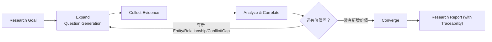

# Enterprise Research Agent

完成**研究任务（Research Task）**——围绕证据（Evidence）而非文档（Document），通过 Investigation 与 Analysis 两个阶段，由 Question Tree + Decision Loop 驱动，生成可追溯、可验证的研究报告。

> **Research = Investigation + Analysis**
> - **Investigation（调查）**：收集事实——Evidence Collection, Identity Resolution, Evidence Correlation, Question Generation
> - **Analysis（分析）**：推导结论——Gap Analysis, Contradiction Detection, Confidence Assessment, Claim Construction

**设计思路**：Hybrid Architecture —— 确定性 Research Backbone 用 JS 执行，语义判断与推理用 LLM 执行。所有状态集中在 **ResearchSession** 一个对象中，作为贯穿全流程的工作上下文（Research Context）。Question Tree 不是一次性规划，而是 **Evidence-driven 动态生长**；Decision Loop 用**确定性函数**判断 Continue/Finish，无需 LLM/ML/Tree Search。

## 何时调用

- 用户说"研究 X / Research X / Investigate X / 调查 X"，且 X 是一个**对象**（Vendor / Regulation / Application / Capability / Project）而非单一问题
- 用户问"X 影响哪些系统 / X 涉及哪些团队 / 我们是否已经用过 X"——这类问题需要跨多源信息综合才能回答
- 用户希望最终输出是**带证据链的报告**，而不是一组搜索结果或一段总结
- 用户能接受 Agent 主动指出"信息缺口"与"证据冲突"作为研究发现
- 用户希望每条结论都能**追溯**到证据来源（Traceability）

## 何时不调用

- 用户只想查一个具体文档 → 直接用 Search / 文档检索
- 用户只想基于某段给定文本回答问题 → 用 RAG / 阅读理解
- 用户问的是事实性单点问题（"今天周几""X 的官网是什么"）→ 直接回答
- 任务只需单次 LLM 调用就能完成，不需要跨系统收集证据

## Why not RAG？

RAG 回答 *what a document says*，Research Agent 回答 *what is actually going on across the enterprise*。

| 维度 | RAG | Research Agent |
|------|-----|---------------|
| 目标 | 基于文档回答 | 完成研究任务，输出可追溯报告 |
| 中心 | 文档片段 | 实体和证据 |
| 流程 | 一次性检索回答 | Question Tree 动态生长 + Decision Loop 收敛 |
| 验证 | 用户自行判断 | Claim Coverage 校验（≥0.9） |

## 核心术语

- **Research** = Investigation（收集事实）+ Analysis（推导结论）
- **Question Tree**：Evidence-driven 动态问题树
- **Claim**：一等结论对象（含 evidenceIds / reasoning / verified）
- **Claim Coverage Ratio**：(有证据的 Claim) / 总 Claim，目标 ≥ 0.9
- **Traceability Layer**：报告中的可追溯层（coverage + unverified claims）

---

## Investigation Workflow (Expand-Converge)

```mermaid
flowchart LR
    Question --> Research_Planning
    Research_Planning --> Evidence_Collection
    Evidence_Collection --> Identity_Resolution
    Identity_Resolution --> Evidence_Correlation
    Evidence_Correlation --> Question_Generation
    Question_Generation --> Decision
    Decision -->|Continue| Evidence_Collection
    Decision -->|Finish| Analysis
    subgraph Analysis
        GA[Gap Analysis]
        CD[Contradiction Detection]
        CA[Confidence Assessment]
        CC[Claim Construction]
    end
    Analysis --> EV[External Verification]
    EV --> Research_Report
```



### Expand 阶段（Investigation）

| 阶段 | LLM 工作 | JS 工作 |
|------|---------|---------|
| **Planning** | 拆解研究目标为骨架子任务；预判可能涉及的实体类型 | `list-ontology` 提供 entity types / expectedRelations；`add-plan-item` 记录子任务 |
| **Question Generation** | 由 Evidence 触发新问题；每个问题受 Goal-driven / Ontology-guided / Novelty-seeking 约束 | `add-question`（含 `--parent` / `--triggered-by-evidence` / `--triggered-by-entity`）；自动计算 depth |
| **Evidence Collection** | 解读每个数据源的内容，抽取 claim 与实体；判断 confidence；判定 `lastUpdated` | `add-evidence` 持久化（含 `claims` / `lastUpdated`）；`add-entity` 创建实体；`link-evidence` 绑定 |
| **Identity Resolution** | 判断"RiskConcile / riskconcile-api / RC / Vendor 28391"是否同一对象 | `find-entity` 查重；`resolve-identity` 合并并重新指向 relationships |
| **Evidence Correlation** | 推理两个实体之间的关系类型（subject_to / used_by / implemented_by） | `add-relationship` 做 Ontology 校验 + 去重 + 证据合并 |
| **Decision** | （无 LLM 工作——纯确定性） | `decide` 比较 snapshot diff：新 Entity/Relationship/Conflict/Gap → Continue；否则 Finish |

### Converge 阶段（Analysis）

| 阶段 | LLM 工作 | JS 工作 |
|------|---------|---------|
| **Gap Analysis** | 判断 gap 是补查 / 纳入发现 / 转为建议 | `analyze-gaps` 基于 Ontology 确定性计算 missing_property / missing_relation / no_evidence |
| **Contradiction Detection** | 判断冲突如何处理（进一步调查 / 标注 / 升级） | `analyze-contradictions` 基于 evidence.claims 确定性检测同实体的同属性冲突 |
| **Confidence Assessment** | 解读 confidence 因素，决定是否需要补证据 | `assess-confidence` 基于 evidence 数量 / source 权重 / cross validation / freshness / contradiction 确定性打分 |
| **Claim Construction** | 构造 Claim（fact / statistic / analysis / recommendation 等）；为每条 Claim 绑定 evidenceIds / reasoning | `add-claim` 校验 Claim 类型规则；`verify-claim` 标注验证状态；`coverage` 输出 Claim Coverage Ratio |

### External Verification

| 阶段 | LLM 工作 | JS 工作 |
|------|---------|---------|
| **External Verification** | 用 WebSearch / WebFetch 获取外部资料；判断与内部证据一致或冲突 | 与 Evidence Collection 相同（外部资料作为 `source=External` 等加入 graph） |

---

## Research Contract

第一步生成 **Research Contract**——研究范围、预期输出、证据要求，让用户确认后再开始。

**关键字段**：`question`（研究问题）、`scope`（范围）、`expectedOutput.type`、`evidenceRequirement`（minSources=3, primarySourceRatio=0.6, claimCoverageRatio=0.9）。

**为什么需要 Contract？** 避免研究跑偏（如用户想研究 AI Agent 架构，结果写成市场报告）。Contract 是第一道质量门。

**Agent 必须先 `set-contract`**，让用户确认后再 `set-budget`、`add-plan-item`。可通过 `--confirm` 一步完成。

---

## Research Budget

| 字段 | 默认值 | 说明 |
|------|-------|------|
| depth | 3 | Question Tree 最大深度 |
| maxQuestions | 40 | 问题数上限 |
| maxEvidence | 300 | 证据数上限 |
| timeLimitMinutes | 8 | 时间预算（分钟） |

Budget 是防止无限发散的硬约束。`check-budget` 实时输出 usage vs limit；`decide` 在超限时强制 Finish。

---

## Research Question Tree

### 5 原则

1. **Goal-driven**：每个问题必须服务于研究目标，无关问题直接剪掉
2. **Evidence-driven**：只有 Evidence 才能触发新问题，不是 LLM 幻想
3. **Ontology-guided**：只沿领域模型允许的关系扩展
4. **Novelty-seeking**：只有产生新内容（Entity/Relationship/Conflict/Gap）才继续
5. **Budget-aware**：受 depth/maxQuestions/maxEvidence/time 约束

### Question 字段

```typescript
interface ResearchQuestion {
  id: string;                      // q1, q2, ...
  text: string;
  parentId: string | null;         // null = root
  depth: number;                   // 0 = root
  status: 'open' | 'investigating' | 'answered' | 'pruned';
  triggeredByEvidenceId: string | null;  // Evidence-driven 的体现
  triggeredByEntityId: string | null;    // Evidence-driven 的体现
  planItemId: string | null;             // 与 plan 关联
  generatedEntityIds: string[];          // 答案产出的实体
  generatedRelationshipIds: string[];    // 答案产出的关系
  createdAt: ISO date;
  updatedAt: ISO date | null;
}
```

### Plan 与 Question Tree 的关系

| 概念 | 角色 | 时机 |
|------|------|------|
| **Plan** | 骨架（5-10 个高层子调查任务） | Phase 1 一次性生成 |
| **QuestionTree** | 活的 Investigation（每个新问题由 Evidence 触发） | 贯穿 Phase 2-4，持续生长 |

二者通过 `planItemId` 关联。Plan 是"我打算调查什么"，QuestionTree 是"我实际在调查什么"。

### 示例（Research RiskConcile）

```text
q1 (root, depth=0): "What is RiskConcile?"
  → answered: 触发 e1 (Vendor), ev1 (GitHub evidence)
  └─ q2 (depth=1, triggered by ev1): "Which applications use RiskConcile?"
       → answered: 触发 e2 (Application)
       ├─ q3 (depth=2, triggered by e2): "Which repository implements this app?"
       │    → answered: 触发 e3 (Repository), ev3
       │    └─ q4 (depth=3, triggered by ev3): "Which team owns the repo?"
       │         → investigating
       └─ q5 (depth=2, triggered by e2): "Any incidents on this app?"
            → open
```

Budget `depth=3` 会阻止 q4 之后继续向下展开。

---

## Decision Loop（Expand-Converge）



**Decision 函数**（纯确定性，不用 LLM）：比较 current snapshot 与 last snapshot，有新 Entity/Relationship/Conflict/Gap 或 confidence 低或有 open Question 则 Continue，否则 Finish；Budget 超限强制 Finish。

Decide 后会把当前 snapshot 写回 `session._lastSnapshot`，供下次 diff。每个 Investigation 循环末必须调用 `decide` 自检。

---

## Evidence Model

Research Agent 并不直接操作文档，而是操作 Evidence。每条 Evidence 是 Research Graph 的最小单元。

| 字段 | 类型 | 说明 |
|------|------|------|
| `id` | string | 自动生成（ev1, ev2, ...） |
| `source` | string | Connector Adapter 来源（GitHub / Jira / LeanIX / ServiceNow / Confluence / Vendor / Regulation / External / News / Academic / Web / ...） |
| `uri` | string | 原始位置（URL / 资源 ID） |
| `content` | string | 抽取内容（free text） |
| `confidence` | number 0–1 | LLM 判定的初始可信度 |
| `lastUpdated` | ISO date | **源数据的最后更新时间**（用于 Freshness 评估） |
| `extractedAt` | ISO date | LLM 抽取该 Evidence 的时间（自动） |
| `claims` | `[{property, value}]` | **结构化断言**，用于 Contradiction Detection |
| `metadata` | object | Connector Adapter 附加信息（free-form） |

**关键约束**：
- Evidence 必须有 `source` + (`uri` 或 `content`)
- `claims` 是 Contradiction Detection 的输入——LLM 抽取证据时，应同时给出结构化断言
- `lastUpdated` 影响 Confidence Assessment——超过 365 天的 evidence 会被扣分
- 每条 Evidence 必须可检索（`uri` 非空，除非 `content` 已自含上下文）

**为什么需要 claims？**
> Contradiction Detection 无法从 free-text content 确定性判断冲突。LLM 在抽取 Evidence 时同步给出 claims，JS 才能在同实体的同属性上确定性地发现"Team A vs Team B"冲突。

---

## Claim Model

Claim 是 Research Report 的最小结论单元，比 Evidence 更接近"判断"。Evidence 是事实片段，Claim 是基于证据的论断。

### Claim 字段

```typescript
interface Claim {
  id: string;                      // c1, c2, ...
  text: string;                    // Claim 文本（可被验证的判断）
  type: ClaimType;                 // fact | statistic | historical | expert_opinion | analysis | recommendation
  evidenceIds: string[];           // 支撑证据
  reasoning: string;               // 推理过程（analysis/recommendation 必须）
  confidence: number;              // 0-1
  supportingClaimIds: string[];    // 支撑该 Claim 的其他 Claim
  entityId: string | null;         // 关联实体
  verified: boolean;               // 是否已验证
  verificationNote: string;        // 验证说明
  createdAt: ISO date;
  updatedAt: ISO date | null;
}
```

### Claim 类型与证据要求（硬约束，由 `add-claim` + `validate-report` 强制）

| 类型 | 是否必须引用 evidence | 是否必须 reasoning | 典型场景 |
|------|--------------------|-------------------|---------|
| **fact** | ✅ 必须 | ❌ | "RiskConcile 被 RC Migration Tool 使用" |
| **statistic** | ✅ 必须 | ❌ | "Repo 有 142 commits" |
| **historical** | ✅ 必须 | ❌ | "2024 年 Q3 发生过 P1 事故" |
| **expert_opinion** | ✅ 必须 | ❌ | "Vendor CTO 表示路线图包含 X" |
| **analysis** | ✅ 必须 | ✅ 必须 | "LeanIX 与 GitHub owner 冲突暗示流程不一致" |
| **recommendation** | ❌ 可选 | ✅ 必须 | "解决 owner 冲突后再签 Contract" |

违反规则的 Claim 会在 `add-claim` 时直接报错（不允许创建），也会在 `validate-report` 时再次校验。

### Claim Coverage Ratio

> Research Agent 最大的问题不是搜索能力，而是：**从 Evidence 到 Claim 的跳跃不可见。**

所以 Skill 的核心指标应该不是 Answer Quality，而是：

```
Claim Coverage Ratio = (Claims with Evidence) / Total Claims
```

| 报告类型 | Coverage |
|---------|---------:|
| 普通 LLM 报告 | 30%–50% |
| RAG 报告 | 60%–80% |
| **Evidence-first Research Agent** | **90%+** |

`coverage` 命令实时输出 Coverage；`validate-report` 校验 `traceability.claimCoverageRatio ≥ contract.evidenceRequirement.claimCoverageRatio`（默认 0.9）。

---

## ResearchSession（Research Context）

核心对象：把所有概念自然串联起来的工作上下文。不引入数据库 / 状态机 / 框架，仅是一个逻辑模型 + JSON 持久化。

```typescript
interface ResearchSession {
  goal: string;                    // 研究目标
  contract: ResearchContract;      // 研究契约（用户确认）
  budget: ResearchBudget;          // 研究预算
  plan: PlanItem[];                // 骨架子任务（pending/in_progress/done/skipped）
  questionTree: QuestionTree;      // 动态问题树
  graph: EvidenceGraph;            // Working Memory（entities + relationships + evidence + aliases）
  claims: ClaimStore;              // Claim 一等对象存储
  findings: Finding[];             // 报告撰写时填充
  gaps: Gap[];                     // 由 analyze() 计算
  contradictions: Contradiction[]; // 由 analyze() 计算
  confidence: Confidence;          // 由 analyze() 计算
  report: ResearchReport;          // 最终报告（含 Traceability Layer）
  visitedSources: VisitedSource[]; // 已访问的 Connector Adapter
  pendingQuestions: string[];      // 自由文本开放问题（与 QuestionTree 互补）
  rejectedHypotheses: Rejected[];  // 已排除的假设（含排除理由）
  _lastSnapshot: Snapshot;         // 上次 decide() 的快照（用于 diff）
}
```

**Agent 永远知道"自己现在研究到哪里"**——这是 Deep Research 真正厉害的地方，不是 Graph，而是持续维护的 Research Context。

每个 Phase 结束后，LLM 应调用 `session-context` 查看：
- `contract`：契约是否确认 / Coverage 阈值
- `budget`：usage vs limit
- `planProgress`：plan 完成进度
- `questionTree`：total / open / investigating / answered / pruned / maxDepth
- `graph`：entities / evidence / relationships 数量
- `claims`：total / withEvidence / coverageRatio / verifiedRatio / unverifiedClaimIds
- `openGaps` / `openContradictions`：当前未解决的 Gap 与冲突
- `confidence`：整体可信度
- `pendingQuestions` / `rejectedHypotheses`：开放问题与已排除假设
- `lastSnapshot`：上次 decide 的快照

---

## Lightweight Research Ontology（Entity Types）

> "Ontology" 在本项目中仅出现一次：定义 entity types 的 schema。所有实例存在 EvidenceGraph 中。刻意轻量化——不做 OWL / RDF / SPARQL / Description Logic / Rule Engine。

每种 entity type 定义：
- `properties`：属性及其类型
- `requiredProperties`：Gap Analysis 会硬性提示缺失的必填属性
- `relations`：允许的关系类型及目标 entity type（Ontology 校验）
- `expectedRelations`：Gap Analysis 会软性提示缺失的预期关系

14 种 entity type（在 `research.mjs` 的 `ONTOLOGY` 常量中维护）：

| Entity Type | Description | Required | Expected Relations |
|-------------|-------------|----------|-------------------|
| Vendor | External supplier or service provider | website | used_by, contracted_by |
| Application | Business application or system | owner, lifecycle | owned_by, implemented_by |
| Repository | Source code repository | — | belongs_to |
| Team | Organizational team | name | — |
| Person | Individual person | email | — |
| Project | Initiative or delivery project | status | — |
| Capability | Business or technical capability | — | — |
| BusinessProcess | Business process | name | — |
| Regulation | Regulatory requirement or standard | jurisdiction | impacts |
| Control | Security or compliance control | — | — |
| Incident | Operational incident or outage | date | affects |
| Risk | Identified risk | — | — |
| Contract | Vendor or service contract | startDate | — |
| Document | Reference document or knowledge asset | url | — |

**重点永远是 Entity，不是 Ontology**。Ontology 只是定义"哪些 entity type 存在、它们能有哪些关系"，让 Gap Analysis、add-relationship 校验、Question Tree 的 Ontology-guided 扩展成为确定性计算。

> **扩展原则**：当业务确需新 entity type 时，在 `ONTOLOGY` 常量中添加 entry（description + properties + requiredProperties + relations + expectedRelations），无需修改其他代码——`validateRelation` / `analyzeGaps` / `list-ontology` 会自动适配。

---

## Evidence Graph（Working Memory）

EvidenceGraph 不是最终结果，是整个 Investigation 的 **Working Memory**。每次研究持续往里补充。

```mermaid
graph LR
    subgraph "Evidence Graph (Working Memory)"
        Entities["Entities (Map)"]
        Relationships["Relationships (Array)"]
        Evidence["Evidence (Map)"]
        Aliases["Aliases (Map)"]
    end
    Aliases -->|resolve name→entityId| Entities
    Evidence -->|evidenceIds[]| Entities
    Evidence -->|evidenceIds[]| Relationships
    Entities -->|from / to| Relationships
```

Graph 内部不区分证据来自哪个 Connector Adapter——所有数据统一映射为 entity + relationship + evidence。

### Canonical Identity（统一身份）

企业最大的困难不是数据不足，而是同一个对象在不同系统中表示完全不同：

| Connector Adapter | Representation |
|-------------------|---------------|
| Confluence | RiskConcile |
| GitHub | riskconcile-api |
| LeanIX | Vendor=RiskConcile |
| ServiceNow | Vendor ID 28391 |
| Jira | RC Migration |

**Identity Before Search**：先建立 canonical identity，再开展后续调查。这一步的重要性高于传统 RAG 中的向量检索。

`addEntity` 在创建时会自动通过 name/alias 查重并合并；`resolve-identity` 用于 LLM 显式判定多个 entityId 是同一对象后执行合并。

---

## Connector Adapter

Connector 在本项目中称为 **Connector Adapter**——每个 Adapter 把特定系统的原生数据统一输出为 Evidence：

```text
Raw (Confluence / GitHub / Jira / LeanIX / ServiceNow / ...)
        ↓
   Connector Adapter
        ↓
    Evidence (统一模型)
```

Research Workflow 根本不知道 Evidence 来自哪个 Connector。新增 Connector 只是扩展 Evidence 覆盖范围，不改变研究流程。

Adapter 在 LLM 端实现——LLM 调用 WebFetch / WebSearch / 现有 skills（如 lark-* / GitHub API）获取原始数据，然后调用 `add-evidence` 写入 graph。Adapter 的职责是"Raw → Evidence"的映射，不需要专门写代码。

---

## Research Rules（硬约束）

Skill prompt 中加入的硬约束，违反任一条都会在 `validate-report` 时报错：

1. **不创建无证据支撑的 fact/statistic/historical/expert_opinion claim** —— `add-claim` 直接拒绝
2. **每条 fact 必须有 claim_id + evidence_id + source_id** —— `keyFindings` 必须有 `evidenceIds` 或 `claimIds`
3. **证据不足时标注为 hypothesis** —— 用 `claim.verified=false` + `verificationNote` 标注
4. **不隐藏冲突证据** —— `conflicts` section 必填；`analyze-contradictions` 自动检测
5. **每个来源必须可检索** —— Evidence 必须有 `uri` 或 `content`
6. **区分 observed / inference / recommendation** —— Claim 类型对应：fact/statistic/historical/expert_opinion = observed；analysis = inference；recommendation = recommendation

---

## Script Integration Contract

> 当 `research.mjs` 可用时，**优先调用脚本维护 ResearchSession 状态，不要在 LLM 上下文中手工维护 JSON**。

### 分工原则

| 职责 | JS（research.mjs） | LLM |
|------|------|-----|
| Ontology schema 维护 | ✅（`ONTOLOGY` 常量） | |
| Entity type / relation 校验 | ✅（`validateEntityType` / `validateRelation`） | |
| EvidenceGraph 状态管理 | ✅（`EvidenceGraph` class） | |
| Evidence Model 字段（含 claims / lastUpdated） | ✅（`addEvidence`） | |
| Identity 自动查重与合并 | ✅（`addEntity` 自动合并同 name/alias） | ✅ 决策是否合并（`resolve-identity`） |
| **Research Contract 创建与确认** | ✅（`createContract` / `setContract` / `confirmContract`） | ✅ 与用户对齐 scope/expected output |
| **Research Budget 创建与检查** | ✅（`createBudget` / `checkBudget`） | ✅ 决策何时调整 |
| **Question Tree 状态管理** | ✅（`QuestionTree` class） | ✅ 生成问题文本 + 判断 triggeredBy |
| **Decision（Continue/Finish）** | ✅（`decide`，纯确定性 snapshot diff） | （不参与——纯 JS 计算） |
| **Claim 类型规则校验** | ✅（`addClaim` 拒绝违规） | ✅ 构造 Claim text + 选 type |
| **Claim Coverage 计算** | ✅（`ClaimStore.coverage`） | ✅ 解读并补证据 |
| Gap 计算 | ✅（`analyzeGaps`） | |
| Contradiction 计算（基于 claims） | ✅（`analyzeContradictions`） | ✅ 抽取 claims + 解读冲突 |
| Confidence 计算 | ✅（`assessConfidence` + `SOURCE_WEIGHTS`） | ✅ 解读 confidence 因素 |
| ResearchSession 生命周期 | ✅（`ResearchSession` class） | ✅ 决策何时更新 |
| Research Context 查询（`session-context`） | ✅ | ✅ 每个 Phase 后自检 |
| Report schema 校验（含 Traceability Layer + Claim 规则） | ✅（`validateReport`） | |
| Report 骨架生成（预填 supportingEvidence + conflicts + knowledgeGaps + confidence + traceability） | ✅（`reportTemplate`） | |
| Mermaid 导出 | ✅（`graphToMermaid`） | |
| 持久化（session file） | ✅（`saveSession` / `loadSession`） | |
| 研究规划（拆解子任务） | | ✅ |
| 问题生成（Evidence-driven） | | ✅ |
| 证据解读与 claims 抽取 | | ✅ |
| Claim 构造与类型选择 | | ✅ |
| Identity 合并决策 | | ✅ |
| 关联推理 | | ✅ |
| 冲突解读 | | ✅ |
| 报告撰写 | | ✅ |

### 命令行接口

**36 个命令**，按功能分组：

| 分组 | 命令 | 说明 |
|------|------|------|
| Session | `init`, `session-status`, `session-context` | 初始化与状态查询 |
| Contract/Budget | `set-contract`, `confirm-contract`, `set-budget`, `check-budget` | 契约与预算管理 |
| Plan | `add-plan-item`, `update-plan-item` | 规划任务 |
| Question Tree | `add-question`, `update-question`, `list-questions` | 动态问题树 |
| Context | `record-source`, `add-pending-question`, `reject-hypothesis` | 研究上下文 |
| Ontology | `list-ontology` | 实体类型查询 |
| Entity | `add-entity`, `find-entity`, `list-entities` | 实体管理 |
| Evidence | `add-evidence`, `link-evidence` | 证据管理 |
| Relationship | `add-relationship`, `resolve-identity` | 关系与身份合并 |
| Claim | `add-claim`, `verify-claim`, `link-claim-evidence`, `list-claims`, `coverage` | 结论管理 |
| Analysis | `analyze`, `analyze-gaps`, `analyze-contradictions`, `assess-confidence` | 分析计算 |
| Decision | `decide` | Expand-Converge 决策 |
| Report | `show-graph`, `report-template`, `validate-report` | 报告与可视化 |

**关键约束**：
- 所有命令接受 `--session <file>`（默认 `./research-session.json`）
- `add-relationship` 严格受 Ontology 校验
- `add-entity` 自动通过 name/alias 查重合并
- `add-evidence --claims` 是冲突检测输入，`--last-updated` 影响置信度
- `add-claim --type` 决定证据要求：fact/statistic/historical/expert_opinion 必须 `--evidence`；analysis 必须 `--evidence` + `--reasoning`；recommendation 必须 `--reasoning`
- `decide` 写回 `_lastSnapshot`，每次调用都会 save

---

## LLM Playbook

按以下 8 阶段执行研究任务。**每个阶段结束后用 `saveSession` 持久化 + `session-context` 自检"研究到哪里"**。

### Phase 0: Research Contract

输入：用户的自然语言研究目标。

LLM 工作：
1. 把用户目标转写为一个清晰的 Research Question（如 "Research RiskConcile" → "Research RiskConcile as a vendor: background, internal usage, contracts, risks"）
2. 推断 scope（industry / time_range / exclude）与 expectedOutput.type
3. 根据任务难度推断 evidenceRequirement（保守起步：min_sources=3, primary_source_ratio=0.6, claim_coverage_ratio=0.9）
4. 调用 `init --goal "<研究目标>"`
5. 调用 `set-contract --question "<Question>" --scope '<json>' --min-sources N --claim-coverage-ratio 0.9 --confirm`
6. **向用户展示 Contract，请用户确认**（如果未用 `--confirm`，则等用户回复后调用 `confirm-contract`）

**输出**：session.contract.confirmedAt 非空。

### Phase 1: Planning + Budget + Root Questions

输入：confirmed Contract。

LLM 工作：
1. 调用 `set-budget` 设定 Budget（默认即可，复杂任务可调大 depth/maxQuestions）
2. 调用 `list-ontology` 查看可用 entity types 与 expectedRelations，作为规划参考
3. 把 Contract.question 拆解为 5–10 个**骨架子任务**（plan items）
4. 为每个子任务调用 `add-plan-item --objective "..."`
5. 为每个 plan item 创建对应的 root question：`add-question --text "<Root Question>" --plan-item <id>`
6. **不要一次性生成所有子问题**——QuestionTree 是 Evidence-driven 动态生长的，Phase 1 只创建 root

**输出**：session.plan + session.questionTree（仅 root 节点）。

### Phase 2-4: Investigation Loop (Expand-Converge，循环执行)

Investigation 不是线性 Phase 2/3/4，而是循环：

```text
while decide() == 'continue':
    1. 选一个 open Question，标为 investigating
    2. Evidence Collection（针对该 Question 收集证据）
    3. Identity Resolution（合并重复实体）
    4. Evidence Correlation（建立关系）
    5. Question Generation（由新 Evidence 触发新子 Question）
    6. analyze()（更新 gaps/contradictions/confidence）
    7. decide()（Continue or Finish?）
```

#### 2a. Evidence Collection

LLM 工作：
1. 选一个 `status=open` 的 Question，调用 `update-question --id <id> --status investigating`
2. 把对应 plan item 状态更新为 `in_progress`
3. 针对 Question 收集证据。每条证据调用：
   ```bash
   node research.mjs add-evidence --source GitHub --uri ... --content ... \
     --confidence 0.95 --last-updated 2025-09-12 \
     --claims "owner=Team B,status=Active"
   ```
4. 调用 `record-source --source <S> --uri <U>` 记录访问过的 Connector Adapter
5. 从证据内容中抽取实体，调用 `add-entity`；调用 `link-evidence` 绑定
6. **不要等所有证据收完再建实体**——发现一个建一个，让 Identity Resolution 在收集过程中就开始工作
7. 完成的 Question 标为 `answered`（`update-question --id <id> --status answered --generated-entities e2,e3`）
8. 完成的 plan item 标为 `done`；阻塞的标为 `skipped`

#### 2b. Identity Resolution

LLM 工作：
1. 调用 `list-entities` 通览所有实体
2. 对每一对 name/alias 看似相同的实体，LLM 判断是否同一对象（类型必须相同）
3. 调用 `resolve-identity --canonical <id> --aliases <id1,id2>` 执行合并

#### 2c. Evidence Correlation

LLM 工作：
1. 通读所有 evidence，推理两两 entity 之间的关系
2. 每条关系调用 `add-relationship --from <id> --to <id> --type <T> --evidence <ev1,ev2> --confidence <n>`
   - `type` 必须在 `ONTOLOGY[fromType].relations` 中
   - 至少绑定一条 evidence——**没有证据支撑的关系不要建**
3. 调用 `show-graph` 输出 Mermaid 可视化，检查链路完整性

#### 2d. Question Generation

LLM 工作：
1. 通览最新 Evidence 与 Entities
2. 对每条新 Evidence，问自己：
   - 这条证据是否触发了新问题？（Evidence-driven）
   - 新问题是否服务于 Root Goal？（Goal-driven）
   - 新问题是否沿 Ontology 关系扩展？（Ontology-guided）
   - 新问题可能带来新 Entity/Relationship/Conflict/Gap 吗？（Novelty-seeking）
   - 当前 depth + 1 是否仍在 budget.depth 内？（Budget-aware）
3. 满足全部条件 → `add-question --text "<新问题>" --parent <触发该问题的 Question id> --triggered-by-evidence <ev id> --triggered-by-entity <e id>`
4. 不满足 → 不创建（避免无限发散）

#### 2e. Decision

每个 Investigation 循环末必须调用：
```bash
node research.mjs analyze          # 更新 gaps/contradictions/confidence
node research.mjs decide           # Continue or Finish?
```

- `decide` 返回 `continue` → 回到 2a，选下一个 open Question
- `decide` 返回 `finish` → 进入 Phase 5

**输出**：session.graph + session.questionTree（已生长）+ session._lastSnapshot。

### Phase 5: Analysis + Claim Construction

输入：decide=finish 后的 session。

LLM + JS 工作：
1. 调用 `analyze`（一次性跑 Gap + Contradiction + Confidence），结果存入 session
2. 调用 `session-context` 查看分析摘要

**Gap 处置**（LLM 判断每个 gap）：
- `missing_property`（high）：必填属性缺失——可能需要补查，或转为 recommendation
- `missing_relation`（medium）：预期关系缺失——可能就是研究发现
- `no_evidence`（medium）：实体无任何证据——需要补查或考虑删除

**Contradiction 处置**（LLM 判断每个冲突）：
- 进一步调查：哪些来源更可信？是否需要 External Verification？
- 标注：直接写入 report 的 `conflicts` section
- 升级：高严重性冲突应进入 `recommendations`

**Confidence 解读**（LLM 解读 factors）：
- 若 `evidenceCount` 太少 → 补查
- 若 `sourceCount` 太少（单源）→ 跨源验证
- 若 `crossValidatedClaims` 为 0 → 鼓励多源同值
- 若 `staleEvidence` 较多 → 寻找更新来源
- 若 `contradictions` > 0 → 必须在 report 中说明

**Claim Construction**：
1. 把每个 keyFinding 转写为 Claim，选择合适 type：
   - 客观事实 → `fact` / `statistic` / `historical`
   - 引用他人观点 → `expert_opinion`
   - 推理结论 → `analysis`（必须 `--reasoning`）
   - 建议行动 → `recommendation`（必须 `--reasoning`）
2. 调用 `add-claim --text "..." --type <T> --evidence ev1,ev2 [--reasoning "..."] --confidence <n>`
3. 对每个 Claim 决定是否已 verified：
   - 多源同值 → verified
   - 单源但有权威 source → verified
   - 待外部验证 → 不 verify
4. 调用 `verify-claim --id <id> --note "<验证说明>"` 标注
5. 调用 `coverage` 查看 Claim Coverage Ratio
6. 若 `coverage < threshold` → 补证据或转化为 recommendation（不要求 evidence）

**输出**：session.gaps / session.contradictions / session.confidence / session.claims 全部填充；coverage ≥ threshold。

### Phase 6: External Verification（外部验证）

输入：内部证据 + 待验证的 Claim。

LLM 工作：
1. 选取 `verified=false` 的关键 Claim
2. 用 WebSearch / WebFetch 获取外部资料
3. 把外部资料作为 `source=External`（或更具体的 `source=Vendor` / `source=Regulation`）的 evidence 加入 graph
4. 重新跑 `analyze` 检查是否产生新的 contradiction
5. 验证通过 → `verify-claim --id <id> --note "Cross-validated with Vendor docs"`
6. 把新冲突写入 report 的 `conflicts` section

**输出**：session 中新增外部 evidence + 更新的 contradictions / confidence / verified claims。

### Phase 7: Research Report（含 Traceability Layer）

输入：完整的 session（goal + contract + budget + plan + questionTree + graph + claims + gaps + contradictions + confidence）。

LLM + JS 工作：
1. 调用 `report-template --output report.json` 生成预填骨架：
   - `supportingEvidence` 已自动填充 graph 中所有 evidence（含 lastUpdated）
   - `conflicts` 已自动填充 `analyze-contradictions` 的结果
   - `knowledgeGaps` 已自动填充 `analyze-gaps` 的结果
   - `confidence` 已自动填充 `assess-confidence` 的结果
   - `traceability` 已自动填充 Claim Coverage（含 unverifiedClaimIds / sourceCount / evidenceCount）
2. LLM 填写：
   - `executiveSummary`：3–5 句总体结论
   - `keyFindings`：每条必须有 `id` / `statement` / `evidenceIds` 或 `claimIds` / `confidence`（high/medium/low）
   - `recommendations`：每条有 `action` + `priority` + 可选 `evidenceIds`
3. 调用 `validate-report --report report.json` 校验：
   - 9 个 required sections 齐全（含 `traceability`）
   - 每个 keyFinding 的 evidenceIds 或 claimIds 在 graph/claims 中存在
   - 每个 supportingEvidence 引用有效 evidenceId
   - `traceability.claimCoverageRatio ≥ contract.evidenceRequirement.claimCoverageRatio`
   - Claim 类型规则（fact/statistic/historical/expert_opinion 有 evidenceIds；analysis 有 evidenceIds + reasoning；recommendation 有 reasoning）
   - `confidence.overall` ∈ {high, medium, low}
4. 校验失败 → 修正后再次 validate，直到通过
5. 把最终报告呈现给用户

**输出**：通过校验的研究报告 JSON + 给用户的可读版本（Markdown，含 Traceability Layer）。

---

## Research Report Schema

9 个 required sections（缺一不可，由 `validate-report` 强制）：

```json
{
  "task": "Research RiskConcile",
  "executiveSummary": "RiskConcile 是 RegTech 供应商，企业内部已在 1 个 Application 中使用；LeanIX 与 GitHub 在 owner 上存在冲突。Claim Coverage 92%。",
  "keyFindings": [
    {
      "id": "F1",
      "statement": "RiskConcile 被 RC Migration Tool 使用",
      "claimIds": ["c1"],
      "evidenceIds": ["ev1", "ev2"],
      "confidence": "medium"
    },
    {
      "id": "F2",
      "statement": "Application owner 在 LeanIX 与 GitHub 间存在冲突",
      "claimIds": ["c2"],
      "evidenceIds": ["ev1", "ev2"],
      "confidence": "high"
    }
  ],
  "supportingEvidence": [
    { "evidenceId": "ev1", "source": "LeanIX", "uri": "leanix/app/RC", "summary": "App registered, owner=Team A", "confidence": 0.85, "lastUpdated": "2025-08-15" },
    { "evidenceId": "ev2", "source": "GitHub", "uri": "github/org/riskconcile-api", "summary": "CODEOWNERS=Team B", "confidence": 0.9, "lastUpdated": "2025-09-12" }
  ],
  "confidence": {
    "overall": "medium",
    "score": 0.475,
    "rationale": "avg score 0.47, 2 entities, 3 evidence, 2 contradictions, 4 gaps"
  },
  "conflicts": [
    {
      "description": "RC Migration Tool (Application) has conflicting owner: Team A vs Team B",
      "entityId": "e2",
      "property": "owner",
      "values": [
        { "value": "Team A", "evidenceIds": ["ev1"], "sources": ["LeanIX"] },
        { "value": "Team B", "evidenceIds": ["ev2"], "sources": ["GitHub"] }
      ],
      "evidenceIds": ["ev1", "ev2"],
      "severity": "high"
    }
  ],
  "knowledgeGaps": [
    { "description": "RiskConcile (Vendor): missing contracted_by → Contract (expected)", "entityId": "e1", "missingRelation": "contracted_by → Contract (expected)", "severity": "medium" }
  ],
  "recommendations": [
    { "action": "联系 Vendor Manager 解决 owner 冲突并登记 Contract", "priority": "high", "evidenceIds": ["ev1", "ev2"] }
  ],
  "traceability": {
    "claimCoverageRatio": 0.92,
    "totalClaims": 12,
    "claimsWithEvidence": 11,
    "verifiedClaims": 9,
    "unverifiedClaimIds": ["c8", "c11", "c12"],
    "sourceCount": 5,
    "evidenceCount": 18
  }
}
```

**字段约束**（由 `validate-report` 强制）：
- 每个 `keyFindings` 必须有 `id` / `statement` / 至少一个 `evidenceIds` 或 `claimIds`
- 每个 `evidenceId` 必须在 graph 中存在；每个 `claimId` 必须在 ClaimStore 中存在
- 每个 `supportingEvidence.evidenceId` 必须在 graph 中存在
- `confidence.overall` ∈ {high, medium, low}
- `recommendations[].priority`（若提供）∈ {high, medium, low}
- `conflicts[].evidenceIds` 为空时仅产生 warning（不阻断）
- `traceability.claimCoverageRatio` ≥ `contract.evidenceRequirement.claimCoverageRatio`（默认 0.9），当 ClaimStore 非空时强制
- `traceability.unverifiedClaimIds` 必须是 array
- Claim 类型规则（在 ClaimStore 中校验）：fact/statistic/historical/expert_opinion 必须有 evidenceIds；analysis 必须有 evidenceIds + reasoning；recommendation 必须有 reasoning

---

## Design Principles

**Research Heuristics**（决定 Agent 行为边界）：
1. **Goal-driven** —— 所有子问题必须服务于研究目标。Planner 直接剪掉无关问题。
2. **Evidence-driven** —— 新问题必须由已有证据触发。不是 LLM 幻想，而是 Evidence 驱动。
3. **Ontology-guided** —— 只沿领域模型允许的关系扩展。
4. **Novelty-seeking** —— 优先探索可能带来新 Entity/Relationship/Conflict/Gap 的方向。重复发现 = 停止。
5. **Budget-aware** —— 受 depth / maxQuestions / maxEvidence / time 约束，超过即停。
6. **Confidence-driven** —— 当关键结论置信度不足时优先补充证据。

**核心原则**（决定系统设计）：
7. **Evidence First** —— 所有结论必须建立在可追溯的证据之上。没有 evidence 的 relationship 不要建；没有 evidence 的 fact/statistic claim 会被拒绝。
8. **Identity Before Search** —— 先建立 canonical identity，再开展调查。Identity Resolution 优先于进一步的证据收集。
9. **Entity-Centric** —— 研究围绕企业实体展开，而非围绕文档展开。文档只是 evidence 的载体之一。
10. **Traceable by Design** —— 每条 Claim 都能追溯到 evidenceIds + source。Report 必须含 `traceability` section。
11. **Connector Agnostic** —— Research Workflow 不依赖任何特定平台。Connector Adapter 统一输出 Evidence，新增 Adapter 不改变流程。
12. **Incremental Knowledge** —— 每次研究沉淀的 entities / relationships / evidence / claims / contradictions / rejectedHypotheses 持久化在 session file 中，可为后续研究复用。
13. **Gap is Finding** —— 缺失信息不是失败，是研究发现。Gap Analysis 输出直接进入 report 的 knowledgeGaps section。
14. **Contradiction is Signal** —— 冲突比 Gap 更有价值：Gap 是"没找到"，Contradiction 是"找到了但互相打架"。Contradiction 直接进入 report 的 conflicts section。
15. **Confidence is Multi-factor** —— Confidence 不靠 LLM 凭感觉，而是基于 evidence 数量 / source 权重 / cross validation / freshness / contradiction 确定性计算。
16. **Freshness Matters** —— Research 是 Current Knowledge，不是 Knowledge。Evidence 携带 `lastUpdated`，stale evidence 会拉低 confidence。
17. **Decision is Deterministic** —— Continue/Finish 不用 LLM/ML/Tree Search，纯确定性 snapshot diff。这让 Expand-Converge 模型可解释、可复现。
18. **Claim Coverage is the Metric** —— Skill 的核心指标不是 Answer Quality，而是 Claim Coverage Ratio。目标 ≥ 0.9。

---

## 边界（不要做）

1. ❌ **不做复杂基础设施** —— 不用 OWL/RDF/SPARQL、不用图数据库（仅 JSON）、不用独立 Verification Agent、不用 Multi-Agent 框架
2. ❌ **不做规则 DSL** —— 规则通过 Ontology + Claim 类型校验实现，由 JS 函数直接计算
3. ❌ **不创建无证据内容** —— 无 evidence 的 relationship / fact claim 会被拒绝；无 claims 的 evidence 无法参与冲突检测
4. ❌ **不跳过关键步骤** —— 必须先 `set-contract` 让用户确认；每个 Investigation 循环末必须 `decide`；不允许隐藏冲突
5. ❌ **不手工维护状态** —— 所有 session 变更通过 CLI 命令，确保校验、去重、analysis 同步生效

---

## Example Research Tasks

| 任务 | 输入示例 | 输出类型 | 核心发现 |
|------|---------|---------|---------|
| **Vendor Research** | `Research RiskConcile` | Vendor Intelligence Report | 内部使用情况、contract 缺口、owner 冲突 |
| **Regulation Impact** | `Analyze MAS TRM impact` | Regulation Impact Assessment | 受影响 Application、control 缺口、合规冲突 |
| **Capability Sourcing** | `Which repos implement Open Banking?` | Capability Sourcing Report | Repository 列表、ownership 缺口/冲突 |

所有报告均包含：可追溯的 keyFindings、Traceability Layer、knowledgeGaps、conflicts、recommendations。

---

## Vision

> **Search finds documents. Research establishes evidence.**
> **Retrieval answers questions. Research supports decisions.**
> **ChatGPT generates text. Research Agent generates traceable claims.**

Enterprise Search retrieves information. Enterprise Research builds understanding.

Question Tree + Decision Loop + Claim Model + Traceability Layer 让 Research Agent 既深入（Expand）又收敛（Converge），且每条结论都可追溯到证据来源。

---

## 文件结构

```
.trae/skills/enterprise-research-agent/
├── SKILL.md         # 本文件：定位 + Workflow + Playbook + Report Schema + Vision
└── research.mjs     # 单文件 JS 机器：Ontology + EvidenceGraph + Contract/Budget + QuestionTree
                     #   + ClaimStore + Gap/Contradiction/Confidence + Decision + Report + CLI
```

**单文件约束**：所有 JS 机器集中在 `research.mjs` 一个文件中，不拆分。文件内部分 13 个 section：
1. Lightweight Research Ontology（`ONTOLOGY` 常量 + `validateEntityType` + `validateRelation`）
2. EvidenceGraph class（entities / relationships / evidence / aliases + Identity Resolution；Evidence Model 字段含 claims / lastUpdated / metadata）
3. Research Contract & Budget（`createContract` / `createBudget` / `checkBudget`）
4. Research Question Tree（`QuestionTree` class + `QUESTION_STATUS`）
5. Claim Model（`ClaimStore` class + `CLAIM_TYPES` + `CLAIM_EVIDENCE_REQUIREMENTS`）
6. Gap Analysis（`analyzeGaps`）
7. Contradiction Detection（`analyzeContradictions`，基于 claims）
8. Confidence Assessment（`assessConfidence` + `SOURCE_WEIGHTS`，基于 evidence 数量 / source 权重 / cross validation / freshness / contradiction）
9. Decision & Budget（`decide`，纯确定性 snapshot diff）
10. Report Schema + Validation（`REPORT_REQUIRED_SECTIONS` + `validateReport` + `reportTemplate`，含 Traceability Layer + Claim 类型规则）
11. Mermaid Export（`graphToMermaid`）
12. ResearchSession class（goal / contract / budget / plan / questionTree / graph / claims / findings / gaps / contradictions / confidence / report / visitedSources / pendingQuestions / rejectedHypotheses / _lastSnapshot）
13. Persistence + CLI（`saveSession` + `loadSession` + 36 个 command + ESM 入口守卫）

**CLI 命令一览（36 个）**：
- Session: `init`, `session-status`, `session-context`
- Contract & Budget: `set-contract`, `confirm-contract`, `set-budget`, `check-budget`
- Plan: `add-plan-item`, `update-plan-item`
- Question Tree: `add-question`, `update-question`, `list-questions`
- Context: `record-source`, `add-pending-question`, `reject-hypothesis`
- Ontology: `list-ontology`
- Entity: `add-entity`, `find-entity`, `list-entities`
- Evidence: `add-evidence`, `link-evidence`
- Relationship: `add-relationship`, `resolve-identity`
- Claim: `add-claim`, `verify-claim`, `link-claim-evidence`, `list-claims`, `coverage`
- Analysis: `analyze`, `analyze-gaps`, `analyze-contradictions`, `assess-confidence`
- Decision: `decide`
- Report: `show-graph`, `report-template`, `validate-report`

**ESM 入口守卫**：`isMainModule` 检查确保 `import` 时不触发 CLI，支持编程式调用（`import { ResearchSession, EvidenceGraph, QuestionTree, ClaimStore, decide, analyzeContradictions, assessConfidence } from './research.mjs'`）。
