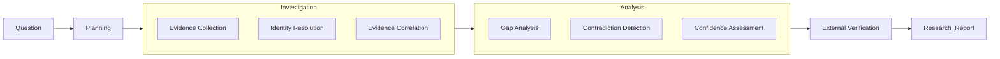

# Enterprise Research Agent

完成**研究任务（Research Task）**——围绕证据（Evidence）而非文档（Document），通过 Investigation 与 Analysis 两个阶段，生成可追溯、可验证的研究报告。

> **Research = Investigation + Analysis**
> - **Investigation（调查）**：收集事实——Evidence Collection, Identity Resolution, Evidence Correlation
> - **Analysis（分析）**：推导结论——Gap Analysis, Contradiction Detection, Confidence Assessment

**设计思路**：Hybrid Architecture —— 确定性 Research Backbone 用 JS 执行，语义判断与推理用 LLM 执行。所有状态集中在 **ResearchSession** 一个对象中，作为贯穿全流程的工作上下文（Research Context）。

## 何时调用

- 用户说"研究 X / Research X / Investigate X / 调查 X"，且 X 是一个**对象**（Vendor / Regulation / Application / Capability / Project）而非单一问题
- 用户问"X 影响哪些系统 / X 涉及哪些团队 / 我们是否已经用过 X"——这类问题需要跨多源信息综合才能回答
- 用户希望最终输出是**带证据链的报告**，而不是一组搜索结果或一段总结
- 用户能接受 Agent 主动指出"信息缺口"与"证据冲突"作为研究发现

## 何时不调用

- 用户只想查一个具体文档 → 直接用 Search / 文档检索
- 用户只想基于某段给定文本回答问题 → 用 RAG / 阅读理解
- 用户问的是事实性单点问题（"今天周几""X 的官网是什么"）→ 直接回答
- 任务只需单次 LLM 调用就能完成，不需要跨系统收集证据

## Why not RAG？

| Enterprise Search | Enterprise RAG | **Enterprise Research Agent** |
|------------------|----------------|------------------------------|
| 查找文档 | 理解文档 | **完成研究任务** |
| 返回搜索结果 | 基于文档回答 | **输出研究报告** |
| 以文档为中心 | 以文档片段为中心 | **以实体和证据为中心** |
| 单一数据源 | 单一数据源 + 向量检索 | **多系统协同调查** |
| 用户自行分析 | 用户自行判断 | **Agent 自动综合分析** |
| 回答"文档在哪里" | 回答"文档说了什么" | **回答"企业里到底发生了什么、为什么、还缺什么、哪些证据互相打架"** |

RAG 回答的是 *what a document says*。Research Agent 回答的是 *what is actually going on across the enterprise*。

## Terminology: Research / Investigation / Analysis

| 术语 | 含义 | 阶段 |
|------|------|------|
| **Research** | 整个任务（从 Question 到 Report） | 全流程 |
| **Investigation** | 收集事实（Evidence Collection / Identity Resolution / Evidence Correlation） | Research 的前半段 |
| **Analysis** | 推导结论（Gap / Contradiction / Confidence / Finding） | Research 的后半段 |
| **Research Report** | 最终交付物 | Research 的输出 |

后续文中：
- "Investigation Workflow" 指调查流程（不含最终报告撰写）
- "Research Report" 指最终报告
- "ResearchSession" 指贯穿全流程的工作上下文

---

## Investigation Workflow



每个阶段都在**累积对统一身份（Canonical Identity）的理解**，而不是不断检索更多文档。

### Investigation 阶段

| 阶段 | LLM 工作 | JS 工作 |
|------|---------|---------|
| **Planning** | 拆解研究目标为子调查任务；预判可能涉及的实体类型 | `list-ontology` 提供 entity types / expectedRelations 作为规划参考；`add-plan-item` 记录子任务 |
| **Evidence Collection** | 解读每个数据源的内容，抽取 claim 与实体；判断 confidence；判定 `lastUpdated` | `add-evidence` 持久化（含 `claims` / `lastUpdated`）；`add-entity` 创建实体；`link-evidence` 绑定 |
| **Identity Resolution** | 判断"RiskConcile / riskconcile-api / RC / Vendor 28391"是否同一对象 | `find-entity` 查重；`resolve-identity` 合并并重新指向 relationships |
| **Evidence Correlation** | 推理两个实体之间的关系类型（subject_to / used_by / implemented_by） | `add-relationship` 做 Ontology 校验 + 去重 + 证据合并 |

### Analysis 阶段

| 阶段 | LLM 工作 | JS 工作 |
|------|---------|---------|
| **Gap Analysis** | 判断 gap 是补查 / 纳入发现 / 转为建议 | `analyze-gaps` 基于 Ontology 确定性计算 missing_property / missing_relation / no_evidence |
| **Contradiction Detection** | 判断冲突如何处理（进一步调查 / 标注 / 升级） | `analyze-contradictions` 基于 evidence.claims 确定性检测同实体的同属性冲突 |
| **Confidence Assessment** | 解读 confidence 因素，决定是否需要补证据 | `assess-confidence` 基于 evidence 数量 / source 权重 / cross validation / freshness / contradiction 确定性打分 |

### External Verification

| 阶段 | LLM 工作 | JS 工作 |
|------|---------|---------|
| **External Verification** | 用 WebSearch / WebFetch 获取外部资料；判断与内部证据一致或冲突 | 与 Evidence Collection 相同（外部资料作为 `source=External` 等加入 graph） |

---

## Evidence Model

Research Agent 并不直接操作文档，而是操作 Evidence。每条 Evidence 是 Research Graph 的最小单元。

| 字段 | 类型 | 说明 |
|------|------|------|
| `id` | string | 自动生成（ev1, ev2, ...） |
| `source` | string | Connector Adapter 来源（GitHub / Jira / LeanIX / ServiceNow / Confluence / Vendor / Regulation / External / News / Academic / Web / ...） |
| `uri` | string | 原始位置（URL / 资源 ID） |
| `content` | string | 抽取内容（free text） |
| `confidence` | number 0–1 | LLM 判定的初始可信度 |
| `lastUpdated` | ISO date | **源数据的最后更新时间**（用于 Freshness 评估） |
| `extractedAt` | ISO date | LLM 抽取该 Evidence 的时间（自动） |
| `claims` | `[{property, value}]` | **结构化断言**，用于 Contradiction Detection |
| `metadata` | object | Connector Adapter 附加信息（free-form） |

**关键约束**：
- Evidence 必须有 `source` + (`uri` 或 `content`)
- `claims` 是 Contradiction Detection 的输入——LLM 抽取证据时，应同时给出结构化断言（例如 LeanIX evidence 的 claims: `[{property:'owner', value:'Team A'}]`）
- `lastUpdated` 影响 Confidence Assessment——超过 365 天的 evidence 会被扣分

**为什么需要 claims？**
> Contradiction Detection 无法从 free-text content 确定性判断冲突。LLM 在抽取 Evidence 时同步给出 claims，JS 才能在同实体的同属性上确定性地发现"Team A vs Team B"冲突。

---

## ResearchSession（Research Context）

v3 的核心对象：把所有概念自然串联起来的工作上下文。不引入数据库 / 状态机 / 框架，仅是一个逻辑模型 + JSON 持久化。

```typescript
interface ResearchSession {
  goal: string;                    // 研究目标
  plan: PlanItem[];                // 子调查任务（pending/in_progress/done/skipped）
  graph: EvidenceGraph;            // Working Memory（entities + relationships + evidence + aliases）
  findings: Finding[];             // 报告撰写时填充
  gaps: Gap[];                     // 由 analyze() 计算
  contradictions: Contradiction[]; // 由 analyze() 计算
  confidence: Confidence;          // 由 analyze() 计算
  report: ResearchReport;          // 最终报告
  visitedSources: VisitedSource[]; // 已访问的 Connector Adapter
  pendingQuestions: string[];      // 当前未解决的开放问题
  rejectedHypotheses: Rejected[];  // 已排除的假设（含排除理由）
}
```

**Agent 永远知道"自己现在研究到哪里"**——这是 Deep Research 真正厉害的地方，不是 Graph，而是持续维护的 Research Context。

每个 Phase 结束后，LLM 应调用 `session-context` 查看：
- `planProgress`：plan 完成进度
- `graph`：entities / evidence / relationships 数量
- `openGaps` / `openContradictions`：当前未解决的 Gap 与冲突
- `confidence`：整体可信度
- `pendingQuestions` / `rejectedHypotheses`：开放问题与已排除假设

**v3 关键洞察**：
> 这个 ResearchSession 只是一个逻辑模型，不要求引入数据库、状态机或复杂框架，但它能够成为整个架构的主线，让 Proposal 从"一系列能力介绍"变成"一个完整、连贯的研究系统"。

---

## Lightweight Research Ontology（Entity Types）

> "Ontology" 在本项目中仅出现一次：定义 entity types 的 schema。所有实例存在 EvidenceGraph 中。刻意轻量化——不做 OWL / RDF / SPARQL / Description Logic / Rule Engine。

每种 entity type 定义：
- `properties`：属性及其类型
- `requiredProperties`：Gap Analysis 会硬性提示缺失的必填属性
- `relations`：允许的关系类型及目标 entity type（Ontology 校验）
- `expectedRelations`：Gap Analysis 会软性提示缺失的预期关系

14 种 entity type（在 `research.mjs` 的 `ONTOLOGY` 常量中维护）：

| Entity Type | Description | Required | Expected Relations |
|-------------|-------------|----------|-------------------|
| Vendor | External supplier or service provider | website | used_by, contracted_by |
| Application | Business application or system | owner, lifecycle | owned_by, implemented_by |
| Repository | Source code repository | — | belongs_to |
| Team | Organizational team | name | — |
| Person | Individual person | email | — |
| Project | Initiative or delivery project | status | — |
| Capability | Business or technical capability | — | — |
| BusinessProcess | Business process | name | — |
| Regulation | Regulatory requirement or standard | jurisdiction | impacts |
| Control | Security or compliance control | — | — |
| Incident | Operational incident or outage | date | affects |
| Risk | Identified risk | — | — |
| Contract | Vendor or service contract | startDate | — |
| Document | Reference document or knowledge asset | url | — |

**重点永远是 Entity，不是 Ontology**。Ontology 只是定义"哪些 entity type 存在、它们能有哪些关系"，让 Gap Analysis 与 add-relationship 校验成为确定性计算。

> **扩展原则**：当业务确需新 entity type 时，在 `ONTOLOGY` 常量中添加 entry（description + properties + requiredProperties + relations + expectedRelations），无需修改其他代码——`validateRelation` / `analyzeGaps` / `list-ontology` 会自动适配。

---

## Evidence Graph（Working Memory）

EvidenceGraph 不是最终结果，是整个 Investigation 的 **Working Memory**。每次研究持续往里补充。

```mermaid
graph LR
    subgraph "Evidence Graph (Working Memory)"
        Entities["Entities (Map)"]
        Relationships["Relationships (Array)"]
        Evidence["Evidence (Map)"]
        Aliases["Aliases (Map)"]
    end
    Aliases -->|resolve name→entityId| Entities
    Evidence -->|evidenceIds[]| Entities
    Evidence -->|evidenceIds[]| Relationships
    Entities -->|from / to| Relationships
```

Graph 内部不区分证据来自哪个 Connector Adapter——所有数据统一映射为 entity + relationship + evidence。

### Canonical Identity（统一身份）

企业最大的困难不是数据不足，而是同一个对象在不同系统中表示完全不同：

| Connector Adapter | Representation |
|-------------------|---------------|
| Confluence | RiskConcile |
| GitHub | riskconcile-api |
| LeanIX | Vendor=RiskConcile |
| ServiceNow | Vendor ID 28391 |
| Jira | RC Migration |

**Identity Before Search**：先建立 canonical identity，再开展后续调查。这一步的重要性高于传统 RAG 中的向量检索。

`addEntity` 在创建时会自动通过 name/alias 查重并合并；`resolve-identity` 用于 LLM 显式判定多个 entityId 是同一对象后执行合并（合并 aliases / properties / evidence，重新指向 relationships，去重）。

---

## Connector Adapter

Connector 在本项目中称为 **Connector Adapter**——每个 Adapter 把特定系统的原生数据统一输出为 Evidence：

```text
Raw (Confluence / GitHub / Jira / LeanIX / ServiceNow / ...)
        ↓
   Connector Adapter
        ↓
    Evidence (统一模型)
```

Research Workflow 根本不知道 Evidence 来自哪个 Connector。新增 Connector 只是扩展 Evidence 覆盖范围，不改变研究流程。

Adapter 在 LLM 端实现——LLM 调用 WebFetch / WebSearch / 现有 skills（如 lark-* / GitHub API）获取原始数据，然后调用 `add-evidence` 写入 graph。Adapter 的职责是"Raw → Evidence"的映射，不需要专门写代码。

---

## Script Integration Contract

> 当 `research.mjs` 可用时，**优先调用脚本维护 ResearchSession 状态，不要在 LLM 上下文中手工维护 JSON**。

### 分工原则

| 职责 | JS（research.mjs） | LLM |
|------|------|-----|
| Ontology schema 维护 | ✅（`ONTOLOGY` 常量） | |
| Entity type / relation 校验 | ✅（`validateEntityType` / `validateRelation`） | |
| EvidenceGraph 状态管理 | ✅（`EvidenceGraph` class） | |
| Evidence Model 字段（含 claims / lastUpdated） | ✅（`addEvidence`） | |
| Identity 自动查重与合并 | ✅（`addEntity` 自动合并同 name/alias） | ✅ 决策是否合并（`resolve-identity`） |
| Gap 计算 | ✅（`analyzeGaps`） | |
| Contradiction 计算（基于 claims） | ✅（`analyzeContradictions`） | ✅ 抽取 claims + 解读冲突 |
| Confidence 计算（基于 evidence + source + freshness + contradiction） | ✅（`assessConfidence` + `SOURCE_WEIGHTS`） | ✅ 解读 confidence 因素 |
| ResearchSession 生命周期（plan / visitedSources / pendingQuestions / rejectedHypotheses） | ✅（`ResearchSession` class） | ✅ 决策何时更新 |
| Research Context 查询（`session-context`） | ✅ | ✅ 每个 Phase 后自检 |
| Report schema 校验（evidenceIds 可追溯） | ✅（`validateReport`） | |
| Report 骨架生成（预填 supportingEvidence + conflicts + knowledgeGaps + confidence） | ✅（`reportTemplate`） | |
| Mermaid 导出 | ✅（`graphToMermaid`） | |
| 持久化（session file） | ✅（`saveSession` / `loadSession`） | |
| 研究规划（拆解子任务） | | ✅ |
| 证据解读与 claims 抽取 | | ✅ |
| Identity 合并决策（"这俩是同一个吗"） | | ✅ |
| 关联推理（"Vendor 与 Application 之间是什么关系"） | | ✅ |
| 冲突解读（"为什么 LeanIX 和 GitHub 说的不一样"） | | ✅ |
| 报告撰写（executiveSummary / keyFindings / recommendations） | | ✅ |

### 命令行接口

```bash
# === 初始化 ===
node research.mjs init --goal "Research RiskConcile"
# 默认 session file: ./research-session.json

# === ResearchSession 生命周期 ===
node research.mjs session-status              # 全量 Research Context（plan + graph + analysis + context）
node research.mjs session-context             # JSON 形式（供 LLM 自检"研究到哪里"）

# === Plan（研究规划）===
node research.mjs add-plan-item --objective "Identify vendor background"
node research.mjs update-plan-item --id p1 --status in_progress  # pending|in_progress|done|skipped

# === Research Context 维护 ===
node research.mjs record-source --source GitHub --uri "https://github.com/org/riskconcile-api"
node research.mjs add-pending-question "Who actually owns the riskconcile-api repo?"
node research.mjs reject-hypothesis --hypothesis "RC Migration Tool is deprecated" \
  --reason "Still daily commits per GitHub evidence ev2"

# === Ontology 查询 ===
node research.mjs list-ontology                  # 列出全部 14 种 entity type
node research.mjs list-ontology --type Vendor    # 查看某类型的 properties / relations / expectedRelations

# === Entity 管理 ===
node research.mjs add-entity --type Vendor --name "RiskConcile" \
  --aliases "RC,riskconcile-api,RiskConcile Ltd." \
  --summary "RegTech vendor for regulatory reporting" \
  --props "website=https://riskconcile.com,category=RegTech"

node research.mjs find-entity "riskconcile-api"  # 通过 name 或 alias 查找
node research.mjs list-entities --type Application

# === Evidence 管理（含 claims + lastUpdated）===
node research.mjs add-evidence --source GitHub \
  --uri "https://github.com/org/riskconcile-api" \
  --content "Repo exists, CODEOWNERS=Team B, daily commits" \
  --confidence 0.95 \
  --last-updated 2025-09-12 \
  --claims "owner=Team B,status=Active"

node research.mjs add-evidence --source LeanIX \
  --uri "leanix/app/RC" \
  --content "App registered, owner=Team A" \
  --confidence 0.85 \
  --last-updated 2025-08-15 \
  --claims "owner=Team A,status=Production"

node research.mjs link-evidence --entity e2 --evidence ev1

# === Relationship 管理（受 Ontology 校验）===
node research.mjs add-relationship --from e1 --to e2 --type used_by --evidence ev1,ev2 --confidence 0.9
# 若 relationType 不在 ONTOLOGY[fromType].relations 中，或目标 type 不匹配 → 报错

# === Identity Resolution ===
node research.mjs resolve-identity --canonical e1 --aliases e2,e3
# 合并 aliases/properties/evidence，重新指向 relationships，去重

# === Analysis（一次性跑 Gap + Contradiction + Confidence）===
node research.mjs analyze
# 输出 gaps / contradictions / confidence 三类结果的概要

# 也可单独跑：
node research.mjs analyze-gaps                  # Ontology-based gap detection
node research.mjs analyze-contradictions        # claims-based contradiction detection
node research.mjs assess-confidence             # overall confidence
node research.mjs assess-confidence --entity e2 # per-entity confidence（含 factors 明细）

# === 可视化与报告 ===
node research.mjs show-graph --max-nodes 50      # 输出 Mermaid flowchart
node research.mjs report-template --output report.json
# 预填 supportingEvidence（来自 graph.evidence） + conflicts（来自 analyze-contradictions）
#   + knowledgeGaps（来自 analyze-gaps） + confidence（来自 assess-confidence）

node research.mjs validate-report --report report.json
# 校验：8 个 required sections；keyFindings.evidenceIds 必须在 graph 中存在；confidence.overall ∈ high/medium/low
```

**关键约束**：
- 所有命令接受 `--session <file>`（默认 `./research-session.json`）
- `add-relationship` 严格受 Ontology 校验
- `addEntity` 自动通过 name/alias 查重，命中则合并 properties / summary 而非创建新实体
- `add-relationship` 对相同 from/to/type 自动合并（取 max confidence + union evidenceIds）
- `add-evidence` 的 `--claims prop=val,...` 是 Contradiction Detection 的输入
- `add-evidence` 的 `--last-updated` 影响 Confidence Assessment（>365 天扣分）

---

## LLM Playbook

按以下 7 阶段执行研究任务。**每个阶段结束后用 `saveSession` 持久化 + `session-context` 自检"研究到哪里"**。

### Phase 1: Planning（研究规划）

输入：用户的自然语言研究目标。

LLM 工作：
1. 识别研究主体（Vendor / Regulation / Application / Capability / Project）
2. 调用 `list-ontology` 查看可用 entity types 与 expectedRelations，作为规划参考
3. 把目标拆解为 5–10 个子调查任务，例如研究 RiskConcile：
   - Vendor 基本信息（website / category）
   - 企业内部是否已采购（Contract）
   - 哪些 Application 在使用（Application.used_by Vendor）
   - 哪些 Repository 相关（Repository.implements Application）
   - 是否发生过 Incident
   - 是否存在 Risk
   - 外部行业评价
4. 调用 `init --goal "<研究目标>"` 初始化 session
5. 为每个子任务调用 `add-plan-item --objective "..."`

**输出**：研究计划（plan items）+ 空 session。

### Phase 2: Investigation — Evidence Collection（证据收集）

输入：研究计划 + 可用 Connector Adapter / 数据源。

LLM 工作：
1. 把对应 plan item 状态更新为 `in_progress`（`update-plan-item --id <id> --status in_progress`）
2. 按子任务逐个收集证据。每条证据调用：
   ```bash
   node research.mjs add-evidence --source GitHub --uri ... --content ... \
     --confidence 0.95 --last-updated 2025-09-12 \
     --claims "owner=Team B,status=Active"
   ```
   - `source` 标注 Connector Adapter：Confluence / GitHub / Jira / LeanIX / ServiceNow / Vendor / Regulation / External / News / Academic / Web
   - `confidence` 由 LLM 根据来源权威性 + 内容明确度判定（0–1）
   - `lastUpdated` 标注源数据最后更新时间（影响 Freshness）
   - `claims` 抽取结构化断言（影响 Contradiction Detection）
3. 调用 `record-source --source <S> --uri <U>` 记录访问过的 Connector Adapter
4. 从证据内容中抽取实体，调用 `add-entity --type <T> --name <N> --aliases ... --props ...`
5. 调用 `link-evidence --entity <id> --evidence <id>` 把证据绑定到实体
6. **不要等所有证据收完再建实体**——发现一个建一个，让 Identity Resolution 在收集过程中就开始工作
7. 完成的 plan item 更新为 `done`；遇到阻塞的更新为 `skipped`

**输出**：session 中有 entities + evidence + plan 进度。

### Phase 3: Investigation — Identity Resolution（身份合并）

输入：阶段 2 产出的 graph（可能含重复实体）。

LLM 工作：
1. 调用 `list-entities` 通览所有实体
2. 对每一对 name/alias 看似相同的实体，LLM 判断是否同一对象：
   - 类型必须相同（`resolve-identity` 会拒绝跨类型合并）
   - 综合考虑：name 相似度 / alias 重叠 / 来源互补 / 证据是否指向同一真实对象
3. 调用 `resolve-identity --canonical <id> --aliases <id1,id2>` 执行合并
4. 合并后再次 `list-entities` 确认无冗余

**关键**：这一步的重要性高于向量检索。如果不做 Identity Resolution，同一对象在不同系统中的 5 条记录会被当作 5 个不相关实体，后续 Correlation 与 Contradiction 全错。

**输出**：graph 中每个真实对象恰好对应一个 entity。

### Phase 4: Investigation — Evidence Correlation（证据关联）

输入：身份已合并的 graph。

LLM 工作：
1. 通读所有 evidence，推理两两 entity 之间的关系
2. 每条关系调用 `add-relationship --from <id> --to <id> --type <T> --evidence <ev1,ev2> --confidence <n>`
   - `type` 必须在 `ONTOLOGY[fromType].relations` 中（否则脚本报错，LLM 据此修正）
   - 至少绑定一条 evidence——**没有证据支撑的关系不要建**
3. 形成影响链路，例如：Vendor → used_by → Application → implemented_by → Repository → belongs_to → Team
4. 调用 `show-graph` 输出 Mermaid 可视化，检查链路完整性

**输出**：graph 中有完整的 relationship 网络，每条 relationship 都有 evidence 支撑。

### Phase 5: Analysis — Gap + Contradiction + Confidence（分析三件套）

输入：关系网络已建好的 graph。

LLM + JS 工作：
1. 调用 `analyze`（一次性跑 Gap + Contradiction + Confidence），结果存入 session
2. 调用 `session-context` 查看分析摘要

**Gap 处置**（LLM 判断每个 gap）：
- `missing_property`（high）：必填属性缺失——可能需要补查，或转为 recommendation
- `missing_relation`（medium）：预期关系缺失——可能就是研究发现（如 Vendor 存在但无 Contract）
- `no_evidence`（medium）：实体无任何证据——需要补查或考虑删除

**Contradiction 处置**（LLM 判断每个冲突）：
- 进一步调查：哪些来源更可信？是否需要 External Verification？
- 标注：直接写入 report 的 `conflicts` section
- 升级：高严重性冲突应进入 `recommendations`（如"立即解决 owner 冲突"）

**Confidence 解读**（LLM 解读 factors）：
- 若 `evidenceCount` 太少 → 补查
- 若 `sourceCount` 太少（单源）→ 跨源验证
- 若 `crossValidatedClaims` 为 0 → 鼓励多源同值
- 若 `staleEvidence` 较多 → 寻找更新来源
- 若 `contradictions` > 0 → 必须在 report 中说明

**输出**：session.gaps / session.contradictions / session.confidence 全部填充。

### Phase 6: External Verification（外部验证）

输入：内部证据 + 待验证的 key findings。

LLM 工作：
1. 选取需要外部验证的关键结论（如 Vendor 定位、法规解读、最佳实践对比）
2. 用 WebSearch / WebFetch 获取外部资料
3. 把外部资料作为 `source=External`（或更具体的 `source=Vendor` / `source=Regulation`）的 evidence 加入 graph
4. 重新跑 `analyze` 检查是否产生新的 contradiction（如内部说 RegTech、外部官网说 FinTech）
5. 把新冲突写入 report 的 `conflicts` section
6. 把验证过的 finding 的 `confidence` 提升（多源验证 → crossValidatedClaims 增加）

**输出**：session 中新增外部 evidence + 更新的 contradictions / confidence。

### Phase 7: Research Report（研究报告）

输入：完整的 session（goal + plan + graph + gaps + contradictions + confidence）。

LLM + JS 工作：
1. 调用 `report-template --output report.json` 生成预填骨架：
   - `supportingEvidence` 已自动填充 graph 中所有 evidence（含 lastUpdated）
   - `conflicts` 已自动填充 `analyze-contradictions` 的结果（含 property + values + evidenceIds）
   - `knowledgeGaps` 已自动填充 `analyze-gaps` 的结果
   - `confidence` 已自动填充 `assess-confidence` 的结果（level + score + rationale）
2. LLM 填写：
   - `executiveSummary`：3–5 句总体结论
   - `keyFindings`：每条必须有 `id` / `statement` / `evidenceIds[]` / `confidence`（high/medium/low）
   - `recommendations`：每条有 `action` + `priority`（high/medium/low）+ 可选 `evidenceIds`
3. 调用 `validate-report --report report.json` 校验：
   - 8 个 required sections 齐全
   - 每个 keyFinding 的 evidenceIds 在 graph 中存在
   - 每个 supportingEvidence 引用有效 evidenceId
   - confidence.overall ∈ {high, medium, low}
4. 校验失败 → 修正后再次 validate，直到通过
5. 把最终报告呈现给用户

**输出**：通过校验的研究报告 JSON + 给用户的可读版本（Markdown）。

---

## Research Report Schema

8 个 required sections（缺一不可，由 `validate-report` 强制）：

```json
{
  "task": "Research RiskConcile",
  "executiveSummary": "RiskConcile 是 RegTech 供应商，企业内部已在 1 个 Application 中使用；LeanIX 与 GitHub 在 owner 上存在冲突。",
  "keyFindings": [
    {
      "id": "F1",
      "statement": "RiskConcile 被 RC Migration Tool 使用",
      "evidenceIds": ["ev1", "ev2"],
      "confidence": "medium"
    },
    {
      "id": "F2",
      "statement": "Application owner 在 LeanIX 与 GitHub 间存在冲突",
      "evidenceIds": ["ev1", "ev2"],
      "confidence": "high"
    }
  ],
  "supportingEvidence": [
    { "evidenceId": "ev1", "source": "LeanIX", "uri": "leanix/app/RC", "summary": "App registered, owner=Team A", "confidence": 0.85, "lastUpdated": "2025-08-15" },
    { "evidenceId": "ev2", "source": "GitHub", "uri": "github/org/riskconcile-api", "summary": "CODEOWNERS=Team B", "confidence": 0.9, "lastUpdated": "2025-09-12" }
  ],
  "confidence": {
    "overall": "medium",
    "score": 0.475,
    "rationale": "avg score 0.47, 2 entities, 3 evidence, 2 contradictions, 4 gaps"
  },
  "conflicts": [
    {
      "description": "RC Migration Tool (Application) has conflicting owner: Team A vs Team B",
      "entityId": "e2",
      "property": "owner",
      "values": [
        { "value": "Team A", "evidenceIds": ["ev1"], "sources": ["LeanIX"] },
        { "value": "Team B", "evidenceIds": ["ev2"], "sources": ["GitHub"] }
      ],
      "evidenceIds": ["ev1", "ev2"],
      "severity": "high"
    }
  ],
  "knowledgeGaps": [
    { "description": "RiskConcile (Vendor): missing contracted_by → Contract (expected)", "entityId": "e1", "missingRelation": "contracted_by → Contract (expected)", "severity": "medium" }
  ],
  "recommendations": [
    { "action": "联系 Vendor Manager 解决 owner 冲突并登记 Contract", "priority": "high", "evidenceIds": ["ev1", "ev2"] }
  ]
}
```

**字段约束**（由 `validate-report` 强制）：
- 每个 `keyFindings` 必须有 `id` / `statement` / 至少一个 `evidenceIds`，且每个 evidenceId 必须在 graph 中存在
- 每个 `supportingEvidence.evidenceId` 必须在 graph 中存在
- `confidence.overall` ∈ {high, medium, low}
- `recommendations[].priority`（若提供）∈ {high, medium, low}
- `conflicts[].evidenceIds` 为空时仅产生 warning（不阻断）

---

## Design Principles

1. **Evidence First** —— 所有结论必须建立在可追溯的证据之上。没有 evidence 的 relationship 不要建。
2. **Identity Before Search** —— 先建立 canonical identity，再开展调查。Identity Resolution 优先于进一步的证据收集。
3. **Entity-Centric** —— 研究围绕企业实体展开，而非围绕文档展开。文档只是 evidence 的载体之一。
4. **Traceable by Design** —— 每个结论都能追溯到 evidenceIds。Report schema 强制 keyFindings 必须有证据。
5. **Connector Agnostic** —— Research Workflow 不依赖任何特定平台。Connector Adapter 统一输出 Evidence，新增 Adapter 不改变流程。
6. **Incremental Knowledge** —— 每次研究沉淀的 entities / relationships / evidence / contradictions / rejectedHypotheses 持久化在 session file 中，可为后续研究复用。
7. **Gap is Finding** —— 缺失信息不是失败，是研究发现。Gap Analysis 输出直接进入 report 的 knowledgeGaps section。
8. **Contradiction is Signal** —— 冲突比 Gap 更有价值：Gap 是"没找到"，Contradiction 是"找到了但互相打架"。Contradiction 直接进入 report 的 conflicts section。
9. **Confidence is Multi-factor** —— Confidence 不靠 LLM 凭感觉，而是基于 evidence 数量 / source 权重 / cross validation / freshness / contradiction 确定性计算。
10. **Freshness Matters** —— Research 是 Current Knowledge，不是 Knowledge。Evidence 携带 `lastUpdated`，stale evidence 会拉低 confidence。

---

## 边界（不要做）

- ❌ **完整 Knowledge Graph** —— 不做通用知识表示。Evidence Graph 是 task-oriented Working Memory，不是企业 KG。
- ❌ **OWL / RDF / SPARQL / Description Logic / Rule Engine** —— Lightweight Ontology 足够，不需要形式化推理引擎。
- ❌ **Multi-Agent 框架强调** —— 单 Agent + workflow 即可。是否拆分为多个 specialist agent 是部署决策，不是设计核心。
- ❌ **DSL Rule Language** —— 不要发明规则 DSL。规则就是 Ontology 中的 `requiredProperties` / `expectedRelations`，由 JS 函数直接计算。
- ❌ **Connector-per-Skill** —— 不要为每个 Connector Adapter（Confluence / GitHub / Jira / ...）写独立 skill。Adapter 是基础设施，Research Workflow 是核心。
- ❌ **无证据的关系** —— 不要凭推断建立没有 evidence 支撑的 relationship。`add-relationship` 的 `--evidence` 参数应尽可能提供。
- ❌ **无 claims 的 Evidence** —— 不要省略 `--claims`。Contradiction Detection 依赖结构化 claims；没有 claims 的 evidence 无法参与冲突检测。
- ❌ **手工维护 Session JSON** —— 不要在 LLM 上下文中手工编辑 session file。所有变更通过 CLI 命令，确保 Ontology 校验、去重、analysis 同步生效。

---

## Example Research Tasks

### Vendor Research

> Research RiskConcile

调查范围：Vendor 背景 / 产品能力 / 企业内部使用情况 / 涉及的 Application / 涉及的 Repository / 所属团队 / Incident 历史 / Contract 信息 / 风险评估 / 外部行业评价。

预期输出：Vendor Intelligence Report，包含：
- evidenceIds 可追溯的 keyFindings
- 识别出的 knowledgeGaps（如 Contract 未找到 / LeanIX 未登记）
- 识别出的 conflicts（如 LeanIX 与 GitHub 在 owner 上不一致）
- recommendations（如联系 Vendor Manager 解决冲突并补登 Contract）

### Regulation Impact Analysis

> Analyze the impact of MAS TRM

调查范围：法规适用范围 / 受影响 Application / 已有实施 Project / 法规文档 / 需要的架构变更 / 缺失的 Control / 实施缺口。

预期输出：Regulation Impact Assessment，包含：
- 受影响 Application 列表（带 evidenceIds）
- control 缺口（来自 Gap Analysis 的 missing_relation: Regulation → mandates → Control）
- 实施冲突（如内部文档说已合规，但 Control 缺失）
- recommendations

### Capability Sourcing Analysis

> Which repositories implement Open Banking capabilities?

调查范围：Capability 定义 / 支撑该 Capability 的 Application / 实现这些 Application 的 Repository / 团队归属 / 项目状态 / 风险与 Incident。

预期输出：Capability Sourcing Report，包含：
- Repository 列表（带 evidenceIds）
- ownership 缺口（missing_relation: Repository → belongs_to → Team）
- ownership 冲突（LeanIX 与 CODEOWNERS 不一致）
- recommendations

---

## Vision

> **Search finds documents. Research establishes evidence.**
> **Retrieval answers questions. Research supports decisions.**

Enterprise Search retrieves information. Enterprise Research builds understanding.

---

## 文件结构

```
.trae/skills/enterprise-research-agent/
├── SKILL.md         # 本文件：定位 + Workflow + Playbook + Report Schema + Vision
└── research.mjs     # 单文件 JS 机器：Ontology + EvidenceGraph + Gap/Contradiction/Confidence + ResearchSession + CLI
```

**单文件约束**：所有 JS 机器集中在 `research.mjs` 一个文件中，不拆分。文件内部分 10 个 section：
1. Lightweight Research Ontology（`ONTOLOGY` 常量 + `validateEntityType` + `validateRelation`）
2. EvidenceGraph class（entities / relationships / evidence / aliases + Identity Resolution；Evidence Model 字段含 claims / lastUpdated / metadata）
3. Gap Analysis（`analyzeGaps`）
4. Contradiction Detection（`analyzeContradictions`，基于 claims）
5. Confidence Assessment（`assessConfidence` + `SOURCE_WEIGHTS`，基于 evidence 数量 / source 权重 / cross validation / freshness / contradiction）
6. Report Schema + Validation（`REPORT_REQUIRED_SECTIONS` + `validateReport` + `reportTemplate`）
7. Mermaid Export（`graphToMermaid`）
8. ResearchSession class（goal / plan / graph / findings / gaps / contradictions / confidence / report / visitedSources / pendingQuestions / rejectedHypotheses）
9. Persistence（`saveSession` + `loadSession`）
10. CLI（22 个 command + ESM 入口守卫）

**ESM 入口守卫**：`isMainModule` 检查确保 `import` 时不触发 CLI，支持编程式调用（`import { ResearchSession, EvidenceGraph, analyzeContradictions, assessConfidence } from './research.mjs'`）。
