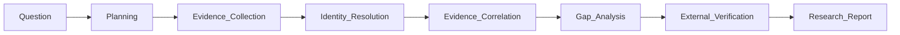

# Enterprise Research Agent

完成**研究任务（Research Task）**，而不是回答问题，也不是检索文档。

> Enterprise Research Agent 是一位能够自主完成调查研究任务的 AI Researcher。它围绕 Evidence（证据）工作，通过收集、关联、验证和分析证据，最终生成可追溯、可验证的研究报告。

**设计思路**：Hybrid Architecture —— **确定性 Research Backbone 用 JS 执行，语义判断与推理用 LLM 执行**。JS 不负责理解证据含义，只负责 Ontology 校验、Graph 状态、Gap 计算、Report schema 与持久化。LLM 不负责维护 Graph 状态，只负责研究规划、身份合并决策、关联推理与报告撰写。

## 何时调用

- 用户说"研究 X / Research X / Investigate X / 调查 X"，且 X 是一个**对象**（Vendor / Regulation / Application / Capability / Project）而非单一问题
- 用户问"X 影响哪些系统 / X 涉及哪些团队 / 我们是否已经用过 X"——这类问题需要跨多源信息综合才能回答
- 用户希望最终输出是**带证据链的报告**，而不是一组搜索结果或一段总结
- 用户能接受 Agent 主动指出"信息缺口"作为研究发现

## 何时不调用

- 用户只想查一个具体文档 → 直接用 Search / 文档检索
- 用户只想基于某段给定文本回答问题 → 用 RAG / 阅读理解
- 用户问的是事实性单点问题（"今天周几""X 的官网是什么"）→ 直接回答
- 任务只需单次 LLM 调用就能完成，不需要跨系统收集证据

## Why not RAG？

| Enterprise Search | Enterprise RAG | **Enterprise Research Agent** |
|------------------|----------------|------------------------------|
| 查找文档 | 理解文档 | **完成研究任务** |
| 返回搜索结果 | 基于文档回答 | **输出研究报告** |
| 以文档为中心 | 以文档片段为中心 | **以实体和证据为中心** |
| 单一数据源 | 单一数据源 + 向量检索 | **多系统协同调查** |
| 用户自行分析 | 用户自行判断 | **Agent 自动综合分析** |
| 回答"文档在哪里" | 回答"文档说了什么" | **回答"企业里到底发生了什么、为什么、还缺什么"** |

RAG 回答的是 *what a document says*。Research Agent 回答的是 *what is actually going on across the enterprise*。

---

## Research Workflow

无论研究什么主题，本质上都经历相同的调查生命周期：



每个阶段都在**累积对统一身份（Canonical Identity）的理解**，而不是不断检索更多文档。

| 阶段 | LLM 工作 | JS 工作 |
|------|---------|---------|
| **Planning** | 拆解研究目标为子调查任务；预判可能涉及的实体类型 | `list-ontology` 提供 entity types / expectedRelations 作为规划参考 |
| **Evidence Collection** | 解读每个数据源的内容，抽取 claim 与实体；判断 confidence | `add-evidence` 持久化；`add-entity` 创建实体；`link-evidence` 绑定 |
| **Identity Resolution** | 判断"RiskConcile / riskconcile-api / RC / Vendor 28391"是否同一对象 | `find-entity` 查重；`resolve-identity` 合并并重新指向 relationships |
| **Evidence Correlation** | 推理两个实体之间的关系类型（subject_to / used_by / implemented_by） | `add-relationship` 做 Ontology 校验 + 去重 + 证据合并 |
| **Gap Analysis** | 判断 gap 是否需要进一步调查 | `analyze-gaps` 基于 Ontology 确定性计算 missing_property / missing_relation / no_evidence |
| **External Verification** | 解读外部资料，判断是否与内部证据一致或冲突 | 与 Evidence Collection 相同 |
| **Research Report** | 撰写 executiveSummary / keyFindings / recommendations | `report-template` 生成预填骨架；`validate-report` 校验 evidenceIds 可追溯 |

---

## Research Domain Model

### Lightweight Ontology（Schema-only，不存实例）

Ontology 仅定义 schema，所有实例存在 Research Graph 中。受 Palantir Foundry 启发，但刻意轻量化——**不做 OWL / RDF / SPARQL / Description Logic / Rule Engine**。

每种 entity type 定义：
- `properties`：属性及其类型
- `requiredProperties`：Gap Analysis 会硬性提示缺失的必填属性
- `relations`：允许的关系类型及目标 entity type（Ontology 校验）
- `expectedRelations`：Gap Analysis 会软性提示缺失的预期关系

14 种 entity type（在 `research.mjs` 的 `ONTOLOGY` 常量中维护）：

| Entity Type | Description | Required | Expected Relations |
|-------------|-------------|----------|-------------------|
| Vendor | External supplier or service provider | website | used_by, contracted_by |
| Application | Business application or system | owner, lifecycle | owned_by, implemented_by |
| Repository | Source code repository | — | belongs_to |
| Team | Organizational team | name | — |
| Person | Individual person | email | — |
| Project | Initiative or delivery project | status | — |
| Capability | Business or technical capability | — | — |
| BusinessProcess | Business process | name | — |
| Regulation | Regulatory requirement or standard | jurisdiction | impacts |
| Control | Security or compliance control | — | — |
| Incident | Operational incident or outage | date | affects |
| Risk | Identified risk | — | — |
| Contract | Vendor or service contract | startDate | — |
| Document | Reference document or knowledge asset | url | — |

> **扩展原则**：当业务确需新 entity type 时，在 `ONTOLOGY` 常量中添加 entry（description + properties + requiredProperties + relations + expectedRelations），无需修改其他代码——`validateRelation` / `analyzeGaps` / `list-ontology` 会自动适配。

### Research Graph（Working Memory）

Graph 不是最终结果，是整个 Investigation 的 **Working Memory**。每次研究持续往里补充。

```mermaid
graph LR
    subgraph "Research Graph (Working Memory)"
        Entities["Entities (Map)"]
        Relationships["Relationships (Array)"]
        Evidence["Evidence (Map)"]
        Aliases["Aliases (Map)"]
    end
    Aliases -->|resolve name→entityId| Entities
    Evidence -->|evidenceIds[]| Entities
    Evidence -->|evidenceIds[]| Relationships
    Entities -->|from / to| Relationships
```

Graph 内部不区分证据来自哪个 Connector——所有数据统一映射为 entity + relationship + evidence。

### Canonical Identity（统一身份）

企业最大的困难不是数据不足，而是同一个对象在不同系统中表示完全不同：

| System | Representation |
|--------|---------------|
| Confluence | RiskConcile |
| GitHub | riskconcile-api |
| LeanIX | Vendor=RiskConcile |
| ServiceNow | Vendor ID 28391 |
| Jira | RC Migration |

**Identity Before Search**：先建立 canonical identity，再开展后续调查。这一步的重要性高于传统 RAG 中的向量检索。

`addEntity` 在创建时会自动通过 name/alias 查重并合并；`resolve-identity` 用于 LLM 显式判定多个 entityId 是同一对象后执行合并（合并 aliases / properties / evidence，重新指向 relationships，去重）。

---

## Script Integration Contract

> 当 `research.mjs` 可用时，**优先调用脚本维护 Graph 状态，不要在 LLM 上下文中手工维护 JSON**。

### 分工原则

| 职责 | JS（research.mjs） | LLM |
|------|------|-----|
| Ontology schema 维护 | ✅（`ONTOLOGY` 常量） | |
| Entity type / relation 校验 | ✅（`validateEntityType` / `validateRelation`） | |
| Graph 状态管理（entities / relationships / evidence / aliases） | ✅（`ResearchGraph` class） | |
| Identity 自动查重与合并 | ✅（`addEntity` 自动合并同 name/alias） | ✅ 决策是否合并（`resolve-identity`） |
| Gap 计算（missing_property / missing_relation / no_evidence） | ✅（`analyzeGaps`） | |
| Report schema 校验（evidenceIds 可追溯） | ✅（`validateReport`） | |
| Report 骨架生成（预填 supportingEvidence + knowledgeGaps） | ✅（`reportTemplate`） | |
| Mermaid 导出 | ✅（`graphToMermaid`） | |
| 持久化（state file） | ✅（`saveGraph` / `loadGraph`） | |
| 研究规划（拆解子任务） | | ✅ |
| 证据解读与 claim 抽取 | | ✅ |
| Identity 合并决策（"这俩是同一个吗"） | | ✅ |
| 关联推理（"Vendor 与 Application 之间是什么关系"） | | ✅ |
| 冲突识别（内部 vs 外部证据不一致） | | ✅ |
| 报告撰写（executiveSummary / keyFindings / recommendations） | | ✅ |

### 命令行接口

```bash
# === 初始化 ===
node research.mjs init --task "Research RiskConcile"
# 默认 state file: ./research-state.json

# === 查询 Ontology（规划时参考）===
node research.mjs list-ontology                  # 列出全部 14 种 entity type
node research.mjs list-ontology --type Vendor    # 查看某类型的 properties / relations / expectedRelations

# === Entity 管理 ===
node research.mjs add-entity --type Vendor --name "RiskConcile" \
  --aliases "RC,riskconcile-api,RiskConcile Ltd." \
  --summary "RegTech vendor for regulatory reporting" \
  --props "website=https://riskconcile.com,category=RegTech"

node research.mjs find-entity "riskconcile-api"  # 通过 name 或 alias 查找
node research.mjs list-entities                  # 全部
node research.mjs list-entities --type Application

# === Evidence 管理 ===
node research.mjs add-evidence --source GitHub \
  --uri "https://github.com/org/riskconcile-api" \
  --content "Repo exists, 142 commits, last commit 2025-09-12" \
  --confidence 0.95

node research.mjs link-evidence --entity e1 --evidence ev1

# === Relationship 管理（受 Ontology 校验）===
node research.mjs add-relationship --from e1 --to e2 --type used_by --evidence ev1 --confidence 0.9
# 若 relationType 不在 ONTOLOGY[fromType].relations 中，或目标 type 不匹配 → 报错

# === Identity Resolution ===
node research.mjs resolve-identity --canonical e1 --aliases e2,e3
# 合并 aliases/properties/evidence，重新指向 relationships，去重

# === Gap Analysis（确定性计算）===
node research.mjs analyze-gaps
# 输出每个实体的 missing_property (high) / missing_relation (medium) / no_evidence (medium)

# === 可视化与报告 ===
node research.mjs show-graph --max-nodes 50       # 输出 Mermaid flowchart
node research.mjs report-template --output report.json
# 生成预填 supportingEvidence（来自 graph.evidence）+ knowledgeGaps（来自 analyze-gaps）的报告骨架

node research.mjs validate-report --report report.json
# 校验：8 个 required sections；keyFindings.evidenceIds 必须在 graph 中存在；confidence.overall ∈ high/medium/low

# === 状态 ===
node research.mjs status                          # task / entityCount / evidenceCount / relationshipCount / by type
```

**关键约束**：
- 所有命令接受 `--state <file>`（默认 `./research-state.json`）
- `add-relationship` 严格受 Ontology 校验：`from` 的 entity type 必须在 `relations` 中声明该 relationType，且 `to` 的 type 必须匹配
- `addEntity` 自动通过 name/alias 查重，命中则合并 properties / summary 而非创建新实体
- `add-relationship` 对相同 from/to/type 自动合并（取 max confidence + union evidenceIds）

---

## LLM Playbook

按以下 7 阶段执行研究任务。**每个阶段结束后用 `saveGraph` 持久化**，避免上下文丢失导致状态错乱。

### Phase 1: Planning（研究规划）

输入：用户的自然语言研究目标。

LLM 工作：
1. 识别研究主体（Vendor / Regulation / Application / Capability / Project）
2. 调用 `list-ontology` 查看可用 entity types 与 expectedRelations，作为规划参考
3. 把目标拆解为 5–10 个子调查任务，例如研究 RiskConcile：
   - Vendor 基本信息（website / category）
   - 企业内部是否已采购（Contract）
   - 哪些 Application 在使用（Application.used_by Vendor）
   - 哪些 Repository 相关（Repository.implements Application）
   - 是否发生过 Incident
   - 是否存在 Risk
   - 外部行业评价
4. 调用 `init --task "<研究目标>"` 初始化 graph

**输出**：研究计划（子任务列表）+ 空 graph。

### Phase 2: Evidence Collection（证据收集）

输入：研究计划 + 可用 Connector / 数据源。

LLM 工作：
1. 按子任务逐个收集证据。每条证据调用 `add-evidence --source <S> --uri <U> --content <C> --confidence <n>`
   - `source` 标注来源系统：Confluence / GitHub / Jira / LeanIX / ServiceNow / Vendor / Regulation / News / Academic / ...
   - `confidence` 由 LLM 根据来源权威性 + 内容明确度判定（0–1）
2. 从证据内容中抽取实体，调用 `add-entity --type <T> --name <N> --aliases ... --props ...`
3. 调用 `link-evidence --entity <id> --evidence <id>` 把证据绑定到实体
4. **不要等所有证据收完再建实体**——发现一个建一个，让 Identity Resolution 在收集过程中就开始工作

**输出**：graph 中有 entities + evidence，但 relationships 可能还很少。

### Phase 3: Identity Resolution（身份合并）

输入：阶段 2 产出的 graph（可能含重复实体）。

LLM 工作：
1. 调用 `list-entities` 通览所有实体
2. 对每一对 name/alias 看似相同的实体，LLM 判断是否同一对象：
   - 类型必须相同（`resolve-identity` 会拒绝跨类型合并）
   - 综合考虑：name 相似度 / alias 重叠 / 来源互补 / 证据是否指向同一真实对象
3. 调用 `resolve-identity --canonical <id> --aliases <id1,id2>` 执行合并
4. 合并后再次 `list-entities` 确认无冗余

**关键**：这一步的重要性高于向量检索。如果不做 Identity Resolution，同一对象在不同系统中的 5 条记录会被当作 5 个不相关实体，后续 Correlation 全错。

**输出**：graph 中每个真实对象恰好对应一个 entity。

### Phase 4: Evidence Correlation（证据关联）

输入：身份已合并的 graph。

LLM 工作：
1. 通读所有 evidence，推理两两 entity 之间的关系
2. 每条关系调用 `add-relationship --from <id> --to <id> --type <T> --evidence <ev1,ev2> --confidence <n>`
   - `type` 必须在 `ONTOLOGY[fromType].relations` 中（否则脚本报错，LLM 据此修正）
   - 至少绑定一条 evidence——**没有证据支撑的关系不要建**
3. 形成影响链路，例如：Vendor → used_by → Application → implemented_by → Repository → belongs_to → Team
4. 调用 `show-graph` 输出 Mermaid 可视化，检查链路完整性

**输出**：graph 中有完整的 relationship 网络，每条 relationship 都有 evidence 支撑。

### Phase 5: Gap Analysis（知识缺口）

输入：关系网络已建好的 graph。

LLM + JS 工作：
1. 调用 `analyze-gaps` 获取确定性 gap 列表：
   - `missing_property`（high）：必填属性缺失，如 Vendor 缺 website、Application 缺 owner
   - `missing_relation`（medium）：预期关系缺失，如 Vendor 没有 used_by 任何 Application
   - `no_evidence`（medium）：实体无任何证据支撑
2. LLM 判断每个 gap：
   - **是否需要补查**：如 Vendor 缺 website，可去外部补查 Vendor 官网
   - **是否是研究发现**：如"Vendor 存在但无 Contract"可能就是重要发现
   - **是否是数据质量问题**：如"Application 缺 owner"应作为 recommendation 而非继续调查

**输出**：gap 列表 + 每个 gap 的处置决策（补查 / 纳入发现 / 转为建议）。

### Phase 6: External Verification（外部验证）

输入：内部证据 + 待验证的 key findings。

LLM 工作：
1. 选取需要外部验证的关键结论（如 Vendor 定位、法规解读、最佳实践对比）
2. 用 WebSearch / WebFetch 获取外部资料
3. 把外部资料作为 `source=External` 的 evidence 加入 graph
4. 识别**冲突**：内部证据与外部证据不一致（如内部文档说 Vendor 是 RegTech，外部官网说是 FinTech）
5. 冲突写入 report 的 `conflicts` section

**输出**：graph 中新增外部 evidence + 冲突列表。

### Phase 7: Research Report（研究报告）

输入：完整的 graph（entities + relationships + evidence + gaps）。

LLM + JS 工作：
1. 调用 `report-template --output report.json` 生成预填骨架：
   - `supportingEvidence` 已自动填充 graph 中所有 evidence
   - `knowledgeGaps` 已自动填充 `analyze-gaps` 的结果
2. LLM 填写：
   - `executiveSummary`：3–5 句总体结论
   - `keyFindings`：每条必须有 `id` / `statement` / `evidenceIds[]` / `confidence`（high/medium/low）
   - `confidence.overall` + `confidence.rationale`：整体可信度评估
   - `conflicts`：内部与外部证据的冲突（每条带 `evidenceIds[]`）
   - `recommendations`：每条有 `action` + `priority`（high/medium/low）+ 可选 `evidenceIds`
3. 调用 `validate-report --report report.json` 校验：
   - 8 个 required sections 齐全
   - 每个 keyFinding 的 evidenceIds 在 graph 中存在
   - 每个 supportingEvidence 引用有效 evidenceId
   - confidence.overall ∈ {high, medium, low}
4. 校验失败 → 修正后再次 validate，直到通过
5. 把最终报告呈现给用户

**输出**：通过校验的研究报告 JSON + 给用户的可读版本（Markdown）。

---

## Research Report Schema

8 个 required sections（缺一不可，由 `validate-report` 强制）：

```json
{
  "task": "Research RiskConcile",
  "executiveSummary": "RiskConcile 是一家 RegTech 供应商，企业内部已在 3 个 Application 中使用，存在 1 份 Contract，但未登记到 LeanIX。",
  "keyFindings": [
    {
      "id": "F1",
      "statement": "RiskConcile 已被企业内部 3 个 Application 使用",
      "evidenceIds": ["ev1", "ev3", "ev5"],
      "confidence": "high"
    },
    {
      "id": "F2",
      "statement": "存在一份 2024-06 签订的 Contract，但 LeanIX 中未登记该 Vendor",
      "evidenceIds": ["ev7", "ev8"],
      "confidence": "medium"
    }
  ],
  "supportingEvidence": [
    { "evidenceId": "ev1", "source": "GitHub", "uri": "https://github.com/org/riskconcile-api", "summary": "Repo exists, 142 commits", "confidence": 0.95 },
    { "evidenceId": "ev7", "source": "ServiceNow", "uri": "sn-cmdb/vendor/28391", "summary": "Contract record", "confidence": 0.9 }
  ],
  "confidence": {
    "overall": "medium",
    "rationale": "内部证据一致性高，但与外部 Vendor 官网在产品定位上存在冲突；LeanIX 登记缺失影响完整性。"
  },
  "conflicts": [
    {
      "description": "内部 Confluence 标记 RiskConcile 为 RegTech，外部官网定位为 FinTech",
      "evidenceIds": ["ev2", "ev12"]
    }
  ],
  "knowledgeGaps": [
    { "description": "RiskConcile (Vendor): missing website (required)", "entityId": "e1", "severity": "high" },
    { "description": "RiskConcile (Vendor): missing used_by → Application (expected)", "entityId": "e1", "missingRelation": "used_by → Application (expected)", "severity": "medium" }
  ],
  "recommendations": [
    { "action": "联系 Vendor Manager 补齐 Contract 信息并登记到 LeanIX", "priority": "high", "evidenceIds": ["ev7", "ev8"] },
    { "action": "明确 RiskConcile 在企业内部的产品定位（RegTech or FinTech）", "priority": "medium", "evidenceIds": ["ev2", "ev12"] }
  ]
}
```

**字段约束**（由 `validate-report` 强制）：
- 每个 `keyFindings` 必须有 `id` / `statement` / 至少一个 `evidenceIds`，且每个 evidenceId 必须在 graph 中存在
- 每个 `supportingEvidence.evidenceId` 必须在 graph 中存在
- `confidence.overall` ∈ {high, medium, low}
- `recommendations[].priority`（若提供）∈ {high, medium, low}
- `conflicts[].evidenceIds` 为空时仅产生 warning（不阻断）

---

## Design Principles

1. **Evidence First** —— 所有结论必须建立在可追溯的证据之上。没有 evidence 的 relationship 不要建。
2. **Identity Before Search** —— 先建立 canonical identity，再开展调查。Identity Resolution 优先于进一步的证据收集。
3. **Entity-Centric** —— 研究围绕企业实体展开，而非围绕文档展开。文档只是 evidence 的载体之一。
4. **Traceable by Design** —— 每个结论都能追溯到 evidenceIds。Report schema 强制 keyFindings 必须有证据。
5. **Connector Agnostic** —— Research Workflow 不依赖任何特定平台。Connector 只是数据采集能力，新增 Connector 不会改变流程。
6. **Incremental Knowledge** —— 每次研究沉淀的 entities / relationships / evidence 持久化在 state file 中，可为后续研究复用。
7. **Gap is Finding** —— 缺失信息不是失败，是研究发现。Gap Analysis 输出直接进入 report 的 knowledgeGaps section。

---

## 边界（不要做）

- ❌ **完整 Knowledge Graph** —— 不做通用知识表示。Research Graph 是 task-oriented Working Memory，不是企业 KG。
- ❌ **OWL / RDF / SPARQL / Description Logic / Rule Engine** —— Lightweight Ontology 足够，不需要形式化推理引擎。
- ❌ **Multi-Agent 框架强调** —— 单 Agent + workflow 即可。是否拆分为多个 specialist agent 是部署决策，不是设计核心。
- ❌ **DSL Rule Language** —— 不要发明规则 DSL。规则就是 Ontology 中的 `requiredProperties` / `expectedRelations`，由 JS 函数直接计算。
- ❌ **Connector-per-Skill** —— 不要为每个 Connector（Confluence / GitHub / Jira / ...）写独立 skill。Connector 是基础设施，Research Workflow 是核心。
- ❌ **无证据的关系** —— 不要凭推断建立没有 evidence 支撑的 relationship。`add-relationship` 的 `--evidence` 参数应尽可能提供。
- ❌ **手工维护 Graph JSON** —— 不要在 LLM 上下文中手工编辑 state file。所有变更通过 CLI 命令，确保 Ontology 校验与去重生效。

---

## Example Research Tasks

### Vendor Research

> Research RiskConcile

调查范围：Vendor 背景 / 产品能力 / 企业内部使用情况 / 涉及的 Application / 涉及的 Repository / 所属团队 / Incident 历史 / Contract 信息 / 风险评估 / 外部行业评价。

预期输出：Vendor Intelligence Report，包含 evidenceIds 可追溯的 keyFindings、识别出的 knowledgeGaps（如 Contract 未找到 / LeanIX 未登记）、recommendations（如联系 Vendor Manager）。

### Regulation Impact Analysis

> Analyze the impact of MAS TRM

调查范围：法规适用范围 / 受影响 Application / 已有实施 Project / 法规文档 / 需要的架构变更 / 缺失的 Control / 实施缺口。

预期输出：Regulation Impact Assessment，包含受影响 Application 列表（带 evidenceIds）、control 缺口（来自 Gap Analysis 的 missing_relation: Regulation → mandates → Control）、recommendations。

### Capability Sourcing Analysis

> Which repositories implement Open Banking capabilities?

调查范围：Capability 定义 / 支撑该 Capability 的 Application / 实现这些 Application 的 Repository / 团队归属 / 项目状态 / 风险与 Incident。

预期输出：Capability Sourcing Report，包含 Repository 列表（带 evidenceIds）、ownership 缺口（missing_relation: Repository → belongs_to → Team）、recommendations。

---

## 文件结构

```
.trae/skills/enterprise-research-agent/
├── SKILL.md         # 本文件：定位 + Workflow + Playbook + Report Schema
└── research.mjs     # 单文件 JS 机器：Ontology + Graph + Gap + Report + CLI
```

**单文件约束**：所有 JS 机器集中在 `research.mjs` 一个文件中，不拆分。文件内部分 7 个 section：
1. Lightweight Ontology（`ONTOLOGY` 常量 + `validateEntityType` + `validateRelation`）
2. ResearchGraph class（entities / relationships / evidence / aliases + Identity Resolution）
3. Gap Analysis（`analyzeGaps`）
4. Report Schema + Validation（`REPORT_REQUIRED_SECTIONS` + `validateReport` + `reportTemplate`）
5. Mermaid Export（`graphToMermaid`）
6. Persistence（`saveGraph` + `loadGraph`）
7. CLI（14 个 command + ESM 入口守卫）

**ESM 入口守卫**：`isMainModule` 检查确保 `import` 时不触发 CLI，支持编程式调用（`import { ResearchGraph, analyzeGaps } from './research.mjs'`）。
