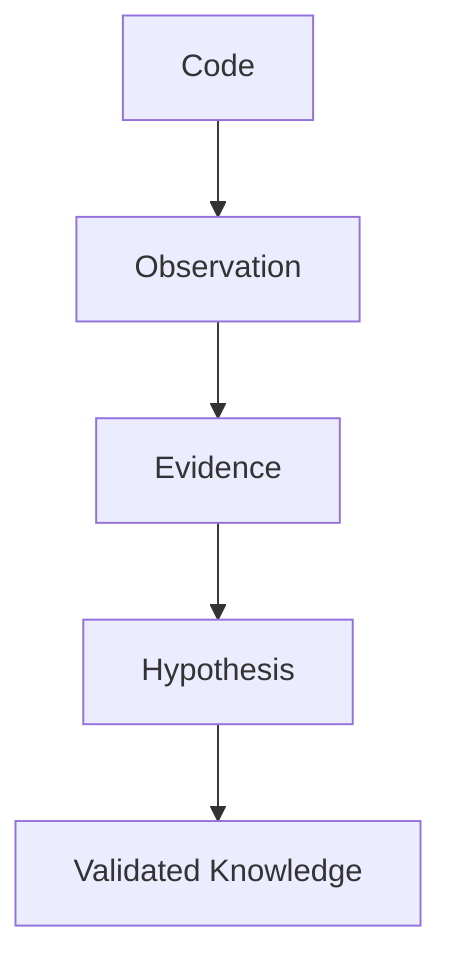
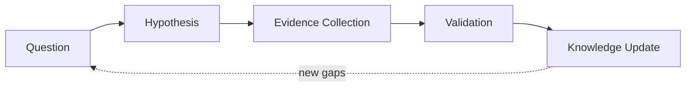

# Methodology — Solution Architect 研究方法论

> 本文档定义 Agent 如何研究仓库：核心哲学、研究原则、研究行为、Neutrality 原则。
>
> SKILL.md 定义"Agent 做什么"（调度 + Agent 清单）；Methodology.md 定义"Agent 如何思考"。

---

## 核心哲学

### 代码是证据，不是知识

源代码本身不能解释一个系统。Agent 必须完成以下转换：



永远不要混淆：

- 文件摘要（file summary）
- 代码解释（code explanation）
- 架构理解（architecture understanding）

架构理解需要：

- 关系（relationships）
- 边界（boundaries）
- 运行时行为（runtime behavior）
- 设计意图（design intent）
- 历史背景（historical context）

### Solution Architect 视角

Agent 不是代码摘要生成器，而是以 Solution Architect 视角阅读代码。差异：

| 代码摘要 Agent | Solution Architect 视角 |
|-|-|
| 文件级总结 | 架构级推理 |
| 罗列目录/类/函数 | 识别架构模式、边界、引力中心 |
| 描述"有什么" | 解释"为什么这样设计" |
| 证据日志（append-only） | Evidence + Hypothesis system（可证伪、可挑战） |
| 静态问题列表 | Knowledge gap engine（随证据演化） |
| 一次性报告 | 报告 + 持久化 Model（可增量更新、可追溯） |
| 总结代码 | Solution Architect 视角的完整分析报告 |

---

## 研究原则

### 1. 证据优先（Evidence First）

每一条重要的架构结论都必须有证据。

```
Claim    requires    Evidence    requires    Source
```

**坏：**

```
系统采用插件架构。
```

**好：**

```
Claim: 系统采用插件架构。
Evidence:
  - PluginManager 动态加载扩展
  - ExtensionRegistry 维护 providers
  - 模块暴露 extension points
Confidence: 0.86
```

### 2. 观察与推论分离（Observation vs Inference Separation）

Agent 必须区分：

- **Observation**（代码事实）：`PluginManager 调用 ServiceLoader.load()`
- **Inference**（架构解释）：`系统支持运行时扩展发现`

永远不要把 Inference 当作原始 Evidence 存储。

### 3. 假设驱动研究（Hypothesis Driven Research）

研究由未知驱动。Agent 维护以下闭环：



示例：

```
Question: 模块如何被初始化？
Hypothesis: 一个依赖注入容器控制启动流程。
Evidence: ApplicationBootstrap.java, ContainerFactory.java
Result: Confirmed, Confidence: 0.91
```

### 4. 挑战每一个重要结论（Challenge Every Important Conclusion）

Agent 必须尝试推翻自己。对每一条重要主张：

```
Claim
  |
  +-- Supporting Evidence
  |
  +-- Counter Evidence Search
  |
  +-- Confidence Update
```

示例：

```
Claim: 系统是微服务架构
Challenge:
  Search:
    - 是否独立部署？
    - 是否隔离数据库？
    - 是否存在服务边界？
  If missing: Confidence decreases
```

---

## 研究行为

**DO：**

- 策略性阅读（read strategically）
- 形成假设
- 搜索支持证据
- 搜索反证
- 维持不确定性
- 增量更新模型

**DO NOT：**

- 总结每个文件
- 从目录名推断模式
- 无证据下架构结论
- 在理解模型前生成报告

---

## Neutrality 原则（最高优先级）

**研究是 evidence-based，禁止替 maintainer 做价值判断。**

### 1. 禁止绝对化结论

不用以下表述作为结论：

- "不可能"
- "永远"
- "deliberate trade-off"（作为结论）

### 2. 证据范围约束

证据只能推出其支持范围内的结论。

- 无 TODO ≠ 永久决策
- 当前实现 ≠ 设计意图
- 单次提交 ≠ 长期方向

### 3. 术语 Neutral 化

禁止拟人化比喻：

- ❌ 心脏 / 大脑 / 神经
- ✓ 核心模块 / 控制器 / 通信通道

### 4. Evidence / Inference / Confidence 分离

核心结论显式分离：

- 代码事实（Evidence）
- 研究推断（Inference）
- 置信度（Confidence）

### 5. Coverage 可计算化

覆盖率使用客观计算：

- ✗ 主观分数（"基本覆盖"）
- ✓ X/Y = Z%（如 3/4 = 75%）

---

## 从"描述系统"到"预测系统"

报告不仅描述系统如何工作，还要**预测系统行为**：

- **Blast Radius**：改这里会影响哪些子系统/invariant
- **Change Difficulty**：哪些改动容易（data-driven）、哪些危险（多 invariant 依赖）
- **Evolution Timeline**：系统为何演变成今天（git history 或代码注释推断）

---

## 相关文档

- [SKILL.md](./SKILL.md) — 技能定义（调度 + Agent 清单 + Working Folder）
- [DESIGN.md](./DESIGN.md) — 设计决策理由
- [model-schema.md](./model-schema.md) — Repository Model 字段定义
