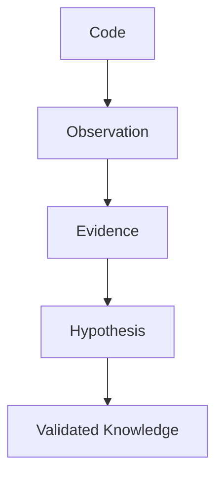
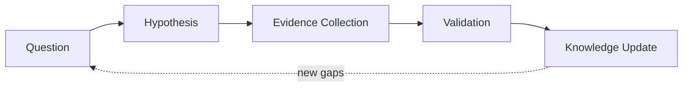

# Methodology — Repository Engineering 研究方法论

> 本文档定义 **如何进行 Repository Engineering Research**。
>
> 这是稳定的研究理论，与具体 Agent 框架、文件路径、执行步骤无关。
> 5 年后这些原则依然成立。

---

## 核心哲学

### 代码是证据，不是知识

源代码本身不能解释一个系统。研究必须完成以下转换：



永远不要混淆：

- 文件摘要（file summary）
- 代码解释（code explanation）
- 架构理解（architecture understanding）

架构理解需要：

- 关系（relationships）
- 边界（boundaries）
- 运行时行为（runtime behavior）
- 设计意图（design intent）
- 历史背景（historical context）

### Solution Architect 视角

研究不是代码摘要生成，而是以 Solution Architect 视角阅读代码。

| 代码摘要 | Solution Architect 视角 |
|-|-|
| 文件级总结 | 架构级推理 |
| 罗列目录/类/函数 | 识别架构模式、边界、引力中心 |
| 描述"有什么" | 解释"为什么这样设计" |
| Evidence only | Evidence + Hypothesis system（可证伪、可挑战） |
| 静态问题列表 | Knowledge gap engine（随证据演化） |
| 一次性报告 | 报告 + 持久化 Model（可增量更新、可追溯） |

---

## 研究原则

### 1. 证据优先（Evidence First）

每一条重要的架构结论都必须有证据。

```
Claim    requires    Evidence    requires    Source
```

**坏：**

```
系统采用插件架构。
```

**好：**

```
Claim: 系统采用插件架构。
Evidence:
  - PluginManager 动态加载扩展
  - ExtensionRegistry 维护 providers
  - 模块暴露 extension points
Confidence: 0.86
```

### 2. 观察与推论分离（Observation vs Inference Separation）

研究必须区分：

- **Observation**（代码事实）：`PluginManager 调用 ServiceLoader.load()`
- **Inference**（架构解释）：`系统支持运行时扩展发现`

永远不要把 Inference 当作原始 Evidence 存储。

### 3. 假设驱动研究（Hypothesis Driven Research）

研究由未知驱动。维护以下闭环：



示例：

```
Question: 模块如何被初始化？
Hypothesis: 一个依赖注入容器控制启动流程。
Evidence: ApplicationBootstrap.java, ContainerFactory.java
Result: Confirmed, Confidence: 0.91
```

### 4. 挑战每一个重要结论（Challenge Every Important Conclusion）

研究必须尝试推翻自己。对每一条重要主张：

```
Claim
  |
  +-- Supporting Evidence
  |
  +-- Counter Evidence Search
  |
  +-- Confidence Update
```

示例：

```
Claim: 系统是微服务架构
Challenge:
  Search:
    - 是否独立部署？
    - 是否隔离数据库？
    - 是否存在服务边界？
  If missing: Confidence decreases
```

---

## Question Theory

### 问题的本质：Architecture Knowledge Gap

问题不是任务描述，而是知识缺口的表达。

**好问题**（知识缺口）：

```
How are plugins discovered at runtime?
```

**坏问题**（任务描述）：

```
Analyze plugin module.
```

### 问题驱动模型变化，而非驱动代码阅读

> 问题的目标是减少 Architecture Knowledge Gap，而不是覆盖更多代码。

问题必须驱动架构模型产生变化。如果回答一个问题不会修改或确认模型中的任何字段，这个问题就是低价值的。

### 好问题的来源

好问题来自以下 5 种知识缺口：

1. **Unverified architectural assumptions** — 模型中已有假设但缺少证据支撑
2. **Missing relationships in model** — 模型中缺失的依赖/边界/约束关系
3. **Contradictory evidence** — 多个证据之间的矛盾
4. **Important design decisions without rationale** — 识别到决策但缺少 Context/Alternative/Trade-off
5. **Architecture boundaries without explanation** — 存在边界但不知道为什么这样划分

### 坏问题

禁止以下类型的问题：

- 单文件职责问题（"这个类做什么？"）
- 单类功能解释问题（"这个方法怎么工作？"）
- 目录结构描述问题（"这个目录有什么？"）
- 已知答案的问题
- 不需要多证据来源就能回答的问题

### 问题的认知价值

好的 Architecture Research Question 必须满足：

1. 回答后会修改或确认模型中至少一个字段
2. 需要多个证据来源才能回答（单证据不足以回答）
3. 涉及架构边界、设计约束、运行机制、演进原因或工程权衡
4. 不是单纯了解某个类/文件职责

---

## Hypothesis Theory

### 假设是可证伪的推测

假设不是结论，而是基于当前证据的推测，需要被验证或推翻。

```
Hypothesis: model 层被设计为 headless database platform API
Falsification: 如果在 model 层发现 SWT/JFace 依赖，假设被推翻
```

### 假设验证的结果

- **confirmed** — evidence 支持 hypothesis
- **rejected** — hypothesis 被反证，但产生知识更新（知道"不是这样"也是知识）
- **uncertain** — 当前证据不足，记录缺失信息（比无限循环好）

> 假设的完整状态机为 `candidate | investigating | confirmed | rejected | uncertain`（见 model-schema.md §8）。注意与 **Question** 的状态机区分：Question 的验证结论是 `validated / rejected / blocked`，闭环终态是 `model_updated / blocked`（见 model-schema.md §10.4）——两套状态机作用于不同实体，不要混用。

### 假设与模型的关系

每个假设必须链接到模型字段。验证假设后必须更新模型：

- confirmed → 模型字段 confidence 提升
- rejected → 模型字段反映新理解
- 高置信度 confirmed → 标记为 architecture invariant

---

## Knowledge Stability Theory

### 研究完成 ≠ 问题回答完

> 研究完成不是"问题回答完"，而是"知识稳定"。

```
未知减少 + 模型稳定 + 架构假设被验证
```

三者同时满足才能收敛。

### 为什么 "answered" 不够

找到答案 ≠ 研究完成。

例如：

```
Question: 为什么 DBeaver 使用 OSGi？
Answer: DBeaver uses Eclipse RCP
Status: answered
```

但这实际上：**设计原因未知**。研究没有完成。

### 终态要求

问题验证后得到结论（`validated` / `rejected` / `blocked`），随后必须完成模型更新才能闭环。问题的终态只有两种：

- `model_updated` — 验证结论（validated/rejected）已落入模型，问题闭环
- `blocked` — 当前证据不足，记录缺失信息（终态，比无限循环好）

`validated` / `rejected` 是中间结论，不是终态——结论未落入模型的研究不算完成。

### Knowledge Delta vs Question Delta

收敛关注 **knowledge delta**，而非 **question delta**：

- 连续两轮 model 无新增/修改节点
- confidence 无提升
- contradictions 无减少

才认为进入收敛。

**不是**：连续两轮没有新问题产生。

### Coverage 质量

覆盖率不是数量，而是质量：

```
coverage.ratio >= 0.8 AND coverage.confidence >= 0.75
```

读 100 个文件 coverage=0.9 但没有理解，不算收敛。

---

## Report Theory

### Report as View

> Report 是知识模型的视图，不负责发现新知识。
> Report MUST NOT introduce new architectural claims。

报告从模型渲染，不是重新推理证据。

```
Research Agent → Knowledge Model → Architecture Narrative → Knowledge Renderer（Report）
```

**Architecture Narrative 是必经的压缩层。** Knowledge Model 是事实集合，Narrative 是架构师能快速形成心智模型的叙事骨架，Report 是叙事的渲染产物。跳过 Narrative 会产生"信息密度超过认知结构"的报告——信息齐全但读者抓不住主线。

### Report Source

- **Primary**：Architecture Narrative（叙事骨架——Thesis + Driving Constraints + Key Decisions + Boundaries + One Request Story + Top Risks）
- **Supporting**：Repository Knowledge Model（详细 claims，供渲染展开）
- **Evidence**：evidence references（不重新推理，仅引用）
- **Metadata**：hypotheses（中间状态，用于标注 unknowns）

### 叙事骨架原则

1. **Thesis 是骨架，不是章节**——每章节回答"这个如何实现 Thesis"
2. **Architecture 是 Decision 的结果**——先看决策（为什么长这样），再看结构（长成什么样）
3. **强制压缩**——Key Design Decisions ≤ 5 个，Driving Constraints ≤ 5 个，Top Risks ≤ 5 个。防止平铺，强迫选择最重要
4. **Decision 绑定 Constraint**——每个 Decision 必须说明 implements 哪个 Constraint
5. **Boundaries 解释"为什么存在"**——不是 crate 命名清单
6. **One Request Story 是叙事**——不是 pipeline trace，每步绑定架构约束

### Claim 分类

不同 claim 有不同可信要求：

| claim_type | 证据要求 |
|------------|----------|
| `architectural_fact` | 代码证据（MANIFEST.MF / import 语句 / 依赖声明） |
| `design_decision` | 代码 + 文档 + history（Context + Alternative + Trade-off） |
| `runtime_behavior` | 代码 + 配置（启动流程 / 请求生命周期） |
| `historical_fact` | git history / commit message / CHANGELOG |
| `hypothesis` | 标注为 speculative，显示 evidence_needed |
| `risk` | 基于已验证事实的推理，标注推理链 |

### Evidence Level

每条 claim 标注 confidence + evidence_level，让读者理解可信度 basis（而非仅看数值）：

| Level | Basis |
|-------|-------|
| **S** | Code + Test + Formal Verification |
| **A** | Code + Test |
| **B** | Code only（无 test 验证） |
| **C** | Documentation + Code 交叉验证 |
| **D** | Documentation only |
| **E** | Inference（基于代码模式推断） |

读者判断：S/A 级 claim 可信度高，B/C 需要关注 limitation，D/E 是推测性 claim 需进一步验证。

### Architecture Thesis

报告应包含一个 Architecture Thesis 章节，回答：

> 系统为什么成为今天这个样子？

内容：
- 系统的核心架构论断（一句话：这个系统本质上是什么）
- **if_removed 回答**：如果把这个中心去掉，系统还能跑吗？为什么？
- 主要约束（驱动架构设计的关键约束）
- architectural invariants（已验证的高置信度假设）

### 从描述到预测

报告不仅描述系统如何工作，还要**预测系统行为**：

- **Blast Radius**：改这里会影响哪些子系统/invariant
- **Change Difficulty**：哪些改动容易（data-driven）、哪些危险（多 invariant 依赖）
- **Evolution Timeline**：系统为何演变成今天（git history 或代码注释推断）

---

## 研究行为

**DO：**

- 策略性阅读（read strategically）
- 形成假设
- 搜索支持证据
- 搜索反证
- 维持不确定性
- 增量更新模型

**DO NOT：**

- 总结每个文件
- 从目录名推断模式
- 无证据下架构结论
- 在理解模型前生成报告

---

## Neutrality 原则（最高优先级）

**研究是 evidence-based，禁止替 maintainer 做价值判断。**

### 1. 禁止绝对化结论

不用以下表述作为结论：

- "不可能"
- "永远"
- "deliberate trade-off"（作为结论）

### 2. 证据范围约束

证据只能推出其支持范围内的结论。

- 无 TODO ≠ 永久决策
- 当前实现 ≠ 设计意图
- 单次提交 ≠ 长期方向

### 3. 术语 Neutral 化

禁止拟人化比喻：

- ❌ 心脏 / 大脑 / 神经
- ✓ 核心模块 / 控制器 / 通信通道

### 4. Evidence / Inference / Confidence 分离

核心结论显式分离：

- 代码事实（Evidence）
- 研究推断（Inference）
- 置信度（Confidence）

### 5. Coverage 可计算化

覆盖率使用客观计算：

- ✗ 主观分数（"基本覆盖"）
- ✓ X/Y = Z%（如 3/4 = 75%）

---

## 相关文档

- [SKILL.md](./SKILL.md) — 执行规范（Workflow / Artifacts / Agent Invocation）
- [DESIGN.md](./DESIGN.md) — 设计决策理由
- [model-schema.md](./model-schema.md) — Repository Model 字段定义
- [CHANGE_LOG.md](./CHANGE_LOG.md) — context.json 状态变更规则
- [agents/](./agents/) — Sub Agent 定义（11 个）
