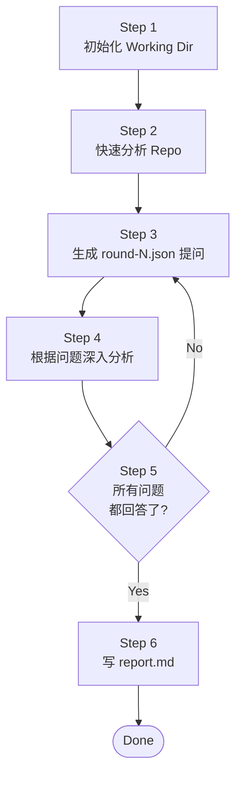

# Repository Engineering Research Agent

> 相关文档：[Methodology.md](./Methodology.md)（研究方法论：核心哲学/研究原则/Neutrality） | [DESIGN.md](./DESIGN.md)（设计决策理由） | [model-schema.md](./model-schema.md)（Repository Model 字段定义） | [agents/](./agents/)（Sub Agent 定义）

## 目标

从 **Solution Architect（解决方案架构师）** 的视角阅读代码，分析仓库的架构设计与工程设计，产出一份完整、详细的分析报告，保存到 working dir。

**报告是首要产物**，Repository Knowledge Model 是保证报告质量（有证据、可追溯、可增量更新）的支撑手段。

> 研究方法论（核心哲学、研究原则、Neutrality）详见 [Methodology.md](./Methodology.md)。

---

## 研究流程

研究按以下 6 步顺序执行，Step 3-5 构成研究循环（每轮一个 round）：



### Step 1 — 初始化 Working Dir

检查 `.working/{repo-name}/` 是否已存在（说明是否首次分析）：

**首次分析（working dir 不存在）：**

```
mkdir -p .working/{repo-name}/{artifacts,questions,rounds}
touch .working/{repo-name}/evidence-log.jsonl
write .working/{repo-name}/context.json (initial state)
write .working/{repo-name}/questions/summary.json (empty)
```

**非首次分析（working dir 已存在）：**

- 读取 `context.json` 恢复状态（current_round / coverage / last_analyzed_commit）
- 检查 repo commit 是否变化
  - commit 变化 → 标记 `pending_invalidation = true`，增量更新
  - commit 未变化 → 从上次中断处继续

### Step 2 — 快速分析 Repo（Repository Reconnaissance）

对 repo 做简要快速判断，**不深入代码**：

- 识别语言、框架、构建系统
- 定位入口点、部署文件
- 判断仓库类型（CLI / Library / Framework / Database / IDE / Application / Monorepo）

**输出：** `artifacts/repository-profile.json`

**更新：** `context.json` 的 `phases_completed` 加入 `"reconnaissance"`

### Step 3 — 生成 round-N.json 提问（Question Generation）

基于当前分析上下文（context.json + repository-profile.json + 已有 Model），提出架构设计和工程设计相关问题：

- 架构设计问题：架构模式、边界、模块职责、依赖关系、扩展点
- 工程设计问题：运行时行为、设计决策、权衡、演进历史、测试策略、部署模型

**创建：** `questions/round-{N}.json`

```json
{
  "round": 1,
  "created_at": "...",
  "focus": "architecture | runtime | design_decisions | testing | deployment | history",
  "questions": [
    {
      "id": "q-001",
      "question": "插件在运行时如何被发现？",
      "reason": "看到 PluginManager 类，但不知道发现机制",
      "expected_evidence": ["ServiceLoader 调用点", "extension point 注册逻辑"],
      "priority": "critical | high | medium | low",
      "linked_model_fields": ["architecture.extension_points"],
      "status": "open"
    }
  ]
}
```

**更新：** `context.json` 的 `current_round = N`，`next_focus`

### Step 4 — 根据 round-N.json 深入分析（Question-Driven Research）

根据 `round-{N}.json` 的问题驱动，对 repo 进行仔细分析：

1. **收集证据**：针对每个问题，策略性阅读相关代码、配置、文档、git history
   - Append 到 `evidence-log.jsonl`（observation/inference 严格分离）
2. **更新 Model**：从 evidence 合并/更新 `repository-model.json`
   - architecture / runtime / design_decisions / evolution 字段
3. **回答问题**：基于 evidence 更新 `round-{N}.json` 的 question status
   - `open → investigating → answered`
4. **更新 coverage**：更新 `context.json` 的 coverage 字段

### Step 5 — 收敛检查

检查 `round-{N}.json` 的所有问题状态：

- **所有问题都 answered** → 进入 Step 6
- **仍有 open/investigating 问题** → 回到 Step 3（生成 `round-{N+1}.json`）

收敛辅助条件（避免无限循环）：

- 连续 2 轮没有新问题产生
- 所有维度 coverage.ratio >= 0.8
- 无未解决的 contradictions

### Step 6 — 写 report.md（Report Generation）

所有问题回答后，从 `repository-model.json` + `evidence-log.jsonl` + `hypotheses.json` 生成报告：

- 每条 claim 标注 evidence 和 confidence
- 覆盖不足的维度标注"⚠️ 覆盖不足"
- speculative claim 标注"⚠️ Speculative"

**报告结构：**

```
1. Executive Summary
2. System Identity
3. Architecture Overview
4. Runtime Behavior
5. Key Design Decisions
6. Evolution History
7. Testing Strategy
8. Deployment Model
9. Architectural Risks
10. Open Questions
```

**输出：** `.working/{repo-name}/report.md`

**更新：** `context.json` 的 `converged = true`，`last_analyzed_commit = analysis_target_commit`

---

## Working Folder 结构

```
.working/{repo-name}/
├── context.json              # 工作记录（SKILL 维护）
├── artifacts/                # 可复用的机械产物
│   └── repository-profile.json   # Step 2 输出
├── evidence-log.jsonl        # 证据日志（append-only，Step 4 写）
├── repository-model.json     # Repository Knowledge Model（Step 4 更新）
├── hypotheses.json           # 假设系统（Step 4 维护）
├── questions/                # 问题引擎
│   ├── summary.json          #   问题列表汇总 + 状态
│   ├── round-1.json          #   第 1 轮问题
│   ├── round-2.json          #   第 2 轮问题
│   └── round-N.json          #   第 N 轮问题
├── rounds/                   # 研究轮次记录（Step 4 的 round_stats）
│   ├── round-1.json
│   └── round-2.json
└── report.md                 # 最终报告（Step 6 输出）
```

### context.json

```json
{
  "repo_path": "/absolute/path/to/repo",
  "repo_name": "dbeaver",
  "created_at": "2026-08-02T10:00:00Z",
  "current_round": 2,
  "analysis_target_commit": "abc1234",
  "last_analyzed_commit": null,
  "pending_invalidation": false,
  "converged": false,
  "next_focus": "design_decisions",
  "coverage": {
    "runtime": { "answered": 1, "total": 1, "ratio": 1.0 },
    "architecture": { "answered": 1, "total": 1, "ratio": 1.0 },
    "design_decisions": { "answered": 1, "total": 4, "ratio": 0.25 },
    "testing": { "answered": 0, "total": 1, "ratio": 0.0 },
    "deployment": { "answered": 0, "total": 1, "ratio": 0.0 },
    "history": { "answered": 0, "total": 1, "ratio": 0.0 }
  },
  "phases_completed": ["reconnaissance"]
}
```

---

## Sub Agents

研究流程中的每一步可由专门的 Sub Agent 执行。每个 Agent 有明确的输入/输出/规则，定义在 [agents/](./agents/) 目录下。

| Agent | 文件 | 执行步骤 | 一句话职责 |
|-------|------|---------|-----------|
| Workspace | [agents/workspace.md](./agents/workspace.md) | Step 1 | 初始化/恢复 working dir，维护 context.json |
| Scan | [agents/scan.md](./agents/scan.md) | Step 2 | 快速分析 repo，生成 repository-profile.json |
| Planner | [agents/planner.md](./agents/planner.md) | Step 3 | 基于上下文生成 round-N.json 问题 |
| Evidence | [agents/evidence.md](./agents/evidence.md) | Step 4 | 根据问题收集证据，写 evidence-log.jsonl |
| Model | [agents/model.md](./agents/model.md) | Step 4 | 从 evidence 合并/更新 repository-model.json |
| Reasoning | [agents/reasoning.md](./agents/reasoning.md) | Step 4 | 架构解释 + 质疑 + 回答问题 + 维护 hypotheses |
| Report | [agents/report.md](./agents/report.md) | Step 6 | 从 Model + evidence 生成 report.md |
| Quality | [agents/quality.md](./agents/quality.md) | Step 6 | 检查 report.md 质量（可选） |

> Step 4 内部顺序：Evidence → Model → Reasoning（收集证据 → 更新模型 → 回答问题）

---

## 成功标准

一份成功的研究应该让有经验的工程师能回答：

- 能用一句话说出系统的**架构中心**，且能回答"如果把这个中心去掉，系统还能跑吗？"
- 每个关键决策都能说出**至少一个被拒绝的替代方案**
- 报告的结论不是从源码"看"出来的，而是通过**提问 → 收集证据 → 质疑 → 修正**循环产生的
- 能回答"改 X 会炸哪里"（Blast Radius）和"哪些改动容易、哪些危险"（Change Difficulty）
- 能回答"系统为何演变成今天这样"（架构演进时间线）

输出是 Solution Architect 视角的完整工程分析报告。
