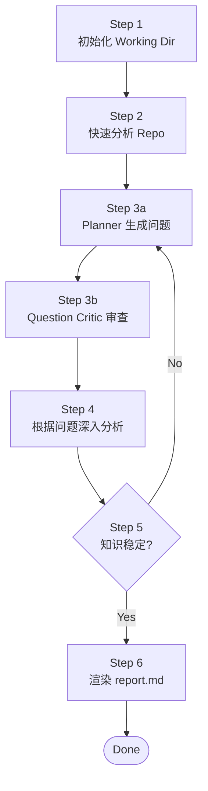
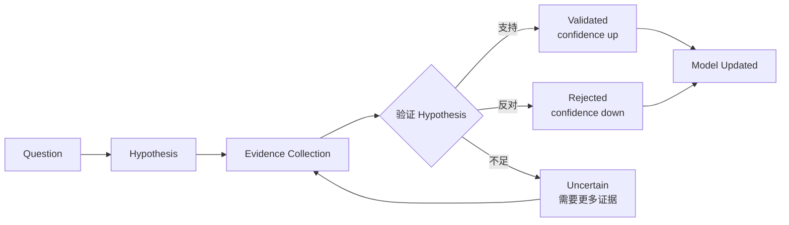

# Repository Engineering Research Agent

> 相关文档：[Methodology.md](./Methodology.md)（研究方法论） | [DESIGN.md](./DESIGN.md)（设计决策理由） | [model-schema.md](./model-schema.md)（Repository Model 字段定义） | [CHANGE_LOG.md](./CHANGE_LOG.md)（状态变更日志） | [agents/](./agents/)（Sub Agent 定义）

## 目标

从 **Solution Architect（解决方案架构师）** 的视角研究仓库，构建 **evidence-backed Repository Knowledge Model**。

基于稳定的 Knowledge Model 生成架构分析报告，保存到 working dir。

> **Knowledge Model First, Report as View。**
> 报告是模型的展示形式，不负责产生新的架构结论。

> 研究方法论（核心哲学、研究原则、Neutrality）详见 [Methodology.md](./Methodology.md)。

---

## 研究流程

研究按以下 6 步顺序执行，Step 3-5 构成研究循环（每轮一个 round）：



### Step 1 — 初始化 Working Dir

检查 `.working/{repo-name}/` 是否已存在（说明是否首次分析）：

**首次分析（working dir 不存在）：**

```
mkdir -p .working/{repo-name}/{artifacts,questions,rounds}
touch .working/{repo-name}/evidence-log.jsonl
write .working/{repo-name}/context.json (initial state)
write .working/{repo-name}/questions/summary.json (empty)
```

**非首次分析（working dir 已存在）：**

- 读取 `context.json` 恢复状态（current_round / coverage / last_analyzed_commit）
- 检查 repo commit 是否变化
  - commit 变化 → 标记 `pending_invalidation = true`，增量更新
  - commit 未变化 → 从上次中断处继续

### Step 2 — 快速分析 Repo（Repository Reconnaissance）

对 repo 做简要快速判断，**不深入代码**：

- 识别语言、框架、构建系统
- 定位入口点、部署文件
- 判断仓库类型（CLI / Library / Framework / Database / IDE / Application / Monorepo）

**输出：** `artifacts/repository-profile.json`

### Step 3 — 生成 round-N.json 提问（Question Generation）

基于当前分析上下文（context.json + repository-profile.json + repository-model.json + hypotheses.json），识别当前架构模型中的**关键未知点、不确定假设和未验证关系**，生成 Research Question。

> **核心约束：问题的目标是减少 Architecture Knowledge Gap，而不是覆盖更多代码。**
> 问题必须驱动架构模型产生变化，而不是驱动 Agent 阅读更多代码。

#### Question Generation Rules

问题必须来自以下来源：

1. **Unverified architectural assumptions** — 模型中已有假设但缺少证据支撑
2. **Missing relationships in repository-model** — 模型中缺失的依赖/边界/约束关系
3. **Contradictory evidence** — 多个证据之间的矛盾
4. **Important design decisions without rationale** — 识别到决策但缺少 Context/Alternative/Trade-off
5. **Architecture boundaries without explanation** — 存在边界但不知道为什么这样划分

**禁止生成：**

- 单文件职责问题（"这个类做什么？"）
- 单类功能解释问题（"这个方法怎么工作？"）
- 目录结构描述问题（"这个目录有什么？"）
- 已知答案的问题
- 不需要多证据来源就能回答的问题

#### Question Quality Gate

每个 Question 必须满足：

1. **回答后会修改或确认 repository-model.json 中至少一个字段**
2. **需要多个证据来源才能回答**（单证据不足以回答）
3. **涉及架构边界、设计约束、运行机制、演进原因或工程权衡**
4. **如果只是了解某个类/文件职责，则认为低价值问题，不生成**

#### Question Schema

**创建：** `questions/round-{N}.json`

```json
{
  "round": 1,
  "created_at": "...",
  "focus": "architecture | runtime | design_decisions | testing | deployment | history",
  "questions": [
    {
      "id": "q-001",
      "type": "boundary | decision | runtime | evolution | risk | pattern",
      "question": "为什么 model 插件不能依赖 UI？这个约束如何保证 CloudBeaver 复用？",
      "why_it_matters": "验证 extension-point 是否是系统可扩展性的核心架构约束，还是只是代码组织习惯",
      "expected_model_change": [
        "architecture.boundaries",
        "architecture.invariants",
        "design_decisions"
      ],
      "hypothesis": "model 层被设计为 headless database platform API，以支持 CloudBeaver 服务端复用",
      "evidence_needed": [
        "model 插件的 MANIFEST.MF 依赖声明",
        "CloudBeaver import path",
        "historical commits 关于 model/UI 分离"
      ],
      "priority_score": 0.9,
      "impact": "high",
      "uncertainty": "high",
      "status": "open"
    }
  ]
}
```

#### 字段说明

| 字段 | 类型 | 说明 |
|------|------|------|
| `type` | enum | `boundary`（边界）/ `decision`（决策）/ `runtime`（运行时）/ `evolution`（演进）/ `risk`（风险）/ `pattern`（模式） |
| `why_it_matters` | string | 为什么这个问题对架构理解重要？回答后会改变什么理解？ |
| `expected_model_change` | string[] | 回答后会修改/确认 repository-model.json 的哪些字段 |
| `hypothesis` | string | 初始假设（基于当前证据的推测，待验证或推翻） |
| `evidence_needed` | string[] | 验证假设需要哪些类型的证据 |
| `priority_score` | float | `Impact * Uncertainty * Evidence Availability`，0.0-1.0 |
| `impact` | enum | `high` / `medium` / `low`（对架构理解的影响） |
| `uncertainty` | enum | `high` / `medium` / `low`（当前不确定性） |

#### Priority 计算

```
Priority = Architecture Impact × Current Uncertainty × Evidence Availability
```

| 问题 | Impact | Uncertainty | Priority |
|------|--------|-------------|----------|
| 插件边界划分 | 高 | 高 | 0.9 |
| 某工具类作用 | 低 | 低 | 0.1 |

#### Question Critic 审查（Step 3 内置）

Planner 生成问题后，必须经过 Question Critic 审查（见 [agents/question-critic.md](./agents/question-critic.md)）：

```
Planner 生成问题 → Question Critic 审查 → approved 问题进入 Step 4
                                        → rejected 问题反馈给 Planner
```

审查规则：

1. **禁止纯代码解释问题**（"PluginManager 做什么？"→ 拒绝）
2. **必须影响 Model**（回答后会修改 repository-model 字段）
3. **必须需要多源证据**（单文件可答的问题拒绝）
4. **必须有 hypothesis**（无假设的问题拒绝）
5. **必须有 expected_model_change**（不知道影响哪个模型字段的问题拒绝）

**输出：** `questions/round-{N}.reviewed.json`（只含 approved 问题）

### Step 4 — 根据 round-N.json 深入分析（Question-Driven Research）

根据 `round-{N}.json` 的问题驱动，对 repo 进行仔细分析。

> **核心改变：回答不是结束，而是模型验证。**
> 找到答案 ≠ 完成。必须验证假设、更新模型、标注 invariant。

#### 研究流程（每个 Question）



#### 执行步骤

1. **收集证据**：针对每个问题的 `evidence_needed`，策略性阅读相关代码、配置、文档、git history
   - Append 到 `evidence-log.jsonl`（observation/inference 严格分离）
   - 必须收集多个证据来源（单证据不足以回答）
2. **验证假设**：判断证据是否支持 `hypothesis`
   - 支持 → confidence 提升
   - 反对 → confidence 降低，记录反证，可能生成新问题
   - 不足 → 继续收集证据
3. **更新 Model**：基于验证结果，修改/确认 `repository-model.json` 的 `expected_model_change` 字段
   - architecture / runtime / design_decisions / evolution 字段
4. **标注 invariant**：如果假设被高置信度验证，标记为 architecture invariant
   - 写入 `repository-model.json` 的 `architecture.invariants` 字段

#### Question 状态机

```
open
  ↓ (开始收集证据)
investigating
  ↓ (证据充分，验证假设)
validated (假设被支持) / rejected (假设被推翻) / blocked (证据不足)
  ↓ (更新模型完成)
model_updated
```

- `open` — 问题已生成，未开始研究
- `investigating` — 正在收集证据
- `validated` — 假设被证据支持，待更新模型
- `rejected` — 假设被证据推翻，待更新模型反映新理解
- `blocked` — 当前证据不足，记录缺失信息（终态，比无限循环好）
- `model_updated` — 模型已更新，问题闭环（终态）

#### 回答问题后必须执行

1. **判断该答案是否支持原 hypothesis**（validated / rejected / uncertain）
2. **更新 confidence**（基于证据数量、来源多样性、反证搜索结果）
3. **更新 repository-model.json** 的 `expected_model_change` 字段
4. **标记是否形成 architecture invariant**（高置信度 validated 的假设）

### Step 5 — Research Convergence Check

检查当前 round 的研究结果，而不是仅检查问题状态。

> **核心改变：研究完成不是"问题回答完"，而是"知识稳定"。**
> 未知减少 + 模型稳定 + 架构假设被验证，三者同时满足才能收敛。

#### 1. Question Resolution

所有 `round-{N}.json` 问题必须进入终态：

- `validated` — evidence 支持 hypothesis，并已更新 repository-model
- `rejected` — hypothesis 被反证，记录原因，同时更新 repository-model 反映新理解
- `blocked` — 当前证据不足，记录缺失信息（比无限循环好）

**禁止：**
- `answered` 作为最终状态（找到答案 ≠ 研究完成）
- 未更新模型的问题视为完成
- 仅因为 question answered 而认为研究完成

#### 2. Model Update Check

确认 `repository-model.json` 的以下字段是否因为本轮研究产生变化：

- `architecture`
- `runtime`
- `design_decisions`
- `evolution`

**如果 evidence 增加但 model 无变化：认为研究未产生知识。**

#### 3. Stability Check

满足以下条件**之一**时继续研究（返回 Step 3）：

- 存在 high-impact 未验证 hypothesis
- 存在 unresolved contradiction
- 存在 confidence < threshold 的核心模型节点
- coverage 低于目标

#### 4. Convergence Criteria

进入 Step 6 需要**同时满足**：

- 所有问题进入终态（validated / rejected / blocked）
- 无 unresolved contradictions
- 所有核心模型节点 confidence >= threshold
- coverage.ratio >= 0.8 **AND** coverage.confidence >= 0.75
- 最近两轮 repository-model delta 接近 0（knowledge delta，而非 question delta）

**否则：** 返回 Step 3 创建下一轮 research question。

#### Coverage 质量升级

```json
{
  "architecture": {
    "ratio": 0.8,
    "confidence": 0.85,
    "validated_claims": 5
  }
}
```

收敛条件：`coverage.ratio >= 0.8 AND coverage.confidence >= 0.75`

> 读 100 个文件 coverage=0.9 但没有理解，不算收敛。

### Step 6 — 渲染 report.md（Knowledge Rendering）

当 repository-model 达到稳定状态后，将 validated architecture knowledge 渲染为 `report.md`。

> **核心改变：Report 是知识模型的视图，不负责发现新知识。**
> Report MUST NOT introduce new architectural claims。所有 claim 必须来自 repository-model。

#### Report Source

```
Primary:    repository-model.json（最终知识）
Supporting: evidence-log.jsonl references（证据引用，不重新推理）
Metadata:   hypotheses.json（中间状态，用于标注 unknowns）
```

> Report 不直接读 evidence-log 重新推理。从 model 渲染，引用 evidence 编号。

#### Report Generation Gate

生成报告前必须检查：

- [ ] 无 critical unresolved hypothesis
- [ ] 所有 major claims 有 evidence 支撑
- [ ] 所有 claims 有 confidence 标注
- [ ] contradictions 已记录
- [ ] speculative claims 已分离标注

**如果 Gate 未通过：** 返回 Step 3 继续研究，而非生成不完整报告。

#### Claim 标注规范

每条 claim 必须标注：

```json
{
  "claim": "model 插件不依赖 SWT/JFace",
  "claim_type": "architectural_fact | design_decision | runtime_behavior | historical_fact | hypothesis | risk",
  "evidence": ["ev-001", "ev-007"],
  "confidence": 0.95,
  "reasoning": "MANIFEST.MF 的 Require-Bundle 中无 SWT/JFace 依赖",
  "alternative": "（如果是 decision）考虑过共享代码库，但无法强制约束"
}
```

不同 claim_type 的证据要求：

| claim_type | 证据要求 |
|------------|----------|
| `architectural_fact` | 代码证据（MANIFEST.MF / import 语句 / 依赖声明） |
| `design_decision` | 代码 + 文档 + history（Context + Alternative + Trade-off） |
| `runtime_behavior` | 代码 + 配置（启动流程 / 请求生命周期） |
| `historical_fact` | git history / commit message / CHANGELOG |
| `hypothesis` | 标注为 speculative，显示 evidence_needed |
| `risk` | 基于已验证事实的推理，标注推理链 |

#### 报告结构

```
1. Executive Summary

2. Architecture Thesis
   - 系统的核心架构论断（一句话：这个系统本质上是什么）
   - 主要约束（驱动架构设计的关键约束）
   - architectural invariants（已验证的高置信度假设）

3. System Identity
   - 语言、框架、构建系统、仓库类型

4. Architecture Model
   4.1 Components（模块 + 职责）
   4.2 Boundaries（边界 + 约束方向）
   4.3 Dependency Rules（依赖规则）
   4.4 Extension Mechanisms（扩展机制）

5. Runtime Model
   5.1 Startup Flow
   5.2 Request/Data Flow
   5.3 Lifecycle

6. Design Decisions
   每个 Decision:
   - Context（约束）
   - Alternatives（被考虑的替代方案）
   - Trade-offs（获得了什么 / 牺牲了什么）
   - Evidence
   - Confidence

7. Evolution Model
   - Timeline
   - Motivation（演进驱动力）
   - Architectural changes（架构变化）

8. Quality Attributes
   - Extensibility
   - Maintainability
   - Performance
   - Testability

9. Risks and Debt
   仅包含 evidence-backed risks（不编造风险）

10. Unknowns
    剩余 hypotheses + blocked questions + 缺失信息
```

#### Architecture Thesis 示例

```markdown
## 2. Architecture Thesis

DBeaver 的架构由三个约束塑造：

1. 支持 100+ 数据库扩展，且核心代码无需修改
2. 保持 database model 独立于 UI，以支持 CloudBeaver 服务端复用
3. 跨桌面和云端产品复用核心能力

这些约束解释了：
- OSGi adoption（运行时模块隔离 + extension-point 机制）
- plugin boundaries（model ↔ UI 严格分离）
- extension points（dataSourceProvider / sqlDialect / objectManager）
```

**输出：** `.working/{repo-name}/report.md`

---

## Working Folder 结构

```
.working/{repo-name}/
├── context.json              # 工作记录（SKILL 维护）
├── artifacts/                # 可复用的机械产物
│   └── repository-profile.json   # Step 2 输出
├── evidence-log.jsonl        # 证据日志（append-only，Step 4 写）
├── repository-model.json     # Repository Knowledge Model（Step 4 更新）
├── hypotheses.json           # 假设系统（Step 4 维护）
├── questions/                # 问题引擎
│   ├── summary.json          #   问题列表汇总 + 状态
│   ├── round-1.json          #   第 1 轮问题
│   ├── round-2.json          #   第 2 轮问题
│   └── round-N.json          #   第 N 轮问题
├── rounds/                   # 研究轮次记录（Step 4 的 round_stats）
│   ├── round-1.json
│   └── round-2.json
└── report.md                 # 最终报告（Step 6 输出）
```

### context.json

```json
{
  "repo_path": "/absolute/path/to/repo",
  "repo_name": "dbeaver",
  "created_at": "2026-08-02T10:00:00Z",
  "current_round": 2,
  "analysis_target_commit": "abc1234",
  "last_analyzed_commit": null,
  "pending_invalidation": false,
  "converged": false,
  "next_focus": "design_decisions",
  "coverage": {
    "runtime": { "answered": 1, "total": 1, "ratio": 1.0 },
    "architecture": { "answered": 1, "total": 1, "ratio": 1.0 },
    "design_decisions": { "answered": 1, "total": 4, "ratio": 0.25 },
    "testing": { "answered": 0, "total": 1, "ratio": 0.0 },
    "deployment": { "answered": 0, "total": 1, "ratio": 0.0 },
    "history": { "answered": 0, "total": 1, "ratio": 0.0 }
  },
  "phases_completed": ["reconnaissance"]
}
```

---

## Sub Agents

研究流程由 Orchestrator 调度多个 Sub Agent 执行。每个 Agent 有明确的输入/输出/规则，定义在 [agents/](./agents/) 目录下。

| Agent | 文件 | 执行步骤 | 一句话职责 |
|-------|------|---------|-----------|
| Orchestrator | [agents/orchestrator.md](./agents/orchestrator.md) | 全程 | **调度控制器**——读取 context，决定调哪个 Agent，是否继续/停止 |
| Workspace | [agents/workspace.md](./agents/workspace.md) | Step 1 | 初始化/恢复 working dir，维护 context.json |
| Scan | [agents/scan.md](./agents/scan.md) | Step 2 | 快速分析 repo，生成 repository-profile.json |
| Planner | [agents/planner.md](./agents/planner.md) | Step 3 | 基于上下文生成 round-N.json 问题 |
| Question Critic | [agents/question-critic.md](./agents/question-critic.md) | Step 3 | **审查问题质量**——拒绝低价值问题，批准 Architecture Research Question |
| Evidence | [agents/evidence.md](./agents/evidence.md) | Step 4 | 根据问题收集证据，写 evidence-log.jsonl |
| Model | [agents/model.md](./agents/model.md) | Step 4 | 从 evidence 合并/更新 repository-model.json |
| Reasoning | [agents/reasoning.md](./agents/reasoning.md) | Step 4 | 架构解释 + 质疑 + 回答问题 + 维护 hypotheses |
| Report | [agents/report.md](./agents/report.md) | Step 6 | 从 Model 渲染 report.md（Knowledge Rendering，禁止新增 claim） |
| Quality | [agents/quality.md](./agents/quality.md) | Step 6 | 检查 report.md 质量（可选） |

> **Orchestrator 不分析代码，只做调度决策。**
> Step 4 内部顺序：Evidence → Model → Reasoning（收集证据 → 更新模型 → 回答问题）
> Step 3 内部顺序：Planner → Question Critic（生成问题 → 审查质量）

---

## 成功标准

一份成功的研究应该让有经验的工程师能回答：

- 能用一句话说出系统的**架构中心**，且能回答"如果把这个中心去掉，系统还能跑吗？"
- 每个关键决策都能说出**至少一个被拒绝的替代方案**
- 报告的结论不是从源码"看"出来的，而是通过**提问 → 收集证据 → 质疑 → 修正**循环产生的
- 能回答"改 X 会炸哪里"（Blast Radius）和"哪些改动容易、哪些危险"（Change Difficulty）
- 能回答"系统为何演变成今天这样"（架构演进时间线）

输出是 Solution Architect 视角的完整工程分析报告。
