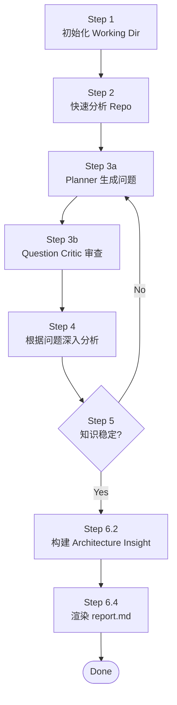
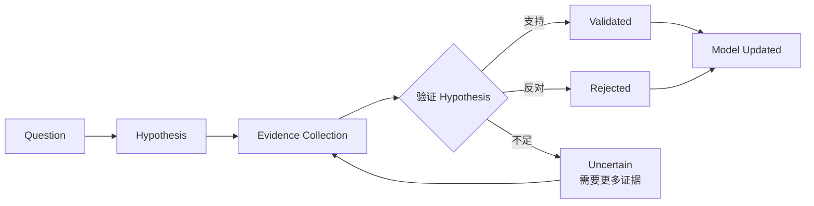

# Repository Engineering Research Agent

> 相关文档：[Methodology.md](./Methodology.md)（研究方法论） | [DESIGN.md](./DESIGN.md)（设计决策理由） | [model-schema.md](./model-schema.md)（Repository Model 字段定义） | [CHANGE_LOG.md](./CHANGE_LOG.md)（状态变更日志） | [agents/](./agents/)（Sub Agent 定义）

## 目标

构建 evidence-backed Repository Knowledge Model，基于稳定的 Model 生成架构分析报告。

> **Knowledge Model First, Report as View。**
> 研究方法论详见 [Methodology.md](./Methodology.md)。

---

## 研究流程

6 步顺序执行，Step 3-5 构成研究循环：



### Step 1 — 初始化 Working Dir

由 Resume Agent 检查 `.working/{repo-name}/` 是否已存在并判断现场状态，Workspace Agent 执行初始化/恢复：

**首次分析：**

```
mkdir -p .working/{repo-name}/{artifacts,questions,rounds}
touch .working/{repo-name}/evidence-log.jsonl
write .working/{repo-name}/context.json (initial state)
write .working/{repo-name}/questions/summary.json (empty)
```

**非首次分析：**

- 读取 `context.json` 恢复状态
- 检查 repo commit 是否变化
  - commit 变化 → `pending_invalidation = true`，增量更新
  - commit 未变化 → 从上次中断处继续

### Step 2 — 快速分析 Repo

对 repo 做简要快速判断，**不深入代码**（Phase 0 Reconnaissance）：

- 识别语言、框架、构建系统
- 定位入口点、部署文件
- 判断仓库类型（CLI / Library / Framework / Database / IDE / Application / Monorepo）
- 提取 business_signals（README 首段 / description / target users / use cases / non-goals，供 Step 6 报告 §2 使用）

随后做结构发现（Phase 1 Structural Discovery）：

- 识别架构单元（applications / libraries / services / infrastructure / tests），**不描述每个文件**
- 建立模块清单（模块职责留空，由 Model Agent 在 Step 4 填充）

**输出：**

- `artifacts/repository-profile.json`（Phase 0：身份事实 + business_signals）
- `artifacts/directory-model.json`（Phase 1：架构单元）
- `artifacts/module-model.json`（Phase 1：模块清单）

### Step 3 — 生成 round-N.json 提问

基于当前分析上下文（context.json + repository-profile.json + repository-model.json + hypotheses.json），生成 Research Question。

> 问题质量标准详见 [Methodology.md](./Methodology.md) §Question Theory。

**创建：** `questions/round-{N}.json`（Planner 只生成问题、不写文件，由 Workspace Agent 落盘）

```json
{
  "round": 1,
  "created_at": "...",
  "focus": "architecture | runtime | design_decisions | testing | deployment | history",
  "questions": [
    {
      "id": "q-001",
      "type": "boundary | decision | runtime | evolution | risk | pattern",
      "question": "为什么 model 插件不能依赖 UI？这个约束如何保证 CloudBeaver 复用？",
      "why_it_matters": "验证 extension-point 是否是系统可扩展性的核心架构约束",
      "expected_model_change": [
        "architecture.boundaries",
        "architecture.invariants",
        "design_decisions"
      ],
      "hypothesis": "model 层被设计为 headless database platform API，以支持 CloudBeaver 服务端复用",
      "evidence_needed": [
        "model 插件的 MANIFEST.MF 依赖声明",
        "CloudBeaver import path",
        "historical commits 关于 model/UI 分离"
      ],
      "priority_score": 0.9,
      "impact": "high",
      "uncertainty": "high",
      "status": "open"
    }
  ]
}
```

| 字段 | 说明 |
|------|------|
| `type` | `boundary` / `decision` / `runtime` / `evolution` / `risk` / `pattern` |
| `expected_model_change` | 回答后会修改/确认 repository-model.json 的哪些字段 |
| `hypothesis` | 初始假设（待验证或推翻） |
| `evidence_needed` | 验证假设需要哪些类型的证据 |
| `priority_score` | `Impact × Uncertainty × Evidence Availability`，0.0-1.0 |

#### Question Critic 审查

Planner 生成问题后，必须经过 Question Critic 审查（[agents/question-critic.md](./agents/question-critic.md)）：

```
Planner 生成问题 → Question Critic 审查 → approved 问题进入 Step 4
                                        → rejected 问题反馈给 Planner
```

**输出：** `questions/round-{N}.reviewed.json`（由 Question Critic 直接写入，含全部问题的审查结果——approved + rejected 及理由；仅 approved 问题进入 Step 4，rejected 反馈给 Planner）

### Step 4 — 根据 round-N.json 深入分析

根据 `round-{N}.json` 的问题驱动研究。

#### 执行顺序



1. **收集证据**：针对每个问题的 `evidence_needed`，策略性阅读相关代码、配置、文档、git history
   - Append 到 `evidence-log.jsonl`（observation/inference 严格分离）
2. **验证假设**：判断证据是否支持 `hypothesis`
   - 支持 → confidence 提升
   - 反对 → confidence 降低，记录反证
   - 不足 → 继续收集证据
3. **更新 Model**：修改/确认 `repository-model.json` 的 `expected_model_change` 字段
4. **标注 invariant**：高置信度 validated 的假设 → 写入 `architecture.invariants`

#### Question 状态机

```
open → investigating → validated/rejected/blocked → model_updated
```

- `open` — 问题已生成，未开始研究
- `investigating` — 正在收集证据
- `validated` — 假设被证据支持，待更新模型
- `rejected` — 假设被证据推翻，待更新模型反映新理解
- `blocked` — 证据不足，记录缺失信息（终态）
- `model_updated` — 模型已更新，问题闭环（终态）

### Step 5 — 收敛检查

检查知识稳定性，而非仅检查问题状态。

> 收敛理论详见 [Methodology.md](./Methodology.md) §Knowledge Stability Theory。

#### 收敛条件（必须同时满足）

- [ ] 所有问题进入终态（`model_updated` / `blocked`，见 Step 4 Question 状态机）
- [ ] 无 unresolved contradictions
- [ ] 所有核心模型节点 confidence >= 0.75
- [ ] 所有维度 `coverage.ratio >= 0.8 AND coverage.confidence >= 0.75`
- [ ] 最近两轮 repository-model delta 接近 0（knowledge delta：无新增/修改节点、confidence 无提升、contradictions 无减少）

> 判据是 **knowledge delta**，不是"连续两轮没有新问题"——见 [Methodology.md](./Methodology.md) §Knowledge Stability Theory。

**满足 →** 进入 Step 6
**不满足 →** 返回 Step 3 创建下一轮问题

### Step 6 — 渲染 report.md

当 repository-model 达到稳定状态后，**先构建 Architecture Insight，再渲染 report.md**。

> Report 理论（Thesis 为骨架、Architecture 是 Decision 的结果等叙事骨架原则）详见 [Methodology.md](./Methodology.md) §Report Theory。

#### 6.1 Report Generation Gate

生成前必须检查：

- [ ] 无 critical unresolved hypothesis
- [ ] 所有 major claims 有 evidence 支撑
- [ ] 所有 claims 有 confidence + evidence_level 标注
- [ ] contradictions 已记录
- [ ] speculative claims 已分离标注

**Gate 未通过 →** 返回 Step 3 继续研究

#### 6.2 Architecture Insight（中间产物，必经阶段）

**不是从 repository-model 直接渲染 report。** 先压缩为 Architecture Insight——把 Knowledge Model 转化为架构师能快速形成系统心智模型的**洞察骨架**（每个决策/边界/运行时环节回答「为什么 → 怎么做 → 代价 → 意味着什么」）。

**Pipeline：**

```
repository-model.json
        ↓
architecture-insight.json（洞察层：Intent / Mechanism / Constraint / Trade-off / Evidence / Engineering Meaning）
        ↓
report.md（叙事渲染）
```

**创建：** `.working/{repo-name}/architecture-insight.json`

> ⚠️ **不要让 Agent 直接写报告。** 报告必须从 Insight 生成，Insight 从 Model 生成——三层流水线保证「事实 → 洞察 → 文章」逐层升格，任何一层都不该跳过。

Insight 必须回答以下问题，每个回答 ≤ 200 字：

```json
{
  "schema_version": "2.0",
  "repo_name": "buzz",
  "system_identity": {
    "what_is": "这个 repo 是什么？一句话——类型、定位、一句话价值主张",
    "repo_type": "CLI / Library / Framework / Database / IDE / Application / Platform / Monorepo",
    "scale": "规模信号——代码量、模块数、目标用户量、目标吞吐量（如适用）",
    "target_users": "目标用户是谁？谁部署？谁使用？"
  },
  "business_context": {
    "needs_satisfied": "满足什么业务需求？解决什么问题？（用业务语言，不是技术语言）",
    "business_scope": "涉及什么业务范围？覆盖哪些功能域？不覆盖什么？（边界很重要）",
    "use_cases": ["3-5 个典型使用场景，每个 ≤50 字"],
    "alternatives_in_market": "市场上同类方案是什么？这个 repo 的差异化在哪？"
  },
  "high_level_architecture": {
    "one_sentence": "一句话整体架构——'X 是一个 Y，通过 Z 实现 W'（不深入技术细节）",
    "components_overview": "主要组件及其关系（≤150 字，high-level，不列全部 crate）",
    "tech_stack": "核心技术栈选择（语言/框架/存储/消息/部署），每个一句话说为什么选",
    "deployment_model": "如何部署？单机/集群/cloud/self-hosted？"
  },
  "thesis": {
    "central_idea": "一句话——系统的架构中心是什么？",
    "if_removed": "如果把这个中心去掉，系统还能跑吗？为什么？",
    "why_this_center": "为什么这个中心成立？（不是定义句，是因果链：什么目标迫使它成为中心）"
  },
  "driving_constraints": [
    {
      "id": "c-1",
      "constraint": "塑造架构的硬约束（不是 feature，是被迫做出的约束）",
      "forces": "这个约束迫使系统做出什么决策？",
      "evidence_ref": "evidence-log.jsonl:N"
    }
  ],
  "key_design_decisions": [
    {
      "id": "d-1",
      "decision": "最关键的 5 个决策之一（从 repository-model.design_decisions 选 top 5）",
      "intent": "为什么做这个决策（Intent：要达成什么）",
      "mechanism": ["如何实现（Mechanism：具体机制/代码路径）"],
      "constraint": ["被什么限制（Constraint）"],
      "tradeoff": { "gain": "得到什么", "cost": "失去什么" },
      "evidence": ["ev-xxx（Evidence：哪里证明）"],
      "engineering_meaning": "对维护/演进意味着什么（Engineering Meaning）"
    }
  ],
  "architecture_realization": {
    "boundaries": [
      {
        "name": "边界名",
        "why_exists": "为什么存在（Intent）",
        "mechanism": "如何划界（Mechanism）",
        "tradeoff": "这个边界付出的代价",
        "engineering_meaning": "对维护意味着什么",
        "evidence_ref": "evidence-log.jsonl:N"
      }
    ],
    "extension_mechanism": {
      "philosophy": "系统如何扩展（扩展哲学，非枚举）",
      "engineering_meaning": "这套扩展机制对维护/新功能意味着什么"
    }
  },
  "runtime_story": {
    "one_request": {
      "story": "一个典型请求/事件从入口到完成的完整路径，作为叙事（不是 pipeline trace）。说明每一步对应哪个架构约束。",
      "engineering_meaning": "这个流程揭示了什么重要事实（如：优化发生在训练开始之前，而非训练之中）"
    },
    "backpressure": "系统如何在过载时 degrade"
  },
  "architecture_strengths": [
    {
      "id": "s-1",
      "strength": "基于证据的优势（非空泛评价）",
      "evidence_ref": "evidence-log.jsonl:N",
      "engineering_meaning": "这个优势对用户/维护者意味着什么"
    }
  ],
  "top_risks": [
    {
      "id": "r-1",
      "risk": "最大 trade-off / 风险",
      "what_breaks": "这个 risk 触发时什么会崩",
      "evidence_ref": "evidence-log.jsonl:N"
    }
  ]
}
```

**Insight 质量门：**

- ✅ System Identity 回答"是什么"——读者读完知道 repo 类型、定位、规模
- ✅ Business Context 回答"解决什么业务问题"——用业务语言（不是技术语言），含 use cases 和市场差异化
- ✅ High-Level Architecture 回答"整体架构什么样"——一句话 + 组件关系 + 技术栈选择理由 + 部署模型，**不深入技术细节（如 Nostr 协议）**
- ✅ Thesis 是一句话，且能回答 "if_removed" 问题
- ✅ `thesis.why_this_center` 是**因果链**（为什么这个中心成立），不是定义句复述
- ✅ Driving Constraints 是"被迫的硬约束"（不是 feature list）
- ✅ Key Design Decisions ≤ 5 个（强制压缩，防止平铺）
- ✅ 每个 Decision 完整包含六要素：`intent` / `mechanism` / `constraint` / `tradeoff{gain,cost}` / `evidence` / `engineering_meaning`（缺失任一要素 → 视为未完成）
- ✅ `engineering_meaning` 回答"对维护/演进意味着什么"（不是结论复述）
- ✅ Boundaries 解释"为什么存在"（不是 crate 命名），且含 `why_exists` + `tradeoff` + `engineering_meaning`
- ✅ One Request Story 是叙事，不是 step trace，且含 `engineering_meaning`（这个流程揭示了什么）
- ✅ `architecture_strengths` 是**基于证据**的优势（非空泛评价），每项含 `engineering_meaning`

**Insight 未通过 →** 重写 Insight（不返回 Step 3，因为 model 已稳定）

#### 6.3 Report Source

```
Primary:    architecture-insight.json（洞察骨架）
Supporting: repository-model.json（详细 claims）
Evidence:   evidence-log.jsonl references（不重新推理，仅引用）
Metadata:   hypotheses.json
```

#### 6.4 报告结构（叙事驱动，非传统模板）

```
1. Executive Summary（≤300 字，含 Thesis 一句话 + 最大 trade-off + 主要技术债务）

2. System Identity & Context（⭐ 必答——读者先理解"是什么、解决什么、整体架构"再进入技术细节）
   2.1 What is this repo?（类型、定位、一句话价值主张、规模、目标用户）
   2.2 System Context（C4 Level 1：外部 Actor + 系统负责/不负责边界）
   2.3 Business Context（满足什么业务需求、业务范围、3-5 个 use cases、市场差异化）
   2.4 High-Level Architecture（一句话整体架构 + 主要组件关系图 + 技术栈选择理由 + 部署模型）
       ⚠️ 本章是 high-level overview，不深入技术细节
       ⚠️ 技术细节留给 §5 Resulting Architecture 和 §7 Runtime Realization

3. Architecture Overview
   3.1 Architecture Style（显式识别风格：patch/decorator + facade + registry）
   3.2 Driving Constraints（c-1..c-5 塑造架构的硬约束，被 §4 决策引用）
   3.3 Central Idea（一句话 + if_removed 回答）
   3.4 If Removed
   3.5 Evolution Timeline（历史维度）

4. Key Design Decisions（⭐ 提前——先看决策，再看结构）
   每个 Decision 按六要素展开（对应 architecture-insight.json）:
   - Intent（为什么做这个决策）
   - Mechanism（如何实现——机制/代码路径）
   - Constraint（被什么限制，绑定 §3.2 c-N）
   - Trade-off（得到什么，失去什么）
   - Evidence（收进节末 Evidence Box）
   - Engineering Meaning（对维护/演进意味着什么）

5. Resulting Architecture（架构作为决策的结果，非 crate 列表）
   5.1 Boundaries——按"为什么存在"组织，每个绑定 Decision
   5.2 Extension Mechanism——扩展哲学，非枚举

6. Data Architecture（数据模型 + 数据流 + 约束；量化/优化器状态/registry）

7. Runtime Realization
   7.1 One Request Story（典型微调请求叙事，每步绑定架构约束）
   7.2 Studio 请求流（Rust→uvicorn→Python 链路，进程/状态模型）
   7.3 Backpressure & Failure Isolation（过载/失败如何 degrade 与隔离）

8. Architecture Strengths（基于证据的优势，非空泛评价）

9. Architecture Risks（聚焦 Top 2-3，每项标注 what_breaks；p7.md §10 必含）

10. Change Difficulty & Blast Radius（改 X 会炸哪里）

11. Engineering Insights（工程哲学提炼，报告价值最高部分）
```

> **§2 是必答章节。** 跳过 §2 直接讲技术细节（如"Nostr 协议 + kind 整数"）是常见错误——读者不知道 repo 是什么、解决什么业务问题，就被拉入技术决策，会丢失主线。§2 用业务语言和 high-level 架构建立心智模型，§3+ 才进入技术深度。

#### 6.4.1 叙事渲染规则（执行细则）

> **理论依据（为什么叙事）** 见 [Methodology.md](./Methodology.md) §Report Theory「叙事表达原则 / 三层结构 / Evidence Box」——本文档只给**执行细则**，理论不在此复述。

> 报告技术深度重要，但**表达层必须把工程推理串成故事**。目标是「资深架构师写给另一个工程师的分析文档」，不是「带引用元数据的 AI 生成答案」。以下规则全部强制：

**① 三层结构（每个技术章节内部）**

每个 §4-§7 的子节按「Story → Detail → Evidence」组织：

```
Architecture Story（为什么这样设计——意图/因果链）
        ↓
Technical Detail（具体怎么实现——机制/代码路径）
        ↓
Evidence（代码在哪里证明——证据引用）
```

- **Story**：以"为什么"开头（`为了……因此……`），先讲意图再讲实现
- **Detail**：机制、`path:line` 引用、步骤
- **Evidence**：收进 Evidence Box（见规则 ②），不散在正文

**② Evidence Box（evidence 移出正文，禁止内嵌）**

正文**保持流畅**，每章/节**结尾**用独立引用块汇总证据：

```markdown
> **Evidence**
> - Confidence: 0.95 · Level: A（Code + Test）
> - Sources: ev-005, ev-007, ev-008
```

❌ 禁止：`Unsloth 的架构中心是 xxx。（confidence: 0.95 · evidence_level: A · evidence: ev-005）`——机器可读但对人像 AI 水印。Evidence 是支撑层，不是正文标点。

**③ 因果链叙事（先"为什么"后"是什么"）**

禁止以定义句开篇（`架构中心 = import-time monkey-patch`）。必须先给因果：

> Unsloth 的核心目标不是重新设计训练框架，而是不破坏 HF 生态兼容的前提下替换慢路径。因此它没有创建新 Model API，而选择在 import 阶段介入 transformers/peft/trl……

**④ 章节过渡句（每章末尾/开头一行）**

每章结束加一句"承上启下"：

> 上述架构回答了"系统由什么组成"。下一节分析：这些结构不是偶然形成的，而是由几个核心工程约束推动的。

**⑤ 观点段优先于清单（先观点后证据）**

禁止 checklist 式罗列。先给一个**观点段**（判断+理由），再展开证据：

> **Unsloth 最大的工程价值不是新 API，而是降低迁移成本。** 对已有 HF 用户，传统方式需要改代码+换加载+调流程；Unsloth 只需 `import unsloth`——把 adoption barrier 从"工程迁移问题"降级为"安装依赖问题"。

**⑥ 术语人话解释层（首次出现必解释）**

技术名词第一次出现时给"简单来说"：

> Registry-driven Capability Extension（注册式能力扩展）——简单来说：系统不为每个模型写 `if llama / elif qwen` 分支，而是把模型信息登记进 `MODEL_REGISTRY`，由 Loader 自动选择实现。新增模型 = 加一条数据，不是改流程代码。

**⑦ 每节结尾 Engineering Meaning（架构师视角总结）**

每节结尾回答"所以意味着什么"——这是报告从"描述"升格为"洞察"的关键：

> 这个流程揭示了一个重要事实：Unsloth 的优化不发生在训练阶段，而发生在训练开始之前。它不是优化 training loop，而是改变 training loop 看到的模型实现。因此：**patch 生命周期管理比 kernel 本身更关键。**

> ⚠️ **Neutrality 与叙事不冲突**：叙事是表达层（讲故事、加过渡、加总结），不是价值判断层。禁止用叙事夹带"不可能/永远/deliberate trade-off"等绝对化结论（见 Methodology Neutrality 原则）。

#### 6.5 Evidence Level（替代纯 confidence 数值）

每条 claim 标注 `confidence` + `evidence_level`，让读者理解可信度 basis：

| Evidence Level | Basis | 示例 |
|------|------|------|
| **S** | Code + Test + Formal Verification | Tenant isolation（TLA+/Tamarin + redteam test + SQL coverage） |
| **A** | Code + Test | Kind registry duplicate test |
| **B** | Code only（无 test 验证） | Single tokio runtime risk |
| **C** | Documentation + Code 交叉验证 | Workflow WF-08 gap |
| **D** | Documentation only | Evolution motivation |
| **E** | Inference（基于代码模式推断） | Buzz Mesh trust model risk |

**展示方式 = Evidence Box（p8.md：不混在句子里）。** 正文保持流畅，每章/节结尾用引用块汇总该节全部证据：

```markdown
> **Evidence**
> - Confidence: 0.85 · Level: S（Code + Test + Formal）
> - Sources: evidence-log.jsonl:42, evidence-log.jsonl:57
```

- 正文**禁止**内嵌 `（confidence: X · evidence_level: Y · evidence: ev-xxx）` 式标注——机器可验证性由 Evidence Box 提供，正文只承担可读性
- Evidence Box 可合并（一节一个 Box 汇总本节所有 claim），可分级（`A-level: ev-005, ev-007` + `Confidence: High`）
- 组合标注（如 A/D 表示由 A 级和 D 级证据共同支撑）在 Box 内注明
- **机器可消费性不丢失**：Evidence Box 中的 `ev-xxx` 引用与 `confidence` 数值完整保留，Model 仍可从中验证每节 claim 的支撑

> **Evidence Level ≠ Evidence Tier。** 两者都使用 S/A/B/C/D/E 字母，但含义不同、用途不同，不要混用：
>
> | | Evidence Tier（采集侧） | Evidence Level（报告侧） |
> |-|-|-|
> | 定义处 | [model-schema.md](./model-schema.md) §9.1 | 本节（§6.5） |
> | 标注对象 | 单条 evidence 的来源性质 | 一条 claim 的支撑组合 |
> | 标注时机 | Evidence Agent 收集时 | Report Agent 渲染时 |
> | 用途 | §15 置信度加权计算 | 读者判断 claim 可信度 basis |
>
> 映射关系：claim 由 test+code 支撑 → Level S/A；仅 code → B；doc+code 交叉验证 → C；仅 doc/commit → D；仅 inference → E。

#### 6.6 Report 禁止项

- ❌ Components 章节列 crate 名而不解释"为什么存在"
- ❌ Runtime 章节给 pipeline trace 而不说明"顺序为何重要"
- ❌ Design Decisions 放在 Architecture Model 之后
- ❌ 用 confidence 数值而不给 evidence_level basis
- ❌ Appendix 内容混入正文（research log 感）
- ❌ 正文内嵌 `（confidence: X · evidence_level: Y · evidence: ev-xxx）` 标注——Evidence 必须收进章节结尾的 Evidence Box（§6.4.1 ② / §6.5）
- ❌ 以定义句开篇而不给因果链（"架构中心 = xxx" 必须先回答"为什么这个中心成立"）
- ❌ 章节间无过渡、突兀跳跃（每章必须有一句承上启下）
- ❌ checklist 式罗列替代观点段（先观点后证据，§6.4.1 ⑤）
- ❌ 技术术语首现不解释（"简单来说"人话层缺失，§6.4.1 ⑥）
- ❌ 章节结尾缺 Engineering Meaning（"所以意味着什么"缺失，§6.4.1 ⑦）
- ❌ 用叙事夹带绝对化结论（"不可能/永远/deliberate trade-off"）——Neutrality 原则与叙事不冲突

#### 6.7 报告字符数硬性门槛（Hard Gate）

最终 `report.md` 的**纯内容字符数（去除所有空白字符：空格 / 制表符 / 换行 / 回车）必须 ≥ 12000**。这是**硬性指标，不可绕过**。

- **字符数 < 12000 → 判定为「内容 / 深度不足」**，报告禁止发布：
  - 要么返回 Step 3 继续研究、补证据拓宽覆盖；
  - 要么在现有结论上**扩展每个章节的深度**（更多子论点、反面证据、文件 / 函数级引用、权衡展开、失败案例分析）。
- **不鼓励水字数**：禁止用重复、空泛过渡句、无意义列表填充凑数。长度 PASS 的同时仍须满足 §6.6 禁止项与 Quality Agent §10 完整性检查——凑出来的长度不会让质量门通过。
- 阈值可由环境变量 `MIN_REPORT_CHARS` 覆盖（默认 12000）。

**检查方式（JS 脚本判定）：** Quality Agent 在**发布前**（此时只有草稿）调用本 skill 自带脚本检查 `report-draft.md`，退出码 `0 = PASS` / `1 = FAIL(不足)` / `2 = 用法错误`：

```bash
node .trae/skills/repo-arch-engineering/scripts/check-report-chars.mjs .working/{repo-name}/report-draft.md
```

脚本输出 JSON：`{ file, pure_content_chars, min_required, passed, reason }`。FAIL 时 Quality 返回 `gated-fail`，报告**不发布**，并按下述快速判断路由到对应 Step 继续。

##### 6.7.1 Gate 未通过时的快速判断与回路

`gated-fail` 只说明「内容 / 深度不足」，**不知道根因**。Quality Agent 必须做一次**快速根因判断**，在 Step 3 / Step 4 / Step 5 中选一个继续（不要默认回 Step 3 盲目再提问）。判断依据 `repository-model.json` + `context.coverage` + `hypotheses.json` + `evidence-log.jsonl`（行数）。

按优先级从上到下命中即路由：

| 顺序 | 根因信号（命中任一） | 路由 | 继续做什么 |
|------|----------------------|------|-----------|
| **① 覆盖缺口** | 某维度 `coverage.ratio < 0.8`；或存在 `total = 0` 的遗漏维度；或 unresolved contradictions > 0 | **Step 3** | 模型知识**本来就不够**。Planner 针对缺口维度/矛盾生成新问题 → Critic → 进入 Step 4 常规研究循环 |
| **② 深度缺口** | 覆盖已齐（各维度 `ratio ≥ 0.8`）但**深度不足**：`evidence-log` 行数 < 30；或关键 decision 平均 evidence < 2；或 report 缺少文件/函数级 `path:line` 引用；或 model 字段单薄（boundaries < 3 / decisions < 5 且无展开） | **Step 4** | 已覆盖但**没挖深**。回到 Step 4 做 **depth pass**：对已有 approved 问题做更细粒度证据收集 + 推理（不产生新问题），更新 model/evidence 后重渲染 |
| **③ 知识已稳、渲染没写足** | 覆盖齐、evidence 密（≥30）、hypotheses 全部终态、knowledge delta ≈ 0，但 report 仍短 | **Step 5** | 问题在**渲染而非研究**。回 Step 5 确认收敛后，**Step 6.4 基于现有 model 扩展渲染**（更多子论点、反面证据、权衡展开、失败案例、补全每节六要素展开与 Evidence Box、Engineering Meaning），不新增研究 |

**回路规则：**

- Quality 在 `gated-fail` 输出里必须带 `gate_failed_route: "step3" | "step4" | "step5"` + `gate_failed_reason`（命中的根因信号），Orchestrator 据此跳转。
- 路由后必须**重新渲染** `report-draft.md` 并**再次跑 §6.7 脚本**——直到 PASS 或明确 blocked。
- **防空转**：同一路由连续 2 次回炉后 `pure_content_chars` 无明显增长（< 10%）且无新增 evidence → 判定收敛但报告写不长，标记 `blocked`，升级由用户决定是否接受短报告或降低 `MIN_REPORT_CHARS`，禁止无限循环。

**输出：** `.working/{repo-name}/architecture-insight.json` + `.working/{repo-name}/report.md`

---

## Working Folder 结构

```
.working/{repo-name}/
├── context.json              # 工作状态记录（Workspace Agent 唯一写入者）
├── artifacts/                # 可复用的机械产物（Scan Agent 写，Step 2）
│   ├── repository-profile.json   # Phase 0 输出：身份事实 + business_signals
│   ├── directory-model.json      # Phase 1 输出：架构单元
│   └── module-model.json         # Phase 1 输出：模块清单
├── evidence-log.jsonl        # 证据日志（append-only 唯一事实源，Evidence Agent 写，Step 4）
├── repository-model.json     # Repository Knowledge Model（Step 4 更新；Model/Reasoning 按字段分区写入）
├── hypotheses.json           # 假设系统（Reasoning Agent 维护，Step 4）
├── architecture-insight.json # Step 6.2 中间产物——Knowledge Model → 洞察骨架（Report Agent 写）
├── questions/                # 问题引擎
│   ├── summary.json          #   问题列表汇总 + 状态（Workspace Agent 写）
│   ├── round-1.json          #   第 1 轮问题（Planner 生成，Workspace 落盘）
│   ├── round-1.reviewed.json #   第 1 轮审查结果（Question Critic 写）
│   └── round-N.json          #   第 N 轮问题
├── rounds/                   # 研究轮次记录（Workspace Agent 写）
│   └── round-1.json
├── report-draft.md           # 报告草稿（Report Agent 写，Step 6.4）
└── report.md                 # 最终报告（Quality PASS 后由 Workspace rename 发布）
```

> **Skill 自带脚本**（不在 `.working/`，位于 skill 根）：`scripts/check-report-chars.mjs` — §6.7 报告字符数硬性门槛判定（Quality Agent 在发布前调用）。

> **存储原则：** Model 存稳定知识；hypotheses / evidence / questions 是研究过程状态，独立存储。Model 只通过 `ev-xxx` / `hyp-xxx` / `q-xxx` ID 引用这些文件，不复制其内容。详见 [model-schema.md](./model-schema.md) §2 持久化布局。

### context.json

```json
{
  "repo_path": "/absolute/path/to/repo",
  "repo_name": "dbeaver",
  "created_at": "2026-08-02T10:00:00Z",
  "current_round": 2,
  "analysis_target_commit": "abc1234",
  "last_analyzed_commit": null,
  "pending_invalidation": false,
  "converged": false,
  "next_focus": "design_decisions",
  "coverage": {
    "architecture": { "answered": 1, "total": 1, "ratio": 1.0, "confidence": 0.85, "validated_claims": 1 }
  },
  "phases_completed": ["reconnaissance", "structural_discovery"]
}
```

> 状态变更规则详见 [CHANGE_LOG.md](./CHANGE_LOG.md)。

---

## Sub Agents

研究流程由 Orchestrator 调度多个 Sub Agent 执行。

| Agent | 文件 | 执行步骤 | 职责 |
|-------|------|---------|------|
| Orchestrator | [agents/orchestrator.md](./agents/orchestrator.md) | 全程 | 调度控制器——读取 context，决定调哪个 Agent |
| Resume | [agents/resume.md](./agents/resume.md) | Step 1 | 恢复现场，判断 commit 变化，返回下一步跳转目标 |
| Workspace | [agents/workspace.md](./agents/workspace.md) | Step 1 | 初始化/恢复 working dir，维护 context.json |
| Scan | [agents/scan.md](./agents/scan.md) | Step 2 | 快速分析 repo，生成 artifacts/（profile + directory + module） |
| Planner | [agents/planner.md](./agents/planner.md) | Step 3 | 基于上下文生成 round-N 问题（不写文件） |
| Question Critic | [agents/question-critic.md](./agents/question-critic.md) | Step 3 | 审查问题质量，拒绝低价值问题 |
| Evidence | [agents/evidence.md](./agents/evidence.md) | Step 4 | 收集证据，写 evidence-log.jsonl |
| Model | [agents/model.md](./agents/model.md) | Step 4 | 从 evidence 合并/更新 repository-model.json（identity/architecture/runtime 字段） |
| Reasoning | [agents/reasoning.md](./agents/reasoning.md) | Step 4 | 架构解释 + 质疑 + 验证 hypothesis（写推理字段 + hypotheses.json） |
| Report | [agents/report.md](./agents/report.md) | Step 6 | 构建 Architecture Insight + 渲染 report-draft.md |
| Quality | [agents/quality.md](./agents/quality.md) | Step 6 | 检查 Insight 质量门 + report-draft.md 质量 |

**内部顺序：**
- Step 1：Resume（判断现场）→ Workspace（初始化/恢复/标记 invalidation）
- Step 3：Planner → Question Critic（生成问题 → 审查质量）
- Step 4：Evidence → Model → Reasoning（收集证据 → 更新模型 → 回答问题）
- Step 6：Report → Quality（渲染草稿 → 质量检查；PASS 后 Workspace 发布）

---

## 成功标准

- 能用一句话说出系统的**架构中心**，且能回答"如果把这个中心去掉，系统还能跑吗？"
- 每个关键决策都能说出**至少一个被拒绝的替代方案**
- 报告的结论通过**提问 → 收集证据 → 质疑 → 修正**循环产生
- 能回答"改 X 会炸哪里"（Blast Radius）和"哪些改动容易、哪些危险"（Change Difficulty）
- 能回答"系统为何演变成今天这样"（架构演进时间线）
- 报告读起来像**架构师写给工程师的分析文档**，不是带引用元数据的审计数据库导出：有因果链叙事、Evidence 在 Box 里不混正文、章节有过渡、观点段先于清单、术语有人话解释、每节有 Engineering Meaning（§6.4.1 全部规则）
