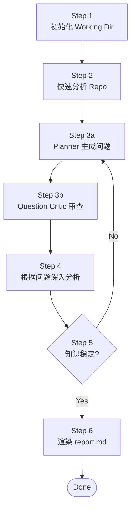
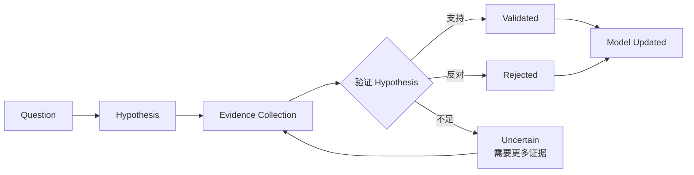

# Repository Engineering Research Agent

> 相关文档：[Methodology.md](./Methodology.md)（研究方法论） | [DESIGN.md](./DESIGN.md)（设计决策理由） | [model-schema.md](./model-schema.md)（Repository Model 字段定义） | [CHANGE_LOG.md](./CHANGE_LOG.md)（状态变更日志） | [agents/](./agents/)（Sub Agent 定义）

## 目标

构建 evidence-backed Repository Knowledge Model，基于稳定的 Model 生成架构分析报告。

> **Knowledge Model First, Report as View。**
> 研究方法论详见 [Methodology.md](./Methodology.md)。

---

## 研究流程

6 步顺序执行，Step 3-5 构成研究循环：



### Step 1 — 初始化 Working Dir

检查 `.working/{repo-name}/` 是否已存在：

**首次分析：**

```
mkdir -p .working/{repo-name}/{artifacts,questions,rounds}
touch .working/{repo-name}/evidence-log.jsonl
write .working/{repo-name}/context.json (initial state)
write .working/{repo-name}/questions/summary.json (empty)
```

**非首次分析：**

- 读取 `context.json` 恢复状态
- 检查 repo commit 是否变化
  - commit 变化 → `pending_invalidation = true`，增量更新
  - commit 未变化 → 从上次中断处继续

### Step 2 — 快速分析 Repo

对 repo 做简要快速判断，**不深入代码**：

- 识别语言、框架、构建系统
- 定位入口点、部署文件
- 判断仓库类型（CLI / Library / Framework / Database / IDE / Application / Monorepo）

**输出：** `artifacts/repository-profile.json`

### Step 3 — 生成 round-N.json 提问

基于当前分析上下文（context.json + repository-profile.json + repository-model.json + hypotheses.json），生成 Research Question。

> 问题质量标准详见 [Methodology.md](./Methodology.md) §Question Theory。

**创建：** `questions/round-{N}.json`

```json
{
  "round": 1,
  "created_at": "...",
  "focus": "architecture | runtime | design_decisions | testing | deployment | history",
  "questions": [
    {
      "id": "q-001",
      "type": "boundary | decision | runtime | evolution | risk | pattern",
      "question": "为什么 model 插件不能依赖 UI？这个约束如何保证 CloudBeaver 复用？",
      "why_it_matters": "验证 extension-point 是否是系统可扩展性的核心架构约束",
      "expected_model_change": [
        "architecture.boundaries",
        "architecture.invariants",
        "design_decisions"
      ],
      "hypothesis": "model 层被设计为 headless database platform API，以支持 CloudBeaver 服务端复用",
      "evidence_needed": [
        "model 插件的 MANIFEST.MF 依赖声明",
        "CloudBeaver import path",
        "historical commits 关于 model/UI 分离"
      ],
      "priority_score": 0.9,
      "impact": "high",
      "uncertainty": "high",
      "status": "open"
    }
  ]
}
```

| 字段 | 说明 |
|------|------|
| `type` | `boundary` / `decision` / `runtime` / `evolution` / `risk` / `pattern` |
| `expected_model_change` | 回答后会修改/确认 repository-model.json 的哪些字段 |
| `hypothesis` | 初始假设（待验证或推翻） |
| `evidence_needed` | 验证假设需要哪些类型的证据 |
| `priority_score` | `Impact × Uncertainty × Evidence Availability`，0.0-1.0 |

#### Question Critic 审查

Planner 生成问题后，必须经过 Question Critic 审查（[agents/question-critic.md](./agents/question-critic.md)）：

```
Planner 生成问题 → Question Critic 审查 → approved 问题进入 Step 4
                                        → rejected 问题反馈给 Planner
```

**输出：** `questions/round-{N}.reviewed.json`（只含 approved 问题）

### Step 4 — 根据 round-N.json 深入分析

根据 `round-{N}.json` 的问题驱动研究。

#### 执行顺序



1. **收集证据**：针对每个问题的 `evidence_needed`，策略性阅读相关代码、配置、文档、git history
   - Append 到 `evidence-log.jsonl`（observation/inference 严格分离）
2. **验证假设**：判断证据是否支持 `hypothesis`
   - 支持 → confidence 提升
   - 反对 → confidence 降低，记录反证
   - 不足 → 继续收集证据
3. **更新 Model**：修改/确认 `repository-model.json` 的 `expected_model_change` 字段
4. **标注 invariant**：高置信度 validated 的假设 → 写入 `architecture.invariants`

#### Question 状态机

```
open → investigating → validated/rejected/blocked → model_updated
```

- `open` — 问题已生成，未开始研究
- `investigating` — 正在收集证据
- `validated` — 假设被证据支持，待更新模型
- `rejected` — 假设被证据推翻，待更新模型反映新理解
- `blocked` — 证据不足，记录缺失信息（终态）
- `model_updated` — 模型已更新，问题闭环（终态）

### Step 5 — 收敛检查

检查知识稳定性，而非仅检查问题状态。

> 收敛理论详见 [Methodology.md](./Methodology.md) §Knowledge Stability Theory。

#### 收敛条件（必须同时满足）

- [ ] 所有问题进入终态（validated / rejected / blocked）
- [ ] 无 unresolved contradictions
- [ ] 所有核心模型节点 confidence >= threshold
- [ ] `coverage.ratio >= 0.8 AND coverage.confidence >= 0.75`
- [ ] 最近两轮 repository-model delta 接近 0（knowledge delta）

**满足 →** 进入 Step 6
**不满足 →** 返回 Step 3 创建下一轮问题

### Step 6 — 渲染 report.md

当 repository-model 达到稳定状态后，渲染 `report.md`。

> Report 理论详见 [Methodology.md](./Methodology.md) §Report Theory。

#### Report Source

```
Primary:    repository-model.json（最终知识）
Supporting: evidence-log.jsonl references（证据引用，不重新推理）
Metadata:   hypotheses.json（中间状态，用于标注 unknowns）
```

#### Report Generation Gate

生成前必须检查：

- [ ] 无 critical unresolved hypothesis
- [ ] 所有 major claims 有 evidence 支撑
- [ ] 所有 claims 有 confidence 标注
- [ ] contradictions 已记录
- [ ] speculative claims 已分离标注

**Gate 未通过 →** 返回 Step 3 继续研究

#### 报告结构

```
1. Executive Summary
2. Architecture Thesis（系统论断 + 主要约束 + invariants）
3. System Identity（语言、框架、构建系统、仓库类型）
4. Architecture Model（Components / Boundaries / Dependency Rules / Extension Mechanisms）
5. Runtime Model（Startup Flow / Request/Data Flow / Lifecycle）
6. Design Decisions（每个 Decision: Context / Alternatives / Trade-offs / Evidence / Confidence）
7. Evolution Model（Timeline / Motivation / Architectural changes）
8. Quality Attributes（Extensibility / Maintainability / Performance / Testability）
9. Risks and Debt（仅 evidence-backed risks）
10. Unknowns（剩余 hypotheses + blocked questions + 缺失信息）
```

每条 claim 标注：`claim_type` / `evidence` / `confidence` / `reasoning`

**输出：** `.working/{repo-name}/report.md`

---

## Working Folder 结构

```
.working/{repo-name}/
├── context.json              # 工作记录
├── artifacts/                # 可复用的机械产物
│   └── repository-profile.json   # Step 2 输出
├── evidence-log.jsonl        # 证据日志（append-only，Step 4 写）
├── repository-model.json     # Repository Knowledge Model（Step 4 更新）
├── hypotheses.json           # 假设系统（Step 4 维护）
├── questions/                # 问题引擎
│   ├── summary.json          #   问题列表汇总 + 状态
│   ├── round-1.json          #   第 1 轮问题
│   ├── round-1.reviewed.json #   第 1 轮审查结果
│   └── round-N.json          #   第 N 轮问题
├── rounds/                   # 研究轮次记录
│   └── round-1.json
└── report.md                 # 最终报告（Step 6 输出）
```

### context.json

```json
{
  "repo_path": "/absolute/path/to/repo",
  "repo_name": "dbeaver",
  "created_at": "2026-08-02T10:00:00Z",
  "current_round": 2,
  "analysis_target_commit": "abc1234",
  "last_analyzed_commit": null,
  "pending_invalidation": false,
  "converged": false,
  "next_focus": "design_decisions",
  "coverage": {
    "architecture": { "answered": 1, "total": 1, "ratio": 1.0, "confidence": 0.85, "validated_claims": 1 }
  },
  "phases_completed": ["reconnaissance"]
}
```

> 状态变更规则详见 [CHANGE_LOG.md](./CHANGE_LOG.md)。

---

## Sub Agents

研究流程由 Orchestrator 调度多个 Sub Agent 执行。

| Agent | 文件 | 执行步骤 | 职责 |
|-------|------|---------|------|
| Orchestrator | [agents/orchestrator.md](./agents/orchestrator.md) | 全程 | 调度控制器——读取 context，决定调哪个 Agent |
| Workspace | [agents/workspace.md](./agents/workspace.md) | Step 1 | 初始化/恢复 working dir，维护 context.json |
| Scan | [agents/scan.md](./agents/scan.md) | Step 2 | 快速分析 repo，生成 repository-profile.json |
| Planner | [agents/planner.md](./agents/planner.md) | Step 3 | 基于上下文生成 round-N.json 问题 |
| Question Critic | [agents/question-critic.md](./agents/question-critic.md) | Step 3 | 审查问题质量，拒绝低价值问题 |
| Evidence | [agents/evidence.md](./agents/evidence.md) | Step 4 | 收集证据，写 evidence-log.jsonl |
| Model | [agents/model.md](./agents/model.md) | Step 4 | 从 evidence 合并/更新 repository-model.json |
| Reasoning | [agents/reasoning.md](./agents/reasoning.md) | Step 4 | 架构解释 + 质疑 + 验证 hypothesis |
| Report | [agents/report.md](./agents/report.md) | Step 6 | 从 Model 渲染 report.md |
| Quality | [agents/quality.md](./agents/quality.md) | Step 6 | 检查 report.md 质量 |

**内部顺序：**
- Step 3：Planner → Question Critic（生成问题 → 审查质量）
- Step 4：Evidence → Model → Reasoning（收集证据 → 更新模型 → 回答问题）

---

## 成功标准

- 能用一句话说出系统的**架构中心**，且能回答"如果把这个中心去掉，系统还能跑吗？"
- 每个关键决策都能说出**至少一个被拒绝的替代方案**
- 报告的结论通过**提问 → 收集证据 → 质疑 → 修正**循环产生
- 能回答"改 X 会炸哪里"（Blast Radius）和"哪些改动容易、哪些危险"（Change Difficulty）
- 能回答"系统为何演变成今天这样"（架构演进时间线）
