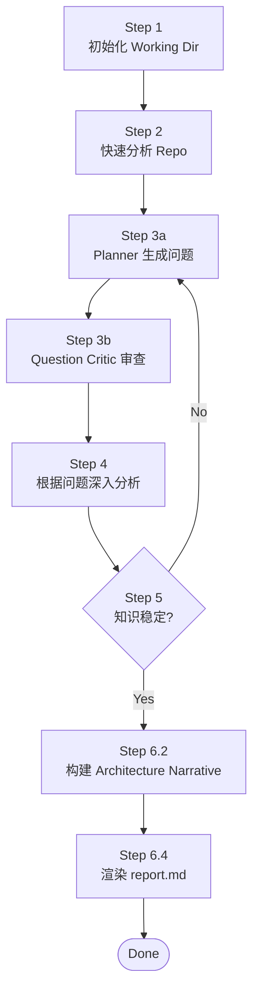
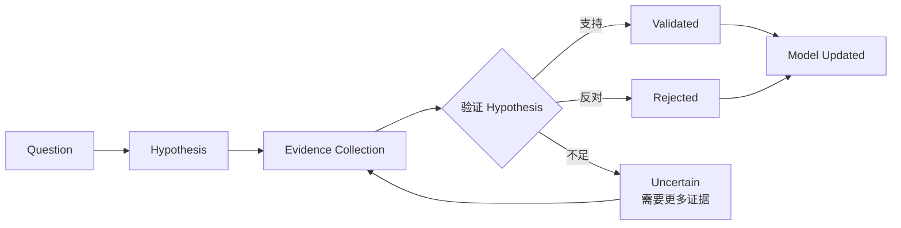

# Repository Engineering Research Agent

> 相关文档：[Methodology.md](./Methodology.md)（研究方法论） | [DESIGN.md](./DESIGN.md)（设计决策理由） | [model-schema.md](./model-schema.md)（Repository Model 字段定义） | [CHANGE_LOG.md](./CHANGE_LOG.md)（状态变更日志） | [agents/](./agents/)（Sub Agent 定义）

## 目标

构建 evidence-backed Repository Knowledge Model，基于稳定的 Model 生成架构分析报告。

> **Knowledge Model First, Report as View。**
> 研究方法论详见 [Methodology.md](./Methodology.md)。

---

## 研究流程

6 步顺序执行，Step 3-5 构成研究循环：



### Step 1 — 初始化 Working Dir

由 Resume Agent 检查 `.working/{repo-name}/` 是否已存在并判断现场状态，Workspace Agent 执行初始化/恢复：

**首次分析：**

```
mkdir -p .working/{repo-name}/{artifacts,questions,rounds}
touch .working/{repo-name}/evidence-log.jsonl
write .working/{repo-name}/context.json (initial state)
write .working/{repo-name}/questions/summary.json (empty)
```

**非首次分析：**

- 读取 `context.json` 恢复状态
- 检查 repo commit 是否变化
  - commit 变化 → `pending_invalidation = true`，增量更新
  - commit 未变化 → 从上次中断处继续

### Step 2 — 快速分析 Repo

对 repo 做简要快速判断，**不深入代码**（Phase 0 Reconnaissance）：

- 识别语言、框架、构建系统
- 定位入口点、部署文件
- 判断仓库类型（CLI / Library / Framework / Database / IDE / Application / Monorepo）
- 提取 business_signals（README 首段 / description / target users / use cases / non-goals，供 Step 6 报告 §2 使用）

随后做结构发现（Phase 1 Structural Discovery）：

- 识别架构单元（applications / libraries / services / infrastructure / tests），**不描述每个文件**
- 建立模块清单（模块职责留空，由 Model Agent 在 Step 4 填充）

**输出：**

- `artifacts/repository-profile.json`（Phase 0：身份事实 + business_signals）
- `artifacts/directory-model.json`（Phase 1：架构单元）
- `artifacts/module-model.json`（Phase 1：模块清单）

### Step 3 — 生成 round-N.json 提问

基于当前分析上下文（context.json + repository-profile.json + repository-model.json + hypotheses.json），生成 Research Question。

> 问题质量标准详见 [Methodology.md](./Methodology.md) §Question Theory。

**创建：** `questions/round-{N}.json`（Planner 只生成问题、不写文件，由 Workspace Agent 落盘）

```json
{
  "round": 1,
  "created_at": "...",
  "focus": "architecture | runtime | design_decisions | testing | deployment | history",
  "questions": [
    {
      "id": "q-001",
      "type": "boundary | decision | runtime | evolution | risk | pattern",
      "question": "为什么 model 插件不能依赖 UI？这个约束如何保证 CloudBeaver 复用？",
      "why_it_matters": "验证 extension-point 是否是系统可扩展性的核心架构约束",
      "expected_model_change": [
        "architecture.boundaries",
        "architecture.invariants",
        "design_decisions"
      ],
      "hypothesis": "model 层被设计为 headless database platform API，以支持 CloudBeaver 服务端复用",
      "evidence_needed": [
        "model 插件的 MANIFEST.MF 依赖声明",
        "CloudBeaver import path",
        "historical commits 关于 model/UI 分离"
      ],
      "priority_score": 0.9,
      "impact": "high",
      "uncertainty": "high",
      "status": "open"
    }
  ]
}
```

| 字段 | 说明 |
|------|------|
| `type` | `boundary` / `decision` / `runtime` / `evolution` / `risk` / `pattern` |
| `expected_model_change` | 回答后会修改/确认 repository-model.json 的哪些字段 |
| `hypothesis` | 初始假设（待验证或推翻） |
| `evidence_needed` | 验证假设需要哪些类型的证据 |
| `priority_score` | `Impact × Uncertainty × Evidence Availability`，0.0-1.0 |

#### Question Critic 审查

Planner 生成问题后，必须经过 Question Critic 审查（[agents/question-critic.md](./agents/question-critic.md)）：

```
Planner 生成问题 → Question Critic 审查 → approved 问题进入 Step 4
                                        → rejected 问题反馈给 Planner
```

**输出：** `questions/round-{N}.reviewed.json`（由 Question Critic 直接写入，含全部问题的审查结果——approved + rejected 及理由；仅 approved 问题进入 Step 4，rejected 反馈给 Planner）

### Step 4 — 根据 round-N.json 深入分析

根据 `round-{N}.json` 的问题驱动研究。

#### 执行顺序



1. **收集证据**：针对每个问题的 `evidence_needed`，策略性阅读相关代码、配置、文档、git history
   - Append 到 `evidence-log.jsonl`（observation/inference 严格分离）
2. **验证假设**：判断证据是否支持 `hypothesis`
   - 支持 → confidence 提升
   - 反对 → confidence 降低，记录反证
   - 不足 → 继续收集证据
3. **更新 Model**：修改/确认 `repository-model.json` 的 `expected_model_change` 字段
4. **标注 invariant**：高置信度 validated 的假设 → 写入 `architecture.invariants`

#### Question 状态机

```
open → investigating → validated/rejected/blocked → model_updated
```

- `open` — 问题已生成，未开始研究
- `investigating` — 正在收集证据
- `validated` — 假设被证据支持，待更新模型
- `rejected` — 假设被证据推翻，待更新模型反映新理解
- `blocked` — 证据不足，记录缺失信息（终态）
- `model_updated` — 模型已更新，问题闭环（终态）

### Step 5 — 收敛检查

检查知识稳定性，而非仅检查问题状态。

> 收敛理论详见 [Methodology.md](./Methodology.md) §Knowledge Stability Theory。

#### 收敛条件（必须同时满足）

- [ ] 所有问题进入终态（`model_updated` / `blocked`，见 Step 4 Question 状态机）
- [ ] 无 unresolved contradictions
- [ ] 所有核心模型节点 confidence >= 0.75
- [ ] 所有维度 `coverage.ratio >= 0.8 AND coverage.confidence >= 0.75`
- [ ] 最近两轮 repository-model delta 接近 0（knowledge delta：无新增/修改节点、confidence 无提升、contradictions 无减少）

> 判据是 **knowledge delta**，不是"连续两轮没有新问题"——见 [Methodology.md](./Methodology.md) §Knowledge Stability Theory。

**满足 →** 进入 Step 6
**不满足 →** 返回 Step 3 创建下一轮问题

### Step 6 — 渲染 report.md

当 repository-model 达到稳定状态后，**先构建 Architecture Narrative，再渲染 report.md**。

> Report 理论详见 [Methodology.md](./Methodology.md) §Report Theory。
> **核心原则：Architecture 是 Decision 的结果，不是先看结构再解释为什么。** Report 必须以 Thesis 为骨架，每章节回答"这个如何实现 Thesis"。

#### 6.1 Report Generation Gate

生成前必须检查：

- [ ] 无 critical unresolved hypothesis
- [ ] 所有 major claims 有 evidence 支撑
- [ ] 所有 claims 有 confidence + evidence_level 标注
- [ ] contradictions 已记录
- [ ] speculative claims 已分离标注

**Gate 未通过 →** 返回 Step 3 继续研究

#### 6.2 Architecture Narrative（中间产物，必经阶段）

**不是从 repository-model 直接渲染 report。** 先压缩为 Architecture Narrative——把 Knowledge Model 转化为架构师能快速形成系统心智模型的叙事骨架。

**Pipeline：**

```
repository-model.json
        ↓
Architecture Narrative（压缩层）
        ↓
report.md（叙事渲染）
```

**创建：** `.working/{repo-name}/architecture-narrative.json`

Narrative 必须回答 8 个问题，每个回答 ≤ 200 字：

```json
{
  "schema_version": "1.0",
  "repo_name": "buzz",
  "system_identity": {
    "what_is": "这个 repo 是什么？一句话——类型、定位、一句话价值主张",
    "repo_type": "CLI / Library / Framework / Database / IDE / Application / Platform / Monorepo",
    "scale": "规模信号——代码量、模块数、目标用户量、目标吞吐量（如适用）",
    "target_users": "目标用户是谁？谁部署？谁使用？"
  },
  "business_context": {
    "needs_satisfied": "满足什么业务需求？解决什么问题？（用业务语言，不是技术语言）",
    "business_scope": "涉及什么业务范围？覆盖哪些功能域？不覆盖什么？（边界很重要）",
    "use_cases": ["3-5 个典型使用场景，每个 ≤50 字"],
    "alternatives_in_market": "市场上同类方案是什么？这个 repo 的差异化在哪？"
  },
  "high_level_architecture": {
    "one_sentence": "一句话整体架构——'X 是一个 Y，通过 Z 实现 W'（不深入技术细节）",
    "components_overview": "主要组件及其关系（≤150 字，high-level，不列全部 crate）",
    "tech_stack": "核心技术栈选择（语言/框架/存储/消息/部署），每个一句话说为什么选",
    "deployment_model": "如何部署？单机/集群/cloud/self-hosted？"
  },
  "thesis": {
    "central_idea": "一句话——系统的架构中心是什么？",
    "if_removed": "如果把这个中心去掉，系统还能跑吗？为什么？"
  },
  "driving_constraints": [
    {
      "id": "c-1",
      "constraint": "塑造架构的硬约束（不是 feature，是被迫做出的约束）",
      "forces": "这个约束迫使系统做出什么决策？",
      "evidence_ref": "evidence-log.jsonl:N"
    }
  ],
  "key_design_decisions": [
    {
      "id": "d-1",
      "decision": "最关键的 5 个决策之一（从 repository-model.design_decisions 选 top 5）",
      "implements_constraint": "c-1",
      "rejected_alternative": "至少一个被拒绝的替代方案",
      "tradeoff": "用 X 换 Y"
    }
  ],
  "architecture_realization": {
    "boundaries": "3-5 个关键边界，每个解释为什么存在（不是 crate 列表）",
    "extension_mechanism": "系统如何扩展（不是 kind 列表，是扩展哲学）"
  },
  "runtime_story": {
    "one_request": "一个典型请求/事件从入口到完成的完整路径，作为叙事（不是 pipeline trace）。说明每一步对应哪个架构约束。",
    "backpressure": "系统如何在过载时 degrade"
  },
  "top_risks": [
    {
      "id": "r-1",
      "risk": "最大 trade-off / 风险",
      "what_breaks": "这个 risk 触发时什么会崩",
      "evidence_ref": "evidence-log.jsonl:N"
    }
  ]
}
```

**Narrative 质量门：**

- ✅ System Identity 回答"是什么"——读者读完知道 repo 类型、定位、规模
- ✅ Business Context 回答"解决什么业务问题"——用业务语言（不是技术语言），含 use cases 和市场差异化
- ✅ High-Level Architecture 回答"整体架构什么样"——一句话 + 组件关系 + 技术栈选择理由 + 部署模型，**不深入技术细节（如 Nostr 协议）**
- ✅ Thesis 是一句话，且能回答 "if_removed" 问题
- ✅ Driving Constraints 是"被迫的硬约束"（不是 feature list）
- ✅ Key Design Decisions ≤ 5 个（强制压缩，防止平铺）
- ✅ 每个 Decision 绑定一个 Constraint（implements_constraint）
- ✅ Boundaries 解释"为什么存在"（不是 crate 命名）
- ✅ One Request Story 是叙事，不是 step trace

**Narrative 未通过 →** 重写 Narrative（不返回 Step 3，因为 model 已稳定）

#### 6.3 Report Source

```
Primary:    architecture-narrative.json（叙事骨架）
Supporting: repository-model.json（详细 claims）
Evidence:   evidence-log.jsonl references（不重新推理，仅引用）
Metadata:   hypotheses.json（标注 unknowns）
```

#### 6.4 报告结构（叙事驱动，非传统模板）

```
1. Executive Summary（≤300 字，包含 Thesis 一句话 + 最大 trade-off）

2. System Identity & Business Context（⭐ 必答——读者先理解"是什么、解决什么、整体架构"再进入技术细节）
   2.1 What is this repo?（类型、定位、一句话价值主张、规模、目标用户）
   2.2 Business Context（满足什么业务需求、涉及什么业务范围、3-5 个 use cases、市场差异化）
   2.3 High-Level Architecture（一句话整体架构 + 主要组件关系图 + 技术栈选择理由 + 部署模型）
       ⚠️ 本章是 high-level overview，不深入技术细节（如具体协议、kind 整数、SQL schema）
       ⚠️ 技术细节留给 §4 Resulting Architecture 和 §5 Runtime Realization

3. Architecture Thesis
   3.1 Central Idea（一句话 + if_removed 回答）
   3.2 Driving Constraints（3-5 个塑造架构的硬约束）

4. Key Design Decisions（⭐ 提前——先看决策，再看结构）
   每个 Decision:
   - Context（为什么必须做决策）
   - Alternatives（至少一个被拒绝的方案）
   - Trade-off（用 X 换 Y）
   - Implements Constraint（绑定 §3.2）
   - Evidence Level（见下表）

5. Resulting Architecture（架构作为决策的结果，非 crate 列表）
   5.1 Boundaries——按"为什么存在"组织，每个绑定 Decision
   5.2 Extension Mechanism——扩展哲学，非枚举

6. Runtime Realization
   6.1 One Request Story（一个典型请求的叙事，每步绑定架构约束）
   6.2 Backpressure & Failure Isolation（过载时如何 degrade）

7. Quality Attributes（Extensibility / Maintainability / Performance / Testability / Observability / Security）

8. Risks and Debt（仅 evidence-backed，每个标注 "what breaks"）

9. Unknowns（剩余 need_reading + blocked）

Appendix A: Research Provenance（Questions / Evidence Summary / Source Files）
Appendix B: Evidence Level Legend
```

> **§2 是必答章节。** 跳过 §2 直接讲技术细节（如"Nostr 协议 + kind 整数"）是常见错误——读者不知道 repo 是什么、解决什么业务问题，就被拉入技术决策，会丢失主线。§2 用业务语言和 high-level 架构建立心智模型，§3+ 才进入技术深度。

#### 6.5 Evidence Level（替代纯 confidence 数值）

每条 claim 标注 `confidence` + `evidence_level`，让读者理解可信度 basis：

| Evidence Level | Basis | 示例 |
|------|------|------|
| **S** | Code + Test + Formal Verification | Tenant isolation（TLA+/Tamarin + redteam test + SQL coverage） |
| **A** | Code + Test | Kind registry duplicate test |
| **B** | Code only（无 test 验证） | Single tokio runtime risk |
| **C** | Documentation + Code 交叉验证 | Workflow WF-08 gap |
| **D** | Documentation only | Evolution motivation |
| **E** | Inference（基于代码模式推断） | Buzz Mesh trust model risk |

claim 标注格式：`*confidence: 0.85 · evidence_level: S (Code+Test+Formal)· evidence: evidence-log.jsonl:N*`

> **Evidence Level ≠ Evidence Tier。** 两者都使用 S/A/B/C/D/E 字母，但含义不同、用途不同，不要混用：
>
> | | Evidence Tier（采集侧） | Evidence Level（报告侧） |
> |-|-|-|
> | 定义处 | [model-schema.md](./model-schema.md) §9.1 | 本节（§6.5） |
> | 标注对象 | 单条 evidence 的来源性质 | 一条 claim 的支撑组合 |
> | 标注时机 | Evidence Agent 收集时 | Report Agent 渲染时 |
> | 用途 | §15 置信度加权计算 | 读者判断 claim 可信度 basis |
>
> 映射关系：claim 由 test+code 支撑 → Level S/A；仅 code → B；doc+code 交叉验证 → C；仅 doc/commit → D；仅 inference → E。

#### 6.6 Report 禁止项

- ❌ Components 章节列 crate 名而不解释"为什么存在"
- ❌ Runtime 章节给 pipeline trace 而不说明"顺序为何重要"
- ❌ Design Decisions 放在 Architecture Model 之后
- ❌ 用 confidence 数值而不给 evidence_level basis
- ❌ Appendix 内容混入正文（research log 感）

#### 6.7 报告字符数硬性门槛（Hard Gate）

最终 `report.md` 的**纯内容字符数（去除所有空白字符：空格 / 制表符 / 换行 / 回车）必须 ≥ 15000**。这是**硬性指标，不可绕过**。

- **字符数 < 15000 → 判定为「内容 / 深度不足」**，报告禁止发布：
  - 要么返回 Step 3 继续研究、补证据拓宽覆盖；
  - 要么在现有结论上**扩展每个章节的深度**（更多子论点、反面证据、文件 / 函数级引用、权衡展开、失败案例分析）。
- **不鼓励水字数**：禁止用重复、空泛过渡句、无意义列表填充凑数。长度 PASS 的同时仍须满足 §6.6 禁止项与 Quality Agent §10 完整性检查——凑出来的长度不会让质量门通过。
- 阈值可由环境变量 `MIN_REPORT_CHARS` 覆盖（默认 15000）。

**检查方式（JS 脚本判定）：** Quality Agent 在**发布前**（此时只有草稿）调用本 skill 自带脚本检查 `report-draft.md`，退出码 `0 = PASS` / `1 = FAIL(不足)` / `2 = 用法错误`：

```bash
node .trae/skills/repo-arch-engineering/scripts/check-report-chars.mjs .working/{repo-name}/report-draft.md
```

脚本输出 JSON：`{ file, pure_content_chars, min_required, passed, reason }`。FAIL 时 Quality 返回 `gated-fail`，报告**不发布**，并按下述快速判断路由到对应 Step 继续。

##### 6.7.1 Gate 未通过时的快速判断与回路

`gated-fail` 只说明「内容 / 深度不足」，**不知道根因**。Quality Agent 必须做一次**快速根因判断**，在 Step 3 / Step 4 / Step 5 中选一个继续（不要默认回 Step 3 盲目再提问）。判断依据 `repository-model.json` + `context.coverage` + `hypotheses.json` + `evidence-log.jsonl`（行数）。

按优先级从上到下命中即路由：

| 顺序 | 根因信号（命中任一） | 路由 | 继续做什么 |
|------|----------------------|------|-----------|
| **① 覆盖缺口** | 某维度 `coverage.ratio < 0.8`；或存在 `total = 0` 的遗漏维度；或 unresolved contradictions > 0；或有 critical/high 级 Unknowns 未答 | **Step 3** | 模型知识**本来就不够**。Planner 针对缺口维度/矛盾/Unknowns 生成新问题 → Critic → 进入 Step 4 常规研究循环 |
| **② 深度缺口** | 覆盖已齐（各维度 `ratio ≥ 0.8`）但**深度不足**：`evidence-log` 行数 < 30；或关键 decision 平均 evidence < 2；或 report 缺少文件/函数级 `path:line` 引用；或 model 字段单薄（boundaries < 3 / decisions < 5 且无展开） | **Step 4** | 已覆盖但**没挖深**。回到 Step 4 做 **depth pass**：对已有 approved 问题做更细粒度证据收集 + 推理（不产生新问题），更新 model/evidence 后重渲染 |
| **③ 知识已稳、渲染没写足** | 覆盖齐、evidence 密（≥30）、hypotheses 全部终态、knowledge delta ≈ 0，但 report 仍短 | **Step 5** | 问题在**渲染而非研究**。回 Step 5 确认收敛后，**Step 6.4 基于现有 model 扩展渲染**（更多子论点、反面证据、权衡展开、失败案例），不新增研究 |

**回路规则：**

- Quality 在 `gated-fail` 输出里必须带 `gate_failed_route: "step3" | "step4" | "step5"` + `gate_failed_reason`（命中的根因信号），Orchestrator 据此跳转。
- 路由后必须**重新渲染** `report-draft.md` 并**再次跑 §6.7 脚本**——直到 PASS 或明确 blocked。
- **防空转**：同一路由连续 2 次回炉后 `pure_content_chars` 无明显增长（< 10%）且无新增 evidence → 判定收敛但报告写不长，标记 `blocked`，升级由用户决定是否接受短报告或降低 `MIN_REPORT_CHARS`，禁止无限循环。

**输出：** `.working/{repo-name}/architecture-narrative.json` + `.working/{repo-name}/report.md`

---

## Working Folder 结构

```
.working/{repo-name}/
├── context.json              # 工作状态记录（Workspace Agent 唯一写入者）
├── artifacts/                # 可复用的机械产物（Scan Agent 写，Step 2）
│   ├── repository-profile.json   # Phase 0 输出：身份事实 + business_signals
│   ├── directory-model.json      # Phase 1 输出：架构单元
│   └── module-model.json         # Phase 1 输出：模块清单
├── evidence-log.jsonl        # 证据日志（append-only 唯一事实源，Evidence Agent 写，Step 4）
├── repository-model.json     # Repository Knowledge Model（Step 4 更新；Model/Reasoning 按字段分区写入）
├── hypotheses.json           # 假设系统（Reasoning Agent 维护，Step 4）
├── architecture-narrative.json # Step 6.2 中间产物——Knowledge Model → 叙事骨架（Report Agent 写）
├── questions/                # 问题引擎
│   ├── summary.json          #   问题列表汇总 + 状态（Workspace Agent 写）
│   ├── round-1.json          #   第 1 轮问题（Planner 生成，Workspace 落盘）
│   ├── round-1.reviewed.json #   第 1 轮审查结果（Question Critic 写）
│   └── round-N.json          #   第 N 轮问题
├── rounds/                   # 研究轮次记录（Workspace Agent 写）
│   └── round-1.json
├── report-draft.md           # 报告草稿（Report Agent 写，Step 6.4）
└── report.md                 # 最终报告（Quality PASS 后由 Workspace rename 发布）
```

> **Skill 自带脚本**（不在 `.working/`，位于 skill 根）：`scripts/check-report-chars.mjs` — §6.7 报告字符数硬性门槛判定（Quality Agent 在发布前调用）。

> **存储原则：** Model 存稳定知识；hypotheses / evidence / questions 是研究过程状态，独立存储。Model 只通过 `ev-xxx` / `hyp-xxx` / `q-xxx` ID 引用这些文件，不复制其内容。详见 [model-schema.md](./model-schema.md) §2 持久化布局。

### context.json

```json
{
  "repo_path": "/absolute/path/to/repo",
  "repo_name": "dbeaver",
  "created_at": "2026-08-02T10:00:00Z",
  "current_round": 2,
  "analysis_target_commit": "abc1234",
  "last_analyzed_commit": null,
  "pending_invalidation": false,
  "converged": false,
  "next_focus": "design_decisions",
  "coverage": {
    "architecture": { "answered": 1, "total": 1, "ratio": 1.0, "confidence": 0.85, "validated_claims": 1 }
  },
  "phases_completed": ["reconnaissance", "structural_discovery"]
}
```

> 状态变更规则详见 [CHANGE_LOG.md](./CHANGE_LOG.md)。

---

## Sub Agents

研究流程由 Orchestrator 调度多个 Sub Agent 执行。

| Agent | 文件 | 执行步骤 | 职责 |
|-------|------|---------|------|
| Orchestrator | [agents/orchestrator.md](./agents/orchestrator.md) | 全程 | 调度控制器——读取 context，决定调哪个 Agent |
| Resume | [agents/resume.md](./agents/resume.md) | Step 1 | 恢复现场，判断 commit 变化，返回下一步跳转目标 |
| Workspace | [agents/workspace.md](./agents/workspace.md) | Step 1 | 初始化/恢复 working dir，维护 context.json |
| Scan | [agents/scan.md](./agents/scan.md) | Step 2 | 快速分析 repo，生成 artifacts/（profile + directory + module） |
| Planner | [agents/planner.md](./agents/planner.md) | Step 3 | 基于上下文生成 round-N 问题（不写文件） |
| Question Critic | [agents/question-critic.md](./agents/question-critic.md) | Step 3 | 审查问题质量，拒绝低价值问题 |
| Evidence | [agents/evidence.md](./agents/evidence.md) | Step 4 | 收集证据，写 evidence-log.jsonl |
| Model | [agents/model.md](./agents/model.md) | Step 4 | 从 evidence 合并/更新 repository-model.json（identity/architecture/runtime 字段） |
| Reasoning | [agents/reasoning.md](./agents/reasoning.md) | Step 4 | 架构解释 + 质疑 + 验证 hypothesis（写推理字段 + hypotheses.json） |
| Report | [agents/report.md](./agents/report.md) | Step 6 | 构建 Architecture Narrative + 渲染 report-draft.md |
| Quality | [agents/quality.md](./agents/quality.md) | Step 6 | 检查 narrative 质量门 + report-draft.md 质量 |

**内部顺序：**
- Step 1：Resume（判断现场）→ Workspace（初始化/恢复/标记 invalidation）
- Step 3：Planner → Question Critic（生成问题 → 审查质量）
- Step 4：Evidence → Model → Reasoning（收集证据 → 更新模型 → 回答问题）
- Step 6：Report → Quality（渲染草稿 → 质量检查；PASS 后 Workspace 发布）

---

## 成功标准

- 能用一句话说出系统的**架构中心**，且能回答"如果把这个中心去掉，系统还能跑吗？"
- 每个关键决策都能说出**至少一个被拒绝的替代方案**
- 报告的结论通过**提问 → 收集证据 → 质疑 → 修正**循环产生
- 能回答"改 X 会炸哪里"（Blast Radius）和"哪些改动容易、哪些危险"（Change Difficulty）
- 能回答"系统为何演变成今天这样"（架构演进时间线）
