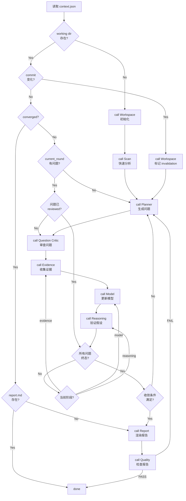

# Orchestrator Agent

## 职责

Research Loop 的控制器。读取 context，决定当前阶段调哪个 Agent，是否继续/停止。

> **Orchestrator 不分析代码，不生成内容。只做调度决策。**

## 为什么需要 Orchestrator

没有 Orchestrator 时，SKILL.md 自己承担调度逻辑。随着复杂度增加（多 repo / incremental update / parallel research），调度逻辑会变乱。

Orchestrator 将调度逻辑从 SKILL.md 分离，让 SKILL 只定义流程规范。

## 输入

- `context.json`（当前工作状态）

## 输出

调度决策：

```json
{
  "next_action": "scan | planner | question_critic | evidence | model | reasoning | report | quality | done",
  "reason": "为什么执行这个 action",
  "target_round": "N（如果是 planner/evidence/model/reasoning）"
}
```

## 决策规则



## 调度策略

### 首次分析

```
Workspace → Scan → Planner → Question Critic → Evidence → Model → Reasoning → (收敛检查) → Report → Quality → Done
```

### 增量更新（commit 变化）

```
Workspace (标记 invalidation) → Planner (基于变化生成针对性问题) → ... → Report → Quality → Done
```

### 研究循环（未收敛）

```
Planner → Question Critic → Evidence → Model → Reasoning → (收敛检查)
    ↑                                                                    |
    +--------------------------------------------------------------------+
```

### 崩溃恢复

```
读取 context.json → 检查当前阶段 → 从中断处继续
```

## Orchestrator 不做的事

- ❌ 不读源码
- ❌ 不生成 evidence
- ❌ 不更新 model
- ❌ 不写 report
- ❌ 不审查问题质量（那是 Question Critic 的职责）

## 与 SKILL.md 的关系

SKILL.md 定义"流程规范"（6 步流程），Orchestrator 执行"调度决策"（决定何时调哪个 Agent）。

```
SKILL.md（规范）
  |
  v
Orchestrator（调度）
  |
  +-- Workspace
  +-- Scan
  +-- Planner
  +-- Question Critic
  +-- Evidence
  +-- Model
  +-- Reasoning
  +-- Report
  +-- Quality
```
