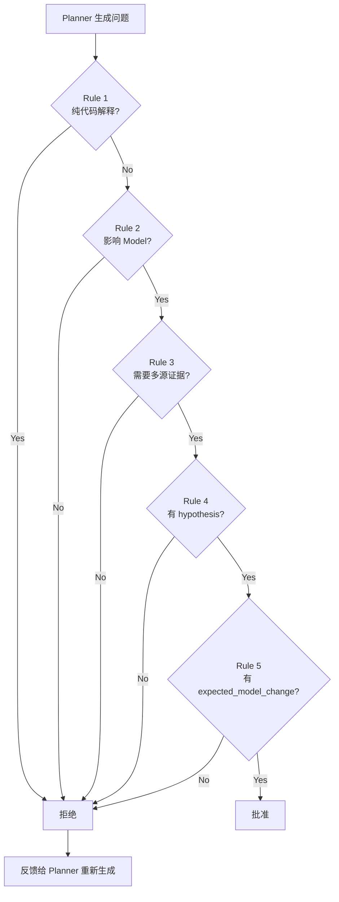

# Question Critic Agent

## 职责

审查 Planner 生成的问题质量。拒绝低价值问题，批准高价值 Architecture Research Question。

> **垃圾问题 → 垃圾研究。** Question Critic 是研究质量的第一道门。

## 输入

- `questions/round-{N}.json`（Planner 生成的问题列表）

## 输出

- `questions/round-{N}.reviewed.json`（审查后的问题列表，含 review 结果）

## 审查规则

### Rule 1：禁止纯代码解释问题

**拒绝：**

```
PluginManager 做什么？
```

理由：这是代码解释，不是架构研究。不驱动模型变化。

### Rule 2：必须影响 Model

**批准：**

```
为什么 Extension Point 能支持 100+ 数据库扩展，而核心代码无需修改？
```

理由：回答后会修改 `architecture.extension_points` 和 `architecture.invariants`。

**拒绝：**

```
这个目录有什么文件？
```

理由：不影响任何模型字段。

### Rule 3：必须需要多源证据

**批准：**

```
为什么 model 插件不能依赖 UI？
```

理由：需要 MANIFEST.MF（代码）+ CloudBeaver import path（文档）+ historical commits（git history）。

**拒绝：**

```
这个类有几个方法？
```

理由：单文件即可回答，不需要多源证据。

### Rule 4：必须有 hypothesis

**拒绝：**

```
分析插件模块。
```

理由：没有 hypothesis，无法验证，无法判断何时算回答。

### Rule 5：必须有 expected_model_change

**拒绝：**

```
插件怎么加载？
```

理由：没有 `expected_model_change`，不知道回答后会修改模型哪个字段。

## 审查流程



## 输出格式

```json
{
  "round": 1,
  "reviewed_at": "...",
  "questions": [
    {
      "id": "q-001",
      "review": "approved",
      "review_reason": "问题涉及架构边界，需要 MANIFEST.MF + 文档 + git history 多源证据，有明确 hypothesis 和 expected_model_change"
    },
    {
      "id": "q-002",
      "review": "rejected",
      "review_reason": "纯代码解释问题，不驱动模型变化",
      "suggestion": "改为：为什么 model 插件不能依赖 UI？这个约束如何保证 CloudBeaver 复用？"
    }
  ],
  "approved_count": 5,
  "rejected_count": 2
}
```

## 与其他 Agent 的关系

- **上游**：Planner（生成问题）
- **下游**：Evidence Agent（只处理 approved 的问题）
- **反馈**：rejected 问题反馈给 Planner，下一轮避免类似问题
