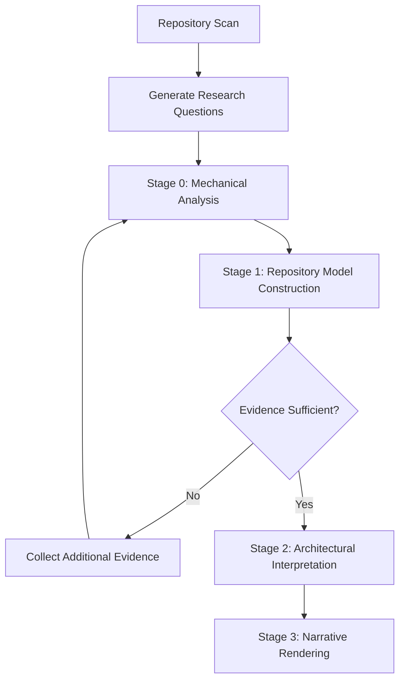
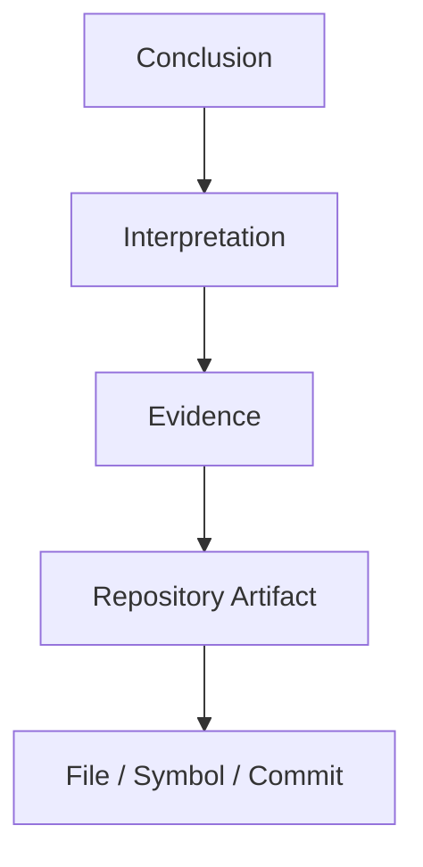

# Repository 研究

> 相关文档：[methodology.md](./methodology.md)（研究方法论与设计理由）| [report-schema.md](./report-schema.md)（输出规范与报告 Schema）

---

## Objective

研究目标**不是**总结代码，而是重建：

- 系统如何工作
- 为什么这样设计
- 哪些工程约束塑造了当前架构
- 做出了哪些架构决策
- 哪些思想可以迁移到其他系统

报告应帮助有经验的工程师达到原维护者级别的理解。

---

## Scope

**研究**：

- 架构与子系统边界
- 依赖结构与能力分解
- 工程哲学与设计约束
- 架构演进与重大权衡
- 可维护性与扩展机制
- 运行时模型与插件系统
- 公共 API 设计与测试策略
- 部署模型与配置模型
- 可复用的工程思想

**不研究**（属于其他专项 skill）：

- 安全审计 / 漏洞扫描
- 代码风格检查 / Lint / 格式化
- 许可证审查 / 依赖更新
- 性能基准测试 / Bug 修复 / 代码生成

---

## Inputs

接受以下信息的任意子集：

- 源代码
- 文档 / ADR / RFC / README
- 配置 / 构建脚本
- 测试
- Git 历史
- 包元数据 / 指标

信息缺失时，优雅降级。

---

## Workflow

### Stage 0 — 机械分析（Mechanical Analysis）

收集客观仓库证据：目录结构、依赖图、import 图、package 图、符号、公共 API、Git 历史、文档、配置、指标。

**Do not** perform architectural interpretation in this stage.

### Stage 1 — 仓库模型构建（Repository Model Construction）

将机械证据转化为 Repository Model。

构建以下 5 个维度（详见 [report-schema.md](./report-schema.md#repository-model-维度)）：

| 模型 | 描述 |
|------|------|
| **Structural Model** | 模块、目录、组件及其边界 |
| **Behavioral Model** | 控制流、数据流、运行流程 |
| **Ownership Model** | 状态、职责、生命周期归属 |
| **Extension Model** | 插件机制、扩展点、公共 API |
| **Evolution Model** | 架构演进与历史变化 |

**Do not** infer architectural intent in this stage.

### Stage 2 — 架构解释（Architectural Interpretation）

基于 Repository Model 重建系统背后的工程思想。

产出以下类型（详见 [report-schema.md](./report-schema.md#stage-2-输出类型)）：

- Engineering Constraints
- Architectural Forces
- Design Decisions
- Trade-offs
- Deliberate Omissions
- Architectural Tensions
- Leverage Points
- Maintainer Mental Model

**Every interpretation must reference evidence.**

If multiple reasonable interpretations exist, present each with its own evidence and confidence.

### Stage 3 — 叙事渲染（Narrative Rendering）

生成人类可读的研究报告。

**Do not** perform reasoning in this stage. **Do not** invent new conclusions.

Only organize validated findings into a coherent narrative.

---

## Research Questions

Before evidence collection, generate a set of architectural questions to answer.

Typical questions:

- 系统如何划分职责？
- 子系统边界如何定义？
- 数据如何流动？
- 控制流如何组织？
- 生命周期由谁管理？
- 可扩展能力如何实现？
- 哪些约束塑造了当前架构？
- 哪些复杂性被有意隐藏？
- 哪些能力属于公共 API，哪些属于内部实现？
- 哪些设计是刻意省略（Deliberate Omissions）？

All subsequent evidence collection must serve these questions. **Do not** mechanically read the entire repository.

---

## Reading Strategy

按以下顺序建立仓库理解，**不要**直接阅读业务代码：

1. Repository Metadata
2. Build System
3. Entry Points
4. Runtime Initialization
5. Core Runtime
6. Public APIs
7. Extension Mechanisms
8. Configuration
9. Tests
10. Git History
11. External Discussions（如可获取）

可根据仓库类型调整顺序。**Always** establish overall model before diving into implementation.

---

## Evidence Rules

- **Trace** every conclusion to evidence.
- **Never** infer without evidence.
- **Mark** unsupported claims as Unknown.
- **Prefer** multiple independent sources over single source.
- **Prioritize** higher-tier evidence when conflict: tests > source > config > docs > commit > inference.

证据链格式（详见 [report-schema.md](./report-schema.md#证据链evidence-chain)）：

---

## Confidence

标注每个解释的置信度（详见 [report-schema.md](./report-schema.md#置信度等级)）：

| 等级 | 要求 |
|------|------|
| **High** | 多个独立证据来源相互支持 |
| **Medium** | 证据存在，但解释仍有不确定性 |
| **Low** | 证据薄弱或仅间接推断 |

---

## Open Questions

Record unresolved questions. **Do not** speculate. **Do not** hide unknowns.

每项必须包含（详见 [report-schema.md](./report-schema.md#open-questions-格式)）：

- **Question** — 待回答的问题
- **Missing Evidence** — 缺失的证据类型
- **Confidence Impact** — 对整体置信度的影响
- **Suggested Next Investigation** — 建议的下一步调查方向

---

## Architectural Invariants

Identify architectural invariants that are assumed by most subsystems.

这些是整个系统共同依赖的基本假设。违反这些假设通常意味着需要重新设计整个系统。

典型示例：

- 单一事件循环
- 不可变对象模型
- 插件隔离边界
- 单向依赖关系
- 声明式配置模型

Report them.

---

## Quality Gate

报告完成前，验证以下问题：

- 系统如何工作？
- 系统如何组织？
- 为什么做出这些架构决策？
- 哪些工程约束影响了设计？
- 架构如何演进？
- 有意牺牲了什么？
- 维护者如何心智划分系统？
- 哪些思想在本仓库之外仍有价值？

**If any question cannot be answered, research is incomplete.**

---

## Output

报告必须包含以下 17 个章节（详见 [report-schema.md](./report-schema.md#报告章节)）：

1. Executive Summary
2. Repository Mental Model
3. Architectural Invariants
4. Engineering Constraints
5. Capability Map
6. Static Architecture
7. Runtime Architecture
8. Evolution
9. Key Decisions
10. Architectural Forces
11. Design Tensions
12. Architectural Leverage
13. Reusable Patterns
14. Risks
15. Lessons Learned
16. Open Questions
17. Evidence Quality Summary

---

## Success Criteria

一份成功的研究报告应让有经验的工程师能够回答：

- 这个仓库如何工作？
- 为什么这样设计？
- 我应该从中学到什么？
- 哪些思想值得复用？
- 哪些工程错误被有意避免？

**If those questions cannot be answered, research is incomplete.**
