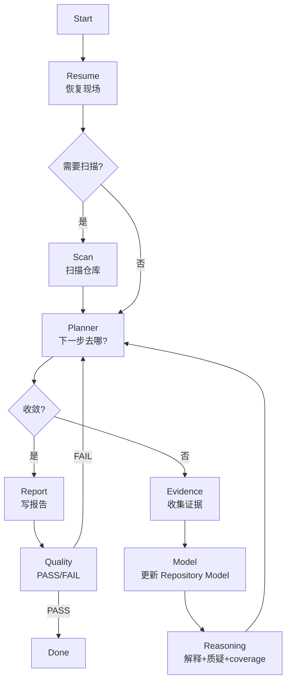

# Repository 研究

> 相关文档：[methodology.md](./methodology.md)（研究方法论） | [workspace.md](./workspace.md)（工作目录 + 文件所有权 + 缓存策略） | [question-framework.md](./question-framework.md)（问题生成与管理） | [report-schema.md](./report-schema.md)（Repository Model + 报告规范）

## 目标

构建可复用的架构知识库（Repository Model）。Repository Model 捕获实体、关系及支撑证据。报告是 Repository Model 的视图。

## 架构：Orchestrator + 8 Sub Agents

SKILL 是 Orchestrator，**只负责调度**。每个 Agent 自己知道自己的输入/输出/规则，SKILL 不知道实现细节。



## Orchestrator 调度步骤

```
1. call resume              → 恢复现场，判断是否需要扫描
2. if need scan: call scan
3. loop:
     a. call planner          → 返回 {converged, next_focus}（Planner 不写状态文件）
     b. if converged: break
     c. Orchestrator 更新 summary.json + context.current_round（基于 planner 返回值）
     d. call evidence         → 读文件，写 evidence-log（append-only）
     e. call model            → 从 evidence 合并/更新 repository-model.json（Model 是唯一写入者）
     f. call reasoning        → 架构解释 + 质疑 + 更新 coverage/design_space/maintainer_view
4. call report              → 从 Model + evidence 生成报告
5. call quality             → 返回 PASS/FAIL/reason（不修改 report）
6. if FAIL: goto 3 (Planner 根据 failed_checks 生成针对性问题)
```

### Orchestrator 承担的状态更新（非 Planner）

Planner 只返回决策，**不写状态文件**。以下由 Orchestrator 在收到 Planner 返回后执行：

- 收到 `{converged: false, round_file: "round-3.json"}` → Orchestrator 更新 `context.current_round` 和 `questions/summary.json`
- 收到 `{converged: true}` → Orchestrator 进入 Report 阶段

## Agent 清单

| Agent | 文件 | 一句话职责 |
|-------|------|-----------|
| Resume | [agents/resume.md](./agents/resume.md) | 恢复现场，判断代码变化，返回下一步跳转目标 |
| Scan | [agents/scan.md](./agents/scan.md) | 扫描仓库，生成可复用的 artifacts/*.json |
| Planner | [agents/planner.md](./agents/planner.md) | **只回答"下一步去哪？"**——判断收敛 + 生成下一轮问题 |
| Evidence | [agents/evidence.md](./agents/evidence.md) | 读文件 + 写 evidence-log.jsonl（**不碰 Model**） |
| Model | [agents/model.md](./agents/model.md) | **repository-model.json 唯一写入者**——从 evidence 合并/更新 Model |
| Reasoning | [agents/reasoning.md](./agents/reasoning.md) | 架构解释 + 质疑模型 + 更新 coverage/design_space/maintainer_view |
| Report | [agents/report.md](./agents/report.md) | 从 Model + evidence 生成报告（禁止新增推理） |
| Quality | [agents/quality.md](./agents/quality.md) | 返回 PASS/FAIL/reason（**不修改 report**） |

> 工作目录结构、文件所有权矩阵、产物缓存策略详见 [workspace.md](./workspace.md)。SKILL 不重复这些实现细节。

## 成功标准

一份成功的研究应该让有经验的工程师能回答：

- 能用一句话说出系统的**架构中心**，且能回答"如果把这个中心去掉，系统还能跑吗？"
- 每个关键决策都能说出**至少一个被拒绝的替代方案**
- 报告的结论不是从源码"看"出来的，而是通过**提问 → 收集证据 → 质疑 → 修正**循环产生的
