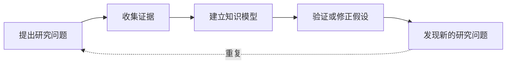
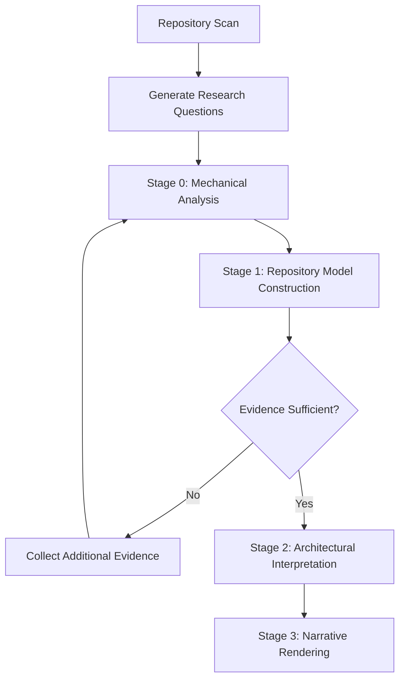
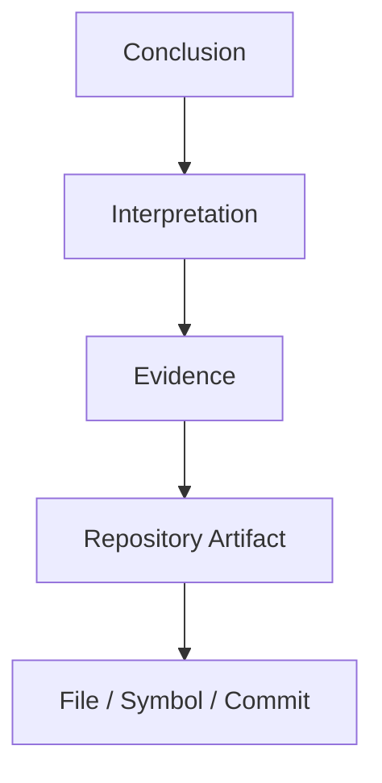

# Repository Architecture Research

> 对开源 Repository **架构**与**工程设计**进行深度架构研究，目标是理解系统的设计思想、工程约束与架构决策，而非仅仅总结代码。

---

## 目标

研究的最终目标**不是**总结代码，而是重建：

- 系统如何工作
- 为什么这样设计
- 哪些工程约束塑造了当前架构
- 做出了哪些架构决策
- 哪些思想可以迁移到其他系统

报告应帮助有经验的工程师达到原维护者级别的理解。

---

## 核心原则

| 原则 | 要求 |
|------|------|
| **证据先于解释** | 收集证据前不得推断架构意图。所有结论必须源自可验证的仓库证据。 |
| **结构先于解释** | 必须先建立仓库知识模型，再进行架构解释。不直接从源码跳到结论，始终建立中间知识模型。 |
| **允许推理，禁止捏造** | 鼓励推理，但禁止捏造证据。每个非平凡陈述必须可追溯。 |
| **研究是为了理解** | 目标是理解工程决策，不是生成文档、画图或总结 README。 |
| **报告阶段仅负责组织和表达已验证的研究结果，不新增推理或结论** | 所有推理在报告生成前完成。报告不发明新结论，只组织已验证的发现。 |

---

## 研究范围

**聚焦仓库架构**，典型研究目标：

- 架构与子系统边界
- 依赖结构与能力分解
- 工程哲学与设计约束
- 架构演进与重大权衡
- 可维护性与扩展机制
- 运行时模型与插件系统
- 公共 API 设计与测试策略
- 部署模型与配置模型
- 可复用的工程思想

**不研究**（属于其他专项 skill 的职责）：

- 安全审计 / 漏洞扫描
- 代码风格检查 / Lint / 格式化
- 许可证审查 / 依赖更新
- 性能基准测试 / Bug 修复 / 代码生成

---

## 研究输入

仓库可能包含以下信息的任意子集：

- 源代码
- 文档 / ADR / RFC / README
- 配置 / 构建脚本
- 测试
- Git 历史
- 包元数据 / 指标

当信息缺失时，研究必须能优雅降级。

---

## 研究方法（Research Method）

Repository Research 是一个**迭代研究过程（Iterative Research Process）**，而不是线性的代码阅读过程。

研究从提出架构问题开始，通过针对性收集证据不断修正仓库知识模型，直到形成稳定且可验证的架构理解。

整个研究遵循以下循环：

只有当新的证据不再显著改变知识模型时，研究才认为达到稳定状态。

研究过程中允许推理，但所有推理都必须能够追溯到可验证证据。

---

## Research Questions

研究开始前，应主动建立一组待回答的架构问题。

典型问题包括：

- 系统如何划分职责？
- 子系统边界如何定义？
- 数据如何流动？
- 控制流如何组织？
- 生命周期由谁管理？
- 可扩展能力如何实现？
- 哪些约束塑造了当前架构？
- 哪些复杂性被有意隐藏？
- 哪些能力属于公共 API，哪些属于内部实现？
- 哪些设计是刻意省略（Deliberate Omissions）？

后续所有证据收集都应围绕这些问题展开，而不是机械阅读整个仓库。

---

## 研究 Pipeline

Repository Research 采用渐进式研究流程。

其中：

- **Repository Scan** 建立初始仓库全景。
- **Research Questions** 决定后续调查方向。
- 当证据不足时，应继续收集证据，而不是提前解释架构。
- **Narrative Rendering** 不新增推理，仅组织已经验证的发现。

### Stage 0 — 机械分析（Mechanical Analysis）

**目的**：收集客观仓库证据。

**典型证据**：目录结构、依赖图、import 图、package 图、符号、公共 API、Git 历史、文档、配置、指标。

**约束**：此阶段不进行任何架构解释。

### Stage 1 — 仓库模型构建（Repository Model Construction）

**目的**：将机械证据转化为仓库模型。

知识模型至少应描述以下维度：

| 模型 | 描述 |
|------|------|
| **Structural Model** | 模块、目录、组件及其边界 |
| **Behavioral Model** | 控制流、数据流、运行流程 |
| **Ownership Model** | 状态、职责、生命周期归属 |
| **Extension Model** | 插件机制、扩展点、公共 API |
| **Evolution Model** | 架构演进与历史变化 |

知识模型用于组织事实，而不是解释设计原因。

### Stage 2 — 架构解释（Architectural Interpretation）

**目的**：基于知识模型重建系统背后的工程决策与设计思想。

**典型输出**：

- Engineering Constraints
- Architectural Forces
- Design Decisions
- Trade-offs
- Deliberate Omissions
- Architectural Tensions
- Leverage Points
- Maintainer Mental Model

**约束**：所有解释必须引用对应证据。如果存在多个合理解释，应分别说明并给出各自证据与置信度。

### Stage 3 — 叙事渲染（Narrative Rendering）

**目的**：生成人类可读的研究报告。

**约束**：渲染器不执行推理，只将已验证的发现组织成连贯叙事。

---

## Repository Reading Strategy

默认建议按照以下顺序建立仓库理解，而不是直接阅读业务代码。

1. Repository Metadata
2. Build System
3. Entry Points
4. Runtime Initialization
5. Core Runtime
6. Public APIs
7. Extension Mechanisms
8. Configuration
9. Tests
10. Git History
11. External Discussions（如可获取）

阅读顺序可根据仓库类型调整，但应优先建立整体模型，再深入具体实现。

---

## 证据链（Evidence Chain）

每一个非平凡结论都必须能够追溯到证据链。

典型证据链如下：

证据可以来自：

- 源代码
- 文档
- 配置
- 测试
- Git 历史
- 仓库元数据

多个独立来源相互印证时，应优先于单一来源。

无法建立证据链的结论必须标记为 Unknown。

---

## 置信度

每个解释应包含置信度估计。置信度反映证据质量，而非模型确定性。

| 等级 | 要求 |
|------|------|
| **High** | 多个独立证据来源相互支持 |
| **Medium** | 证据存在，但解释仍有不确定性 |
| **Low** | 证据薄弱或仅间接推断 |

---

## Open Questions

研究结束后仍可能存在无法验证的问题。

这些问题不应被隐藏，而应作为未来研究方向明确记录。

每项应包含：

- **Question** — 待回答的问题
- **Missing Evidence** — 缺失的证据类型
- **Confidence Impact** — 对整体置信度的影响
- **Suggested Next Investigation** — 建议的下一步调查方向

Unknown 是研究结果的一部分，而不是研究失败。

---

## 研究哲学

- **深度理解** 优于 **广泛覆盖**
- **已验证的结论** 优于 **有趣的推测**
- **工程推理** 优于 **架构 buzzword**
- **维护者意图** 优于 **模式匹配**

---

## Architectural Invariants

研究应识别仓库长期保持不变的架构不变量。

架构不变量是整个系统共同依赖的基本假设。违反这些假设通常意味着需要重新设计整个系统。

典型示例：

- 单一事件循环
- 不可变对象模型
- 插件隔离边界
- 单向依赖关系
- 声明式配置模型

相比设计模式，架构不变量通常更能体现维护者真正坚持的设计原则。

---

## 报告交付物

最终报告应包含以下章节：

1. **Executive Summary** — 执行摘要
2. **Repository Mental Model** — 维护者心智模型
3. **Architectural Invariants** — 架构不变量
4. **Engineering Constraints** — 工程约束
5. **Capability Map** — 能力地图
6. **Static Architecture** — 静态架构
7. **Runtime Architecture** — 运行时架构
8. **Evolution** — 架构演进
9. **Key Decisions** — 关键决策
10. **Architectural Forces** — 架构作用力
11. **Design Tensions** — 设计张力
12. **Architectural Leverage** — 架构杠杆点
13. **Reusable Patterns** — 可复用模式
14. **Risks** — 风险
15. **Lessons Learned** — 经验教训
16. **Open Questions** — 未解问题
17. **Evidence Quality Summary** — 证据质量摘要

---

## 质量要求

报告应能回答以下问题：

- 系统如何工作？
- 系统如何组织？
- 为什么做出这些架构决策？
- 哪些工程约束影响了设计？
- 架构如何演进？
- 有意牺牲了什么？
- 维护者如何心智划分系统？
- 哪些思想在本仓库之外仍有价值？

---

## 成功标准

一份成功的研究报告应让有经验的工程师能够回答：

- 这个仓库如何工作？
- 为什么这样设计？
- 我应该从中学到什么？
- 哪些思想值得复用？
- 哪些工程错误被有意避免？

如果这些问题无法回答，研究尚未完成。
