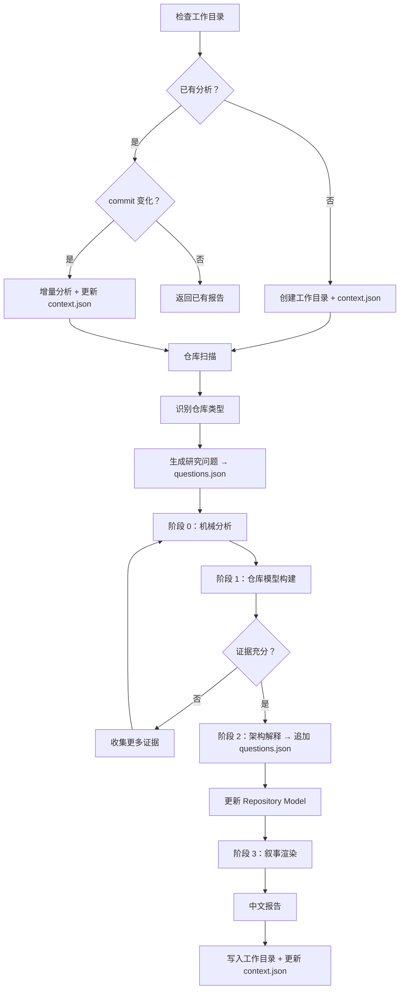
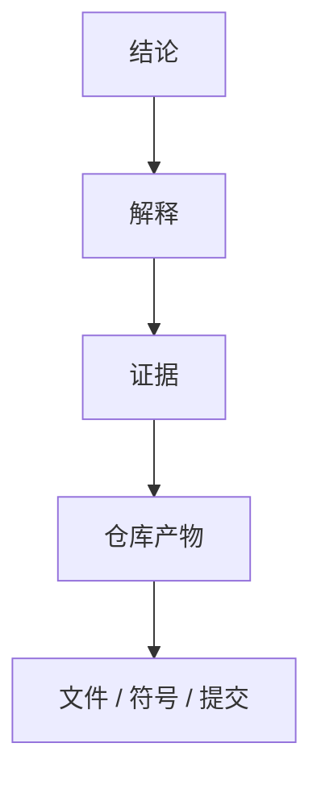

# Repository 研究

> 相关文档：[methodology.md](./methodology.md)（方法论与设计理由）| [report-schema.md](./report-schema.md)（输出规范与 Schema）

---

## 核心理念

Repository Research 的目标**不是**生成报告，而是：

> **把 Repository 编译成 Repository Model，再从 Model 渲染报告。**

```
Repository → 编译 → Repository Model → 渲染 → 报告
```

- **Repository Model 是第一产物** — 架构知识库，非中间步骤。
- **报告是 Model 的视图** — 从 Model 生成，而非直接从源码推断。

---

## 目标

编译目标**不是**总结代码，而是构建可复用的架构知识库：

- 系统如何工作
- 为什么这样设计
- 哪些工程约束塑造了当前架构
- 做出了哪些架构决策
- 哪些思想可以迁移到其他系统

知识库应帮助有经验的工程师达到原维护者级别的理解。

---

## 编译范围

**编译**：

- 架构与子系统边界
- 依赖结构与能力分解
- 工程哲学与设计约束
- 架构演进与重大权衡
- 可维护性与扩展机制
- 运行时模型与插件系统
- 公共 API 设计与测试策略
- 部署模型与配置模型
- 可复用的工程思想

**不编译**（属于其他专项 skill）：

- 安全审计 / 漏洞扫描
- 代码风格检查 / Lint / 格式化
- 许可证审查 / 依赖更新
- 性能基准测试 / Bug 修复 / 代码生成

---

## 编译输入

接受以下信息的任意子集：

- 源代码
- 文档 / ADR / RFC / README
- 配置 / 构建脚本
- 测试
- Git 历史
- 包元数据 / 指标

信息缺失时，优雅降级。

---

## 工作目录

每次分析使用一个持久化的工作目录，存放所有中间产物和最终报告。**禁止**将分析产物散落在仓库内部或临时目录。

### 目录结构

```
.working/{repo-name}/
├── context.json             # 执行上下文（阶段性更新）
├── questions.json           # 研究问题集合
├── repository-model.json    # Repository Model（第一产物）
├── evidence/                # 证据快照
├── report.md                # 最新报告（中文）
└── meta.json                # 元信息
```

### context.json

工作目录确定后**立即创建**，研究过程中**持续更新**。

```json
{
  "user_input": "用户原始输入，不转义",
  "current_focus": "当前研究焦点",
  "answered_questions": ["Q1", "Q2"],
  "open_questions": ["Q3", "Q4"],
  "evidence_collected": [
    {
      "path": "文件相对路径",
      "purpose": "读取目的"
    }
  ]
}
```

字段说明：

- `user_input` — **原样保存**用户输入，禁止任何转义或修改
- `current_focus` — 当前正在研究的能力或子系统（如 "Permission System"）
- `answered_questions` — 已回答的问题 ID 列表（对应 questions.json 中的 id）
- `open_questions` — 待回答的问题 ID 列表
- `evidence_collected` — 已收集的证据列表，每项含文件路径和读取目的

### questions.json

生成研究问题后创建，架构解释阶段**追加**新问题。

```json
[
  {
    "id": "Q1",
    "question": "系统如何划分职责？",
    "type": "discovery",
    "status": "open",
    "confidence": "low",
    "related_evidence": [],
    "derived_from": []
  },
  {
    "id": "Q12",
    "question": "为什么 Scheduler 独立？",
    "type": "discovery",
    "status": "answered",
    "confidence": "high",
    "related_evidence": ["coworker/agent.py:build_engine"],
    "derived_from": ["Q3"]
  }
]
```

字段说明：

- `id` — 问题唯一标识（Q1, Q2, ...）
- `question` — 问题文本
- `type` — 问题类型：`discovery`（发现）/ `critical`（批判）/ `transfer`（迁移）
- `status` — `open`（待回答）/ `answered`（已回答）
- `confidence` — `high` / `medium` / `low`（仅 answered 时有意义）
- `related_evidence` — 相关证据引用列表（文件路径:符号）
- `derived_from` — 此问题从哪些问题衍生而来（问题 ID 列表）

架构解释阶段产生的新问题**必须追加**到此文件，禁止仅保留在内存中。问题状态变化时（open → answered）同步更新 context.json 的 `answered_questions` / `open_questions`。

### meta.json

必须记录：

- `repo_path` — 仓库路径
- `repo_type` — 识别的仓库类型
- `last_analyzed_commit` — 上次分析的 commit hash
- `analyzed_at` — 分析时间
- `model_version` — Model schema 版本

### 增量分析

分析前，**检查工作目录是否已存在该 repo 的分析**：

1. **不存在** → 执行全量分析，创建工作目录
2. **存在且 commit 相同** → 跳过分析，返回已有报告
3. **存在且 commit 不同** → 执行增量分析：
   - 识别变化的文件（`git diff {last_analyzed_commit}..HEAD`）
   - 只重新分析受影响的 Model 部分
   - 合并到已有 Repository Model
   - 重新渲染报告

**禁止**在增量分析中丢失已有证据。新增证据合并，过时证据标记为 `deprecated` 但不删除。

如果仓库非 Git 仓库或无 commit 历史，每次执行全量分析。

---

## 编译流程



### 仓库扫描 + 识别仓库类型

扫描仓库后，**立即识别仓库类型**（CLI / 库 / 框架 / 数据库 / 编译器 / 运行时 / 操作系统 / SDK / AI 基础设施 / Web 服务等）。

不同类型的仓库关注点完全不同：

| 仓库类型 | 关注重点 |
|---------|---------|
| 编译器 | IR / 优化 / Pass |
| 框架 | 扩展点 / 生命周期 / Hook |
| 数据库 | 存储 / 事务 / 并发 |
| 运行时 | 事件循环 / 调度 / 内存管理 |

仓库类型决定后续研究问题的方向。

### 阶段 0 — 机械分析

收集客观仓库证据：目录结构、依赖图、import 图、package 图、符号、公共 API、Git 历史、文档、配置、指标。

**禁止**在此阶段进行架构解释。

### 阶段 1 — 仓库模型构建

将机械证据转化为 Repository Model。

构建以下 5 个维度（详见 [report-schema.md](./report-schema.md#仓库模型维度)）：

| 模型 | 描述 |
|------|------|
| **结构模型** | 模块、目录、组件及其边界 |
| **行为模型** | 控制流、数据流、运行流程 |
| **归属模型** | 状态、职责、生命周期归属 |
| **扩展模型** | 插件机制、扩展点、公共 API |
| **演进模型** | 架构演进与历史变化 |

**禁止**在此阶段推断架构意图。

### 阶段 2 — 架构解释

基于仓库模型重建系统背后的工程思想。

产出以下类型（详见 [report-schema.md](./report-schema.md#阶段-2-输出类型)）：

- 工程约束
- 架构作用力
- 设计决策
- 权衡
- 有意省略
- 架构张力
- 杠杆点
- 维护者心智模型

**每个解释必须引用证据。**

如果存在多个合理解释，分别说明并给出各自证据与置信度。

### 阶段 3 — 叙事渲染

从 Repository Model 渲染人类可读的报告。

**禁止**在此阶段执行推理。**禁止**发明新结论。

只将已验证的发现组织成连贯叙事。

---

## 研究问题

证据收集前，生成一组待回答的架构问题。

典型问题：

- 系统如何划分职责？
- 子系统边界如何定义？
- 数据如何流动？
- 控制流如何组织？
- 生命周期由谁管理？
- 可扩展能力如何实现？
- 哪些约束塑造了当前架构？
- 哪些复杂性被有意隐藏？
- 哪些能力属于公共 API，哪些属于内部实现？
- 哪些设计是刻意省略？

后续所有证据收集必须围绕这些问题展开。**禁止**机械阅读整个仓库。

以上问题仅作为初始框架。研究者应根据仓库类型、领域与初步证据，主动生成该仓库特有的架构问题，并在研究过程中持续调整问题集合。

**研究问题是动态演化的**——随新证据出现而更新，而非一次生成后固定不变。

### 问题生成原则

研究问题必须满足以下四项要求：

| 原则 | 要求 | 违反则 |
|------|------|--------|
| **准确性** | 每个问题必须由当前证据或观察触发，而非固定模板。格式：`观察 → 问题`，而非 `模板 → 问题` | 问题与仓库无关 |
| **延展性** | 一个问题得到部分回答后，必须派生新的问题。问题随研究推进持续深化，而非固定列表 | 研究停留在表面 |
| **创新性** | 优先提出只有该 Repository 才值得问的问题，而非通用架构问题 | 报告千篇一律 |
| **挑战性** | 主动提出可能推翻当前理解的问题，并寻找反证验证 Repository Model | 模型未经检验 |

派生问题必须记录到 questions.json 的 `derived_from` 字段，形成问题衍生链。

---

## 批判性问题

Repository Model 初步稳定后，**主动提出挑战当前理解的问题**，以验证模型是否充分解释仓库设计。

典型问题：

- 如果移除这一组件，系统还能成立吗？
- 哪个模块是真正的架构中心，而不是实现细节？
- 哪些抽象是必需的，哪些只是实现选择？
- 是否存在更简单的设计？仓库为什么没有采用？
- 哪些设计看似重要，但实际上可以替换？
- 哪些模块承担了过多职责？
- 哪些复杂性来自业务约束，而不是架构本身？
- 当前解释是否还能同时解释所有证据？

这些问题用于**验证 Repository Model**，而不是生成新的推测。**禁止**在无新证据支持下发明新结论。

同时**主动寻找反证（Disconfirming Evidence）**——如果得出"Plugin System"结论，应主动查找是否有地方直接 new 具体类，以此检验结论的适用范围。

---

## 三类问题框架

完整的研究应包含三类问题：

| 类型 | 目的 | 时机 |
|------|------|------|
| **发现问题（Discovery）** | 建立模型 | 研究初期 |
| **批判性问题（Critical）** | 推翻错误模型 | 模型初步稳定后 |
| **迁移问题（Transfer）** | 抽象可复用思想 | 研究后期 |

```
系统如何工作？  →  我的理解可能是错的吗？  →  什么可以泛化？
```

---

## 阅读策略

按以下顺序建立仓库理解，**不要**直接阅读业务代码：

1. 仓库元数据
2. 构建系统
3. 入口点
4. 运行时初始化
5. 核心运行时
6. 公共 API
7. 扩展机制
8. 配置
9. 测试
10. Git 历史
11. 外部讨论（如可获取）

可根据仓库类型调整顺序。**始终**先建立整体模型，再深入具体实现。

---

## 证据规则

- **追溯**每个结论到证据。
- **禁止**无证据推断。
- **标记**无证据支持的声明为未解问题。
- **优先**多个独立来源，而非单一来源。
- 冲突时**优先**高层级证据：测试 > 源码 > 配置 > 文档 > 提交 > 推断。

证据链格式（详见 [report-schema.md](./report-schema.md#证据链)）：



---

## 意外发现

**显式记录意外发现**——当观察到与预期不符的架构现象时（如整个仓库没有 Interface、测试比源码更能解释行为、刻意省略常见模式），必须记录。

意外发现往往是研究中最有价值的部分，因为它们揭示了非显而易见的设计决策。

---

## 置信度

标注每个解释的置信度（详见 [report-schema.md](./report-schema.md#置信度等级)）：

| 等级 | 要求 |
|------|------|
| **高** | 多个独立证据来源相互支持 |
| **中** | 证据存在，但解释仍有不确定性 |
| **低** | 证据薄弱或仅间接推断 |

---

## 未解问题

记录无法验证的问题。**禁止**推测。**禁止**隐藏未知项。

每项必须包含（详见 [report-schema.md](./report-schema.md#未解问题格式)）：

- **问题** — 待回答的问题
- **缺失证据** — 缺失的证据类型
- **置信度影响** — 对整体置信度的影响
- **建议下一步调查** — 建议的下一步调查方向

---

## 架构不变量

识别被大多数子系统共同假设的架构不变量。

这些是整个系统共同依赖的基本假设。违反这些假设通常意味着需要重新设计整个系统。

典型示例：

- 单一事件循环
- 不可变对象模型
- 插件隔离边界
- 单向依赖关系
- 声明式配置模型

**将不变量写入 Repository Model，并在报告中呈现。**

---

## 质量门禁

报告完成前，验证以下问题：

- 系统如何工作？
- 系统如何组织？
- 为什么做出这些架构决策？
- 哪些工程约束影响了设计？
- 架构如何演进？
- 有意牺牲了什么？
- 维护者如何心智划分系统？
- 哪些思想在本仓库之外仍有价值？

**如果任一问题无法回答，编译尚未完成。**

---

## 输出

### 第一产物：Repository Model

Repository Model 是核心产物，捕获实体、关系及支撑证据（详见 [report-schema.md](./report-schema.md#repository-model)）。持久化到工作目录的 `repository-model.json`。

### 第二产物：报告

报告是 Repository Model 的视图，**必须使用中文撰写**，覆盖以下信息维度（详见 [report-schema.md](./report-schema.md#报告信息维度)）：

- 系统如何工作
- 为什么这样设计
- 关键约束与决策
- 可复用思想
- 证据质量与未解问题

具体章节结构由渲染器根据仓库复杂度决定，**不强制固定模板**。推荐结构见 [report-schema.md](./report-schema.md#推荐结构)。

报告持久化到工作目录的 `report.md`。增量分析时覆盖旧报告，但 Repository Model 保留历史证据（标记 `deprecated`）。

---

## 成功标准

一份成功的编译应让有经验的工程师能够回答：

- 这个仓库如何工作？
- 为什么这样设计？
- 我应该从中学到什么？
- 哪些思想值得复用？
- 哪些工程错误被有意避免？

**如果这些问题无法回答，编译尚未完成。**
