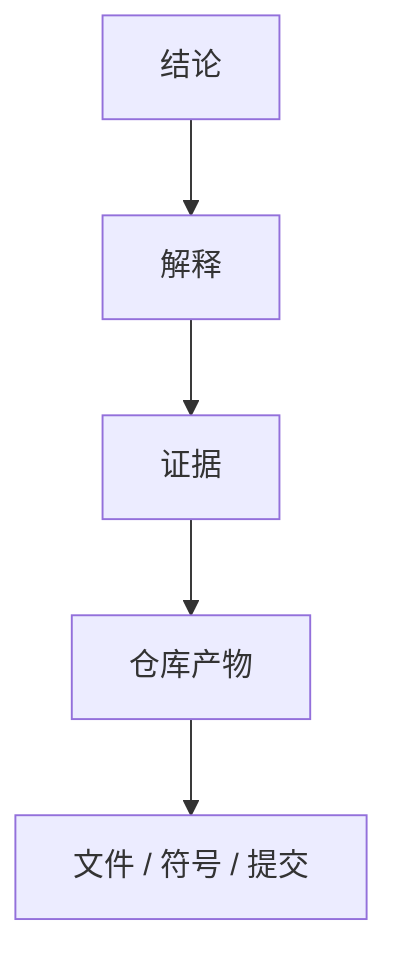

# Repository 研究

> 相关文档：[methodology.md](./methodology.md)（方法论与设计理由）| [report-schema.md](./report-schema.md)（输出规范与 Schema）

---

## 核心理念

Repository Research 的目标**不是**生成报告，而是：

> **把 Repository 编译成 Repository Model，再从 Model 渲染报告。**

```
Repository → 编译 → Repository Model → 渲染 → 报告
```

- **Repository Model 是第一产物** — 架构知识库，非中间步骤。
- **报告是 Model 的视图** — 从 Model 生成，而非直接从源码推断。

---

## 目标

编译目标**不是**总结代码，而是构建可复用的架构知识库：

- 系统如何工作
- 为什么这样设计
- 哪些工程约束塑造了当前架构
- 做出了哪些架构决策
- 哪些思想可以迁移到其他系统

知识库应帮助有经验的工程师达到原维护者级别的理解。

---

## 编译范围

**编译**：

- 架构与子系统边界
- 依赖结构与能力分解
- 工程哲学与设计约束
- 架构演进与重大权衡
- 可维护性与扩展机制
- 运行时模型与插件系统
- 公共 API 设计与测试策略
- 部署模型与配置模型
- 可复用的工程思想

**不编译**（属于其他专项 skill）：

- 安全审计 / 漏洞扫描
- 代码风格检查 / Lint / 格式化
- 许可证审查 / 依赖更新
- 性能基准测试 / Bug 修复 / 代码生成

---

## 编译输入

接受以下信息的任意子集：

- 源代码
- 文档 / ADR / RFC / README
- 配置 / 构建脚本
- 测试
- Git 历史
- 包元数据 / 指标

信息缺失时，优雅降级。

---

## 工作目录

每次分析使用一个持久化的工作目录，存放所有中间产物和最终报告。**禁止**将分析产物散落在仓库内部或临时目录。

### 目录结构

```
.working/{repo-name}/
├── context.json             # 执行上下文（阶段性更新）
├── questions.json           # 第一轮研究问题
├── questions-r2.json        # 第二轮收敛问题
├── repository-model.json    # Repository Model（第一产物）
├── evidence/                # 证据快照
├── report.md                # 最新报告（中文）
└── meta.json                # 元信息
```

### context.json

context.json 是研究者的**外部脑**。它不仅跟踪进度，更跟踪**理解状态**——你当前的模型有多稳定、有哪些未解决的矛盾、挑战过什么结论。

工作目录确定后**立即创建**，研究中**每次理解变化时更新**。

```json
{
  "user_input": "用户原始输入，不转义",

  "research_progress": {
    "current_focus": "当前研究焦点",
    "answered_questions": ["Q1"],
    "open_questions": ["Q2", "Q3"],
    "current_depth_level": 1,
    "max_depth_reached": 1,
    "model_stability": "nascent",
    "design_space_explored": false,
    "counterevidence_seeked": false
  },

  "architecture_model": {
    "center_hypothesis": "最核心的架构假设（一句话）",
    "key_assumptions": [
      {
        "assumption": "系统依赖的某个关键假设",
        "evidence": ["server/gateway.ts:createDomainGateway"],
        "challenged": false,
        "survived_challenge": null
      }
    ],
    "architecture_invariants": ["不可违反的基本约束"],
    "unexplained_observations": ["当前模型无法解释的现象"],
    "competing_interpretations": []
  },

  "challenge_record": [
    {
      "target": "被挑战的结论",
      "challenge": "如果移除 X，系统还能成立吗？",
      "method": "寻找反证 | 替代方案比较 | 假设检验",
      "outcome": "survived | refuted | modified",
      "evidence": ["..."],
      "model_delta": "挑战后模型有何变化"
    }
  ],

  "design_space": [
    {
      "decision": "做出的技术决策",
      "chosen": "选择了什么",
      "rejected": ["被拒绝的方案"],
      "why_chosen": "为什么选这个",
      "why_rejected": "为什么拒绝替代方案",
      "confidence": "high",
      "evidence": ["..."]
    }
  ],

  "maintainer_view": {
    "modification_impact_map": {
      "add_panel": ["src/config/panels.ts", "src/components/", "src/app/data-loader.ts"],
      "add_data_source": ["scripts/seed-*.mjs", "server/worldmonitor/", "api/"]
    },
    "complexity_drivers": ["驱动复杂度的根因"]
  },

  "evidence_collected": [
    {
      "path": "文件相对路径",
      "purpose": "读取目的",
      "key_findings": ["关键发现"],
      "surprises": ["意外发现"],
      "unanswered": ["阅读后仍存疑的问题"]
    }
  ],

  "round_2_checked": "open",
  "quality_gate": {
    "center_identified": false,
    "alternatives_considered": false,
    "counterexamples_found": false,
    "model_challenged": false
  }
}
```

#### model_stability 状态机

| 状态 | 含义 | 触发条件 |
|------|------|---------|
| `nascent` | 模型刚建立，尚未验证 | 完成 Phase 1 |
| `formative` | 模型在修正中 | 新证据改变模型 |
| `challenged` | 模型受到挑战，有备选解释 | Phase 2b 挑战阶段 |
| `stable` | 挑战未推翻，模型收敛 | 所有挑战 surviving |

**禁止**直接从 nascent 跳到 stable。模型必须被挑战过才能算稳定。

#### 字段说明

- `research_progress.current_depth_level` — 当前"为什么"链的深度（第 1 层：What → 第 2 层：How → 第 3 层：Why → 第 4 层：Why not）
- `research_progress.model_stability` — 见状态机
- `architecture_model.center_hypothesis` — 一句话的架构中心假设。这是研究的锚点。如果报告结束时这句话还是"待定"，研究不完整。
- `architecture_model.competing_interpretations` — 当多个解释都能解释当前证据时，列出所有可能
- `challenge_record` — 每次挑战的结果，避免重复挑战同一结论
- `design_space` — 每个决策考虑过的替代方案。这是"为什么不是别的"的证据
- `maintainer_view` — 如果我是维护者，修改 X 需要改哪些文件
- `quality_gate` — 报告生成前的自查清单

### context.json → questions.json 联动规则

**理解变化 → 同步更新这两个文件**。禁止只更新一个。

| 事件 | context.json | questions.json |
|------|-------------|----------------|
| 发现新现象 | `unexplained_observations` 追加 | 新增 discovery 型问题 |
| 回答一个问题 | `answered_questions` 追加，`open_questions` 删除 | status → `answered` |
| 模型被挑战 | `model_stability` → `challenged`，`challenge_record` 追加 | 新增 challenge 型问题 |
| 考虑替代方案 | `design_space` 追加 | 新增 design_space 型问题 |
| 找到反证 | `architecture_model.key_assumptions` 更新 | 对应问题 counterevidence 更新 |
| 模型变化 | `architecture_model` 更新 | 派生新问题 |

### questions.json

研究问题是**研究者的思考路径**，不是待办事项。每个问题必须能回溯到触发它的观察。

```json
[
  {
    "id": "Q1",
    "question": "系统如何划分职责？",
    "genesis": {
      "trigger": "observation",
      "observation": "src/ 目录有 14 个子目录，api/ 有 81 个端点",
      "depth_level": 1
    },
    "type": "discovery",
    "status": "answered",
    "confidence": "high",
    "answer_summary": "types → config → services → components → app → App.ts 单向依赖",
    "related_evidence": ["AGENTS.md:Dependency Direction"],
    "counterevidence": ["src/components/Panel.ts 直接 import services/"],
    "alternatives_considered": ["为什么不使用 Redux/Zustand"],
    "model_implication": "依赖方向受控是架构不变量",
    "derived_from": []
  },
  {
    "id": "Q7",
    "question": "为什么 201 个 service 还能撑住而没有演化成 Redux？",
    "genesis": {
      "trigger": "surprise",
      "observation": "163 个组件、201 个服务模块、无外部状态库",
      "depth_level": 2
    },
    "type": "critical",
    "status": "answered",
    "confidence": "medium",
    "answer_summary": "AppContext 中央可变对象 + 严格的依赖方向 + Panel 基类的自包含渲染",
    "related_evidence": ["src/App.ts:924-981"],
    "counterevidence": [],
    "alternatives_considered": ["Redux, Zustand, MobX"],
    "model_implication": "无外部状态库是有意选择，非偶然",
    "derived_from": ["Q1"]
  }
]
```

#### 字段说明

| 字段 | 说明 |
|------|------|
| `id` | 问题唯一标识（Q1, Q2, ...），按生成顺序编号 |
| `question` | 问题文本。必须包含具体仓库上下文，不能是通用模板 |
| `genesis.trigger` | 触发源：`observation`（观察） / `surprise`（意外） / `challenge`（挑战） / `contradiction`（矛盾） / `design_gap`（设计空白）|
| `genesis.observation` | 触发问题的具体观察，格式：`观察到什么 → 所以问什么` |
| `genesis.depth_level` | 深度层级：1=What / 2=How / 3=Why / 4=Why not |
| `type` | 问题类型：`discovery`（发现） / `critical`（批判） / `challenge`（挑战模型） / `design_space`（设计空间） / `counterevidence`（反证） / `maintainer`（维护） / `transfer`（迁移） |
| `status` | `open` / `researching` / `answered` / `validated` / `deprecated` / `refuted` — 见问题生命周期 |
| `confidence` | `high` / `medium` / `low` |
| `answer_summary` | 回答摘要（status=answered 时必填） |
| `related_evidence` | 支持证据 |
| `counterevidence` | 反证（**主动寻找的 disconfirming evidence**） |
| `alternatives_considered` | 考虑过的替代方案 |
| `model_implication` | 答案对 Repository Model 的影响 |
| `derived_from` | 父问题 ID 列表，形成问题衍生链 |
| `superseded_by` | 如果问题被更精确的问题替代，指向新 ID |

#### 问题类型选型指南

| 类型 | 何时用 | 问法模板 |
|------|--------|---------|
| `discovery` | 首次看到某个现象 | "这如何工作？" |
| `critical` | 评估一个决策 | "为什么选这个而非默认？" |
| `challenge` | 检验自己的模型 | "如果我的解释是对的，应该在哪里看到 X；实际上有吗？" |
| `design_space` | 比较决策 | "为什么不是别的方案？" |
| `counterevidence` | 主动找反证 | "如果我的结论是错的，应该在哪里找到证据？" |
| `maintainer` | 评估维护成本 | "修改 X 需要改多少文件？" |
| `transfer` | 抽象通用模式 | "这个思想在什么场景下有价值？" |

#### 深度层级演化

研究必须逐层深入。问题深度标记防止停留在表面：

```
depth=1: What         "系统如何划分职责？"
    ↓ answered
depth=2: How          "为什么用 AppContext 而不是 Redux？"
    ↓ answered
depth=3: Why          "为什么无外部状态库的架构能撑住 201 个 service？"
    ↓ answered
depth=4: Why not      "如果换用 Redux，哪些约束会失效？"
```

**规则**: depth=1 问题全部 answered 后，**必须**生成 depth≥2 的问题。如果所有问题 depth=1，研究不完整。

### questions-r2.json

第一轮问题（questions.json）全部回答后，根据回答结果生成第二轮收敛问题。

格式与 questions.json 相同，但约束更严格：

- **个数 ≤ 第一轮** — 保持收敛性，不得发散
- **深度必须 ≥2** — 第二轮问题不得全是 depth_level=1
- **必须有差异** — 每个第二轮问题必须体现以下至少一种差异：
  - **不同点** — 从不同角度审视同一现象
  - **差异点** — 对比预期与实际的不一致
  - **相反点** — 主动提出与当前结论相反的假设
  - **深入点** — 追问第一轮回答中未解释的细节
- **禁止同义重述** — 不得是同一问题的不同问法

第二轮问题全部回答且 `round_2_checked` 标记为 `done` 后，**才能进入生成分析报告阶段**。

### meta.json

必须记录：

- `repo_path` — 仓库路径
- `repo_type` — 识别的仓库类型
- `last_analyzed_commit` — 上次分析的 commit hash
- `analyzed_at` — 分析时间
- `model_version` — Model schema 版本

### 增量分析

分析前，**检查工作目录是否已存在该 repo 的分析**：

1. **不存在** → 执行全量分析，创建工作目录
2. **存在且 commit 相同** → 跳过分析，返回已有报告
3. **存在且 commit 不同** → 执行增量分析：
   - 识别变化的文件（`git diff {last_analyzed_commit}..HEAD`）
   - 只重新分析受影响的 Model 部分
   - 合并到已有 Repository Model
   - 重新渲染报告

**禁止**在增量分析中丢失已有证据。新增证据合并，过时证据标记为 `deprecated` 但不删除。

如果仓库非 Git 仓库或无 commit 历史，每次执行全量分析。

---

## 编译流程

```mermaid
flowchart TD
    A[检查工作目录] --> B{已有分析？}
    B -- 否 --> C[创建工作目录 + context.json]
    B -- 是 --> D{commit 变化？}
    D -- 否 --> E[返回已有报告]
    D -- 是 --> F[增量分析 + 更新 context.json]
    C --> G[仓库扫描]
    F --> G
    G --> H[识别仓库类型]
    H --> I[生成研究问题 → questions.json (depth≥1)]
    I --> J[Phase 0：机械分析]

    J --> K[Phase 1：仓库模型构建]
    K --> L{evidence sufficient?}
    L -- 否 --> M[collect more evidence]
    M --> J
    L -- 是 --> N

    subgraph N[Phase 2a: 架构解释]
        N1[Build architecture interpretation]
        N2[For each conclusion, ask "why not alternative?"]
        N3[Update design_space in context.json]
        N4[Generate design_space type questions]
    end

    N --> O{Phase 2b: 挑战模型}
    O --> O1[Challenge center_hypothesis]
    O1 --> O2[Seek counterevidence for each conclusion]
    O2 --> O3{challenge_record updated?}
    O3 -- 每项至少一次 → P
    O3 -- 有未被挑战的结论 → O1

    P{Phase 2c: 第一轮收敛}
    P -- 所有 depth=1 已回答 --> Q
    P -- 否 --> M

    Q{Phase 2d: 深度追问}
    Q --> Q1[生成 questions-r2.json (depth≥2)]
    Q1 --> Q2{有 depth≥3 的追问空间？}
    Q2 -- 是 → Q3[生成 depth≥3 问题]
    Q2 -- 否 → R
    Q3 --> R{round_2_checked=done?}

    R --> S{quality_gate all passed?}
    S -- 否 → M
    S -- 是 → T[Phase 3: 生成分析报告]
    T --> U[中文报告]
    U --> V[写入工作目录 + 更新 context.json]
```

### 仓库扫描 + 识别仓库类型

扫描仓库后，**立即识别仓库类型**（CLI / 库 / 框架 / 数据库 / 编译器 / 运行时 / 操作系统 / SDK / AI 基础设施 / Web 服务等）。

不同类型的仓库关注点完全不同：

| 仓库类型 | 关注重点 |
|---------|---------|
| 编译器 | IR / 优化 / Pass |
| 框架 | 扩展点 / 生命周期 / Hook |
| 数据库 | 存储 / 事务 / 并发 |
| 运行时 | 事件循环 / 调度 / 内存管理 |

仓库类型决定后续研究问题的方向。

### 阶段 0 — 机械分析

收集客观仓库证据：目录结构、依赖图、import 图、package 图、符号、公共 API、Git 历史、文档、配置、指标。

**禁止**在此阶段进行架构解释。

### 阶段 1 — 仓库模型构建

将机械证据转化为 Repository Model。

构建以下 5 个维度（详见 [report-schema.md](./report-schema.md#仓库模型维度)）：

| 模型 | 描述 |
|------|------|
| **结构模型** | 模块、目录、组件及其边界 |
| **行为模型** | 控制流、数据流、运行流程 |
| **归属模型** | 状态、职责、生命周期归属 |
| **扩展模型** | 插件机制、扩展点、公共 API |
| **演进模型** | 架构演进与历史变化 |

**禁止**在此阶段推断架构意图。

### Phase 2a — 架构解释 + 设计空间

基于仓库模型重建系统背后的工程思想。

产出以下类型（详见 [report-schema.md](./report-schema.md#阶段-2-输出类型)）：

- 工程约束
- 架构作用力
- 设计决策
- 权衡
- 有意省略
- 架构张力
- 杠杆点
- 维护者心智模型

**每个解释必须引用证据。**

如果存在多个合理解释，分别说明并给出各自证据与置信度。

**新增要求：每个设计决策必须回答"为什么不是别的"**。

对于每个关键决策，在 context.json 的 `design_space` 中记录：

```json
{
  "decision": "使用 AppContext 中央可变对象",
  "chosen": "无外部状态库",
  "rejected": ["Redux", "Zustand", "MobX", "Valtio"],
  "why_chosen": "避免样板代码，201 个 service 的复杂度未达到需要 Redux 的阈值",
  "why_rejected": "Redux 增加 indirection，Panel 基类的自包含渲染不需要全局状态订阅",
  "confidence": "high",
  "evidence": ["src/App.ts:924-981", "src/components/Panel.ts"]
}
```

**规则**：如果 `rejected` 为空，说明没有做过设计空间探索。**禁止**空 rejected 列表。

### Phase 2b — 挑战模型

这是研究深度提升最大的阶段。**必须**对 Phase 2a 的每个结论执行以下检验：

| 检验 | 具体操作 | 判断标准 |
|------|---------|---------|
| **移除测试** | 如果移除这个组件/模式，系统还能成立吗？ | 能找到替代方案 → 非核心；找不到 → 架构中心 |
| **假设翻转** | 如果结论是相反的，哪些证据应该存在？实际存在吗？ | 反证存在 → 模型需修正 |
| **边界测试** | 这个结论在什么条件下不成立？ | 有明确边界 → 结论精确；无边界 → 结论过度泛化 |
| **时间测试** | 这个决策在最开始时也是最优的吗？ | 现在最优但初期次优 → 演进产物；一直最优 → 设计原则 |

每项检验的结果记录到 context.json 的 `challenge_record`。

**challenge_record 示例**：

```json
{
  "target": "Edge Function 按域拆分减少冷启动 ~20×",
  "challenge": "如果全部 Edge Function 合并为一个 bundle，冷启动真的会恶化吗？",
  "method": "假设翻转——寻找不拆分的好处",
  "outcome": "survived",
  "evidence": ["server/gateway.ts:9-10 (注释写明 ~20× 减少)"],
  "model_delta": "按域拆分是 Vercel Edge 架构的核心决策，非偶然"
}
```

**强制规则**：

- context.json 中 `architecture_model.key_assumptions` 的每一条**必须至少被挑战一次**
- 如果有 assumptions 的 `challenged=false`，**禁止**进入报告生成阶段
- 挑战时**必须寻找反证**（disconfirming evidence），而非只找支持证据
- 如果找到反证且证据强度 ≥ 挑战目标的证据强度，**必须修正模型**

### Phase 2c — 第一轮收敛

第一轮问题（questions.json）全部 `answered` 后，检查 depth 分布：

- 如果所有问题 depth_level 都是 1 → 研究停留在表面，**必须先追问 depth≥2 的问题**
- 如果有 depth≥2 的问题 → 可以进入下一阶段

同步更新 context.json 的 `research_progress` 计数。

### Phase 2d — 深度追问

基于第一轮回答生成第二轮收敛问题（questions-r2.json）。

**深度要求**：

- 至少有 1 个问题的 depth_level ≥3（"为什么不是别的"层级）
- 禁止问同层级同角度的问题
- 如果第一轮回答中出现了 surprise（意外发现），必须围绕 surprise 生成挑战性问题

如果仍有 depth≥3 的追问空间（即 answers 不够深入），**禁止进入报告生成阶段**。研究必须是收敛漏斗，不是扇形发散。

### Phase 3 — 分析报告生成

从 Repository Model 生成人类可读的中文报告。

**禁止**在此阶段执行推理。**禁止**发明新结论。

只将已验证的发现组织成连贯叙事。

报告生成后，**必须**保存到工作目录 `.working/{repo-name}/report.md`。如果已有旧报告，直接覆盖。Repository Model（`repository-model.json`）保留历史证据（标记 `deprecated`），不删除。

---

## 动态问题系统

研究问题不是一次性生成的清单，而是**随理解演化的推理轨迹**。questions.json 是研究者的外部思考空间——记录当前要回答什么，为什么要回答，以及回答如何影响模型。

### 问题生命周期

每个问题都有明确的生命周期状态，**禁止**使用简单的 open/answered 二分。

```
open → researching → answered → validated → deprecated
   ↘                                    ↗
    → refuted (发现反证，直接关闭)
```

| 状态 | 含义 | 进入条件 |
|------|------|---------|
| `open` | 问题已提出，尚未开始研究 | 初始生成或从其他问题派生 |
| `researching` | 正在收集证据回答 | 开始阅读相关代码/文档 |
| `answered` | 找到了初步答案 | 证据充分，形成初步结论 |
| `validated` | 答案经过挑战验证 | Phase 2b 挑战通过，或被其他问题交叉印证 |
| `deprecated` | 问题不再相关或已被更精确的问题取代 | 新证据使问题失效，或 superseded_by 指向更好问题 |
| `refuted` | 问题本身错误或结论被反证推翻 | 找到强反证，结论不可信 |

**规则**：
- `answered` 不是终态。必须通过 `validated` 才能算真正完成。
- `validated` 问题才允许进入报告。`answered` 但未 `validated` 的问题视为"待验证"。
- `deprecated` 问题**不删除**，只标记状态。历史问题链对审计至关要。

### 问题演化：事件驱动，而非阶段驱动

**问题不是因为"到了某个阶段"而变化，而是因为"发生了特定事件"而变化。**

以下事件都会触发 Question Evolution（问题演化）：

| 事件 | 触发时机 | 允许的操作 |
|------|---------|-----------|
| **Repository 类型识别完成** | 扫描完成后立即 | 生成第一版问题 |
| **Phase 0 完成** | 机械分析结束 | 根据新结构证据：删除失效 / 新增发现 / 调整优先级 |
| **Phase 1 完成** | Repository Model 初步形成 | 补充遗漏 / 生成模型验证问题 / 生成反证问题 |
| **Phase 2a 完成** | 架构解释形成 | 生成挑战当前解释的问题 / 生成迁移问题 |
| **Phase 2b 完成** | 模型被挑战 | 根据挑战结果修正问题 / 关闭已证伪问题 |
| **出现无法解释的新证据** | 随时 | 新增 discovery 型问题 / 标记相关问题为 needs_research |
| **一个问题被回答** | 随时 | 派生新问题 / 调整其他问题优先级 |
| **一个假设被证伪** | 随时 | 标记相关问题 deprecated / 生成替代问题 |
| **增量分析发现变化** | commit 不同时 | 标记受影响问题 needs_research / 新增变化相关问题 |

**注意**：事件之间**不要求严格顺序**。真正的研究可能今天发现 Scheduler，马上产生三个新问题；后来又发现 Scheduler 根本不是核心，于是旧问题全部 deprecated。这是正常的。

### 问题演化：增量更新规则

**每次重新生成问题，禁止整体替换 questions.json。**

```
重新生成问题时：

保留：
- 仍未回答的问题（open / researching）
- 被证据支持继续存在的问题（answered，但未 validated）

新增：
- 新证据触发的问题
- 派生自已回答问题的后续问题

关闭：
- 已回答并 validated 的问题 → 标记 validated（不删除）
- 已被证伪的问题 → 标记 refuted（不删除）
- 被更精确问题取代的 → 标记 deprecated，填入 superseded_by

禁止：
- 清空 questions.json 后全部重写
- 丢弃 answered 但未 validated 的问题
- 删除 deprecated/refuted 问题
```

**原理**：questions.json 是研究轨迹，不是当前状态快照。删除历史问题会丢失推理链。

### 问题生成原则

研究问题必须满足以下六项要求：

| 原则 | 要求 | 违反则 |
|------|------|--------|
| **准确性** | 每个问题必须由当前证据或观察触发，而非固定模板。格式：`观察 → 问题`，而非 `模板 → 问题` | 问题与仓库无关 |
| **延展性** | 一个问题得到部分回答后，必须派生新的问题。问题随研究推进持续深化，而非固定列表 | 研究停留在表面 |
| **创新性** | 优先提出只有该 Repository 才值得问的问题，而非通用架构问题 | 报告千篇一律 |
| **挑战性** | 主动提出可能推翻当前理解的问题，并寻找反证验证 Repository Model | 模型未经检验 |
| **深度性** | 问题的 depth_level 必须逐层递增（1→2→3→4）。禁止连续停留在同一 depth | 研究无法触及"为什么不是别的" |
| **替代性** | 每个设计决策问题必须伴随"为什么不是别的"的追问 | 确认偏误未被挑战 |

派生问题必须记录到 questions.json 的 `derived_from` 字段，形成问题衍生链。

---

## 批判性问题

Repository Model 初步稳定后，**主动提出挑战当前理解的问题**，以验证模型是否充分解释仓库设计。

典型问题：

- 如果移除这一组件，系统还能成立吗？
- 哪个模块是真正的架构中心，而不是实现细节？
- 哪些抽象是必需的，哪些只是实现选择？
- 是否存在更简单的设计？仓库为什么没有采用？
- 哪些设计看似重要，但实际上可以替换？
- 哪些模块承担了过多职责？
- 哪些复杂性来自业务约束，而不是架构本身？
- 当前解释是否还能同时解释所有证据？

这些问题用于**验证 Repository Model**，而不是生成新的推测。**禁止**在无新证据支持下发明新结论。

同时**主动寻找反证（Disconfirming Evidence）**——如果得出"Plugin System"结论，应主动查找是否有地方直接 new 具体类，以此检验结论的适用范围。

---

## 六类问题框架

完整的研究应包含六类问题，按研究阶段演进：

| 类型 | 目的 | 时机 | 典型深度 |
|------|------|------|---------|
| **发现问题（Discovery）** | 建立模型 | 研究初期 | depth=1 |
| **设计空间问题（Design Space）** | 探索替代方案 | 模型建立后 | depth=2 |
| **批判性问题（Critical）** | 评估决策质量 | 模型建立后 | depth=2 |
| **挑战性问题（Challenge）** | 推翻错误模型 | 模型初步稳定后 | depth=3 |
| **反证问题（Counterevidence）** | 主动找反证 | 模型稳定后 | depth=3 |
| **维护者问题（Maintainer）** | 模拟修改 | 研究后期 | depth=2-3 |
| **迁移问题（Transfer）** | 抽象可复用思想 | 研究后期 | depth=4 |

```
观察到什么？ → 为什么是它不是别的？ → 我的理解可能错吗？ → 反证在哪里？ → 修改它影响什么？ → 什么可以泛化？
```

---

## 阅读策略

按以下顺序建立仓库理解，**不要**直接阅读业务代码：

1. 仓库元数据
2. 构建系统
3. 入口点
4. 运行时初始化
5. 核心运行时
6. 公共 API
7. 扩展机制
8. 配置
9. 测试
10. Git 历史
11. 外部讨论（如可获取）

可根据仓库类型调整顺序。**始终**先建立整体模型，再深入具体实现。

---

## 证据规则

- **追溯**每个结论到证据。
- **禁止**无证据推断。
- **标记**无证据支持的声明为未解问题。
- **优先**多个独立来源，而非单一来源。
- 冲突时**优先**高层级证据：测试 > 源码 > 配置 > 文档 > 提交 > 推断。

证据链格式（详见 [report-schema.md](./report-schema.md#证据链)）：



---

## 意外发现

**显式记录意外发现**——当观察到与预期不符的架构现象时（如整个仓库没有 Interface、测试比源码更能解释行为、刻意省略常见模式），必须记录。

意外发现往往是研究中最有价值的部分，因为它们揭示了非显而易见的设计决策。

---

## 置信度

标注每个解释的置信度（详见 [report-schema.md](./report-schema.md#置信度等级)）：

| 等级 | 要求 |
|------|------|
| **高** | 多个独立证据来源相互支持 |
| **中** | 证据存在，但解释仍有不确定性 |
| **低** | 证据薄弱或仅间接推断 |

---

## 未解问题

记录无法验证的问题。**禁止**推测。**禁止**隐藏未知项。

每项必须包含（详见 [report-schema.md](./report-schema.md#未解问题格式)）：

- **问题** — 待回答的问题
- **缺失证据** — 缺失的证据类型
- **置信度影响** — 对整体置信度的影响
- **建议下一步调查** — 建议的下一步调查方向

---

## 架构不变量

识别被大多数子系统共同假设的架构不变量。

这些是整个系统共同依赖的基本假设。违反这些假设通常意味着需要重新设计整个系统。

典型示例：

- 单一事件循环
- 不可变对象模型
- 插件隔离边界
- 单向依赖关系
- 声明式配置模型

**将不变量写入 Repository Model，并在报告中呈现。**

---

## 质量门禁

### 前置条件

进入生成分析报告前，以下条件**必须全部满足**：

1. `questions-r2.json` 中所有问题 `status=validated`（answered 不足以，必须经过挑战验证）
2. context.json 的 `round_2_checked` = `done`
3. context.json 的 `research_progress.model_stability` ≠ `nascent`（模型必须被挑战过）
4. context.json 的 `architecture_model.center_hypothesis` 非空
5. context.json 的 `quality_gate` 全部为 `true`

### 自查清单

报告完成前，验证 context.json 中 `quality_gate` 的以下问题：

| 门禁 | 检查项 | 通过条件 |
|------|--------|---------|
| **center_identified** | 系统的架构中心是什么？ | 能用一句话回答 + 引用证据 |
| **alternatives_considered** | 每个关键决策都考虑了替代方案吗？ | design_space 中每项 rejected 非空 |
| **counterexamples_found** | 主动寻找过反证吗？ | challenge_record 非空 |
| **model_challenged** | 模型被挑战过吗？ | model_stability 曾经进入 challenged 状态 |

### 深度门禁

| 门禁 | 检查项 | 通过条件 |
|------|--------|---------|
| **depth_gate** | 研究达到了足够的"为什么"深度吗？ | 至少有一个 depth≥3 的问题 |
| **surprise_gate** | 意外发现被深挖了吗？ | 如果有 surprise，必须有对应的后续问题 |
| **design_space_gate** | 设计空间被探索了吗？ | design_space 非空，且每项有 rejected |
| **maintainer_gate** | 能回答"修改 X 影响哪些层"吗？ | maintainer_view.modification_impact_map 非空 |

**如果任一问题无法回答，编译尚未完成。**

### 最终质量门禁

报告生成后，追加验证：

- 系统如何工作？
- 系统如何组织？
- 为什么做出这些架构决策？
- 哪些工程约束影响了设计？
- 架构如何演进？
- 有意牺牲了什么？
- 维护者如何心智划分系统？
- 哪些思想在本仓库之外仍有价值？
- **哪些替代方案被考虑过？为什么被拒绝？**
- **模型被挑战过几次？结果如何？**
- **哪些反证被寻找过？是否发现了反证？**

**如果任一问题无法回答，报告需要重写。**

---

## 输出

### 第一产物：Repository Model

Repository Model 是核心产物，捕获实体、关系及支撑证据（详见 [report-schema.md](./report-schema.md#repository-model)）。持久化到工作目录的 `repository-model.json`。

### 第二产物：报告

报告是 Repository Model 的视图，**必须使用中文撰写**，覆盖以下信息维度（详见 [report-schema.md](./report-schema.md#报告信息维度)）：

- 系统如何工作
- 为什么这样设计
- 关键约束与决策
- 可复用思想
- 证据质量与未解问题

具体章节结构由渲染器根据仓库复杂度决定，**不强制固定模板**。推荐结构见 [report-schema.md](./report-schema.md#推荐结构)。

报告持久化到工作目录的 `report.md`。增量分析时覆盖旧报告，但 Repository Model 保留历史证据（标记 `deprecated`）。

---

## 成功标准

一份成功的编译应让有经验的工程师能够回答：

- 这个仓库如何工作？
- 为什么这样设计？
- 哪些替代方案被考虑过？为什么被拒绝？
- 哪些结论被挑战过？挑战结果如何？
- 如果修改 X，影响哪些层？
- 我应该从中学到什么？
- 哪些思想值得复用？
- 哪些工程错误被有意避免？

**进阶标准**（达到才是真正的 Repository Research）：

- 能用一句话说出系统的**架构中心**（不是架构组件，而是中心）
- 如果移除中心，系统是否还能成立？（不能 → 确认了中心；能 → 中心找错了）
- 每个关键决策都能说出**至少一个被拒绝的替代方案**
- 报告的结论不是从源码"观察"到的，而是通过**提问 → 收集证据 → 挑战 → 修正**循环产生的

**如果这些问题无法回答，编译尚未完成。**
