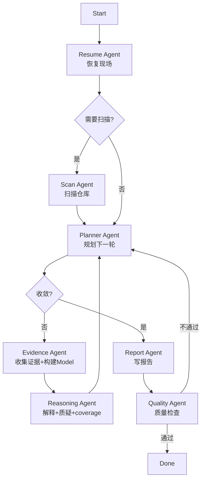

# Repository 研究

> 相关文档：[methodology.md](./methodology.md)（研究方法论） | [question-framework.md](./question-framework.md)（问题生成与管理） | [report-schema.md](./report-schema.md)（Repository Model + 报告规范）

## 目标

构建可复用的架构知识库（Repository Model）。Repository Model 捕获实体、关系及支撑证据。报告是 Repository Model 的视图。

## 架构：Orchestrator + Sub Agents

每个阶段由独立的 Sub Agent 执行，Orchestrator 只负责调度。各 Agent 只看自己的 prompt，不加载其他 Agent 的规则。



## Orchestrator 调度步骤

```
1. call resume-agent      → 恢复现场，判断是否需要扫描
2. if need scan: call scan-agent
3. loop:
     a. call planner-agent  → 判断收敛 or 生成下一轮问题
     b. if converged: break
     c. call evidence-agent → 读文件，写 evidence-log，更新 Repository Model
     d. call reasoning-agent → 架构解释，质疑模型，更新 coverage
4. call report-agent       → 从 Model + evidence 生成报告
5. call quality-agent      → 质量检查，不通过则回到 planner
```

## 工作目录

每次分析用同一个工作目录，放所有中间结果和最终报告。

```
.working/{repo-name}/
├── artifacts/               # 可复用的产物（代码没变时禁止重新生成）
│   ├── repository-profile.json  # 仓库类型、语言、文件统计、入口点
│   ├── directory-tree.json      # 完整目录结构（扁平路径列表）
│   ├── symbol-index.json        # 符号索引（函数、类、导出）
│   ├── git-summary.json         # Git 历史分析
│   └── evidence-log.jsonl       # 证据日志（append-only，每文件一行，含 key_findings）
├── context.json             # 执行上下文（允许修改，增量更新）
├── questions/               # 问题轮次（不可变历史）
│   ├── round-1.json         # 第一轮问题
│   ├── round-N.json         # 第 N 轮问题
│   └── summary.json         # 轮次索引
├── repository-model.json    # Repository Model（允许修改，增量更新）
├── report.md                # 最新报告（易变）
└── meta.json                # 元信息
```

## 文件所有权矩阵

每个 Agent 只读写自己负责的文件，禁止越界。

| 文件 | Resume | Scan | Planner | Evidence | Reasoning | Report | Quality |
|------|--------|------|---------|----------|-----------|--------|---------|
| `meta.json` | R | R+W | R | R | R | R+W | R |
| `context.json` | R+W | W(pending) | R+W | R+W | R+W | R+W | R |
| `artifacts/repository-profile.json` | R | R+W | R | R | — | — | — |
| `artifacts/directory-tree.json` | R | R+W | R | R | — | — | — |
| `artifacts/evidence-log.jsonl` | R | — | — | R+W | R | R | R |
| `repository-model.json` | R | — | — | R+W | R | R | R |
| `questions/round-N.json` | R | — | W(new only) | R | R | R | R |
| `questions/summary.json` | R | — | R+W | — | R+W | R | R |
| `report.md` | — | — | — | — | — | W | R |

> R = 只读, W = 可写, R+W = 读写, — = 不访问, W(pending) = 只写 pending 字段, W(new only) = 只能创建新文件

## 产物缓存策略

| 分类 | 产物 | 更新规则 |
|------|------|---------|
| **可复用** | artifacts/*.json | 代码没变时禁止重新生成 |
| **可复用+追加** | evidence-log.jsonl | append-only，禁止改写已有行 |
| **允许修改** | context.json, repository-model.json, summary.json | 首次创建后持久化，恢复时加载继续，增量更新 |
| **禁止修改** | round-N.json | 创建后永久冻结 |
| **每次重新生成** | report.md | 每次分析重新生成 |

## Agent 文件

| Agent | 文件 | 职责 |
|-------|------|------|
| Resume | [agents/resume.md](./agents/resume.md) | 恢复现场，判断代码变化，确定跳转位置 |
| Scan | [agents/scan.md](./agents/scan.md) | 扫描仓库，生成可复用产物 |
| Planner | [agents/planner.md](./agents/planner.md) | 判断收敛，生成下一轮问题 |
| Evidence | [agents/evidence.md](./agents/evidence.md) | 读文件收集证据，构建 Repository Model |
| Reasoning | [agents/reasoning.md](./agents/reasoning.md) | 架构解释，质疑模型，更新 coverage |
| Report | [agents/report.md](./agents/report.md) | 从 Model + evidence 生成报告 |
| Quality | [agents/quality.md](./agents/quality.md) | 质量检查，决定是否通过 |

## 成功标准

一份成功的研究应该让有经验的工程师能回答：

- 能用一句话说出系统的**架构中心**，且能回答"如果把这个中心去掉，系统还能跑吗？"
- 每个关键决策都能说出**至少一个被拒绝的替代方案**
- 报告的结论不是从源码"看"出来的，而是通过**提问 → 收集证据 → 质疑 → 修正**循环产生的
