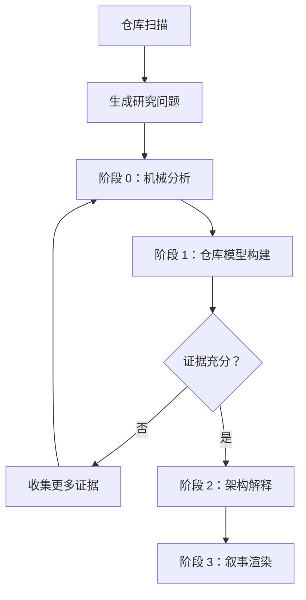
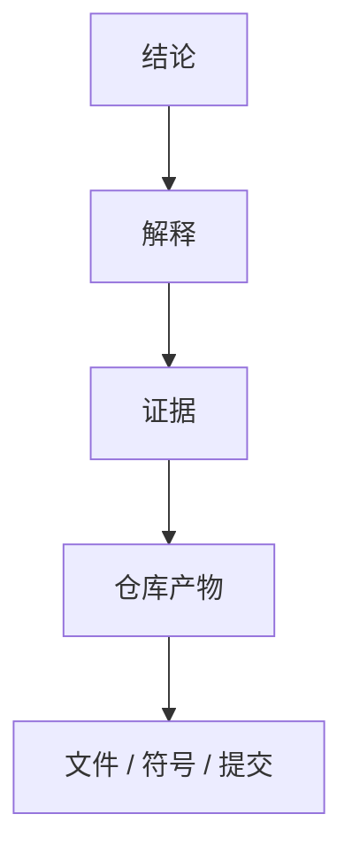

# Repository 研究

> 相关文档：[methodology.md](./methodology.md)（研究方法论与设计理由）| [report-schema.md](./report-schema.md)（输出规范与报告 Schema）

---

## 目标

研究目标**不是**总结代码，而是重建：

- 系统如何工作
- 为什么这样设计
- 哪些工程约束塑造了当前架构
- 做出了哪些架构决策
- 哪些思想可以迁移到其他系统

报告应帮助有经验的工程师达到原维护者级别的理解。

---

## 研究范围

**研究**：

- 架构与子系统边界
- 依赖结构与能力分解
- 工程哲学与设计约束
- 架构演进与重大权衡
- 可维护性与扩展机制
- 运行时模型与插件系统
- 公共 API 设计与测试策略
- 部署模型与配置模型
- 可复用的工程思想

**不研究**（属于其他专项 skill）：

- 安全审计 / 漏洞扫描
- 代码风格检查 / Lint / 格式化
- 许可证审查 / 依赖更新
- 性能基准测试 / Bug 修复 / 代码生成

---

## 研究输入

接受以下信息的任意子集：

- 源代码
- 文档 / ADR / RFC / README
- 配置 / 构建脚本
- 测试
- Git 历史
- 包元数据 / 指标

信息缺失时，优雅降级。

---

## 研究流程

### 阶段 0 — 机械分析

收集客观仓库证据：目录结构、依赖图、import 图、package 图、符号、公共 API、Git 历史、文档、配置、指标。

**禁止**在此阶段进行架构解释。

### 阶段 1 — 仓库模型构建（Repository Model Construction）

将机械证据转化为仓库模型。

构建以下 5 个维度（详见 [report-schema.md](./report-schema.md#仓库模型维度)）：

| 模型 | 描述 |
|------|------|
| **结构模型** | 模块、目录、组件及其边界 |
| **行为模型** | 控制流、数据流、运行流程 |
| **归属模型** | 状态、职责、生命周期归属 |
| **扩展模型** | 插件机制、扩展点、公共 API |
| **演进模型** | 架构演进与历史变化 |

**禁止**在此阶段推断架构意图。

### 阶段 2 — 架构解释（Architectural Interpretation）

基于仓库模型重建系统背后的工程思想。

产出以下类型（详见 [report-schema.md](./report-schema.md#阶段-2-输出类型)）：

- 工程约束
- 架构作用力
- 设计决策
- 权衡
- 有意省略
- 架构张力
- 杠杆点
- 维护者心智模型

**每个解释必须引用证据。**

如果存在多个合理解释，分别说明并给出各自证据与置信度。

### 阶段 3 — 叙事渲染（Narrative Rendering）

生成人类可读的研究报告。

**禁止**在此阶段执行推理。**禁止**发明新结论。

只将已验证的发现组织成连贯叙事。

---

## 研究问题

证据收集前，生成一组待回答的架构问题。

典型问题：

- 系统如何划分职责？
- 子系统边界如何定义？
- 数据如何流动？
- 控制流如何组织？
- 生命周期由谁管理？
- 可扩展能力如何实现？
- 哪些约束塑造了当前架构？
- 哪些复杂性被有意隐藏？
- 哪些能力属于公共 API，哪些属于内部实现？
- 哪些设计是刻意省略？

后续所有证据收集必须围绕这些问题展开。**禁止**机械阅读整个仓库。

---

## 阅读策略

按以下顺序建立仓库理解，**不要**直接阅读业务代码：

1. 仓库元数据
2. 构建系统
3. 入口点
4. 运行时初始化
5. 核心运行时
6. 公共 API
7. 扩展机制
8. 配置
9. 测试
10. Git 历史
11. 外部讨论（如可获取）

可根据仓库类型调整顺序。**始终**先建立整体模型，再深入具体实现。

---

## 证据规则

- **追溯**每个结论到证据。
- **禁止**无证据推断。
- **标记**无证据支持的声明为 Unknown。
- **优先**多个独立来源，而非单一来源。
- 冲突时**优先**高层级证据：测试 > 源码 > 配置 > 文档 > 提交 > 推断。

证据链格式（详见 [report-schema.md](./report-schema.md#证据链)）：

---

## 置信度

标注每个解释的置信度（详见 [report-schema.md](./report-schema.md#置信度等级)）：

| 等级 | 要求 |
|------|------|
| **高** | 多个独立证据来源相互支持 |
| **中** | 证据存在，但解释仍有不确定性 |
| **低** | 证据薄弱或仅间接推断 |

---

## 未解问题

记录无法验证的问题。**禁止**推测。**禁止**隐藏未知项。

每项必须包含（详见 [report-schema.md](./report-schema.md#未解问题格式)）：

- **问题** — 待回答的问题
- **缺失证据** — 缺失的证据类型
- **置信度影响** — 对整体置信度的影响
- **建议下一步调查** — 建议的下一步调查方向

---

## 架构不变量

识别被大多数子系统共同假设的架构不变量。

这些是整个系统共同依赖的基本假设。违反这些假设通常意味着需要重新设计整个系统。

典型示例：

- 单一事件循环
- 不可变对象模型
- 插件隔离边界
- 单向依赖关系
- 声明式配置模型

Report them.

---

## 质量门禁

报告完成前，验证以下问题：

- 系统如何工作？
- 系统如何组织？
- 为什么做出这些架构决策？
- 哪些工程约束影响了设计？
- 架构如何演进？
- 有意牺牲了什么？
- 维护者如何心智划分系统？
- 哪些思想在本仓库之外仍有价值？

**如果任一问题无法回答，研究尚未完成。**

---

## 输出

报告必须包含以下 17 个章节（详见 [report-schema.md](./report-schema.md#报告章节)）：

1. 执行摘要 Executive Summary
2. 仓库心智模型 Repository Mental Model
3. 架构不变量 Architectural Invariants
4. 工程约束 Engineering Constraints
5. 能力地图 Capability Map
6. 静态架构 Static Architecture
7. 运行时架构 Runtime Architecture
8. 架构演进 Evolution
9. 关键决策 Key Decisions
10. 架构作用力 Architectural Forces
11. 设计张力 Design Tensions
12. 架构杠杆 Architectural Leverage
13. 可复用模式 Reusable Patterns
14. 风险 Risks
15. 经验教训 Lessons Learned
16. 未解问题 Open Questions
17. 证据质量摘要 Evidence Quality Summary

---

## 成功标准 Success Criteria

一份成功的研究报告应让有经验的工程师能够回答：

- 这个仓库如何工作？
- 为什么这样设计？
- 我应该从中学到什么？
- 哪些思想值得复用？
- 哪些工程错误被有意避免？

**如果这些问题无法回答，研究尚未完成。**
