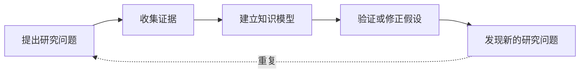
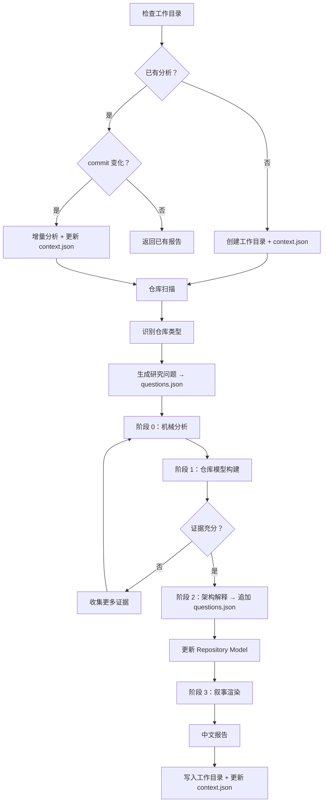

# 研究方法论（Methodology）

> 本文档记录 Repository Research 的设计理念与研究思想。**给人看，不给模型加载。** 解释"为什么这样设计"，而不是"怎么做"。

---

## 核心范式：Compile，而不是 Analyze

借鉴 Karpathy 的 LLM Wiki 思想，Repository Research 的核心范式是**编译（Compile）**，而非**分析（Analyze）**。

- **旧范式**：Repository → Research → Report（一次性）
- **新范式**：Repository → Compile → Repository Model → Render → Report

```
Raw Documents → Compile → Wiki → Query     (LLM Wiki)
Repository    → Compile → Model  → Render   (Repo Research)
```

真正重要的不是报告，而是 **Repository Model**。报告只是 Model 的一种视图。

---

## 核心原则

| 原则 | 理由 |
|------|------|
| **证据先于解释** | 收集证据前不得推断架构意图。所有结论必须源自可验证的仓库证据。 |
| **结构先于解释** | 必须先重建仓库结构，再进行架构解释。不直接从源码跳到结论，始终建立中间知识模型。 |
| **允许推理，禁止捏造** | 鼓励推理，但禁止捏造证据。每个非平凡陈述必须可追溯。 |
| **Model > Report** | Repository Model 是第一产物。Report 只是 Model 的 View。 |
| **自适应研究** | 不同类型的仓库关注点完全不同。研究问题应由仓库类型驱动，而非套用通用模板。 |

---

## 为什么 Repository Model 是第一产物

Karpathy LLM Wiki 最大的观点：**不要每次重新理解。**

- Repository Model 是核心产物，不是中间步骤。
- 报告从 Model 生成，而非直接从源码推断。
- Model 捕获实体、关系及支撑证据。

报告是一次性的视图。Repository Model 是架构知识库。

---

## 研究方法

Repository Research 是一个**迭代研究过程**，而不是线性的代码阅读过程。

研究从提出架构问题开始，通过针对性收集证据不断修正仓库知识模型，直到形成稳定且可验证的架构理解。

整个研究遵循以下循环：



只有当新的证据不再显著改变知识模型时，研究才认为达到稳定状态。

---

## 研究哲学

- **深度理解** 优于 **广泛覆盖**
- **已验证的结论** 优于 **有趣的推测**
- **工程推理** 优于 **架构 buzzword**
- **维护者意图** 优于 **模式匹配**

---

## 为什么采用四阶段流程

Repository Research 采用渐进式研究流程，而不是一次性 LLM 调用。原因：

1. **降低单次推理负担** — 每个阶段聚焦单一职责，避免 LLM 在一次调用中同时做事实提取和架构解释。
2. **可验证中间产物** — 每个阶段产出可检查的中间结果（证据 → 模型 → 解释 → 报告），便于回溯。
3. **职责不重叠** — 事实提取不做解释，解释不发明新事实，渲染不执行推理。



---

## 为什么证据优先

LLM 的核心风险是幻觉——在没有证据支持的情况下生成看似合理的解释。

证据优先原则要求：

- 所有结论必须追溯到仓库证据。
- 无证据的声明标记为未解问题，而非推测。
- 多个独立来源相互印证时，优先于单一来源。

这不是限制推理，而是限制**无依据的推理**。

---

## 为什么需要仓库模型

直接从源码跳到架构结论会丢失中间抽象。仓库模型是事实与解释之间的中间层：

- 它组织事实（模块、能力、关系、演进）。
- 它不解释设计原因。
- 它为后续的架构解释提供稳定基础。

没有这层中间抽象，LLM 容易从局部代码细节直接跳到全局架构判断，产生过度泛化。

---

## 为什么保留未解问题

仓库可能无法提供足够信息。未解问题不是研究失败，而是研究结果的合法组成部分。

主动分类未解问题的价值：

- 告诉读者下一步该做什么（需要更多代码 / 需要文档 / 需要外部信息）。
- 区分"仓库内可验证但未覆盖"与"即使深入阅读也无法验证"。
- 防止 LLM 为了给出答案而推测。

承认不知道比给出错误答案更有价值。

---

## 为什么识别仓库类型

不同类型的仓库关注点完全不同：

- 编译器关注 IR / 优化 / Pass
- 框架关注扩展点 / 生命周期 / Hook
- 数据库关注存储 / 事务 / 并发
- 运行时关注事件循环 / 调度 / 内存管理

如果对所有仓库套用同一套通用问题（"系统如何划分职责？数据如何流动？"），会产生正确但平庸的研究——每个仓库的报告都差不多，失去洞察价值。

识别仓库类型后，研究问题应由类型驱动：研究 Kubernetes 应问"Controller 如何实现最终一致性"，研究 Redis 应问"为什么单线程"，研究 SQLite 应问"为什么所有东西围绕 BTree"。

这就是**自适应研究（Adaptive Research）**——研究问题从仓库本身长出来，而非来自模板。

---

## 为什么需要批判性问题

发现问题（Discovery Questions）帮助建立模型，但模型可能错了。

批判性问题（Critical Questions）用于**验证**模型，而非建立模型：

- "如果移除这一组件，系统还能成立吗？" — 检验什么是核心，什么是偶然实现。
- "当前解释是否还能同时解释所有证据？" — 检验模型是否有反证。

科学研究都包含反证阶段。没有批判性验证的模型容易产生"看见模式就下结论"的倾向——LLM 特别容易从局部代码细节直接跳到全局架构判断。

完整的研究应包含三类问题：

| 类型 | 目的 | 时机 |
|------|------|------|
| 发现问题 | 建立模型 | 研究初期 |
| 批判性问题 | 推翻错误模型 | 模型初步稳定后 |
| 迁移问题 | 抽象可复用思想 | 研究后期 |

```
系统如何工作？  →  我的理解可能是错的吗？  →  什么可以泛化？
```

---

## 为什么记录意外发现

真正有研究价值的往往不是预期内的发现，而是**意外发现（Surprises）**：

- 整个仓库没有 Interface — 为什么？
- 整个仓库没有依赖注入 — 为什么？
- 所有状态都集中 — 为什么？

这些与预期不符的架构现象揭示了非显而易见的设计决策。它们比"有 Plugin System"这类预期内发现更有信息价值，因为它们指向维护者刻意做出的选择。

意外发现应显式记录，而非被淹没在常规分析中。

---

## 为什么需要工作目录

Repository Model 是第一产物，不是中间步骤。如果每次分析的产物散落在临时目录或仓库内部，Model 就退化成了中间变量——用完即弃，无法积累。

工作目录让 Repository Model 成为**持久资产**：

- `repository-model.json` 保存完整的知识图谱，下次分析时可以直接加载
- `evidence/` 保存证据快照，支持回溯验证
- `report.md` 保存最新报告，无需重新分析即可查看
- `meta.json` 记录分析元信息（commit hash、仓库类型、时间），支持增量判断

没有工作目录，每次研究都从零开始——这违背了"编译一次，复用多次"的核心理念。

---

## 为什么增量分析

Karpathy LLM Wiki 的核心观点：**不要每次重新理解。**

仓库更新时，大部分代码没有变化。全量分析会浪费资源重新理解已经稳定的部分，而且可能因为 LLM 的非确定性产生不一致的结论。

增量分析的原则：

- 只重新分析受 `git diff` 影响的 Model 部分
- 已有证据保留，不丢失历史理解
- 过时证据标记 `deprecated`，而非删除（保留演进轨迹）
- 新证据合并到已有 Model，而非替换

这让 Repository Model 能够随仓库演进而持续更新，而非每次重建。对于活跃维护的大型仓库，增量分析是唯一可行的长期研究方式。

---

## 为什么需要 context.json

执行过程本身也是研究产物。如果只保存最终报告和 Repository Model，执行过程就不可追溯——无法知道研究者读了哪些文件、在每一步做了什么、中间产出了什么。

context.json 的价值：

- **可恢复** — 分析中断后，可以从 `pipeline_stage` 和 `intermediate_results` 恢复，而非从头开始
- **可审计** — `referenced_files` 记录每个文件的读取目的，读者可以验证研究是否遗漏关键文件
- **可增量** — 增量分析时可以参考上次的文件列表，只读取变化的文件

`user_input` 原样保存禁止转义——用户的原始措辞可能包含关键上下文（如"重点关注安全"或"忽略前端"），任何转义都可能丢失这些信号。

---

## 为什么需要 questions.json

研究问题是动态演化的，不是一次生成后固定不变。如果问题只存在于内存中，分析中断就丢失了，读者也无法审计研究者问了哪些问题。

questions.json 的价值：

- **持久化** — 三类问题（发现/批判/迁移）分别保存，架构解释阶段产生的新问题追加而非丢弃
- **可审计** — 读者可以看到研究者问了哪些问题，判断研究是否充分
- **可演化** — 增量分析时可以加载已有问题，在此基础上追加新问题

架构解释阶段最容易产生新问题——解释越深，越可能发现需要进一步验证的假设。这些新问题必须追加到 questions.json，禁止仅保留在内存中。
