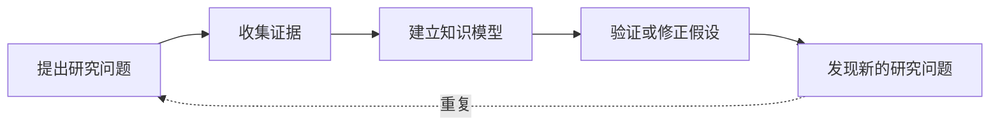
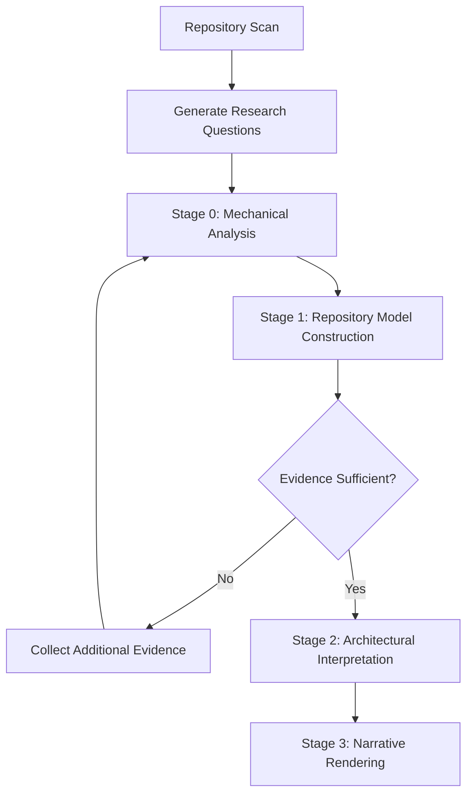

# 研究方法论（Methodology）

> 本文档记录 Repository Research 的设计理念与研究思想。**给人看，不给模型加载。** 解释"为什么这样设计"，而不是"怎么做"。

---

## 核心原则

| 原则 | 理由 |
|------|------|
| **证据先于解释** | 收集证据前不得推断架构意图。所有结论必须源自可验证的仓库证据。 |
| **结构先于解释** | 必须先重建仓库结构，再进行架构解释。不直接从源码跳到结论，始终建立中间知识模型。 |
| **允许推理，禁止捏造** | 鼓励推理，但禁止捏造证据。每个非平凡陈述必须可追溯。 |
| **研究是为了理解** | 目标是理解工程决策，不是生成文档、画图或总结 README。 |
| **报告只是渲染器** | 所有推理在报告生成前完成。报告不发明新结论，只组织已验证的发现。 |

---

## 研究方法（Research Method）

Repository Research 是一个**迭代研究过程（Iterative Research Process）**，而不是线性的代码阅读过程。

研究从提出架构问题开始，通过针对性收集证据不断修正仓库知识模型，直到形成稳定且可验证的架构理解。

整个研究遵循以下循环：

只有当新的证据不再显著改变知识模型时，研究才认为达到稳定状态。

研究过程中允许推理，但所有推理都必须能够追溯到可验证证据。

---

## 研究哲学

- **深度理解** 优于 **广泛覆盖**
- **已验证的结论** 优于 **有趣的推测**
- **工程推理** 优于 **架构 buzzword**
- **维护者意图** 优于 **模式匹配**

---

## 为什么采用四阶段 Pipeline

Repository Research 采用渐进式研究流程，而不是一次性 LLM 调用。原因：

1. **降低单次推理负担** — 每个 Stage 聚焦单一职责，避免 LLM 在一次调用中同时做事实提取和架构解释。
2. **可验证中间产物** — 每个 Stage 产出可检查的中间结果（证据 → 模型 → 解释 → 报告），便于回溯。
3. **职责不重叠** — 事实提取不做解释，解释不发明新事实，渲染不执行推理。

---

## 为什么 Evidence First

LLM 的核心风险是幻觉（Hallucination）——在没有证据支持的情况下生成看似合理的解释。

Evidence First 原则要求：

- 所有结论必须追溯到仓库证据。
- 无证据的声明标记为 Unknown，而非推测。
- 多个独立来源相互印证时，优先于单一来源。

这不是限制推理，而是限制**无依据的推理**。

---

## 为什么 Repository Model

直接从源码跳到架构结论会丢失中间抽象。Repository Model 是事实与解释之间的中间层：

- 它组织事实（模块、能力、关系、演进）。
- 它不解释设计原因。
- 它为后续的架构解释提供稳定基础。

没有这层中间抽象，LLM 容易从局部代码细节直接跳到全局架构判断，产生过度泛化。

---

## 为什么 Unknown

仓库可能无法提供足够信息。Unknown 不是研究失败，而是研究结果的合法组成部分。

主动分类 Unknown 的价值：

- 告诉读者下一步该做什么（Need More Code / Need Documentation / Need External Information）。
- 区分"仓库内可验证但未覆盖"与"即使深入阅读也无法验证"。
- 防止 LLM 为了给出答案而推测。

承认不知道比给出错误答案更有价值。
