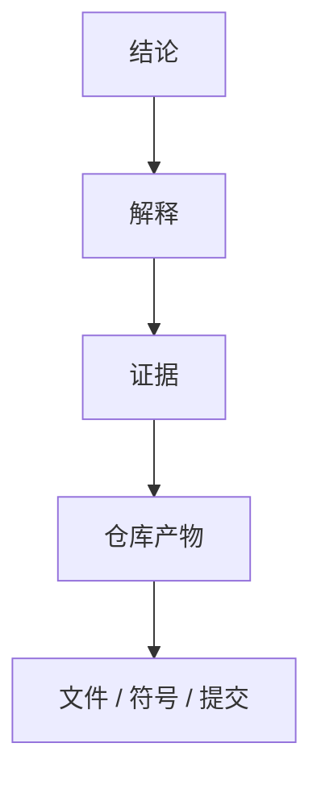

# 报告规范（Report Schema）

> 本文档定义 Repository Research 的输出契约。报告必须遵循此 Schema。

---

## Repository Model

Repository Model 是编译的第一产物，捕获实体、关系及支撑证据。

Model 必须描述以下 5 个维度：

| 模型 | 描述 |
|------|------|
| **结构模型** | 模块、目录、组件及其边界 |
| **行为模型** | 控制流、数据流、运行流程 |
| **归属模型** | 状态、职责、生命周期归属 |
| **扩展模型** | 插件机制、扩展点、公共 API |
| **演进模型** | 架构演进与历史变化 |

---

## 阶段 2 输出类型

阶段 2 的架构解释必须产出以下类型的内容：

- 工程约束
- 架构作用力
- 设计决策
- 权衡
- 有意省略
- 架构张力
- 杠杆点
- 维护者心智模型
- **意外发现** — 与预期不符的架构现象（如整个仓库没有 Interface、刻意省略常见模式）

如果存在多个合理解释，分别说明并给出各自证据与置信度。

---

## 证据链

每一个非平凡结论都必须能够追溯到证据链。**证据链是内部推理工具，不是输出模板——最终报告不需要把推理链展开成 Observation → Evidence → Interpretation → Alternative → Challenge → Conclusion 的六步结构。**



证据来源：

| 来源 | 说明 |
|---------|------|
| 源代码 | 实现层面的直接证据 |
| 文档 | README / ADR / RFC / 设计文档 |
| 配置 | 构建配置 / CI 配置 / 部署配置 |
| 测试 | 测试用例反映的预期行为 |
| Git 历史 | 提交历史反映的演进意图 |
| 仓库元数据 | package.json / Cargo.toml 等 |

多个独立来源相互印证时，优先于单一来源。

---

## Information Density 原则

**报告是给工程师读的，不是给审稿人读的。**

| 规则 | 说明 |
|------|------|
| **每节回答一个问题** | 如果一节不能回答"这解决了什么问题"，说明这节没有存在价值 |
| **综合结论优于推理链** | 呈现结论 + 简洁证据，不机械重复六步推理结构 |
| **Evidence Summary 只出现一次** | 同一结论的证据摘要只在首次出现时展示，后续引用只标注 id |
| **输出有上限** | 每节最多 5 个关键发现，每个决策 4 字段，每个质疑 4 行 |
| **禁止凑模板** | 如果没有实质性发现，不写该节，不为完整而硬写"无" |

---

## 置信度等级

每个解释必须标注置信度。置信度反映证据质量，而非模型确定性。

| 等级 | 要求 |
|------|------|
| **高** | 多个独立证据来源相互支持 |
| **中** | 证据存在，但解释仍有不确定性 |
| **低** | 证据薄弱或仅间接推断 |

---

## 未解问题格式

研究结束后仍可能存在无法验证的问题。每项必须包含：

| 字段 | 说明 |
|------|------|
| **问题** | 待回答的问题 |
| **优先级** | `High` / `Medium` / `Low` — High = 影响核心架构理解，Medium = 影响局部理解，Low = 好奇心驱动 |
| **缺失证据** | 缺失的证据类型 |
| **置信度影响** | 对整体置信度的影响 |
| **建议下一步调查** | 建议的下一步调查方向 |

> 优先级排序让下一轮 Agent Research 知道先查什么。High 优先级问题如果无法解决，应在报告中明确标注对结论置信度的影响。

---

## 报告信息维度

报告是 Repository Model 的视图。**报告必须覆盖以下信息维度，而不是必须使用固定章节。**

| 维度 | 要求 |
|------|------|
| **系统如何工作** | 必须解释系统的运行方式 |
| **为什么这样设计** | 必须解释设计背后的工程思想 |
| **关键约束与决策** | 必须说明驱动设计的约束和关键决策 |
| **可复用思想** | 必须指出可迁移到其他系统的模式或经验 |
| **意外发现** | 必须记录与预期不符的架构现象 |
| **证据质量与未解问题** | 必须标明证据质量和无法验证的问题 |

最终章节结构由渲染器根据仓库复杂度决定。

---

## 推荐结构

### 必需章节

以下章节必须出现（内容可合并到更高层级）：

1. **执行摘要** — 系统一句话定位 + 核心发现
2. **仓库心智模型** — 维护者如何心智划分系统
3. **架构** — 系统如何组织
4. **工程决策** — 为什么这样设计
5. **可复用知识** — 可迁移的思想

### 可选章节（有内容才出现）

以下章节仅在仓库有相关内容时出现。**禁止为了完整而硬写"无"。**

- **架构演进** — 重大重构或设计转向
- **架构不变量** — 系统共同依赖的基本假设
- **意外发现** — 与预期不符的架构现象
- **风险** — 潜在失败模式
- **未解问题** — 无法验证的问题
- **证据质量摘要** — 证据覆盖度与置信度分布

### 推荐层级

```text
1. 执行摘要

2. 仓库心智模型

3. 架构
   - 能力地图
   - 静态架构
   - 运行时架构

4. 工程决策
   - 工程约束
   - 架构作用力
   - 关键决策
   - 权衡

5. 架构演进（可选）

6. 可复用知识
   - 架构不变量（可选）
   - 可复用模式
   - 经验教训

7. 意外发现（可选）

8. 风险（可选）

9. 未解问题（可选）

10. 证据质量摘要（可选）
```

**原则**：既然报告只是视图，视图就不应该被固定目录绑死，而应该由 Repository Model 自然组织出来。
