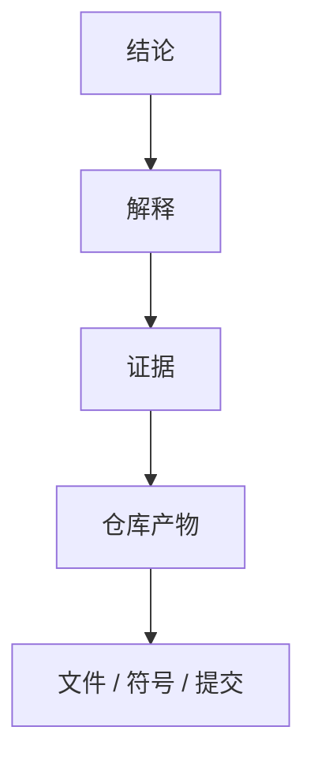

# 报告规范（Report Schema）

> 本文档定义 Repository Research 的输出契约。报告必须遵循此 Schema。

---

## 证据链

每一个非平凡结论都必须能够追溯到证据链。

证据来源：

| 来源 | 说明 |
|---------|------|
| 源代码 | 实现层面的直接证据 |
| 文档 | README / ADR / RFC / 设计文档 |
| 配置 | 构建配置 / CI 配置 / 部署配置 |
| 测试 | 测试用例反映的预期行为 |
| Git 历史 | 提交历史反映的演进意图 |
| 仓库元数据 | package.json / Cargo.toml 等 |

多个独立来源相互印证时，优先于单一来源。

---

## 置信度等级

每个解释必须标注置信度。置信度反映证据质量，而非模型确定性。

| 等级 | 要求 |
|------|------|
| **高** | 多个独立证据来源相互支持 |
| **中** | 证据存在，但解释仍有不确定性 |
| **低** | 证据薄弱或仅间接推断 |

---

## 未解问题格式

研究结束后仍可能存在无法验证的问题。每项必须包含：

| 字段 | 说明 |
|------|------|
| **问题** | 待回答的问题 |
| **缺失证据** | 缺失的证据类型 |
| **置信度影响** | 对整体置信度的影响 |
| **建议下一步调查** | 建议的下一步调查方向 |

---

## 报告章节

最终报告必须包含以下 17 个章节：

| # | 章节 | 说明 |
|---|------|------|
| 1 | **执行摘要** | 执行摘要 |
| 2 | **仓库心智模型** | 维护者心智模型 |
| 3 | **架构不变量** | 架构不变量 |
| 4 | **工程约束** | 工程约束 |
| 5 | **能力地图** | 能力地图 |
| 6 | **静态架构** | 静态架构 |
| 7 | **运行时架构** | 运行时架构 |
| 8 | **架构演进** | 架构演进 |
| 9 | **关键决策** | 关键决策 |
| 10 | **架构作用力** | 架构作用力 |
| 11 | **设计张力** | 设计张力 |
| 12 | **架构杠杆** | 架构杠杆点 |
| 13 | **可复用模式** | 可复用模式 |
| 14 | **风险** | 风险 |
| 15 | **经验教训** | 经验教训 |
| 16 | **未解问题** | 未解问题 |
| 17 | **证据质量摘要** | 证据质量摘要 |

---

## 仓库模型维度

阶段 1 产出的仓库模型必须描述以下 5 个维度：

| 模型 | 描述 |
|------|------|
| **结构模型** | 模块、目录、组件及其边界 |
| **行为模型** | 控制流、数据流、运行流程 |
| **归属模型** | 状态、职责、生命周期归属 |
| **扩展模型** | 插件机制、扩展点、公共 API |
| **演进模型** | 架构演进与历史变化 |

---

## 阶段 2 输出类型

阶段 2 的架构解释必须产出以下类型的内容：

- 工程约束
- 架构作用力
- 设计决策
- 权衡
- 有意省略
- 架构张力
- 杠杆点
- 维护者心智模型

如果存在多个合理解释，分别说明并给出各自证据与置信度。
