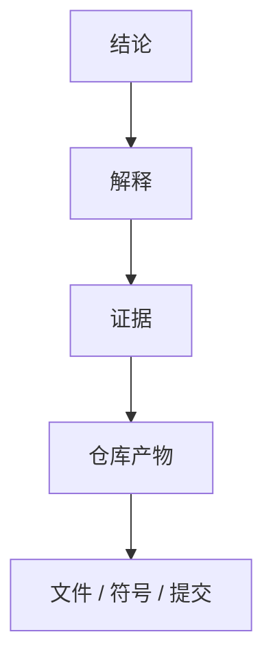

# 报告规范（Report Schema）

> 本文档定义 Repository Research 的输出契约。报告必须遵循此 Schema。

---

## Repository Model

Repository Model 是编译的第一产物，捕获实体、关系及支撑证据。

Model 必须描述以下 5 个维度：

| 模型 | 描述 |
|------|------|
| **结构模型** | 模块、目录、组件及其边界 |
| **行为模型** | 控制流、数据流、运行流程 |
| **归属模型** | 状态、职责、生命周期归属 |
| **扩展模型** | 插件机制、扩展点、公共 API |
| **演进模型** | 架构演进与历史变化 |

---

## 阶段 2 输出类型

阶段 2 的架构解释必须产出以下类型的内容：

- 工程约束
- 架构作用力
- 设计决策
- 权衡
- 有意省略
- 架构张力
- 杠杆点
- 维护者心智模型
- **意外发现** — 与预期不符的架构现象（如整个仓库没有 Interface、刻意省略常见模式）

如果存在多个合理解释，分别说明并给出各自证据与置信度。

---

## 证据链

每一个非平凡结论都必须能够追溯到证据链。**证据链是内部推理工具，不是输出模板——最终报告不需要把推理链展开成 Observation → Evidence → Interpretation → Alternative → Challenge → Conclusion 的六步结构。**



证据来源：

| 来源 | 说明 |
|---------|------|
| 源代码 | 实现层面的直接证据 |
| 文档 | README / ADR / RFC / 设计文档 |
| 配置 | 构建配置 / CI 配置 / 部署配置 |
| 测试 | 测试用例反映的预期行为 |
| Git 历史 | 提交历史反映的演进意图 |
| 仓库元数据 | package.json / Cargo.toml 等 |

多个独立来源相互印证时，优先于单一来源。

---

## Information Density 原则

**报告是给工程师读的，不是给审稿人读的。**

| 规则 | 说明 |
|------|------|
| **每节回答一个问题** | 如果一节不能回答"这解决了什么问题"，说明这节没有存在价值 |
| **综合结论优于推理链** | 呈现结论 + 简洁证据，不机械重复六步推理结构 |
| **Evidence Summary 只出现一次** | 同一结论的证据摘要只在首次出现时展示，后续引用只标注 id |
| **输出有上限** | 每节最多 5 个关键发现，每个决策 4 字段，每个质疑 4 行 |
| **禁止凑模板** | 如果没有实质性发现，不写该节，不为完整而硬写"无" |

---

## Neutrality 原则（最高优先级）

**研究是 evidence-based，不是 value judgment。报告禁止替 maintainer 做价值判断。**

### 禁止的绝对化措辞

| 禁止 | 改为 | 理由 |
|------|------|------|
| "不可能提供" | "当前抽象层无法覆盖" / "作者认为不适合承担" | 没人知道未来演进 |
| "永远" （用于结论） | "可跨 X/Y/Z 续完"（具体维度） | 结论不应绝对化 |
| "deliberate trade-off" （作为结论） | "maintainer 注释称 deliberate trade-off，但无法证实是永久决策" | 证据只能推出 "目前无拆分计划"，不能推出 "永远不拆" |
| "必须" （用于 maintainer 意图） | "代码注释表明" / "当前实现要求" | 不要替 maintainer 表态 |
| "唯一入口" | "主要入口" | 除非有穷举证据 |

### 证据范围约束

**证据只能推出其支持范围内的结论。**

| 证据 | 能推出 | 不能推出 |
|------|--------|---------|
| 无 TODO/FIXME 标记 | 目前没有拆分计划 | maintainer 有意识决定永远不拆 |
| 代码注释说 "deliberate" | maintainer 称之为 deliberate | 是永久决策（可能是事后合理化） |
| 某抽象层不存在某功能 | 当前版本无法覆盖 | 未来版本不可能覆盖 |

### 保留的 "必须/永远"

**invariant 描述中的 "必须/永远" 保留**——这些是描述硬约束（代码契约），不是 maintainer 意图结论。

例：`history 里永远不留 orphan tool_calls` 是 invariant，保留。
例：`maintainer 永远不会拆 SessionManager` 是结论，禁止。

---

## Evidence / Inference / Confidence 分离

**核心结论必须显式分离三部分**，让 reviewer 能区分代码事实与研究推断。

### 格式

```
Evidence:    <代码事实 + evidence id>
Inference:   <研究推断>
Confidence:  <高/中/低>（<理由>）
```

### 示例

```
Evidence:    resume() 重放 trailing tool_calls (ev-016) + Inbox (session_id, tool_call_id) idempotent (ev-025) + SessionManager.deliver_to_session 重建 engine (ev-030)
Inference:   三层分别解决 restart / surface / session lifecycle 三个维度的 resumability
Confidence:  高（test_durable_resume.py 验证 + 三层各自有独立证据）
```

### 区分原则

| 类型 | 定义 | 标识 |
|------|------|------|
| **Evidence** | 代码/测试/配置中可直接读到的事实 | 引用 evidence id 或文件路径 |
| **Inference** | 从证据推出的研究推断 | 明确标注为 "推断" |
| **Confidence** | 证据质量评估（非模型确定性） | 高/中/低 + 理由 |

**禁止**把 Inference 包装为 Evidence。**禁止**把 maintainer 注释的 "deliberate" 当作 Evidence 证明永久决策。

---

## 术语 Neutral 化

**禁止拟人化比喻。研究报告使用 neutral 术语，不使用器官/生物比喻。**

| 禁止 | 改为 |
|------|------|
| 心脏 / 大脑 / 神经系统 / 骨架 / 心跳 | Core Runtime / Coordinator / Human Interaction Layer / Desktop Shell / Scheduling Layer |
| "系统的中枢神经" | "核心调度层" |

**理由**：拟人化比喻是研究者创造的，不是 maintainer 的 terminology。blog 可以用，research 不行。

---

## Architecture vs Runtime 分离

**Architecture 和 Runtime 是两个不同的问题，必须分开回答。**

| 维度 | 回答的问题 | 内容 |
|------|-----------|------|
| **Architecture** | 有哪些 subsystem / 谁依赖谁 / 边界在哪 | 能力地图、静态分层、子系统边界、依赖关系 |
| **Runtime** | 一次 request 怎么走 | Agent Turn 主循环、Permission Chain 流程、Durable Resume 流程 |

**禁止**把 Runtime execution 流程（如 Permission End-to-Chain）放在 Architecture 章节。Runtime 流程属于独立的 Runtime Execution 章节。

---

## Coverage 可计算化

**Coverage 分数必须可计算，禁止主观打分。**

### 格式

| 维度 | 禁止格式 | 改为 |
|------|---------|------|
| runtime | 0.85 | 17/20 questions answered = 85% |
| architecture | 0.95 | 19/20 questions answered = 95% |

### 规则

- `answered` = 该维度问题中已回答（有证据支撑）的数量
- `total` = 该维度问题总数
- `ratio` = answered / total
- 如果某维度无问题，coverage = N/A（非 0）

**禁止**使用 0.85 这种无法追溯的分数——reviewer 必须能验证为什么是 17/20 而不是 18/20。

---

## Git History 分析指导

**Git History 是最容易提高报告质量的地方，但必须正确处理 bulk-import 情况。**

### 检测 bulk-import

```
git log --all --oneline --format="%ad %h %s" --date=short | tail -5
```

如果首个 commit 是 "initial import" / "initial commit" 且包含完整架构 → bulk-import，演进发生在 import 前的私有仓库。

### bulk-import 情况

- **git history 无法用于验证演进时间线**——明确标注此限制
- **从代码注释推断演进事件**：搜索 "replace the old"、"was a hand-written"、"when X became the second"、"no longer" 等注释
- **history coverage 受限于仓库特性**，非分析不足——如实标注
- **import 后的迭代时间线**：分析 import 后的 commit，证实架构稳定性

### 正常 git history 情况

- 分析关键文件首次引入时间（TurnEngine / SessionManager / Inbox 等）
- 用 commit message 解释 "为什么会演变成今天这样"
- history coverage 基于 git log 分析深度

---

## 置信度等级

每个解释必须标注置信度。置信度反映证据质量，而非模型确定性。

| 等级 | 要求 |
|------|------|
| **高** | 多个独立证据来源相互支持 |
| **中** | 证据存在，但解释仍有不确定性 |
| **低** | 证据薄弱或仅间接推断 |

---

## 未解问题格式

研究结束后仍可能存在无法验证的问题。每项必须包含：

| 字段 | 说明 |
|------|------|
| **问题** | 待回答的问题 |
| **优先级** | `High` / `Medium` / `Low` — High = 影响核心架构理解，Medium = 影响局部理解，Low = 好奇心驱动 |
| **缺失证据** | 缺失的证据类型 |
| **置信度影响** | 对整体置信度的影响 |
| **建议下一步调查** | 建议的下一步调查方向 |

> 优先级排序让下一轮 Agent Research 知道先查什么。High 优先级问题如果无法解决，应在报告中明确标注对结论置信度的影响。

---

## 报告信息维度

报告是 Repository Model 的视图。**报告必须覆盖以下信息维度，而不是必须使用固定章节。**

| 维度 | 要求 |
|------|------|
| **系统如何工作** | 必须解释系统的运行方式 |
| **为什么这样设计** | 必须解释设计背后的工程思想 |
| **关键约束与决策** | 必须说明驱动设计的约束和关键决策 |
| **可复用思想** | 必须指出可迁移到其他系统的模式或经验 |
| **意外发现** | 必须记录与预期不符的架构现象 |
| **证据质量与未解问题** | 必须标明证据质量和无法验证的问题 |

最终章节结构由渲染器根据仓库复杂度决定。

---

## 推荐结构

### 必需章节

以下章节必须出现（内容可合并到更高层级）：

1. **执行摘要** — 系统一句话定位 + 核心发现
2. **仓库心智模型** — 维护者如何心智划分系统
3. **架构** — 系统如何组织（subsystem / 依赖 / 边界）
4. **工程决策** — 为什么这样设计
5. **可复用知识** — 可迁移的思想
6. **Architecture Risk Analysis（Blast Radius）** — 改哪里会炸哪里
7. **Change Difficulty** — 哪些改动容易、哪些危险

### 可选章节（有内容才出现）

以下章节仅在仓库有相关内容时出现。**禁止为了完整而硬写"无"。**

- **架构演进** — 重大重构或设计转向（bulk-import 情况下从代码注释推断）
- **架构不变量** — 系统共同依赖的基本假设
- **意外发现** — 与预期不符的架构现象
- **Design Smells** — Maintainer 刻意接受的 smell（区分 deliberate smell vs 技术债）
- **风险** — 潜在失败模式
- **未解问题** — 无法验证的问题
- **证据质量摘要** — 证据覆盖度与置信度分布

### 推荐层级

```text
1. 执行摘要

2. 仓库心智模型

3. 架构
   - 能力地图
   - 静态架构（subsystem / 依赖 / 边界）
   - 运行时架构（一次 request 怎么走）

4. 工程决策
   - 工程约束
   - 架构作用力
   - 关键决策
   - 权衡（含替代方案对比）

5. 架构演进（可选）

6. 可复用知识
   - 架构不变量（可选）
   - 可复用模式
   - 经验教训

7. Architecture Risk Analysis（Blast Radius）     ← 必需
   - 修改点 → 影响范围 → 风险等级
   - 改动危险等级速查

8. Change Difficulty                              ← 必需
   - 修改难度表（修改 / 难度 / 理由）

9. Design Smells（可选）
   - Deliberate smell vs 技术债

10. 意外发现（可选）

11. 风险（可选）

12. 未解问题（可选）

13. 证据质量摘要（可选）
```

### Architecture Risk Analysis（Blast Radius）格式

```markdown
| 修改点 | 影响范围 | 风险等级 | 理由 |
|--------|---------|---------|------|
| <组件> | <受影响的子系统/invariant> | Critical/High/Medium/Low | <为何危险> |
```

风险等级标准：
- **Critical**：改这里 = 改架构中心，多个 invariant 同时依赖
- **High**：改这里 = 破坏多个 invariant
- **Medium**：改这里 = 影响单子系统
- **Low**：改这里 = mostly data migration

### Change Difficulty 格式

```markdown
| 修改 | 难度 | 理由 |
|------|------|------|
| 新增 X | Very Low / Low / Medium / High / Very High | <为何这个难度> |
```

难度标准：
- **Very Low**：data-driven，mostly data
- **Low**：ABC 已稳定，plug-in 式
- **Medium**：多层契约需同步
- **High**：多个 shared state + 职责耦合
- **Very High**：多个 invariant 同时依赖

### Design Smells 格式（可选）

```markdown
| Smell | 类型 | 证据 |
|-------|------|------|
| God Object | Deliberate / 技术债 | <证据> |
```

**必须区分**：
- **Deliberate smell**：maintainer 刻意接受（有注释说明，无 TODO/FIXME）——但无法证实是永久决策
- **技术债**：有 TODO/FIXME/注释承认需重构

**原则**：既然报告只是视图，视图就不应该被固定目录绑死，而应该由 Repository Model 自然组织出来。
