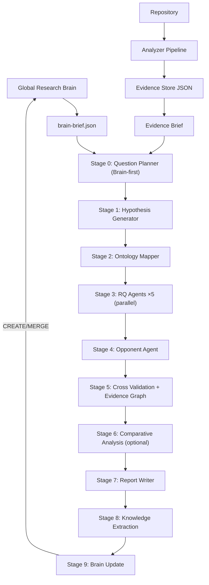

# DESIGN.md — research-repo 设计文档

> 本文档记录 research-repo 的架构设计、Pipeline 实现、Evidence Store 结构和设计决策理由。SKILL.md 只描述研究方法论（What/Why/Principles），本文档描述框架实现（How）。

---

## 1. 脚本层与 LLM 层分离

**决策**：脚本层只做确定性事实（AST、符号、图、文件树、git 历史）；LLM 层做解释与综合（架构意味着什么、为什么这样设计、工程权衡）。

**理由**：
- LLM 从不做脚本能做的事。脚本产出的符号索引、centrality 分数是确定性的，LLM 重复计算只会引入幻觉。
- 分阶段降低单次上下文压力：每个 subagent 只聚焦一个领域，输出可以被下一阶段验证和引用。
- 可追踪：每个产物都有明确输入 prompt 和输出文件，便于复核。

---

## 2. 动态 Research Question Planner

**决策**：根据证据动态生成适合特定仓库的 Research Question，不使用固定模板。

**理由**：
- 不同项目应该产生不同的问题。OpenAI Agents SDK 应该问"为什么 Runner 是核心"，DuckDB 应该问"为什么不用 Volcano"。
- 固定模板（Architecture / LLM / Tool / Context / Evolution）会导致所有仓库的研究报告千篇一律，失去洞察价值。
- 5 维打分（Impact/Novelty/Evidence Rich/Transferable/Controversial）确保问题值得研究——Controversial=1 的问题没有争议，Evidence Rich=1 的问题无法验证，都不值得研究。

---

## 3. Bayesian Hypothesis

**决策**：假设包含置信度演进历史（Prior → Posterior），而非一次性判断。

**理由**：
- 整个研究过程不断更新 belief，而不是一开始就下结论。这更接近真实的研究方法论。
- 置信度演进历史让读者看到"哪些证据真正改变了判断"，而不仅仅是最终结论。

**Competing Hypothesis**：
- 为每个主假设提出一个最可能的竞争假设——对同一组证据的另一种合理解释。
- Opponent Agent 将攻击主假设并尝试支持竞争假设。只有主假设的置信度远高于竞争假设时，结论才稳定。
- 这避免了"确认偏误"——研究者倾向于只找支持自己假设的证据。

---

## 4. Behavior Ontology

**决策**：Ontology 不只是静态对象（Component/Interface/Tool），还包含行为图（Execution Graph）和决策层（Decision Ontology）。

**理由**：
- 静态对象列表只回答"有什么"，不回答"怎么工作"。Execution Graph 回答"怎么工作"：Tool EXECUTES Workflow → Workflow EMITS Event → Event TRIGGERS Prompt → Prompt CALLS LLM。
- Palantir Ontology 真正强大的不仅是静态对象和行为图，还包括决策层。Decision JUSTIFIES Module——决策证明模块存在。Policy CONSTRAINS Component——策略约束组件。
- 决策关系动词（JUSTIFIES/SUPPORTS/PROVES/ANSWERS/CONSTRAINS）让 Evidence Graph 能连接不同层次的实体。

---

## 5. Opponent Agent

**决策**：新增反证者角色，对每个 Finding 进行攻击（寻找直接矛盾、测试反例、替代解释、缺失证据）。

**理由**：
- Proposer → Opponent → Judge 比 Reviewer Alone 更稳定。单一角色容易确认偏误。
- Opponent 的职责不是"审查"，而是"证明 Finding 是错的"。这种对抗性设置迫使 Finding 经受真正的压力测试。
- 如果 Opponent 找不到反例，Finding 的置信度才真正可靠。

---

## 6. Evidence Graph

**决策**：Cross Validation 构建统一证据关系图：Evidence → supports → Finding → answers → RQ → validates → Hypothesis → produces → Resolution。

**理由**：
- Report Writer 查询 Evidence Graph 而非读所有 Markdown。这降低了上下文压力，也避免了 Report Writer 重新解释证据。
- 读者可以从 Resolution 追溯回 Evidence，也可以从 Evidence 查找它支持的所有 Finding。双向可追溯。

---

## 7. Research Trace 格式

**决策**：Report 不再是 Question → Conclusion，而是 Question → Investigation → Turning Point → Resolution，记录调查过程而非只写结论。

**理由**：
- 真正好的研究不是证明自己，而是改变自己。记录"最初认为 → 发现相反证据 → 改变信念"的过程，比只写最终结论更有价值。
- Turning Point 是改变理解的关键证据——读者最想知道的是"什么证据让研究者改变了想法"。
- 这也让读者判断研究过程的严谨性——如果没有 Turning Point，说明研究者可能只是在找支持自己假设的证据。

---

## 8. Importance 与 Confidence 分离

**决策**：Finding 结构增加 Importance 字段（Critical/High/Medium/Low），与 Confidence 独立。

**理由**：
- README 可能 High Confidence 但 Importance 低（README 的存在是确定的，但对理解架构不重要）。
- "Planner 为什么存在" 可能 Confidence Medium 但 Importance Critical（证据不够强，但这个问题对理解系统至关重要）。
- 混淆两者会导致报告要么只覆盖高置信度的琐碎事实，要么只覆盖低置信度的重要问题。分离后，读者可以同时看到"多确定"和"多重要"。

---

## 9. Decision-centric Report

**决策**：报告是 Decision Report，不是 Architecture Report。新增 Engineering Decisions 章节。

**理由**：
- Palantir Research 的核心是 Decision Report。架构只是决策的产物，决策才是值得学习的。
- 可复用 Pattern 直接来自 Decision，而不是 Finding。Decision 包含 Why/Tradeoff/Alternative/Learning，比 Finding 更适合迁移。
- 读报告的工程师最想知道"为什么这样设计"，而不是"架构是什么"。

---

## 10. Architecture Fitness

**决策**：报告新增 Architecture Fitness 章节，按 Modularity/Extensibility/Testability/Observability/Evolution/Performance/Developer Experience 7 维评分。

**理由**：
- Neal Ford 的 Architecture Fitness Function 思想：架构不是一次性设计，而是持续满足设计目标。
- 比 Smell 更高级——Smell 只回答"有没有代码味道"，Fitness 回答"架构是否持续满足设计目标"。
- 7 维评分让读者快速判断架构的健康状况，而不用读完整个报告。

---

## 11. Architecture Compression

**决策**：报告新增 Architecture Compression 章节，500/200/50 字三级摘要。

**理由**：
- "如果压缩不了，说明其实没有理解"——迫使作者提炼核心架构，而不是堆砌细节。
- 500 字给快速浏览的读者，200 字给扫一眼的读者，50 字给只看标题的读者。不同读者在不同时间预算下都能获得价值。

---

## 12. What NOT to Learn

**决策**：报告新增 What NOT to Learn 章节，明确区分"值得学"和"不要抄"。

**理由**：
- 很多项目真正值得学的只有 10%，其它是历史包袱、临时方案或特定上下文的产物。
- 如果不明确区分，读者容易把历史包袱当作"最佳实践"复制到自己的项目中。
- "不值得复制"的内容往往比"值得学习"的内容更有信息价值——它告诉读者"这条路不要走"。

---

## 13. Anti-Fabrication Constraints

**决策**：Report Writer 遵循 7 条反伪造约束（ID 完整性 / 置信度逐字引用 / 状态不得反转 / 数字完整性 / 内容不得伪造 / 先引用再批判 / 矛盾双向检查）。

**理由**：
- 历史审计发现 LLM 会系统性地伪造 Finding 引用——发明 ID、篡改置信度、翻转 verified 状态、甚至颠倒 Finding 内容。
- 这些伪造行为对读者最有害——读者信任报告中的引用，如果引用是假的，整个报告的可信度崩溃。
- 7 条约束是针对历史审计中发现的具体伪造模式设计的，每条约束解决一类问题。

---

## 14. 模块化拆分

**决策**：将 10000+ 行的 `research-repo.mjs` 拆分为 12 个聚焦模块。

**理由**：
- 单文件 449KB 不可维护——任何修改都需要在 10000 行中定位。
- 按职责拆分（config / utils / context / base-analyzer / analyzers-fact / analyzers-inference / evidence-store / research-engine / report-generator / pipeline / CLI）让每个文件聚焦一个领域。
- ES module 的 import/export 让依赖关系显式化，避免隐式全局状态。

---

## 15. 静态 Prompt 模板

**决策**：Prompt 模板为 `prompts/` 目录下的静态 markdown 文件，不再用 JS 脚本生成。

**理由**：
- Prompt 模板本质是静态文本，变量只有 `repoName` 和 `questionIndex`。用 JS 包装只增加间接性。
- 修改 prompt 现在直接编辑 markdown，不需要改 JS 代码。
- 主 Agent 读取模板 → 内存替换占位符 → 派发，无需 `subagent-prompts` CLI 命令。

---

## 16. 三层架构（Repository Memory / Global Knowledge / Research Brain）

**决策**：从"仓库中心"升级为"知识中心"三层架构。

```
Layer 1: Repository Memory（局部）  — evidence + report（per-repo，已有）
Layer 2: Global Knowledge（共享）   — patterns/decisions/tradeoffs/anti-patterns/ontology（新增）
Layer 3: Research Brain（大脑）      — 查询 + Concept Graph（新增）
```

**理由**：
- 原设计：Repository → Evidence → Report。Knowledge 随报告结束而结束。
- 新设计：Repository → Evidence → Knowledge Extraction → Global Brain → Report。Report 是副产品，Knowledge 是真正产品。
- 研究第 30 个仓库时，系统不再是"重新分析一个仓库"，而是回答：这个仓库与已有知识相比，有哪些相同与不同？它为知识库贡献了什么？
- Brain 存储抽象（Pattern/Decision/Tradeoff），不存代码。`Planner-Executor Separation` 比 `runner.py:L203` 有价值得多。

---

## 17. Knowledge Unit Schema

**决策**：知识以 JSON 对象（Knowledge Unit）存储，不以 Markdown 存储。

```json
{
  "id": "pattern.planner-executor",
  "type": "pattern",
  "title": "Planner Executor Separation",
  "description": "Planning and execution are isolated into separate components.",
  "evidence": ["openai-agents", "langgraph", "autogen"],
  "confidence": 0.96,
  "tradeoffs": ["+ 清晰的关注点分离", "- 需要额外协调层"],
  "counterExamples": ["aider"],
  "observedIn": ["openai-agents", "langgraph", "autogen"],
  "tags": ["architecture", "agent-harness"]
}
```

**理由**：
- JSON 可被程序查询、合并、版本化；Markdown 只能被人读。
- Confidence 随多仓库观察自然增长（diminishing returns）：`new = old + increment * (1 - old)`。
- 五种类型：`pattern`（架构模式）/ `decision`（工程决策）/ `tradeoff`（权衡）/ `anti-pattern`（反模式）/ `term`（术语）。
- 每种类型独立子目录，便于按类型查询。

---

## 18. Brain Update Pipeline（Stage 8-9）

**决策**：在 Stage 7（Report）之后新增两个 Stage。

| Stage | Prompt | 输出 | 任务 |
|-------|--------|------|------|
| 8 | `prompts/08-knowledge-extraction.md` | `knowledge-units.json` | 从报告提取可复用知识单元 |
| 9 | `prompts/09-brain-update.md` | `brain-update-report.md` | 审核提取结果，与 Brain 比对，产出 CREATE/MERGE/REJECT 计划 |

**理由**：
- Stage 8 是 LLM 语义工作：阅读报告，识别哪些是可迁移的抽象（不是代码细节）。
- Stage 9 是知识库管理：保守优先，REJECT 永远比 CREATE 安全。错误的更新会污染整个知识库。
- Concept Graph 在 Stage 8 提取，Stage 9 去重后写入 Brain。

**Confidence 演进规则**：
- CREATE：初始 0.5-0.6（单一证据源）
- MERGE：`new_confidence = old_confidence + 0.05 * (1 - old_confidence)`（diminishing returns）
- 不手动设置高置信度——置信度通过多仓库观察自然增长

---

## 19. Brain-first Question Planning

**决策**：Stage 0（Question Planner）在生成问题前，先读取 Brain Brief。

```
Brain → brain-brief.json → Stage 0 (Brain Diff → Novelty Detection → Questions)
```

**理由**：
- 如果 Brain 已知 Planner-Executor 模式（3+ repos 验证），不应该问"这个项目有 Planner 吗？"，应该问"这个项目的 Planner 与 LangGraph 的有何不同？"
- 新颖性检测三种模式：
  1. **Known Patterns Present** — Brain 已知，此仓库也可能使用 → 作为假设基础，不作为研究问题
  2. **Potential Novelty** — Brain 未知的新信号 → 高价值研究问题候选
  3. **Potential Contradictions** — 与 Brain 已知矛盾 → 最高价值研究问题
- Novelty 维度加入 5 维打分：Novelty=1（Brain 已有完整答案）的问题直接淘汰。
- 首次研究（Brain 为空）时跳过 Brain Diff，按常规流程生成问题。

---

## 20. Knowledge Architecture Principles（平台原则，非 Skill 原则）

**决策**：Knowledge-Centric 和 Brain-first 是平台层原则，不属于 Repository Research Methodology（SKILL.md）。

**理由**：
- SKILL.md 描述的是"研究一个仓库"的方法论——它应该不知道全局知识库的存在。
- Knowledge Base / Brain / Concept Graph 是**平台实现**，今天可能是 JSON 文件，明天可能是 Neo4j 或 Palantir Ontology。如果 Skill 绑定这些概念，平台演进时 Skill 必须跟着改。
- Skill 只需说"Reuse prior validated knowledge when available"——不关心知识来自哪里、如何存储。
- 平台原则属于 DESIGN.md，因为它们是框架设计决策，不是研究方法论。

### 平台原则（仅在此处记录，不在 SKILL.md 中出现）

**Knowledge-Centric**（平台原则）：
- Repository 只是 Evidence，Knowledge 才是真正产品。
- 每次研究的价值不只在于报告，更在于它为全局知识库贡献了哪些可迁移的抽象（模式、决策、权衡、反模式）。
- 研究第 30 个仓库时，系统不再是"重新分析一个仓库"，而是回答：这个仓库与已有知识相比，有哪些相同与不同？它为知识库贡献了什么？

**Brain-first**（平台原则）：
- 研究从已有知识开始，不从零开始。
- 研究问题应聚焦于新颖性——这个仓库与已有知识相比，有哪些相同与不同？
- 已有知识能回答的问题不值得重新研究，除非有理由怀疑答案。
- Brain Diff 三种模式：Known Patterns Present（已知，作假设基础）/ Potential Novelty（未知，高价值）/ Potential Contradictions（矛盾，最高价值）。

**与 SKILL.md 的关系**：
- SKILL.md 中的 `Knowledge reuse` 原则是这些平台原则的**方法论投影**——它只说"复用已有知识"，不说"如何存储"或"如何查询"。
- 平台演进（如从 JSON 文件迁移到图数据库）时，SKILL.md 不需要修改。

---

# 框架架构

以下章节描述 research-repo 的实现架构。SKILL.md 不包含这些内容，因为它们属于框架实现而非研究方法论。

---

## Pipeline 架构

研究流程分为 10 个 Stage（0-9）。Stage 0-2 串行，Stage 3 并行，Stage 4-7 串行，Stage 8-9 串行。Brain-first 流程在 Stage 0 之前注入 Brain Brief。



| Stage | Prompt 模板 | 输出 | 任务 |
|-------|------------|------|------|
| — | `brain-brief.json`（脚本生成） | `brain-brief.json` | Brain 已有知识的摘要，供 Stage 0 读取 |
| 0 | `prompts/00-question-planner.md` | `00-research-questions.md` | Brain-first：Brain Diff → Novelty Detection → 5 个 Research Question |
| 1 | `prompts/01-hypothesis.md` | `01-hypotheses.md` | 贝叶斯假设（Prior → Posterior + Competing Hypothesis） |
| 2 | `prompts/02-ontology.md` | `02-ontology.md` | 行为本体（静态对象 + Execution Graph + Decision Ontology） |
| 3 | `prompts/03-research-agent.md` ×5 | `RQ-001.md` ~ `RQ-005.md` | 每个 Agent 从 Stage 0 读取自己的问题，验证/推翻假设 |
| 4 | `prompts/04-opponent.md` | `04-opponent.md` | 反证者：攻击每个 Finding |
| 5 | `prompts/05-cross-validation.md` | `05-cross-validation.md` | 交叉验证 + Evidence Graph |
| 6 | `prompts/06-comparative.md` | `06-comparative.md` | 与显式列出的同类项目对比（可选） |
| 7 | `prompts/07-report-writer.md` | `report.md` | Research Trace 格式报告 |
| 8 | `prompts/08-knowledge-extraction.md` | `knowledge-units.json` | 从报告提取可复用知识单元（Pattern/Decision/Tradeoff/Anti-pattern/Term + Concept Edges） |
| 9 | `prompts/09-brain-update.md` | `brain-update-report.md` | 审核 CREATE/MERGE/REJECT 计划，更新全局 Brain |

### Prompt 模板占位符

| 占位符 | 含义 | 示例 |
|--------|------|------|
| `{repoName}` | 仓库名称 | `openai-agents-python` |
| `{questionIndex}` | 问题编号（1-5） | `1` |
| `{rqId}` | 零填充的 RQ ID | `001` |

### Subagent 派发

主 Agent 读取 `prompts/XX.md`，替换占位符后交给独立的 LLM subagent 执行。使用 `Task` 工具（`subagent_type=general_purpose_task`）：

1. 读取 `prompts/XX.md` 模板
2. 替换占位符
3. 告知 subagent working folder 路径
4. 把替换后的 prompt 贴给 subagent
5. 要求 subagent 读完证据后，把输出写入对应的 target 文件

---

## Working Folder 结构

每次研究会话创建 working folder：

```
research-{repo-name}-{YYYYMMDD}/
├── evidence-store/             # 脚本生成的分析输出
│   ├── full.json               # 精简索引：所有 section 摘要 + _ref 指针
│   ├── symbols.json            # 完整 Semantic Index
│   ├── ontology.json           # 完整 Ontology
│   ├── architecture.json       # 完整依赖图
│   └── ...                     # 各分析器独立输出
├── brain-brief.json            # Brain 已有知识摘要（Stage 0 前由脚本生成）
├── evidence-brief.md           # 压缩证据 + 派生洞察
├── 00-research-questions.md    # Stage 0 输出（Brain-first）
├── 01-hypotheses.md            # Stage 1 输出
├── 02-ontology.md              # Stage 2 输出
├── RQ-001.md ... RQ-005.md     # Stage 3 输出（并行）
├── shared-findings.md          # 跨 RQ 共享发现
├── 04-opponent.md              # Stage 4 输出
├── 05-cross-validation.md      # Stage 5 输出
├── 06-comparative.md           # Stage 6 输出
├── report.md                   # 最终报告（Stage 7）
├── knowledge-units.json        # Stage 8 输出：提取的知识单元
└── brain-update-report.md      # Stage 9 输出：CREATE/MERGE/REJECT 计划
```

## Brain 目录结构（全局，跨仓库共享）

```
brain/                           # 全局 Research Brain（RESEARCH_BRAIN_DIR 环境变量可覆盖）
├── patterns/                    # 架构模式（planner-executor, event-bus, plugin-registry, ...）
│   ├── pattern.planner-executor.json
│   └── pattern.tool-registry.json
├── decisions/                   # 工程决策（why runner-centric, why stateless-tool, ...）
│   └── decision.runner-centric.json
├── tradeoffs/                   # 权衡（single-runner, vectorized-execution, ...）
│   └── tradeoff.single-runner.json
├── anti-patterns/               # 反模式（prompt-spaghetti, god-context, ...）
│   └── antipattern.prompt-spaghetti.json
├── ontology/                    # 统一术语（planner, executor, harness, guardrail, ...）
│   └── term.planner.json
├── concept-graph.json           # 概念关系图（Pattern/Decision/Concept 之间的关系）
└── index.json                   # 快速查找索引
```

命名约定：
- 目录：`research-{repo-basename}-{YYYYMMDD}`
- Evidence Store JSON：`{analysis-name}.json`，kebab-case
- LLM artifact：`{stage-name}.md`，kebab-case

---

## Evidence Store

### 精简版 `full.json` 设计

当 working directory 中存在 `evidence-store/` 时，`all` 命令自动将较大部分拆分为独立文件：

| Section | In slim `full.json` | In separate file | Rationale |
|---------|---------------------|------------------|-----------|
| `symbols` | Summary counts + `_ref` | `symbols.json` | 1-40MB |
| `ontology` | Type/rel summaries + `_ref` | `ontology.json` | 0.5-7MB |
| `architecture` | Node/edge counts + cycles + centrality + `_ref` | `architecture.json` | 0.1-1.5MB |
| All other sections | Full data | — | < 30KB each |

### Evidence Store 优势

1. **可缓存**：Repository 未变更 → 跳过重新分析，复用 JSON
2. **可追溯**：每个 LLM 结论都可追溯到某条 JSON Evidence
3. **可扩展**：新增 Analyzer → 新增 JSON 文件，无需改动流程

### Evidence 文件格式

**`discovery.json`**：
```json
{
  "repoName": "example-project",
  "repoPath": "/abs/path",
  "manifest": { "language": "python", "entry": "pyproject.toml", "name": "example-project", "version": "1.0.0" },
  "topLevelDirs": ["src", "tests", "docs"],
  "fileCount": { ".py": 120, ".md": 45 },
  "testFileCount": 48
}
```

**`architecture.json`**：
```json
{
  "totalNodes": 304,
  "totalEdges": 435,
  "cycles": [["module.a", "module.b"]],
  "centrality": {
    "topByInDegree": [{ "id": "core.types", "inDegree": 15 }],
    "topByPageRank": [{ "id": "core.types", "score": 0.082 }]
  }
}
```

**`interesting_files.json`**：
```json
{
  "topFiles": [
    { "path": "README.md", "score": 90, "reasons": ["README +50", "high pagerank +40"] }
  ]
}
```

### RQ Agent 输出格式

```markdown
## Research Question
{动态生成的问题陈述}

## Hypothesis Evaluation
| 假设 | 状态 | 证据 | 置信度演进 |
|------|------|------|------------|
| H-XXX: ... | 支持 / 反驳 / 证据不足 | ... | 15% → 62% → 80% |

## Findings
### Finding 1: {Title}
- **Conclusion**: ...
- **Importance**: Critical / High / Medium / Low
- **Evidence**: `file.py:L10-L30`, brief §X
- **Counter Evidence**: 与结论矛盾的证据
- **Alternative Interpretation**: 其他解释
- **Confidence**: High / Medium / Low
- **Unknowns**: 还需要哪些源码验证

## Shared Findings
- **SF-001**: {简述} — 详见 shared-findings.md

## RQ Status
- [x] Investigating
- [ ] Validated / Rejected / Needs Evidence
```

---

## Analyzer Pipeline

采用两级 Analyzer Pipeline：

1. **Fact Extractor**（11 个 Analyzer）—— 回答"这个 Repository 包含什么？"
2. **Inference Engine**（11 个 Analyzer）—— 回答"为什么这样设计？"

LLM 不直接遍历 Repository，而是查询由两级 Analyzer 共同产出的 Evidence Store。


### CLI Commands

```bash
# Run individual analyzers
node research-repo.mjs discovery    <repoPath>  > evidence-store/discovery.json
node research-repo.mjs architecture <repoPath>  > evidence-store/architecture.json
node research-repo.mjs entrypoints  <repoPath>  > evidence-store/entrypoints.json
node research-repo.mjs prompts      <repoPath>  > evidence-store/prompts.json
node research-repo.mjs tools        <repoPath>  > evidence-store/tools.json
node research-repo.mjs tests        <repoPath>  > evidence-store/tests.json
node research-repo.mjs evaluations  <repoPath>  > evidence-store/evaluations.json
node research-repo.mjs git          <repoPath>  > evidence-store/git_history.json
node research-repo.mjs ci           <repoPath>  > evidence-store/ci.json
node research-repo.mjs symbols      <repoPath>  > evidence-store/symbols.json
node research-repo.mjs ranking      <repoPath>  > evidence-store/interesting_files.json

# Run all analyzers at once
node research-repo.mjs all <repoPath> > evidence-store/full.json

# Generate Evidence Brief
node research-repo.mjs report <repoPath> > evidence-brief.md
node research-repo.mjs report --lang=zh <repoPath> > evidence-brief.md

# Incremental update (git diff → re-analyze changed files → merge)
node research-repo.mjs update <repoPath> > evidence-store/full.json

# ── Research Brain commands ──
# Initialize global Brain (creates directory structure + empty index)
node research-repo.mjs brain-init [brainDir]

# Generate brain-brief.json for Stage 0 (Brain-first Question Planning)
node research-repo.mjs brain-brief [brainDir] > brain-brief.json

# Query Brain (list patterns/decisions/... or search by title)
node research-repo.mjs brain-query <type> [brainDir]           # list all of type
node research-repo.mjs brain-query <type> --title="planner" [brainDir]

# Show Brain summary (counts, established patterns, concept graph stats)
node research-repo.mjs brain-summary [brainDir]

# Apply knowledge-units.json to Brain (Stage 9 — creates/merges/rejects)
node research-repo.mjs brain-update <knowledge-units.json> [brainDir]
```

### Analyzer 目录

| Command | Output JSON | Analyzer | AST-powered |
|---------|------------|----------|-------------|
| `discovery` | `discovery.json` | Manifest, file tree, top-level dirs | No |
| `architecture` | `architecture.json` | Import graph, PageRank, cycles | Tree-sitter |
| `entrypoints` | `entrypoints.json` | CLI/server/sdk/example entry | Tree-sitter |
| `prompts` | `prompts.json` | System prompts, templates, variables | Tree-sitter |
| `tools` | `tools.json` | @tool/Tool()/server.tool registration | Tree-sitter |
| `tests` | `tests.json` | Test categorization, pattern detection | No |
| `evaluations` | `evaluations.json` | Eval/benchmark/rubric discovery | No |
| `git` | `git_history.json` | Commits, contributors, refactors, tags | No |
| `ci` | `ci.json` | CI provider, workflows, triggers | No |
| `symbols` | `symbols.json` | Semantic Index | Tree-sitter |
| `ranking` | `interesting_files.json` | File scoring → top 20 reading priority | No |
| `report` | `evidence-brief.md` | Evidence Brief (evidence-only) | No |
| `update` | `full.json` | Incremental analysis (git diff → merge) | Tree-sitter |

### Semantic Index（`symbols` 命令）

Semantic Index 是整个 Repository 的符号级索引，由 Tree-sitter 构建。LLM 通过查询该索引代替扫描代码。

```json
{
  "functions": [
    { "name": "process", "file": "core/processor.py", "line": 203, "params": ["input", "config"], "decorators": ["@handler"] }
  ],
  "classes": [
    { "name": "Entity", "file": "models/base.py", "line": 59, "bases": ["dataclass"], "methods": ["validate"] }
  ],
  "imports": [
    { "file": "processor.py", "what": "Config", "from": "types" }
  ],
  "calls": [
    { "file": "processor.py", "line": 250, "caller": "execute_task", "callee": "decide" }
  ],
  "strings": [
    { "file": "prompt.ts", "line": 10, "name": "SYSTEM_PROMPT", "length": 500 }
  ]
}
```

### 增量分析（`update` 命令）

当 Repository 出现新代码，`update` 命令执行增量分析：

1. **加载**之前的 `evidence-store/full.json`（必须包含 `_meta.lastCommit`）
2. 通过 `git diff --name-only <lastCommit>..HEAD` **检测变更**
3. **仅重新分析变更文件**
4. **合并结果**——过滤旧条目，添加新条目
5. **重建聚合数据**——architecture graph、centrality、ranking
6. 从合并数据**重新生成** plan、questions 与 evidence brief
7. 使用更新后的 `_meta` 保存

**会增量合并的内容**（文件级 Analyzer）：
- `symbols` — functions、classes、imports、calls、strings
- `entrypoints` — 入口点
- `prompts` — Prompt 定义
- `tools` — Tool 注册
- `tests` — 测试文件
- `evaluations` — eval 文件

**总是重新运行的内容**（成本低或需要全量扫描）：
- `discovery` — 全文件树扫描
- `git` — Git 历史
- `ci` — CI 工作流扫描
- `architecture` — 从合并后的 symbols 重建
- `ranking` — 从合并后的 architecture + entrypoints 重建

---

## Report 结构

最终交付物是 `report.md`，围绕 Research Questions 与 Resolutions 组织。每个主张必须追溯到具体的 Resolution（`[R-XXX]`）或源代码路径。

### 13 章结构

1. **Executive Summary** — 仅三句话：Identity / Key Discovery / Recommendation
2. **Research Traces** — 5 条精悍 Trace（Question → Investigation → Turning Point → Resolution）
3. **Engineering Decisions** — Palantir 风格 Decision Report（Decision/Why/Evidence/Tradeoff/Alternative/Status/Learning）
4. **Negative Findings** — 什么没有被发现以及为何重要
5. **Architecture Smells** — 潜在设计风险（用"Potential"措辞）
6. **Architecture Fitness** — 7 维评分（Modularity/Extensibility/Testability/Observability/Evolution/Performance/Developer Experience）
7. **Architecture Compression** — 500/200/50 字三级摘要
8. **Repository Positioning** — 生态定位（Emerging / Common / Advanced / Unique）
9. **Reusable Pattern Catalog** — 结构化表格（Pattern / Location / Reusability）
10. **What NOT to Learn** — 值得学习 vs 不值得复制
11. **Architecture Evolution** — Major refactors、废弃的 API、演进路径
12. **Reading Guide** — 30 分钟快速浏览 + 2 小时深度阅读
13. **Open Questions** — 需要后续研究的问题

### Decision 格式

```markdown
### Decision D-001: {决策标题}
- **Decision**: {一句话决策陈述}
- **Why**: {为什么做这个决策}
- **Evidence**: `file.py:L10-L30`, [F-XXX]
- **Tradeoff**: {放弃了什么}
- **Alternative**: {考虑过但拒绝的替代方案}
- **Status**: Accepted / Deprecated / Superseded
- **Learning**: {可迁移的工程教训}
```

### Architecture Fitness 格式

```markdown
| Dimension | Score | Evidence | Note |
|-----------|-------|----------|------|
| Modularity | ★★★★☆ | architecture.json: 0 cycles | 清晰的模块边界 |
| Extensibility | ★★★☆☆ | plugins/ dir | 插件机制存在但文档少 |
| Testability | ★★★★★ | testFileCount=120 | 测试覆盖核心路径 |
| Observability | ★★☆☆☆ | 无 metrics | 缺少可观测性 |
| Evolution | ★★★★☆ | git_history: 稳定增长 | 健康的演进节奏 |
| Performance | ★★★☆☆ | benchmark/ | 有基准但未持续 |
| Developer Experience | ★★★★☆ | docs/ 完整 | 文档质量高 |
```

### Architecture Compression 格式

```markdown
### Architecture in 500 words
{500 字摘要——核心架构、关键决策、主要权衡}

### Architecture in 200 words
{200 字摘要——压缩到本质}

### Architecture in 50 words
{50 字摘要——一句话定义这个系统}
```

### What NOT to Learn 格式

```markdown
### 值得学习（Things worth learning）
- ★★★★★ {模式/决策/思想} — {为何值得}
- ★★★★☆ {模式/决策/思想} — {为何值得}

### 不值得复制（Things NOT worth copying）
- {具体内容} — {为何不值得（历史包袱/临时方案/特定上下文）}
```

---

## 核心依赖

所有依赖在根目录 `package.json` 的 `devDependencies` 中。脚本使用动态 `import()` 并优雅降级——零硬依赖，但预期已安装 Tree-sitter。

| Package | Role | Fallback |
|---------|------|----------|
| `web-tree-sitter` | 统一多语言 AST parser（WASM） | 正则启发式 |
| `tree-sitter-wasms` | 预构建 WASM 语法（Python/TS/JS/Rust/Go/Java） | N/A |
| `graphology` | 图算法（PageRank、centrality、cycles） | 纯 JS 实现 |
| `fast-glob` | 高性能文件匹配 | 内置 `readdirSync` |
| `simple-git` | Git 历史分析 | `child_process` shell-out |
| `yaml` | 解析 GitHub Actions / CI 配置 | 正则提取 |

---

## 模块化结构

```
research-repo/
├── research-repo.mjs          # CLI 入口
├── config.mjs                 # 配置常量
├── utils.mjs                  # 共享工具（AST/文件/图算法）
├── context.mjs                # RepositoryContext
├── base-analyzer.mjs          # BaseAnalyzer 抽象基类
├── analyzers-fact.mjs         # 11 个 Fact Extractor
├── analyzers-inference.mjs    # 11 个 Inference Engine
├── evidence-store.mjs         # EvidenceStore + ObjectClassifier + RelationshipBuilder
├── research-engine.mjs        # ResearchPlanner + QuestionGenerator + FindingsGenerator + VerificationLoop + EvidenceSynthesizer
├── report-generator.mjs       # ReportGenerator（Evidence Brief）
├── pipeline.mjs               # AnalyzerPipeline + ANALYZERS 数组
├── prompts/                   # 8 个静态 prompt 模板
│   ├── 00-question-planner.md
│   ├── 01-hypothesis.md
│   ├── 02-ontology.md
│   ├── 03-research-agent.md
│   ├── 04-opponent.md
│   ├── 05-cross-validation.md
│   ├── 06-comparative.md
│   └── 07-report-writer.md
├── SKILL.md                   # 研究方法论（What/Why/Principles）
├── DESIGN.md                  # 本文档（框架实现 + 设计理由）
└── CHANGELOG.md               # 演进历史
```
