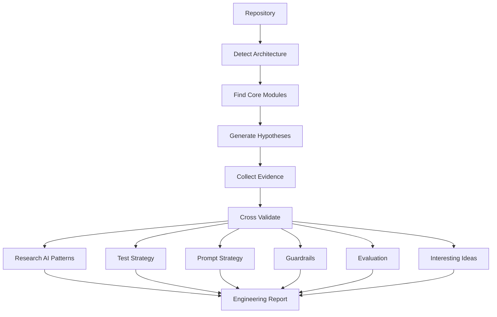

# Repository Research

> Research an open-source repository and extract the architecture, design ideas, engineering tradeoffs, and reusable patterns rather than merely explaining code.

---

## Purpose

This skill performs an engineering-oriented repository study.

The objective is **not** to summarize the code.

The objective is to answer:

- Why is the repository designed this way?
- What engineering problems is it solving?
- What patterns are reusable?
- What ideas can be applied elsewhere?
- What can AI/Agent engineers learn from it?

The output should resemble an architecture review or engineering design document rather than code documentation.

---

## Suitable Repositories

Especially useful for:

- AI Agent Frameworks (OpenAI Agents SDK, Claude Code, Codex CLI, LangGraph, PydanticAI, CrewAI, AutoGen)
- AI Coding Agents (OpenHands, Continue, Cline, Goose, Aider, Cursor)
- MCP Servers
- Research Systems
- RAG Frameworks
- Evaluation Frameworks
- Compiler Projects
- Databases
- Distributed Systems
- Browsers
- Developer Tools (uv, Ruff, Bun, Vite)

---

## Input

Repository already cloned locally.

Optional:

- Repository URL
- Branch
- Interesting directories
- Questions to answer

Example:

```
repo_path: ~/code/openai-agents
focus:
  - Agent Harness
  - Prompt
  - Evaluation
  - Architecture
```

---

## Research Mindset

**Do NOT read files sequentially.**

Instead, continuously build hypotheses.

For example:

> **Hypothesis**: The framework probably separates planning from execution.
>
> **Evidence**: `Planner`, `Runner`, `ToolExecutor`, `Context`
>
> **Conclusion**: Planning and execution are intentionally decoupled.

Never produce:

```
File A does this.
File B does that.
File C does this.
```

Always produce:

```
Problem
  ↓
Design
  ↓
Evidence
  ↓
Tradeoff
  ↓
Takeaway
```

---

## Research Workflow



---

## Things to Research

### 1. Architecture

- Overall architecture
- Layering
- Responsibilities
- Module boundaries
- Dependency direction
- Initialization flow
- Lifecycle
- Execution pipeline
- Event flow
- Data flow
- Extension points
- Plugin system
- Configuration

### 2. Design Philosophy

Try to infer:

- What problem is the author trying to solve?
- Why this abstraction?
- Why not another architecture?
- What tradeoffs were chosen?

### 3. AI Agent Harness

**Very important.** Study:

- Agent lifecycle
- Planning
- Execution
- Reflection
- Retry
- Parallelism
- Delegation
- Cancellation
- Checkpoint
- Streaming
- Context propagation
- Human approval
- Multi-agent orchestration
- Loop prevention
- State management
- Failure recovery

### 4. Prompt Engineering

Research:

- System prompts
- Planning prompts
- Reflection prompts
- Repair prompts
- Tool prompts
- Compression prompts
- Summarization prompts
- Hidden prompts
- Prompt templates
- Few-shot examples
- Prompt composition
- Dynamic prompt generation
- Prompt injection defenses

### 5. Context Engineering

Research:

- Conversation memory
- Working memory
- Scratchpad
- Compression
- Sliding window
- Retrieval
- Context selection
- Context prioritization
- Context pruning
- Conversation replay

### 6. Tool Framework

Research:

- Tool registration
- Schemas
- Validation
- Permission model
- Timeout
- Retry
- Streaming
- Error handling
- Approval
- Sandbox
- Security

### 7. Guardrails

Research:

- Hallucination prevention
- Prompt injection
- Loop detection
- Budget limits
- Max iterations
- Tool whitelist
- Permission control
- Dangerous operations
- Human confirmation
- Rate limiting
- Resource protection

### 8. Evaluation

**Very important.** Research how the repository verifies an Agent works:

- Benchmarks
- Regression tests
- Golden tests
- Snapshots
- Reference outputs
- Judge LLM
- Human evaluation
- Rubrics
- Metrics
- Pass rate
- Failure rate
- Coverage

### 9. Testing Strategy

Research:

- Unit tests
- Integration tests
- E2E
- Simulation
- Fake LLM
- Mock Tool
- Golden datasets
- Replay
- Deterministic execution
- Recorded conversations
- Regression suite

### 10. Verification

How do developers know changes don't break the Agent?

- CI
- Regression
- Golden outputs
- Benchmarks
- Evaluation pipelines
- Replay tests
- Deterministic mode

### 11. Interesting Engineering Ideas

Collect:

- Interesting abstractions
- Elegant APIs
- Reusable patterns
- Small but clever implementations
- Novel architecture
- Unexpected simplifications
- Performance optimizations
- Engineering tricks
- Developer experience improvements

### 12. Things Worth Learning

Answer: If I only have one hour, what are the top ideas worth learning?

---

## Evidence Collection

Every conclusion should contain evidence.

Example:

> **Conclusion**: The framework intentionally separates planning from execution.
>
> **Evidence**: `planner.ts`, `Runner.ts`, `ExecutionContext.ts`, `planner.test.ts`
>
> **Confidence**: High
>
> **Reason**: Multiple modules consistently implement the separation.

Never make unsupported claims. Always indicate **High / Medium / Low** confidence.

---

## Cross Validation

Whenever possible, verify a conclusion using multiple sources:

- Architecture
- Tests
- Comments
- Documentation
- Prompts
- Configuration
- Examples
- CI
- Benchmarks

instead of relying on a single source.

---

## Comparative Analysis

Not only analyze the current repository, but automatically compare with similar projects:

| Dimension | Current Repo | Similar Project | Difference | Learning Value |
|-----------|-------------|----------------|------------|----------------|
| Agent Harness | Loop + Planner | OpenAI Agents | Lighter | ★★★★★ |
| Prompt Design | Prompt Builder | Claude Code | More modular | ★★★★☆ |
| Evaluation | Golden Tests | LangGraph | Weaker coverage | ★★★☆☆ |
| Guardrails | Tool Permission | Codex CLI | More conservative | ★★★★★ |
| Context Eng | Sliding Window | Continue | Simpler | ★★★☆☆ |

This is the key differentiator between an excellent research report and a plain source code analysis: positioning the project within its ecosystem and extracting transferable design ideas.

---

## Report Structure

### Executive Summary

- Repository purpose
- Main architecture
- Most interesting ideas
- Overall quality
- Who should study it

### Architecture

- Architecture explanation
- Execution pipeline
- Module relationships
- Design patterns

### AI-specific Design

- Agent Harness
- Prompt Design
- Context Engineering
- Tool Framework
- Guardrails
- Evaluation
- Testing
- Verification

### Engineering Tradeoffs

- Decision
- Advantages
- Disadvantages
- Alternative designs
- Why this repository chose it

### Reusable Ideas

- Patterns worth copying
- Patterns to avoid
- Interesting abstractions
- Engineering tricks

### Comparative Analysis

- Horizontal comparison with similar projects
- Positioning within ecosystem
- Transferable design ideas

### Learning Checklist

- Top 10 concepts
- Top 10 files
- Top 10 tests
- Top prompts
- Top extension points

### Confidence Assessment

For every major conclusion:

- High / Medium / Low
- Evidence
- Reason

---

## Output Style

Focus on:

- Architecture
- Engineering thinking
- Tradeoffs
- Patterns
- Reasoning

Avoid:

- Long file summaries
- Line-by-line explanations
- Function walkthroughs
- Large code dumps

---

## Success Criteria

A successful report enables an experienced engineer to understand:

- Why the repository exists.
- Which engineering problems it solves.
- Which architectural decisions matter.
- How the AI Agent is designed and constrained.
- How prompts are organized and evolved.
- How evaluation and testing ensure reliability.
- Which implementation patterns are reusable.
- Which ideas are unique or especially elegant.
- Which files and tests are the highest-value entry points for deeper study.
