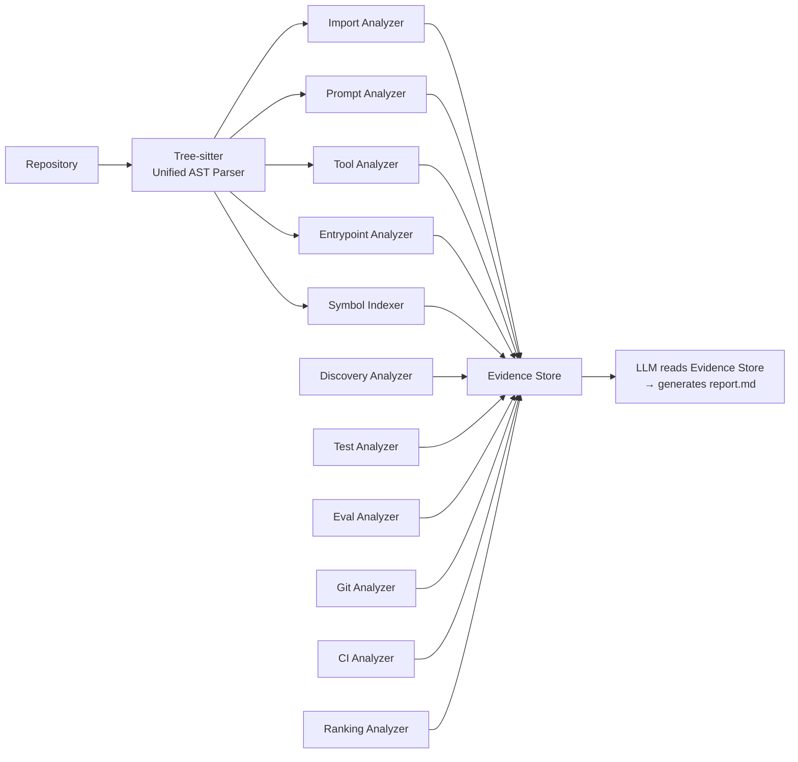
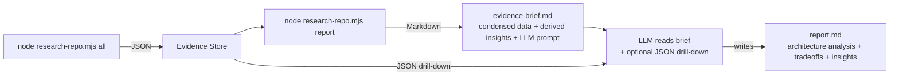
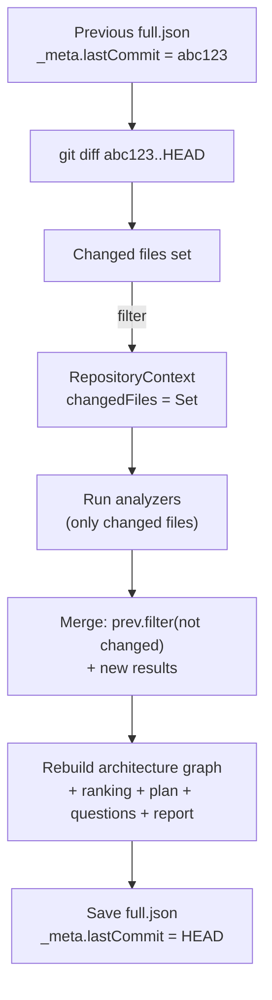
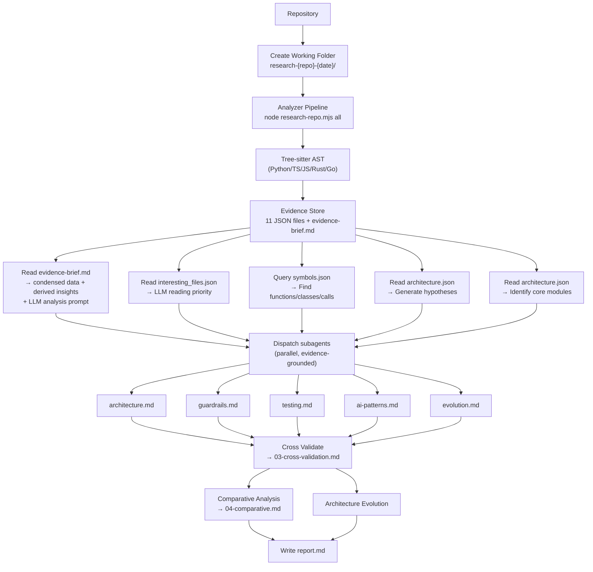

# Repository Research

> Research an open-source repository and extract the architecture, design ideas, engineering tradeoffs, and reusable patterns rather than merely explaining code.

---

## Purpose

This skill performs an engineering-oriented repository study.

The objective is **not** to summarize the code.

The objective is to answer:

- Why is the repository designed this way?
- What engineering problems is it solving?
- What patterns are reusable?
- What ideas can be applied elsewhere?
- What can AI/Agent engineers learn from it?

The output should resemble an architecture review or engineering design document rather than code documentation.

---

## Suitable Repositories

Especially useful for:

- AI Agent Frameworks (OpenAI Agents SDK, Claude Code, Codex CLI, LangGraph, PydanticAI, CrewAI, AutoGen)
- AI Coding Agents (OpenHands, Continue, Cline, Goose, Aider, Cursor)
- MCP Servers
- Research Systems
- RAG Frameworks
- Evaluation Frameworks
- Compiler Projects
- Databases
- Distributed Systems
- Browsers
- Developer Tools (uv, Ruff, Bun, Vite)

---

## Input

Repository already cloned locally.

Optional:

- Repository URL
- Branch
- Interesting directories
- Questions to answer

Example:

```
repo_path: ~/code/openai-agents
focus:
  - Agent Harness
  - Prompt
  - Evaluation
  - Architecture
```

---

## Working Folder & Evidence Store

**Every research session MUST create a working folder** in the current directory before any analysis begins. The working folder contains the **Evidence Store** — a set of structured JSON files produced by deterministic scripts, plus Markdown files produced by LLM subagents. The LLM never traverses the repository directly; it consumes the Evidence Store.

### Directory Structure

```
research-{repo-name}-{YYYYMMDD}/
├── evidence-store/             # Deterministic analysis output (script-generated)
│   ├── discovery.json          # Repository metadata, manifest, file tree
│   ├── architecture.json       # Dependency graph + centrality + cycles
│   ├── entrypoints.json        # Entry point detection (cli/server/sdk/example)
│   ├── prompts.json            # Prompt discovery (system/template/few-shot)
│   ├── tools.json              # Tool/function registration discovery
│   ├── tests.json              # Test inventory + categorization + patterns
│   ├── evaluations.json        # Evaluation/benchmark/rubric discovery
│   ├── git_history.json        # Git log, contributors, refactors, tags
│   ├── ci.json                 # CI/CD pipeline discovery
│   ├── symbols.json            # Semantic Index: functions, classes, calls, strings
│   └── interesting_files.json  # Ranked file list for LLM reading priority
├── evidence-brief.md           # Condensed evidence + derived insights + LLM prompt (from `report` command)
├── 01-hypotheses.md            # LLM-generated hypotheses (from Evidence Store)
├── 02-evidence/                # LLM subagent evidence collection
│   ├── architecture.md         # Subagent: core architecture
│   ├── guardrails.md           # Subagent: guardrails & adapters
│   ├── testing.md              # Subagent: testing & evaluation
│   ├── ai-patterns.md          # Subagent: AI-specific design
│   └── evolution.md            # Subagent: architecture evolution
├── 03-cross-validation.md      # Cross validation results
├── 04-comparative.md           # Comparative analysis
├── research-repo.mjs           # Copied from skill directory
└── report.md                   # Final report (LLM-generated from evidence brief)
```

### Evidence Store Benefits

1. **Cacheable**: Repository unchanged → skip re-analysis, reuse JSON
2. **Traceable**: Every LLM conclusion traces back to a JSON evidence file
3. **Extensible**: New analyzer → new JSON file, no skill flow change needed

### Evidence File Formats

Each JSON file is produced by `research-repo.mjs`. Key schemas:

**`discovery.json`**:
```json
{
  "repoName": "custodian-kernel",
  "repoPath": "/abs/path",
  "manifest": { "language": "python", "entry": "pyproject.toml", "name": "custodian-kernel", "version": "0.4.0" },
  "topLevelDirs": ["custodian", "caduceus", "tests"],
  "fileCount": { ".py": 120, ".md": 45 },
  "testFileCount": 48
}
```

**`architecture.json`**:
```json
{
  "totalNodes": 304,
  "totalEdges": 435,
  "cycles": [["module.a", "module.b"]],
  "centrality": {
    "topByInDegree": [{ "id": "custodian.types", "inDegree": 15 }],
    "topByPageRank": [{ "id": "custodian.types", "score": 0.082 }]
  }
}
```

**`interesting_files.json`**:
```json
{
  "topFiles": [
    { "path": "README.md", "score": 90, "reasons": ["README +50", "high pagerank +40"] }
  ]
}
```

### LLM Evidence File Format

Each `02-evidence/*.md` file follows this format:

```markdown
# {Focus Area}

## Findings

### Finding 1: {Title}

**Conclusion**: ...
**Evidence**: `file.py:L10-L30`, `test.py:L5-L20`
**Confidence**: High / Medium / Low
**Reason**: ...

## Open Questions
- ...
```

### Naming Convention

- Directories: `research-{repo-basename}-{YYYYMMDD}` (e.g., `research-custodian-kernel-20260721`)
- Evidence Store JSON: `{analysis-name}.json` in kebab-case
- LLM evidence: `{focus-area}.md` in kebab-case

---

## Repository Discovery

**Before reading any implementation**, first map the repository layout.

Research:

- README and top-level docs
- `package.json` / `pyproject.toml` / `Cargo.toml` / `go.mod` — entry points, scripts, dependencies
- `Makefile` / `Justfile` / build scripts
- `examples/` / `docs/` / `benchmark/` / `eval/`
- `src/` / `lib/` / `internal/` — where the architecture lives
- `tests/` / `__tests__/` / `spec/` — where verification lives
- `.github/workflows/` — CI pipeline

Identify:

- Where the architecture lives
- Where prompts live
- Where evaluation lives
- Where tests live

Ignore:

- `vendor/` / `node_modules/` / third-party
- Generated code (`*.gen.ts`, `dist/`, `build/`)
- Snapshots and lock files
- Large data files

Answer first:

> This repo's entry point is `X`. The most important directories are `A`, `B`, `C`. Directories `D` and `E` can be skipped.

---

## Analyzer Pipeline Architecture

The skill uses a **multi-layer Analyzer Pipeline**. Deterministic analyzers run first via `research-repo.mjs`, producing a structured Evidence Store. The LLM never traverses the repository directly — it queries the Evidence Store.

**~70% of the work is deterministic (script), ~30% is reasoning (LLM).**

### Analyzer Pipeline



### Usage

```bash
# Copy script to working folder
cp .trae/skills/research-repo/research-repo.mjs research-{repo}-{date}/

# Run individual analyzers (each prints JSON to stdout)
node research-repo.mjs discovery    <repoPath>  > evidence-store/discovery.json
node research-repo.mjs architecture <repoPath>  > evidence-store/architecture.json
node research-repo.mjs entrypoints  <repoPath>  > evidence-store/entrypoints.json
node research-repo.mjs prompts      <repoPath>  > evidence-store/prompts.json
node research-repo.mjs tools        <repoPath>  > evidence-store/tools.json
node research-repo.mjs tests        <repoPath>  > evidence-store/tests.json
node research-repo.mjs evaluations  <repoPath>  > evidence-store/evaluations.json
node research-repo.mjs git          <repoPath>  > evidence-store/git_history.json
node research-repo.mjs ci           <repoPath>  > evidence-store/ci.json
node research-repo.mjs symbols      <repoPath>  > evidence-store/symbols.json
node research-repo.mjs ranking      <repoPath>  > evidence-store/interesting_files.json

# Or run all at once (produces combined JSON with all keys including 'report')
node research-repo.mjs all <repoPath> > evidence-store/full.json

# Generate the Evidence Brief (Markdown) for LLM report generation
# This condenses all analyzer outputs into a structured brief with derived insights
# and an LLM analysis prompt. Pipe to a file for the LLM to read.
# Use --lang=zh for Chinese evidence brief + Chinese LLM analysis prompt.
node research-repo.mjs report <repoPath> > evidence-brief.md
node research-repo.mjs report --lang=zh <repoPath> > evidence-brief.md

# Incremental update: when the repo gets new code (git pull), update evidence
# without re-running everything from scratch. Uses git diff to detect changed
# files, re-analyzes only those, merges with previous results, and rebuilds
# architecture graph + ranking + plan + questions + report.
# Requires evidence-store/full.json from a previous 'all' run.
node research-repo.mjs update <repoPath> > evidence-store/full.json
```

### Report Generation Workflow

The `report` command produces an **Evidence Brief** — a structured Markdown file that:

1. **Research Principles** (§0) — 10 principles guiding how the LLM should think (evidence over assumptions, negative findings matter, etc.)
2. **Condenses** all 11 analyzer outputs into a human-readable summary (§1-§5)
3. **Negative Findings** (§6) — What was NOT found, preventing the LLM from defaulting to "present"
4. **Reading Priority** (§7) — Top 20 files ranked by structural importance
5. **Reading Guide** (§8) — Time-boxed reading plans (30-minute quick look + 2-hour deep dive)
6. **Research Plan** (§9) — Hypotheses with confidence levels and open questions
7. **LLM Analysis Prompt** — Instructs the agent to write `report.md` using Research Trace methodology

The LLM agent reads the Evidence Brief, optionally dives deeper into specific JSON evidence files, then writes the final `report.md` using **Research Trace methodology** — every important conclusion shows its full derivation chain:

```
Question → Evidence → Analysis → Counter Evidence → Conclusion → Confidence
```

**Report structure** (10 sections):
1. Executive Summary
2. Research Traces (5-8 core findings, each with full derivation chain)
3. Negative Findings (what was NOT found and why it matters)
4. Architecture Smells (potential risks, not assertions)
5. Interesting Decisions (seems odd but might be clever)
6. Repository Positioning (ecological positioning, not feature matrix)
7. Reusable Pattern Catalog (structured pattern table)
8. Architecture Evolution (from Git history)
9. Reading Guide (30-min / 2-hour plans)
10. Open Questions (for second-round research)



### Incremental Analysis (`update` command)

When the repository gets new code (e.g., `git pull`), re-running `all` from scratch is wasteful. The `update` command performs **incremental analysis**:

1. **Load** previous `evidence-store/full.json` (must contain `_meta.lastCommit`)
2. **Detect changes** via `git diff --name-only <lastCommit>..HEAD`
3. **Re-analyze only changed files** — analyzers process only the changed file set
4. **Merge results** — for each analyzer, filter out old entries for changed files, add new entries
5. **Rebuild aggregates** — architecture graph, centrality, ranking are rebuilt from merged symbols
6. **Regenerate** plan, questions, and evidence brief from merged data
7. **Save** with updated `_meta` (new `lastCommit`, `incremental: true`, `changedFilesCount`)



**What gets merged incrementally** (file-level analyzers):
- `symbols` — functions, classes, imports, calls, strings (filtered by `file` field)
- `entrypoints` — entry points (filtered by `path` field)
- `prompts` — prompt definitions (filtered by `file` field)
- `tools` — tool registrations (filtered by `file` field)
- `tests` — test files (filtered by `file` field, aggregates recomputed)
- `evaluations` — eval files (filtered by path, set-deduplicated)

**What always re-runs** (cheap or needs full scan):
- `discovery` — full file tree scan
- `git` — git history
- `ci` — CI workflow scan
- `architecture` — rebuilt from merged symbols
- `ranking` — rebuilt from merged architecture + entrypoints

**Language support**: Use `--lang=zh` with `all` or `report` commands to generate Chinese evidence briefs and Chinese LLM analysis prompts.

### Analyzer Catalog

| Command | Output JSON | Analyzer | AST-powered | Scriptable |
|---------|------------|----------|-------------|-----------|
| `discovery` | `discovery.json` | Manifest, file tree, top-level dirs | No | 100% |
| `architecture` | `architecture.json` | Import graph, PageRank, cycles | **Tree-sitter** | 90% |
| `entrypoints` | `entrypoints.json` | CLI/server/sdk/example entry | **Tree-sitter** | 100% |
| `prompts` | `prompts.json` | System prompts, templates, variables | **Tree-sitter** | 100% |
| `tools` | `tools.json` | @tool/Tool()/server.tool registration | **Tree-sitter** | 95% |
| `tests` | `tests.json` | Test categorization, pattern detection | No | 100% |
| `evaluations` | `evaluations.json` | Eval/benchmark/rubric discovery | No | 100% |
| `git` | `git_history.json` | Commits, contributors, refactors, tags | No | 95% |
| `ci` | `ci.json` | CI provider, workflows, triggers | No | 100% |
| `symbols` | `symbols.json` | **Semantic Index** (see below) | **Tree-sitter** | 95% |
| `ranking` | `interesting_files.json` | File scoring → top 20 reading priority | No | 100% |
| `report` | `evidence-brief.md` | **Evidence Brief** — condensed data + derived insights + LLM prompt | No | 100% |
| `update` | `full.json` | **Incremental analysis** — git diff → re-analyze changed files → merge | **Tree-sitter** | 90% |

### Semantic Index (`symbols` command)

The Semantic Index is a **symbol-level index** of the entire repository, built by Tree-sitter. LLM queries this index instead of scanning code.

```json
{
  "functions": [
    { "name": "govern", "file": "custodian/govern.py", "line": 203, "params": ["band", "cap"], "decorators": ["@govern"] }
  ],
  "classes": [
    { "name": "Claim", "file": "packs/base.py", "line": 59, "bases": ["dataclass"], "methods": ["verify"] }
  ],
  "imports": [
    { "file": "govern.py", "what": "Band", "from": "types" }
  ],
  "calls": [
    { "file": "govern.py", "line": 250, "caller": "charge_customer", "callee": "decide" }
  ],
  "strings": [
    { "file": "prompt.ts", "line": 10, "name": "SYSTEM_PROMPT", "length": 500 }
  ]
}
```

**What the Semantic Index enables:**

| Query | Before (LLM scans code) | After (LLM queries index) |
|-------|------------------------|--------------------------|
| "Find all tools" | Read every file | `tools.json` → instant |
| "Who calls `decide()`?" | Grep + guess | `symbols.json` calls[] where callee="decide" |
| "What does `Claim` inherit?" | Find class, read bases | `symbols.json` classes[] where name="Claim" |
| "Where are prompts defined?" | Grep "prompt" | `prompts.json` + `symbols.json` strings[] |
| "Which module is most central?" | Read all imports | `architecture.json` centrality.topByPageRank |

### LLM Reasoning Layer

After the Evidence Store is populated, the LLM:

1. **Reads** the Evidence Brief (`report` command output) → gets condensed data + derived insights + analysis prompt
2. **Reads** `interesting_files.json` → knows what to read first
3. **Queries** `symbols.json` → finds function/class definitions without scanning
4. **Generates hypotheses** from `architecture.json` centrality + cycles
5. **Dispatches subagents** to read specific files (identified by Semantic Index)
6. **Cross-validates** findings against multiple evidence sources
7. **Compares** with similar projects
8. **Writes** `report.md` — the final engineering analysis report

**Key principle**: Scripts produce **facts** (AST structures, symbol indices, centrality scores) and **computable insights** (coupling assessment, design archetype, test coverage analysis). LLM produces **interpretation** (what the architecture means, why decisions were made, engineering tradeoffs). The LLM never does work that a script can do.

### Core Dependencies

All dependencies are in root `package.json` devDependencies. The script uses dynamic `import()` with graceful fallback — zero hard dependencies, but Tree-sitter is expected to be installed.

| Package | Role | Stars | Fallback |
|---------|------|-------|----------|
| `web-tree-sitter` | Unified multi-language AST parser (WASM) | ★★★★★ | Regex heuristics |
| `tree-sitter-wasms` | Pre-built WASM grammars (Python/TS/JS/Rust/Go/Java) | ★★★★★ | N/A |
| `graphology` | Graph algorithms (PageRank, centrality, cycles) | ★★★★★ | Pure JS implementations |
| `fast-glob` | High-performance file matching | ★★★★★ | Built-in `readdirSync` |
| `simple-git` | Git history analysis | ★★★★★ | `child_process` shell-out |
| `yaml` | Parse GitHub Actions / CI configs | ★★★★ | Regex extraction |

**Advanced packages** (not installed, optional for deeper analysis):

| Package | Purpose |
|---------|---------|
| `ts-morph` | TypeScript Compiler API — semantic analysis (findReferences, getType) |
| `dependency-cruiser` | Dependency graph + architecture rule enforcement |
| `madge` | Call graph generation + circular dependency detection |

---

## Research Mindset

**Do NOT read files sequentially.**

Instead, continuously build hypotheses.

For example:

> **Hypothesis**: The framework probably separates planning from execution.
>
> **Evidence**: `Planner`, `Runner`, `ToolExecutor`, `Context`
>
> **Conclusion**: Planning and execution are intentionally decoupled.

Never produce:

```
File A does this.
File B does that.
File C does this.
```

Always produce:

```
Problem
  ↓
Design
  ↓
Evidence
  ↓
Tradeoff
  ↓
Takeaway
```

---

## Reading Strategy

Study the repository in this order:

1. **README and documentation** — purpose, design philosophy, quick start
2. **Examples** — how the authors intend it to be used; design intent lives here
3. **Tests** — expected behavior, edge cases, invariants
4. **Public APIs** — interface contracts, type signatures
5. **Core architecture** — module boundaries, dependency direction
6. **Internal implementation** — only after understanding the above
7. **Benchmarks and evaluation** — what the team measures and optimizes for
8. **CI and release workflow** — quality gates, deployment pipeline

Avoid reading source files sequentially. Continuously refine hypotheses as new evidence emerges.

---

## Research Workflow



---

## Things to Research

### 1. Architecture

- Overall architecture
- Layering
- Responsibilities
- Module boundaries
- Dependency direction
- Initialization flow
- Lifecycle
- Execution pipeline
- Event flow
- Data flow
- Extension points
- Plugin system
- Configuration

### 2. Design Philosophy

Try to infer:

- What problem is the author trying to solve?
- Why this abstraction?
- Why not another architecture?
- What tradeoffs were chosen?

### 3. AI Agent Harness

**Very important.** Study:

- Agent lifecycle
- Planning
- Execution
- Reflection
- Retry
- Parallelism
- Delegation
- Cancellation
- Checkpoint
- Streaming
- Context propagation
- Human approval
- Multi-agent orchestration
- Loop prevention
- State management
- Failure recovery

### 4. Prompt Engineering

Research prompt content **and** prompt lifecycle:

**Prompt content:**

- System prompts
- Planning prompts
- Reflection prompts
- Repair prompts
- Tool prompts
- Compression prompts
- Summarization prompts
- Hidden prompts
- Prompt templates
- Few-shot examples
- Prompt composition
- Dynamic prompt generation
- Prompt injection defenses

**Prompt lifecycle:**

- Prompt evolution (how prompts changed across versions)
- Prompt versioning and migration
- Prompt assembly pipeline (how fragments compose into final prompt)
- Template engine and variable injection
- Tool description generation
- Automatic prompt compression
- Prompt testing and regression

### 5. Context Engineering

Research:

- Conversation memory
- Working memory
- Scratchpad
- Compression
- Sliding window
- Retrieval
- Context selection
- Context prioritization
- Context pruning
- Conversation replay

### 6. Tool Framework

Research:

- Tool registration
- Schemas
- Validation
- Permission model
- Timeout
- Retry
- Streaming
- Error handling
- Approval
- Sandbox
- Security

### 7. Guardrails

Research:

- Hallucination prevention
- Prompt injection
- Loop detection
- Budget limits
- Max iterations
- Tool whitelist
- Permission control
- Dangerous operations
- Human confirmation
- Rate limiting
- Resource protection

### 8. Evaluation & Reliability Engineering

**Very important.** Research how the repository verifies an Agent works:

**Evaluation:**

- Benchmarks
- Regression tests
- Golden tests
- Snapshots
- Reference outputs
- Judge LLM
- Human evaluation
- Rubrics
- Metrics
- Pass rate
- Failure rate
- Coverage

**Reliability engineering:**

- Determinism (same input → same output?)
- Replayability (can a run be reproduced?)
- Reproducibility (across environments, model versions)
- Cost evaluation (token usage tracking, budget enforcement)
- Latency evaluation (time-to-first-token, end-to-end)
- Failure analysis (how failures are classified, logged, surfaced)
- Flakiness mitigation (Agent's biggest problem is not accuracy — it's "passes today, fails tomorrow")

### 9. Testing Strategy

Research:

- Unit tests
- Integration tests
- E2E
- Simulation
- Fake LLM
- Mock Tool
- Golden datasets
- Replay
- Deterministic execution
- Recorded conversations
- Regression suite

### 10. Verification

How do developers know changes don't break the Agent?

- CI
- Regression
- Golden outputs
- Benchmarks
- Evaluation pipelines
- Replay tests
- Deterministic mode

### 11. Interesting Engineering Ideas

Collect:

- Interesting abstractions
- Elegant APIs
- Reusable patterns
- Small but clever implementations
- Novel architecture
- Unexpected simplifications
- Performance optimizations
- Engineering tricks
- Developer experience improvements

### 12. Things Worth Learning

Answer: If I only have one hour, what are the top ideas worth learning?

### 13. Architecture Evolution

**★★★★★ Highly recommended for Agent projects.** Many designs are the result of failure-driven iteration.

Research via git history, changelogs, and release notes:

- Major refactors and architectural shifts
- Breaking changes and deprecations
- Deprecated ideas (what was tried and abandoned — often more informative than what survived)
- Evolution of prompts across versions
- Evolution of evaluation methodology
- Evolution of APIs and public interfaces
- Lessons learned from commit messages, PR descriptions, and issue threads

> The most valuable insight is often not "what the architecture is today" but "how it got there."

### 14. Interesting Questions

Answer these for deeper insight:

- Why is this abstraction necessary?
- What would break if this module were removed?
- What is the smallest useful architecture this could be reduced to?
- Which modules are accidental complexity vs. essential complexity?
- Where is the real innovation?
- Which decisions appear over-engineered?
- Which ideas survived across multiple releases?

---

## Evidence Collection

Every conclusion should contain evidence.

Example:

> **Conclusion**: The framework intentionally separates planning from execution.
>
> **Evidence**: `planner.ts`, `Runner.ts`, `ExecutionContext.ts`, `planner.test.ts`
>
> **Confidence**: High
>
> **Reason**: Multiple modules consistently implement the separation.

Never make unsupported claims. Always indicate **High / Medium / Low** confidence.

**Don't speculate.** Never infer architecture without evidence. If evidence is insufficient, state **Unknown** instead of guessing. This reduces hallucination.

---

## Cross Validation

Whenever possible, verify a conclusion using multiple sources:

- Architecture
- Tests
- Comments
- Documentation
- Prompts
- Configuration
- Examples
- CI
- Benchmarks

instead of relying on a single source.

---

## Comparative Analysis

Not only analyze the current repository, but automatically compare with similar projects:

| Dimension | Current Repo | Similar Project | Difference | Learning Value |
|-----------|-------------|----------------|------------|----------------|
| Agent Harness | Loop + Planner | OpenAI Agents | Lighter | ★★★★★ |
| Prompt Design | Prompt Builder | Claude Code | More modular | ★★★★☆ |
| Evaluation | Golden Tests | LangGraph | Weaker coverage | ★★★☆☆ |
| Guardrails | Tool Permission | Codex CLI | More conservative | ★★★★★ |
| Context Eng | Sliding Window | Continue | Simpler | ★★★☆☆ |

This is the key differentiator between an excellent research report and a plain source code analysis: positioning the project within its ecosystem and extracting transferable design ideas.

**Comparison principle:** Don't compare everything. Only compare the relevant subsystem where a meaningful design difference exists (e.g., Prompt design, Tool framework, Evaluation, Memory, Context, Planner). Avoid superficial feature-matrix comparisons ("X has Y, Z has W") that add no engineering insight.

---

## Report Structure

The final deliverable is **`report.md`** saved in the working folder root. It synthesizes all intermediate files (`00-discovery.json` through `07-comparative.md`) into a single engineering report. Every claim in the report must trace back to an evidence file in `05-evidence/`.

### Executive Summary

- Repository purpose
- Main architecture
- Most interesting ideas
- Overall quality
- Who should study it

### Architecture

- Architecture explanation
- Execution pipeline
- Module relationships
- Design patterns

### AI-specific Design

- Agent Harness
- Prompt Design
- Context Engineering
- Tool Framework
- Guardrails
- Evaluation
- Testing
- Verification

### Engineering Tradeoffs

- Decision
- Advantages
- Disadvantages
- Alternative designs
- Why this repository chose it

### Reusable Ideas

- Patterns worth copying
- Patterns to avoid
- Interesting abstractions
- Engineering tricks

### Comparative Analysis

- Horizontal comparison with similar projects
- Positioning within ecosystem
- Transferable design ideas

### Learning Checklist

- Top 10 concepts
- Top 10 files
- Top 10 tests
- Top prompts
- Top extension points

### Confidence Assessment

For every major conclusion:

- High / Medium / Low
- Evidence
- Reason

---

## Output Style

Focus on:

- Architecture
- Engineering thinking
- Tradeoffs
- Patterns
- Reasoning

Avoid:

- Long file summaries
- Line-by-line explanations
- Function walkthroughs
- Large code dumps

---

## Success Criteria

A successful report enables an experienced engineer to understand:

- Why the repository exists.
- Which engineering problems it solves.
- Which architectural decisions matter.
- How the AI Agent is designed and constrained.
- How prompts are organized and evolved.
- How evaluation and testing ensure reliability.
- Which implementation patterns are reusable.
- Which ideas are unique or especially elegant.
- Which files and tests are the highest-value entry points for deeper study.

A reader should finish the report knowing where to spend the next two hours reading source code.
