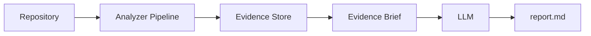
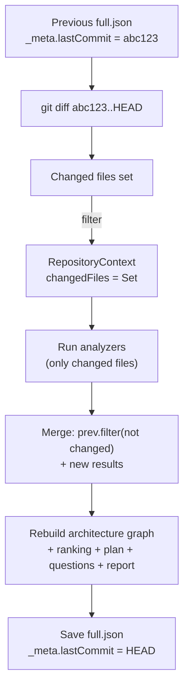
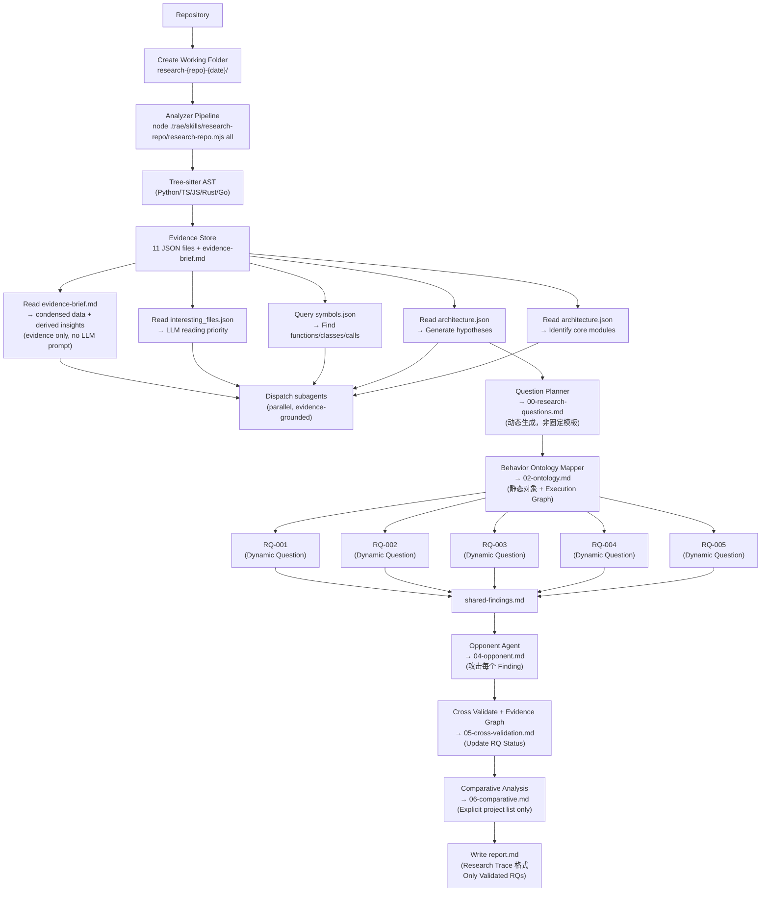

# Repository 研究

> 研究一个开源 Repository，并提炼其架构、设计思想、工程权衡与可复用模式，而不是仅仅解释代码。

---

## 目标

本 Skill 面向工程视角进行 Repository 研究。

目标**不是**总结代码。

目标是回答：

- 为什么这个 Repository 要这样设计？
- 它在解决哪些工程问题？
- 哪些模式是可复用的？
- 哪些思想可以迁移到别处？
- AI/Agent 工程师能从中学习到什么？

输出应更像架构评审或工程设计文档，而非代码文档。

---

## 输入

Repository 已克隆到本地。

可选：

- Repository URL
- Branch
- 关注的目录
- 要回答的问题

示例：

```
repo_path: ~/code/openai-agents
focus:
  - Agent Harness
  - Prompt
  - Evaluation
  - Architecture
```

---

## 工作目录与 Evidence Store

**每次研究会话都必须在开始任何分析前创建 working folder**。工作目录包含 **Evidence Store**——由确定性脚本生成的一组结构化 JSON 文件，以及由 LLM subagent 生成的 Markdown 文件。LLM 不会直接遍历 Repository，而是消费 Evidence Store。

### 目录结构

```
research-{repo-name}-{YYYYMMDD}/
├── evidence-store/             # Deterministic analysis output (script-generated)
│   ├── full.json               # Slim index: all sections as summaries + _ref pointers (< 300KB, git-friendly)
│   ├── symbols.json            # Full Semantic Index: functions, classes, calls, strings (gitignored, regenerable)
│   ├── ontology.json           # Full Ontology: objects + semantic relationships (gitignored, regenerable)
│   ├── architecture.json       # Full dependency graph: nodes + edges (gitignored, regenerable)
│   └── ...                     # Individual analyzer outputs (if run separately)
├── evidence-brief.md           # Condensed evidence + derived insights (from `report` command; no LLM prompt in v3)
├── 00-research-questions.md    # Dynamically generated Research Questions (Stage 0)
├── 01-hypotheses.md            # Bayesian hypotheses with confidence evolution (Stage 1)
├── 02-ontology.md              # Behavior Ontology: static objects + Execution Graph (Stage 2)
├── RQ-001.md ... RQ-005.md     # Dynamic Research Question agents (Stage 3, parallel)
├── shared-findings.md          # Cross-RQ shared findings (written by RQ agents)
├── 04-opponent.md              # Opponent Agent: attack each Finding (Stage 4)
├── 05-cross-validation.md      # Cross validation + Evidence Graph (Stage 5)
├── 06-comparative.md           # Comparative analysis (explicit project list only, Stage 6)
├── research-repo.mjs           # Copied from skill directory
└── report.md                   # Final report with Research Traces (Stage 7, only cites Validated RQs)
```


### 精简版 `full.json` 设计

当 working directory 中存在 `evidence-store/` 时，`all` 命令会自动将较大部分拆分为独立文件：

| Section | In slim `full.json` | In separate file | Rationale |
|---------|---------------------|------------------|-----------|
| `symbols` | Summary counts + `_ref` | `symbols.json` | Raw function/class/call arrays are 1-40MB |
| `ontology` | Type/rel summaries + `_ref` | `ontology.json` | Object/relationship arrays are 0.5-7MB |
| `architecture` | Node/edge counts + cycles + centrality + `_ref` | `architecture.json` | Graph nodes/edges are 0.1-1.5MB |
| All other sections | Full data | — | Small enough for git (< 30KB each) |

### Evidence Store 的优势

1. **可缓存**：Repository 未变更 → 跳过重新分析，复用 JSON
2. **可追溯**：每个 LLM 结论都可追溯到某条 JSON Evidence
3. **可扩展**：新增 Analyzer → 新增 JSON 文件，无需改动 Skill 流程

### Evidence 文件格式

每个 JSON 文件由 `research-repo.mjs` 生成。关键 schema 如下：

**`discovery.json`**：
```json
{
  "repoName": "example-project",
  "repoPath": "/abs/path",
  "manifest": { "language": "python", "entry": "pyproject.toml", "name": "example-project", "version": "1.0.0" },
  "topLevelDirs": ["src", "tests", "docs"],
  "fileCount": { ".py": 120, ".md": 45 },
  "testFileCount": 48
}
```

**`architecture.json`**：
```json
{
  "totalNodes": 304,
  "totalEdges": 435,
  "cycles": [["module.a", "module.b"]],
  "centrality": {
    "topByInDegree": [{ "id": "core.types", "inDegree": 15 }],
    "topByPageRank": [{ "id": "core.types", "score": 0.082 }]
  }
}
```

**`interesting_files.json`**：
```json
{
  "topFiles": [
    { "path": "README.md", "score": 90, "reasons": ["README +50", "high pagerank +40"] }
  ]
}
```

### LLM Evidence 文件格式

每个 `RQ-*.md` 文件遵循如下格式：

```markdown
## Research Question
{动态生成的问题陈述}

## Hypothesis Evaluation
| 假设 | 状态 | 证据 | 置信度演进 |
|------|------|------|------------|
| H-XXX: ... | 支持 / 反驳 / 证据不足 | ... | 15% → 62% → 80% |

## Findings
### Finding 1: {Title}
- **Conclusion**: ...
- **Evidence**: `file.py:L10-L30`, brief §X
- **Counter Evidence**: 与结论矛盾的证据（必须包含）
- **Alternative Interpretation**: 其他解释（必须包含）
- **Confidence**: High / Medium / Low
- **Unknowns**: 还需要哪些源码验证

## Shared Findings
- **SF-001**: {简述} — 详见 shared-findings.md

## RQ Status
- [x] Investigating
- [ ] Validated / Rejected / Needs Evidence
```

### 命名约定

- 目录：`research-{repo-basename}-{YYYYMMDD}`（例如 `research-my-project-20260721`）
- Evidence Store JSON：`{analysis-name}.json`，kebab-case
- LLM evidence：`{focus-area}.md`，kebab-case

---

## Repository 发现

**在阅读任何实现之前**，先绘制 Repository 布局。

研究：

- README 与顶层文档
- `package.json` / `pyproject.toml` / `Cargo.toml` / `go.mod` —— 入口、脚本、依赖
- `Makefile` / `Justfile` / 构建脚本
- `examples/` / `docs/` / `benchmark/` / `eval/`
- `src/` / `lib/` / `internal/` —— 架构所在之处
- `tests/` / `__tests__/` / `spec/` —— 验证所在之处
- `.github/workflows/` —— CI/CD 流水线

识别：

- 架构在哪里
- Prompt 在哪里
- Eval 在哪里
- Test 在哪里

忽略：

- `vendor/` / `node_modules/` / 第三方
- 生成代码（`*.gen.ts`、`dist/`、`build/`）
- 快照与 lock 文件
- 大型数据文件

先回答：

> 本 Repository 的入口是 `X`。最重要的目录是 `A`、`B`、`C`。目录 `D` 和 `E` 可以跳过。

---

## Analyzer Pipeline 架构

本 Skill 采用**两级 Analyzer Pipeline**：

1. **Fact Extractor**（11 个 Analyzer）—— 回答“这个 Repository 包含什么？”，通过扫描文件、AST、Git 历史、CI 配置。
2. **Inference Engine**（7 个 Analyzer）—— 回答“为什么这样设计？”，通过对 Fact Extractor 的输出进行推理。

注意：LLM不能直接遍历 Repository，而是查询由两级 Analyzer 共同产出的 Evidence Store。


```mermaid
flowchart LR
  Repo[Repository] --> AP[Analyzer Pipeline]
  AP --> ES[Evidence Store]
  ES --> EB[Evidence Brief]
  EB --> LLM[LLM]
  LLM --> Report[report.md]
```

### 用法

```bash
# Run individual analyzers (each prints JSON to stdout)
node .trae/skills/research-repo/research-repo.mjs discovery    <repoPath>  > evidence-store/discovery.json
node .trae/skills/research-repo/research-repo.mjs architecture <repoPath>  > evidence-store/architecture.json
node .trae/skills/research-repo/research-repo.mjs entrypoints  <repoPath>  > evidence-store/entrypoints.json
node .trae/skills/research-repo/research-repo.mjs prompts      <repoPath>  > evidence-store/prompts.json
node .trae/skills/research-repo/research-repo.mjs tools        <repoPath>  > evidence-store/tools.json
node .trae/skills/research-repo/research-repo.mjs tests        <repoPath>  > evidence-store/tests.json
node .trae/skills/research-repo/research-repo.mjs evaluations  <repoPath>  > evidence-store/evaluations.json
node .trae/skills/research-repo/research-repo.mjs git          <repoPath>  > evidence-store/git_history.json
node .trae/skills/research-repo/research-repo.mjs ci           <repoPath>  > evidence-store/ci.json
node .trae/skills/research-repo/research-repo.mjs symbols      <repoPath>  > evidence-store/symbols.json
node .trae/skills/research-repo/research-repo.mjs ranking      <repoPath>  > evidence-store/interesting_files.json

# Or run all at once (produces combined JSON with all keys including 'report')
node .trae/skills/research-repo/research-repo.mjs all <repoPath> > evidence-store/full.json

# Generate the Evidence Brief (Markdown) — evidence-only, no LLM prompt in v3.
# This condenses all analyzer outputs into a structured brief with derived insights.
# v3 LLM instructions live in subagents/*.md (generated by `subagent-prompts` command).
# Use --lang=zh for Chinese evidence brief.
node .trae/skills/research-repo/research-repo.mjs report <repoPath> > evidence-brief.md
node .trae/skills/research-repo/research-repo.mjs report --lang=zh <repoPath> > evidence-brief.md

# Generate subagent prompt files for the multi-stage LLM workflow.
# Run this inside the working folder (research-{repo}-{date}), after 'all'.
# Writes subagents/*.md in the current directory. Then dispatch each prompt to an LLM subagent.
cd research-{repo}-{date}
node ../.trae/skills/research-repo/research-repo.mjs subagent-prompts <repoPath>

# Incremental update: when the repo gets new code (git pull), update evidence
# without re-running everything from scratch. Uses git diff to detect changed
# files, re-analyzes only those, merges with previous results, and rebuilds
# architecture graph + ranking + plan + questions + report.
# Requires evidence-store/full.json from a previous 'all' run.
node .trae/skills/research-repo/research-repo.mjs update <repoPath> > evidence-store/full.json
```

### Report 生成工作流

`report` 命令生成一份 **Evidence Brief**——一份结构化 Markdown 文件，它**只包含证据**（不包含 LLM 指令）：

1. **研究原则**（§0）—— 10 条指导 LLM 如何思考的原则（证据优先于假设、negative findings 很重要等）
2. **浓缩**全部 11 个 Analyzer 输出为人类可读摘要（§1-§5）
3. **Ontology 视图**（§5.5）—— 对象类型分布、关系类型分布、语义对象以及问题驱动的查询示例（受 Palantir 启发）
4. **Negative Findings**（§6）—— 什么**没有**被发现，防止 LLM 默认“存在”。检查项包括：tests、evaluations、prompts、tools、CI/CD、git history、import cycles、README、LICENSE、CONTRIBUTING、SECURITY、CHANGELOG、AI Agent 指令文件（AGENTS.md/CLAUDE.md）、architecture graph 完整性。使用 `discovery.metadataFiles`（真相来源）—— 而不是 `ranking.topFiles`（排序子集）—— 以避免漏报。
5. **阅读优先级**（§7）—— 按结构重要性排序的前 20 个文件
6. **阅读指南**（§8）—— 限时的阅读计划（30 分钟快速浏览 + 2 小时深度阅读）。30 分钟计划优先选择**根目录 README + 高分源文件**，排除子包 README（例如 `sdk/go/README.md`、`blog-site/README.md`），以最大化每分钟的架构洞察。
7. **证据摘要**（§9）—— 脚本层基于证据规则生成的**固定模板摘要**（Hypotheses + Open Questions）。**明确标注"非 v3 研究问题"**，防止 subagent 把这些固定模板当作 v3 的动态研究问题或贝叶斯假设。

> **v3 架构变更**：evidence-brief.md **不再包含 LLM 分析指令**。LLM 指令由 `subagent-prompts` 命令生成（见 `subagents/*.md`），通过 Stage 0-7 subagent 工作流执行。这避免了 v2 单次 LLM 分析指令与 v3 多 subagent 工作流的冲突。

**Report 质量原则**（由 07-report-writer subagent 遵循）：

| 原则 | 为何重要 |
|-----------|----------------|
| **Trace density over coverage** | 每个 Trace 必须回答一个会改变工程师理解的架构问题。低价值 Trace 应该删除，而不是为了凑数保留。5 条精悍 Trace 胜过 8 条平庸 Trace。 |
| **Importance ranking** | 每个 Trace 标注 Critical / High / Medium / Low。读者可以先浏览 Critical/High。 |
| **Why it matters** | 每个 Trace 用一句话说明：如果没有这个洞察，读者会如何误读系统。Palantir 风格的架构评审列。 |
| **Fact vs Interpretation** | Fact 是无争议的（例如 "存在 20 个循环"）；Interpretation 是判断（例如 "17 个是框架产物"）。读者知道什么是证据，什么是你的判断。 |
| **Compressed Executive Summary** | 只分三部分：Identity / Key Discovery / Recommendation。不列技术栈。迫使作者找出最能改变理解的单一发现。 |
| **Unified Confidence standard** | High = ≥3 个独立证据源；Medium = 2；Low = 1；Speculative = 无直接证据（仅推理）。所有 Confidence 标签必须符合此标准。 |
| **Decision-centric（v3 新增）** | 报告是 Decision Report，不是 Architecture Report。新增 §3 Engineering Decisions 章节，每个 Decision 必须包含 Decision/Why/Evidence/Tradeoff/Alternative/Status/Learning。可复用 Pattern 直接来自 Decision。 |
| **Architecture Fitness（v3 新增）** | 比 Smell 更高级的维度评分（Modularity/Extensibility/Testability/Observability/Evolution/Performance/Developer Experience），引用证据，关注架构是否持续满足设计目标。 |
| **Architecture Compression（v3 新增）** | 新增 300/100/30 字三级摘要。"如果压缩不了，说明其实没有理解"——迫使作者提炼核心架构。 |
| **What NOT to Learn（v3 新增）** | 明确区分"值得学"和"不要抄"。很多项目真正值得学的只有 10%，其它是历史包袱。 |
| **Anti-Fabrication** | 07-report-writer subagent 遵循 7 条反伪造约束（ID 完整性 / 置信度逐字引用 / 状态不得反转 / 数字完整性 / 内容不得伪造 / 先引用再批判 / 矛盾双向检查），防止 LLM 伪造 Finding 引用。 |

### 增量分析（`update` 命令）

当 Repository 出现新代码（例如 `git pull`），重新从头运行 `all` 很浪费。`update` 命令执行**增量分析**：

1. **加载**之前的 `evidence-store/full.json`（必须包含 `_meta.lastCommit`）
2. 通过 `git diff --name-only <lastCommit>..HEAD` **检测变更**
3. **仅重新分析变更文件**——Analyzer 只处理变更文件集合
4. **合并结果**——对每个 Analyzer，过滤掉变更文件的旧条目，添加新条目
5. **重建聚合数据**——从合并后的 symbols 重建 architecture graph、centrality、ranking
6. 从合并数据**重新生成** plan、questions 与 evidence brief
7. 使用更新后的 `_meta` 保存（新的 `lastCommit`、`incremental: true`、`changedFilesCount`）


```mermaid
flowchart TD
  Prev["Previous full.json<br/>_meta.lastCommit = abc123"] --> Diff["git diff abc123..HEAD"]
  Diff --> Changed["Changed files set"]
  Changed -->|filter| CTX["RepositoryContext<br/>changedFiles = Set"]
  CTX --> Analyzers["Run analyzers<br/>(only changed files)"]
  Analyzers --> Merge["Merge: prev.filter(not changed)<br/>+ new results"]
  Merge --> Rebuild["Rebuild architecture graph<br/>+ ranking + plan + questions + report"]
  Rebuild --> Save["Save full.json<br/>_meta.lastCommit = HEAD"]
```

**会增量合并的内容**（文件级 Analyzer）：
- `symbols` —— functions、classes、imports、calls、strings（按 `file` 字段过滤）
- `entrypoints` —— 入口点（按 `path` 字段过滤）
- `prompts` —— Prompt 定义（按 `file` 字段过滤）
- `tools` —— Tool 注册（按 `file` 字段过滤）
- `tests` —— 测试文件（按 `file` 字段过滤，聚合值重新计算）
- `evaluations` —— eval 文件（按路径过滤，集合去重）

**总是重新运行的内容**（成本低或需要全量扫描）：
- `discovery` —— 全文件树扫描
- `git` —— Git 历史
- `ci` —— CI 工作流扫描
- `architecture` —— 从合并后的 symbols 重建
- `ranking` —— 从合并后的 architecture + entrypoints 重建

**语言支持**：`subagent-prompts` 命令始终生成中文 prompt（v3 起不再支持英文版本）。`all` 或 `report` 命令仍支持 `--lang=zh` 生成中文 Evidence Brief。

### Analyzer 目录

| Command | Output JSON | Analyzer | AST-powered | Scriptable |
|---------|------------|----------|-------------|-----------|
| `discovery` | `discovery.json` | Manifest, file tree, top-level dirs | No | 100% |
| `architecture` | `architecture.json` | Import graph, PageRank, cycles | **Tree-sitter** | 90% |
| `entrypoints` | `entrypoints.json` | CLI/server/sdk/example entry | **Tree-sitter** | 100% |
| `prompts` | `prompts.json` | System prompts, templates, variables | **Tree-sitter** | 100% |
| `tools` | `tools.json` | @tool/Tool()/server.tool registration | **Tree-sitter** | 95% |
| `tests` | `tests.json` | Test categorization, pattern detection | No | 100% |
| `evaluations` | `evaluations.json` | Eval/benchmark/rubric discovery | No | 100% |
| `git` | `git_history.json` | Commits, contributors, refactors, tags | No | 95% |
| `ci` | `ci.json` | CI provider, workflows, triggers | No | 100% |
| `symbols` | `symbols.json` | **Semantic Index**（见下） | **Tree-sitter** | 95% |
| `ranking` | `interesting_files.json` | File scoring → top 20 reading priority | No | 100% |
| `report` | `evidence-brief.md` | **Evidence Brief** —— 浓缩数据 + 派生洞察（v3: 不含 LLM Prompt） | No | 100% |
| `update` | `full.json` | **增量分析** —— git diff → 重新分析变更文件 → 合并 | **Tree-sitter** | 90% |

### Semantic Index（`symbols` 命令）

Semantic Index 是整个 Repository 的**符号级索引**，由 Tree-sitter 构建。LLM 通过查询该索引代替扫描代码。

```json
{
  "functions": [
    { "name": "process", "file": "core/processor.py", "line": 203, "params": ["input", "config"], "decorators": ["@handler"] }
  ],
  "classes": [
    { "name": "Entity", "file": "models/base.py", "line": 59, "bases": ["dataclass"], "methods": ["validate"] }
  ],
  "imports": [
    { "file": "processor.py", "what": "Config", "from": "types" }
  ],
  "calls": [
    { "file": "processor.py", "line": 250, "caller": "execute_task", "callee": "decide" }
  ],
  "strings": [
    { "file": "prompt.ts", "line": 10, "name": "SYSTEM_PROMPT", "length": 500 }
  ]
}
```

**Semantic Index 能做什么**：

| Query | 之前（LLM 扫描代码） | 之后（LLM 查询索引） |
|-------|------------------------|--------------------------|
| “Find all tools” | 读取每个文件 | `tools.json` → 即时 |
| “Who calls `decide()`?” | Grep + 猜测 | `symbols.json` calls[] where callee="decide" |
| “What does `Claim` inherit?” | 找到 class，读取 bases | `symbols.json` classes[] where name="Claim" |
| “Where are prompts defined?” | Grep "prompt" | `prompts.json` + `symbols.json` strings[] |
| “Which module is most central?” | 读取所有 import | `architecture.json` centrality.topByPageRank |

### LLM Reasoning Layer

Evidence Store 填充完成后，LLM：

1. **读取** Evidence Brief（`report` 命令输出）→ 获得浓缩数据 + 派生洞察（v3: 不含 LLM Prompt，指令由 `subagents/*.md` 提供）
2. **读取** `interesting_files.json` → 知道先读什么
3. **查询** `symbols.json` → 无需扫描即可找到函数/类定义
4. 从 `architecture.json` 的 centrality + cycles **生成假设**
5. **派发 subagent** 读取特定文件（由 Semantic Index 识别）
6. 对多个 Evidence 源 **交叉验证** 发现
7. **对比**类似项目
8. **撰写** `report.md` —— 最终工程分析报告

**核心原则**：脚本产出**事实**（AST 结构、符号索引、centrality 分数）与**可计算洞察**（耦合评估、设计原型、测试覆盖分析）。LLM 产出**解释**（架构意味着什么、为何做此决策、工程权衡）。LLM 从不做脚本能做的事。

### 核心依赖

所有依赖都在根目录 `package.json` 的 `devDependencies` 中。脚本使用动态 `import()` 并优雅降级——零硬依赖，但预期已安装 Tree-sitter。

| Package | Role | 星级 | Fallback |
|---------|------|-------|----------|
| `web-tree-sitter` | 统一多语言 AST parser（WASM） | ★★★★★ | 正则启发式 |
| `tree-sitter-wasms` | 预构建 WASM 语法（Python/TS/JS/Rust/Go/Java） | ★★★★★ | N/A |
| `graphology` | 图算法（PageRank、centrality、cycles） | ★★★★★ | 纯 JS 实现 |
| `fast-glob` | 高性能文件匹配 | ★★★★★ | 内置 `readdirSync` |
| `simple-git` | Git 历史分析 | ★★★★★ | `child_process` shell-out |
| `yaml` | 解析 GitHub Actions / CI 配置 | ★★★★ | 正则提取 |

**高级包**（未安装，用于更深分析的可选项）：

| Package | Purpose |
|---------|---------|
| `ts-morph` | TypeScript Compiler API —— 语义分析（findReferences、getType） |
| `dependency-cruiser` | 依赖图 + 架构规则强制 |
| `madge` | 调用图生成 + 循环依赖检测 |

---

## 研究心态

**不要按顺序读文件。**

相反，要持续构建假设。

例如：

> **假设**：该框架可能会把 planning 与 execution 分离。
>
> **证据**：`Planner`、`Runner`、`ToolExecutor`、`Context`
>
> **结论**：Planning 与 execution 被有意解耦。

永远不要产出：

```
File A does this.
File B does that.
File C does this.
```

永远产出：

```
Problem
  ↓
Design
  ↓
Evidence
  ↓
Tradeoff
  ↓
Takeaway
```

---

## 阅读策略

按以下顺序研究 Repository：

1. **README 与文档** —— 目的、设计哲学、快速开始
2. **Examples** —— 作者希望它如何被使用；设计意图在这里
3. **Tests** —— 预期行为、边界情况、不变式
4. **Public APIs** —— 接口契约、类型签名
5. **Core architecture** —— 模块边界、依赖方向
6. **Internal implementation** —— 在理解上述内容之后再读
7. **Benchmarks and evaluation** —— 团队测量和优化什么
8. **CI and release workflow** —— 质量门禁、发布流水线

避免按顺序阅读源文件。随着新证据出现，不断精炼假设。

---

## 研究工作流


```mermaid
flowchart TD
  A[Repository] --> WF["Create Working Folder<br/>research-{repo}-{date}/"]
  WF --> DA["Analyzer Pipeline<br/>node .trae/skills/research-repo/research-repo.mjs all"]

  DA --> TS["Tree-sitter AST<br/>(Python/TS/JS/Rust/Go)"]
  TS --> ES["Evidence Store<br/>11 JSON files + evidence-brief.md"]

  ES --> BRIEF["Read evidence-brief.md<br/>→ condensed data + derived insights<br/>(evidence only, no LLM prompt)"]
  ES --> RANK["Read interesting_files.json<br/>→ LLM reading priority"]
  ES --> SYM["Query symbols.json<br/>→ Find functions/classes/calls"]
  ES --> HYP["Read architecture.json<br/>→ Generate hypotheses"]
  ES --> ARCH["Read architecture.json<br/>→ Identify core modules"]

  BRIEF --> E["Dispatch subagents<br/>(parallel, evidence-grounded)"]
  RANK --> E
  SYM --> E
  HYP --> E
  ARCH --> E

  HYP --> QP["Question Planner<br/>→ 00-research-questions.md<br/>(动态生成，非固定模板)"]

  QP --> ONT["Behavior Ontology Mapper<br/>→ 02-ontology.md<br/>(静态对象 + Execution Graph)"]

  ONT --> RQ1["RQ-001<br/>(Dynamic Question)"]
  ONT --> RQ2["RQ-002<br/>(Dynamic Question)"]
  ONT --> RQ3["RQ-003<br/>(Dynamic Question)"]
  ONT --> RQ4["RQ-004<br/>(Dynamic Question)"]
  ONT --> RQ5["RQ-005<br/>(Dynamic Question)"]

  RQ1 --> SF["shared-findings.md"]
  RQ2 --> SF
  RQ3 --> SF
  RQ4 --> SF
  RQ5 --> SF

  SF --> OPP["Opponent Agent<br/>→ 04-opponent.md<br/>(攻击每个 Finding)"]

  OPP --> F["Cross Validate + Evidence Graph<br/>→ 05-cross-validation.md<br/>(Update RQ Status)"]

  F --> CA["Comparative Analysis<br/>→ 06-comparative.md<br/>(Explicit project list only)"]

  CA --> M["Write report.md<br/>(Research Trace 格式<br/>Only Validated RQs)"]
```

---

## 多阶段 LLM Subagent 工作流

上面的 mermaid 图不是装饰，而是必须被执行的工作流。`research-repo.mjs` 负责前两级（Analyzer Pipeline + Evidence Store）；后面的 LLM 推理层由 Agent 通过 `Task` 工具派发 subagent 完成。

### 生成 Prompt 文件

`subagent-prompts` 命令在 working folder 下生成 `subagents/*.md`（中文 prompt），每个文件对应一个 subagent 任务：

```bash
cd research-{repo}-{date}
node ../.trae/skills/research-repo/research-repo.mjs subagent-prompts <repoPath>
```

生成内容：

| Prompt 文件 | 目标输出 | 说明 |
|-------------|----------|------|
| `subagents/00-question-planner.md` | `00-research-questions.md` | **动态生成** 5 个最适合该仓库的 Research Question（非固定模板） |
| `subagents/01-hypothesis.md` | `01-hypotheses.md` | **贝叶斯假设**：3-5 个假设，每个含置信度演进历史（Prior → Posterior） |
| `subagents/02-ontology.md` | `02-ontology.md` | **行为本体**：静态对象 + Execution Graph（Behavior Ontology） |
| `subagents/03-research-agent-1.md` ~ `-5.md` | `RQ-001.md` ~ `RQ-005.md` | 动态 RQ Agent（并行）。Prompt 文件**不硬编码问题文本**——每个 subagent 在执行时从 `00-research-questions.md` 读取第 N 个问题（`## QN`），确保 Stage 0 的动态规划结果真正驱动 Stage 3 |
| `subagents/04-opponent.md` | `04-opponent.md` | **反证者**：对每个 Finding 进行攻击（直接矛盾/测试反例/替代解释/缺失证据） |
| `subagents/05-cross-validation.md` | `05-cross-validation.md` | 交叉验证 + **Evidence Graph**（统一证据关系图） |
| `subagents/06-comparative.md` | `06-comparative.md` | 与**显式列出**的同类项目对比（禁止自行编造） |
| `subagents/07-report-writer.md` | `report.md` | **Research Trace 格式**：禁止创建新 Finding，只整合 Validated RQ |
| `subagents/README.md` | — | 执行顺序速查表 |

### 派发 Subagent

每个 prompt 文件都要交给一个独立的 LLM subagent 执行。使用 `Task` 工具（`subagent_type=general_purpose_task`），query 内容：

1. 告知 subagent 当前 working folder 路径。
2. 把对应 `subagents/XX.md` 的完整 prompt 贴进去。
3. 要求 subagent 读完证据后，把输出写入对应的 target 文件。

**执行顺序（v3: Dynamic Question Planning + Evidence Graph + Behavior Ontology + Bayesian + Opponent + Research Trace）**：

```
Stage 0: 00-question-planner      (动态生成 Research Questions，非固定模板)
Stage 1: 01-hypothesis            (贝叶斯假设，含置信度演进历史)
Stage 2: 02-ontology              (行为本体：静态对象 + Execution Graph)
Stage 3: RQ-001 ~ RQ-005          (5 个并行，每个回答一个动态生成的 Research Question)
Stage 4: 04-opponent              (反证者：攻击每个 Finding)
Stage 5: 05-cross-validation      (交叉验证 + Evidence Graph + 更新 RQ 状态)
Stage 6: 06-comparative           (可选，只对比显式列出的项目)
Stage 7: 07-report-writer         (Research Trace 格式，禁止创建新 Finding)
```

**关键设计变更（v3 相对 v2）**：

1. **动态 Research Question Planner**（替代固定 RQ）：不同项目产生不同的问题。OpenAI Agents SDK 问"为什么 Runner 是核心"，DuckDB 问"为什么不用 Volcano"。不再使用固定模板（Architecture / LLM / Tool / Context / Evolution）。新增 5 维打分（Impact/Novelty/Evidence Rich/Transferable/Controversial），Controversial=1 或 Evidence Rich=1 的问题直接淘汰。
2. **Bayesian Hypothesis**：假设包含置信度演进历史（Prior → Posterior），而非一次性判断。整个研究过程不断更新 belief。新增 **Competing Hypothesis**（竞争假设）字段——Opponent Agent 将攻击主假设并尝试支持竞争假设，只有主假设置信度远高于竞争假设时结论才稳定。
3. **Behavior Ontology**：Ontology 不再只是静态对象（Component/Interface/Tool），还包含行为图（Execution Graph）：Tool EXECUTES Workflow → Workflow EMITS Event → Event TRIGGERS Prompt → Prompt CALLS LLM。新增 **Decision Ontology**（Decision/Policy/Constraint/Observation/Resolution）及决策关系动词（JUSTIFIES/SUPPORTS/PROVES/ANSWERS/CONSTRAINS）。
4. **Opponent Agent**：新增反证者角色，对每个 Finding 进行攻击（寻找直接矛盾、测试反例、替代解释、缺失证据）。Proposer → Opponent → Judge 比 Reviewer Alone 更稳定。
5. **Evidence Graph**：Cross Validation 构建统一证据关系图：Evidence → supports → Finding → answers → RQ → validates → Hypothesis → produces → Resolution。Report Writer 查询 Evidence Graph 而非读所有 Markdown。
6. **Research Trace 格式**：Report 不再是 Question → Conclusion，而是 Question → Investigation → Turning Point → Resolution，记录调查过程而非只写结论。真正好的研究不是证明自己，而是改变自己。
7. **Importance 与 Confidence 分离**：Finding 结构增加 **Importance** 字段（Critical/High/Medium/Low），与 Confidence 独立。README 可能 High Confidence 但 Importance 低；"Planner 为什么存在" 可能 Confidence Medium 但 Importance Critical。
8. **Decision-centric Report**（t.md 第十建议）：报告新增 §3 **Engineering Decisions** 章节（Palantir 风格 Decision Report）。报告定位从 "Architecture Report" 升级为 "Decision Report"。可复用 Pattern 直接来自 Decision，而不是 Finding。
9. **Architecture Fitness**（t.md 第十三建议）：报告新增 §6 **Architecture Fitness** 章节（Neal Ford 的 Architecture Fitness Function 思想），按 Modularity/Extensibility/Testability/Observability/Evolution/Performance/Developer Experience 7 维评分（★1-5）。比 Smell 更高级，关注架构是否持续满足设计目标。
10. **Architecture Compression**（t.md 第十一建议）：报告新增 §7 **Architecture Compression** 章节，300/100/30 字三级摘要。"如果压缩不了，说明其实没有理解"——迫使作者提炼核心架构。
11. **What NOT to Learn**（t.md 第十二建议）：报告新增 §10 **What NOT to Learn** 章节，明确区分"值得学"和"不要抄"。很多项目真正值得学的只有 10%，其它是历史包袱。
12. **Enhanced Finding 结构**：每个 Finding 必须包含 Counter Evidence、Alternative Interpretation、Unknowns。
13. **Evidence Budget**：每个 RQ Agent 最多读取 50 个文件 / 200 个符号（v2 已有，v3 保留）。
14. **Shared Findings**：RQ Agent 将跨 RQ 共享的发现写入 `shared-findings.md`，避免重复（v2 已有，v3 保留）。
15. **RQ 生命周期**：Open → Investigating → Validated / Rejected / Needs Evidence（v2 已有，v3 保留）。

Subagent 不是读所有源码，而是**读 Evidence Brief + 相关 JSON + 被 Semantic Index 定位的关键文件**。这保证了可扩展性：LLM 只读它必须读的文件，而不是整个仓库。

### 为什么这样设计

- **脚本层只做确定性事实**：AST、符号、图、文件树、git 历史。
- **Subagent 层做解释与综合**：架构意味着什么、为什么这样设计、工程权衡。
- **分阶段降低单次上下文压力**：每个 subagent 只聚焦一个领域，输出可以被下一阶段验证和引用。
- **可追踪**：每个产物都有明确输入 prompt 和输出文件，便于复核。

---

## 研究内容

### 1. Architecture

- Overall architecture
- Layering
- Responsibilities
- Module boundaries
- Dependency direction
- Initialization flow
- Lifecycle
- Execution pipeline
- Event flow
- Data flow
- Extension points
- Plugin system
- Configuration

### 2. Design Philosophy

尝试推断：

- 作者想解决什么问题？
- 为什么选择这个抽象？
- 为什么不是另一种架构？
- 做了哪些权衡？

### 3. AI Agent Harness

**非常重要。**研究：

- Agent lifecycle
- Planning
- Execution
- Reflection
- Retry
- Parallelism
- Delegation
- Cancellation
- Checkpoint
- Streaming
- Context propagation
- Human approval
- Multi-agent orchestration
- Loop prevention
- State management
- Failure recovery

### 4. Prompt Engineering

研究 Prompt 内容**以及** Prompt 生命周期：

**Prompt 内容：**

- System prompts
- Planning prompts
- Reflection prompts
- Repair prompts
- Tool prompts
- Compression prompts
- Summarization prompts
- Hidden prompts
- Prompt templates
- Few-shot examples
- Prompt composition
- Dynamic prompt generation
- Prompt injection defenses

**Prompt 生命周期：**

- Prompt evolution（Prompt 如何随版本变化）
- Prompt versioning and migration
- Prompt assembly pipeline（片段如何组合成最终 Prompt）
- Template engine and variable injection
- Tool description generation
- Automatic prompt compression
- Prompt testing and regression

### 5. Context Engineering

研究：

- Conversation memory
- Working memory
- Scratchpad
- Compression
- Sliding window
- Retrieval
- Context selection
- Context prioritization
- Context pruning
- Conversation replay

### 6. Tool Framework

研究：

- Tool registration
- Schemas
- Validation
- Permission model
- Timeout
- Retry
- Streaming
- Error handling
- Approval
- Sandbox
- Security

### 7. Guardrails

研究：

- Hallucination prevention
- Prompt injection
- Loop detection
- Budget limits
- Max iterations
- Tool whitelist
- Permission control
- Dangerous operations
- Human confirmation
- Rate limiting
- Resource protection

### 8. Evaluation & Reliability Engineering

**非常重要。**研究 Repository 如何验证 Agent 是否工作：

**Evaluation：**

- Benchmarks
- Regression tests
- Golden tests
- Snapshots
- Reference outputs
- Judge LLM
- Human evaluation
- Rubrics
- Metrics
- Pass rate
- Failure rate
- Coverage

**Reliability engineering：**

- Determinism（相同输入 → 相同输出？）
- Replayability（一次运行能否复现？）
- Reproducibility（跨环境、模型版本）
- Cost evaluation（token 使用追踪、预算强制）
- Latency evaluation（time-to-first-token、端到端）
- Failure analysis（失败如何分类、记录、呈现）
- Flakiness mitigation（Agent 最大的问题不是准确率，而是“今天过、明天挂”）

### 9. Testing Strategy

研究：

- Unit tests
- Integration tests
- E2E
- Simulation
- Fake LLM
- Mock Tool
- Golden datasets
- Replay
- Deterministic execution
- Recorded conversations
- Regression suite

### 10. Verification

开发者如何知道变更没有破坏 Agent？

- CI
- Regression
- Golden outputs
- Benchmarks
- Evaluation pipelines
- Replay tests
- Deterministic mode

### 11. Interesting Engineering Ideas

收集：

- Interesting abstractions
- Elegant APIs
- Reusable patterns
- Small but clever implementations
- Novel architecture
- Unexpected simplifications
- Performance optimizations
- Engineering tricks
- Developer experience improvements

### 12. Things Worth Learning

回答：如果只有一小时，最值得学习的 top ideas 是什么？

### 13. Architecture Evolution

**★★★★★ 强烈建议用于 Agent 项目。**许多设计都是失败驱动迭代的结果。

通过 Git 历史、changelogs 与 release notes 研究：

- Major refactors and architectural shifts
- Breaking changes and deprecations
- Deprecated ideas（什么被尝试后放弃——往往比幸存下来的更有信息价值）
- Evolution of prompts across versions
- Evolution of evaluation methodology
- Evolution of APIs and public interfaces
- Lessons learned from commit messages, PR descriptions, and issue threads

> 最有价值的洞察往往不是“今天的架构是什么”，而是“它是如何演变成这样的”。

### 14. Interesting Questions

回答这些问题可获得更深洞察：

- Why is this abstraction necessary?
- What would break if this module were removed?
- What is the smallest useful architecture this could be reduced to?
- Which modules are accidental complexity vs. essential complexity?
- Where is the real innovation?
- Which decisions appear over-engineered?
- Which ideas survived across multiple releases?

---

## Evidence 收集

每个结论都应包含 Evidence。

示例：

> **结论**：该框架有意将 planning 与 execution 分离。
>
> **证据**：`planner.ts`、`Runner.ts`、`ExecutionContext.ts`、`planner.test.ts`
>
> **Confidence**：High
>
> **原因**：多个模块一致地实现了这种分离。

永远不要做无支持的断言。始终标明 **High / Medium / Low** Confidence。

**不要推测。** 没有 Evidence 就不要推断架构。如果 Evidence 不足，请说 **Unknown** 而不是猜测。这能减少幻觉。

---

## Cross Validation

只要可能，就用多个来源验证结论：

- Architecture
- Tests
- Comments
- Documentation
- Prompts
- Configuration
- Examples
- CI
- Benchmarks

而不是依赖单一来源。

---

## Comparative Analysis

不仅要分析当前 Repository，还要自动与类似项目对比：

| Dimension | Current Repo | Similar Project | Difference | Learning Value |
|-----------|-------------|----------------|------------|----------------|
| Agent Harness | Loop + Planner | OpenAI Agents | Lighter | ★★★★★ |
| Prompt Design | Prompt Builder | Claude Code | More modular | ★★★★☆ |
| Evaluation | Golden Tests | LangGraph | Weaker coverage | ★★★☆☆ |
| Guardrails | Tool Permission | Codex CLI | More conservative | ★★★★★ |
| Context Eng | Sliding Window | Continue | Simpler | ★★★☆☆ |

这是优秀研究报告与普通源码分析的关键区别：将项目置于其生态系统中定位，并提炼可迁移的设计思想。

**对比原则：**不要什么都比。只对比存在有意义设计差异的相关子系统（例如 Prompt design、Tool framework、Evaluation、Memory、Context、Planner）。避免肤浅的功能矩阵对比（“X 有 Y，Z 有 W”），那不会增加工程洞察。

---

## Report 结构（Question-centric）

最终交付物是保存在 working folder 根目录的 **`report.md`**。它围绕 **Research Questions 与 Resolutions** 组织，而不是围绕原始 Findings 或 Analyzer 输出。每个主张都必须追溯到具体的 Resolution（`[R-XXX]`）或源代码路径。

> **v3 升级（t.md 建议）**：报告从 10 章扩展为 13 章，新增 **Engineering Decisions**（Palantir 风格 Decision Report）、**Architecture Fitness**（多维度评分）、**Architecture Compression**（300/100/30 字摘要）、**What NOT to Learn**（区分值得学与不值得复制）。报告定位从 "Architecture Report" 升级为 "Decision Report"。

### 1. Executive Summary

仅三句话：
- **Identity**：这是什么项目？（一句话定位，不列技术栈）
- **Key Discovery**：最能改变理解的单一发现是什么？（引用 `[R-XXX]`）
- **Recommendation**：读者应该记住或做什么？（一条可执行的洞察）

### 2. Research Traces

5 条精悍 Trace —— 不要为了覆盖写成 5-8 条。每条 Trace 必须：
- 从一个 Research Question 出发。
- 先列 Evidence（源代码 / AST / graph / manifest），再列 Analyzer Claims。
- 将所有冲突合成为一个 Final Verdict。
- 说明 **Fact**（无争议的 Repository 现实）与 **Interpretation**（你的判断）。
- 解释 **Why it matters**（没有这条洞察，读者会如何误读系统）。
- 使用结构：**Question → Investigation → Turning Point → Resolution**（v3: 记录调查过程而非只写结论）。

### 3. Engineering Decisions（v3 新增）

Palantir Research 是 **Decision Report，不是 Architecture Report**。每个 Decision 必须包含：

```markdown
### Decision D-001: {决策标题}
- **Decision**: {一句话决策陈述}
- **Why**: {为什么做这个决策}
- **Evidence**: `file.py:L10-L30`, [F-XXX]
- **Tradeoff**: {放弃了什么}
- **Alternative**: {考虑过但拒绝的替代方案}
- **Status**: Accepted / Deprecated / Superseded
- **Learning**: {可迁移的工程教训}
```

可复用 Pattern 直接来自 Decision，而不是 Finding。

### 4. Negative Findings

什么没有被发现以及为何重要。示例：没有 AI Agent 指令文件、没有显式 Prompt 版本控制、没有对抗输入测试、没有 Architecture Decision Records。

### 5. Architecture Smells

潜在设计风险，用"Potential"措辞。每个 smell 都需要 Evidence 和 Confidence。

### 6. Architecture Fitness（v3 新增）

比 Smell 更高级的维度评分（Neal Ford 的 Architecture Fitness Function 思想）。按以下维度评分（★1-5），引用证据：

```markdown
| Dimension | Score | Evidence | Note |
|-----------|-------|----------|------|
| Modularity | ★★★★☆ | architecture.json: 0 cycles | 清晰的模块边界 |
| Extensibility | ★★★☆☆ | plugins/ dir | 插件机制存在但文档少 |
| Testability | ★★★★★ | testFileCount=120 | 测试覆盖核心路径 |
| Observability | ★★☆☆☆ | 无 metrics | 缺少可观测性 |
| Evolution | ★★★★☆ | git_history: 稳定增长 | 健康的演进节奏 |
| Performance | ★★★☆☆ | benchmark/ | 有基准但未持续 |
| Developer Experience | ★★★★☆ | docs/ 完整 | 文档质量高 |
```

关注架构是否持续满足设计目标，而不仅仅是有没有代码味道。

### 7. Architecture Compression（v3 新增）

```markdown
### Architecture in 300 words
{300 字摘要——核心架构、关键决策、主要权衡}

### Architecture in 100 words
{100 字摘要——压缩到本质}

### Architecture in 30 words
{30 字摘要——一句话定义这个系统}
```

如果压缩不了，说明其实没有理解。

### 8. Repository Positioning

生态定位，跨越维度：Planning、Execution、Memory、Evaluation、Guardrails、Prompt、Tooling、Observability。使用成熟度标签：Emerging / Common / Advanced / Unique。

### 9. Reusable Pattern Catalog

结构化表格：Pattern / Description / Location / Reusability（✅ general / ⚠️ needs adaptation / ❌ scenario-specific）。

### 10. What NOT to Learn（v3 新增）

```markdown
### 值得学习（Things worth learning）
- ★★★★★ {模式/决策/思想} — {为何值得}
- ★★★★☆ {模式/决策/思想} — {为何值得}

### 不值得复制（Things NOT worth copying）
- {具体内容} — {为何不值得（历史包袱/临时方案/特定上下文）}
```

很多项目真正值得学的只有 10%，其它是历史包袱。明确区分"值得学"和"不要抄"。

### 11. Architecture Evolution

Major refactors、新增的控制面、废弃的 API，以及项目如何演变成当前形态。

### 12. Reading Guide

30 分钟快速浏览（5 个文件）+ 2 小时深度阅读（+10 个文件），按洞察密度排序。

### 13. Open Questions

需要后续研究的问题，每个都带重要性和建议的调查方法。

---

## 输出风格

关注：

- Architecture
- Engineering thinking
- Tradeoffs
- Patterns
- Reasoning

避免：

- 冗长的文件摘要
- 逐行解释
- 函数走读
- 大段代码转储

---

## 成功标准

一份成功的报告应让有经验的工程师理解：

- 这个 Repository 为何存在。
- 它解决了哪些工程问题。
- 哪些架构决策是重要的。
- AI Agent 是如何设计与约束的。
- Prompt 是如何组织与演化的。
- Evaluation 与 Testing 如何保障可靠性。
- 哪些实现模式是可复用的。
- 哪些想法是独特或特别优雅的。
- 哪些文件和测试是深入研究的最高价值入口。

读者读完报告后，应该知道接下来两小时该读哪些源代码。
