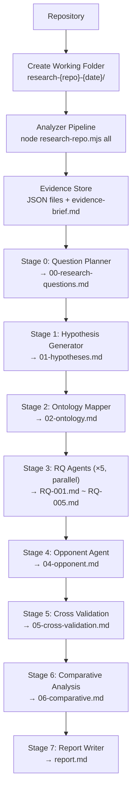
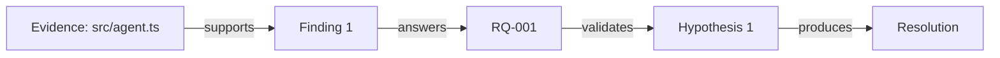

# Repository 研究

> 研究一个开源 Repository，并提炼其架构、设计思想、工程权衡与可复用模式，而不是仅仅解释代码。

---

## 目标

面向工程视角进行 Repository 研究。目标**不是**总结代码，而是回答：

- 为什么这个 Repository 要这样设计？
- 它在解决哪些工程问题？
- 哪些模式是可复用的？
- 哪些思想可以迁移到别处？
- AI/Agent 工程师能从中学习到什么？

输出应更像架构评审或工程设计文档，而非代码文档。

---

## 输入

Repository 已克隆到本地。

可选：

- Repository URL
- Branch
- 关注的目录
- 要回答的问题

---

## Research Rules

1. **Research Questions**
   Generate only high-impact, evidence-rich and transferable questions.
   Discard questions lacking sufficient repository evidence.

2. **Hypothesis**
   Maintain Bayesian hypotheses.
   Every hypothesis must include competing hypotheses.
   Update confidence as evidence accumulates.

3. **Findings**
   Every finding must include:
   - Evidence
   - Counter Evidence
   - Alternative Interpretation
   - Unknowns
   - Importance (Critical / High / Medium / Low)
   - Confidence (High / Medium / Low)

4. **Validation**
   Every finding must be challenged by an Opponent Agent.
   Only validated findings may appear in the final report.

5. **Reporting**
   The final report is decision-centric.
   Describe engineering decisions, tradeoffs and reusable patterns rather than file summaries.

---

## Workflow


```mermaid
flowchart TD
  A[Repository] --> WF["Create Working Folder<br/>research-{repo}-{date}/"]
  WF --> DA["Analyzer Pipeline<br/>node research-repo.mjs all"]
  DA --> ES["Evidence Store<br/>JSON files + evidence-brief.md"]
  ES --> S0["Stage 0: Question Planner<br/>→ 00-research-questions.md"]
  S0 --> S1["Stage 1: Hypothesis Generator<br/>→ 01-hypotheses.md"]
  S1 --> S2["Stage 2: Ontology Mapper<br/>→ 02-ontology.md"]
  S2 --> S3["Stage 3: RQ Agents (×5, parallel)<br/>→ RQ-001.md ~ RQ-005.md"]
  S3 --> S4["Stage 4: Opponent Agent<br/>→ 04-opponent.md"]
  S4 --> S5["Stage 5: Cross Validation<br/>→ 05-cross-validation.md"]
  S5 --> S6["Stage 6: Comparative Analysis<br/>→ 06-comparative.md"]
  S6 --> S7["Stage 7: Report Writer<br/>→ report.md"]
```

### Stage 0 — Question Planner

**Input**: `evidence-brief.md`, `evidence-store/full.json`, `evidence-store/interesting_files.json`

**Task**: Generate 5 Research Questions tailored to this repository. Do NOT use fixed templates.

**Two-Phase Process**:

1. **Candidate Generation**: Brainstorm 8-10 candidate questions covering different dimensions (architecture / design decisions / engineering tradeoffs / evolution / anti-patterns).

2. **5-Dimension Scoring & Selection**: Score each candidate (1-5 per dimension):

| Dimension | 1 point | 5 points |
|-----------|---------|----------|
| **Impact** | Surface fact (what tech) | Disruptive insight (why designed this way) |
| **Novelty** | README says it directly | Must read source to answer |
| **Evidence Rich** | No evidence, pure speculation | Multiple files/tests/commits verify |
| **Transferable** | Only applies to this project | Transfers to other systems |
| **Controversial** | Only one reasonable approach | Clear design tradeoff exists |

**Elimination rules**:
- Controversial = 1 → eliminate (no controversy = not worth researching)
- Evidence Rich = 1 → eliminate (unverifiable = not worth researching)
- Pick top 5 by total score

**Output**: `00-research-questions.md`

Each question must include:
- **Priority**: Critical / High / Medium
- **Importance**: Critical / High / Medium / Low
- **Reason**: Why this question is critical for understanding the repository
- **Expected Evidence**: Which files are expected to contain answers
- **Hypothesis**: Initial hypothesis (falsifiable)
- **Score**: 5-dimension scores + total

**Constraints**:
- Each question must be **falsifiable** (can answer "yes" or "no")
- Each question must have explicit **evidence expectations**
- Don't ask surface questions ("what tech stack"), ask deep questions ("why designed this way")

### Stage 1 — Hypothesis Generator

**Input**: `evidence-brief.md`, `evidence-store/full.json`, `evidence-store/interesting_files.json`

**Task**: Generate 3-5 testable, architecture-level hypotheses using Bayesian confidence evolution.

Each hypothesis MUST contain:
1. **Hypothesis statement** (one sentence, falsifiable)
2. **Prior confidence** (0-100%)
3. **Supporting evidence** (cite file paths or brief sections)
4. **If true, what it implies**
5. **If false, what it implies** (alternative explanation)
6. **How to verify** (which source files/tests/docs to inspect)
7. **Confidence evolution history** (table):

```markdown
| Evidence Source | Confidence Change | Reason |
|-----------------|-------------------|--------|
| Prior | 15% | Initial observation |
| architecture.json | 62% | Found modular design |
| tests/ | 80% | Tests verify critical paths |
```

8. **Competing Hypothesis** (MANDATORY):

```markdown
### Competing Hypothesis
- **Statement**: {alternative explanation, one sentence}
- **Prior confidence**: N%
- **Confidence**: N% (lower than main hypothesis)
- **Why weaker than main**: {brief}
- **How to falsify**: {what evidence needed}
```

A hypothesis is considered stable only if its confidence is **significantly higher** than the competing hypothesis.

**Output**: `01-hypotheses.md`

### Stage 2 — Ontology Mapper

**Input**: `evidence-brief.md`, `evidence-store/ontology.json`, `evidence-store/full.json`, `evidence-store/symbols.json`

**Task**: Extract the shared semantic layer — static objects + behavior graph + decision layer.

**Part 1: Static Objects**
- **Component**: Core modules
- **Interface**: Component protocols
- **Service**: Capability providers
- **Adapter**: External system adapters
- **Workflow**: End-to-end business flows
- **Prompt**: Prompt templates/variables
- **Tool**: Tool definitions/registrations

**Part 2: Execution Graph (Behavior Ontology)**

Not a Dependency Graph. Map actual execution flow:

```
Tool → EXECUTES → Workflow → EMITS → Event → TRIGGERS → Prompt → CALLS → LLM
```

**Part 3: Decision Ontology** (output only when evidence supports)
- **Decision**: Architecture decisions
- **Policy**: Constraint policies
- **Constraint**: Technical constraints
- **Observation**: Observed phenomena
- **Resolution**: Research conclusions

Decision relation verbs: `EXECUTES` / `EMITS` / `TRIGGERS` / `CALLS` / `JUSTIFIES` / `SUPPORTS` / `PROVES` / `ANSWERS` / `CONSTRAINS`

**Output**: `02-ontology.md`

**Constraints**:
- Every entity must have file path evidence
- Execution Graph must be based on actual call chains — no speculation
- Decisions / Policies / Constraints only output when evidence supports; omit the section if no evidence

### Stage 3 — Research Question Agents (×5, parallel)

**Input**: `00-research-questions.md`, `01-hypotheses.md`, `02-ontology.md`, `evidence-brief.md`, `evidence-store/full.json`, `evidence-store/interesting_files.json`

**Task**: Each agent reads its assigned question from `00-research-questions.md` (`## QN`), then validates or refutes the related hypothesis.

**Evidence Budget**:
- Max 50 files read
- Max 200 symbols (functions/classes) read
- Stop when confidence stabilizes

**Output**: `RQ-001.md` ~ `RQ-005.md`

Each Finding MUST include:
- **Conclusion**
- **Importance**: Critical / High / Medium / Low (independent from Confidence)
- **Evidence**: `file.py:L10-L30` or brief §X
- **Counter Evidence**: Evidence contradicting the conclusion (MANDATORY)
- **Alternative Interpretation**: Other explanations (MANDATORY)
- **Confidence**: High / Medium / Low
- **Unknowns**: What source verification is still needed

**RQ Status lifecycle**: Open → Investigating → Validated / Rejected / Needs Evidence

Cross-RQ shared findings → write to `shared-findings.md`

### Stage 4 — Opponent Agent

**Input**: All `RQ-*.md`, `evidence-brief.md`, `evidence-store/full.json`

**Task**: Prove every Finding wrong.

For each Finding:
1. **Direct contradiction**: Is there a direct call/cycle/exception?
2. **Test counterexample**: Is there a test proving the conclusion wrong?
3. **Alternative explanation**: Is there a simpler explanation?
4. **Missing evidence**: Is there evidence that should exist but doesn't?

**Output**: `04-opponent.md`

**Constraints**:
- Do not accept any Finding as true — your job is to question
- Every attack must have evidence support
- If no counterexample found, explicitly state "no counterexample found"

### Stage 5 — Cross Validation + Evidence Graph

**Input**: `00-research-questions.md`, `01-hypotheses.md`, `02-ontology.md`, all `RQ-*.md`, `04-opponent.md`, `evidence-brief.md`

**Task**:
1. Update RQ Status based on evidence and Opponent report
2. Validate hypotheses (supported / refuted / insufficient evidence)
3. Identify inter-evidence conflicts
4. Calibrate confidence (upgrade/downgrade Findings)
5. Build Evidence Graph

**Evidence Graph**:


```mermaid
graph LR
    E1[Evidence: src/agent.ts] -->|supports| F1[Finding 1]
    F1 -->|answers| Q1[RQ-001]
    Q1 -->|validates| H1[Hypothesis 1]
    H1 -->|produces| R1[Resolution]
```

| Evidence | Supports | Finding | Answers | RQ | Validates | Hypothesis | Confidence |
|----------|----------|---------|---------|----|----|------------|------------|
| src/agent.ts:L45-L80 | supports | F1 | answers | Q1 | validates | H1 | 0.85 |

**Output**: `05-cross-validation.md`

### Stage 6 — Comparative Analysis (optional)

**Input**: `evidence-brief.md`, `02-ontology.md`, relevant `RQ-*.md`, `05-cross-validation.md`

**Task**: Compare with **explicitly listed projects only** (do NOT invent other projects):
- OpenAI Agents SDK
- LangGraph
- Claude Code
- Codex
- AutoGen
- CrewAI
- MCP

**Output**: `06-comparative.md`

**Constraint**: Only compare subsystems with meaningful design differences. Avoid superficial feature matrices.

### Stage 7 — Report Writer

**Input**: All above outputs (only cite Validated RQs)

**Task**: Write final engineering research report using Research Trace format.

**Research Trace Format** (records investigation process, not just conclusions):

```markdown
## RQ-001: {Question}

### Investigation
Initially believed...
Found contrary evidence...
Changed belief...

### Turning Point
The key evidence that changed understanding was...

### Resolution
Final resolution: ...
Confidence: High / Medium / Low
Evidence Graph: [cite from 05-cross-validation.md]
```

**Output**: `report.md`

---

## Evidence Store

每次研究会话必须在开始任何分析前创建 working folder。工作目录包含 Evidence Store——由确定性脚本生成的一组结构化 JSON 文件。LLM 不会直接遍历 Repository，而是消费 Evidence Store。

### 目录结构

```
research-{repo-name}-{YYYYMMDD}/
├── evidence-store/             # Script-generated analysis output
│   ├── full.json               # Slim index: all sections as summaries + _ref pointers
│   ├── symbols.json            # Full Semantic Index: functions, classes, calls, strings
│   ├── ontology.json           # Full Ontology: objects + semantic relationships
│   ├── architecture.json       # Full dependency graph: nodes + edges
│   └── ...                     # Individual analyzer outputs
├── evidence-brief.md           # Condensed evidence + derived insights
├── 00-research-questions.md    # Stage 0 output
├── 01-hypotheses.md            # Stage 1 output
├── 02-ontology.md              # Stage 2 output
├── RQ-001.md ... RQ-005.md     # Stage 3 output (parallel)
├── shared-findings.md          # Cross-RQ shared findings
├── 04-opponent.md              # Stage 4 output
├── 05-cross-validation.md      # Stage 5 output
├── 06-comparative.md           # Stage 6 output
└── report.md                   # Final report (Stage 7)
```

### Evidence Store 优势

1. **可缓存**：Repository 未变更 → 跳过重新分析，复用 JSON
2. **可追溯**：每个 LLM 结论都可追溯到某条 JSON Evidence
3. **可扩展**：新增 Analyzer → 新增 JSON 文件，无需改动 Skill 流程

### 精简版 `full.json` 设计

当 working directory 中存在 `evidence-store/` 时，`all` 命令会自动将较大部分拆分为独立文件：

| Section | In slim `full.json` | In separate file | Rationale |
|---------|---------------------|------------------|-----------|
| `symbols` | Summary counts + `_ref` | `symbols.json` | Raw function/class/call arrays are 1-40MB |
| `ontology` | Type/rel summaries + `_ref` | `ontology.json` | Object/relationship arrays are 0.5-7MB |
| `architecture` | Node/edge counts + cycles + centrality + `_ref` | `architecture.json` | Graph nodes/edges are 0.1-1.5MB |
| All other sections | Full data | — | Small enough for git (< 30KB each) |

### Evidence 文件格式

**`discovery.json`**：
```json
{
  "repoName": "example-project",
  "repoPath": "/abs/path",
  "manifest": { "language": "python", "entry": "pyproject.toml", "name": "example-project", "version": "1.0.0" },
  "topLevelDirs": ["src", "tests", "docs"],
  "fileCount": { ".py": 120, ".md": 45 },
  "testFileCount": 48
}
```

**`architecture.json`**：
```json
{
  "totalNodes": 304,
  "totalEdges": 435,
  "cycles": [["module.a", "module.b"]],
  "centrality": {
    "topByInDegree": [{ "id": "core.types", "inDegree": 15 }],
    "topByPageRank": [{ "id": "core.types", "score": 0.082 }]
  }
}
```

**`interesting_files.json`**：
```json
{
  "topFiles": [
    { "path": "README.md", "score": 90, "reasons": ["README +50", "high pagerank +40"] }
  ]
}
```

### RQ Agent 输出格式

每个 `RQ-*.md` 文件遵循如下格式：

```markdown
## Research Question
{动态生成的问题陈述}

## Hypothesis Evaluation
| 假设 | 状态 | 证据 | 置信度演进 |
|------|------|------|------------|
| H-XXX: ... | 支持 / 反驳 / 证据不足 | ... | 15% → 62% → 80% |

## Findings
### Finding 1: {Title}
- **Conclusion**: ...
- **Importance**: Critical / High / Medium / Low
- **Evidence**: `file.py:L10-L30`, brief §X
- **Counter Evidence**: 与结论矛盾的证据
- **Alternative Interpretation**: 其他解释
- **Confidence**: High / Medium / Low
- **Unknowns**: 还需要哪些源码验证

## Shared Findings
- **SF-001**: {简述} — 详见 shared-findings.md

## RQ Status
- [x] Investigating
- [ ] Validated / Rejected / Needs Evidence
```

### 命名约定

- 目录：`research-{repo-basename}-{YYYYMMDD}`（例如 `research-my-project-20260721`）
- Evidence Store JSON：`{analysis-name}.json`，kebab-case
- LLM evidence：`{focus-area}.md`，kebab-case

---

## CLI Commands

```bash
# Run individual analyzers (each prints JSON to stdout)
node research-repo.mjs discovery    <repoPath>  > evidence-store/discovery.json
node research-repo.mjs architecture <repoPath>  > evidence-store/architecture.json
node research-repo.mjs entrypoints  <repoPath>  > evidence-store/entrypoints.json
node research-repo.mjs prompts      <repoPath>  > evidence-store/prompts.json
node research-repo.mjs tools        <repoPath>  > evidence-store/tools.json
node research-repo.mjs tests        <repoPath>  > evidence-store/tests.json
node research-repo.mjs evaluations  <repoPath>  > evidence-store/evaluations.json
node research-repo.mjs git          <repoPath>  > evidence-store/git_history.json
node research-repo.mjs ci           <repoPath>  > evidence-store/ci.json
node research-repo.mjs symbols      <repoPath>  > evidence-store/symbols.json
node research-repo.mjs ranking      <repoPath>  > evidence-store/interesting_files.json

# Run all analyzers at once
node research-repo.mjs all <repoPath> > evidence-store/full.json

# Generate Evidence Brief (evidence-only, no LLM prompt)
# Use --lang=zh for Chinese evidence brief
node research-repo.mjs report <repoPath> > evidence-brief.md
node research-repo.mjs report --lang=zh <repoPath> > evidence-brief.md

# Incremental update (git diff → re-analyze changed files → merge)
node research-repo.mjs update <repoPath> > evidence-store/full.json
```

### Analyzer 目录

| Command | Output JSON | Analyzer | AST-powered |
|---------|------------|----------|-------------|
| `discovery` | `discovery.json` | Manifest, file tree, top-level dirs | No |
| `architecture` | `architecture.json` | Import graph, PageRank, cycles | Tree-sitter |
| `entrypoints` | `entrypoints.json` | CLI/server/sdk/example entry | Tree-sitter |
| `prompts` | `prompts.json` | System prompts, templates, variables | Tree-sitter |
| `tools` | `tools.json` | @tool/Tool()/server.tool registration | Tree-sitter |
| `tests` | `tests.json` | Test categorization, pattern detection | No |
| `evaluations` | `evaluations.json` | Eval/benchmark/rubric discovery | No |
| `git` | `git_history.json` | Commits, contributors, refactors, tags | No |
| `ci` | `ci.json` | CI provider, workflows, triggers | No |
| `symbols` | `symbols.json` | Semantic Index | Tree-sitter |
| `ranking` | `interesting_files.json` | File scoring → top 20 reading priority | No |
| `report` | `evidence-brief.md` | Evidence Brief (evidence-only) | No |
| `update` | `full.json` | Incremental analysis (git diff → merge) | Tree-sitter |

### Semantic Index（`symbols` 命令）

Semantic Index 是整个 Repository 的符号级索引，由 Tree-sitter 构建。LLM 通过查询该索引代替扫描代码。

```json
{
  "functions": [
    { "name": "process", "file": "core/processor.py", "line": 203, "params": ["input", "config"], "decorators": ["@handler"] }
  ],
  "classes": [
    { "name": "Entity", "file": "models/base.py", "line": 59, "bases": ["dataclass"], "methods": ["validate"] }
  ],
  "imports": [
    { "file": "processor.py", "what": "Config", "from": "types" }
  ],
  "calls": [
    { "file": "processor.py", "line": 250, "caller": "execute_task", "callee": "decide" }
  ],
  "strings": [
    { "file": "prompt.ts", "line": 10, "name": "SYSTEM_PROMPT", "length": 500 }
  ]
}
```

### 增量分析（`update` 命令）

当 Repository 出现新代码，`update` 命令执行增量分析：

1. **加载**之前的 `evidence-store/full.json`（必须包含 `_meta.lastCommit`）
2. 通过 `git diff --name-only <lastCommit>..HEAD` **检测变更**
3. **仅重新分析变更文件**
4. **合并结果**——过滤旧条目，添加新条目
5. **重建聚合数据**——architecture graph、centrality、ranking
6. 从合并数据**重新生成** plan、questions 与 evidence brief
7. 使用更新后的 `_meta` 保存

**会增量合并的内容**（文件级 Analyzer）：
- `symbols` — functions、classes、imports、calls、strings
- `entrypoints` — 入口点
- `prompts` — Prompt 定义
- `tools` — Tool 注册
- `tests` — 测试文件
- `evaluations` — eval 文件

**总是重新运行的内容**（成本低或需要全量扫描）：
- `discovery` — 全文件树扫描
- `git` — Git 历史
- `ci` — CI 工作流扫描
- `architecture` — 从合并后的 symbols 重建
- `ranking` — 从合并后的 architecture + entrypoints 重建

---

## Subagent 派发

### Prompt 模板

Prompt 模板是 skill 目录下的静态 markdown 文件（`prompts/*.md`），无需生成。主 Agent 读取模板后替换占位符即可派发。

| 模板文件 | 目标输出 | 占位符 | 说明 |
|----------|----------|--------|------|
| `prompts/00-question-planner.md` | `00-research-questions.md` | `{repoName}` | 动态生成 5 个 Research Question |
| `prompts/01-hypothesis.md` | `01-hypotheses.md` | `{repoName}` | 贝叶斯假设（Prior → Posterior） |
| `prompts/02-ontology.md` | `02-ontology.md` | `{repoName}` | 行为本体（静态对象 + Execution Graph） |
| `prompts/03-research-agent.md` | `RQ-{rqId}.md` | `{repoName}` `{questionIndex}` `{rqId}` | 动态 RQ Agent（实例化 5 次：questionIndex=1..5, rqId=001..005） |
| `prompts/04-opponent.md` | `04-opponent.md` | `{repoName}` | 反证者：攻击每个 Finding |
| `prompts/05-cross-validation.md` | `05-cross-validation.md` | `{repoName}` | 交叉验证 + Evidence Graph |
| `prompts/06-comparative.md` | `06-comparative.md` | `{repoName}` | 与显式列出的同类项目对比 |
| `prompts/07-report-writer.md` | `report.md` | `{repoName}` | Research Trace 格式报告 |

### 派发方式

主 Agent 读取 `prompts/XX.md`，替换 `{repoName}`（及 `{questionIndex}` / `{rqId}`）为实际值，交给独立的 LLM subagent 执行。使用 `Task` 工具（`subagent_type=general_purpose_task`）：

1. 读取 `prompts/XX.md` 模板
2. 替换占位符（`{repoName}` → 仓库名，`{questionIndex}` → 1/2/3/4/5，`{rqId}` → 001/002/003/004/005）
3. 告知 subagent 当前 working folder 路径
4. 把替换后的 prompt 贴给 subagent
5. 要求 subagent 读完证据后，把输出写入对应的 target 文件

**执行顺序**：

```
Stage 0: 00-question-planner      → 00-research-questions.md
Stage 1: 01-hypothesis            → 01-hypotheses.md
Stage 2: 02-ontology              → 02-ontology.md
Stage 3: RQ-001 ~ RQ-005          → RQ-001.md ~ RQ-005.md (parallel)
Stage 4: 04-opponent              → 04-opponent.md
Stage 5: 05-cross-validation      → 05-cross-validation.md
Stage 6: 06-comparative           → 06-comparative.md (optional)
Stage 7: 07-report-writer         → report.md
```

Subagent 不是读所有源码，而是读 Evidence Brief + 相关 JSON + 被 Semantic Index 定位的关键文件。

---

## Report 结构

最终交付物是 `report.md`。围绕 Research Questions 与 Resolutions 组织。每个主张必须追溯到具体的 Resolution（`[R-XXX]`）或源代码路径。

### 1. Executive Summary

仅三句话：
- **Identity**：这是什么项目？（一句话定位，不列技术栈）
- **Key Discovery**：最能改变理解的单一发现是什么？（引用 `[R-XXX]`）
- **Recommendation**：读者应该记住或做什么？（一条可执行的洞察）

### 2. Research Traces

5 条精悍 Trace。每条 Trace：
- 从一个 Research Question 出发
- 先列 Evidence，再列 Analyzer Claims
- 将所有冲突合成为 Final Verdict
- 说明 **Fact** 与 **Interpretation**
- 解释 **Why it matters**
- 使用结构：**Question → Investigation → Turning Point → Resolution**

### 3. Engineering Decisions

报告是 Decision Report，不是 Architecture Report。每个 Decision 必须包含：

```markdown
### Decision D-001: {决策标题}
- **Decision**: {一句话决策陈述}
- **Why**: {为什么做这个决策}
- **Evidence**: `file.py:L10-L30`, [F-XXX]
- **Tradeoff**: {放弃了什么}
- **Alternative**: {考虑过但拒绝的替代方案}
- **Status**: Accepted / Deprecated / Superseded
- **Learning**: {可迁移的工程教训}
```

### 4. Negative Findings

什么没有被发现以及为何重要。

### 5. Architecture Smells

潜在设计风险，用"Potential"措辞。每个 smell 需要 Evidence 和 Confidence。

### 6. Architecture Fitness

按以下维度评分（★1-5），引用证据：

```markdown
| Dimension | Score | Evidence | Note |
|-----------|-------|----------|------|
| Modularity | ★★★★☆ | architecture.json: 0 cycles | 清晰的模块边界 |
| Extensibility | ★★★☆☆ | plugins/ dir | 插件机制存在但文档少 |
| Testability | ★★★★★ | testFileCount=120 | 测试覆盖核心路径 |
| Observability | ★★☆☆☆ | 无 metrics | 缺少可观测性 |
| Evolution | ★★★★☆ | git_history: 稳定增长 | 健康的演进节奏 |
| Performance | ★★★☆☆ | benchmark/ | 有基准但未持续 |
| Developer Experience | ★★★★☆ | docs/ 完整 | 文档质量高 |
```

### 7. Architecture Compression

```markdown
### Architecture in 300 words
{300 字摘要——核心架构、关键决策、主要权衡}

### Architecture in 100 words
{100 字摘要——压缩到本质}

### Architecture in 30 words
{30 字摘要——一句话定义这个系统}
```

如果压缩不了，说明其实没有理解。

### 8. Repository Positioning

生态定位，跨越维度：Planning、Execution、Memory、Evaluation、Guardrails、Prompt、Tooling、Observability。使用成熟度标签：Emerging / Common / Advanced / Unique。

### 9. Reusable Pattern Catalog

结构化表格：Pattern / Description / Location / Reusability（✅ general / ⚠️ needs adaptation / ❌ scenario-specific）。

### 10. What NOT to Learn

```markdown
### 值得学习（Things worth learning）
- ★★★★★ {模式/决策/思想} — {为何值得}
- ★★★★☆ {模式/决策/思想} — {为何值得}

### 不值得复制（Things NOT worth copying）
- {具体内容} — {为何不值得（历史包袱/临时方案/特定上下文）}
```

明确区分"值得学"和"不要抄"。

### 11. Architecture Evolution

Major refactors、新增的控制面、废弃的 API，以及项目如何演变成当前形态。

### 12. Reading Guide

30 分钟快速浏览（5 个文件）+ 2 小时深度阅读（+10 个文件），按洞察密度排序。

### 13. Open Questions

需要后续研究的问题，每个都带重要性和建议的调查方法。

---

## Anti-Fabrication Constraints

Report Writer 必须遵循以下 7 条反伪造约束：

1. **ID Integrity**: 引用的每个 `[F-XXX]` 必须对应 evidence-brief.md 中的真实 Finding ID。禁止发明新 ID。
2. **Confidence Verbatim**: `confidence=X.XX` 必须与 brief 表格逐字符匹配。禁止四舍五入或篡改。
3. **No Status Inversion**: brief 中 `✅ verified` 的 Finding 不得被描述为 `rejected`，反之亦然。
4. **Number Integrity**: 所有计数（tools/prompts/evals/tests）必须逐字引用自 brief。
5. **No Content Fabrication**: 引用 Finding 文本时，必须与 brief 的 `finding` 字段匹配。
6. **Quote-then-Critique**: 对于要 Reject / Downgrade 的 Finding，必须先逐字引用 brief 完整行，再给出判断。
7. **Contradiction Bidirectional Check**: 声称 brief "自相矛盾"时，必须先逐字引用 brief §A `consistency.contradictions[]` 和 `consistency.warnings[]` 的实际内容。

**Finding Citation Format**: `[F-001 @ Q1, confidence=0.85, verified]`

---

## Report 质量原则

| 原则 | 要求 |
|------|------|
| **Trace density over coverage** | 每个 Trace 必须回答一个会改变工程师理解的架构问题。5 条精悍 Trace 胜过 8 条平庸 Trace。 |
| **Importance ranking** | 每个 Trace 标注 Critical / High / Medium / Low。 |
| **Why it matters** | 每个 Trace 用一句话说明：如果没有这个洞察，读者会如何误读系统。 |
| **Fact vs Interpretation** | Fact 是无争议的；Interpretation 是判断。读者知道什么是证据，什么是你的判断。 |
| **Compressed Executive Summary** | 只分三部分：Identity / Key Discovery / Recommendation。不列技术栈。 |
| **Unified Confidence standard** | High = ≥3 个独立证据源；Medium = 2；Low = 1；Speculative = 无直接证据。 |

---

## 研究内容

### Architecture
Overall architecture, Layering, Responsibilities, Module boundaries, Dependency direction, Initialization flow, Lifecycle, Execution pipeline, Event flow, Data flow, Extension points, Plugin system, Configuration.

### Design Philosophy
作者想解决什么问题？为什么选择这个抽象？为什么不是另一种架构？做了哪些权衡？

### AI Agent Harness
Agent lifecycle, Planning, Execution, Reflection, Retry, Parallelism, Delegation, Cancellation, Checkpoint, Streaming, Context propagation, Human approval, Multi-agent orchestration, Loop prevention, State management, Failure recovery.

### Prompt Engineering
System prompts, Planning prompts, Reflection prompts, Repair prompts, Tool prompts, Compression prompts, Summarization prompts, Hidden prompts, Prompt templates, Few-shot examples, Prompt composition, Dynamic prompt generation, Prompt injection defenses. Prompt evolution, versioning, assembly pipeline, template engine, tool description generation, automatic compression, testing and regression.

### Context Engineering
Conversation memory, Working memory, Scratchpad, Compression, Sliding window, Retrieval, Context selection, Context prioritization, Context pruning, Conversation replay.

### Tool Framework
Tool registration, Schemas, Validation, Permission model, Timeout, Retry, Streaming, Error handling, Approval, Sandbox, Security.

### Guardrails
Hallucination prevention, Prompt injection, Loop detection, Budget limits, Max iterations, Tool whitelist, Permission control, Dangerous operations, Human confirmation, Rate limiting, Resource protection.

### Evaluation & Reliability Engineering
Benchmarks, Regression tests, Golden tests, Snapshots, Reference outputs, Judge LLM, Human evaluation, Rubrics, Metrics, Pass rate, Failure rate, Coverage. Determinism, Replayability, Reproducibility, Cost evaluation, Latency evaluation, Failure analysis, Flakiness mitigation.

### Testing Strategy
Unit tests, Integration tests, E2E, Simulation, Fake LLM, Mock Tool, Golden datasets, Replay, Deterministic execution, Recorded conversations, Regression suite.

### Verification
CI, Regression, Golden outputs, Benchmarks, Evaluation pipelines, Replay tests, Deterministic mode.

### Interesting Engineering Ideas
Interesting abstractions, Elegant APIs, Reusable patterns, Small but clever implementations, Novel architecture, Unexpected simplifications, Performance optimizations, Engineering tricks, Developer experience improvements.

### Architecture Evolution
Major refactors, Breaking changes, Deprecated ideas, Evolution of prompts, Evolution of evaluation methodology, Evolution of APIs, Lessons learned from commit messages, PR descriptions, issue threads.

### Interesting Questions
- Why is this abstraction necessary?
- What would break if this module were removed?
- What is the smallest useful architecture this could be reduced to?
- Which modules are accidental complexity vs. essential complexity?
- Where is the real innovation?
- Which decisions appear over-engineered?
- Which ideas survived across multiple releases?

---

## Evidence 收集

每个结论都应包含 Evidence。

示例：

> **结论**：该框架有意将 planning 与 execution 分离。
>
> **证据**：`planner.ts`、`Runner.ts`、`ExecutionContext.ts`、`planner.test.ts`
>
> **Confidence**：High
>
> **原因**：多个模块一致地实现了这种分离。

永远不要做无支持的断言。始终标明 **High / Medium / Low** Confidence。

**不要推测。** 没有 Evidence 就不要推断架构。如果 Evidence 不足，请说 **Unknown** 而不是猜测。

---

## Cross Validation

只要可能，就用多个来源验证结论：Architecture、Tests、Comments、Documentation、Prompts、Configuration、Examples、CI、Benchmarks。而不是依赖单一来源。

---

## 研究心态

**不要按顺序读文件。** 相反，要持续构建假设。

例如：

> **假设**：该框架可能会把 planning 与 execution 分离。
>
> **证据**：`Planner`、`Runner`、`ToolExecutor`、`Context`
>
> **结论**：Planning 与 execution 被有意解耦。

永远不要产出逐行文件摘要。永远产出：

```
Problem → Design → Evidence → Tradeoff → Takeaway
```

---

## 阅读策略

按以下顺序研究 Repository：

1. **README 与文档** —— 目的、设计哲学、快速开始
2. **Examples** —— 作者希望它如何被使用；设计意图在这里
3. **Tests** —— 预期行为、边界情况、不变式
4. **Public APIs** —— 接口契约、类型签名
5. **Core architecture** —— 模块边界、依赖方向
6. **Internal implementation** —— 在理解上述内容之后再读
7. **Benchmarks and evaluation** —— 团队测量和优化什么
8. **CI and release workflow** —— 质量门禁、发布流水线

---

## 输出风格

关注：Architecture、Engineering thinking、Tradeoffs、Patterns、Reasoning。

避免：冗长的文件摘要、逐行解释、函数走读、大段代码转储。

---

## 核心依赖

所有依赖都在根目录 `package.json` 的 `devDependencies` 中。脚本使用动态 `import()` 并优雅降级——零硬依赖，但预期已安装 Tree-sitter。

| Package | Role | Fallback |
|---------|------|----------|
| `web-tree-sitter` | 统一多语言 AST parser（WASM） | 正则启发式 |
| `tree-sitter-wasms` | 预构建 WASM 语法（Python/TS/JS/Rust/Go/Java） | N/A |
| `graphology` | 图算法（PageRank、centrality、cycles） | 纯 JS 实现 |
| `fast-glob` | 高性能文件匹配 | 内置 `readdirSync` |
| `simple-git` | Git 历史分析 | `child_process` shell-out |
| `yaml` | 解析 GitHub Actions / CI 配置 | 正则提取 |

---

## 成功标准

一份成功的报告应让有经验的工程师理解：

- 这个 Repository 为何存在
- 它解决了哪些工程问题
- 哪些架构决策是重要的
- AI Agent 是如何设计与约束的
- Prompt 是如何组织与演化的
- Evaluation 与 Testing 如何保障可靠性
- 哪些实现模式是可复用的
- 哪些想法是独特或特别优雅的
- 哪些文件和测试是深入研究的最高价值入口

读者读完报告后，应该知道接下来两小时该读哪些源代码。
