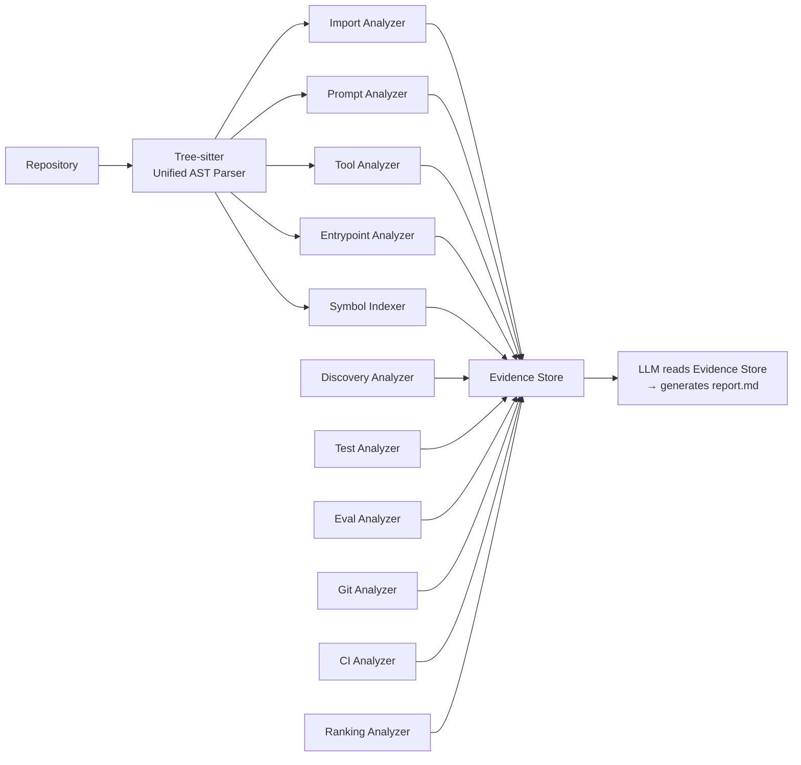
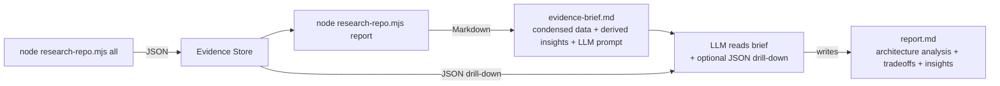
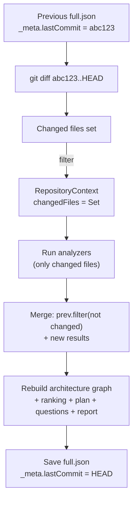
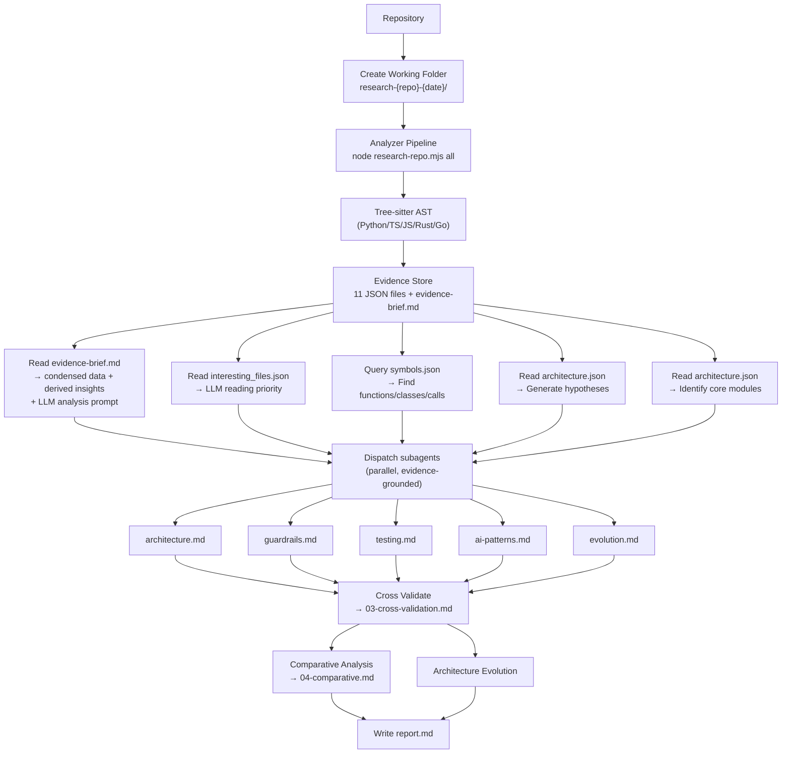

# Repository 研究

> 研究一个开源 Repository，并提炼其架构、设计思想、工程权衡与可复用模式，而不是仅仅解释代码。

---

## 目标

本 Skill 面向工程视角进行 Repository 研究。

目标**不是**总结代码。

目标是回答：

- 为什么这个 Repository 要这样设计？
- 它在解决哪些工程问题？
- 哪些模式是可复用的？
- 哪些思想可以迁移到别处？
- AI/Agent 工程师能从中学习到什么？

输出应更像架构评审或工程设计文档，而非代码文档。

---

## 适用的 Repository

特别适用于：

- AI Agent 框架（OpenAI Agents SDK、Claude Code、Codex CLI、LangGraph、PydanticAI、CrewAI、AutoGen）
- AI 编程 Agent（OpenHands、Continue、Cline、Goose、Aider、Cursor）
- MCP Server
- 研究系统
- RAG 框架
- Evaluation 框架
- 编译器项目
- 数据库
- 分布式系统
- 浏览器
- 开发者工具（uv、Ruff、Bun、Vite）

---

## 输入

Repository 已克隆到本地。

可选：

- Repository URL
- Branch
- 关注的目录
- 要回答的问题

示例：

```
repo_path: ~/code/openai-agents
focus:
  - Agent Harness
  - Prompt
  - Evaluation
  - Architecture
```

---

## 工作目录与 Evidence Store

**每次研究会话都必须在开始任何分析前创建 working folder**。工作目录包含 **Evidence Store**——由确定性脚本生成的一组结构化 JSON 文件，以及由 LLM subagent 生成的 Markdown 文件。LLM 不会直接遍历 Repository，而是消费 Evidence Store。

### 目录结构

```
research-{repo-name}-{YYYYMMDD}/
├── evidence-store/             # Deterministic analysis output (script-generated)
│   ├── full.json               # Slim index: all sections as summaries + _ref pointers (< 300KB, git-friendly)
│   ├── symbols.json            # Full Semantic Index: functions, classes, calls, strings (gitignored, regenerable)
│   ├── ontology.json           # Full Ontology: objects + semantic relationships (gitignored, regenerable)
│   ├── architecture.json       # Full dependency graph: nodes + edges (gitignored, regenerable)
│   └── ...                     # Individual analyzer outputs (if run separately)
├── evidence-brief.md           # Condensed evidence + derived insights + LLM prompt (from `report` command)
├── 01-hypotheses.md            # LLM-generated hypotheses (from Evidence Store)
├── 02-evidence/                # LLM subagent evidence collection
│   ├── architecture.md         # Subagent: core architecture
│   ├── guardrails.md           # Subagent: guardrails & adapters
│   ├── testing.md              # Subagent: testing & evaluation
│   ├── ai-patterns.md          # Subagent: AI-specific design
│   └── evolution.md            # Subagent: architecture evolution
├── 03-cross-validation.md      # Cross validation results
├── 04-comparative.md           # Comparative analysis
├── research-repo.mjs           # Copied from skill directory
└── report.md                   # Final report (LLM-generated from evidence brief)
```

### 精简版 `full.json` 设计

当 working directory 中存在 `evidence-store/` 时，`all` 命令会自动将较大部分拆分为独立文件：

| Section | In slim `full.json` | In separate file | Rationale |
|---------|---------------------|------------------|-----------|
| `symbols` | Summary counts + `_ref` | `symbols.json` | Raw function/class/call arrays are 1-40MB |
| `ontology` | Type/rel summaries + `_ref` | `ontology.json` | Object/relationship arrays are 0.5-7MB |
| `architecture` | Node/edge counts + cycles + centrality + `_ref` | `architecture.json` | Graph nodes/edges are 0.1-1.5MB |
| All other sections | Full data | — | Small enough for git (< 30KB each) |


### Evidence Store 的优势

1. **可缓存**：Repository 未变更 → 跳过重新分析，复用 JSON
2. **可追溯**：每个 LLM 结论都可追溯到某条 JSON Evidence
3. **可扩展**：新增 Analyzer → 新增 JSON 文件，无需改动 Skill 流程

### Evidence 文件格式

每个 JSON 文件由 `research-repo.mjs` 生成。关键 schema 如下：

**`discovery.json`**：
```json
{
  "repoName": "example-project",
  "repoPath": "/abs/path",
  "manifest": { "language": "python", "entry": "pyproject.toml", "name": "example-project", "version": "1.0.0" },
  "topLevelDirs": ["src", "tests", "docs"],
  "fileCount": { ".py": 120, ".md": 45 },
  "testFileCount": 48
}
```

**`architecture.json`**：
```json
{
  "totalNodes": 304,
  "totalEdges": 435,
  "cycles": [["module.a", "module.b"]],
  "centrality": {
    "topByInDegree": [{ "id": "core.types", "inDegree": 15 }],
    "topByPageRank": [{ "id": "core.types", "score": 0.082 }]
  }
}
```

**`interesting_files.json`**：
```json
{
  "topFiles": [
    { "path": "README.md", "score": 90, "reasons": ["README +50", "high pagerank +40"] }
  ]
}
```

### LLM Evidence 文件格式

每个 `02-evidence/*.md` 文件遵循如下格式：

```markdown
# {Focus Area}

## Findings

### Finding 1: {Title}

**Conclusion**: ...
**Evidence**: `file.py:L10-L30`, `test.py:L5-L20`
**Confidence**: High / Medium / Low
**Reason**: ...

## Open Questions
- ...
```

### 命名约定

- 目录：`research-{repo-basename}-{YYYYMMDD}`（例如 `research-my-project-20260721`）
- Evidence Store JSON：`{analysis-name}.json`，kebab-case
- LLM evidence：`{focus-area}.md`，kebab-case

---

## Repository 发现

**在阅读任何实现之前**，先绘制 Repository 布局。

研究：

- README 与顶层文档
- `package.json` / `pyproject.toml` / `Cargo.toml` / `go.mod` —— 入口、脚本、依赖
- `Makefile` / `Justfile` / 构建脚本
- `examples/` / `docs/` / `benchmark/` / `eval/`
- `src/` / `lib/` / `internal/` —— 架构所在之处
- `tests/` / `__tests__/` / `spec/` —— 验证所在之处
- `.github/workflows/` —— CI/CD 流水线

识别：

- 架构在哪里
- Prompt 在哪里
- Eval 在哪里
- Test 在哪里

忽略：

- `vendor/` / `node_modules/` / 第三方
- 生成代码（`*.gen.ts`、`dist/`、`build/`）
- 快照与 lock 文件
- 大型数据文件

先回答：

> 本 Repository 的入口是 `X`。最重要的目录是 `A`、`B`、`C`。目录 `D` 和 `E` 可以跳过。

---

## Analyzer Pipeline 架构

本 Skill 采用**两级 Analyzer Pipeline**：

1. **Fact Extractor**（11 个 Analyzer）—— 回答“这个 Repository 包含什么？”，通过扫描文件、AST、Git 历史、CI 配置。
2. **Inference Engine**（7 个 Analyzer）—— 回答“为什么这样设计？”，通过对 Fact Extractor 的输出进行推理。

注意：LLM不能直接遍历 Repository，而是查询由两级 Analyzer 共同产出的 Evidence Store。

### Architecture Semantics Layer（Inference Engine）

七个基于规则的 Analyzer从事实提取提升到架构推理。每个 Analyzer 都产出带 Confidence 分数与 Evidence 的结构化 JSON，并在 Evidence Brief §2.5 以及 `analyze-output.mjs` 的 `summarize()` 中呈现。

| Analyzer | Input | Output | 核心价值 |
|----------|-------|--------|----------|
| `ArchitecturePatternAnalyzer` | discovery dirs + symbols + graph | Pattern（Hexagonal/Pipeline/Plugin/FSM/…）+ confidence | 告诉架构师“这是哪种架构？” |
| `ResponsibilityAnalyzer` | module naming + symbols + graph | Module → Responsibility 矩阵（例如 `planner/` → “Task Planning”） | 用语义角色标签替代“top PageRank” |
| `StabilityAnalyzer` | architecture graph + symbols | Robert C. Martin A/I 指标 + Zone（Pain/Uselessness/Sweet Spot）per module | 识别 god module 与过度抽象的组件 |
| `ChangeCouplingAnalyzer` | git log --name-only | 一起变更的文件对，分为 structural（有 import）或 logical（无 import 但共同变更） | 揭示隐藏的逻辑依赖——“Git 已经分析过了，再往前走一步” |
| `InformationFlowAnalyzer` | entrypoints + calls + symbols + responsibility | 端到端带标签的流（Request → Planner → Executor → LLM → Response） | 让架构师看清请求生命周期 |
| `DependencySmellAnalyzer` | graph + pattern + stability + responsibility | 层级违规、循环依赖（带上下文分类）、hub module、不稳定依赖 | 带严重级别与上下文的风险评估 |
| `CapabilityOntologyAnalyzer` | responsibility + tools + prompts + evals + symbols | 10 维能力成熟度矩阵（Planning/Execution/Retrieval/Memory/Evaluation/Safety/Tool/Context/IO/Persistence） | 回答“这个系统能做什么？缺少什么？” |

**依赖顺序**（必须在 `ANALYZERS` 数组中保持）：
`ArchitecturePattern → Responsibility → (Stability, ChangeCoupling, InformationFlow, DependencySmell) → CapabilityOntology`

**基于规则，而非 LLM** —— 按架构指令要求。全部 7 个 Analyzer 都使用确定性规则（目录命名、符号模式、图形状、Git 历史）。LLM 负责解释它们的输出，而不是生成它们。


### Evidence Quality Layer

两个脚本层补充使 Evidence Brief 能够自我披露每条结论的来源以及 Analyzer 之间的分歧：

#### A. ConsistencyAnalyzer（后处理器，最后运行）

一个注册在 `ANALYZERS` 末尾的 Analyzer 类。它对比 7 个 Inference Engine 的主张，产出两个列表：

| Output | Severity | 触发条件 |
|--------|----------|----------|
| `contradictions[]` | high/medium | 两个 Analyzer 提出不兼容的主张（例如 CapabilityOntology `isAIProject=false` 但 PromptsAnalyzer 发现了 prompts —— C1） |
| `warnings[]` | medium/low | 某个 Analyzer 的输出在另一个 Analyzer 看来可疑（例如 160 个 test 文件但 0 个 eval 文件 —— W1） |

共实现 6 条规则（C1–C4 矛盾，C5–C6 警告）：

| ID | 主题 | 对比的源 | 捕捉的问题 |
|----|------|----------|------------|
| C1 | AI 项目分类 | CapabilityOntology vs（Prompts/Tools/InformationFlow/Responsibility） | AI-context gate 把一个带有明确 AI 信号的 Repository 低分类 |
| C2 | Retrieval 能力 | ResponsibilityAnalyzer vs CapabilityOntology | ResponsibilityAnalyzer 对 Retrieval 的误标（非 RAG 的 search/query 符号） |
| C3 | Tool 能力 | ToolsAnalyzer vs CapabilityOntology | CapabilityOntology 的 bug：≥3 个 tools 但 `tool=missing`（应自动传播） |
| C4 | Pattern-Responsibility 覆盖 | ArchitecturePatternAnalyzer vs ResponsibilityAnalyzer | Microservices/Plugin 模式却没有任何 Service/Plugin-Interface 职责 |
| W1 | Pattern-Responsibility 覆盖（低） | 同 C4 | C4 的降级形式 |
| C5 | Test 与 Evaluation 覆盖 | TestsAnalyzer vs EvaluationsAnalyzer | 测试套件庞大但无 eval 基础设施（对研究型项目是关键缺口） |
| C6 | LLM 调用点 vs isAIProject | InformationFlowAnalyzer vs CapabilityOntology | LLM 调用点是唯一的 AI 信号（C1 的子集，当 C1 未触发时单独发出） |

**在 Brief 中的位置**：`_consistencyFindings()` 是 Brief 的**第一个**章节（在 Executive Brief 之前，在 Architecture Insights 之前）。Prompt 标题为“系统自己发现自己的矛盾，是最值钱的研究线索。LLM 应优先调查矛盾，再决定信任哪个分析器。”

**LLM Prompt 规则**：每个 high severity 的 contradiction 都必须成为一个 Research Trace（或被合并进一个 Trace）。如果矛盾最终判定为 Analyzer 误报，Trace 必须说明哪个 Analyzer 判断错误以及原因。如果无法解决，则放入 Open Questions。

#### B. EvidenceMeta（Analyzer 通过 `_meta` 自评）

四个 Inference Engine 在主输出之外附带 `_meta` 块。该块在 Evidence Brief §2.5 的“### 证据质量元信息（分析器自评）”中呈现：

```typescript
interface EvidenceMeta {
  source: "keyword" | "keyword+graph" | "regex+graph" | "inference";
  strength: "strong" | "moderate" | "weak";
  assumptions: string[];           // what the analyzer takes for granted
  limitations: string[];           // what it cannot detect
  possibleFalsePositives: string[];// known FP patterns
  checkedLocations: string[];      // where it looked (negative evidence scope)
  coverage: string;                // % or qualitative description
}
```

| Analyzer | source | strength | 为何是这个强度 |
|----------|--------|----------|----------------|
| `ArchitecturePatternAnalyzer` | keyword+graph | moderate | 由目录名驱动；会遗漏纯代码中的模式 |
| `ResponsibilityAnalyzer` | keyword | moderate | Token-prefix 匹配；会遗漏非传统命名 |
| `InformationFlowAnalyzer` | regex+graph | **weak** | 面向召回的 LLM_NAME_RE；在 `palette_generator`、`Completions` 类型名上已知误报；Rust `mod` 解析存在缺口 |
| `CapabilityOntologyAnalyzer` | inference | moderate | 启发式成熟度分数；受 AI context gate 约束 |

**LLM 使用规则**：引用 Analyzer 主张时，LLM 应参考 `strength`。`weak` Analyzer 的主张需要 LLM 先用源代码验证，然后才能信任。

**这给 Report 带来什么**：
- “ArchitecturePatternAnalyzer（strength=moderate）认为 X，但它的 _meta.limitations 指出 Y；我们通过源码验证……”
- “InformationFlowAnalyzer（strength=weak）检测到 3 个 LLM 调用点——我们把它当作线索而非结论，并手动检查了每个调用点。”

### Architecture Knowledge Layer

三个 Analyzer 将 Evidence Store 从“代码事实”提升为“架构知识”——回答系统**为什么**这样设计，而不仅是**包含什么**。每个都产出类似 ADR 的结构化输出，LLM 可直接引用。

#### A. DecisionAnalyzer

从 Analyzer 输出中提取 deliberate 设计选择。共 6 个决策类别：

| Category | Source | 示例 |
|----------|--------|------|
| structural | ArchitecturePattern | “采用 Event-Driven 架构模式” |
| modular | Responsibility | “在 3 个模块间分离职责” |
| capability | Tools vs Prompts ratio | “Tool 偏重设计（62 个 Tool，比例 15.5）” |
| integration | InformationFlow | “在 2 个文件中集中 LLM 调用点” |
| quality | Tests.testPatterns | “采用多策略测试：corpus、poison、stress” |
| negative | CapabilityOntology（缺失） | “故意省略 memory、planning 能力” |

每个决策携带 `benefit`、`tradeoff`、`alternatives`、`confidence`。Negative 决策（故意省略的能力）也包含省略本身带来的 `benefit` 和 `tradeoff`。

#### B. ConstraintAnalyzer

提取驱动决策的约束。共 5 个约束来源：

| Source | Detection | 示例 |
|--------|-----------|------|
| manifest | dependency names | “必须支持本地持久化存储（sqlite）”/“必须集成外部 LLM provider” |
| code | test patterns | “必须抵抗对抗输入（poison testing）”/“必须处理高负载（stress testing）” |
| config | CI provider | “必须通过 GitHub CI（3 个工作流）” |
| pattern | ArchitecturePattern | “必须支持第三方扩展（Plugin）”/“必须处理异步事件流（Event-Driven）” |
| entrypoint | entrypoint type distribution | “必须作为 CLI 工具运行（而非长期运行服务）” |

每个约束携带 `drivesDecisions[]`（该约束强制了哪些决策）和 `affectedModules[]`。

#### C. AssumptionAnalyzer

提取系统依赖的隐含信念。Assumption 最危险，因为它们会静默失效。共 7 个假设类别：

| Category | Detection | Risk |
|----------|-----------|------|
| availability | LLM call sites + retry symbol search | high（无 retry）/ low（有 retry） |
| input | poison test presence | high（无 poison tests）/ medium（有） |
| runtime | manifest.language | low |
| storage | Persistence responsibility | medium |
| memory | capabilityOntology.memory | medium |
| network | external LLM constraint | high |
| determinism | no LLM + isAIProject=false | low |

每个假设携带 `risk`（high/medium/low）、`brokenIf`（什么条件会打破它）、`evidence[]`、`confidence`。强度为 **weak**，因为假设是从缺席中推断出来的。

#### LLM 使用

三个 Analyzer 在以下位置呈现：
1. **Evidence Brief §2.7** “架构知识层（决策 / 约束 / 假设）”——完整表格 + top-3 决策详情 + 高风险假设详情
2. **Findings（Q9/Q10/Q11）**——每个 Decision/Constraint/Assumption 都成为一个绑定到 Research Question 的 Finding，并带自动计算的 confidence 与 verification 状态

LLM 应该：
- 在 Research Trace 中引用决策为 `[D-001, confidence=0.80]`
- 将高风险 Assumption 作为 Report 中的“Open Questions”或“Risks”
- 把 Constraint 与 Decision 关联起来：“Decision D-001 由 Constraint C-001 驱动”

### Findings Store + Verification Loop

在 Evidence Store 与 LLM 之间，**Findings Store** 数据层使 Finding 成为 LLM 消费的规范单元；原始 Analyzer 输出则作为支撑 Evidence。

#### Pipeline

```
Repository
      │
      ▼
Fact Extractors (11) + Inference Engines (7) + ConsistencyAnalyzer
      │
      ▼
Evidence Store (raw analyzer output)
      │
      ▼
FindingsGenerator          (Evidence → Question-bound Findings)
      │
      ▼
VerificationLoop           (Finding → Counter Evidence → Verified)
      │
      ▼
EvidenceSynthesizer        (Findings → Question Resolution Table)
      │
      ▼
Verified Findings Store (store.findings) + Synthesis Store (store.synthesis)
      │
      ▼
ReportGenerator            (Findings section + Synthesis section in Evidence Brief)
      │
      ▼
LLM (5-phase: Planning → Evidence Collection → Evidence Synthesis → Architecture Reasoning → Reporting)
      │
      ▼
report.md
```

#### A. FindingsGenerator

**输入**：EvidenceStore（所有 Analyzer 输出）
**输出**：`store.findings = { schema, questions, findings[], summary }`

每个 Finding 都符合 `FINDING_SCHEMA`：

```typescript
interface Finding {
  id: string;              // F-001, F-002, ...
  questionId: string;      // Q1-Q8 (canonical Research Questions)
  question: string;        // The question text
  finding: string;         // The conclusion (1-2 sentences)
  confidence: number;      // 0.0-0.95, auto-computed from evidence sources
  importance: "critical" | "high" | "medium" | "low";  // auto from question
  coverage: number;        // 0.0-1.0, scan coverage ratio
  support: Evidence[];     // positive evidence with source type
  counter: Evidence[];     // negative evidence (from ConsistencyAnalyzer)
  limitations: string[];   // what this Finding cannot claim
  checkedLocations: string[];  // where the analyzer looked (negative evidence scope)
  verified: "verified" | "downgraded" | "rejected" | "pending";
  verificationNote: string;
}
```

**8 个标准 Research Question**（每个 Finding 绑定其中一个）：

| ID | Question | Importance |
|----|----------|------------|
| Q1 | 请求如何进入系统，入口形态是什么？ | critical |
| Q2 | 编排/控制流在哪里，使用了什么模式？ | critical |
| Q3 | Retrieval（RAG）是否真的存在，证据强度如何？ | high |
| Q4 | Prompt 管理在哪里，Prompt 生命周期是什么？ | high |
| Q5 | Tool 注册/调用模式是什么？ | high |
| Q6 | 这是 AI 项目吗？哪些具体信号支持或反驳？ | critical |
| Q7 | 正确性如何验证（tests vs evaluation）？ | medium |
| Q8 | 什么与 README 或自我描述相矛盾？ | high |
| Q9 | 做出了哪些架构决策，权衡是什么？ | critical |
| Q10 | 哪些约束驱动了这些决策（影响哪些模块）？ | high |
| Q11 | 系统依赖哪些隐含假设，在什么情况下会失效？ | high |

**Confidence 自动计算**：

| Source | Weight | 依据 |
|--------|--------|------|
| ast | 0.40 | Tree-sitter 解析（最可靠） |
| graph | 0.25 | Architecture graph（结构性、推断的） |
| git | 0.15 | Git 历史（历史性） |
| manifest | 0.10 | package.json/pyproject.toml |
| regex | 0.05 | 正则扫描（面向召回） |
| keyword | 0.03 | 关键词匹配（token-prefix） |
| inference | 0.02 | Inference Engine（派生） |

不同 source 权重求和，上限 0.95。示例：`ast + graph + git = 0.80`。

#### B. VerificationLoop

**输入**：FindingsGenerator 输出 + EvidenceStore
**输出**：Verified Findings（相同 schema，填充 `verified` 和 `verificationNote`）

3 条规则：

| Rule | Condition | Action |
|------|-----------|--------|
| V1 | ConsistencyAnalyzer 在该 Finding 主题上标记了 contradiction | 添加 counter evidence，标记 downgraded |
| V2 | 经过 V1 后 confidence < 0.3 | 标记 rejected（太弱，无法发布） |
| V3 | Negative finding（无 support，有 checkedLocations，无 counter） | 标记 verified（缺席即证据） |

#### C. ReportGenerator

- **`_findingsSection()`**：放在 Evidence Brief 的**第一个**章节（在 consistency 之前，在 executive brief 之前）。展示 Findings 表格 + 详细的 JSON-schema 结构化 Finding。
- **`_findings()` 懒方法**：运行 FindingsGenerator + VerificationLoop，缓存结果，持久化到 `store.findings`。
- **`_synthesis()` 懒方法**：在 VerificationLoop 之后运行 EvidenceSynthesizer，缓存结果，持久化到 `store.synthesis`。
- **LLM Prompt**：5 阶段 Question-centric pipeline（Planning → Evidence Collection → Evidence Synthesis → Architecture Reasoning → Reporting），每个阶段带 `reasoning_effort` 指导。叙事规则要求 Report 围绕 Research Questions 与 Resolutions 组织，而非围绕原始 Findings 或 Analyzer 输出。Finding 引用格式 `[F-001 @ Q1, confidence=0.85, verified]`；Resolution 引用格式 `[R-006 @ Q6, verdict=yes, confidence=Medium]`。

#### D. EvidenceSynthesizer

**输入**：Verified Findings（`store.findings`）+ EvidenceStore
**输出**：`store.synthesis = { schema, evidenceHierarchy, resolutions[] }`

Synthesizer 将原始 Finding 转换为 **Question Resolution**。每个 Resolution 对应一个 Research Question（Q1–Q11），包含：

| Field | Meaning |
|-------|---------|
| `id` | `R-001`, `R-002`, ... |
| `questionId` | Q1–Q11 |
| `question` | Research Question 文本 |
| `verdict` | `yes` / `no` / `partial` / `unknown` |
| `confidence` | `High` / `Medium` / `Low` |
| `conclusion` | 单句 Repository 事实 |
| `primaryEvidence` | 源代码 / AST / graph / manifest Evidence |
| `analyzerEvidence` | Analyzer 主张，标注 `supporting` / `false_negative` / `downgraded` / `rejected` |
| `conflicts` | 跨 Analyzer 矛盾及确定性解决方案 |
| `supportingFindings` | 支撑该 Resolution 的原始 `[F-XXX]` ID |
| `checkedLocations` | Negative-evidence 范围 |

**Evidence 层级**（用于打破平局）：

1. `source_code` —— 源文件与文件系统事实
2. `ast` —— Tree-sitter 解析结构
3. `graph` —— 依赖/调用图分析
4. `manifest` —— 包管理器/CI 元数据
5. `regex` —— 正则/关键词文本扫描
6. `keyword` —— 目录/符号名匹配
7. `inference` —— 启发式/LLM 推理

当 Analyzer 主张冲突时，Synthesizer 应用已知解决规则（例如 “CapabilityOntology 说是 AI 项目，但 InformationFlow 报告没有可达 LLM 路径” → 源代码胜出；InformationFlow 对 FastAPI/动态 SDK 调用链是漏报）。LLM 不再需要仲裁 Analyzer 之间的争论，只需解释已经解决好的结论。

#### E. LLM 5 阶段 pipeline（Question-centric）

| Phase | Script output | LLM work | reasoning_effort |
|-------|---------------|----------|------------------|
| 1. Planning | Research Questions Q1-Q11 | 按与本 Repository 的相关性排序问题 | low |
| 2. Evidence Collection | ★ Findings + ★★ Evidence Synthesis | 识别每个 Question 已有与缺失的 Evidence | medium |
| 3. Evidence Synthesis | Question Resolution Table | 为每个 Resolution 产生一个锚定源代码的 Final Verdict；解决已知冲突 | high（thinking=enabled） |
| 4. Architecture Reasoning | Final Verdicts + Evidence Store | Why / Impact / Tradeoff | high（thinking=enabled） |
| 5. Executive Summary | — | 生成 Markdown report | low |

#### F. Constraints

LLM Prompt 中的 7 条“不要”规则：
1. 不要推荐未出现的技术
2. 不要发明没有证据支持的架构
3. 不要超出 Findings + Evidence Store 进行推测
4. 不要忽略 counter evidence（必须回应 `counter[]`）
5. 不要将 `verified=rejected` 的 Finding 作为结论引用
6. 不要写 Architecture Score / Radar / Heatmap / SWOT / Best Practice / Future Work
7. 不要用低价值 Trace 充数（5 条精悍 > 8 条平庸）

#### G. Question-centric 叙事规则（强制）

Report 必须是 **Question-centric**，而不是 **Finding-centric**。LLM 绝不能写出像 Analyzer 日志的 Report。

1. **不要围绕 Analyzer 输出组织叙事。** Analyzer 结果只是支撑 Evidence。Report 必须描述 **Repository**、它的 **Architecture**、它的 **实现** 以及 **工程影响** —— 而不是 Analyzer 的行为。
2. **不要按时间顺序叙述 Analyzer 分歧。** 如果多个 Analyzer 相互矛盾，不要把分歧过程写成正文。把它们合成为一个结论：**Repository Reality → Analyzer Accuracy Assessment → Final Conclusion**。
3. **Report 是 Question-centric，不是 Finding-centric。** 每个 Trace / 章节都必须从一个 Research Question 出发，而不是从 “Finding A 说……” 出发。正确结构：**Question → Evidence → Analyzer Claims → Conflicts → Conclusion**。
4. **源代码优先。** 当 Analyzer 输出与源代码冲突时，源代码永远胜出。你可以指出 Analyzer 的局限，然后继续陈述 Repository 事实。不要让 Analyzer 的局限成为章节主体。
5. **Findings 是原材料，不是正文。** 用 `[R-XXX]`（Resolution）引用架构结论；`[F-XXX]`（Finding）只能作为括号中的支撑 Evidence 出现。不要写大段罗列 Finding 003 / Finding 007 / Finding 010。
6. **每个 Trace 必须回答一个架构问题。** Trace 标题应该是问题或结论，例如 “Why does Studio need a separate inference service?” —— 而不是 “InformationFlow analysis results”。

#### 已验证表现

- **AI 项目**：10-17 个 Findings，大部分 verified。Confidence 范围 0.02-0.55。
- **非 AI 项目**：10 个 Findings，部分在收到 ConsistencyAnalyzer contradiction 的 counter evidence 后因 confidence < 0.3 被 rejected。

### Tool 检测策略

ToolsAnalyzer 使用三种互补检测策略，覆盖 AI Tool 在不同框架中的注册方式：

1. **基于 AST 的 decorator 检测** —— `@tool`、`@mcp.tool`、`@server.tool`、`@agent.tool`（Python/TS）
2. **正则回退** —— `function(name,`、`Tool(name`、`ToolNode([...])`、`server.tool(...)` 等模式
3. **Schema-first / registry-array 检测** —— 包含 `ToolDef` / `BaseToolDef` / `Tool[]` 类型注解的文件会被扫描其中的 `name: '...'` 对象属性。这能捕获 MCP-server 风格的 Tool 注册，例如：
   ```typescript
   export const RPC_TOOLS: ToolDef[] = [
     { name: 'get_procurement_opportunities', description: '...', inputSchema: {...} },
     ...
   ];
   ```
   模式 2（常量引用）通过扫描同文件中的 `const CONSTANT: &str = "..."` 来解析 `name: CONSTANT.to_owned()`。可捕获 Rust 内置 Tool 中使用字符串常量作为 Tool 名称的情况。
4. **Script-tool 交叉引用** —— `skills/`/`bundled_skills/`/`tools/`/`agents/`/`hooks/` 目录中被标记为 “tool” 的入口文件（例如 `execute.py`）会被添加为 script-tool。

   **防误报保护**：
   - Barrel export（`index.ts`/`index.js`/`index.py`）被排除——它们是包入口，不是独立 Tool。
   - `plugins/` 目录**不**被视为 tool 空间——IDE plugin 和构建工具 plugin 不是 agent tool。
   - 在 AST 与基于文件名的入口检测前，通过 `isTestPath()` 过滤测试文件，防止带 `main()` 的 test fixture 被标为 tool。
   - **平台相关打包目录**（`/mac/`、`/win/`、`/linux/`、`/darwin/`、`/ios/`、`/android/`）在 script-tool 检测中被过滤。
   - **误报名称过滤器**应用于所有检测策略（AST、正则、schema-first）：平台工具（`_is_wsl`、`mac`、`win`、`linux`）、通用配置名（`options`、`settings`、`params`、`data`、`value`、`key`、`type`、`id`）以及框架名（`react`、`vue`、`angular`）。
   - **跨文件名称去重**：同一 framework 内多个文件中的相同 tool 名称会去重到第一次出现。

### Capability Ontology AI-Context Gate

10 个能力域（Planning/Execution/Retrieval/Memory/Evaluation/Safety/Tool/Context/IO/Persistence）是**面向 AI agent 的**。把它们应用到非 AI Repository 会产生误报：SQL 执行器匹配 “execution”，数据库 buffer 匹配 “memory”，HTTP 路由匹配 “io”，代码生成器匹配 “generate”。

**门控**：如果 Repository 没有 Tool、没有 Prompt、没有 LLM 调用点，也没有 “LLM Interface” 职责，则分类为 `isAIProject: false`，所有能力报告为 `"n/a"` 并给出明确原因。`capabilityOntology` 输出包含 `isAIProject` 布尔字段。

**在 14 个仅引用 Repository 上验证**（5 个非 AI Repository 被正确门控）：
- SQL client：`isAIProject: false`
- ML library：`isAIProject: false`
- UI library：`isAIProject: false`
- Styling tool：`isAIProject: false`
- Rust project：`isAIProject: false`

**LLM 调用点正则**：`LLM_NAME_RE` 仅匹配 LLM 专属的 provider/model 名称：`openai|anthropic|claude|gpt|llm|chat_completion|gemini|mistral|deepseek|qwen|bedrock`。通用词（`generate`、`complete`、`chat`、`inference`、`vertex`）被排除——它们会在非 AI Repository 上造成误报。

**Capability 关键词匹配**：`CAP_KEYWORDS` 使用 `tokenizeSymbol()` 的 token-prefix 匹配（与 ResponsibilityAnalyzer 策略相同）。通用词（`run`、`call`、`save`、`load`、`http`、`request`、`response`、`server`、`route`、`buffer`、`session`、`cache`）已被移除，因为它们会匹配常见软件函数。

### SDK Entrypoint 保留

EntrypointsAnalyzer 不再把位于深层或打包位置的 SDK entrypoint（`index.ts`/`index.js`/`index.py`）重新分类为 “tool”。这些文件是 barrel export，不是可执行 Tool——保留它们的 `sdk` 类型可防止 ToolsAnalyzer 把它们当作 script-tool 拾取。

### Java / JVM 支持

Java 项目是一等公民：

- **Manifest 检测**：识别 `pom.xml`（Maven）和 `build.gradle` / `build.gradle.kts`（Gradle）。pom.xml 解析器提取 groupId/artifactId/version（跳过 `<parent>`）、声明的 `<dependency>` 项以及 reactor `<module>` 子项目。
- **Import 提取**：通过 Tree-sitter AST 和正则回退提取 `import foo.bar.Baz;` 与 `import static foo.bar.Baz.method;`。通配 import（`import foo.bar.*;`）归一化为 `foo.bar`。
- **Module ID 归一化**：从 module ID 中剥离 `.java` / `.kt` / `.kts` 扩展名，因此 `com.example.core.CoreCommands`（来自 import）能正确后缀匹配 `plugins.com.example.core.src.com.example.core.CoreCommands`（来自文件路径）。

### Evaluation 检测（防误报）

EvaluationsAnalyzer 将基于名称的检测限制在**源文件**——图片（`.webp`、`.jpg`）、博客文章（`.md`）及其他文件名带 “benchmark”/“eval” 的非源文件**不**会被分类为 evaluation 文件。

**收紧的启发规则**：
- **基于名称的检测**要求文件内容中包含 LLM 特定上下文（至少包含以下之一：`prompt`、`llm`、`model`、`judge`、`agent`、`dataset`、`benchmark`、`harness`、`system_prompt`、`chat`、`completion`、`embedding`、`retrieval`、`rag`）。这能过滤掉数据库查询 evaluation 上下文及其他非 LLM 的 “evaluation” 用法。
- 在测试 LLM 上下文前会**剥离 package/import 声明**，因此 Java 包名不会触发误 `model` 匹配。
- **基于内容的检测阈值**为 ≥3 个关键词匹配（或 ≥2 个匹配 + LLM 上下文）。这能过滤掉非 LLM 上下文中偶尔使用 “metric” 或 “accuracy” 的通用库。

### Analyzer Pipeline


```mermaid
flowchart LR
  Repo[Repository] --> TS["Tree-sitter<br/>Unified AST Parser"]
  TS --> A1[Import Analyzer]
  TS --> A2[Prompt Analyzer]
  TS --> A3[Tool Analyzer]
  TS --> A4[Entrypoint Analyzer]
  TS --> A5[Symbol Indexer]

  A1 --> ES[Evidence Store]
  A2 --> ES
  A3 --> ES
  A4 --> ES
  A5 --> ES

  DA[Discovery Analyzer] --> ES
  TA[Test Analyzer] --> ES
  EA[Eval Analyzer] --> ES
  GA[Git Analyzer] --> ES
  CA[CI Analyzer] --> ES
  RA[Ranking Analyzer] --> ES

  ES --> LLM["LLM reads Evidence Store<br/>→ generates report.md"]
```

### 用法

```bash
# Copy script to working folder
cp .trae/skills/research-repo/research-repo.mjs research-{repo}-{date}/

# Run individual analyzers (each prints JSON to stdout)
node research-repo.mjs discovery    <repoPath>  > evidence-store/discovery.json
node research-repo.mjs architecture <repoPath>  > evidence-store/architecture.json
node research-repo.mjs entrypoints  <repoPath>  > evidence-store/entrypoints.json
node research-repo.mjs prompts      <repoPath>  > evidence-store/prompts.json
node research-repo.mjs tools        <repoPath>  > evidence-store/tools.json
node research-repo.mjs tests        <repoPath>  > evidence-store/tests.json
node research-repo.mjs evaluations  <repoPath>  > evidence-store/evaluations.json
node research-repo.mjs git          <repoPath>  > evidence-store/git_history.json
node research-repo.mjs ci           <repoPath>  > evidence-store/ci.json
node research-repo.mjs symbols      <repoPath>  > evidence-store/symbols.json
node research-repo.mjs ranking      <repoPath>  > evidence-store/interesting_files.json

# Or run all at once (produces combined JSON with all keys including 'report')
node research-repo.mjs all <repoPath> > evidence-store/full.json

# Generate the Evidence Brief (Markdown) for LLM report generation
# This condenses all analyzer outputs into a structured brief with derived insights
# and an LLM analysis prompt. Pipe to a file for the LLM to read.
# Use --lang=zh for Chinese evidence brief + Chinese LLM analysis prompt.
node research-repo.mjs report <repoPath> > evidence-brief.md
node research-repo.mjs report --lang=zh <repoPath> > evidence-brief.md

# Incremental update: when the repo gets new code (git pull), update evidence
# without re-running everything from scratch. Uses git diff to detect changed
# files, re-analyzes only those, merges with previous results, and rebuilds
# architecture graph + ranking + plan + questions + report.
# Requires evidence-store/full.json from a previous 'all' run.
node research-repo.mjs update <repoPath> > evidence-store/full.json
```

### Report 生成工作流

`report` 命令生成一份 **Evidence Brief**——一份结构化 Markdown 文件，它：

1. **研究原则**（§0）—— 10 条指导 LLM 如何思考的原则（证据优先于假设、negative findings 很重要等）
2. **浓缩**全部 11 个 Analyzer 输出为人类可读摘要（§1-§5）
3. **Ontology 视图**（§5.5）—— 对象类型分布、关系类型分布、语义对象以及问题驱动的查询示例（受 Palantir 启发）
4. **Negative Findings**（§6）—— 什么**没有**被发现，防止 LLM 默认“存在”。检查项包括：tests、evaluations、prompts、tools、CI/CD、git history、import cycles、README、LICENSE、CONTRIBUTING、SECURITY、CHANGELOG、AI Agent 指令文件（AGENTS.md/CLAUDE.md）、architecture graph 完整性。使用 `discovery.metadataFiles`（真相来源）—— 而不是 `ranking.topFiles`（排序子集）—— 以避免漏报。
5. **阅读优先级**（§7）—— 按结构重要性排序的前 20 个文件
6. **阅读指南**（§8）—— 限时的阅读计划（30 分钟快速浏览 + 2 小时深度阅读）。30 分钟计划优先选择**根目录 README + 高分源文件**，排除子包 README（例如 `sdk/go/README.md`、`blog-site/README.md`），以最大化每分钟的架构洞察。
7. **研究计划**（§9）—— 带 Confidence 等级的假设与开放问题
8. **LLM 分析 Prompt** —— 指示 Agent 使用 Ontology-driven Research Trace 方法撰写 `report.md`

LLM Agent 读取 Evidence Brief，可选地深入特定 JSON Evidence 文件，然后用 **Research Trace 方法**撰写最终 `report.md`——每个 Trace 展示完整的推导链，并解释它如何改变读者的理解：

```
Importance → Question → Evidence → Analysis → Counter Evidence → Fact / Interpretation → Why it matters → Confidence
```

**Report 质量原则**：

| 原则 | 为何重要 |
|-----------|----------------|
| **Trace density over coverage** | 每个 Trace 必须回答一个会改变工程师理解的架构问题。低价值 Trace 应该删除，而不是为了凑数保留。5 条精悍 Trace 胜过 8 条平庸 Trace。 |
| **Importance ranking** | 每个 Trace 标注 Critical / High / Medium / Low。读者可以先浏览 Critical/High。 |
| **Why it matters** | 每个 Trace 用一句话说明：如果没有这个洞察，读者会如何误读系统。Palantir 风格的架构评审列。 |
| **Fact vs Interpretation** | Fact 是无争议的（例如 “存在 20 个循环”）；Interpretation 是判断（例如 “17 个是框架产物”）。读者知道什么是证据，什么是你的判断。 |
| **Compressed Executive Summary** | 只分三部分：Identity / Key Discovery / Recommendation。不列技术栈。迫使作者找出最能改变理解的单一发现。 |
| **Unified Confidence standard** | High = ≥3 个独立证据源；Medium = 2；Low = 1；Speculative = 无直接证据（仅推理）。所有 Confidence 标签必须符合此标准。 |

**Report 结构**（10 节）：
1. Executive Summary（Identity / Key Discovery / Recommendation —— 3 句话，不是 3 段）
2. Research Traces（5 条真正重要的发现，不要为了覆盖写成 5-8 条；每条包含 Importance / Fact / Interpretation / Why it matters / Confidence）
3. Negative Findings（什么没有被发现以及为何重要）
4. Architecture Smells（潜在风险，不是断言）
5. Interesting Decisions（看起来奇怪但可能很聪明）
6. Repository Positioning（生态定位，不是功能矩阵）
7. Reusable Pattern Catalog（结构化模式表）
8. Architecture Evolution（来自 Git 历史）
9. Reading Guide（30 分钟 / 2 小时计划）
10. Open Questions（供第二轮研究）


```mermaid
flowchart LR
  All["node research-repo.mjs all"] -->|JSON| ES[Evidence Store]
  ES --> Report["node research-repo.mjs report"]
  Report -->|Markdown| Brief["evidence-brief.md<br/>condensed data + derived insights + LLM prompt"]
  Brief --> LLM["LLM reads brief<br/>+ optional JSON drill-down"]
  ES -->|JSON drill-down| LLM
  LLM -->|writes| Final["report.md<br/>architecture analysis + tradeoffs + insights"]
```

### 增量分析（`update` 命令）

当 Repository 出现新代码（例如 `git pull`），重新从头运行 `all` 很浪费。`update` 命令执行**增量分析**：

1. **加载**之前的 `evidence-store/full.json`（必须包含 `_meta.lastCommit`）
2. 通过 `git diff --name-only <lastCommit>..HEAD` **检测变更**
3. **仅重新分析变更文件**——Analyzer 只处理变更文件集合
4. **合并结果**——对每个 Analyzer，过滤掉变更文件的旧条目，添加新条目
5. **重建聚合数据**——从合并后的 symbols 重建 architecture graph、centrality、ranking
6. 从合并数据**重新生成** plan、questions 与 evidence brief
7. 使用更新后的 `_meta` 保存（新的 `lastCommit`、`incremental: true`、`changedFilesCount`）


```mermaid
flowchart TD
  Prev["Previous full.json<br/>_meta.lastCommit = abc123"] --> Diff["git diff abc123..HEAD"]
  Diff --> Changed["Changed files set"]
  Changed -->|filter| CTX["RepositoryContext<br/>changedFiles = Set"]
  CTX --> Analyzers["Run analyzers<br/>(only changed files)"]
  Analyzers --> Merge["Merge: prev.filter(not changed)<br/>+ new results"]
  Merge --> Rebuild["Rebuild architecture graph<br/>+ ranking + plan + questions + report"]
  Rebuild --> Save["Save full.json<br/>_meta.lastCommit = HEAD"]
```

**会增量合并的内容**（文件级 Analyzer）：
- `symbols` —— functions、classes、imports、calls、strings（按 `file` 字段过滤）
- `entrypoints` —— 入口点（按 `path` 字段过滤）
- `prompts` —— Prompt 定义（按 `file` 字段过滤）
- `tools` —— Tool 注册（按 `file` 字段过滤）
- `tests` —— 测试文件（按 `file` 字段过滤，聚合值重新计算）
- `evaluations` —— eval 文件（按路径过滤，集合去重）

**总是重新运行的内容**（成本低或需要全量扫描）：
- `discovery` —— 全文件树扫描
- `git` —— Git 历史
- `ci` —— CI 工作流扫描
- `architecture` —— 从合并后的 symbols 重建
- `ranking` —— 从合并后的 architecture + entrypoints 重建

**语言支持**：在 `all` 或 `report` 命令中使用 `--lang=zh`，生成中文 Evidence Brief 与中文 LLM 分析 Prompt。

### Analyzer 目录

| Command | Output JSON | Analyzer | AST-powered | Scriptable |
|---------|------------|----------|-------------|-----------|
| `discovery` | `discovery.json` | Manifest, file tree, top-level dirs | No | 100% |
| `architecture` | `architecture.json` | Import graph, PageRank, cycles | **Tree-sitter** | 90% |
| `entrypoints` | `entrypoints.json` | CLI/server/sdk/example entry | **Tree-sitter** | 100% |
| `prompts` | `prompts.json` | System prompts, templates, variables | **Tree-sitter** | 100% |
| `tools` | `tools.json` | @tool/Tool()/server.tool registration | **Tree-sitter** | 95% |
| `tests` | `tests.json` | Test categorization, pattern detection | No | 100% |
| `evaluations` | `evaluations.json` | Eval/benchmark/rubric discovery | No | 100% |
| `git` | `git_history.json` | Commits, contributors, refactors, tags | No | 95% |
| `ci` | `ci.json` | CI provider, workflows, triggers | No | 100% |
| `symbols` | `symbols.json` | **Semantic Index**（见下） | **Tree-sitter** | 95% |
| `ranking` | `interesting_files.json` | File scoring → top 20 reading priority | No | 100% |
| `report` | `evidence-brief.md` | **Evidence Brief** —— 浓缩数据 + 派生洞察 + LLM Prompt | No | 100% |
| `update` | `full.json` | **增量分析** —— git diff → 重新分析变更文件 → 合并 | **Tree-sitter** | 90% |

### Semantic Index（`symbols` 命令）

Semantic Index 是整个 Repository 的**符号级索引**，由 Tree-sitter 构建。LLM 通过查询该索引代替扫描代码。

```json
{
  "functions": [
    { "name": "process", "file": "core/processor.py", "line": 203, "params": ["input", "config"], "decorators": ["@handler"] }
  ],
  "classes": [
    { "name": "Entity", "file": "models/base.py", "line": 59, "bases": ["dataclass"], "methods": ["validate"] }
  ],
  "imports": [
    { "file": "processor.py", "what": "Config", "from": "types" }
  ],
  "calls": [
    { "file": "processor.py", "line": 250, "caller": "execute_task", "callee": "decide" }
  ],
  "strings": [
    { "file": "prompt.ts", "line": 10, "name": "SYSTEM_PROMPT", "length": 500 }
  ]
}
```

**Semantic Index 能做什么**：

| Query | 之前（LLM 扫描代码） | 之后（LLM 查询索引） |
|-------|------------------------|--------------------------|
| “Find all tools” | 读取每个文件 | `tools.json` → 即时 |
| “Who calls `decide()`?” | Grep + 猜测 | `symbols.json` calls[] where callee="decide" |
| “What does `Claim` inherit?” | 找到 class，读取 bases | `symbols.json` classes[] where name="Claim" |
| “Where are prompts defined?” | Grep "prompt" | `prompts.json` + `symbols.json` strings[] |
| “Which module is most central?” | 读取所有 import | `architecture.json` centrality.topByPageRank |

### LLM Reasoning Layer

Evidence Store 填充完成后，LLM：

1. **读取** Evidence Brief（`report` 命令输出）→ 获得浓缩数据 + 派生洞察 + 分析 Prompt
2. **读取** `interesting_files.json` → 知道先读什么
3. **查询** `symbols.json` → 无需扫描即可找到函数/类定义
4. 从 `architecture.json` 的 centrality + cycles **生成假设**
5. **派发 subagent** 读取特定文件（由 Semantic Index 识别）
6. 对多个 Evidence 源 **交叉验证** 发现
7. **对比**类似项目
8. **撰写** `report.md` —— 最终工程分析报告

**核心原则**：脚本产出**事实**（AST 结构、符号索引、centrality 分数）与**可计算洞察**（耦合评估、设计原型、测试覆盖分析）。LLM 产出**解释**（架构意味着什么、为何做此决策、工程权衡）。LLM 从不做脚本能做的事。

### 核心依赖

所有依赖都在根目录 `package.json` 的 `devDependencies` 中。脚本使用动态 `import()` 并优雅降级——零硬依赖，但预期已安装 Tree-sitter。

| Package | Role | 星级 | Fallback |
|---------|------|-------|----------|
| `web-tree-sitter` | 统一多语言 AST parser（WASM） | ★★★★★ | 正则启发式 |
| `tree-sitter-wasms` | 预构建 WASM 语法（Python/TS/JS/Rust/Go/Java） | ★★★★★ | N/A |
| `graphology` | 图算法（PageRank、centrality、cycles） | ★★★★★ | 纯 JS 实现 |
| `fast-glob` | 高性能文件匹配 | ★★★★★ | 内置 `readdirSync` |
| `simple-git` | Git 历史分析 | ★★★★★ | `child_process` shell-out |
| `yaml` | 解析 GitHub Actions / CI 配置 | ★★★★ | 正则提取 |

**高级包**（未安装，用于更深分析的可选项）：

| Package | Purpose |
|---------|---------|
| `ts-morph` | TypeScript Compiler API —— 语义分析（findReferences、getType） |
| `dependency-cruiser` | 依赖图 + 架构规则强制 |
| `madge` | 调用图生成 + 循环依赖检测 |

---

## 研究心态

**不要按顺序读文件。**

相反，要持续构建假设。

例如：

> **假设**：该框架可能会把 planning 与 execution 分离。
>
> **证据**：`Planner`、`Runner`、`ToolExecutor`、`Context`
>
> **结论**：Planning 与 execution 被有意解耦。

永远不要产出：

```
File A does this.
File B does that.
File C does this.
```

永远产出：

```
Problem
  ↓
Design
  ↓
Evidence
  ↓
Tradeoff
  ↓
Takeaway
```

---

## 阅读策略

按以下顺序研究 Repository：

1. **README 与文档** —— 目的、设计哲学、快速开始
2. **Examples** —— 作者希望它如何被使用；设计意图在这里
3. **Tests** —— 预期行为、边界情况、不变式
4. **Public APIs** —— 接口契约、类型签名
5. **Core architecture** —— 模块边界、依赖方向
6. **Internal implementation** —— 在理解上述内容之后再读
7. **Benchmarks and evaluation** —— 团队测量和优化什么
8. **CI and release workflow** —— 质量门禁、发布流水线

避免按顺序阅读源文件。随着新证据出现，不断精炼假设。

---

## 研究工作流


```mermaid
flowchart TD
  A[Repository] --> WF["Create Working Folder<br/>research-{repo}-{date}/"]
  WF --> DA["Analyzer Pipeline<br/>node research-repo.mjs all"]

  DA --> TS["Tree-sitter AST<br/>(Python/TS/JS/Rust/Go)"]
  TS --> ES["Evidence Store<br/>11 JSON files + evidence-brief.md"]

  ES --> BRIEF["Read evidence-brief.md<br/>→ condensed data + derived insights<br/>+ LLM analysis prompt"]
  ES --> RANK["Read interesting_files.json<br/>→ LLM reading priority"]
  ES --> SYM["Query symbols.json<br/>→ Find functions/classes/calls"]
  ES --> HYP["Read architecture.json<br/>→ Generate hypotheses"]
  ES --> ARCH["Read architecture.json<br/>→ Identify core modules"]

  BRIEF --> E["Dispatch subagents<br/>(parallel, evidence-grounded)"]
  RANK --> E
  SYM --> E
  HYP --> E
  ARCH --> E

  E --> E1["architecture.md"]
  E --> E2["guardrails.md"]
  E --> E3["testing.md"]
  E --> E4["ai-patterns.md"]
  E --> E5["evolution.md"]

  E1 --> F["Cross Validate<br/>→ 03-cross-validation.md"]
  E2 --> F
  E3 --> F
  E4 --> F
  E5 --> F

  F --> CA["Comparative Analysis<br/>→ 04-comparative.md"]
  F --> EV["Architecture Evolution"]

  CA --> M["Write report.md"]
  EV --> M
```

---

## 研究内容

### 1. Architecture

- Overall architecture
- Layering
- Responsibilities
- Module boundaries
- Dependency direction
- Initialization flow
- Lifecycle
- Execution pipeline
- Event flow
- Data flow
- Extension points
- Plugin system
- Configuration

### 2. Design Philosophy

尝试推断：

- 作者想解决什么问题？
- 为什么选择这个抽象？
- 为什么不是另一种架构？
- 做了哪些权衡？

### 3. AI Agent Harness

**非常重要。**研究：

- Agent lifecycle
- Planning
- Execution
- Reflection
- Retry
- Parallelism
- Delegation
- Cancellation
- Checkpoint
- Streaming
- Context propagation
- Human approval
- Multi-agent orchestration
- Loop prevention
- State management
- Failure recovery

### 4. Prompt Engineering

研究 Prompt 内容**以及** Prompt 生命周期：

**Prompt 内容：**

- System prompts
- Planning prompts
- Reflection prompts
- Repair prompts
- Tool prompts
- Compression prompts
- Summarization prompts
- Hidden prompts
- Prompt templates
- Few-shot examples
- Prompt composition
- Dynamic prompt generation
- Prompt injection defenses

**Prompt 生命周期：**

- Prompt evolution（Prompt 如何随版本变化）
- Prompt versioning and migration
- Prompt assembly pipeline（片段如何组合成最终 Prompt）
- Template engine and variable injection
- Tool description generation
- Automatic prompt compression
- Prompt testing and regression

### 5. Context Engineering

研究：

- Conversation memory
- Working memory
- Scratchpad
- Compression
- Sliding window
- Retrieval
- Context selection
- Context prioritization
- Context pruning
- Conversation replay

### 6. Tool Framework

研究：

- Tool registration
- Schemas
- Validation
- Permission model
- Timeout
- Retry
- Streaming
- Error handling
- Approval
- Sandbox
- Security

### 7. Guardrails

研究：

- Hallucination prevention
- Prompt injection
- Loop detection
- Budget limits
- Max iterations
- Tool whitelist
- Permission control
- Dangerous operations
- Human confirmation
- Rate limiting
- Resource protection

### 8. Evaluation & Reliability Engineering

**非常重要。**研究 Repository 如何验证 Agent 是否工作：

**Evaluation：**

- Benchmarks
- Regression tests
- Golden tests
- Snapshots
- Reference outputs
- Judge LLM
- Human evaluation
- Rubrics
- Metrics
- Pass rate
- Failure rate
- Coverage

**Reliability engineering：**

- Determinism（相同输入 → 相同输出？）
- Replayability（一次运行能否复现？）
- Reproducibility（跨环境、模型版本）
- Cost evaluation（token 使用追踪、预算强制）
- Latency evaluation（time-to-first-token、端到端）
- Failure analysis（失败如何分类、记录、呈现）
- Flakiness mitigation（Agent 最大的问题不是准确率，而是“今天过、明天挂”）

### 9. Testing Strategy

研究：

- Unit tests
- Integration tests
- E2E
- Simulation
- Fake LLM
- Mock Tool
- Golden datasets
- Replay
- Deterministic execution
- Recorded conversations
- Regression suite

### 10. Verification

开发者如何知道变更没有破坏 Agent？

- CI
- Regression
- Golden outputs
- Benchmarks
- Evaluation pipelines
- Replay tests
- Deterministic mode

### 11. Interesting Engineering Ideas

收集：

- Interesting abstractions
- Elegant APIs
- Reusable patterns
- Small but clever implementations
- Novel architecture
- Unexpected simplifications
- Performance optimizations
- Engineering tricks
- Developer experience improvements

### 12. Things Worth Learning

回答：如果只有一小时，最值得学习的 top ideas 是什么？

### 13. Architecture Evolution

**★★★★★ 强烈建议用于 Agent 项目。**许多设计都是失败驱动迭代的结果。

通过 Git 历史、changelogs 与 release notes 研究：

- Major refactors and architectural shifts
- Breaking changes and deprecations
- Deprecated ideas（什么被尝试后放弃——往往比幸存下来的更有信息价值）
- Evolution of prompts across versions
- Evolution of evaluation methodology
- Evolution of APIs and public interfaces
- Lessons learned from commit messages, PR descriptions, and issue threads

> 最有价值的洞察往往不是“今天的架构是什么”，而是“它是如何演变成这样的”。

### 14. Interesting Questions

回答这些问题可获得更深洞察：

- Why is this abstraction necessary?
- What would break if this module were removed?
- What is the smallest useful architecture this could be reduced to?
- Which modules are accidental complexity vs. essential complexity?
- Where is the real innovation?
- Which decisions appear over-engineered?
- Which ideas survived across multiple releases?

---

## Evidence 收集

每个结论都应包含 Evidence。

示例：

> **结论**：该框架有意将 planning 与 execution 分离。
>
> **证据**：`planner.ts`、`Runner.ts`、`ExecutionContext.ts`、`planner.test.ts`
>
> **Confidence**：High
>
> **原因**：多个模块一致地实现了这种分离。

永远不要做无支持的断言。始终标明 **High / Medium / Low** Confidence。

**不要推测。** 没有 Evidence 就不要推断架构。如果 Evidence 不足，请说 **Unknown** 而不是猜测。这能减少幻觉。

---

## Cross Validation

只要可能，就用多个来源验证结论：

- Architecture
- Tests
- Comments
- Documentation
- Prompts
- Configuration
- Examples
- CI
- Benchmarks

而不是依赖单一来源。

---

## Comparative Analysis

不仅要分析当前 Repository，还要自动与类似项目对比：

| Dimension | Current Repo | Similar Project | Difference | Learning Value |
|-----------|-------------|----------------|------------|----------------|
| Agent Harness | Loop + Planner | OpenAI Agents | Lighter | ★★★★★ |
| Prompt Design | Prompt Builder | Claude Code | More modular | ★★★★☆ |
| Evaluation | Golden Tests | LangGraph | Weaker coverage | ★★★☆☆ |
| Guardrails | Tool Permission | Codex CLI | More conservative | ★★★★★ |
| Context Eng | Sliding Window | Continue | Simpler | ★★★☆☆ |

这是优秀研究报告与普通源码分析的关键区别：将项目置于其生态系统中定位，并提炼可迁移的设计思想。

**对比原则：**不要什么都比。只对比存在有意义设计差异的相关子系统（例如 Prompt design、Tool framework、Evaluation、Memory、Context、Planner）。避免肤浅的功能矩阵对比（“X 有 Y，Z 有 W”），那不会增加工程洞察。

---

## Report 结构（Question-centric）

最终交付物是保存在 working folder 根目录的 **`report.md`**。它围绕 **Research Questions 与 Resolutions** 组织，而不是围绕原始 Findings 或 Analyzer 输出。每个主张都必须追溯到具体的 Resolution（`[R-XXX]`）或源代码路径。

### 1. Executive Summary

仅三句话：
- **Identity**：这是什么项目？（一句话定位，不列技术栈）
- **Key Discovery**：最能改变理解的单一发现是什么？（引用 `[R-XXX]`）
- **Recommendation**：读者应该记住或做什么？（一条可执行的洞察）

### 2. Research Traces

5 条精悍 Trace —— 不要为了覆盖写成 5-8 条。每条 Trace 必须：
- 从一个 Research Question 出发。
- 先列 Evidence（源代码 / AST / graph / manifest），再列 Analyzer Claims。
- 将所有冲突合成为一个 Final Verdict。
- 说明 **Fact**（无争议的 Repository 现实）与 **Interpretation**（你的判断）。
- 解释 **Why it matters**（没有这条洞察，读者会如何误读系统）。
- 使用结构：**Question → Evidence → Analyzer Claims → Conflicts → Conclusion**。

### 3. Negative Findings

什么没有被发现以及为何重要。示例：没有 AI Agent 指令文件、没有显式 Prompt 版本控制、没有对抗输入测试、没有 Architecture Decision Records。

### 4. Architecture Smells

潜在设计风险，用“Potential”措辞。每个 smell 都需要 Evidence 和 Confidence。

### 5. Interesting Decisions

Decision / why interesting / alternatives / tradeoffs。每个决策都锚定到一个 Resolution（`[R-009 @ Q9]`）。

### 6. Repository Positioning

生态定位，跨越维度：Planning、Execution、Memory、Evaluation、Guardrails、Prompt、Tooling、Observability。使用成熟度标签：Emerging / Common / Advanced / Unique。

### 7. Reusable Pattern Catalog

结构化表格：Pattern / Description / Location / Reusability（✅ general / ⚠️ needs adaptation / ❌ scenario-specific）。

### 8. Architecture Evolution

Major refactors、新增的控制面、废弃的 API，以及项目如何演变成当前形态。

### 9. Reading Guide

30 分钟快速浏览（5 个文件）+ 2 小时深度阅读（+10 个文件），按洞察密度排序。

### 10. Open Questions

需要后续研究的问题，每个都带重要性和建议的调查方法。

---

## 输出风格

关注：

- Architecture
- Engineering thinking
- Tradeoffs
- Patterns
- Reasoning

避免：

- 冗长的文件摘要
- 逐行解释
- 函数走读
- 大段代码转储

---

## 成功标准

一份成功的报告应让有经验的工程师理解：

- 这个 Repository 为何存在。
- 它解决了哪些工程问题。
- 哪些架构决策是重要的。
- AI Agent 是如何设计与约束的。
- Prompt 是如何组织与演化的。
- Evaluation 与 Testing 如何保障可靠性。
- 哪些实现模式是可复用的。
- 哪些想法是独特或特别优雅的。
- 哪些文件和测试是深入研究的最高价值入口。

读者读完报告后，应该知道接下来两小时该读哪些源代码。
