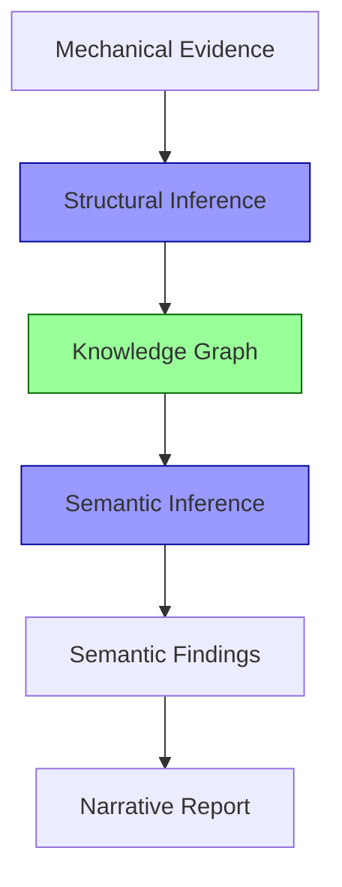

# Research Pipeline v2 — Implementation Checklist

## 目标

将 Pipeline 从 `Evidence → LLM(1 call) → Report` 升级为 `Evidence → Structural LLM → Knowledge Graph → Semantic LLM → Report LLM`，实现分层推理。

---

## 一、Knowledge Graph Schema 定义

- [ ] 新建 `knowledge-graph.mjs`
  - [ ] 定义 `KnowledgeGraph` TypeScript interface（capabilities / evolution / leverage）
  - [ ] 定义 `SemanticFindings` TypeScript interface（constraints / intents / mental_model / tensions / omissions）
  - [ ] 实现 `validateKnowledgeGraph(json)` — 校验 KG schema 完整性
  - [ ] 实现 `validateSemanticFindings(json)` — 校验 Semantic Findings schema
  - [ ] 导出 `KNOWLEDGE_GRAPH_SCHEMA` 常量（JSON Schema 格式，供 LLM prompt 引用）

### Knowledge Graph Schema

```typescript
interface KnowledgeGraph {
  capabilities: {
    id: string;                    // "runtime", "llm-integration", "persistence"
    type: "Capability";
    owns: string[];                // ["packages/agent/src/harness/"]
    depends_on: string[];          // ["llm-integration", "persistence"]
    evidence: { source: string; detail: string }[];
  }[];
  evolution: {
    trend: string;                 // "Registry → Runtime → Plugin"
    evidence: string;              // git commit / file change
    direction: "forward" | "deprecated";
  }[];
  leverage: {
    module: string;
    capability: string;            // 删除后消失的能力
    blast_radius: number;          // fan-in count
    recovery_cost: "low" | "medium" | "high";
  }[];
}
```

### Semantic Findings Schema

```typescript
interface SemanticFindings {
  constraints: {
    constraint: string;            // "Must support many providers"
    reason: string;                // "Provider adapters in packages/ai/"
    evidence: string;              // "provider factory pattern"
    drives: string[];              // 哪些 decisions 被这个 constraint 驱动
  }[];
  intents: {
    decision: string;              // "Provider Factory"
    intent: string;                // "Future providers"
    time_horizon: "immediate" | "near-term" | "long-term" | "temporary";
    evidence: string;
  }[];
  mental_model: {
    layers: string[];              // ["Presentation", "Agent Runtime", "Tool Runtime", ...]
    boundaries: string[];          // 每层之间的边界描述
    lifecycle: string;             // 请求生命周期描述
  };
  tensions: {
    left: string;                  // "Runtime simplicity"
    right: string;                 // "Extension flexibility"
    confidence: number;            // 0-1
    evidence: string;
  }[];
  omissions: {
    avoided: string;               // "DI container"
    reason: string;                // "Prefer explicit imports"
    philosophy: string;            // "Convention over framework"
  }[];
}
```

---

## 二、Structural Inference Stage（第一层推理）

### 2.1 Structural Prompt

- [ ] 新建 `prompts/01-structural.md`
  - [ ] 角色：结构分析专家，只做结构推理，**禁止推断意图**
  - [ ] 输入：JSON Evidence Brief（文件、符号、依赖图、git 历史、指标）
  - [ ] 输出：Knowledge Graph JSON
  - [ ] 任务 1 — **Capability Discovery**
    - [ ] 指令：将 package graph 转换为 capability graph
    - [ ] 示例：`packages/ai` → `"LLM Integration"`，`packages/storage` → `"Persistence"`，`packages/tui` → `"Presentation"`
    - [ ] 输出：`capabilities[]`（id / type / owns / depends_on / evidence）
    - [ ] 约束：capability 数量 ≤ 20
  - [ ] 任务 2 — **Evolution Analysis**
    - [ ] 指令：从 git history + temporal events 推断架构演进趋势
    - [ ] 不分析"现在是什么"，分析"未来是什么"
    - [ ] 示例：`Registry → Runtime → Plugin`，`Compatibility layer shrinking`
    - [ ] 输出：`evolution[]`（trend / evidence / direction）
  - [ ] 任务 3 — **Leverage Analysis**
    - [ ] 指令：从依赖图计算——删除每个关键模块会断什么
    - [ ] 输入：fan-in / fan-out / hub nodes / bottleneck nodes
    - [ ] 输出：`leverage[]`（module / capability / blast_radius / recovery_cost）
    - [ ] 约束：条目数 ≤ 15
  - [ ] 约束：输出必须是合法 JSON，符合 KnowledgeGraph schema
  - [ ] Anti-fabrication：禁止编造不在 evidence brief 中的文件路径或数字

### 2.2 Structural Pipeline 实现

- [ ] 修改 `hybrid-pipeline.mjs`
  - [ ] 新增 `runStructuralStage(evidenceBrief, opts)` 函数
    - [ ] 读取 `prompts/01-structural.md` 模板
    - [ ] 拼接 evidenceBrief JSON + prompt
    - [ ] 调用 `invokeLLMJSON()` （JSON 模式）
    - [ ] 调用 `validateKnowledgeGraph()` 校验输出
    - [ ] 返回 KnowledgeGraph 对象
  - [ ] 新增 `buildStructuralInput(evidenceBrief)` — 精简 evidence brief 为 Structural 所需部分

---

## 三、Semantic Inference Stage（第二层推理）

### 3.1 README / Docs 注入

- [ ] 修改 `hybrid-pipeline.mjs`
  - [ ] 新增 `readReadme(repoPath)` 函数
    - [ ] 查找 `README.md` / `README.md` / `README.rst` / `docs/README.md`
    - [ ] 提取前 100 行
    - [ ] 匹配 "architecture" / "design" / "philosophy" / "why" 关键词的段落
    - [ ] 总量控制在 2000 字符以内
  - [ ] 在 `buildJSONEvidenceBrief()` 中新增 `brief.readme` 字段

### 3.2 Semantic Prompt

- [ ] 新建 `prompts/02-semantic.md`
  - [ ] 角色：语义分析专家，**允许推断意图**，但必须基于 Knowledge Graph
  - [ ] 输入：Knowledge Graph JSON + README 内容 + Evidence Brief（精简）
  - [ ] 输出：Semantic Findings JSON
  - [ ] 任务 1 — **Constraint Discovery**
    - [ ] Prompt 不问 "What architecture is this?"
    - [ ] 改问 "What engineering constraints forced this design?"
    - [ ] 改问 "What alternatives appear intentionally avoided?"
    - [ ] 改问 "What assumptions does the author optimize for?"
    - [ ] 示例输出：`{ constraint: "Must support many providers", reason: "Provider adapters", evidence: "provider factory" }`
    - [ ] 示例输出：`{ constraint: "Avoid framework lock-in", evidence: "No LangChain, own runtime, custom prompts" }`
  - [ ] 任务 2 — **Intent Reconstruction**（替代旧的 Decision Analyzer）
    - [ ] 不问 "Why use Factory?"
    - [ ] 改问 "What future evolution does this decision enable?"
    - [ ] 示例：Provider Factory → `intent: "Future providers"`
    - [ ] 示例：compat layer → `intent: "Migration", time_horizon: "temporary"`
    - [ ] 示例：Session → `intent: "Replayability"`
    - [ ] 输出：`intents[]`（decision / intent / time_horizon / evidence）
  - [ ] 任务 3 — **Mental Model Reconstruction**
    - [ ] Prompt： "Imagine you are the original maintainer. Explain how you mentally divide the system."
    - [ ] 指令：不要描述 folders，描述 concepts / responsibilities / lifecycle / boundaries
    - [ ] 示例输出：layers = `["Presentation", "Agent Runtime", "Tool Runtime", "LLM Runtime", "Provider Adapter"]`
    - [ ] 输出：`mental_model`（layers / boundaries / lifecycle）
  - [ ] 任务 4 — **Design Tension**
    - [ ] 识别对立的设计力量
    - [ ] 示例：`Simple vs Flexible`、`Compile-time vs Runtime`、`Function vs Abstraction`、`Local CLI vs Cloud Service`
    - [ ] 示例：`Runtime simplicity vs Extension flexibility`
    - [ ] 输出：`tensions[]`（left / right / confidence / evidence）
  - [ ] 任务 5 — **Deliberate Omission**
    - [ ] Prompt： "What common engineering techniques are deliberately absent? Why?"
    - [ ] 识别缺失的常见技术（DI / Reflection / Decorator / Metadata / Inheritance）
    - [ ] 从缺失推断设计哲学
    - [ ] 输出：`omissions[]`（avoided / reason / philosophy）
  - [ ] 约束：输出必须是合法 JSON，符合 SemanticFindings schema
  - [ ] Anti-fabrication：所有 Constraint / Intent 必须引用 Knowledge Graph 或 README 中的具体证据

### 3.3 Semantic Pipeline 实现

- [ ] 修改 `hybrid-pipeline.mjs`
  - [ ] 新增 `runSemanticStage(knowledgeGraph, readmeContent, evidenceBrief, opts)` 函数
    - [ ] 读取 `prompts/02-semantic.md` 模板
    - [ ] 拼接 Knowledge Graph JSON + README + prompt
    - [ ] 调用 `invokeLLMJSON()` （JSON 模式）
    - [ ] 调用 `validateSemanticFindings()` 校验输出
    - [ ] 返回 SemanticFindings 对象

---

## 四、Narrative Report Stage（第三层推理）

### 4.1 Report Prompt 重写

- [ ] 重写 `prompts/07-report-writer.md`
  - [ ] 删除所有对已删除章节的引用（§A.4 / §A.5 / §2.7 / §2.8 / §2.9 / §2.10 / §5.5 / §5.5b / §5.6）
  - [ ] 删除所有对已删除文件的引用（00-research-questions.md / 01-hypotheses.md / 02-ontology.md / 04-opponent.md / 05-cross-validation.md）
  - [ ] 删除 Anti-Fabrication 中对 Finding ID 的引用（`[F-001]` 等）
  - [ ] 删除 C9/C10 相关指令（ConsistencyAnalyzer 已删除）
  - [ ] 新输入：Knowledge Graph JSON + Semantic Findings JSON + Evidence Brief（精简）
  - [ ] 新报告结构（12 sections）：
    1. [ ] **Repository Mental Model** — 来自 SemanticFindings.mental_model
    2. [ ] **Design Philosophy** — 来自 SemanticFindings.omissions + constraints
    3. [ ] **Engineering Constraints** — 来自 SemanticFindings.constraints
    4. [ ] **Capability Map** — 来自 KnowledgeGraph.capabilities
    5. [ ] **Architecture** — 来自 KnowledgeGraph + Evidence Brief
    6. [ ] **Evolution** — 来自 KnowledgeGraph.evolution
    7. [ ] **Key Decisions** — 来自 SemanticFindings.intents（不是 decisions，是 Intent）
    8. [ ] **Design Tensions** — 来自 SemanticFindings.tensions
    9. [ ] **Architectural Leverage** — 来自 KnowledgeGraph.leverage
    10. [ ] **Patterns Worth Reusing** — 来自 SemanticFindings + KG
    11. [ ] **Risks** — 跨层综合
    12. [ ] **Lessons** — 跨层综合
  - [ ] 保留 Quality Gate（9 个自问）
  - [ ] 保留 Evidence Quality 标注（Verified / Partially Verified / Documentation Only）
  - [ ] 保留 Unknown 主动分类（Need Reading / Need External Evidence / Impossible to Verify）

### 4.2 Report Stage 实现

- [ ] 修改 `hybrid-pipeline.mjs`
  - [ ] 新增 `runReportStage(knowledgeGraph, semanticFindings, evidenceBrief, opts)` 函数
    - [ ] 读取 `prompts/07-report-writer.md` 模板
    - [ ] 拼接 KG + Semantic Findings + Evidence Brief + prompt
    - [ ] 调用 `invokeLLM()` （markdown 模式）
    - [ ] 返回 report 文本

---

## 五、Pipeline 编排 + CLI 修复

### 5.1 Pipeline 编排

- [ ] 修改 `hybrid-pipeline.mjs` 的 `runHybridPipeline()`
  - [ ] 改为 3-stage 编排：
    ```
    Stage 0: Mechanical Analyzers (existing, unchanged)
    Stage 1: Structural Inference → Knowledge Graph (new)
    Stage 2: Semantic Inference → Semantic Findings (new)
    Stage 3: Narrative Report (existing, rewritten prompt)
    ```
  - [ ] 新增 `--stage=structural|semantic|report|all` flag，支持查看中间结果
  - [ ] 新增 `--mode=v2` flag 启用新 pipeline（默认 v2，`--mode=v1` 回退旧 pipeline）
  - [ ] 错误处理：如果 Structural 产出无效 KG，回退到旧 pipeline 并警告

### 5.2 CLI 修复

- [ ] 修改 `research-repo.mjs`
  - [ ] 修复 `hybrid` 命令的 outputDir 参数——第二位置参数作为输出目录
    - [ ] 如果指定 outputDir：写入 `{outputDir}/report.md` + `{outputDir}/knowledge-graph.json` + `{outputDir}/semantic-findings.json`
    - [ ] 如果未指定 outputDir：输出到 stdout（保持兼容）
  - [ ] 新增 `structural` 子命令 — 只运行 Structural stage，输出 KG JSON
  - [ ] 新增 `semantic` 子命令 — 只运行 Semantic stage（需要 KG 输入）

---

## 六、推理分层契约

### 6.1 Structural Inference 契约

- [ ] 在 `prompts/01-structural.md` 中明确声明：
  - [ ] **输入**：AST / 依赖 / Git / Metrics
  - [ ] **输出**：Capability / 依赖关系 / 演化趋势 / Leverage
  - [ ] **禁止**：推断意图（"为什么这样设计"是 Semantic 层的事）
  - [ ] **允许**：从结构推断能力（"packages/ai 拥有 LLM Integration capability"）

### 6.2 Semantic Inference 契约

- [ ] 在 `prompts/02-semantic.md` 中明确声明：
  - [ ] **输入**：Structural Inference 结果（Knowledge Graph）+ README + ADR + Commit messages
  - [ ] **输出**：Constraint / Intent / Mental Model / Design Tension / Deliberate Omission
  - [ ] **允许**：推断意图
  - [ ] **前提**：所有语义推断必须建立在已验证的 Knowledge Graph 之上
  - [ ] **禁止**：从零散代码直接跳到全局结论（必须经过 KG 中间层）

### 6.3 两阶段流程图



---

## 七、测试

### 7.1 单元测试

- [ ] 新建 `__tests__/knowledge-graph.test.mjs`
  - [ ] 测试 `validateKnowledgeGraph()` — 合法 KG 通过
  - [ ] 测试 `validateKnowledgeGraph()` — 缺少必填字段时失败
  - [ ] 测试 `validateKnowledgeGraph()` — capability 数量超限时失败
  - [ ] 测试 `validateSemanticFindings()` — 合法 Findings 通过
  - [ ] 测试 `validateSemanticFindings()` — 缺少 mental_model 时失败

### 7.2 Pipeline Stage 测试

- [ ] 新建 `__tests__/pipeline-stages.test.mjs`
  - [ ] 测试 `runStructuralStage()` — mock LLM 返回合法 KG JSON
  - [ ] 测试 `runStructuralStage()` — mock LLM 返回无效 JSON 时抛错
  - [ ] 测试 `runSemanticStage()` — mock LLM 返回合法 Findings JSON
  - [ ] 测试 `runSemanticStage()` — 缺少 README 时仍能运行
  - [ ] 测试 `runReportStage()` — mock LLM 返回 markdown 报告
  - [ ] 测试 `runHybridPipeline()` — 3-stage 端到端（mock LLM）

### 7.3 行为测试

- [ ] 修改 `skill-test/tests/behavior/`
  - [ ] 新增：验证 KG 中 capability id 不是 package 名（如 "packages/ai" → 应为 "LLM Integration"）
  - [ ] 新增：验证 Semantic Findings 中每个 constraint 有 evidence 字段
  - [ ] 新增：验证报告中不引用已删除的章节（§A.4 / §A.5 / §2.7 等）

### 7.4 回归测试

- [ ] 更新 `baseline-metrics.json` — 新 pipeline 可能改变报告长度
- [ ] 更新 golden fixtures — 新报告结构（12 sections）
- [ ] 确保所有 6 层测试通过

---

## 八、文档更新

- [ ] 更新 `SKILL.md`
  - [ ] Pipeline 架构描述改为 4-stage
  - [ ] 新增 Inference 分层说明（Structural vs Semantic）
  - [ ] 新增 Knowledge Graph 作为中间表示的说明
- [ ] 更新 `DESIGN.md`
  - [ ] 新增设计决策 §39：两阶段推理（Structural → Semantic with Knowledge Graph）
  - [ ] 新增设计决策 §40：8 个 Analyzer 映射到 Structural / Semantic
  - [ ] 新增设计决策 §41：为什么 3 次 LLM 调用而不是 8 次
  - [ ] 新增设计决策 §42：README 注入策略
  - [ ] 更新 Pipeline 架构图（Mermaid）
  - [ ] 更新 Working Folder 结构（新增 knowledge-graph.json / semantic-findings.json）
- [ ] 更新 `CHANGELOG.md`
  - [ ] 记录 Pipeline v2 升级
- [ ] 更新 `AGENTS.md` Maintenance Log

---

## 九、验证

- [ ] 在 `ref-only/pi` 上运行新 pipeline，对比报告质量
- [ ] 在 `ref-only/dbeaver` 上运行新 pipeline，验证大型仓库不崩溃
- [ ] 在 `ref-only/litehybrid` 上运行新 pipeline，验证 Rust 仓库兼容
- [ ] 运行全部测试：`pnpm test` + `pnpm test:skill` + `pnpm test:e2e` + `pnpm test:e2e:live`

---

## 实施顺序

```
阶段 1 (Schema)     → knowledge-graph.mjs + schema 定义
阶段 2 (Structural)  → 01-structural.md + runStructuralStage()
阶段 3 (Semantic)    → README 注入 + 02-semantic.md + runSemanticStage()
阶段 4 (Report)      → 重写 07-report-writer.md + runReportStage()
阶段 5 (编排+CLI)    → runHybridPipeline() 3-stage + outputDir 修复
阶段 6 (测试)        → 单元 + 行为 + 回归
阶段 7 (文档)        → SKILL.md + DESIGN.md + CHANGELOG.md + AGENTS.md
阶段 8 (验证)        → ref-only 真实仓库 + 全测试
```

每个阶段完成后运行 `pnpm test` 确保不回归。
