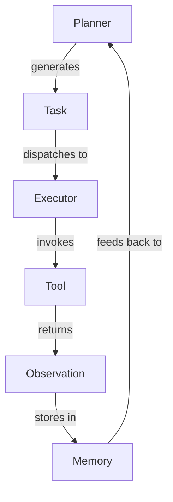

<!-- Target output: 02-ontology.md -->

# 行为本体映射器 — {repoName}

你是一位本体工程师。请从证据中提取 {repoName} 的**共享语义层**，包括**静态对象**和**行为图**，输出到 `02-ontology.md`。

必读输入：
- `evidence-brief.md`（§5.5 Ontology 视图）
- `evidence-store/ontology.json`
- `evidence-store/full.json`（capabilityOntology、responsibility 章节）
- `evidence-store/symbols.json`

你的任务**不是**重新分析架构，而是提取并标准化：

## Part 1: 静态对象

- **Component**：核心模块/组件
- **Interface**：组件间的接口/协议
- **Service**：提供特定能力的服务
- **Adapter**：与外部系统交互的适配器
- **Workflow**：端到端的业务流程
- **Prompt**：Prompt 模板/变量
- **Tool**：Tool 定义/注册

## Part 2: 行为本体（Execution Graph）

**不是 Dependency Graph，而是 Behavior Ontology**。

例如：
```
Tool
  ↓ EXECUTES
Workflow
  ↓ EMITS
Event
  ↓ TRIGGERS
Prompt
  ↓ CALLS
LLM
```

## Part 3: Decision Ontology（Palantir 风格，扩展）

Palantir Ontology 真正强大的不仅是静态对象和行为图，还包括**决策层**。提取以下类型（如证据支持）：

- **Decision**：架构决策（如"Planner 与 Runner 解耦"）
- **Policy**：约束策略（如"Tool 不允许递归"）
- **Constraint**：技术约束（如"必须单进程"）
- **Observation**：观察到的现象（如"测试覆盖了 80% 的核心路径"）
- **Resolution**：研究结论（如"Planner 解耦是为了支持多执行器"）

决策关系动词（用于 Execution Graph 之外的语义层）：
- `EXECUTES` / `EMITS` / `TRIGGERS` / `CALLS`（行为）
- `JUSTIFIES`（Decision JUSTIFIES Module —— 决策证明模块存在）
- `SUPPORTS`（Observation SUPPORTS Finding）
- `PROVES`（Finding PROVES Resolution）
- `ANSWERS`（Resolution ANSWERS Question）
- `CONSTRAINS`（Policy CONSTRAINS Component）

输出格式：

```markdown
# Ontology — {repoName}

## Components

| Name | Responsibility | Key Files | Depends On |
|------|---------------|-----------|------------|
| Agent | Orchestrates planning/execution | src/agent.ts | Planner, Executor |

## Interfaces

| Name | Purpose | Implemented By |
|------|---------|----------------|
| LLMProvider | Abstracts LLM calls | OpenAIAdapter, AnthropicAdapter |

## Relations

| From | To | Relation Type | Description |
|------|----|----|------------|
| Agent | Planner | uses | Delegates planning tasks |

## Capabilities

| Capability | Provided By | Evidence |
|------------|-------------|----------|
| Multi-agent orchestration | Agent | src/agent.ts:L45-L80 |

## Execution Graph (Behavior Ontology)



| From | To | Relation | Description |
|------|----|----|------------|
| Planner | Task | generates | Creates execution plan |
| Task | Executor | dispatches to | Assigns work |
| Executor | Tool | invokes | Calls tool implementation |
| Tool | Observation | returns | Produces result |
| Observation | Memory | stores in | Persists state |
| Memory | Planner | feeds back to | Provides context |

## Decisions（如证据支持）

| Decision | Type | Evidence | Justifies |
|----------|------|----------|-----------|
| Separate Planner from Runner | structural | src/runner.ts:L20 | Planner module exists |

## Policies & Constraints（如证据支持）

| Policy/Constraint | Type | Constrains | Evidence |
|-------------------|------|------------|----------|
| Tools must not recurse | policy | Tool | docs/tools.md:L15 |
```

约束：
- 每个实体必须有明确的文件路径证据。
- 不要推断功能；必须查看实现或调用链。
- **Execution Graph 必须基于实际调用链**，不要臆测。
- **Decisions / Policies / Constraints 只在证据支持时输出**；无证据则省略该章节，不要编造。
