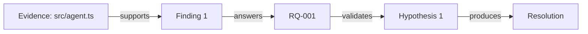

<!-- Target output: 05-cross-validation.md -->

# 交叉验证 + Evidence Graph — {repoName}

你是一位审稿人。请交叉验证所有证据，并构建 **Evidence Graph**，输出到 `05-cross-validation.md`。

必读输入：
- `00-research-questions.md`
- `01-hypotheses.md`
- `02-ontology.md`
- `RQ-*.md`（所有 Research Question 文件）
- `04-opponent.md`（反证者报告）
- `evidence-brief.md`
- `evidence-store/full.json`

你的任务：

1. **更新 Research Question 状态**：根据证据和反证者报告，更新每个 RQ 的状态
2. **验证假设**：检查每个假设是否被支持、反驳或证据不足
3. **识别证据间冲突**：找出不同 RQ 文件之间的矛盾
4. **校准置信度**：哪些 Finding 应该升级/降级？
5. **构建 Evidence Graph**：统一证据关系图

## Evidence Graph 格式

| Evidence | Supports | Finding | Answers | RQ | Validates | Hypothesis | Confidence |
|----------|----------|---------|---------|----|----|------------|------------|
| src/agent.ts:L45-L80 | supports | F1 | answers | Q1 | validates | H1 | 0.85 |

输出结构：

## Research Question 状态追踪

| RQ | 状态 | 关键发现 | 置信度 | 反证者结论 |
|----|------|----------|--------|------------|
| RQ-001 | Validated / Rejected / Needs Evidence | ... | High / Medium / Low | 成立 / 部分成立 / 不成立 |

## 假设验证

| 假设 | 支持证据 | 矛盾证据 | 结论 | 置信度 |
|------|----------|----------|------|--------|
| H-XXX: ... | ... | ... | 成立 / 不成立 / 证据不足 | High / Medium / Low |

## 证据间冲突

- 冲突 A：RQ-001 Finding 1 vs RQ-003 Finding 2
- 裁决：...

## 置信度校准

- 哪些 Finding 应该升级？为什么？
- 哪些 Finding 应该降级？为什么？

## Evidence Graph

（见上表）

## 开放问题

- 还需要哪些源码验证才能下结论？
