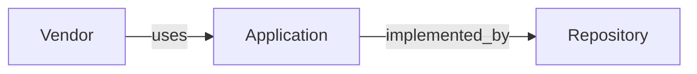
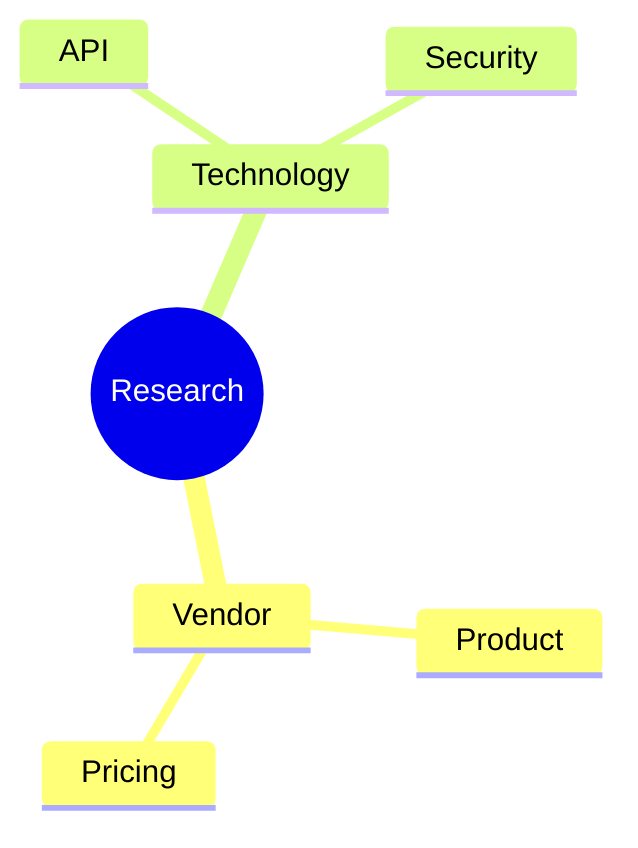

# 整理 ChatGPT 啰嗦文本

ChatGPT 等 LLM 生成的 markdown 常出现"半句话单独成段""代码块内每步插空行""散词零碎换行"等啰嗦格式。本 skill 用于在不改动任何文字内容的前提下，把这些碎片整理成紧凑、连贯的 markdown。

## 何时调用

- 用户说"整理一下这个 markdown 格式""去掉没必要的换行分段""精简格式但不要改内容"
- 文本来自 ChatGPT / Claude / 其他 LLM 输出，且呈现明显的碎片化分段
- 用户明确要求"不要修改内容，只整理格式"

## 红线原则（不可违反）

1. **不修改任何文字内容**：字、词、标点保留原样。不增删字符，不替换同义词，不加逗号/句号
2. **只整理格式**：合并碎片段落、去掉代码块内多余空行、把 blockquote 碎片改成行内文字
3. **保留结构**：标题层级、表格、列表、代码块本身、合理的引用块（如并列示例引用）一律保留

## 六种典型啰嗦模式及处理

### 模式 1：半句引导 + 引用块 + 半句收尾

**特征**：一个 blockquote 被半句引导语和半句收尾夹击，概念词被单独引用强调。

**改前**：
```
因为它最终输出的是

> Research Report

而不是 Search Result。
```

**改后**：
```
因为它最终输出的是 Research Report 而不是 Search Result。
```

**判断**：单概念被半句夹击 → 合并成行内文字，去掉 blockquote。若是多个并列示例引用（如四个问句列表），保留 blockquote。

### 模式 2：代码块内每步插空行

**特征**：流程图/列表型代码块里，每个步骤之间插一个空行，导致竖排稀疏。

**改前**：
```
Input
    ↓

Research Goal
    ↓

Hypothesis Planning
```

**改后**：
```
Input
    ↓
Research Goal
    ↓
Hypothesis Planning
```

**判断**：去掉代码块内空行，保留换行。代码块本身（``` 围栏）保留。

### 模式 3：单字/单词成段

**特征**：连词、引导词、动词单独成段（如"叫""或者""包括：""形成""建立""而是"）。

**改前**：
```
不要叫 Search。叫

> Enterprise Research Agent

或者

> Domain Research Agent
```

**改后**：
```
不要叫 Search。叫 Enterprise Research Agent 或者 Domain Research Agent。
```

**判断**：把单字词并入相邻段落。若它连接的是引用块碎片，连同引用块一起合并成行内文字。

### 模式 4：短句被空行拆碎

**特征**：本应连贯的几句话被空行拆成多个独立段落。

**改前**：
```
它们其实都是同一个东西。

所以 Agent 第一件事情不是搜索。

而是 Entity Resolution。
```

**改后**：
```
它们其实都是同一个东西。所以 Agent 第一件事情不是搜索。而是 Entity Resolution。
```

**判断**：合并为一段。保留原句号，不加新标点。

### 模式 5：散词零碎换行

**特征**：一串并列名词/术语每个单独成段。

**改前**：
```
然后去外部：

ECB

ESMA

ISSB

GRI

SASB

新闻

GitHub

Paper

全部融合。
```

**改后**：
```
然后去外部：ECB、ESMA、ISSB、GRI、SASB、新闻、GitHub、Paper，全部融合。
```

**判断**：若是纯名词列举，合并为逗号分隔句；若每个词带说明（"X 找 Y"），用模式 6 处理。

### 模式 6：成对零碎句

**特征**：名词 + 动宾短语被空行拆成两行，形成"系统名\n\n动作对象"的碎片。

**改前**：
```
Agent 会自动去：

Confluence

找 ESG Project

GitHub

找 ESG Repository

LeanIX

找 ESG Capability
```

**改后**：
```
Agent 会自动去：

Confluence 找 ESG Project
GitHub 找 ESG Repository
LeanIX 找 ESG Capability
```

**判断**：把"系统名"和"找 X"合并为一行，多对成对行组成紧凑列表。

### 模式 7：ASCII 图、伪流程图、伪关系图

**特征**：使用空格、缩进、箭头、Unicode 箭头、树形字符等拼凑流程图、关系图、实体图、树结构。这类 ASCII 图在 Markdown 中可读性较差，应转换为普通文字、Markdown 表格或 Mermaid 图。

**改前**（属性树）

```text
Entity
    id
    type
    aliases
    summary
```

**改后**（Markdown 表格）

```markdown
| Entity 属性 |
|-------------|
| id |
| type |
| aliases |
| summary |
```

**改前**（关系图）

```text
Vendor
    ↓ uses

Application

Application
    ↓ implemented_by

Repository
```

**改后**（Mermaid）

````markdown

````


**改前**（流程）

```text
Input
    ↓
Research Goal
    ↓
Evidence Collection
    ↓
Report
```

**改后**（Mermaid）

````markdown
```mermaid
flowchart TD

Input
    --> Research Goal
    --> Evidence Collection
    --> Report
```
````


**改前**（树）

```text
Research

    Vendor

        Product

        Pricing

    Technology

        API

        Security
```

**改后**（Mermaid）

````markdown

````

#### 判断

发现下列 ASCII 图，应自动转换，而不是保留原样：

| 原始形式 | 转换方式                    |
| ---- | ----------------------- |
| 属性树  | 普通文字或 Markdown 表格       |
| 实体关系 | Mermaid graph           |
| 流程   | Mermaid flowchart       |
| 树结构  | Mermaid mindmap         |
| 状态迁移 | Mermaid stateDiagram-v2 |
| 时序交互 | Mermaid sequenceDiagram |
| 架构关系 | Mermaid graph           |
| 生命周期 | Mermaid stateDiagram-v2 |

#### 自动识别特征

满足以下任意情况，可认为属于 ASCII 图：

* 多行只有一个词或短语，通过缩进表达层级
* 连续出现 `↓`、`↑`、`→`、`←`
* 连续出现 `->`、`-->`、`=>`
* 连续出现 `│`、`├──`、`└──`
* 多列仅依靠空格对齐形成关系
* 连续多行只有节点名称，没有完整句子
* 通过空行和缩进模拟流程图、关系图或树

#### 转换原则

1. 如果内容本质是说明（属性、组成、包含关系），优先转换为普通文字或 Markdown 表格。
2. 如果内容本质是图（流程、关系、状态、时序、架构），优先转换为 Mermaid。
3. 若 Mermaid 无法准确表达，则改写为自然语言，不保留 ASCII 图。
4. 除非用户明确要求保留原始 ASCII 图，否则禁止输出 ASCII 图。

### 判断边界速查

| 元素 | 保留 | 合并/整理 |
|------|------|----------|
| 并列示例引用块（多例） | ✓ | |
| 单概念被半句夹击的引用块 | | ✓ 改行内 |
| 代码块围栏（```） | ✓ | |
| 代码块内空行 | | ✓ 去掉 |
| 标题层级（#/##/###） | ✓ | |
| 表格 | ✓ | |
| 列表（- / *） | ✓ | |
| 单字成段的连词/引导词 | | ✓ 并入相邻 |
| 被空行拆碎的连贯短句 | | ✓ 合并一段 |
| 散词列举 | | ✓ 逗号分隔或列表 |
| 文字内容、标点 | ✓ 原样 | |
| ASCII 图 / 伪流程图 / 树形图 | | ✓ 转换为普通文字、Markdown 表格或 Mermaid |


## 操作流程

1. **通读全文**，识别上述六种模式的出现位置
2. **不要使用ASCII图**，ASCII表达的顺序图、树形图、关系图，自动识别并转换为普通文字、Markdown 表格或 Mermaid（模式 7）
3. **按段落处理**，从前往后逐段整理：
   - 引用块碎片 → 合并成行内（模式 1/3）
   - 代码块内空行 → 去掉（模式 2）
   - 短句碎片 → 合并段落（模式 4）
   - 散词 → 逗号分隔或列表（模式 5/6）
4. **保留所有结构元素**：标题、表格、列表、合理引用块、代码块围栏
5. **校验**：整理后字数应与原文一致（可用 `wc -m` 对比），仅换行/空行/引用符号变化
6. **不增删任何字符**：标点、文字、空格一律原样

## 校验命令

整理完成后，用以下命令验证未改动文字内容（只对比可见字符，忽略空白差异）：

```bash
# 原文与整理后对比，去掉所有空白后应完全一致
diff <(tr -d '[:space:]' < original.md) <(tr -d '[:space:]' < tidied.md)
```

若无输出，说明文字内容零修改，只整理了格式。

## 反模式（不要做）

- ❌ 把并列示例引用块合并成一句（破坏示例结构）
- ❌ 删除代码块围栏（代码块必须保留）
- ❌ 为了合并句子而添加逗号/连词（标点不增不减）
- ❌ 修改任何文字、替换同义词、调整语序
- ❌ 删除表格、列表、标题等结构性元素
- ❌ 把合理的段落拆分当成啰嗦合并掉（只整理明显碎片）
- ❌ 保留仅依赖缩进、空格或箭头组成的 ASCII 图
- ❌ 使用 Unicode 箭头（↓、↑、→ 等）模拟流程图或关系图
- ❌ 将可以使用 Mermaid 表达的流程、关系、状态、树结构继续保留为 ASCII 图
