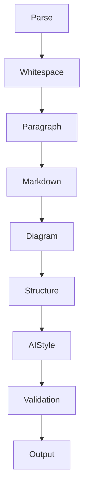

# LLM Markdown Normalizer

把 LLM（ChatGPT/Claude/Gemini）输出的 markdown 规范化为紧凑、专业、可读的文档。

**设计思路**：不是规则集合（P1/P2/...），而是多阶段 **Normalization Pipeline**，像 Prettier/clang-format 一样按 Pass 执行。规则按 Pass 组织，易于扩展——新增 Mermaid 图类型或新的 LLM 输出模式时，只需往对应 Pass 加规则。

## 何时调用

- 用户说"整理 markdown""去掉换行分段""精简格式""去 AI 味""规范化"
- 文本来自 LLM 输出，呈现碎片化、ASCII 图、过度强调、模板化表达
- 用户要求"不改内容只整理格式"（Level 1）或"清理表达"（Level 2）

## 两级模式

- **Level 1 格式整理**（默认）：不改动文字，只整理格式 + 转换 ASCII 图
- **Level 2 去 AI 味**（用户明确要求"去 AI 味/清理表达/规范化"）：可删 Emoji、模板化引导语、第一人称语气、口头禅

## 三条核心原则

1. **信息密度**：每一段表达一个完整观点。不拆碎（一句拆四段），不灌水（三个引导句配一句正文）。
2. **语义完整性**：整理后仍保持自然语言可读。不允许出现拼错语义的合并（如"叫 Enterprise Search Research Agent"）。
3. **输出目标**：符合 GitHub README / 技术文档规范——Paragraph ≤ 一个观点，Heading 不连续空，Diagram 用 Mermaid，Table 用 Markdown，Code Fence 完整，List 紧凑。

---

## Normalization Pipeline



模型按 Pipeline 顺序工作，每个 Pass 只做一类事，不跨 Pass 混合处理。

### Pass 1: Parse（识别块类型）

通读全文，给每个块打标签：`heading` / `paragraph` / `list` / `table` / `code` / `blockquote` / `ascii-diagram` / `pseudo-kv` / `pseudo-table`。

**ASCII 图识别特征**（满足任意即标记为 `ascii-diagram`）：
- 多行只有一个词/短语，通过缩进表达层级
- 连续出现 `↓` `↑` `→` `←` `->` `-->` `=>` `│` `├──` `└──`
- 多列仅靠空格对齐
- 连续多行只有节点名，没有完整句子

### Pass 2: Whitespace Normalize

- 多个连续空行 → 压缩为单个空行
- 标题与正文间多余空行 → 单空行
- 表格/代码块前后垃圾空行 → 单空行
- 行尾空白 → 去掉

### Pass 3: Paragraph Normalize

合并碎片段落，保证信息密度和语义完整性。

- **句子拆五段** → 合并为一段
- **短句被空行拆碎** → 合并；合并时允许**句号→逗号**调整以保持可读（如"…不是搜索，而是 Entity Resolution"），但不增删标点
- **单字/单词成段**（连词/引导词"叫/或者/而是/包括/形成"）→ 并入相邻段落
- **散词零碎换行** → 逗号分隔句或列表
- **成对零碎句**（"系统名\n\n动作"）→ 合并为成对行或列表
- **一句拆四段+引导句过多** → 合并为一段，保留首个引导语

**语义完整性检查**：合并后通读，确认没有拼错语义的合并。若合并后读不通，保留原分段。

### Pass 4: Markdown Normalize

修复 markdown 结构问题。

- **blockquote 滥用**：单概念被半句夹击的引用块 → 改行内文字；并列示例引用/原话引用 → 保留
- **Bullet 爆炸**（`-\n\n项`）→ 紧凑列表 `- 项`
- **编号列表碎裂**（`1.\n\nFirst`）→ `1. First`
- **列表密度**：每项 <15 字 → 紧凑无空行；每项多内容 → 保留空行分隔
- **代码块内空行** → 去掉（若属 ASCII 图，转 Pass 5）
- **连续代码块**：同语言同文件 → 合并为一个代码块
- **Code Fence 修复**：补全缺失的闭合围栏
- **Heading 套 Heading**：子 Heading 下仅一句话 → 降级为正文
- **连续 Heading 检测**：`## A` → `### B` → `#### C` → `##### D` → 一句话，自动降级，避免目录无意义
- **Heading 合法性**：`#` 后无内容、跳级（`#` 直接到 `###`）→ 修复

### Pass 5: Diagram Normalize

ASCII 图转换为 Mermaid 或表格，**不保留 ASCII 图**（除非用户明确要求）。

**转换原则**：
1. 说明性内容（属性/组成/包含）→ 列表或 Markdown 表格
2. 图性内容（流程/关系/状态/时序/架构）→ Mermaid
3. Mermaid 无法表达 → 自然语言

**Mermaid 类型按内容映射**（不写死，Mermaid 新增图类型时按需扩展）：

| 内容性质 | Mermaid 类型 |
|---------|-------------|
| 流程 | flowchart |
| 关系 | graph |
| 状态迁移/生命周期 | stateDiagram-v2 |
| 时序交互 | sequenceDiagram |
| 树/思维导图 | mindmap |
| 类关系 | classDiagram |
| 实体关系 | erDiagram |
| 用户旅程 | journey |
| 需求 | requirementDiagram |
| 时间线 | timeline |
| Git 流程 | gitGraph |
| 象限 | quadrantChart |

**Mermaid 节点名转义**（关键，否则渲染错误）：
- 节点名含空格/特殊字符 → 用引号包裹：`"Company Background"`
- 或用下划线：`Company_Background`
- 边标签用 `|...|`：`A -->|uses| B`

**转换时不得添加原文没有的文字**：表头/引导语只能用原文已有词汇。

### Pass 6: Structure Normalize

修复伪结构。

- **伪 Key-Value / Definition List**：
  - 少于 5 行 → 行内 `Key：Value`
  - 超过 5 行 → Markdown Table
- **伪表格**（空格对齐）→ Markdown Table
- **属性树** → 列表或表格
- **重复 Heading**：Heading 文字与紧随正文首句重复 → 删重复正文（Level 2）

### Pass 7: AI Style Normalize（Level 2）

去除 AI 味，只删装饰和冗余，不删有信息量内容。

- **装饰性 Emoji**（🚀📌💡✨🔥）→ 删除；代码/配置中有语义的 Emoji 保留
- **标题去第一人称**："我建议定位成 X" → "X 定位"；"我觉得最值得做的是 X" → "X"
- **第一人称语气**："我建议/我觉得/我认为/我不会定位为" → 去除或改客观表述
- **口头禅**："其实/当然/确实/总的来说/综上所述" → 删除
- **模板化引导语**："真正重要的是/值得注意的是/核心在于/关键点在于/需要强调的是" → 连续出现时保留首个，其余删除
- **机械过渡句**："接下来我们来看/值得一提的是/不仅如此" → 合并/删除

### Pass 8: Validation

- **Level 1 文字校验**（纯段落整理）：`diff` 去空白后对比，无输出 = 零修改
- **图形转换校验**：原节点名全部保留在 Mermaid/表格中
- **语义完整性校验**：通读整理后文本，确认无拼错语义的合并
- **Markdown 合法性校验**：Heading 层级连续、Code Fence 配对、表格列数一致

---

## 输出目标规范

整理后输出应符合：

| 元素 | 规范 |
|------|------|
| Paragraph | ≤ 一个完整观点 |
| Heading | 不连续空 Heading，层级连续 |
| Diagram | Mermaid（节点名转义） |
| Table | Markdown Table |
| Code | Fence 完整配对 |
| List | 紧凑（短项）/分空行（长项） |
| 空行 | 单空行分隔，无爆炸 |

## 校验命令

Level 1 纯段落整理后：

```bash
diff <(tr -d '[:space:]' < original.md) <(tr -d '[:space:]' < tidied.md)
```

无输出 = 文字零修改。图形转换场景不适用此命令（Mermaid 语法字符是新增的），改用节点名保留校验。

## 反模式

- ❌ 把并列示例引用块合并成一句
- ❌ 删除代码块围栏
- ❌ 合并时拼错语义（"叫 Enterprise Search Research Agent"）
- ❌ Mermaid 节点名含空格不加引号（渲染错误）
- ❌ 转换时添加原文没有的文字
- ❌ Level 1 时删除 Emoji/模板化表达（需 Level 2 授权）
- ❌ Level 2 时删除有信息量内容
- ❌ 保留 ASCII 图（除非用户明确要求）
- ❌ 跨 Pass 混合处理（应按 Pipeline 顺序）
- ❌ 继续堆规则编号而不归入对应 Pass
