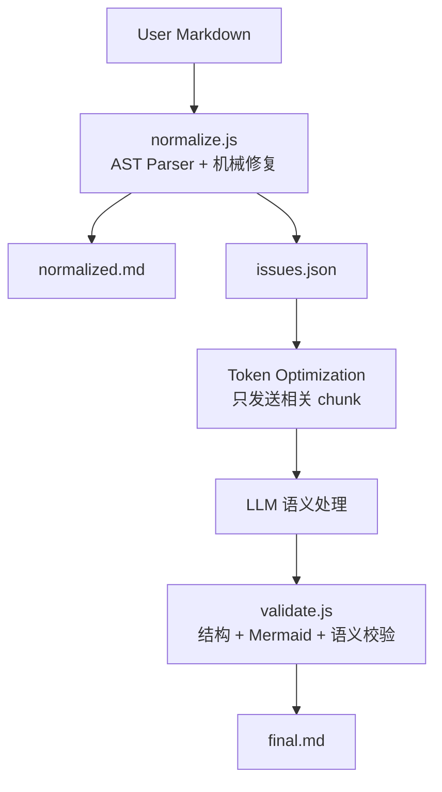
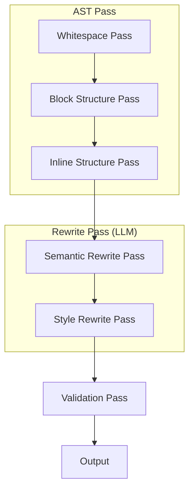
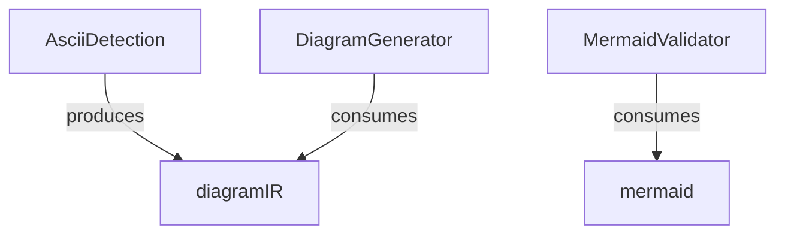
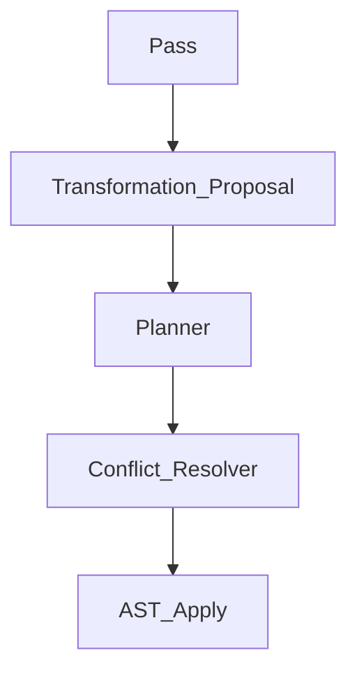
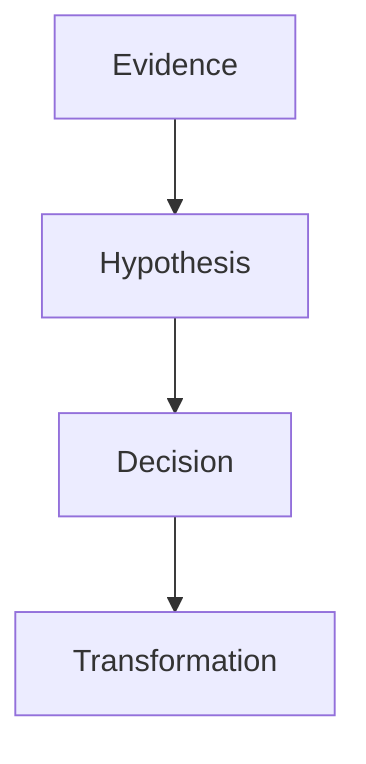
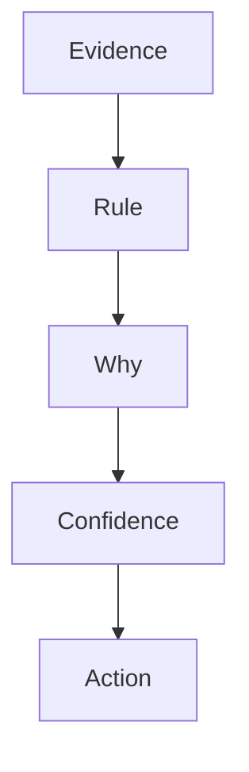
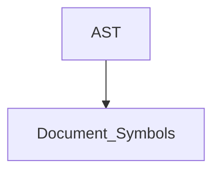
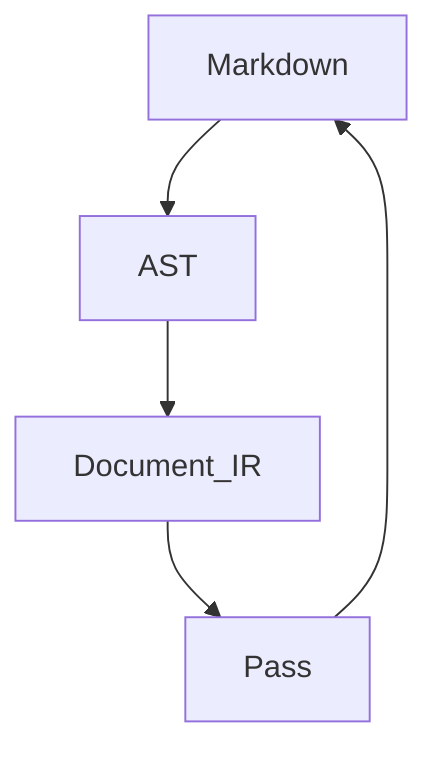
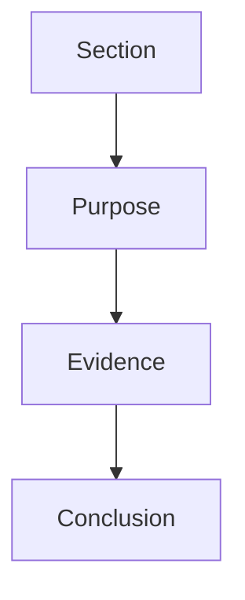
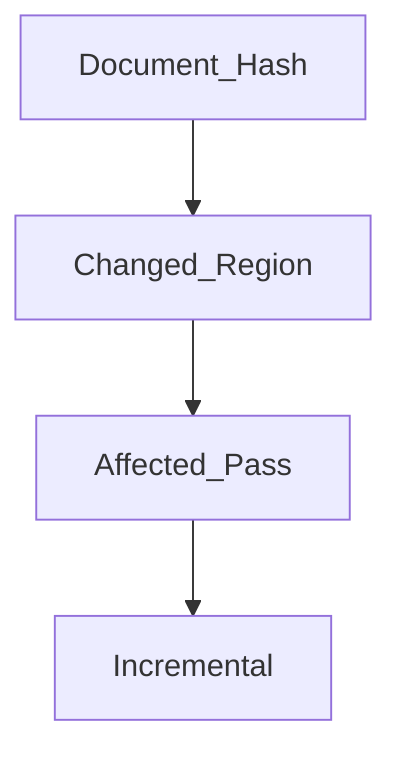

# LLM Markdown Normalizer

把 LLM（ChatGPT/Claude/Gemini）输出的 markdown 规范化为紧凑、专业、可读的文档。

**设计思路**：Hybrid Architecture —— **确定性 Markdown Transformation 用 JS 执行，语义保持改写用 LLM 执行**。JS 不负责理解文本含义，只负责 AST 解析、结构检测、机械修复和 Issue 生成。LLM 不负责 Markdown 格式修复，只负责需要语义判断的 Rewrite。

像 Prettier / clang-format 一样按 Pass 执行，规则按 Pass 组织，易于扩展。

## 何时调用

- 用户说"整理 markdown""去掉换行分段""精简格式""去 AI 味""规范化"
- 文本来自 LLM 输出，呈现碎片化、ASCII 图、过度强调、模板化表达
- 用户要求"只整理格式"（L0）、"整理通顺"（L1，默认）或"去 AI 味"（L2）

## 三级模式

| Level | 能力 | 是否允许改写 |
|-------|------|------------|
| **L0 Whitespace** | 只整理空行、列表、Markdown 结构 | ❌ |
| **L1 Semantic Normalize（默认）** | 调语序、合并短句、整理并列、优化句法，**语义必须完全等价** | ✅ |
| **L2 Style Normalize** | 去 AI 味、删模板化表达、删 Emoji、去冗余、改善文风 | ✅（轻微编辑，不改核心信息） |

**判断**：用户说"只整理格式/不要改字"→ L0；说"整理/精简/通顺"→ L1；说"去 AI 味/清理表达/规范化"→ L2。

## 核心红线：语义不变（非文字不变）

> **不改变任何语义。允许在不改变含义的前提下，调整语序、段落顺序、句子拼接方式，以获得更自然、更符合中文表达习惯的行文。**

**语义等价（Semantic-preserving Rewrite）定义**：
> 所有修改必须满足：读者无法从整理后的文本中获得任何新的信息，也不会失去任何已有信息，仅改善可读性和表达流畅度。

### 允许（L1+）

- 调整语序（"不要叫 Search。叫 X" → "不要叫 Search，叫 X"）
- 合并连续短句
- 调整并列顺序（"GitHub\n\nConfluence\n\nJira" → "GitHub、Confluence、Jira"）
- 前置修饰语（"自动搜索\n\n企业内部\n\n所有资料" → "自动搜索企业内部所有资料"）
- 调整引用位置（blockquote 碎片改行内）
- 合并重复主语（"Agent 会搜索 GitHub。Agent 会搜索 Jira。" → "Agent 会搜索 GitHub、Jira"）
- 合并连续谓语（"收集证据。分析证据。生成报告。" → "收集证据、分析证据，并生成报告"）
- 句号→逗号的标点调整（保持可读）

### 禁止（所有 Level）

- 修改事实/逻辑/推理/因果/时间顺序/强调对象/限定条件/结论
- 删除信息或增加信息
- 引入改变逻辑关系的连接词（如"但是"→"因此"）
- L0 时进行任何句法改写

## 三条核心原则

1. **信息密度**：每一段表达一个完整观点。不拆碎，不灌水。
2. **语义完整性**：整理后保持自然语言可读，无拼错语义的合并。
3. **输出目标**：符合 GitHub README / 技术文档规范——Paragraph ≤ 一个观点，Heading 不连续空，Diagram 用 Mermaid，Table 用 Markdown，Code Fence 完整，List 紧凑。

---

## AST Pass Pipeline



Normalizer 采用 **AST-based Pass 划分**，Markdown 的核心不是文本，是 AST。模型按 Pipeline 顺序工作，每个 Pass 只做一类事。



### Pass 1: Whitespace（L0+，JS 执行）

纯机械操作，confidence 0.99，全部自动修复。

- 多个连续空行 → 压缩为单个空行
- 标题与正文间多余空行 → 单空行
- 表格/代码块前后垃圾空行 → 单空行
- 行尾空白 → 去掉
- 首尾多余空行 → 去掉

### Pass 2: Block Structure（L0+，JS 执行）

块级结构修复，高置信度自动修复，低置信度报告 issue。

- **空段落移除**（confidence: 0.99）
- **列表修复**：相邻同类列表合并（confidence: 0.95）
- **Bullet 爆炸**（`-\n\n项`）→ 紧凑列表（confidence: 0.92）
- **编号列表碎裂**（`1.\n\nFirst`）→ `1. First`（confidence: 0.90）
- **Code Fence 修复**：补全缺失围栏（confidence: 0.95）
- **Heading 合法性**：`#` 后无内容、跳级 → 修复（confidence: 0.90）
- **连续 Heading 检测**：`## A` → `### B` → `#### C` → 一句话，降级（confidence: 0.75，仅报告）
- **Heading 套 Heading**：子 Heading 下仅一句话 → 降级为正文（confidence: 0.70，仅报告）
- **伪 Key-Value / Definition List**：检测（confidence: 0.80，LLM 决策）
- **伪表格**（空格对齐）：检测（confidence: 0.80，LLM 决策）
- **ASCII 图检测**：检测（confidence: 0.75，报告，LLM 转 Mermaid）

### Pass 3: Inline Structure（L0+，JS 执行）

行内结构检测与修复。

- **连续代码块**：同语言同文件 → 合并（confidence: 0.90）
- **代码块内空行** → 去掉（ASCII 图转 Pass 6）（confidence: 0.85）
- **blockquote 滥用**：检测（confidence: 0.80，LLM 决策）
- **列表密度**：每项 <15 字 → 紧凑无空行（confidence: 0.75，建议）

### Pass 4: Semantic Rewrite（L1+，LLM 执行）

在**不改变任何事实、观点、逻辑关系和语义**的前提下，进行轻量级句法调整。

**LLM 只处理 JS 标记的 issue chunk**，不重新分析全文，节省 token。

**允许操作**：

1. **调整语序**
   - "不要叫 Search。叫 X" → "不要叫 Search，叫 X"
2. **合并连续短句**
   - "真正重要的是。Entity Resolution。" → "真正重要的是 Entity Resolution"
3. **调整并列顺序**
   - "GitHub\n\nConfluence\n\nJira" → "GitHub、Confluence、Jira"
4. **前置修饰语**
   - "自动搜索\n\n企业内部\n\n所有资料" → "自动搜索企业内部所有资料"
5. **调整引用位置**
   - "最终输出的是\n\n> Research Report\n\n而不是 Search Result" → "最终输出的是 Research Report，而不是 Search Result"
6. **合并重复主语**
   - "Agent 会搜索 GitHub。Agent 会搜索 Jira。Agent 会搜索 ServiceNow。" → "Agent 会搜索 GitHub、Jira 和 ServiceNow"
7. **合并连续谓语**
   - "收集证据。分析证据。生成报告。" → "收集证据、分析证据，并生成报告"

**语义完整性检查**：改写后通读，确认无拼错语义、无逻辑偏移。若改写后读不通或改变强调对象，回退到 Pass 3 的拼接结果。

### Pass 5: Style Rewrite（L2，LLM 执行）

去除 AI 味，只删装饰和冗余，不删有信息量内容。

- **装饰性 Emoji**（🚀📌💡✨🔥）→ 删除；代码/配置中有语义的 Emoji 保留
- **标题去第一人称**："我建议定位成 X" → "X 定位"；"我觉得最值得做的是 X" → "X"
- **第一人称语气**："我建议/我觉得/我认为/我不会定位为" → 去除或改客观表述
- **口头禅**："其实/当然/确实/总的来说/综上所述" → 删除
- **模板化引导语**："真正重要的是/值得注意的是/核心在于/关键点在于/需要强调的是" → 连续出现时保留首个，其余删除
- **机械过渡句**："接下来我们来看/值得一提的是/不仅如此" → 合并/删除

### Pass 6: Diagram Normalize（L0+，LLM 执行，JS 检测）

ASCII 图转换为 Mermaid 或表格，**不保留 ASCII 图**（除非用户明确要求）。JS 负责检测并标记 issue，LLM 负责转换。

**转换原则**：
1. 说明性内容（属性/组成/包含）→ 列表或表格
2. 图性内容（流程/关系/状态/时序）→ Mermaid
3. Mermaid 无法表达 → 自然语言

**Mermaid 类型按内容映射**（不写死，按需扩展）：

| 内容性质 | Mermaid 类型 |
|---------|-------------|
| 流程 | flowchart |
| 关系 | graph |
| 状态迁移/生命周期 | stateDiagram-v2 |
| 时序交互 | sequenceDiagram |
| 树/思维导图 | mindmap |
| 类关系 | classDiagram |
| 实体关系 | erDiagram |
| 用户旅程 | journey |
| 需求 | requirementDiagram |
| 时间线 | timeline |
| Git 流程 | gitGraph |
| 象限 | quadrantChart |

**Mermaid 节点名转义**（关键，否则渲染错误）：
- **默认：把空格替换为下划线作 ID，不加标签**。mermaid 会直接显示 ID，下划线版可读性足够。
  - `Our Usage` → `Our_Usage`（直接用，不加标签）
  - `Research ESG` → `Research_ESG`
  - `ServiceNow CMDB` → `ServiceNow_CMDB`
- **仅当节点名含下划线无法处理的特殊字符（括号、引号、斜杠等）时，才用引号标签**：`["foo (bar)"]`
- **节点 ID 必须保留原词可读性**：把空格替换为下划线，**禁止缩写成无意义字母**（如 `CR`、`OBI`、`N8024`）
  - ✅ 正确：`Vendor`、`Research_ESG`、`ServiceNow_CMDB`、`Incidents`
  - ❌ 错误：`Incidents["Incidents"]`（冗余）、`Our_Usage["Our Usage"]`（空格变下划线而已，冗余）、`RE["Research ESG"]`（缩写）、`N8024["Research ESG"]`（hash）
- 边标签用 `|...|`：`A -->|uses| B`

**转换时不得添加原文没有的文字**：表头/引导语只能用原文已有词汇。

### Pass 7: Validation

- **L0 文字校验**：`diff` 去空白后对比，无输出 = 零修改
- **L1 语义校验**：原信息点全部保留，无新增信息，逻辑关系未变
- **L2 信息校验**：核心信息未丢失，仅删装饰/冗余
- **图形转换校验**：原节点名全部保留在 Mermaid/表格中
- **语义完整性校验**：通读整理后文本，确认无拼错语义的合并
- **Markdown 合法性校验**：Heading 层级连续、Code Fence 配对、表格列数一致
- **Mermaid 语法校验**：节点名转义正确

---

## Script Integration Contract

> 当 `normalize.mjs` 可用时，**优先调用脚本处理确定性规则，不要人工模拟**。

### 分工原则

| 职责 | JS（normalize.mjs） | LLM |
|------|------|-----|
| Markdown AST 解析 | ✅ | |
| Whitespace 规范化 | ✅（confidence 0.99） | |
| Block 结构修复（列表/fence/heading） | ✅（高置信度自动，低置信度报告） | |
| Inline 结构检测 | ✅（检测 + 报告） | |
| ASCII 图检测 | ✅（检测 + 定位） | ✅ 转 Mermaid/表格 |
| Mermaid 语法检查 | ✅（节点名转义检测） | ✅ 执行修复 |
| AI Density Score | ✅（打分 + 定位） | ✅ 执行清理 |
| Markdown lint | ✅（检测 + 定位） | ✅ 执行修复 |
| Issue Schema 生成 | ✅（结构化输出） | |
| Token Optimization | ✅（提取相关 chunk） | |
| Confidence 阈值系统 | ✅（自动/报告分流） | |
| 语义等价改写 | | ✅ |
| 去 AI 味执行 | | ✅ |
| Semantic Diff | | ✅ |
| 文档结构优化 | | ✅ |

### 命令行接口

```bash
# === 三种运行模式 ===

# 1. check 模式（Dry Run）：只检测，不修改文件
node normalize.mjs input.md --check
# 输出问题清单到 stdout，退出码：0=无问题，1=有问题

# 2. report 模式：检测 + 输出 issues.json
node normalize.mjs input.md --report --json issues.json
# 输出：normalized.md 到 stdout，issues.json 到指定文件

# 3. fix 模式：自动修复高置信度问题 + 输出
node normalize.mjs input.md --fix -o output.md
# 自动修复 confidence >= 阈值的问题，其余记录到 issues
```

### Check 模式输出示例

```
Found 12 issues:

  ✓ 12 excessive blank lines           [auto-fixable, confidence 0.99]
  ✓ 5 broken lists                      [auto-fixable, confidence 0.92]
  ✓ 2 unclosed fences                   [auto-fixable, confidence 0.95]
  ⚠ 3 ASCII diagrams                    [llm-required, confidence 0.78]
  ⚠ 4 AI phrases                        [llm-required, confidence 0.62]
  ⚠ 1 heading skip-level                [auto-fixable, confidence 0.90]

Summary:
  Auto-fixable: 20 (pass --fix to apply)
  LLM-required: 7 (pass --json to export)
```

---

## Issue Schema（JS ↔ LLM 接口）

这是连接 JS 和 LLM 的关键契约。JS 输出结构化 issues，LLM 按 issue 逐个处理，不重新分析全文。

```json
{
  "document": "architecture.md",
  "profile": "technical-doc",
  "level": "L1",
  "stats": {
    "totalTokens": 12450,
    "issueTokens": 1850,
    "savings": "85%"
  },
  "symbols": {
    "headings": [
      { "level": 2, "text": "系统架构", "line": 44 },
      { "level": 2, "text": "数据流向", "line": 63 }
    ],
    "tables": [{ "line": 80, "rows": 5 }],
    "codeBlocks": [{ "line": 12, "lang": "python" }],
    "diagrams": [{ "line": 45, "type": "ascii-flow" }],
    "entities": ["Planner", "Collector", "Analyzer"],
    "mermaid": [{ "line": 70, "type": "flowchart" }]
  },
  "issues": [
    {
      "id": "issue-001",
      "rule": "MD_ASCII_FLOW",
      "pass": "Block Structure",
      "severity": "medium",
      "confidence": 0.97,
      "action": "llm_required",
      "location": { "startLine": 45, "endLine": 62 },
      "context": {
        "before": "## 系统架构\n",
        "chunk": "Planner\n  ↓\nCollector\n  ↓\nAnalyzer\n  ↓\nReporter",
        "after": "\n## 数据流向\n"
      },
      "sample": "Planner\n ↓\nCollector",
      "suggestion": "Convert to mermaid flowchart",
      "evidence": {
        "matched": ["连续 4 行包含 ↓ 箭头", "每行均为短词", "无标点符号"],
        "why": "ASCII 箭头流程图无法渲染，且无法被 Symbol Table 索引为 diagram 实体"
      }
    },
    {
      "id": "issue-002",
      "rule": "FRAGMENT_SENTENCE",
      "pass": "Semantic Rewrite",
      "severity": "low",
      "confidence": 0.92,
      "action": "llm_required",
      "location": { "startLine": 120, "endLine": 135 },
      "context": {
        "chunk": "自动搜索\n\n企业内部\n\n所有资料\n\n和外部\n\n公开信息"
      },
      "suggestion": "Merge fragmented sentences",
      "evidence": {
        "matched": ["连续 5 个短段落", "每段小于 8 字符", "无句号"],
        "why": "碎片化段落破坏信息密度，且无法被 Document IR 识别为完整 Section.Purpose"
      }
    },
    {
      "id": "issue-003",
      "rule": "MERGE_LIST",
      "pass": "Block Structure",
      "severity": "low",
      "confidence": 0.99,
      "action": "auto_fix",
      "location": { "startLine": 12, "endLine": 18 },
      "applied": true,
      "detail": "Merged 2 adjacent unordered lists",
      "evidence": {
        "matched": ["两个相邻 list 节点", "同为 unordered", "中间仅隔空行"],
        "why": "同类列表分离降低结构一致性"
      }
    },
    {
      "id": "issue-004",
      "rule": "diagram-ir-extracted",
      "pass": "diagram-detection",
      "severity": "low",
      "confidence": 0.85,
      "action": "auto_fix",
      "location": { "startLine": 5, "endLine": 12 },
      "applied": true,
      "metadata": {
        "ir": {
          "type": "flow",
          "nodes": ["Vendor", "Application", "Service", "Database"],
          "edges": [["Vendor", "Application"], ["Application", "Service"], ["Service", "Database"]]
        },
        "mermaidPreview": "flowchart TD\n    Vendor\n    Application\n    Vendor --> Application\n    ..."
      }
    }
  ],
  "quality": {
    "overall": 0.29,
    "radar": {
      "readability": 0.78,
      "fragmentation": 1.0,
      "redundancy": 0.15,
      "structure": 0.85,
      "aiStyle": 0.22,
      "consistency": 0.90,
      "markdownQuality": 0.95,
      "technicalWriting": 0.70
    },
    "metrics": {
      "phraseCount": 1,
      "sentenceCount": 15,
      "firstPersonHeading": 0,
      "emojiCount": 0
    },
    "recommendCleanup": true
  },
  "validation": {
    "markdown": "pass",
    "mermaid": "warn"
  }
}
```

### LLM 处理流程

1. 读取 `issues.json`
2. **只加载每个 issue 的 context.chunk**（不是全文）
3. 按 issue 逐个处理
4. 处理完毕后拼接回原文

**Token 节省效果**：50k token 的原文 → 只发送 5k token 的相关 chunk，节省 ~90%。

### Diagram IR 自动消费

当 `ascii-diagram` issue 带有 `metadata.ir` 时，LLM **不需要自己解析 ASCII 图**，直接使用 IR：

- `metadata.ir.type`：`flow` / `tree` / `unknown`
- `metadata.ir.nodes`：节点名列表
- `metadata.ir.edges`：边列表 `[[from, to], ...]`
- `metadata.mermaidPreview`：JS 已生成的 mermaid 预览（LLM 可直接采用或优化）

**LLM 决策**：
- 如果 `mermaidPreview` 正确 → 直接采用，替换原 ASCII 图
- 如果需要调整（节点名转义、类型映射）→ 基于 IR 重新生成
- 如果 IR 不完整（`type=unknown` 或 `nodes=[]`）→ LLM 自行解析 ASCII 图

---

## Autofix Confidence 体系

规则不是只有"fix / don't fix"二元，而是用 confidence 分数决定处理方式。

| 规则 | Confidence | 处理方式 |
|------|-----------|---------|
| 连续空行 | 0.99 | JS 自动修复 |
| 行尾空白 | 0.99 | JS 自动修复 |
| 列表断裂合并 | 0.95 | JS 自动修复 |
| Code Fence 配对 | 0.95 | JS 自动修复 |
| Bullet 爆炸修复 | 0.92 | JS 自动修复 |
| Heading 跳级 | 0.90 | JS 自动修复 |
| 相邻列表合并 | 0.85 | JS 自动修复 |
| ASCII 流程图检测 | 0.78 | LLM 处理 |
| 伪 KV / 伪表格 | 0.80 | LLM 处理 |
| 碎片化句子 | 0.92 | LLM 处理 |
| 去 AI 味 | 0.62 | LLM 处理 |
| 句子重排 | 0.60 | LLM 处理 |
| 文档结构重组 | 0.40 | LLM 处理 |

**阈值可配置**：不同 profile 有不同 confidence 阈值。低于阈值只报告不执行。

---

## Token Optimization（Chunk-based Processing）

输入可能是架构文档、技术文章、Confluence 页面，可能几万 token。**不要每次把全文 + Skill 送 LLM。**

**优化流程**：

```
Markdown (50k tokens)
    |
    v
JS AST 分析
    |
    +---- full tree 结构
    |
    +---- issues.json （每个 issue 带上下文 chunk）
    |
    v
LLM 只接收:
    - 文档大纲（heading tree，~200 tokens）
    - 每个 issue 的 chunk（~100-500 tokens/个）
    - 总输入: ~5k tokens
```

**Issue 包含的上下文**：
- `context.before`：前 1-2 行（确定所在 section）
- `context.chunk`：问题本身所在的 5-20 行
- `context.after`：后 1-2 行（确定边界）

LLM 处理完每个 issue 的 chunk 后，JS 负责将修改应用回全文，保证不会影响无关部分。

---

## JS 引擎结构（normalize.mjs）

```
normalize.mjs 单文件架构（v2）：

  src (逻辑分区，单文件内组织)
  ├── parser
  │   └── markdown.ts          # unified + remark-parse + remark-gfm
  ├── ast-mutation             # 安全 AST 修改工具
  │   ├── cloneNode            # structuredClone
  │   ├── createNode           # 类型安全的节点构造
  │   ├── replaceNode          # 替换节点
  │   ├── removeNode           # 删除节点
  │   └── mergeChildren        # 合并子节点范围
  ├── rule-context             # Pass 执行上下文
  │   ├── tree / fullLines     # AST 树 + 原始行
  │   ├── visit(test, fn)      # unist-util-visit 全树遍历
  │   ├── report(issue)        # 记录 issue
  │   ├── applied(change)      # 记录已应用的修复
  │   ├── canAuto              # 是否允许自动修复
  │   └── mutate.*             # AST mutation 工具集
  ├── passes                   # Pass Pipeline（显式数组，按顺序执行）
  │   ├── whitespace           # 空段落移除/行尾空白
  │   ├── block-structure      # 列表合并/heading跳级（visit 全树）
  │   ├── inline-structure     # code fence 语言检测
  │   ├── diagram-detection    # ASCII 图评分 + Diagram IR 提取
  │   ├── ai-score             # 多维 AI 评分 + 短语定位
  │   ├── fragment-detection   # 碎片句子检测
  │   └── mermaid-validation   # mermaid 节点名转义检查
  ├── analyzers
  │   ├── ascii-score          # 多维打分（短行/箭头/树字符/无标点/缩进）
  │   ├── ai-score             # v2 多维 Quality Model（readability/fragmentation/redundancy/structure/aiStyle/consistency/markdownQuality/technicalWriting）
  │   ├── diagram-ir           # 结构化 IR 提取（flow/tree）
  │   └── symbol-table         # v2 Document Index 提取（headings/tables/codeBlocks/diagrams/mermaid/entities）
  ├── generators
  │   └── mermaid              # 从 Diagram IR 生成 mermaid 代码
  ├── validators
  │   ├── markdown             # markdown 合法性
  │   ├── mermaid              # mermaid 语法检测
  │   └── semantic             # L0 文字一致性校验
  ├── explainability           # v2 Issue → Evidence 升级（deriveMatched/deriveWhy）
  ├── issue-schema             # Issue JSON 输出（含 symbols/quality/evidence）
  └── cli                      # 命令行入口（check/report/fix）
```

**v2 关键改进**：

1. **全树遍历**：用 `unist-util-visit` 替代自定义 walker，规则能看到 nested list / blockquote / table cell
2. **Pass Pipeline**：显式 Pass 数组，新增 Pass 只需 `registerPass()`，不改主流程
3. **AST Mutation Layer**：所有 AST 修改经 `cloneNode/createNode/replaceNode/removeNode`，避免直接构造 node
4. **ASCII 评分制**：多维打分（短行 0.3 + 箭头 0.3 + 树字符 0.2 + 无标点 0.2 + 缩进 0.1），避免 "价格下降 ↓ 20%" 误判
5. **Diagram IR + Generator**：detector 提取结构化 IR `{type, nodes, edges}`，generator 生成 mermaid，可测试可自动
6. **v2 多维 Quality Model**：从单一 AI Score 扩展为 8 维 radar（readability/fragmentation/redundancy/structure/aiStyle/consistency/markdownQuality/technicalWriting）
7. **v2 Symbol Table**：`extractSymbolTable` 提取 Document Index（headings/tables/codeBlocks/diagrams/mermaid/entities），Pass 通过 `ctx.symbols` 访问，无需遍历 AST
8. **v2 Issue → Evidence**：每个 issue 自动带 `evidence.matched` + `evidence.why`（Explainability），支持企业 Audit 场景
9. **Profile rules 配置**：每个 profile 含 `allowEmoji/preferTable/aiCleanup/asciiDiagramAction` 等规则配置

**依赖**（package.json）：

```json
{
  "dependencies": {
    "unified": "^11",
    "remark-parse": "^11",
    "remark-stringify": "^11",
    "remark-gfm": "^4",
    "unist-util-visit": "^5"
  }
}
```

---

## 输出目标规范

| 元素 | 规范 |
|------|------|
| Paragraph | ≤ 一个完整观点 |
| Heading | 不连续空 Heading，层级连续 |
| Diagram | Mermaid（节点名转义） |
| Table | Markdown Table |
| Code | Fence 完整配对 |
| List | 紧凑（短项）/分空行（长项） |
| 空行 | 单空行分隔，无爆炸 |
| 句法 | 自然流畅，符合中文表达习惯（L1+） |

## 校验命令

L0 纯格式整理后：

```bash
diff <(tr -d '[:space:]' < original.md) <(tr -d '[:space:]' < tidied.md)
```

无输出 = 文字零修改。L1/L2 不适用此命令（允许句法改写/删冗余），改用语义校验：原信息点全部保留、无新增信息、逻辑关系未变。

## 反模式

- ❌ 改变事实/逻辑/因果/强调对象/限定条件/结论
- ❌ 删除或增加信息
- ❌ 引入改变逻辑关系的连接词（"但是"→"因此"）
- ❌ 合并时拼错语义（"叫 Enterprise Search Research Agent"）
- ❌ Mermaid 节点名含特殊字符（括号/引号/斜杠）不加引号标签（渲染错误）
- ❌ Mermaid 节点 ID 缩写成无意义字母（`RE`/`OBI`/`N8024`），应保留下划线原词（`Research_ESG`）
- ❌ Mermaid 节点加冗余标签：单词节点 `Incidents["Incidents"]`、或仅空格变下划线的 `Our_Usage["Our Usage"]`，都应直接用 ID（`Incidents`、`Our_Usage`）
- ❌ 转换时添加原文没有的文字
- ❌ L0 时进行句法改写
- ❌ L1 时删除 Emoji/模板化表达（需 L2 授权）
- ❌ L2 时删除有信息量内容
- ❌ 保留 ASCII 图（除非用户明确要求）
- ❌ 跨 Pass 混合处理（应按 Pipeline 顺序）
- ❌ 把并列示例引用块合并成一句
- ❌ 删除代码块围栏
- ❌ LLM 手动模拟 JS 已有的确定性规则（应调用 normalize.mjs）
- ❌ 把全文送 LLM（应使用 chunk-based token optimization）

---

## Architecture Evolution (v2 Roadmap)

当前版本是 **Compiler + Rule Engine + LLM Pass** 架构。v2 方向是从"Markdown Formatter"演进为"Document Compiler"：Markdown 只是输入格式，核心价值转向文档 IR、静态分析、质量评估、自动重构和语义保持转换。

### 三个最高优先级方向

| 优先级 | 方向 | 收益 |
|--------|------|------|
| ⭐⭐⭐⭐⭐ | **引入 Document IR + Symbol Table**，让 Pass 面向语义对象而不是直接遍历 mdast | 从"Markdown Formatter"演进为"文档编译器"，可扩展性最高 |
| ⭐⭐⭐⭐⭐ | **将 Pass 改为 DAG，并把修改统一收敛到 Transformation Plan** | 消除 Rule 冲突，支持并行执行、增量执行和更复杂的优化 |
| ⭐⭐⭐⭐☆ | **把 Issue 升级为 Evidence / Finding，并加入 Explainability** | 与企业 Agent、Research、Audit 场景统一，输出不仅是修复结果，还有可追溯的决策依据 |

### 方向 1：Pass 从线性改为 DAG

当前 Pipeline 是线性的 `Pass1 → Pass2 → Pass3`。但很多 Rule 有依赖关系，形成 DAG。



Pass 接口增加依赖声明：

```ts
interface Pass {
    id: string;
    dependsOn: string[];
    produces: string[];
    consumes: string[];
}
```

整个 Pipeline 自动拓扑排序，新增 Pass 不需要修改 Pipeline。

### 方向 2：Rule 不直接修改 AST，改为 Transformation Proposal

当前 `Pass → AST Mutation` 直接改 AST。两个 Rule 可能修改同一节点（Heading Rule 修改、Fragment Rule 删除），没有 Resolution。

建议变为：



Pass 输出 Edit Proposal（targetNode / operation / confidence / reason），最后统一 Merge，参考 Rust Compiler / Clang。极大提升可维护性。

### 方向 3：Issue 升级为 Evidence

当前 Issue 只是 `{rule, location, suggestion}`。实际上它已经是 Evidence：包含 Confidence、Location、Suggestion。

升级后的处理链路：



LLM 看到的是 **Evidence Collection**，而不是 Issue Collection。这和 Enterprise Research Agent 统一。

**Issue Schema 已扩展支持 Evidence 字段**（见下方 Issue Schema 的 `evidence` / `why` 字段）。

### 方向 4：Rule Engine 支持 Explainability

当前 `AI Score: 0.42` 没有解释。建议每个 Decision 可追溯：



```json
{
  "rule": "Fragment",
  "matched": ["连续三个 paragraph", "每段小于12字符", "没有句号"],
  "confidence": 0.93
}
```

以后可以回答：为什么改？为什么没改？为什么建议 LLM？企业特别喜欢 Explainability。

### 方向 5：AST 增加 Symbol Table

当前 Rule 每次都要遍历 AST。建议增加 Symbol Table：



Symbol 类型：Heading、Table、Code、Diagram、Entity、Reference、Mermaid。

形成 `Document Index` 后，Rule 不需要遍历 AST，直接：

```ts
ctx.symbols.headings
ctx.symbols.tables
ctx.symbols.codeBlocks
```

复杂度下降很多，大型文档收益非常明显。

**normalize.mjs 已实现 Symbol Table 提取**（见 `extractSymbolTable`），当前 issues schema 的 `symbols` 字段输出文档索引。

### 方向 6：AI Score 拆成多个 Quality Model

当前单一 `AI Score: 0.38`。建议拆成多维 Quality Model：

```ts
quality = {
  readability,
  fragmentation,
  redundancy,
  structure,
  aiStyle,
  consistency,
  markdownQuality,
  technicalWriting,
}
```

最终 `Radar → Overall`，不同 Profile（Technical Doc / Blog / RFC / Paper / Architecture）使用不同权重。

**normalize.mjs 已将 AI Score 扩展为多维 Quality Model**（见 Issue Schema 的 `quality` 字段）。

### 方向 7：引入 Document IR

当前 `Markdown → AST → Rule`。建议引入 Document IR：



Document IR 不是 mdast，而是语义对象：Heading、Paragraph、Definition、Warning、Diagram、Code、Entity、Reference、Section。

甚至 Section 可分解为：



以后 LLM 根本不用看 Markdown，直接消费 IR。

### 方向 8：Pass 支持增量执行（Incremental）

当前每次 `Parse → 全部 Pass`。建议增量执行：



例如只修改 `20~30 行`，那么 Whitespace、Fragment、AI Phrase 即可，Diagram Pass 根本不用重新跑。

### 方向 9：Profile 升级为 Policy

当前 Profile 只是预设名（technical-doc / blog / rfc / architecture）。建议升级为声明式 Policy：

```yaml
policy:
  objective:
    readability
  allowSemanticRewrite:
    true
  allowHeadingMerge:
    false
  diagram:
    ascii:
      convert
    mermaid:
      validate
  quality:
    fragmentation:
      warning
    aiStyle:
      error
```

以后企业可以直接写自己的规范。

### v2 定位

从代码和 Skill 的复杂度来看，项目定位已经接近 **Document Compiler**：Markdown 只是输入格式，核心价值是文档的 IR、静态分析、质量评估、自动重构和语义保持转换。这个定位更容易扩展到 AsciiDoc、reStructuredText、HTML、Confluence 等其他文档格式。
