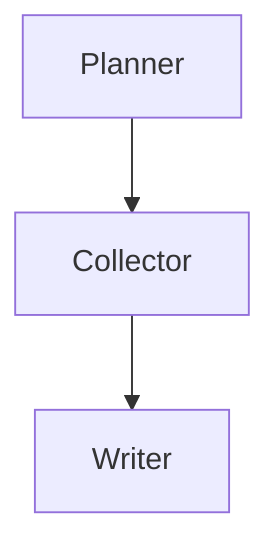

# LLM Markdown Normalizer（LLM 输出规范化）

ChatGPT / Claude / Gemini 等模型生成的 markdown 普遍存在碎片化分段、滥用 blockquote、ASCII 伪流程图、过度强调、模板化表达等"AI 味"问题。本 skill 不只是整理换行，而是对 LLM 输出做**规范化（Normalization）**，产出紧凑、专业、可读的 markdown。

## 何时调用

- 用户说"整理一下这个 markdown""去掉没必要的换行分段""精简格式""去 AI 味"
- 文本来自 LLM 输出，呈现明显的碎片化、过度强调、ASCII 图、模板化表达
- 用户要求"不要改内容，只整理格式"（走格式整理层级）
- 用户要求"清理一下这篇 LLM 生成的文章"（可走完整去 AI 味层级）

## 两级红线原则

### Level 1：格式整理（默认，不改动文字）

1. **不修改任何文字内容**：字、词、标点保留原样，不增删字符，不替换同义词
2. **只整理格式**：合并碎片、清理空行、修复列表/表格、转换 ASCII 图、把 blockquote 碎片改行内
3. **保留结构**：标题层级、表格、合理引用块、代码块围栏一律保留

### Level 2：去 AI 味（用户明确要求"去 AI 味""清理表达"时启用）

在 Level 1 基础上，允许：
4. 删除滥用 Emoji（🚀📌💡✨ 等技术文档无意义装饰）
5. 合并/删除模板化引导语（"真正重要的是""值得注意的是""核心在于"）
6. 删除重复 Heading（Heading 文字与紧随其后的正文首句重复时）
7. 合并机械重复的过渡句

**判断**：用户说"整理格式"→ Level 1；用户说"去 AI 味""清理表达""规范化"→ Level 2。

---

## 六大分类规则

### 一、段落规范化（合并碎片、清理空行、修复列表、修复编号）

**P1. 空行爆炸**（★★★★★）

多个连续空行压缩为单个空行；标题与正文间不留多余空行。

改前：
```
第一句。


第二句。
```
改后：
```
第一句。

第二句。
```

**P2. 标题后空一大片**（★★★★）

改前：
```
## Architecture


下面开始正文
```
改后：
```
## Architecture

下面开始正文
```

**P3. 一个句子拆五段**（★★★★★）

改前：
```
我建议。

不要。

这样。

做。
```
改后：
```
我建议。不要。这样。做。
```

**P4. 短句被空行拆碎**（★★★★★）

改前：
```
它们其实都是同一个东西。

所以 Agent 第一件事情不是搜索。

而是 Entity Resolution。
```
改后：
```
它们其实都是同一个东西。所以 Agent 第一件事情不是搜索。而是 Entity Resolution。
```

**P5. 单字/单词成段**（★★★★★）

连词、引导词、动词单独成段（"叫""或者""包括：""形成""建立""而是"）并入相邻段落。

改前：
```
不要叫 Search。叫

> Enterprise Research Agent

或者

> Domain Research Agent
```
改后：
```
不要叫 Search。叫 Enterprise Research Agent 或者 Domain Research Agent。
```

**P6. 散词零碎换行**（★★★★★）

改前：
```
然后去外部：

ECB

ESMA

ISSB
```
改后：
```
然后去外部：ECB、ESMA、ISSB
```

**P7. 成对零碎句**（★★★★★）

改前：
```
Confluence

找 ESG Project

GitHub

找 ESG Repository
```
改后：
```
Confluence 找 ESG Project
GitHub 找 ESG Repository
```

**P8. Bullet 爆炸**（★★★★★）

改前：
```
-

Confluence

-

GitHub

-

Jira
```
改后：
```
- Confluence
- GitHub
- Jira
```

**P9. 编号列表碎裂**（★★★★）

改前：
```
1.

First

2.

Second
```
改后：
```
1. First
2. Second
```

**P10. 列表之间空行过多**（★★★★）

改前：
```
- A

- B

- C
```
改后：
```
- A
- B
- C
```

### 二、Markdown 规范化（Heading、Table、Blockquote、Code Block、List）

**P11. 滥用 blockquote**（★★★★★）

单概念被半句引导 + 半句收尾夹击的 blockquote → 合并成行内文字。

改前：
```
最终输出的是

> Research Report

而不是

> Search Result
```
改后：
```
最终输出的是 Research Report，而不是 Search Result。
```

真正的 blockquote 保留（引用原话、对话示例）：
```
> "Programs must be written for people to read."
```

**P12. 代码块内每步插空行**（★★★★）

改前：
```
Input
    ↓

Research Goal
    ↓

Hypothesis Planning
```
改后（若保留代码块）：
```
Input
    ↓
Research Goal
    ↓
Hypothesis Planning
```
注意：若属于 ASCII 流程图，按 P17 转 Mermaid。

**P13. Markdown Table 前后垃圾空行**（★★★）

表格前后多余空行压缩为单空行。

**P14. 连续代码块合并**（★★★★）

若多个连续同语言代码块实际属于同一文件，合并为一个代码块。

改前：
````
```ts
const a = 1;
```

```ts
const b = 2;
```
````
改后：
````
```ts
const a = 1;
const b = 2;
```
````

**P15. Heading 套 Heading**（★★★★）

子 Heading 下只有一句话时，降级为正文，不要 Heading 炸裂。

改前：
```
## Vendor

### Background

Background 内容
```
改后（若 Background 仅一句）：
```
## Vendor

Background 内容
```

### 三、图形规范化（ASCII → Mermaid / Table / 自然语言）

**P16. ASCII 图、伪流程图、伪关系图**（★★★★★）

使用空格、缩进、箭头、Unicode 箭头、树形字符拼凑的图，转换为 Mermaid 或表格。

| 原始形式 | 转换方式 |
|----|------|
| 属性树 | 普通文字或 Markdown 表格 |
| 实体关系 | Mermaid graph |
| 流程 | Mermaid flowchart |
| 树结构 | Mermaid mindmap |
| 状态迁移 | Mermaid stateDiagram-v2 |
| 时序交互 | Mermaid sequenceDiagram |
| 架构关系 | Mermaid graph |
| 生命周期 | Mermaid stateDiagram-v2 |

**自动识别特征**（满足任意即视为 ASCII 图）：
- 多行只有一个词/短语，通过缩进表达层级
- 连续出现 `↓`、`↑`、`→`、`←`、`->`、`-->`、`=>`
- 连续出现 `│`、`├──`、`└──`
- 多列仅靠空格对齐形成关系
- 连续多行只有节点名，没有完整句子

**转换原则**：
1. 说明性内容（属性、组成、包含）→ 普通文字或表格
2. 图性内容（流程、关系、状态、时序）→ Mermaid
3. Mermaid 无法准确表达 → 自然语言，不保留 ASCII 图
4. 除非用户明确要求保留，否则禁止输出 ASCII 图

**P17. Mermaid 缺失**（★★★★★）

LLM 喜欢 `Planner ↓ Collector ↓ Writer` 竖排，直接生成 Mermaid：



### 四、结构规范化（Key-Value、Definition、伪表格、伪流程图）

**P18. 伪 Key-Value / Definition List 爆炸**（★★★★★）

改前：
```
Vendor

Riskconcile

Product

Reconciliation
```
改后：
```
| Key | Value |
|-----|-------|
| Vendor | Riskconcile |
| Product | Reconciliation |
```
或行内：`Vendor：Riskconcile` `Product：Reconciliation`

**P19. 伪表格**（★★★★★）

靠空格对齐的伪表格转为真正的 Markdown Table。

改前：
```
Vendor      Riskconcile
Product     Recon
Language    Java
```
改后：
```
| Vendor | Riskconcile |
| Product | Recon |
| Language | Java |
```

### 五、强调规范化（过度加粗、重复标题、重复引导语、Emoji）

**P20. 过度强调**（★★★★★）

改前：
```
**Enterprise Search**

不是

**Enterprise RAG**

而是

**Research Platform**
```
改后：
```
Enterprise Search 不是 Enterprise RAG，而是 Research Platform。
```

**P21. Emoji 滥用**（★★★★，Level 2）

技术文档中的装饰性 Emoji（🚀📌💡✨🔥）全部删除。代码/配置中有语义的 Emoji 保留。

**P22. 重复 Heading**（★★★★，Level 2）

Heading 文字与紧随正文首句重复时，删除重复正文首句。

改前：
```
## Summary

Summary
......
```
改后：
```
## Summary
......
```

### 六、LLM 风格去除（模板化表达、机械过渡句）

**P23. 无意义强调引导语**（★★★★★，Level 2）

连续出现时合并或删除冗余引导语：
- "真正重要的是："
- "其实真正重要的是："
- "核心在于："
- "关键点在于："
- "值得注意的是："
- "需要强调的是："

**处理**：保留首个作为引出，后续删除；或直接合并到正文句。

**P24. 机械过渡句**（★★★★，Level 2）

LLM 喜欢的过渡套话（"接下来我们来看""值得一提的是""不仅如此"等）连续出现时合并/删除，保留信息密度。

---

## 判断边界速查

| 元素 | 保留 | 合并/整理 |
|------|------|----------|
| 并列示例引用块（多例） | ✓ | |
| 单概念被半句夹击的引用块 | | ✓ 改行内 |
| 真正的原话引用 | ✓ | |
| 代码块围栏（```） | ✓ | |
| 代码块内空行 | | ✓ 去掉/转 Mermaid |
| 标题层级（#/##/###） | ✓ | |
| 单句子标题 | | ✓ 降级为正文 |
| 表格 | ✓ | |
| 伪表格（空格对齐） | | ✓ 转 Markdown Table |
| 列表（- / *） | ✓ | |
| 列表项间多余空行 | | ✓ 去掉 |
| 单字成段的连词 | | ✓ 并入相邻 |
| 被空行拆碎的短句 | | ✓ 合并一段 |
| 散词列举 | | ✓ 逗号分隔或列表 |
| ASCII 图 / 伪流程图 | | ✓ 转 Mermaid/表格/自然语言 |
| 伪 Key-Value | | ✓ 转表格或行内 |
| 过度加粗碎片 | | ✓ 合并为正常句 |
| 装饰性 Emoji | | ✓ 删除（Level 2） |
| 模板化引导语 | | ✓ 合并/删除（Level 2） |
| 文字内容、标点 | ✓ 原样 | |

## 操作流程

1. **判断层级**：用户要"格式整理"→ Level 1；要"去 AI 味"→ Level 2
2. **通读全文**，按六大分类识别问题位置
3. **按段落处理**，从前往后逐段整理：
   - 段落：合并碎片、清理空行（P1-P10）
   - Markdown：修 blockquote、列表、表格、Heading（P11-P15）
   - 图形：ASCII 图转 Mermaid/表格（P16-P17）
   - 结构：伪 Key-Value/伪表格转表格（P18-P19）
   - 强调：合并过度加粗、删 Emoji、去重复 Heading（P20-P22，Level 2）
   - 风格：合并/删模板化引导语（P23-P24，Level 2）
4. **保留所有结构元素**：标题、表格、合理引用块、代码块围栏、合理列表
5. **校验**：Level 1 用 diff 验证文字零修改；Level 2 检查信息未丢失

## 校验命令

Level 1 整理后，验证文字内容零修改（忽略空白）：

```bash
diff <(tr -d '[:space:]' < original.md) <(tr -d '[:space:]' < tidied.md)
```

无输出 = 文字零修改，只整理了格式。

Level 2 不适用此校验（允许删除 Emoji、模板化表达）。

## 反模式（不要做）

- ❌ 把并列示例引用块合并成一句（破坏示例结构）
- ❌ 删除代码块围栏（代码块必须保留）
- ❌ 为了合并句子而添加逗号/连词（Level 1 标点不增不减）
- ❌ 修改任何文字、替换同义词、调整语序（Level 1）
- ❌ 删除表格、合理列表、标题等结构性元素
- ❌ 把合理的段落拆分当成啰嗦合并掉（只整理明显碎片）
- ❌ 保留仅依赖缩进、空格或箭头组成的 ASCII 图
- ❌ 使用 Unicode 箭头（↓、↑、→）模拟流程图或关系图
- ❌ 将可用 Mermaid 表达的流程/关系/状态/树保留为 ASCII 图
- ❌ Level 1 时删除 Emoji 或模板化表达（需 Level 2 授权）
- ❌ Level 2 时删除有信息量的内容（只删装饰和冗余）
