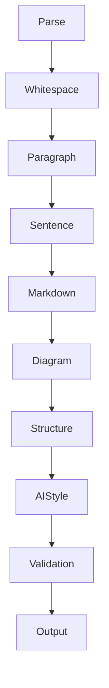

# LLM Markdown Normalizer

把 LLM（ChatGPT/Claude/Gemini）输出的 markdown 规范化为紧凑、专业、可读的文档。

**设计思路**：多阶段 **Normalization Pipeline**，像 Prettier/clang-format 按 Pass 执行。规则按 Pass 组织，易于扩展。

## 何时调用

- 用户说"整理 markdown""去掉换行分段""精简格式""去 AI 味""规范化"
- 文本来自 LLM 输出，呈现碎片化、ASCII 图、过度强调、模板化表达
- 用户要求"只整理格式"（L0）、"整理通顺"（L1，默认）或"去 AI 味"（L2）

## 三级模式

| Level | 能力 | 是否允许改写 |
|-------|------|------------|
| **L0 Whitespace** | 只整理空行、列表、Markdown 结构 | ❌ |
| **L1 Semantic Normalize（默认）** | 调语序、合并短句、整理并列、优化句法，**语义必须完全等价** | ✅ |
| **L2 Style Normalize** | 去 AI 味、删模板化表达、删 Emoji、去冗余、改善文风 | ✅（轻微编辑，不改核心信息） |

**判断**：用户说"只整理格式/不要改字"→ L0；说"整理/精简/通顺"→ L1；说"去 AI 味/清理表达/规范化"→ L2。

## 核心红线：语义不变（非文字不变）

> **不改变任何语义。允许在不改变含义的前提下，调整语序、段落顺序、句子拼接方式，以获得更自然、更符合中文表达习惯的行文。**

**语义等价（Semantic-preserving Rewrite）定义**：
> 所有修改必须满足：读者无法从整理后的文本中获得任何新的信息，也不会失去任何已有信息，仅改善可读性和表达流畅度。

### 允许（L1+）

- 调整语序（"不要叫 Search。叫 X" → "不要叫 Search，叫 X"）
- 合并连续短句
- 调整并列顺序（"GitHub\n\nConfluence\n\nJira" → "GitHub、Confluence、Jira"）
- 前置修饰语（"自动搜索\n\n企业内部\n\n所有资料" → "自动搜索企业内部所有资料"）
- 调整引用位置（blockquote 碎片改行内）
- 合并重复主语（"Agent 会搜索 GitHub。Agent 会搜索 Jira。" → "Agent 会搜索 GitHub、Jira"）
- 合并连续谓语（"收集证据。分析证据。生成报告。" → "收集证据、分析证据，并生成报告"）
- 句号→逗号的标点调整（保持可读）

### 禁止（所有 Level）

- 修改事实/逻辑/推理/因果/时间顺序/强调对象/限定条件/结论
- 删除信息或增加信息
- 引入改变逻辑关系的连接词（如"但是"→"因此"）
- L0 时进行任何句法改写

## 三条核心原则

1. **信息密度**：每一段表达一个完整观点。不拆碎，不灌水。
2. **语义完整性**：整理后保持自然语言可读，无拼错语义的合并。
3. **输出目标**：符合 GitHub README / 技术文档规范——Paragraph ≤ 一个观点，Heading 不连续空，Diagram 用 Mermaid，Table 用 Markdown，Code Fence 完整，List 紧凑。

---

## Normalization Pipeline



模型按 Pipeline 顺序工作，每个 Pass 只做一类事。

### Pass 1: Parse（识别块类型）

通读全文，给每个块打标签：`heading` / `paragraph` / `list` / `table` / `code` / `blockquote` / `ascii-diagram` / `pseudo-kv` / `pseudo-table`。

**ASCII 图识别特征**（满足任意即标记）：
- 多行只有一个词/短语，通过缩进表达层级
- 连续出现 `↓` `↑` `→` `←` `->` `-->` `=>` `│` `├──` `└──`
- 多列仅靠空格对齐
- 连续多行只有节点名，没有完整句子

### Pass 2: Whitespace Normalize（L0+）

- 多个连续空行 → 压缩为单个空行
- 标题与正文间多余空行 → 单空行
- 表格/代码块前后垃圾空行 → 单空行
- 行尾空白 → 去掉

### Pass 3: Paragraph Normalize（L0+）

合并碎片段落（不做句法改写，仅拼接）。

- 句子拆五段 → 合并为一段
- 短句被空行拆碎 → 合并
- 单字/单词成段（连词/引导词）→ 并入相邻
- 散词零碎换行 → 逗号分隔句或列表
- 成对零碎句 → 合并为成对行或列表

L0 只做拼接，不改标点；L1+ 允许句号→逗号调整。

### Pass 4: Sentence Normalize（L1+，核心改写 Pass）

在**不改变任何事实、观点、逻辑关系和语义**的前提下，进行轻量级句法调整。

**允许操作**：

1. **调整语序**
   - "不要叫 Search。叫 X" → "不要叫 Search，叫 X"
2. **合并连续短句**
   - "真正重要的是。Entity Resolution。" → "真正重要的是 Entity Resolution"
3. **调整并列顺序**
   - "GitHub\n\nConfluence\n\nJira" → "GitHub、Confluence、Jira"
4. **前置修饰语**
   - "自动搜索\n\n企业内部\n\n所有资料" → "自动搜索企业内部所有资料"
5. **调整引用位置**
   - "最终输出的是\n\n> Research Report\n\n而不是 Search Result" → "最终输出的是 Research Report，而不是 Search Result"
6. **合并重复主语**
   - "Agent 会搜索 GitHub。Agent 会搜索 Jira。Agent 会搜索 ServiceNow。" → "Agent 会搜索 GitHub、Jira 和 ServiceNow"
7. **合并连续谓语**
   - "收集证据。分析证据。生成报告。" → "收集证据、分析证据，并生成报告"

**语义完整性检查**：改写后通读，确认无拼错语义、无逻辑偏移。若改写后读不通或改变强调对象，回退到 Pass 3 的拼接结果。

### Pass 5: Markdown Normalize（L0+）

- **blockquote 滥用**：单概念被半句夹击 → 改行内；并列示例/原话引用 → 保留
- **Bullet 爆炸**（`-\n\n项`）→ 紧凑列表
- **编号列表碎裂**（`1.\n\nFirst`）→ `1. First`
- **列表密度**：每项 <15 字 → 紧凑无空行；多内容 → 保留空行
- **代码块内空行** → 去掉（ASCII 图转 Pass 6）
- **连续代码块**：同语言同文件 → 合并
- **Code Fence 修复**：补全缺失围栏
- **Heading 套 Heading**：子 Heading 下仅一句话 → 降级为正文
- **连续 Heading 检测**：`## A` → `### B` → `#### C` → `##### D` → 一句话，自动降级
- **Heading 合法性**：`#` 后无内容、跳级 → 修复

### Pass 6: Diagram Normalize（L0+）

ASCII 图转换为 Mermaid 或表格，**不保留 ASCII 图**（除非用户明确要求）。

**转换原则**：
1. 说明性内容（属性/组成/包含）→ 列表或表格
2. 图性内容（流程/关系/状态/时序）→ Mermaid
3. Mermaid 无法表达 → 自然语言

**Mermaid 类型按内容映射**（不写死，按需扩展）：

| 内容性质 | Mermaid 类型 |
|---------|-------------|
| 流程 | flowchart |
| 关系 | graph |
| 状态迁移/生命周期 | stateDiagram-v2 |
| 时序交互 | sequenceDiagram |
| 树/思维导图 | mindmap |
| 类关系 | classDiagram |
| 实体关系 | erDiagram |
| 用户旅程 | journey |
| 需求 | requirementDiagram |
| 时间线 | timeline |
| Git 流程 | gitGraph |
| 象限 | quadrantChart |

**Mermaid 节点名转义**（关键，否则渲染错误）：
- 节点名含空格/特殊字符 → 用引号包裹：`"Company Background"`
- 或用下划线：`Company_Background`
- 边标签用 `|...|`：`A -->|uses| B`

**转换时不得添加原文没有的文字**：表头/引导语只能用原文已有词汇。

### Pass 7: Structure Normalize（L0+）

- **伪 Key-Value / Definition List**：
  - 少于 5 行 → 行内 `Key：Value`
  - 超过 5 行 → Markdown Table
- **伪表格**（空格对齐）→ Markdown Table
- **属性树** → 列表或表格
- **重复 Heading**：Heading 文字与紧随正文首句重复 → 删重复正文（L2）

### Pass 8: AI Style Normalize（L2）

去除 AI 味，只删装饰和冗余，不删有信息量内容。

- **装饰性 Emoji**（🚀📌💡✨🔥）→ 删除；代码/配置中有语义的 Emoji 保留
- **标题去第一人称**："我建议定位成 X" → "X 定位"；"我觉得最值得做的是 X" → "X"
- **第一人称语气**："我建议/我觉得/我认为/我不会定位为" → 去除或改客观表述
- **口头禅**："其实/当然/确实/总的来说/综上所述" → 删除
- **模板化引导语**："真正重要的是/值得注意的是/核心在于/关键点在于/需要强调的是" → 连续出现时保留首个，其余删除
- **机械过渡句**："接下来我们来看/值得一提的是/不仅如此" → 合并/删除

### Pass 9: Validation

- **L0 文字校验**：`diff` 去空白后对比，无输出 = 零修改
- **L1 语义校验**：原信息点全部保留，无新增信息，逻辑关系未变
- **L2 信息校验**：核心信息未丢失，仅删装饰/冗余
- **图形转换校验**：原节点名全部保留在 Mermaid/表格中
- **语义完整性校验**：通读整理后文本，确认无拼错语义的合并
- **Markdown 合法性校验**：Heading 层级连续、Code Fence 配对、表格列数一致

---

## 输出目标规范

| 元素 | 规范 |
|------|------|
| Paragraph | ≤ 一个完整观点 |
| Heading | 不连续空 Heading，层级连续 |
| Diagram | Mermaid（节点名转义） |
| Table | Markdown Table |
| Code | Fence 完整配对 |
| List | 紧凑（短项）/分空行（长项） |
| 空行 | 单空行分隔，无爆炸 |
| 句法 | 自然流畅，符合中文表达习惯（L1+） |

## 校验命令

L0 纯格式整理后：

```bash
diff <(tr -d '[:space:]' < original.md) <(tr -d '[:space:]' < tidied.md)
```

无输出 = 文字零修改。L1/L2 不适用此命令（允许句法改写/删冗余），改用语义校验：原信息点全部保留、无新增信息、逻辑关系未变。

## 反模式

- ❌ 改变事实/逻辑/因果/强调对象/限定条件/结论
- ❌ 删除或增加信息
- ❌ 引入改变逻辑关系的连接词（"但是"→"因此"）
- ❌ 合并时拼错语义（"叫 Enterprise Search Research Agent"）
- ❌ Mermaid 节点名含空格不加引号（渲染错误）
- ❌ 转换时添加原文没有的文字
- ❌ L0 时进行句法改写
- ❌ L1 时删除 Emoji/模板化表达（需 L2 授权）
- ❌ L2 时删除有信息量内容
- ❌ 保留 ASCII 图（除非用户明确要求）
- ❌ 跨 Pass 混合处理（应按 Pipeline 顺序）
- ❌ 把并列示例引用块合并成一句
- ❌ 删除代码块围栏
