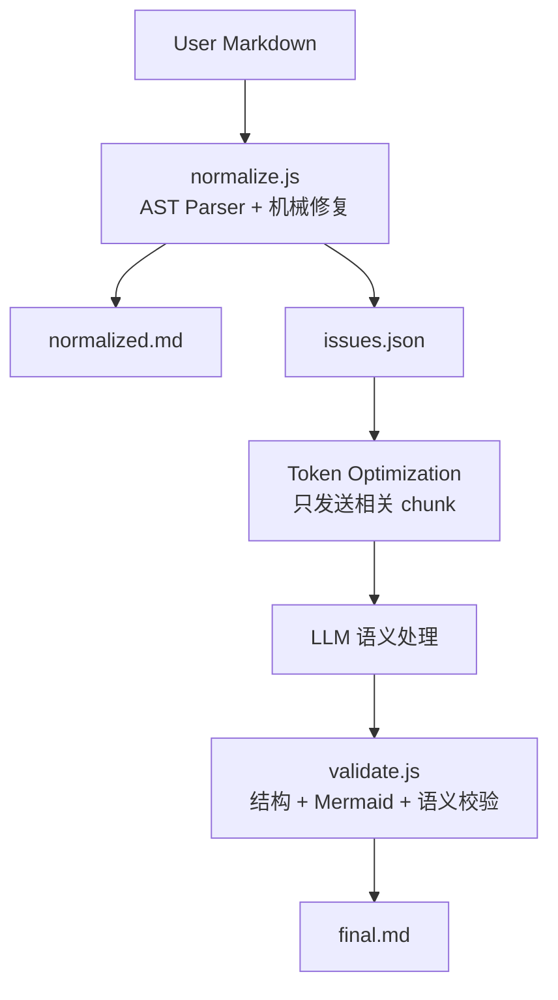
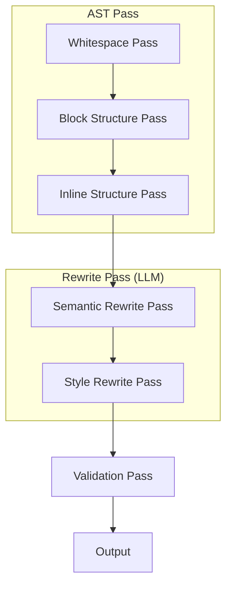
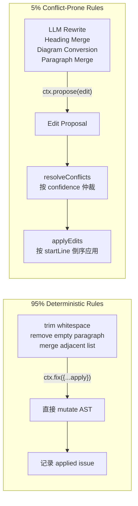

# LLM Markdown Normalizer

把 LLM（ChatGPT/Claude/Gemini）输出的 markdown 规范化为紧凑、专业、可读的文档。

**设计思路**：Hybrid Architecture —— **确定性 Markdown Transformation 用 JS 执行，语义保持改写用 LLM 执行**。JS 不负责理解文本含义，只负责 AST 解析、结构检测、机械修复和 Issue 生成。LLM 不负责 Markdown 格式修复，只负责需要语义判断的 Rewrite。

像 Prettier / clang-format 一样按 Pass 执行，规则按 Pass 组织，易于扩展。

## 何时调用

- 用户说"整理 markdown""去掉换行分段""精简格式""去 AI 味""规范化"
- 文本来自 LLM 输出，呈现碎片化、ASCII 图、过度强调、模板化表达
- 用户要求"只整理格式"（L0）、"整理通顺"（L1，默认）或"去 AI 味"（L2）

## 三级模式

| Level | 能力 | 是否允许改写 |
|-------|------|------------|
| **L0 Whitespace** | 只整理空行、列表、Markdown 结构 | ❌ |
| **L1 Semantic Normalize（默认）** | 调语序、合并短句、整理并列、优化句法，**语义必须完全等价** | ✅ |
| **L2 Style Normalize** | 去 AI 味、删模板化表达、删 Emoji、去冗余、改善文风 | ✅（轻微编辑，不改核心信息） |

**判断**：用户说"只整理格式/不要改字"→ L0；说"整理/精简/通顺"→ L1；说"去 AI 味/清理表达/规范化"→ L2。

## 核心红线：语义不变（非文字不变）

> **不改变任何语义。允许在不改变含义的前提下，调整语序、段落顺序、句子拼接方式，以获得更自然、更符合中文表达习惯的行文。**

**语义等价（Semantic-preserving Rewrite）定义**：
> 所有修改必须满足：读者无法从整理后的文本中获得任何新的信息，也不会失去任何已有信息，仅改善可读性和表达流畅度。

### 允许（L1+）

- 调整语序（"不要叫 Search。叫 X" → "不要叫 Search，叫 X"）
- 合并连续短句
- 调整并列顺序（"GitHub\n\nConfluence\n\nJira" → "GitHub、Confluence、Jira"）
- 前置修饰语（"自动搜索\n\n企业内部\n\n所有资料" → "自动搜索企业内部所有资料"）
- 调整引用位置（blockquote 碎片改行内）
- 合并重复主语（"Agent 会搜索 GitHub。Agent 会搜索 Jira。" → "Agent 会搜索 GitHub、Jira"）
- 合并连续谓语（"收集证据。分析证据。生成报告。" → "收集证据、分析证据，并生成报告"）
- 句号→逗号的标点调整（保持可读）

### 禁止（所有 Level）

- 修改事实/逻辑/推理/因果/时间顺序/强调对象/限定条件/结论
- 删除信息或增加信息
- 引入改变逻辑关系的连接词（如"但是"→"因此"）
- L0 时进行任何句法改写

## 三条核心原则

1. **信息密度**：每一段表达一个完整观点。不拆碎，不灌水。
2. **语义完整性**：整理后保持自然语言可读，无拼错语义的合并。
3. **输出目标**：符合 GitHub README / 技术文档规范——Paragraph ≤ 一个观点，Heading 不连续空，Diagram 用 Mermaid，Table 用 Markdown，Code Fence 完整，List 紧凑。

---

## AST Pass Pipeline



Normalizer 采用 **AST-based Pass 划分**，Markdown 的核心不是文本，是 AST。模型按 Pipeline 顺序工作，每个 Pass 只做一类事。



### Pass 1: Whitespace（L0+，JS 执行）

纯机械操作，confidence 0.99，全部自动修复。

- 多个连续空行 → 压缩为单个空行
- 标题与正文间多余空行 → 单空行
- 表格/代码块前后垃圾空行 → 单空行
- 行尾空白 → 去掉
- 首尾多余空行 → 去掉

### Pass 2: Block Structure（L0+，JS 执行）

块级结构修复，高置信度自动修复，低置信度报告 issue。

- **空段落移除**（confidence: 0.99）
- **列表修复**：相邻同类列表合并（confidence: 0.95）
- **Bullet 爆炸**（`-\n\n项`）→ 紧凑列表（confidence: 0.92）
- **编号列表碎裂**（`1.\n\nFirst`）→ `1. First`（confidence: 0.90）
- **Code Fence 修复**：补全缺失围栏（confidence: 0.95）
- **Heading 合法性**：`#` 后无内容、跳级 → 修复（confidence: 0.90）
- **连续 Heading 检测**：`## A` → `### B` → `#### C` → 一句话，降级（confidence: 0.75，仅报告）
- **Heading 套 Heading**：子 Heading 下仅一句话 → 降级为正文（confidence: 0.70，仅报告）
- **伪 Key-Value / Definition List**：检测（confidence: 0.80，LLM 决策）
- **伪表格**（空格对齐）：检测（confidence: 0.80，LLM 决策）
- **ASCII 图检测**：检测（confidence: 0.75，报告，LLM 转 Mermaid）

### Pass 3: Inline Structure（L0+，JS 执行）

行内结构检测与修复。

- **连续代码块**：同语言同文件 → 合并（confidence: 0.90）
- **代码块内空行** → 去掉（ASCII 图转 Pass 6）（confidence: 0.85）
- **blockquote 滥用**：检测（confidence: 0.80，LLM 决策）
- **列表密度**：每项 <15 字 → 紧凑无空行（confidence: 0.75，建议）

### Pass 4: Semantic Rewrite（L1+，LLM 执行）

在**不改变任何事实、观点、逻辑关系和语义**的前提下，进行轻量级句法调整。

**LLM 只处理 JS 标记的 issue chunk**，不重新分析全文，节省 token。

**允许操作**：

1. **调整语序**
   - "不要叫 Search。叫 X" → "不要叫 Search，叫 X"
2. **合并连续短句**
   - "真正重要的是。Entity Resolution。" → "真正重要的是 Entity Resolution"
3. **调整并列顺序**
   - "GitHub\n\nConfluence\n\nJira" → "GitHub、Confluence、Jira"
4. **前置修饰语**
   - "自动搜索\n\n企业内部\n\n所有资料" → "自动搜索企业内部所有资料"
5. **调整引用位置**
   - "最终输出的是\n\n> Research Report\n\n而不是 Search Result" → "最终输出的是 Research Report，而不是 Search Result"
6. **合并重复主语**
   - "Agent 会搜索 GitHub。Agent 会搜索 Jira。Agent 会搜索 ServiceNow。" → "Agent 会搜索 GitHub、Jira 和 ServiceNow"
7. **合并连续谓语**
   - "收集证据。分析证据。生成报告。" → "收集证据、分析证据，并生成报告"

**语义完整性检查**：改写后通读，确认无拼错语义、无逻辑偏移。若改写后读不通或改变强调对象，回退到 Pass 3 的拼接结果。

### Pass 5: Style Rewrite（L2，LLM 执行）

去除 AI 味，只删装饰和冗余，不删有信息量内容。

- **装饰性 Emoji**（🚀📌💡✨🔥）→ 删除；代码/配置中有语义的 Emoji 保留
- **标题去第一人称**："我建议定位成 X" → "X 定位"；"我觉得最值得做的是 X" → "X"
- **第一人称语气**："我建议/我觉得/我认为/我不会定位为" → 去除或改客观表述
- **口头禅**："其实/当然/确实/总的来说/综上所述" → 删除
- **模板化引导语**："真正重要的是/值得注意的是/核心在于/关键点在于/需要强调的是" → 连续出现时保留首个，其余删除
- **机械过渡句**："接下来我们来看/值得一提的是/不仅如此" → 合并/删除

### Pass 6: Diagram Normalize（L0+，LLM 执行，JS 检测）

ASCII 图转换为 Mermaid 或表格，**不保留 ASCII 图**（除非用户明确要求）。JS 负责检测并标记 issue，LLM 负责转换。

**转换原则**：
1. 说明性内容（属性/组成/包含）→ 列表或表格
2. 图性内容（流程/关系/状态/时序）→ Mermaid
3. Mermaid 无法表达 → 自然语言

**Mermaid 类型按内容映射**（不写死，按需扩展）：

| 内容性质 | Mermaid 类型 |
|---------|-------------|
| 流程 | flowchart |
| 关系 | graph |
| 状态迁移/生命周期 | stateDiagram-v2 |
| 时序交互 | sequenceDiagram |
| 树/思维导图 | mindmap |
| 类关系 | classDiagram |
| 实体关系 | erDiagram |
| 用户旅程 | journey |
| 需求 | requirementDiagram |
| 时间线 | timeline |
| Git 流程 | gitGraph |
| 象限 | quadrantChart |

**Mermaid 节点名转义**（关键，否则渲染错误）：
- **默认：把空格替换为下划线作 ID，不加标签**。mermaid 会直接显示 ID，下划线版可读性足够。
  - `Our Usage` → `Our_Usage`（直接用，不加标签）
  - `Research ESG` → `Research_ESG`
  - `ServiceNow CMDB` → `ServiceNow_CMDB`
- **仅当节点名含下划线无法处理的特殊字符（括号、引号、斜杠等）时，才用引号标签**：`["foo (bar)"]`
- **节点 ID 必须保留原词可读性**：把空格替换为下划线，**禁止缩写成无意义字母**（如 `CR`、`OBI`、`N8024`）
  - ✅ 正确：`Vendor`、`Research_ESG`、`ServiceNow_CMDB`、`Incidents`
  - ❌ 错误：`Incidents["Incidents"]`（冗余）、`Our_Usage["Our Usage"]`（空格变下划线而已，冗余）、`RE["Research ESG"]`（缩写）、`N8024["Research ESG"]`（hash）
- 边标签用 `|...|`：`A -->|uses| B`

**转换时不得添加原文没有的文字**：表头/引导语只能用原文已有词汇。

### Pass 7: Validation

- **L0 文字校验**：`diff` 去空白后对比，无输出 = 零修改
- **L1 语义校验**：原信息点全部保留，无新增信息，逻辑关系未变
- **L2 信息校验**：核心信息未丢失，仅删装饰/冗余
- **图形转换校验**：原节点名全部保留在 Mermaid/表格中
- **语义完整性校验**：通读整理后文本，确认无拼错语义的合并
- **Markdown 合法性校验**：Heading 层级连续、Code Fence 配对、表格列数一致
- **Mermaid 语法校验**：节点名转义正确

---

## Script Integration Contract

> 当 `normalize.mjs` 可用时，**优先调用脚本处理确定性规则，不要人工模拟**。

### 分工原则

| 职责 | JS（normalize.mjs） | LLM |
|------|------|-----|
| Markdown AST 解析 | ✅ | |
| Whitespace 规范化 | ✅（confidence 0.99） | |
| Block 结构修复（列表/fence/heading） | ✅（高置信度自动，低置信度报告） | |
| Inline 结构检测 | ✅（检测 + 报告） | |
| ASCII 图检测 | ✅（检测 + 定位） | ✅ 转 Mermaid/表格 |
| Mermaid 语法检查 | ✅（节点名转义检测） | ✅ 执行修复 |
| AI Density Score | ✅（打分 + 定位） | ✅ 执行清理 |
| Markdown lint | ✅（检测 + 定位） | ✅ 执行修复 |
| Issue Schema 生成 | ✅（结构化输出） | |
| Token Optimization | ✅（提取相关 chunk） | |
| Confidence 阈值系统 | ✅（自动/报告分流） | |
| 语义等价改写 | | ✅ |
| 去 AI 味执行 | | ✅ |
| Semantic Diff | | ✅ |
| 文档结构优化 | | ✅ |

### 命令行接口

```bash
# === 三种运行模式 ===

# 1. check 模式（Dry Run）：只检测，不修改文件
node normalize.mjs input.md --check
# 输出问题清单到 stdout，退出码：0=无问题，1=有问题

# 2. report 模式：检测 + 输出 issues.json
node normalize.mjs input.md --report --json issues.json
# 输出：normalized.md 到 stdout，issues.json 到指定文件

# 3. fix 模式：自动修复高置信度问题 + 输出（默认）
node normalize.mjs input.md --fix -o output.md
# 自动修复 confidence >= 阈值的问题，其余记录到 issues

# === Profile（strict / default / relaxed）===

node normalize.mjs input.md --profile strict --level L2
node normalize.mjs input.md --profile relaxed --check

# === 其他选项 ===

node normalize.mjs --list-rules         # 列出所有注册 Rule 的 metadata
node normalize.mjs input.md --doc architecture.md --report --json out.json
cat file.md | node normalize.mjs --level L2

# === 编程式调用（import 不触发 CLI）===

import { runPipeline, registerRule, RULES, PROFILES } from './normalize.mjs';
const result = runPipeline(markdown, { level: 'L1', profileName: 'default', mode: 'fix' });
// result.normalized / result.issueSchema / result.checkReport / result.ctx / result.validation
```

**CLI 选项速查**：

| 选项 | 取值 | 说明 |
|------|------|------|
| `--check` / `--report` / `--fix` | 模式 | check=Dry Run，report=输出 JSON，fix=自动修复（默认） |
| `--level` | `L0` / `L1` / `L2` | 规范化级别（默认 `L1`） |
| `--profile` | `strict` / `default` / `relaxed` | Profile（默认 `default`） |
| `--json <file>` | 路径 | 输出 issues.json 到文件（配合 `--report`） |
| `-o <file>` | 路径 | 输出规范化后的 markdown 到文件 |
| `--doc <name>` | 字符串 | 文档名（用于 issue schema） |
| `--list-rules` | — | 列出所有 Rule metadata，不处理文件 |
| `--help` / `-h` | — | 显示帮助 |

### Check 模式输出示例

```
Found 12 issues:

  ✓  1 remove-empty-paragraph         [auto-fixable, confidence 0.99] (whitespace)
  ✓  1 merge-adjacent-lists           [auto-fixable, confidence 0.85] (structure)
  ⚠  1 ascii-diagram                  [llm-required, confidence 0.78] (diagram)
  ⚠  2 ai-phrase                      [llm-required, confidence 0.62] (ai-style)
  ⚠  8 fragment-sentence              [llm-required, confidence 0.92] (structure)

Summary:
  Applied:    0 fixes
  Auto-fix:   2 (pass --fix to apply)
  LLM-req:    11 (pass --json to export)
  AI Score:   0.24 (phrase=0.09, heading=0, emoji=0, frag=1)
  Symbols:    10 headings, 1 tables, 8 code, 1 diagrams, 0 links
  Rules:      11 registered (whitespace, structure, validation, diagram, ai-style)
```

**字段说明**：
- `Applied`：本次实际应用的修复数（check 模式恒为 0）
- `Auto-fix`：可用 `--fix` 自动应用的 deterministic 修复（confidence ≥ 阈值）
- `LLM-req`：需要 LLM 处理的语义类 issue
- `AI Score`：4 维（phrase + heading + emoji + frag），> 0.25 时会提示 `⚠ recommend L2 cleanup`
- `Symbols`：5 个 key（headings / tables / code / diagrams / links），不做 entity 升级
- `Rules`：从 RULES registry 自动统计，按 category 分组

---

## Issue Schema（JS ↔ LLM 接口）

这是连接 JS 和 LLM 的关键契约。JS 输出结构化 issues，LLM 按 issue 逐个处理，不重新分析全文。

```json
{
  "document": "architecture.md",
  "profile": "default",
  "level": "L1",
  "stats": {
    "totalTokens": 12450,
    "issueTokens": 1850,
    "savings": "85%",
    "issues": 4,
    "autoFixable": 2,
    "llmRequired": 2,
    "appliedFixes": 2
  },
  "symbols": {
    "headings": [
      { "level": 2, "text": "系统架构", "line": 44 },
      { "level": 2, "text": "数据流向", "line": 63 }
    ],
    "tables": [{ "line": 80, "rows": 5 }],
    "codeBlocks": [{ "line": 12, "lang": "python" }],
    "diagrams": [{ "line": 70, "type": "mermaid" }],
    "links": [{ "url": "https://example.com", "text": "reference", "line": 95 }]
  },
  "appliedFixes": [
    { "rule": "remove-empty-paragraph", "pass": "whitespace", "action": "applied" },
    { "rule": "merge-adjacent-lists", "pass": "block-structure", "action": "applied" }
  ],
  "issues": [
    {
      "id": "issue-001",
      "rule": "ascii-diagram",
      "pass": "diagram-detection",
      "severity": "medium",
      "confidence": 0.78,
      "action": "llm_required",
      "applied": false,
      "location": { "startLine": 45, "endLine": 62 },
      "context": {
        "before": "## 系统架构\n",
        "chunk": "Planner\n  ↓\nCollector\n  ↓\nAnalyzer\n  ↓\nReporter",
        "after": "\n## 数据流向\n"
      },
      "sample": "Planner\n ↓\nCollector",
      "suggestion": "Convert ASCII diagram to mermaid or table",
      "metadata": {
        "scoreBreakdown": { "shortLines": 0.3, "arrows": 0.3, "noPunctuation": 0.2 },
        "diagramType": "flow"
      },
      "evidence": {
        "matched": ["包含箭头/树字符的 ASCII 图", "无法被 Markdown 渲染器渲染"],
        "why": "ASCII 图无法渲染，应转为 Mermaid 或表格"
      }
    },
    {
      "id": "issue-002",
      "rule": "fragment-sentence",
      "pass": "fragment-detection",
      "severity": "low",
      "confidence": 0.92,
      "action": "llm_required",
      "applied": false,
      "location": { "startLine": 120, "endLine": 135 },
      "context": {
        "chunk": "自动搜索\n\n企业内部\n\n所有资料"
      },
      "sample": "自动搜索 ... 企业内部",
      "suggestion": "Merge fragmented short paragraphs into one sentence",
      "evidence": {
        "matched": ["连续短段落", "每段小于 20 字符", "破坏信息密度"],
        "why": "碎片化段落破坏信息密度"
      }
    },
    {
      "id": "issue-003",
      "rule": "remove-empty-paragraph",
      "pass": "whitespace",
      "severity": "low",
      "confidence": 0.99,
      "action": "auto_fix",
      "applied": true,
      "location": { "startLine": 18, "endLine": 18 },
      "context": { "chunk": "" },
      "sample": "",
      "suggestion": "",
      "evidence": {
        "matched": ["空段落无内容"],
        "why": "空段落占用版面，应删除"
      }
    },
    {
      "id": "issue-004",
      "rule": "diagram-ir-extracted",
      "pass": "diagram-detection",
      "severity": "low",
      "confidence": 0.85,
      "action": "auto_fix",
      "applied": true,
      "location": { "startLine": 45, "endLine": 62 },
      "context": { "chunk": "" },
      "sample": "{\"type\":\"flow\",\"nodes\":[\"Vendor\",\"Application\"]}",
      "suggestion": "Auto-generated DiagramIR (flow), 4 nodes, 3 edges. Mermaid preview available.",
      "metadata": {
        "ir": {
          "type": "flow",
          "nodes": ["Vendor", "Application", "Service", "Database"],
          "edges": [["Vendor", "Application"], ["Application", "Service"], ["Service", "Database"]]
        },
        "mermaidPreview": "flowchart TD\n    Vendor\n    Application\n    Vendor --> Application\n    ..."
      },
      "evidence": {
        "matched": ["包含箭头/树字符的 ASCII 图", "无法被 Markdown 渲染器渲染"],
        "why": "ASCII 图无法渲染，应转为 Mermaid 或表格"
      }
    }
  ],
  "aiScore": {
    "total": 0.24,
    "breakdown": {
      "phrase": 0.09,
      "heading": 0,
      "emoji": 0,
      "fragmentation": 1.0
    },
    "phraseCount": 1,
    "sentenceCount": 15,
    "firstPersonHeading": 0,
    "headingCount": 10,
    "emojiCount": 0,
    "recommendCleanup": true
  },
  "rules": [
    { "id": "remove-empty-paragraph", "category": "whitespace", "autofix": true, "llm": false, "confidence": 0.99, "tags": ["paragraph"] },
    { "id": "merge-adjacent-lists", "category": "structure", "autofix": true, "llm": false, "confidence": 0.85, "tags": ["list"] },
    { "id": "ascii-diagram", "category": "diagram", "autofix": false, "llm": true, "confidence": 0.78, "tags": ["ascii", "mermaid"] },
    { "id": "fragment-sentence", "category": "structure", "autofix": false, "llm": true, "confidence": 0.92, "tags": ["paragraph", "fragment"] }
  ],
  "validation": {
    "markdown": "pass",
    "mermaid": "warn",
    "semantic": "pass",
    "warnings": ["Heading skip level"]
  }
}
```

**关键字段**：
- `symbols`：5 个 key（headings / tables / codeBlocks / diagrams / links），**不再升级到 entity/namespace/scope**
- `aiScore`：4 维 radar（phrase + heading + emoji + fragmentation），**不再拆 readability/coherence/style**
- `rules`：所有注册 Rule 的 metadata（从 `RULES` registry 自动导出），CLI/Report/Docs 可复用
- `issues[].evidence`：每个 issue 自带 `matched` + `why`，**Explainability 到此为止，不加 reason chain**
- `appliedFixes`：本次实际应用的修改列表（含 rule + pass + action）

### LLM 处理流程

1. 读取 `issues.json`
2. **只加载每个 issue 的 context.chunk**（不是全文）
3. 按 issue 逐个处理
4. 处理完毕后拼接回原文

**Token 节省效果**：50k token 的原文 → 只发送 5k token 的相关 chunk，节省 ~90%。

### Diagram IR 自动消费

当 `ascii-diagram` issue 带有 `metadata.ir` 时，LLM **不需要自己解析 ASCII 图**，直接使用 IR：

- `metadata.ir.type`：`flow` / `tree` / `unknown`
- `metadata.ir.nodes`：节点名列表
- `metadata.ir.edges`：边列表 `[[from, to], ...]`
- `metadata.mermaidPreview`：JS 已生成的 mermaid 预览（LLM 可直接采用或优化）

**LLM 决策**：
- 如果 `mermaidPreview` 正确 → 直接采用，替换原 ASCII 图
- 如果需要调整（节点名转义、类型映射）→ 基于 IR 重新生成
- 如果 IR 不完整（`type=unknown` 或 `nodes=[]`）→ LLM 自行解析 ASCII 图

---

## Autofix Confidence 体系

规则不是只有"fix / don't fix"二元，而是用 confidence 分数决定处理方式。

| 规则 | Confidence | 处理方式 |
|------|-----------|---------|
| 连续空行 | 0.99 | JS 自动修复 |
| 行尾空白 | 0.99 | JS 自动修复 |
| 列表断裂合并 | 0.95 | JS 自动修复 |
| Code Fence 配对 | 0.95 | JS 自动修复 |
| Bullet 爆炸修复 | 0.92 | JS 自动修复 |
| Heading 跳级 | 0.90 | JS 自动修复 |
| 相邻列表合并 | 0.85 | JS 自动修复 |
| ASCII 流程图检测 | 0.78 | LLM 处理 |
| 伪 KV / 伪表格 | 0.80 | LLM 处理 |
| 碎片化句子 | 0.92 | LLM 处理 |
| 去 AI 味 | 0.62 | LLM 处理 |
| 句子重排 | 0.60 | LLM 处理 |
| 文档结构重组 | 0.40 | LLM 处理 |

**阈值可配置**：不同 profile 有不同 confidence 阈值。低于阈值只报告不执行。

---

## Token Optimization（Chunk-based Processing）

输入可能是架构文档、技术文章、Confluence 页面，可能几万 token。**不要每次把全文 + Skill 送 LLM。**

**优化流程**：

```
Markdown (50k tokens)
    |
    v
JS AST 分析
    |
    +---- full tree 结构
    |
    +---- issues.json （每个 issue 带上下文 chunk）
    |
    v
LLM 只接收:
    - 文档大纲（heading tree，~200 tokens）
    - 每个 issue 的 chunk（~100-500 tokens/个）
    - 总输入: ~5k tokens
```

**Issue 包含的上下文**：
- `context.before`：前 1-2 行（确定所在 section）
- `context.chunk`：问题本身所在的 5-20 行
- `context.after`：后 1-2 行（确定边界）

LLM 处理完每个 issue 的 chunk 后，JS 负责将修改应用回全文，保证不会影响无关部分。

---

## JS 引擎结构（normalize.mjs）

```
normalize.mjs 单文件架构（V1 边界）：

  定位：基于 mdast 的 Markdown 静态分析与自动规范化引擎
       JS 负责确定性分析与机械修复，LLM 只负责需要语义理解的改写和转换

  ├── Config & Profiles        # strict / default / relaxed + extends + rules override
  ├── Rule Metadata Registry   # registerRule(meta) — Rule 不再只是代码，而是 Metadata
  ├── Parser & Stringifier     # unified + remark-parse + remark-gfm + remark-stringify
  ├── AST Mutation Layer       # 安全 AST 修改工具（cloneNode/createNode/replaceNode/removeNode/insertNode/mergeChildren）
  ├── AST Utils                # collectText / getStartLine / getEndLine / getContextChunk
  ├── RuleContext              # Pass 执行上下文（双 API）
  │   ├── visit(test, fn)      # unist-util-visit 全树遍历
  │   ├── fix({...apply})      # 95% 场景：deterministic + local + conflict-free，直接 mutate
  │   ├── propose(edit)        # 5% 场景：可能冲突的操作，输出 Edit Proposal
  │   ├── report(issue)        # 只检测不修改
  │   ├── applied(...)         # 记录已应用修改
  │   └── mutate.*             # AST mutation 工具集
  ├── Planner + Resolver       # 仅用于 ctx.propose 的 5% 场景，按 confidence 仲裁
  ├── Pass Pipeline            # 显式数组 + 简单 after: [] 依赖（无 produces/consumes）
  │   ├── whitespace           # 空段落移除 / 行尾空白
  │   ├── block-structure      # 相邻列表合并 / heading 跳级修复
  │   ├── inline-structure     # code fence 语言检测
  │   ├── diagram-detection    # ASCII 图评分 + Diagram IR 提取
  │   ├── ai-score             # 4 维 AI 评分 + 短语定位
  │   ├── fragment-detection   # 碎片短段落检测
  │   └── mermaid-validation   # mermaid 节点名转义检查
  ├── Analyzers
  │   ├── ascii-score          # 多维打分（短行/箭头/树字符/无标点/缩进）
  │   ├── diagram-ir           # 结构化 IR 提取（flow/tree）
  │   └── symbol-table         # 简化版：5 个 key（headings/tables/codeBlocks/diagrams/links），结束
  ├── Generators
  │   └── mermaid              # 从 Diagram IR 生成 mermaid 代码（节点名转义）
  ├── Validators               # markdown / mermaid / semantic（L0 文字一致性）
  ├── Issue Schema             # JSON 输出（含 symbols/aiScore/rules/evidence/appliedFixes）
  ├── Reporter                 # 人类可读的 check 模式输出
  ├── Pipeline Runner          # runPipeline 入口（编程式可调用）
  └── CLI                      # check / report / fix + --list-rules / --profile / --level
```

**V1 设计要点**（刻意控制边界，不做 Compiler Framework）：

1. **双 API**：`ctx.fix()` 给 95% deterministic rule（trim whitespace / remove empty paragraph / merge adjacent list），`ctx.propose()` 只给 5% 可能冲突的操作（LLM Rewrite / Heading Merge / Diagram Conversion / Paragraph Merge）。Proposal Framework 复杂度不应超过 Rule 本身。
2. **Rule Metadata Registry**：`registerRule({id, category, autofix, llm, confidence, tags, description})` —— Rule 不再只是代码，而是 Metadata。CLI（`--list-rules`）、Report、Docs 全部可自动生成。投入极低，收益极高。
3. **简化 Profile**：只保留 `strict` / `default` / `relaxed` 三个，支持 `extends` + `rules` 覆盖。Profile 数量永远不会爆炸。
4. **简化 Symbol Table**：5 个 key（headings / tables / codeBlocks / diagrams / links），**结束**。Markdown 没有 namespace/scope/cross-reference 这种语义，不演进成 Language Server。
5. **简化 AI Score**：4 维 radar（phrase + heading + emoji + fragmentation），**不再拆** readability/coherence/style/authority。Rule Engine 做不到真正判断，这些交给 LLM。Rule-based Prior + LLM Review 即可。
6. **简化 Pass DAG**：`after: []` 而非 `dependsOn/produces/consumes/resources`。Markdown 用不着 Compiler Framework 那一套。
7. **Explainability 到此为止**：`evidence.matched` + `evidence.why` 已足够，不加 reason chain / root cause / decision graph。企业 Audit 才需要，Markdown Formatter 不需要。
8. **Test 优先于新 Rule**：`test/` 目录下 fixtures + expected + snapshot runner。Rule 多了以后 Regression 才是真正的问题，不是 Architecture。

**不再演进的方向**（V1 边界外）：

- ❌ 完整的 Document IR（mdast 已经足够）
- ❌ 完整的 Compiler Framework（Pass 已经够用）
- ❌ Research Graph / Knowledge Graph（与项目目标无关）
- ❌ Entity System / Namespace / Scope（Markdown 不需要）
- ❌ Incremental Execution（200~800 行重新 Parse 仅几十毫秒，复杂度翻倍不划算）
- ❌ 多 Agent / DSL Rule Language（Rule 数量远没到需要 DSL 的程度）

**依赖**（package.json）：

```json
{
  "dependencies": {
    "unified": "^11",
    "remark-parse": "^11",
    "remark-stringify": "^11",
    "remark-gfm": "^4",
    "unist-util-visit": "^5"
  }
}
```

---

## 输出目标规范

| 元素 | 规范 |
|------|------|
| Paragraph | ≤ 一个完整观点 |
| Heading | 不连续空 Heading，层级连续 |
| Diagram | Mermaid（节点名转义） |
| Table | Markdown Table |
| Code | Fence 完整配对 |
| List | 紧凑（短项）/分空行（长项） |
| 空行 | 单空行分隔，无爆炸 |
| 句法 | 自然流畅，符合中文表达习惯（L1+） |

## 校验命令

L0 纯格式整理后：

```bash
diff <(tr -d '[:space:]' < original.md) <(tr -d '[:space:]' < tidied.md)
```

无输出 = 文字零修改。L1/L2 不适用此命令（允许句法改写/删冗余），改用语义校验：原信息点全部保留、无新增信息、逻辑关系未变。

## 反模式

- ❌ 改变事实/逻辑/因果/强调对象/限定条件/结论
- ❌ 删除或增加信息
- ❌ 引入改变逻辑关系的连接词（"但是"→"因此"）
- ❌ 合并时拼错语义（"叫 Enterprise Search Research Agent"）
- ❌ Mermaid 节点名含特殊字符（括号/引号/斜杠）不加引号标签（渲染错误）
- ❌ Mermaid 节点 ID 缩写成无意义字母（`RE`/`OBI`/`N8024`），应保留下划线原词（`Research_ESG`）
- ❌ Mermaid 节点加冗余标签：单词节点 `Incidents["Incidents"]`、或仅空格变下划线的 `Our_Usage["Our Usage"]`，都应直接用 ID（`Incidents`、`Our_Usage`）
- ❌ 转换时添加原文没有的文字
- ❌ L0 时进行句法改写
- ❌ L1 时删除 Emoji/模板化表达（需 L2 授权）
- ❌ L2 时删除有信息量内容
- ❌ 保留 ASCII 图（除非用户明确要求）
- ❌ 跨 Pass 混合处理（应按 Pipeline 顺序）
- ❌ 把并列示例引用块合并成一句
- ❌ 删除代码块围栏
- ❌ LLM 手动模拟 JS 已有的确定性规则（应调用 normalize.mjs）
- ❌ 把全文送 LLM（应使用 chunk-based token optimization）

---

## Test Infrastructure（Snapshot-based Regression Testing）

> **Rule 多了以后 Regression 才是真正的问题，不是 Architecture。**
>
> 这是最值得投入的方向。每个 Pass / Rule 都应该有对应 fixture，防止后续改动引入回归。

### 目录结构

```
test/
├── run.mjs              # Test Runner（遍历 fixtures + 比对 expected）
├── fixtures/            # 输入用例（.md）
│   ├── whitespace.md
│   ├── list-merge.md
│   ├── heading-skip.md
│   ├── ascii-diagram.md
│   ├── ai-phrase.md
│   ├── fragment.md
│   ├── mermaid-escape.md
│   ├── code-lang.md
│   ├── nested-list.md
│   └── clean.md
└── expected/            # Snapshot 基线（.md + .issues.json）
    ├── whitespace.md
    ├── whitespace.issues.json
    ├── list-merge.md
    ├── list-merge.issues.json
    └── ...
```

### 运行测试

```bash
# 运行所有 fixture
node test/run.mjs

# 只跑指定 fixture（按文件名过滤）
node test/run.mjs whitespace
node test/run.mjs ascii

# 更新 snapshot（Pass 后基线被改动时使用）
node test/run.mjs --update
```

### Snapshot 比对策略

每个 fixture 会比对两个 snapshot：

1. **Markdown 输出**：`runPipeline(input, {level: 'L1', profileName: 'default', mode: 'fix'})` 后的 `result.normalized`，与 `expected/<name>.md` 完全一致
2. **Issues 摘要**：从 `result.issueSchema.issues` 提取结构性字段，与 `expected/<name>.issues.json` 一致

```json
// 只比较这些字段，不比较 id/timestamps
{
  "rule": "ascii-diagram",
  "pass": "diagram-detection",
  "action": "llm_required",
  "confidence": 0.78,
  "applied": false,
  "location": { "startLine": 5, "endLine": 12 }
}
```

### 输出格式

```
Running 10 fixture(s)...

  ✓ whitespace.md                md=match, issues=match (0 issues, 1 applied)
  ✓ list-merge.md                md=match, issues=match (1 issues, 1 applied)
  ✓ heading-skip.md              md=match, issues=match (1 issues, 1 applied)
  ✓ ascii-diagram.md             md=match, issues=match (1 issues, 0 applied)
  ✓ ai-phrase.md                 md=match, issues=match (2 issues, 0 applied)
  ✓ fragment.md                  md=match, issues=match (1 issues, 0 applied)
  ✓ mermaid-escape.md            md=match, issues=match (1 issues, 0 applied)
  ✓ code-lang.md                 md=match, issues=match (1 issues, 0 applied)
  ✓ nested-list.md               md=match, issues=match (0 issues, 0 applied)
  ✓ clean.md                     md=match, issues=match (0 issues, 0 applied)

10 passed, 0 failed, 10 total
```

### 添加新 Fixture

1. 在 `test/fixtures/` 下新建 `<scenario>.md`（覆盖某条 Rule 的典型输入）
2. 运行 `node test/run.mjs <scenario>` —— 首次运行会自动生成 `expected/<scenario>.md` 和 `expected/<scenario>.issues.json`
3. **人工 review 自动生成的 snapshot**，确认 normalized markdown 和 issues 符合预期
4. 提交 fixture + snapshot 一起入库

### 何时更新 Snapshot

- ✅ 主动改动 Rule 行为（升级 confidence / 改修复策略）
- ✅ 修改 Pass 顺序导致 issue 顺序变化
- ❌ 不应在调试 bug 时无脑 `--update` 绕过回归 —— 应先确认旧 snapshot 是错的

---

## Dual API（ctx.fix vs ctx.propose）



### ctx.fix（推荐，95% 场景）

```javascript
ctx.fix({
  rule: 'remove-empty-paragraph',
  pass: 'whitespace',
  confidence: 0.99,
  location: { startLine, endLine },
  context: getContextChunk(...),
  sample: '',
  suggestion: '',
  apply: () => {
    // 直接执行 AST mutation
    if (parent) ctx.mutate.remove(parent, index);
    ctx.stats.emptyParagraphs++;
  },
});
// 内部：check 阈值 → 调 apply() → 记录 changes + applied issue
```

**适用**：Local + Deterministic + Conflict-Free 的 Rule。不需要走 Proposal → Planner → Resolver → Apply 流程，直接 mutate 更简单。

### ctx.propose（5% 场景）

```javascript
ctx.propose({
  targetNode: node,
  parent,
  index,
  operation: 'replace',     // 'remove' | 'replace' | 'insert'
  newNode: transformedNode,
  confidence: 0.85,
  reason: '...',
  rule: 'heading-merge',
  pass: 'block-structure',
});
// Pipeline 末尾统一 resolveConflicts + applyEdits
```

**适用**：可能多个 Rule 对同一节点提出 Edit 的场景。`resolveConflicts` 按 `targetNode` 分组、按 `confidence` 仲裁保留胜者，`applyEdits` 按 `startLine` 倒序应用（避免 index 漂移）。

### ctx.report（只检测不修改）

```javascript
ctx.report({
  rule: 'ascii-diagram',
  pass: 'diagram-detection',
  severity: 'medium',
  confidence: 0.78,
  action: 'llm_required',
  location: { startLine, endLine },
  context,
  sample,
  suggestion: 'Convert ASCII diagram to mermaid or table',
  metadata: { scoreBreakdown, diagramType },
});
```

**适用**：只检测、需要 LLM 处理的 Rule（ascii-diagram / ai-phrase / fragment-sentence / mermaid-node-name-escape / code-block-missing-lang）。

---

## Rule Metadata Registry

```javascript
registerRule({
  id: 'heading-skip',
  category: 'structure',
  autofix: true,         // 是否可自动修复
  llm: false,            // 是否需要 LLM
  confidence: 0.90,      // 默认置信度
  tags: ['heading'],     // 标签（用于筛选/分组）
  description: 'Fix heading skip level',
});
```

### 当前已注册的 11 条 Rule

| id | category | autofix | llm | confidence | tags |
|----|----------|---------|-----|-----------|------|
| `remove-empty-paragraph` | whitespace | ✓ | | 0.99 | paragraph |
| `trim-trailing-whitespace` | whitespace | ✓ | | 0.99 | text |
| `merge-adjacent-lists` | structure | ✓ | | 0.85 | list |
| `heading-skip-level` | structure | ✓ | | 0.90 | heading |
| `code-block-missing-lang` | validation | | ✓ | 0.95 | code |
| `ascii-diagram` | diagram | | ✓ | 0.78 | ascii, mermaid |
| `diagram-ir-extracted` | diagram | ✓ | | 0.85 | ascii, ir |
| `ai-phrase` | ai-style | | ✓ | 0.62 | phrase |
| `ai-first-person-heading` | ai-style | | ✓ | 0.75 | heading, first-person |
| `fragment-sentence` | structure | | ✓ | 0.92 | paragraph, fragment |
| `mermaid-node-name-escape` | validation | | ✓ | 0.95 | mermaid |

### 用途

- `node normalize.mjs --list-rules`：CLI 列出所有 Rule，按 category 分组
- Check Report 的 `Rules: 11 registered (...)` 自动统计
- Issue Schema 的 `rules` 字段自动导出
- 未来文档站/VSCode 插件/HTML Report 都可从同一份 metadata 生成

**投入极低，收益极高**：Rule 不再只是代码，而是 Metadata。
