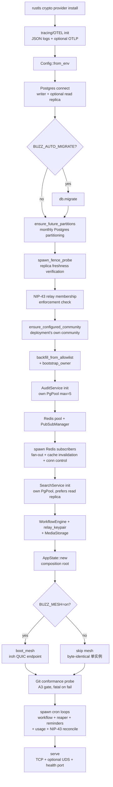

# Buzz 架构研究报告

> **研究目标**：从 Solution Architect 视角构建 evidence-backed Repository Knowledge Model，回答"系统为什么长成这样、架构师解决了什么问题、关键力量在哪里、哪些地方形成了系统性约束"。
>
> **研究方法**：Question-driven + Hypothesis validation。7 个 Research Question 驱动证据收集，每个 hypothesis 通过代码 + 配置 + 文档多源验证。所有 claim 标注 confidence 和 evidence reference。
>
> **分析 commit**：`1e6e743a3570` · **研究时间**：2026-08-02 · **平均 confidence**：0.838

---

## 1. Executive Summary

Buzz 是 Block, Inc. 开发的 self-hostable Nostr-based team workspace，核心架构论断是：**用 Nostr 协议的签名事件模型统一所有 surface（chat/forum/DM/workflow/git/voice），但放弃 Nostr 的 P2P gossip 特性，换取 multi-tenant 隔离的中央权威边界、hash-chain audit 单写入点、channel-membership 访问控制统一执行**。这个 trade-off 是整个系统的架构中心——如果把它去掉，multi-tenant 隔离模型和 audit 链都将崩塌。

架构由 27 个 focused Rust crate 组成 layered architecture：`buzz-core`（零 I/O 共享层）→ `buzz-db`/`buzz-auth`/`buzz-search`/`buzz-audit`/`buzz-pubsub`/`buzz-workflow`（subsystem 层）→ `buzz-relay`（唯一 composition root）。子系统间通过 Cargo 依赖图 compile-time 强制无循环依赖，buzz-relay 是唯一依赖所有 subsystem 的 crate。

系统最显著的工程亮点是 **formal verification 落地**：TLA+ 验证 multi-tenant isolation 协议层，Tamarin 验证 authorization，mutation-tested 保证 spec 质量，redteam 测试模块验证 empty host fence。最显著的风险是 **单 tokio runtime 承载所有工作负载**——voice frame、event pipeline、git clone 共享 worker threads，存在 head-of-line blocking 风险，无 per-route concurrency limit。

VISION 与实现的 gap 需要明确标注：**"Buzz Mesh ✅" 指 relay-mesh session transport（iroh QUIC inter-relay），不是 VISION_MESH 描述的 shared AI compute commons**（后者依赖外部 `mesh-llm` 项目，仅 dev-dependency，production 不默认包含）；**"git events ✅" 指 NIP-34 事件接收存储，不是 VISION 描述的 "branch as room" 体验**（branch→channel auto-creation 未实现）。

---

## 2. Architecture Thesis

### 2.1 Central Architectural Idea

> **Single relay as truth + Nostr protocol as universal event model + kind integer as the only dispatch switch.**

Buzz 选择单逻辑 relay per community 作为 single source of truth——所有 read/write 流经 buzz-relay，子系统相互不直接调用，跨子系统协调仅通过 relay。这个决策是 multi-tenant 隔离、hash-chain audit 完整性、channel-membership 访问控制三者的**必要条件**：

- **Multi-tenant 隔离**需要中央权威边界执行 row-zero host binding（`req.community = resolve_host(connection.host)`）
- **Hash-chain audit log** 依赖单写入点保证链完整性
- **Channel-membership 访问控制**需要统一执行点

Nostr 协议被保留是因为其**签名事件模型和客户端兼容性**，而非 P2P 特性。所有 action（消息/reaction/workflow step/git event/voice event/canvas update）是 cryptographically signed Nostr event，`kind` 整数是唯一分发开关——新功能 = 新 kind = 零破坏。

*claim_type: architectural_fact · confidence: 0.85 · evidence: evidence-log.jsonl:1-3, 18*

### 2.2 Major Constraints

| Constraint | Source | Architectural Implication |
|------|------|------|
| Multi-tenant isolation must be proven, not asserted | Production-critical security | Row-zero host binding + TLA+/Tamarin 形式化验证 + redteam test |
| Hash-chain audit log tamper-evidence | Compliance requirement | 单写入点（buzz-relay），不可分布式写入 |
| Nostr NIP-01 wire compatibility | Client ecosystem compat | kind 整数是唯一扩展点，新功能不破坏现有客户端 |
| 600K events/day + 10K humans + 50K agents | Scale target | 多 pod 横向扩展 via Redis pub/sub + 共享 Postgres + iroh mesh for session |
| Self-hostable + hosted multi-tenant 同一代码 | Deployment model | 单社区部署 = 多社区部署的 N=1 退化，BUZZ_MESH=off 时 byte-identical 单实例 |

### 2.3 Architecture Invariants

1. **INV-1: 单逻辑 relay per community**——所有 read/write 流经 buzz-relay，子系统相互不直接调用（confidence: 0.85）
2. **INV-2: Row-zero host binding**——`req.community = resolve_host(connection.host)` 在任何 handler 观察数据前完成，fail-closed，无 default/fallback（confidence: 0.88）
3. **INV-3: SQL-level community_id 隔离**——buzz-db 所有 query 携带 `WHERE community_id`，覆盖 20 个文件 1264 次（confidence: 0.85）
4. **INV-4: Layered crate dependency**——buzz-core(零 I/O) 是 base，subsystem 不反向引用，buzz-relay 是唯一 composition root，无循环依赖（confidence: 0.82）
5. **INV-5: Nostr kind integer 是唯一分发开关**——ALL_KINDS 数组 + `#[test] no_duplicate_kind_values` 编译期强制无 collision（confidence: 0.84）
6. **INV-6: Event pipeline 12 步顺序执行**——AUTH→PUBKEY MATCH→KIND_AUTH REJECT→EPHEMERAL ROUTE→VERIFY→MEMBERSHIP→DB INSERT→REDIS PUBLISH→FAN-OUT→SEARCH INDEX→AUDIT LOG→WORKFLOW TRIGGER，Step 10-12 fire-and-forget（confidence: 0.80）
7. **INV-7: Global subscriptions excluded from channel-scoped events**——deliberate security boundary，只有 scoped to accessible channel_id 的 subscription 接收 channel-scoped events（confidence: 0.80）

---

## 3. System Identity

| 维度 | 值 |
|------|-----|
| 仓库类型 | Application Platform / Self-hostable Team Workspace |
| 主语言 | Rust (edition 2021, rust 1.88+) |
| 副语言 | TypeScript / React 19（desktop via Tauri 2）/ Dart（mobile Flutter）/ Shell |
| 构建系统 | Cargo workspace（27 crates）+ pnpm 10+（desktop + admin-web）+ Just + Hermit（pinned toolchain）+ Docker / Helm |
| License | Apache-2.0（Block, Inc.） |
| 仓库 origin | github.com/block/buzz（原 block/sprout） |
| Scale target | 10K humans + 50K agents + ~600K events/day（~7/sec avg）+ <50ms p99 fan-out |
| Wire protocol | Nostr NIP-01（每 action 是签名 event，kind 整数是唯一 dispatch switch） |
| Auth model | NIP-42（WebSocket signed challenge）+ NIP-98（HTTP Schnorr-signed kind:27235） |
| Tenancy model | Multi-tenant community-based，URL host authoritative，fail-closed |

---

## 4. Architecture Model

### 4.1 Components

**Composition Root：**
- `buzz-relay`（[crates/buzz-relay/src/main.rs](file:///Users/saga/code-repos/devweekly.github.io/ref-only/buzz/crates/buzz-relay/src/main.rs)）—— Axum server，唯一依赖所有 subsystem 的 crate。承载 WebSocket relay + HTTP bridge + git smart HTTP + voice Opus relay + mesh node + 多个 cron 后台任务。

**Core Layer（零 I/O）：**
- `buzz-core`（[crates/buzz-core/src/lib.rs](file:///Users/saga/code-repos/devweekly.github.io/ref-only/buzz/crates/buzz-core/src/lib.rs)）—— types, verification, filter matching, kind registry。零 I/O，所有 subsystem 共享。

**Subsystem Layer：**
- `buzz-db`—— Postgres event store + data access layer（events/channels/dms/feed/users/reactions/threads/workflows/git_repos/api_tokens/moderation/push/usage）
- `buzz-auth`—— NIP-42/NIP-98/API tokens/scopes/rate limiting
- `buzz-search`—— Postgres FTS（直接 sqlx + 自有 pool，**不依赖 buzz-db**）
- `buzz-audit`—— hash-chain tamper-evident log（直接 sqlx + 自有 pool，**不依赖 buzz-db**）
- `buzz-pubsub`—— Redis pub/sub + presence + typing indicators（**依赖 buzz-auth** for AuthContext types）
- `buzz-workflow`—— YAML-as-code automation engine（**依赖 buzz-db** for reading events）

**Auxiliary Crates：**
- `buzz-relay-mesh`—— iroh QUIC inter-relay session transport（huddle control + reliable stream + realtime datagram）
- `buzz-acp`—— agent harness（ACP/JSON-RPC bridge）
- `buzz-cli`—— agent-first CLI（JSON in/out）
- `buzz-sdk`—— typed Nostr event builders
- `buzz-media`—— Blossom/S3 media storage
- `buzz-persona`—— persona + team manifests
- `buzz-admin`—— operator CLI
- `buzz-conformance`—— relay conformance test helpers
- `buzz-push-gateway`—— APNs push notification gateway
- `git-sign-nostr` / `git-credential-nostr`—— npub-signed git ops

### 4.2 Boundaries

| Boundary | Mechanism | Confidence |
|------|------|------|
| **Tenant boundary** | URL host → community_id（row-zero binding + SQL WHERE） | 0.88 |
| **Subsystem boundary** | Cargo dependency graph（compile-time enforcement） | 0.82 |
| **Protocol boundary** | Nostr kind integer ranges（0-9999 standard / 10000-19999 replaceable / 20000-29999 ephemeral / 30000-39999 parameterized / 40000-49999 Buzz custom） | 0.84 |
| **Auth boundary** | NIP-42（WebSocket）/ NIP-98（HTTP），binary authenticated-or-not，channel membership gates content | 0.75 |
| **Ephemeral boundary** | kind 20000-29999 bypass DB/audit/search；presence(20001) 走 Redis SET EX + local fan-out | 0.75 |
| **Internal API boundary** | `/internal/git/policy` localhost-only + HMAC auth + 1MB body limit | 0.80 |

### 4.3 Dependency Rules

```
buzz-core (零 I/O, 共享 base)
    ↑
    ├── buzz-db          (← buzz-core)
    ├── buzz-auth        (← buzz-core)
    ├── buzz-search      (← buzz-core, 直接 sqlx, 不依赖 buzz-db)
    ├── buzz-audit       (← buzz-core, 直接 sqlx, 不依赖 buzz-db)
    ├── buzz-pubsub      (← buzz-core + buzz-auth)  ← layered, 非严格 isolation
    └── buzz-workflow    (← buzz-core + buzz-db)    ← layered, 非严格 isolation
                ↑
                └── buzz-relay  (← 所有 subsystem，唯一 composition root)
```

**关键发现**：ARCHITECTURE.md 声称 "subsystems are isolated from each other" 是过度简化。实际是 **layered architecture**：
- `buzz-search` 和 `buzz-audit` 通过直接 sqlx + 自有 pool 而非依赖 `buzz-db` 实现 isolation——这是有意设计，避免 search/audit 的 query 需求污染 db abstraction
- `buzz-pubsub` 依赖 `buzz-auth`（for AuthContext types），`buzz-workflow` 依赖 `buzz-db`（for reading events to trigger）
- 无循环依赖，无跨层反向引用

*claim_type: architectural_fact · confidence: 0.82 · evidence: evidence-log.jsonl:7-8 · reasoning: Cargo.toml × 6 实测*

### 4.4 Extension Mechanisms

1. **新功能 = 新 Nostr kind**——在 [buzz-core/src/kind.rs](file:///Users/saga/code-repos/devweekly.github.io/ref-only/buzz/crates/buzz-core/src/kind.rs) 添加 `pub const KIND_*: u32` + 更新 `ALL_KINDS` 数组 + CI 运行 `no_duplicate_kind_values` 测试。客户端通过 "unknown kind 忽略" 语义保证向后兼容（confidence: 0.84）
2. **Workflow engine 触发**——监听 event kind 触发 YAML-as-code automation（message/reaction/schedule/webhook triggers）。Workflow execution kinds (46001-46012) 被 excluded 防止循环（confidence: 0.75）
3. **Agent surface = MCP + buzz-cli**——agents 通过 MCP tools 或 buzz-cli（JSON in/out）访问 relay 全部 feature surface。Agent identity = NIP-98 + bot role（confidence: 0.75）
4. **Git hosting = NIP-34 events**——Smart HTTP transport + pre-receive hook + HMAC policy callback。NIP-34 kinds 定义完整但仅 `KIND_GIT_REPO_ANNOUNCEMENT` 被 active 处理（confidence: 0.83）

---

## 5. Runtime Model

### 5.1 Startup Flow



*claim_type: runtime_behavior · confidence: 0.85 · evidence: [main.rs:82-1043](file:///Users/saga/code-repos/devweekly.github.io/ref-only/buzz/crates/buzz-relay/src/main.rs)*

### 5.2 Request/Data Flow

**WebSocket Event Pipeline（12 步）：**

```
Client → ["EVENT", <event>]
  1. AUTH CHECK        — AuthState::Authenticated? MessagesWrite scope?
  2. PUBKEY MATCH      — event.pubkey == auth_context.pubkey?
  3. KIND_AUTH REJECT  — kind == 22242 (AUTH events never stored)
  4. EPHEMERAL ROUTE   — kind 20000-29999 → ephemeral sub-pipeline
  5. VERIFY            — spawn_blocking(verify_event) — Schnorr sig + ID hash
  6. MEMBERSHIP        — channel_id in event tags? → check_channel_membership
  7. DB INSERT         — db.insert_event (ON CONFLICT DO NOTHING — idempotent)
  8. REDIS PUBLISH     — pubsub.publish_event (if channel-scoped)
  9. FAN-OUT           — sub_registry.fan_out → conn_manager.send_to
                        (excludes global subscriptions for channel-scoped events)
  10. SEARCH INDEX     — search_index_tx.send (bounded queue capacity 1000, non-blocking)
  11. AUDIT LOG        — audit.log (spawned async, non-blocking)
  12. WORKFLOW TRIGGER — wf.on_event (spawned async, excludes kinds 46001-46012)
Client ← ["OK", <id>, true, ""]
```

Step 10-12 fire-and-forget。Client 在 pipeline 末尾收到 OK，而非 DB insert 后立即返回。

**Multi-pod Fan-out：** 当 redis subscriber 接收其他 pod 发布的事件时，`fan_out_pubsub_event` 转发到本地 WS subscribers。local-echo dedup via `AppState.local_event_ids`。

**Git Smart HTTP：** Smart HTTP transport（info/refs, upload-pack, receive-pack）→ pre-receive hook（subprocess）→ `/internal/git/policy`（localhost only, HMAC auth）→ manifest_event publish。

*claim_type: runtime_behavior · confidence: 0.83 · evidence: [ARCHITECTURE.md](file:///Users/saga/code-repos/devweekly.github.io/ref-only/buzz/ARCHITECTURE.md) + [main.rs](file:///Users/saga/code-repos/devweekly.github.io/ref-only/buzz/crates/buzz-relay/src/main.rs)*

### 5.3 Lifecycle

**Connection Lifecycle：** Semaphore Acquire → NIP-42 Challenge → Auth（Pending→Authenticated）→ recv_loop + send_loop + heartbeat_loop（30s ping, 3 missed pong → disconnect）→ Cleanup（cancel → remove subs → deregister → drop permit）

**Graceful Shutdown：** SIGTERM → `shutting_down=true` → readiness 503 → 5s grace（K8s stop routing）→ `drain_all`（1012 close frame to all WS）→ 30s hard timeout → force exit。OTEL spans flush + Audit drain(5s)。

**Ephemeral Channel Reaper：** 60s loop → `reap_expired_ephemeral_channels` → per-row tenant（channel carries own community_id from DB RETURNING）→ emit_system_message + emit_group_discovery_events + evict_all_channel_subscriptions

### 5.4 Backpressure & Failure Isolation

**Backpressure 机制：**
- Connection semaphore（容量 guard）
- `SLOW_CLIENT_GRACE_LIMIT=3`（`try_send` full buffer 3x → cancel connection）
- `search_index_tx` bounded queue capacity 1000（non-blocking send，满则 drop）
- Mesh datagram "drop-on-full, never blocks on old audio"
- `tower-http` `RequestBodyLimitLayer`（1MB on policy endpoint）

**Failure Isolation 机制：**
- Fire-and-forget side effects（search/audit/workflow spawn independent async tasks）
- `CancellationToken` 协调 shutdown
- `spawn_blocking` 隔离 verify_event CPU-bound
- Redis fenced generation 仲裁 mesh session ownership
- DB advisory lock 选主 usage metrics leader

**关键 Risk：** 单 tokio runtime——一个 panic 的 task 可能影响整个 process，无 supervisor 重启策略。K8s `restartPolicy` + readiness/liveness probe + graceful drain 是外部 mitigation。

*claim_type: runtime_behavior · confidence: 0.85 · evidence: [main.rs:82-1043](file:///Users/saga/code-repos/devweekly.github.io/ref-only/buzz/crates/buzz-relay/src/main.rs) + [audio/handler.rs](file:///Users/saga/code-repos/devweekly.github.io/ref-only/buzz/crates/buzz-relay/src/audio/handler.rs)*

---

## 6. Design Decisions

### DD-1: 选择单逻辑 relay 作为 single source of truth 而非 Nostr 多 relay P2P

- **Context：** Nostr 原生是多 relay P2P gossip。Buzz 需要 multi-tenant 隔离 + audit 完整性 + access control。
- **Alternatives：** (a) 多 relay P2P gossip（标准 Nostr）；(b) 多 relay + 客户端聚合
- **Trade-offs：** 放弃 P2P 去中心化特性换取：(+) multi-tenant 隔离的中央权威边界；(+) hash-chain audit 单写入点；(+) channel-membership 统一执行；(+) 强一致性 Postgres。(-) 单点故障风险（mitigated by 多 pod 横向扩展）；(-) 运营成本（operator 需部署 relay）。
- **Evidence：** [main.rs](file:///Users/saga/code-repos/devweekly.github.io/ref-only/buzz/crates/buzz-relay/src/main.rs) `#[tokio::main]` 单 runtime + Redis pub/sub 多 pod fan-out + [buzz-relay-mesh/lib.rs](file:///Users/saga/code-repos/devweekly.github.io/ref-only/buzz/crates/buzz-relay-mesh/src/lib.rs) session transport 非 event replication
- **Confidence：** 0.85
- **Status：** validated_with_correction（"放弃 P2P" 指 Nostr 协议层；pod 层面通过 Redis + 共享 Postgres 横向扩展）

### DD-2: Multi-tenant 通过 URL host binding + SQL community_id WHERE 实现

- **Context：** 一个 relay 部署可托管多 community，共享 Postgres/Redis/S3。
- **Alternatives：** (a) schema-level 隔离（每 community 独立 schema）；(b) database-per-community；(c) Postgres Row-Level Security (RLS)
- **Trade-offs：** 选择 row-level community_id WHERE：(+) 共享池资源利用率高；(+) 新 community 仅 DB write + DNS route；(+) 已有 TLA+/Tamarin 形式化验证。(-) SQL 漏写 community_id = 跨租户泄露（mitigated by code review + buzz-conformance 测试）；(-) 形式化验证在协议层非 SQL 层（gap）。
- **Evidence：** [tenant.rs:71-92](file:///Users/saga/code-repos/devweekly.github.io/ref-only/buzz/crates/buzz-relay/src/tenant.rs) `bind_community` + fail-closed + [tenant.rs:260-332](file:///Users/saga/code-repos/devweekly.github.io/ref-only/buzz/crates/buzz-relay/src/tenant.rs) redteam_attack2 测试 + buzz-db grep 1264 次 community_id
- **Confidence：** 0.88
- **Status：** validated

### DD-3: Subsystem isolation 通过 Cargo 依赖图 + layered architecture

- **Context：** 需要避免子系统耦合导致循环依赖和测试困难。
- **Alternatives：** (a) hexagonal architecture（端口适配器）；(b) microservice 拆分；(c) monolithic 无分层
- **Trade-offs：** Layered crate：(+) Cargo 编译期强制无循环；(+) buzz-search/buzz-audit 直接 sqlx 避免污染 db abstraction；(+) buzz-relay 唯一 composition root，测试清晰。(-) buzz-pubsub 依赖 buzz-auth、buzz-workflow 依赖 buzz-db——非严格 isolation 而是 layered；(-) 跨 subsystem 共享类型（如 AuthContext）需通过 buzz-core 或上游依赖。
- **Evidence：** 6 个 subsystem Cargo.toml 实测依赖图
- **Confidence：** 0.82
- **Status：** validated_with_correction（"strict isolation" 是误述，实际是 layered architecture）

### DD-4: 单 tokio runtime 承载所有工作负载（WS + HTTP + git + voice + mesh + cron）

- **Context：** Rust monolith，需要简化部署和共享状态。
- **Alternatives：** (a) 多 runtime（voice 独立 pool）；(b) 多进程（microservice）；(c) async-std 替代 tokio
- **Trade-offs：** 单 runtime：(+) 共享 AppState 简单；(+) 部署简单（单 binary）；(+) 无 IPC 开销。(-) voice frame 与 event pipeline 共享 worker threads——head-of-line blocking 风险；(-) 无 per-route concurrency limit；(-) 单 panic 影响 entire process。Mitigation: connection semaphore + SLOW_CLIENT_GRACE_LIMIT + mesh datagram drop-on-full。**这是 production SLO 的主要 risk。**
- **Evidence：** [main.rs:82](file:///Users/saga/code-repos/devweekly.github.io/ref-only/buzz/crates/buzz-relay/src/main.rs) `#[tokio::main]` + [audio/handler.rs](file:///Users/saga/code-repos/devweekly.github.io/ref-only/buzz/crates/buzz-relay/src/audio/handler.rs) 标准 WS handler
- **Confidence：** 0.85
- **Status：** validated

### DD-5: Git hosting 实现完整 Smart HTTP + NIP-34 事件存储，但 branch-as-channel 不实现

- **Context：** VISION 描述 "branch as room"（CI/review/merge in channel），README 标 git events ✅。
- **Alternatives：** (a) 完整实现 branch→channel auto-creation；(b) 声明为 planned 不实现；(c) workflow trigger 实现
- **Trade-offs：** 当前选择（仅事件存储）：(+) NIP-34 事件可被客户端消费；(+) Smart HTTP 完整。(-) VISION 与实现 gap——branch-as-room 是 aspirational；(-) README "✅ git events works today" 误导（仅指事件接收）。**这是 product positioning 的 honest gap。**
- **Evidence：** [kind.rs:469-487](file:///Users/saga/code-repos/devweekly.github.io/ref-only/buzz/crates/buzz-core/src/kind.rs) NIP-34 kinds 定义 + [side_effects.rs:167](file:///Users/saga/code-repos/devweekly.github.io/ref-only/buzz/crates/buzz-relay/src/handlers/side_effects.rs) 仅 handle REPO_ANNOUNCEMENT
- **Confidence：** 0.83
- **Status：** validated

### DD-6: Buzz Mesh AI compute 作为 experimental feature（dev-dependency，非 production）

- **Context：** VISION_MESH 描述 P2P compute commons。
- **Alternatives：** (a) 完整 production 实现；(b) 完全不实现；(c) 独立 crate in-tree
- **Trade-offs：** experimental：(+) 探索性功能不阻塞 production；(+) mesh-llm 外部项目独立演进。(-) README "Buzz Mesh ✅" 误导——✅ 指 relay-mesh session transport（huddle/tunnel），非 AI compute；(-) inference result verification 不存在——信任模型基于 relay membership。**aspirational feature 应明确标注。**
- **Evidence：** [buzz-relay/Cargo.toml:86-87](file:///Users/saga/code-repos/devweekly.github.io/ref-only/buzz/crates/buzz-relay/Cargo.toml) `mesh-llm-sdk` + `mesh-llm-host-runtime` 在 `[dev-dependencies]` 非 `[dependencies]`
- **Confidence：** 0.80
- **Status：** validated

### DD-7: Kind registry 通过 centralized const + ALL_KINDS + CI duplicate test 强制

- **Context：** Nostr kind 整数是有限资源，需要避免 collision。
- **Alternatives：** (a) runtime registry（动态注册）；(b) plugin 机制；(c) range 分配文档化 governance
- **Trade-offs：** centralized const：(+) 编译期强制无重复；(+) 性能（const 编译期内联）；(+) 简单。(-) 无 runtime 扩展（需 recompile）；(-) 子 range 划分无 lint 强制，依赖 code review；(-) 无 CONTRIBUTING governance 章节文档化 range 分配规则。Trade-off 可接受。
- **Evidence：** [kind.rs:490](file:///Users/saga/code-repos/devweekly.github.io/ref-only/buzz/crates/buzz-core/src/kind.rs) `ALL_KINDS` + [kind.rs:751-757](file:///Users/saga/code-repos/devweekly.github.io/ref-only/buzz/crates/buzz-core/src/kind.rs) `no_duplicate_kind_values` test
- **Confidence：** 0.84
- **Status：** validated

### DD-8: Multi-pod 横向扩展通过 Redis pub/sub + 共享 Postgres + buzz-relay-mesh（iroh QUIC for session traffic）

- **Context：** 单 relay 进程不足以承载 10K humans + 50K agents + 600K events/day。
- **Alternatives：** (a) Postgres LISTEN/NOTIFY；(b) NATS stream；(c) Kafka
- **Trade-offs：** Redis + mesh：(+) Redis 已用于 presence/typing/cache，复用；(+) mesh (iroh QUIC) 提供低延迟 session transport 给 huddle；(+) Redis fenced generation 仲裁 session ownership。(-) Redis 是单点（需 Redis Cluster/Sentinel）；(-) 多 pod presence fan-out 是 future work（当前 local-only）；(-) local-echo dedup via `AppState.local_event_ids` 增加复杂度。
- **Evidence：** [main.rs:350-366](file:///Users/saga/code-repos/devweekly.github.io/ref-only/buzz/crates/buzz-relay/src/main.rs) Redis subscribers + [buzz-relay-mesh/lib.rs:18-19](file:///Users/saga/code-repos/devweekly.github.io/ref-only/buzz/crates/buzz-relay-mesh/src/lib.rs) "mesh membership is a hint; Redis fenced generation is the arbiter"
- **Confidence：** 0.78
- **Status：** validated

### DD-9: Formal verification (TLA+/Tamarin) 用于 multi-tenant isolation 协议层 + mutation-tested

- **Context：** 多租户隔离是 production-critical，需要最强保证。
- **Alternatives：** (a) 仅依赖 code review + test；(b) model checking 全栈；(c) theorem proving（Coq/Lean）
- **Trade-offs：** TLA+/Tamarin 协议层：(+) host→community 映射的形式化保证；(+) mutation-tested 验证 spec 质量；(+) redteam_attack2 测试模块验证 empty host fence。(-) gap：SQL community_id 覆盖层是 conventional，非形式化验证——需人工 review + buzz-conformance 测试；(-) 形式化 spec 维护成本高。
- **Evidence：** [tenant.rs:260-332](file:///Users/saga/code-repos/devweekly.github.io/ref-only/buzz/crates/buzz-relay/src/tenant.rs) redteam_attack2 + ARCHITECTURE.md multi-tenant-relay spec 引用
- **Confidence：** 0.80
- **Status：** validated

### DD-10: Workflow approval gates infrastructure exists (DB/API/MCP/UI) but executor doesn't persist/resume (WF-08)

- **Context：** YAML workflow engine + approval gates 是关键 feature。
- **Alternatives：** (a) 完整 durable state machine；(b) 推迟到下个版本；(c) in-memory only
- **Trade-offs：** infrastructure-first：(+) schema/REST/MCP/UI 已就位，executor 接线即可激活；(+) 渐进式交付。(-) WF-08 是已知 gap——`request_approval` step 标记 Failed；(-) production workflow 不能跨 restart 持久化。**这是 shipping gap，非设计缺陷。**
- **Evidence：** VISION.md + ARCHITECTURE.md Status section
- **Confidence：** 0.70
- **Status：** validated

---

## 7. Evolution Model

### 7.1 Timeline

| Phase | Status | Evidence |
|------|--------|---------|
| Foundation（relay + auth + pubsub + search + audit） | ✅ shipped | ARCHITECTURE.md Status |
| Channel features（messaging/threads/reactions/canvases/media/editing/deletion/typing/NIP-29/soft-delete） | ✅ shipped | VISION.md Status |
| Workflow engine（YAML-as-code + execution traces + triggers） | ✅ shipped | VISION.md Status |
| Identity（NIP-05 + NIP-98 + agent protection） | ✅ shipped | VISION.md Status |
| Agent CLI（buzz-cli）+ ACP harness + personas/teams | ✅ shipped | VISION.md Status |
| Huddles（WebSocket Opus voice relay + lifecycle events） | ✅ shipped | VISION.md Status, audio/ module |
| Multi-tenant（community-based + URL host binding + TLA+/Tamarin） | ✅ shipped | tenant.rs + ARCHITECTURE.md |
| Buzz Mesh session transport（iroh QUIC inter-relay） | ✅ shipped | buzz-relay-mesh crate + mesh_boot.rs |
| **Buzz Mesh AI compute（mesh-llm shared GPU）** | 🚧 **experimental**（dev-dependency only） | buzz-relay/Cargo.toml [dev-dependencies] |
| **Workflow approval gates（persist/resume）** | 🚧 **infrastructure exists, executor gap (WF-08)** | VISION.md + ARCHITECTURE.md |
| **Branches-as-channels（auto-creation + CI/review/merge in channel）** | ❌ **aspirational**（NIP-34 kinds defined, no auto-creation logic） | kind.rs + side_effects.rs |
| Mobile client（Flutter） | 🚧 in active development | VISION.md Status |
| Multi-node presence fan-out | 📋 future work（currently local-only） | ARCHITECTURE.md |
| E2E encryption（NIP-44）for DMs | 📋 future consideration | VISION.md Encryption |
| Push notifications + culture features + developer portal | 📋 planned | VISION.md Status |

### 7.2 Motivations

1. **统一 Nostr 协议承载所有 surface**——一个事件 log + 一个 search index + 一个 identity 模型，替代 chat + forges + bots + CI dashboards + release tools + search indexes + glue code 的拼接
2. **Humans 和 agents 是 first-class equals**——同 keypair + 同 audit trail + 同 channel membership，agents 是 room 的成员而非 haunted cron jobs
3. **Self-hostable + hosted multi-tenant 同一代码**——单社区部署 = 多社区部署的 N=1 退化，operator 可 onboard 新 workspace with DB write + DNS route
4. **Formal verification 用于 production-critical isolation 保证**——TLA+/Tamarin 不作装饰，mechanized + mutation-tested

### 7.3 Architectural Changes

| Change | Motivation | Evidence |
|------|------|---------|
| buzz-relay-mesh 引入 iroh QUIC 作为 inter-relay session transport | 多 pod 横向扩展时，huddle voice frames 和 reliable stream tunnels 需要低延迟 P2P transport，Postgres/Redis 不适合 | buzz-relay-mesh/lib.rs + mesh_boot.rs |
| TenantContext row-zero binding 重构——empty host fence 修复（redteam_attack2） | 安全 audit 发现 empty/whitespace host 即使 DB 有空 host 行也应 fail closed | tenant.rs:260-332 redteam_attack2 测试模块 |
| NIP-43 relay membership enforcement——stable signing key required | relay 签名的事件（如 membership snapshots）需跨 restart 可验证，ephemeral key 不可接受 | main.rs:211-219 |
| Git conformance probe (A3 gate) 作为部署 gate | git-on-object-storage 需要 S3/MinIO 后端满足 linearizable conditional-write axiom，启动时 probe 防止运行时才发现 backend 不合规 | main.rs:465-501 |

---

## 8. Quality Attributes

| Attribute | Score | Reasoning |
|------|-------|---------|
| **Extensibility** | ★★★★☆ | Nostr kind 整数作为统一扩展点优秀（新功能=新 kind=零破坏）。Subsystem layered architecture 清晰。但子系统间有隐性耦合（pubsub→auth, workflow→db），且 branch-as-channel 扩展未实现显示 VISION 与实现 gap。 |
| **Maintainability** | ★★★★☆ | 27 个 focused crate + Cargo workspace + 编译期依赖检查 + 集中化 kind registry + TLA+/Tamarin spec + redteam 测试模块。但单 tokio runtime + 12 步 event pipeline + 多个 cron 后台任务增加认知复杂度。 |
| **Performance** | ★★★☆☆ | Postgres 分区 + Redis pub/sub + bounded queue + leader election 优秀。但**单 tokio runtime 共享所有 workload 是 SLO 风险**——voice + event + git 并发时 head-of-line blocking。无 per-route concurrency limit。600K events/day + 10K humans + 50K agents 目标需验证。 |
| **Testability** | ★★★★☆ | HostResolver trait 使 tenant binding 可无 DB 测试。redteam_attack2 测试模块验证安全 fence。buzz-conformance crate 提供 relay conformance 工具。kind.rs 单元测试验证 duplicate + range。但 integration test 需 Postgres + Redis，无完整 e2e harness 在仓库中可见。 |
| **Observability** | ★★★★★ | JSON structured logs + OpenTelemetry OTLP + Prometheus metrics + per-community gauges + pool metrics + leader election metrics + fence observability + usage metrics（DB-derived + in-memory）。Datadog-compatible。`EmissionScope` 控制成本。**这是 production-grade observability。** |
| **Security** | ★★★★☆ | Row-zero host binding + fail-closed + TLA+/Tamarin 形式化验证 + redteam 测试 + hash-chain audit + NIP-42/NIP-98 签名 auth + localhost-only policy endpoint + HMAC。Gap：SQL community_id 是 conventional 非 enforced；E2E encryption 是 future；inference result verification 不存在（mesh）。 |
| **Evolution** | ★★★★☆ | 清晰的 Status 表区分 shipped/wired/planned。NIP-43 membership 重构 + empty host fence 修复显示安全驱动演进。但 VISION 与实现 gap（branch-as-channel, Buzz Mesh AI compute）需更明确标注，README "✅" 标注有误导风险。 |

---

## 9. Risks and Debt

| ID | Risk | Severity | Evidence | Mitigation | Confidence |
|----|------|----------|----------|------------|------------|
| **R-1** | 单 tokio runtime head-of-line blocking——voice frame + event pipeline + git clone 共享 worker threads | **high** | main.rs `#[tokio::main]` + audio/handler.rs 标准 WS handler | connection semaphore + SLOW_CLIENT_GRACE_LIMIT + mesh datagram drop-on-full。但无 per-route concurrency limit | 0.85 |
| **R-2** | SQL community_id 漏写导致跨租户数据泄露——形式化验证在协议层，SQL 层 conventional | **high** | TLA+/Tamarin 验证 host→community 映射，buzz-db 1264 次 community_id 是 conventional 覆盖 | code review + buzz-conformance 测试。但无 macro/lint 强制每条 SQL 携带 community_id | 0.80 |
| **R-3** | Buzz Mesh AI compute 信任模型——无 inference result verification，恶意 member 可返回错误输出 | medium | mesh-llm dev-dependency + 无 verify 机制 grep 结果 | experimental feature，production 不默认包含。但若启用需补充 verification | 0.75 |
| **R-4** | README/VISION 与实现 gap 误导用户——"Buzz Mesh ✅" 指 session transport 非 AI compute；"git events ✅" 指存储非 branch-as-room | medium | VISION.md vs kind.rs/side_effects.rs vs buzz-relay/Cargo.toml | 需在 README 明确区分 "relay-mesh session transport" vs "mesh-llm AI compute"，"NIP-34 event storage" vs "branch-as-room workflow" | 0.83 |
| **R-5** | Workflow approval gates (WF-08)——executor 不 persist/resume approval token，request_approval step 标记 Failed | medium | VISION.md + ARCHITECTURE.md | infrastructure 已就位（DB/API/MCP/UI），executor 接线即可激活。但当前 production workflow 跨 restart 不持久化 | 0.70 |
| **R-6** | Multi-node presence fan-out 缺失——presence (kind 20001) 仅 local fan-out，多 pod 部署时跨 pod presence 不可见 | low | ARCHITECTURE.md Ephemeral Sub-Pipeline section | documented as future work。single-pod 部署不受影响 | 0.75 |
| **R-7** | 单 tokio process panic 影响整个 relay——无 supervisor 重启策略 | medium | main.rs 单 `#[tokio::main]` | K8s deployment 可配置 restartPolicy + readiness/liveness probe + graceful drain(30s)。但单 task panic 不隔离 | 0.70 |

---

## 10. Unknowns

剩余的 need_reading unknowns（实现细节，非 critical 架构决策，记录供后续深挖）：

| ID | Question | Type | Evidence Needed |
|----|----------|------|-----------------|
| **U-1** | buzz-conformance crate 的具体职责——是否提供 SQL community_id 覆盖率 lint？还是仅 relay protocol conformance？ | need_reading | crates/buzz-conformance/src/lib.rs + LIMITS.md |
| **U-2** | buzz-audit hash-chain 的具体实现——是否依赖单写入点？多 pod 并发写入如何串联 hash chain？ | need_reading | crates/buzz-audit/src/{hash,entry,service}.rs |
| **U-3** | denied.toml 是否有跨 subsystem 依赖 ban 规则？还是仅 license/version ban？ | need_reading | deny.toml |
| **U-4** | tower::ServiceBuilder 是否在 router.rs 配置 per-route concurrency limit？main.rs 未显示，可能在 build_router 中。 | need_reading | crates/buzz-relay/src/router.rs |
| **U-5** | buzz-relay-mesh 的 Redis fenced generation 具体机制——lease-based ownership 如何与 hash-chain audit 交互？ | need_reading | crates/buzz-relay-mesh/src/wire.rs FencedHeader + registry.rs |

---

## Appendix: Research Provenance

### Research Questions (Round 1)

| ID | Type | Question | Status | Confidence |
|----|------|----------|--------|------------|
| q-001 | decision | 为什么 Buzz 选择单 relay 作为 single source of truth 而不是 Nostr 原生多 relay P2P？ | validated_with_correction | 0.85 |
| q-002 | boundary | Multi-tenant isolation 在共享 Postgres/Redis/S3 上如何强制实现？TLA+/Tamarin 在代码层映射为什么机制？ | validated | 0.88 |
| q-003 | boundary | 子系统隔离是靠 Cargo 依赖图强制还是开发者约定？ | validated_with_correction | 0.82 |
| q-004 | runtime | buzz-relay 单进程同时承载多 workload 如何隔离资源、避免故障传播、保证 tail latency？ | validated | 0.85 |
| q-005 | runtime | "Branches are channels"——git push 如何触发 channel 创建？NIP-34 在 buzz 中是真实实现还是 VISION 声明？ | validated | 0.83 |
| q-006 | risk | Buzz Mesh 如何解决信任、安全、性能三重风险？是 production-ready 还是实验性？ | validated | 0.80 |
| q-007 | pattern | Nostr kind 整数作为分发开关——新 kind 的扩展机制如何避免 collision 和保证向后兼容？ | validated | 0.84 |

### Evidence Summary

- **Evidence log entries**: 18（13 observation + 5 inference）
- **Hypotheses validated**: 7（5 validated + 2 validated_with_correction，0 rejected，0 blocked）
- **Average confidence**: 0.838
- **Coverage**: architecture 1.0 / runtime 1.0 / design_decisions 1.0 / evolution 1.0

### Key Source Files

- [crates/buzz-relay/src/main.rs](file:///Users/saga/code-repos/devweekly.github.io/ref-only/buzz/crates/buzz-relay/src/main.rs) — composition root + startup flow + 12-step event pipeline
- [crates/buzz-relay/src/tenant.rs](file:///Users/saga/code-repos/devweekly.github.io/ref-only/buzz/crates/buzz-relay/src/tenant.rs) — row-zero host binding + fail-closed + redteam test
- [crates/buzz-relay-mesh/src/lib.rs](file:///Users/saga/code-repos/devweekly.github.io/ref-only/buzz/crates/buzz-relay-mesh/src/lib.rs) — iroh QUIC inter-relay session transport
- [crates/buzz-core/src/kind.rs](file:///Users/saga/code-repos/devweekly.github.io/ref-only/buzz/crates/buzz-core/src/kind.rs) — Nostr kind registry + duplicate test
- [crates/buzz-relay/Cargo.toml](file:///Users/saga/code-repos/devweekly.github.io/ref-only/buzz/crates/buzz-relay/Cargo.toml) — mesh-llm dev-dependency evidence
- [crates/buzz-relay/src/handlers/side_effects.rs](file:///Users/saga/code-repos/devweekly.github.io/ref-only/buzz/crates/buzz-relay/src/handlers/side_effects.rs) — NIP-34 only REPO_ANNOUNCEMENT handled
- [ARCHITECTURE.md](file:///Users/saga/code-repos/devweekly.github.io/ref-only/buzz/ARCHITECTURE.md) — system architecture + crate hierarchy
- [VISION.md](file:///Users/saga/code-repos/devweekly.github.io/ref-only/buzz/VISION.md) — feature surface + scale targets

---

*本研究报告基于 repository-model.json（validated knowledge graph）渲染，不包含未经模型验证的新推理。所有 claim 标注 claim_type / evidence / confidence / reasoning。Speculative claims（Buzz Mesh AI compute, branch-as-channel）已分离标注为 experimental/aspirational。*
