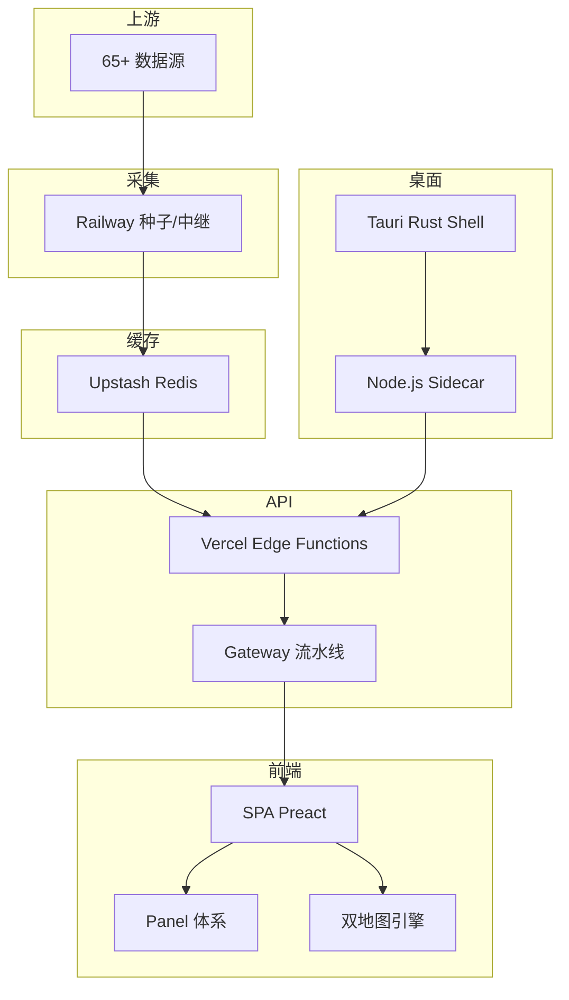

# WorldMonitor 架构分析报告

## 1. 执行摘要

WorldMonitor 是一个**实时全球情报仪表板** — 将 65+ 外部数据源（地缘政治、军事、金融、能源、气候、网络、海事、航空）聚合为统一态势感知界面的 TypeScript SPA。架构核心是以 **Vercel Edge Functions** 为 API 层、**Redis（Upstash）** 为缓存层、**Railway** 为种子数据层、**Tauri + Node.js sidecar** 为桌面端的多部署拓扑。从单一代码库构建 6 个站点变体，每个变体有不同的面板/图层配置。

关键发现：这是一个**质量极高、工程纪律严明**的项目。最值得关注的设计决策不是技术选型，而是**工程约束体系**——通过 pre-push hook、API 合约检查、边界 lint 等自动化门禁，将架构规则编码为可执行检查。

## 2. 仓库心智模型

维护者将系统心智划分为五个层次：

1. **数据采集层**（scripts/ + Railway） — 种子脚本 + 中继服务，从上游拉取数据并写入 Redis
2. **API 服务层**（server/ + api/） — Vercel Edge Functions，通过 Gateway 流水线处理请求
3. **SPA 前端层**（src/） — 浏览器端渲染，Panel 组件体系 + 双地图引擎
4. **桌面扩展层**（src-tauri/） — Tauri Rust shell + Node.js sidecar，可选的增强运行时
5. **合约定义层**（proto/） — 所有 API 的单一事实来源



## 3. 架构

### 3.1 能力地图

| 能力 | 实现 | 关键文件 |
|------|------|---------|
| 新闻聚合 | 500+ 精选 Feed，AI 摘要 | src/services/rss/, server/worldmonitor/news/ |
| 双地图 | deck.gl（平面）+ globe.gl（3D） | src/components/DeckGLMap.ts, GlobeMap.ts |
| 金融市场 | 29 交易所，7 信号复合 | server/worldmonitor/market/, src/services/finance/ |
| 国家风险 | CII v8 压力评分（31 个 Tier-1 国家） | services/country-instability.ts |
| 桌面端 | Tauri 2 + Node.js sidecar | src-tauri/ |
| 本地 AI | 浏览器 ONNX / Transformers.js | src/workers/ml.worker.ts |
| 多语言 | 25 语言 + RTL 支持 | src/services/i18n.ts |

### 3.2 静态架构

**依赖方向严格受控**：
```
types → config → services → components → app → App.ts
```

API 层与前端层严格隔离。`api/*.js` 不能 import `../src/` 或 `../server/`（Edge Function 部署约束），此规则通过 `tests/edge-functions.test.mjs` 和 pre-push esbuild 检查强制。

### 3.3 运行时架构

**8 阶段初始化**（`App.init()`）：

```
Storage+i18n → ML Worker → Sidecar → Bootstrap → Layout → UI → Data → Refresh
```

Bootstrap 使用**双层并发 hydration**（fast 3s + slow 5s 超时），两个 tier 独立 abort controller。数据加载使用**4 层 hydration tier** 优先级调度：

| Tier | 内容 | 并发 |
|------|------|------|
| 1 | news, markets, intelligence | 高 |
| 2 | natural, weather, ais, flights | 中 |
| 3 | 其他面板 | 中 |
| 4 | stockAnalysis, predictions, forecast | 低 |

### 3.4 双地图引擎协作

- **DeckGLMap**（`src/components/DeckGLMap.ts`）— WebGL 渲染，deck.gl + maplibre-gl，支持 8 种图层类型，PMTiles 协议，Supercluster 聚合
- **GlobeMap**（`src/components/GlobeMap.ts`）— 3D 交互地球，globe.gl，单 `htmlElementsData` 数组 + `_kind` 鉴别器

56 种地图图层定义在 `src/config/map-layer-definitions.ts`，每个指定：渲染器支持（flat/globe）、Premium 状态、变体过滤、i18n 键。

### 3.5 变体系统

6 个变体（full/tech/finance/commodity/happy/energy）通过 `VITE_VARIANT` 环境变量或 hostname 检测。控制：默认面板、地图图层、刷新间隔、主题、UI 文本。变体切换重置所有设置到默认值。桌面端通过 localStorage 持久化变体选择。

## 4. 工程决策

### 4.1 关键决策

| 决策 | 选择 | 理由 | 证据 |
|------|------|------|------|
| 状态管理 | 无外部库，AppContext 可变对象 | 避免 Redux 样板代码，直接读写 | src/App.ts:924-981 |
| API 合约 | Protobuf + sebuf | 单一事实来源，自动生成客户端/OpenAPI | proto/, Makefile |
| 部署拓扑 | Vercel Edge Functions | 超低延迟，按域拆分冷启动 ~20× | server/gateway.ts |
| 缓存 | Redis 四层 + stampede 保护 | 避免缓存雪崩，并发 miss coalescing | server/_shared/redis.ts |
| API 地址 | `fetch.bind(globalThis)` BANNED | 避免类型安全和上下文问题 | AGENTS.md |
| 桌面安全 | 平台 keyring + IPC | 密钥不落地，sidecar 动态注入 | src-tauri/src/main.rs |

### 4.2 有意省略

- **无外部状态库** — 选择 AppContext 可变对象而非 Redux/Zustand
- **无依赖注入框架** — 模块间通过构造函数参数直接连接
- **无 SSR** — 纯 SPA，Edge Functions 仅提供 API 数据
- **无 GraphQL** — Proto 定义的 RESTful API

### 4.3 工程约束体系

最值得注意的架构特征是**自动化的工程约束体系**。约束不是写在文档中，而是编码为可执行检查：

| 约束 | 执行方式 |
|------|---------|
| API 文件自包含 | esbuild bundle check |
| 协议合约新鲜度 | `make generate` diff 检查 |
| 边界 lint | `scripts/lint-boundaries.mjs` |
| URL 安全 | `scripts/enforce-safe-html.mjs` |
| Rate limit 策略 | `scripts/enforce-rate-limit-policies.mjs` |
| Unicode 安全 | `scripts/check-unicode-safety.mjs` |
| 秘密泄露防护 | `scripts/check-local-secret-dumps.mjs` |

Pre-push hook 是**有状态的**：green-tree 缓存跳过已是绿的提交，减少 CI 等待时间。

## 5. 可复用知识

### 5.1 Edge Function 网关模式

`createDomainGateway()` 的 10 阶段流水线是一个可复用的 API 网关模式：

```
Origin Check → CORS → OPTIONS → API Key → Rate Limit → Route Match → POST→GET → Handler → ETag → Cache Headers
```

每阶段职责单一，可独立测试。

### 5.2 缓存 stampede 保护

`cachedFetchJson()` 在 Redis 层面实现**并发 miss 合并**（coalescing）：同一缓存键的并发请求共享单个上游 fetch 和 Redis 写入。这是生产级缓存的最佳实践。

### 5.3 变体驱动的 SPA 架构

单一代码库构建 6 个站点变体，通过「构建时环境变量 + 运行时 hostname 检测」实现。配置分层（变体默认 > 用户设置 > URL 状态）清晰可扩展。

### 5.4 Live 层缓存分片

缓存系统中有一个"live"层（60s s-maxage）用于位置追踪端点，使用**bbox 量化 + tanker 感知**缓存——同一 bbox 请求在 CDN 层面被吸收。

## 6. 意外发现

1. **整个仓库没有外部状态库** — 163 个组件、201 个服务模块，全部通过 AppContext 中央可变对象通信，没有 Redux/Zustand，但代码组织非常清晰。

2. **pre-push hook 是有状态记忆的** — 通过 `$GIT_DIR/wm-prepush-green` 缓存已通过检查的 tree，避免相同 tree 重复运行。这在 CI 中很少见。

3. **API 合约检查是双向的** — 不仅检查 proto 生成代码是否最新，还检查 API 代码是否匹配 proto（通过 `api-route-exceptions.json` 白名单）。大多数项目只做前一个。

4. **桌面端 IPv4 强制** — sidecar monkey-patch `globalThis.fetch` 强制 IPv4，因为政府 API 的 IPv6 有 bug。这是非常具体但务实的工程决策。

## 7. 风险

- **APM 盲区** — 没有 Application Performance Monitoring 集成（仅 Sentry），对于实时数据管道，缺少端到端延迟追踪
- **桌面端安全** — sidecar 从 api/ 动态加载 Edge Function 处理器，模块加载路径安全需要持续关注（已有一个 CVE 上报记录）
- **单一 Redis 实例** — Redis 是缓存和种子数据的中心化点，虽然 stampede 保护做得很好，但 Redis 故障会直接影响全部 60+ 端点
- **变体测试覆盖** — 6 个变体有独立的 E2E smoke 测试，但 visual regression 只覆盖了 full 和 tech 变体

## 8. 未解问题

| 问题 | 缺失证据 | 置信度影响 | 建议下一步 |
|------|---------|-----------|-----------|
| 浏览器端 ONNX 推理的性能特征？ | 无性能测试数据 | 低 | 检查 memory 使用和推理延迟 |
| Railway 中继服务的高可用策略？ | 无部署拓扑文档 | 低 | 检查 Docker compose 配置 |
| 65+ 数据源的失败隔离机制？ | 无断路器配置细节 | 中 | 检查 circuit-breaker.ts 的实现 |
