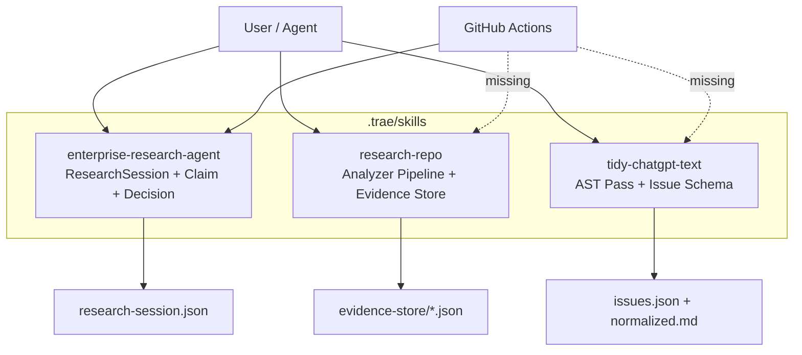
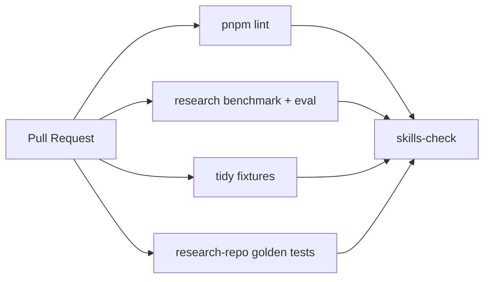
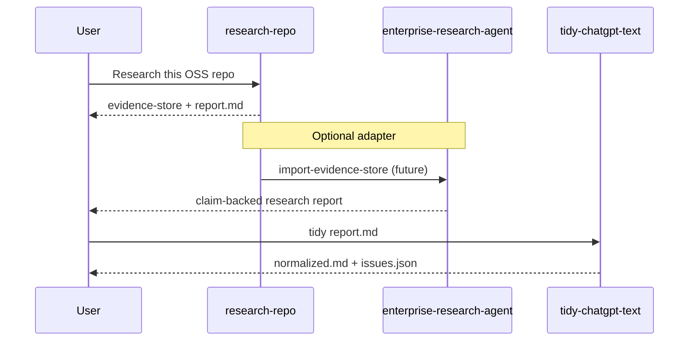
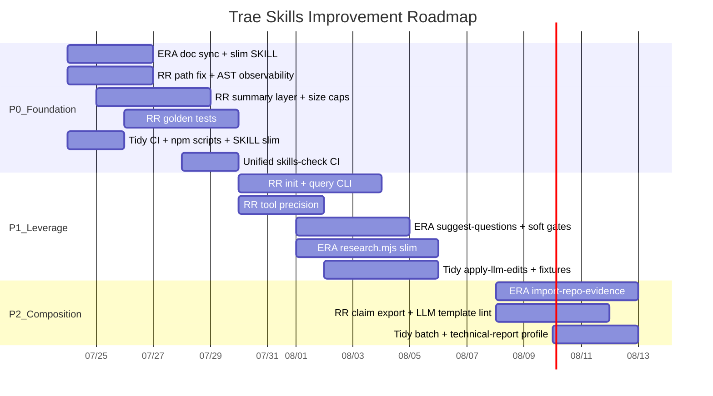

# `.trae` Skills 改进计划

> 状态：Proposal  
> 日期：2026-07-23  
> 范围：`.trae/skills/{enterprise-research-agent,research-repo,tidy-chatgpt-text}`  
> 原则：Hybrid Architecture（JS 确定性 + LLM 语义）；单文件优先；先修质量门与文档漂移，再扩能力；不做 Catalog/Multi-Agent/复杂 Memory

---

## 1. Executive Summary

当前 `.trae` 有 **3 个 skill**，设计哲学一致（确定性 backbone + LLM 推理），但 **成熟度不齐**：

| Skill | 代码量 | 测试 | CI | SKILL.md | 主要短板 |
|-------|-------:|:----:|:--:|---------:|---------|
| `enterprise-research-agent` | ~3.4k LOC + 25 fixtures | ✅ benchmark 11 + eval 14 | ✅ | ~865 行 | 文档漂移；单文件过重；LLM playbook 仍偏长 |
| `research-repo` | ~2.7k LOC | ❌ | ❌ | ~838 行 | 无回归测试；输出膨胀；路径约定不一致；AST 静默失败 |
| `tidy-chatgpt-text` | ~1.4k LOC + 10 fixtures | ✅ 10/10 | ❌ | ~888 行 | 未进 CI；LLM rewrite 半自动；缺 npm scripts |

**结论**：下一阶段不应再扩 ontology / pass 数量，而应：

1. **对齐文档与实现**（防止 Agent 按过时 playbook 执行）
2. **把 quality gate 扩到全部 skill**
3. **修 research-repo 的可靠性与可操作性**
4. **压缩 SKILL.md 上下文成本**
5. **定义 skill 间组合契约**（而不是继续各自膨胀）

---

## 2. 现状架构



### 2.1 共同设计模式（应保留）

| 模式 | 体现 |
|------|------|
| Hybrid | JS 做可复现计算；LLM 做语义判断 |
| Single-file machine | `research.mjs` / `research-repo.mjs` / `normalize.mjs` |
| Structured intermediate | session / evidence-store / issues.json |
| Explicit non-goals | 不做 OWL、完整 Compiler Framework、Multi-Agent 编排 |

### 2.2 已验证的健康信号

- `node research.mjs benchmark` → 11/11 pass
- `node research.mjs eval` → 14/14 pass
- `node tidy-chatgpt-text/test/run.mjs` → 10/10 pass
- `research-agent-check` 已挂 CI

### 2.3 已暴露的风险信号

| 风险 | 证据 |
|------|------|
| **SKILL.md ↔ 实现漂移** | enterprise SKILL 仍写「36 个命令」；实现已含 `assess-evidence` / `completion-assessment` / `benchmark` / `eval` 等 |
| **research-repo 输出不可靠** | 既有 session 中 `symbols.json` 全空（0 functions）；`tools.json` 误检（`name: "e"` / `"anthropic"`） |
| **输出膨胀** | `full.json` 达 2.8MB–6.4MB，LLM 无法直接消费 |
| **路径约定不一致** | SKILL 目录结构写 `02-evidence/`，报告章节却引用 `05-evidence/`、`00-discovery.json` |
| **操作摩擦** | 需手动 `cp research-repo.mjs` 到 working folder |
| **质量门不完整** | 仅 enterprise 进 CI；tidy 有测试未接线；research-repo 无测试 |
| **上下文税** | 三个 SKILL.md 合计 ~2.6k 行，Agent 加载成本高 |

---

## 3. 目标与非目标

### 3.1 目标

1. **Agent 可正确执行**：SKILL.md 与 CLI 契约一致
2. **改动可回归**：三 skill 都有 deterministic quality gate
3. **输出可被 LLM 消费**：evidence store 有摘要层与体积上限
4. **组合可组合**：repo research → enterprise claims → tidy report 有清晰接口
5. **维护成本可控**：单文件可保留，但 CLI/文档样板需压缩

### 3.2 非目标（明确不做）

- ❌ Skill Catalog / 插件市场 / Frontmatter 生命周期管理
- ❌ 跨 session Research Memory（Merge/TTL/Version 未到触发条件）
- ❌ Multi-Agent 框架、规则 DSL、图数据库
- ❌ tidy 演进为 Document Compiler / Language Server
- ❌ 为了“通用”牺牲当前三个 skill 的领域精度

---

## 4. 跨 Skill 横向改进（P0 优先）

### 4.1 统一 Skill 约定

| 约定 | 建议 |
|------|------|
| Frontmatter | 保留 `name` + `description`；`description` 控制在 300 字内（当前 enterprise 过长，影响 skill 路由） |
| 版本 | SKILL.md 增加 `## Changelog`（最近 5 条即可），不引入 semver 子系统 |
| 入口脚本 | 每个 skill 支持 `--help` / `version` 字段（打印 schema 版本） |
| 工作目录 | 统一 `skill run` 语义：优先从 skill 目录引用脚本，避免复制 |
| npm scripts | 根 `package.json` 增加 skill 入口，消除裸路径 |

建议新增 scripts：

```json
{
  "scripts": {
    "skill:research": "node .trae/skills/enterprise-research-agent/research.mjs",
    "skill:research:bench": "node .trae/skills/enterprise-research-agent/research.mjs benchmark",
    "skill:research:eval": "node .trae/skills/enterprise-research-agent/research.mjs eval",
    "skill:repo": "node .trae/skills/research-repo/research-repo.mjs",
    "skill:repo:test": "node .trae/skills/research-repo/test/run.mjs",
    "skill:tidy": "node .trae/skills/tidy-chatgpt-text/normalize.mjs",
    "skill:tidy:test": "node .trae/skills/tidy-chatgpt-text/test/run.mjs",
    "skill:check": "pnpm skill:research:bench && pnpm skill:research:eval && pnpm skill:tidy:test && pnpm skill:repo:test"
  }
}
```

### 4.2 Quality Gate 扩展



在 `.github/workflows/astro.yml` 将 `research-agent-check` 升级为 `skills-check`：

1. 保留 enterprise benchmark + eval
2. 增加 tidy fixture runner
3. 增加 research-repo golden tests（见 §5.2）

### 4.3 SKILL.md 分层（降上下文税）

每个 skill 拆为 **两层文档**，仍保持单目录：

```
skill/
├── SKILL.md              # Agent 运行时加载：何时调用 + 最短 playbook + CLI 契约
└── DESIGN.md（可选）      # 人读：设计原则、边界、长示例、演进讨论
```

| 层级 | 内容 | 目标行数 |
|------|------|---------:|
| SKILL.md | trigger / non-trigger / phase checklist / CLI 表 / schema 要点 / 红线 | 250–400 |
| DESIGN.md | 设计哲学、长示例、trade-off、roadmap | 不限 |

**原则**：Agent 只需要 SKILL.md；人类深度讨论进 DESIGN.md。现有 `docs/architecture/*` 可逐步吸收进 DESIGN 或保留交叉引用。

### 4.4 Skill 组合契约



短期不写自动编排器，只定义 **数据契约**：

| 上游 | 下游 | 契约 |
|------|------|------|
| research-repo `interesting_files.json` | LLM reading order | topFiles[] 稳定 schema |
| research-repo findings | enterprise claims | Finding → Claim mapping（type/evidenceIds/confidence） |
| enterprise `report.md` / any md | tidy | L0/L1/L2 规范化 |

---

## 5. 分 Skill 改进计划

### 5.1 `enterprise-research-agent`

#### 成熟度判断

P0 能力（Eval / Benchmark / Evidence Quality / Completion / Source Metadata）**代码侧大体已落地**，但 **SKILL.md 未同步**。下一阶段以 **契约对齐 + 可维护性 + 少量高杠杆命令** 为主。

#### 改进项

| ID | 优先级 | 项 | 说明 | 验收 |
|----|--------|----|------|------|
| ERA-1 | **P0** | 同步 SKILL.md 与 CLI | 补齐 `assess-evidence`、`completion-assessment`、`benchmark`、`eval`、`sourceMetadata` CLI 字段；更新命令计数与文件结构 | SKILL 中命令表 = `printUsage` |
| ERA-2 | **P0** | 缩短 playbook | Phase 0–7 保留 checklist，细节下沉 DESIGN；description frontmatter 压缩到可路由长度 | SKILL.md ≤ 400 行 |
| ERA-3 | **P1** | 内部精简 `research.mjs` | 按既有 slim plan：`withSession` / `requireArg` / 去薄委托；目标 3.4k → ~2.5k | benchmark+eval 全绿 |
| ERA-4 | **P1** | `suggest-questions` | 基于 gaps/conflicts/unverified claims 确定性生成候选问题，供 LLM 筛选 | 新 benchmark case |
| ERA-5 | **P1** | Coverage 软化 | coverage 影响 confidence/completion，不再作为唯一硬 gate（与 IMPROVEMENTS 文档一致） | eval 场景覆盖 finish_with_gaps |
| ERA-6 | **P1** | Conflict disclosure 增强 | `alternativeInterpretations` 自动进 report-template | eval contradiction 场景 |
| ERA-7 | **P2** | Connector Adapter 模板 | 标准化「Raw → Evidence」prompt 片段（GitHub/Web/Confluence），不写真实 connector 代码 | SKILL 中 adapter 模板可复制 |
| ERA-8 | **P2** | 与 research-repo 对接 | `import-repo-evidence --store <dir>`：把 discovery/architecture 摘要映射为 entities+evidence | 集成测试 1 条 |
| ERA-9 | **P3** | Session resume UX | `session-context --compact`；跨次研究仍不做 Memory | 人工验收 |

#### 明确延后

- Planner 完整化（Hypothesis → Verification Method）
- Research Memory
- RankingPolicy 系统
- Ontology 大扩表

#### 依赖关系

```
ERA-1 → ERA-2
ERA-3 可并行
ERA-4 / ERA-5 / ERA-6 依赖 ERA-1 文档准确
ERA-8 依赖 research-repo RR-3（摘要层）
```

---

### 5.2 `research-repo`（收益最高）

#### 成熟度判断

分析 pipeline 架构正确，但 **工程完整度最低**：无测试、无 CI、文档自相矛盾、大输出难用、AST 失败可静默。这是下一阶段 **主投入点**。

#### 改进项

| ID | 优先级 | 项 | 说明 | 验收 |
|----|--------|----|------|------|
| RR-1 | **P0** | 修 SKILL 路径约定 | 统一为 `evidence-store/*.json` + `01-hypotheses.md` + `02-evidence/` + `report.md`；删除 `00-`/`05-`/`07-` 旧编号 | 文档零冲突引用 |
| RR-2 | **P0** | AST/依赖失败可观测 | tree-sitter 不可用时 stderr 明确警告；`symbols`/`architecture` 输出 `meta.parser="tree-sitter"|"regex"|"none"`；禁止静默空结果冒充成功 | 断网/无 wasm 时仍有明确 meta |
| RR-3 | **P0** | 摘要层 + 体积控制 | 新增 `summary.json`（各 analyzer 的 top-N）；`symbols` 默认截断（top files by centrality）；`full.json` 改为可选 `--full` | 默认产物总大小 < 500KB（中型 repo） |
| RR-4 | **P0** | Golden tests | `test/fixtures/mini-repo-{py,ts}/` + expected JSON 关键字段断言 | `node test/run.mjs` 全绿 |
| RR-5 | **P1** | `init` 工作流命令 | `node research-repo.mjs init <repoPath> [--out research-foo-date]`：创建目录、写 evidence-store、生成 summary，**无需 cp 脚本** | 一条命令完成 Phase 0 |
| RR-6 | **P1** | 工具/入口误检治理 | 提高 tool 检测 precision（拒绝单字符名、库名误匹配）；entrypoints 去噪 | golden fixture 覆盖 |
| RR-7 | **P1** | Evidence Store Query CLI | `query who-calls decide` / `query file README` / `query top-centrality` | 不打开 6MB JSON 也能回答 |
| RR-8 | **P1** | CI 接线 | skills-check 跑 golden tests | PR 阻断回归 |
| RR-9 | **P2** | 增量分析 | 基于 file mtime/hash 跳过未变 analyzer | 二次运行明显加速 |
| RR-10 | **P2** | LLM 证据模板硬化 | `02-evidence/*.md` schema 校验脚本（Conclusion/Evidence/Confidence 必填） | 缺字段 fail |
| RR-11 | **P2** | 报告 claim 化（轻量） | report.md 关键结论强制 `Evidence: path:L-L`；可选导出 claims.json 供 ERA 消费 | 人工抽检 |
| RR-12 | **P3** | 可选深度分析 | 文档中标注 `ts-morph`/`dependency-cruiser` 为 optional；默认不装 | 不污染主路径 |

#### Analyzer 可靠性矩阵（目标）

| Analyzer | 当前问题 | 目标 |
|----------|---------|------|
| discovery | 稳定 | 保持 |
| architecture | 大体可用 | 加 meta.parser + 截断 nodes 列表 |
| symbols | 曾出现全空 | meta + 非空断言（对 fixture） |
| tools | 误检严重 | precision 优先于 recall |
| prompts | 大 repo 体积爆炸 | top-N + length cap |
| ranking | 稳定 | 作为 LLM 默认入口强化 |
| git / ci / tests / evals | 稳定 | 保持 |

#### 建议最小测试夹具

```
test/fixtures/mini-agent-ts/
  package.json
  src/index.ts          # entry + tool registration
  src/agent/runner.ts   # core
  src/prompts/system.ts # prompt const
  tests/runner.test.ts
  .github/workflows/ci.yml
```

断言示例：

```json
{
  "discovery.manifest.language": "javascript",
  "entrypoints.minCount": 1,
  "prompts.minCount": 1,
  "symbols.totalFunctions.min": 1,
  "tools.names": ["search", "finish"],
  "ranking.topFiles.includes": ["README.md", "src/agent/runner.ts"]
}
```

---

### 5.3 `tidy-chatgpt-text`

#### 成熟度判断

**确定性部分最扎实**：Rule registry、Dual API、snapshot tests 齐全。短板在 **工程接线** 与 **LLM 半程闭环**。

#### 改进项

| ID | 优先级 | 项 | 说明 | 验收 |
|----|--------|----|------|------|
| TCT-1 | **P0** | CI + npm script | `skill:tidy:test` 进 skills-check | PR 阻断 |
| TCT-2 | **P0** | SKILL 瘦身 | 运行时只保留 level 判定、红线、issue 处理流程、CLI；长 schema 示例下沉 | SKILL.md ≤ 350 行 |
| TCT-3 | **P1** | `apply-llm-edits` | 接受 LLM 返回的 `[{issueId, replacement}]`，JS 负责回写全文，避免 LLM 重写整篇 | 单测 2 条 |
| TCT-4 | **P1** | 补 fixture | 中文标点、GFM 表格、嵌套 blockquote、混合 list+code | fixture ≥ 15 |
| TCT-5 | **P1** | 批量模式 | `normalize.mjs --dir src/content/blog --level L0 --check` 服务本站内容管道 | 退出码可聚合 |
| TCT-6 | **P2** | AI score 校准 | 基于真实 ChatGPT/Claude 样本重新标定 phrase 列表与阈值 | 对 gold set 单调 |
| TCT-7 | **P2** | 可选 pre-commit | lint-staged 仅 L0 check（不改语义） | 文档说明即可 |
| TCT-8 | **P3** | 与 research report 联调 | tidy 默认 profile `technical-report`（保留 Mermaid/表格） | 1 个 e2e 样例 |

#### 明确不扩展

- 不新增 Document IR / Entity System
- 不把 Pass DAG 升级为完整 compiler framework
- 不在 JS 端做真正语义理解

---

## 6. 优先级路线图



### 阶段目标

| 阶段 | 时间盒 | 退出标准 |
|------|--------|---------|
| **P0 Foundation** | ~1 周 | 三 skill 均有 CI；SKILL 无路径/命令漂移；research-repo 默认输出可被 LLM 消费 |
| **P1 Leverage** | ~1 周 | `research-repo init` 一条龙；query CLI；ERA 文档与精简完成；tidy LLM 回写闭环 |
| **P2 Composition** | ~1 周 | repo evidence → enterprise claims 可跑通最小路径；报告 tidy 有 profile |

---

## 7. 建议实施顺序（执行清单）

### Wave 0 — 低风险高收益（可并行）

1. 根 `package.json` 增加 skill scripts
2. tidy 进 CI
3. enterprise SKILL 命令表与 frontmatter 压缩
4. research-repo SKILL 路径编号统一

### Wave 1 — research-repo 可靠性

1. analyzer `meta` 字段 + 失败可观测
2. `summary.json` + 截断策略
3. mini-repo fixtures + golden runner
4. CI 接线

### Wave 2 — 操作体验

1. `research-repo init`
2. `query` 子命令
3. tidy `apply-llm-edits`
4. ERA `suggest-questions`

### Wave 3 — 组合与精简

1. ERA `import-repo-evidence`
2. `research.mjs` 内部精简（保持行为）
3. 各 skill DESIGN.md 下沉长文
4. 更新 `AGENTS.md` Quick Commands / External Resources（若 scripts 或结构变化，走 `@agents-maintainer`）

---

## 8. 成功指标

| 指标 | 当前 | 目标 |
|------|------|------|
| CI 覆盖 skill 数 | 1/3 | 3/3 |
| research-repo 默认产物体积（中型 repo） | 数 MB | < 500KB |
| symbols 空结果静默率 | 曾发生 | 0（必须有 meta/warning） |
| SKILL.md 平均行数 | ~860 | ≤ 400 |
| enterprise CLI 文档一致率 | 漂移 | 100% |
| tidy fixture 数 | 10 | ≥ 15 |
| research-repo golden 断言 | 0 | ≥ 20 |
| Agent 首次执行 research-repo 的手工步骤 | cp + 11 条命令 | `init` 1 条 |

---

## 9. 风险与缓解

| 风险 | 影响 | 缓解 |
|------|------|------|
| 单文件继续膨胀 | 维护困难 | 精简样板；禁止为“整洁”强行拆多包；section header 保留 |
| 截断 symbols 丢关键信息 | 研究质量下降 | 按 centrality 保留 top files；提供 `--full` 逃生口 |
| SKILL 瘦身过度 | Agent 漏步骤 | 保留 phase checklist + 红线；细节进 DESIGN 但链接明确 |
| CI 时间变长 | PR 体验差 | research-repo fixture 保持微型；bench/eval 已很快 |
| 跨 skill 组合过早 | 接口不稳 | P2 再做 import；P0/P1 只冻结 schema |

---

## 10. 决策记录（建议默认选项）

| 决策点 | 推荐 | 理由 |
|--------|------|------|
| 是否拆 multi-file package | **否** | 当前体量仍可单文件；先减样板再谈拆分 |
| 是否引入测试框架（Vitest） | **否（暂）** | 沿用各 skill 自带 runner，与现有 enterprise/tidy 一致 |
| research-repo 是否复制脚本到 working dir | **改为引用 skill 路径** | 消除版本分叉；`init` 写相对说明即可 |
| enterprise coverage 硬 gate | **改为软信号** | 与 completion assessment 一致，避免假失败 |
| 是否做 Research Memory | **否** | 触发条件未到 |
| 是否统一中英文 SKILL | **保持现状** | enterprise/tidy 中文、research-repo 英文可并存；frontmatter description 建议双语关键词便于路由 |

---

## 11. 附录：当前目录快照

```
.trae/skills/
├── enterprise-research-agent/
│   ├── SKILL.md
│   ├── research.mjs          # Ontology + Session + Claim + Decision + Bench/Eval
│   ├── benchmark/            # 11 tasks
│   ├── eval/                 # 14 scenarios
│   └── test-session.json
├── research-repo/
│   ├── SKILL.md
│   └── research-repo.mjs     # 11 analyzers + Tree-sitter pipeline
└── tidy-chatgpt-text/
    ├── SKILL.md
    ├── normalize.mjs         # AST Pass + Rule registry
    └── test/                 # 10 fixtures + snapshot runner
```

相关既有文档（避免重复劳动）：

- `docs/architecture/RESEARCH-AGENT-IMPROVEMENTS.md` — ERA 能力评审（多数 P0 已实现，需文档同步）
- `docs/architecture/plan-slim-enterprise-research-agent.md` — ERA 精简
- `docs/architecture/RESEARCH-AGENT-REFACTOR-PLAN.md` — ERA 重构

---

## 12. 下一步（若批准本计划）

建议按以下顺序开 PR（小步、可回滚）：

1. **PR1**：npm scripts + tidy CI + skills-check 重命名  
2. **PR2**：三 skill SKILL.md 契约对齐与瘦身（无行为变更）  
3. **PR3**：research-repo meta/summary/截断 + golden tests  
4. **PR4**：research-repo `init` + `query`  
5. **PR5**：ERA suggest-questions / soft coverage / slim internals  
6. **PR6**：跨 skill import + tidy apply-llm-edits  

每个 PR 必须：`pnpm skill:check` 全绿；若改 `package.json`/目录结构，按 `AGENTS.md` 触发 `@agents-maintainer` 更新维护日志。
