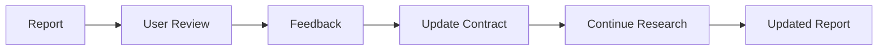

# Enterprise Research Agent 提升建议

> 基于 `temp/research-agent/` 参考项目的架构思想，对比当前实现提出的提升方向。
> **只提建议，不改动现有代码和文档。**

---

## 一、Evidence 定位精度：从 Content 到 Fragment

### 当前实现

Evidence 只有 `content`（free text）和 `uri`：

```json
{
  "id": "ev1",
  "source": "GitHub",
  "uri": "https://github.com/org/riskconcile-api",
  "content": "Repo exists, CODEOWNERS=Team B, daily commits"
}
```

### 问题

`content` 是 LLM 抽取后的自由文本，丢失了原始文档中的**精确位置信息**。当需要人工复核时，无法快速定位到原文出处。

### 建议

增加 `fragment` 字段，分离 **quote**（精确引用）和 **context**（上下文）：

```json
{
  "id": "ev1",
  "source": "GitHub",
  "uri": "https://github.com/org/riskconcile-api/blob/main/CODEOWNERS",
  "fragment": {
    "quote": "* @team-b",
    "context": "CODEOWNERS file, line 1-3",
    "section": "CODEOWNERS"
  },
  "content": "Repo ownership assigned to Team B per CODEOWNERS"
}
```

**按 Source 类型的定位规范**：

| Source 类型 | Quote | Context |
|------------|-------|---------|
| GitHub | 代码行 / 文件路径 | repo / file / line range |
| Confluence | 段落内容 | page / heading / paragraph |
| Jira | 字段值 | ticket / field |
| LeanIX | 属性值 | app / fact sheet / field |
| Web | 文本片段 | URL / heading / paragraph |

**收益**：
- 人工复核时可直接定位原文
- Claim 验证时可直接检查 quote 是否被断章取义
- 报告中的引用更精确（`> "quote"` 而非 paraphrase）

---

## 二、Source Card：从字符串到一等对象

### 当前实现

Source 只是一个字符串字段：`"GitHub"`、`"LeanIX"`、`"External"`。

权重通过 `SOURCE_WEIGHTS` 常量硬编码：

```javascript
const SOURCE_WEIGHTS = {
  Vendor: 0.9,
  Regulation: 0.95,
  GitHub: 0.8,
  // ...
};
```

### 问题

1. 同一 Source 类型下的不同实例没有区分（如 GitHub 上的官方 repo vs 个人 fork）
2. Source 的元数据（title/author/retrieved/authority）未记录
3. Source 权重是静态的，无法根据实例动态调整

### 建议

引入 **Source Card** 作为一等对象：

```json
{
  "id": "src1",
  "type": "system_of_record",
  "name": "GitHub",
  "uri": "https://github.com/org/riskconcile-api",
  "authority": 0.85,
  "retrievedAt": "2026-07-20T10:00:00Z",
  "metadata": {
    "org": "org",
    "repo": "riskconcile-api",
    "lastCommit": "2026-07-19"
  }
}
```

**Source 类型体系**：

| 类型 | 说明 | 示例 | 基础权重 |
|------|------|------|---------|
| `system_of_record` | 企业内部系统记录 | LeanIX、GitHub CODEOWNERS、ServiceNow | 0.8-0.9 |
| `official` | 官方来源 | Vendor 官网、Regulation 原文 | 0.9-0.95 |
| `peer_reviewed` | 同行评审 | 学术论文 | 0.85 |
| `industry` | 行业分析 | Gartner、IDC | 0.7 |
| `engineering` | 工程实践 | 技术博客、GitHub 开源 | 0.6-0.7 |
| `news` | 新闻报道 | 科技媒体 | 0.4-0.5 |
| `social` | 社交媒体 | Twitter、Reddit | 0.2-0.3 |

**Evidence → Source 的关联**：

```json
{
  "id": "ev1",
  "sourceId": "src1",
  "fragment": { "quote": "* @team-b", "context": "CODEOWNERS line 1" },
  "content": "..."
}
```

**收益**：
- Source 元数据可追溯（何时获取、从哪个具体 URI）
- 动态权重：同一 Source 类型下，不同实例可有不同 authority
- 支持 Source 过期检测（`retrievedAt` 过旧可提示重新获取）

---

## 三、Hypothesis 生命周期：从 Rejected 到 Active

### 当前实现

只有 `rejectedHypotheses`（已排除的假设）：

```json
{
  "rejectedHypotheses": [
    { "hypothesis": "RC Migration Tool is deprecated", "reason": "Still daily commits" }
  ]
}
```

### 问题

Hypothesis 只在被拒绝时记录，**没有 Active Hypothesis 的概念**。研究过程中产生的待验证假设没有被追踪。

### 建议

引入完整的 **Hypothesis 生命周期**：

```json
{
  "hypotheses": [
    {
      "id": "h1",
      "text": "RiskConcile is used by RC Migration Tool",
      "status": "confirmed",
      "evidenceIds": ["ev1", "ev2"],
      "confidence": 0.92,
      "createdAt": "...",
      "resolvedAt": "..."
    },
    {
      "id": "h2",
      "text": "RiskConcile has a Contract with Legal",
      "status": "pending",
      "evidenceIds": [],
      "confidence": 0.0
    }
  ]
}
```

**状态流转**：

```
pending → investigating → confirmed / rejected / uncertain
```

**与 Question Tree 的关系**：

- Hypothesis 是"我认为什么可能是真的"
- Question 是"我需要验证什么"
- 一个 Hypothesis 可触发多个 Question
- 一个 Question 的答案可确认/否定多个 Hypothesis

**收益**：
- 研究过程的可解释性：为什么问这个问题？→ 为了验证某个假设
- 避免重复探索：已 confirmed/rejected 的假设不再产生新问题
- 报告可展示"研究假设 → 验证过程 → 结论"的完整链条

---

## 四、Claim Graph 渲染：从 JSON 模板到结构化报告

### 当前实现

`report-template` 生成 JSON 骨架，LLM 填写后 `validate-report` 校验：

```json
{
  "task": "...",
  "executiveSummary": "",
  "keyFindings": [],
  "supportingEvidence": [],
  "confidence": {},
  "conflicts": [],
  "knowledgeGaps": [],
  "recommendations": [],
  "traceability": {}
}
```

### 问题

1. 报告是"填空式"生成，不是由 Claim Graph **渲染**出来的
2. keyFindings 和 supportingEvidence 有重复数据
3. 没有展示 Claim 之间的依赖关系（supportingClaimIds 存在但未在报告中体现）

### 建议

**报告由 Claim Graph 渲染**，而非自由生成：

```markdown
## Executive Summary

RiskConcile 是 RegTech 供应商（[Claim c1](#)），
企业内部已在 1 个 Application 中使用（[Claim c2](#)）。
LeanIX 与 GitHub 在 owner 上存在冲突（[Claim c3](#)）。
Claim Coverage: 92%。

## Key Findings

### F1: RiskConcile 被 RC Migration Tool 使用

**Claim**: [c1] fact (confidence: 0.92, verified)

**Evidence**:
- [ev1] LeanIX: App registered, owner=Team A
- [ev2] GitHub: CODEOWNERS=Team B

**Reasoning**: Both systems reference RiskConcile as a dependency.

---

### F2: Application owner 在 LeanIX 与 GitHub 间存在冲突

**Claim**: [c3] analysis (confidence: 0.85, verified)

**Evidence**:
- [ev1] LeanIX: owner=Team A
- [ev2] GitHub: owner=Team B

**Conflict**: Same property "owner" has conflicting values across systems.

**Reasoning**: This suggests a process gap in ownership assignment.
```

**渲染规则**：

1. **Executive Summary** 由 high-confidence + verified Claim 自动摘要
2. **Key Findings** 按 Claim type 分组（fact → analysis → recommendation）
3. **每个 Finding** 必须展示：Claim text → Evidence list → Reasoning（如为 analysis/recommendation）
4. **Conflicts** 直接嵌入相关 Finding，而非单独章节
5. **Traceability Layer** 自动生成，不需要 LLM 填写

**收益**：
- 报告内容与 Claim Graph 强一致，避免"报告写了但 Graph 没更新"的不一致
- 人工复核时可直接从报告跳转到 Evidence
- 减少 LLM 自由发挥的空间，降低 hallucination

---

## 五、Feedback Loop：从单次研究到持续改进

### 当前实现

研究是单次流程：Contract → Investigation → Analysis → Report → 结束。

没有用户反馈循环。

### 建议

引入 **Feedback Loop**：



**反馈类型**：

| 反馈 | 动作 |
|------|------|
| "深入研究 X" | 添加新 Plan Item + Question，继续 Expand |
| "X 的证据不足" | 提升 Claim Coverage，补充 Evidence |
| "X 的结论有误" | 标记 Claim 为 disputed，重新验证 |
| "忽略 Y" | 添加 Rejected Hypothesis，prune 相关 Question |

**CLI 扩展**：

```bash
# 用户反馈
node research.mjs user-feedback --type "deep_dive" --target "Contract information" --note "Need more details on contract terms"

# 继续研究（基于反馈）
node research.mjs continue-research --session research-session.json
```

**收益**：
- 研究不是一次性任务，而是可迭代的
- 用户反馈沉淀为新的 Question / Hypothesis
- 避免"重新从头研究"的重复工作

---

## 六、External Verification 增强：从可选到自动

### 当前实现

External Verification 是 Phase 6（可选阶段），由 LLM 手动触发 WebSearch/WebFetch。

```bash
# 手动触发
node research.mjs add-evidence --source External --uri "..." --content "..."
```

### 问题

1. 不是自动化的——依赖 LLM 判断哪些 Claim 需要外部验证
2. 没有系统性地覆盖所有 unverified Claim
3. 外部证据与内部证据的冲突检测不主动

### 建议

**自动化 External Verification**：

```javascript
// 自动识别需要外部验证的 Claim
function needsExternalVerification(claim) {
  return (
    !claim.verified &&
    claim.confidence < 0.7 &&
    claim.type === 'fact' &&
    claim.evidenceIds.length < 2
  );
}

// 自动触发外部搜索
async function externalVerify(session) {
  const toVerify = session.claims
    .filter(needsExternalVerification)
    .slice(0, 5); // 每次最多验证 5 个
  
  for (const claim of toVerify) {
    // 使用 WebSearch/WebFetch 获取外部证据
    const externalEvidence = await searchExternal(claim.text);
    session.addEvidence({
      source: 'External',
      content: externalEvidence.summary,
      confidence: externalEvidence.confidence,
      // ...
    });
  }
}
```

**CLI 扩展**：

```bash
# 自动外部验证
node research.mjs auto-verify --max-claims 5

# 外部验证结果
node research.mjs list-external-evidence
```

**收益**：
- 减少 LLM 判断负担
- 系统性覆盖未验证 Claim
- 自动发现内部与外部证据的冲突

---

## 七、ResearchSession 历史：从单文件到时间线

### 当前实现

每个研究任务一个 JSON 文件，覆盖式保存：

```bash
./research-session.json
```

### 问题

1. 无法查看研究过程的"时间线"
2. 无法回滚到某个 Decision Point
3. 无法对比两个版本的变化

### 建议

**引入 Session 历史版本**：

```
research-session/
├── session.json          # 当前版本
├── history/
│   ├── 001-init.json
│   ├── 002-contract.json
│   ├── 003-budget.json
│   ├── 004-decide-continue.json
│   ├── 005-decide-continue.json
│   └── 006-decide-finish.json
```

每个 `decide` 调用、每个 `analyze` 调用自动保存一个快照。

**CLI 扩展**：

```bash
# 查看历史
node research.mjs history

# 对比两个版本
node research.mjs diff --from 004 --to 006

# 回滚到某个版本
node research.mjs rollback --to 004
```

**收益**：
- 可追溯研究过程的每一步演变
- 可复盘"为什么在这个点决定 Continue/Finish"
- 支持 A/B 对比不同研究路径

---

## 八、Confidence 可视化：从数字到雷达图

### 当前实现

Confidence 是一个 score（0-1）+ level（high/medium/low）：

```json
{
  "level": "medium",
  "score": 0.475,
  "rationale": "avg score 0.47, 2 entities, 3 evidence, 2 contradictions, 4 gaps"
}
```

### 问题

1. 单一数字难以直观反映多维度的置信度
2. perEntity 的 confidence 没有可视化展示
3. 用户无法快速识别哪个维度拉低了置信度

### 建议

**Confidence Radar Chart**（Mermaid 或文本形式）：

```markdown
## Confidence Assessment

Overall: **medium** (0.475)

```
Evidence Count    [████░░░░░░] 0.4
Source Diversity  [██░░░░░░░░] 0.2
Source Authority  [██████░░░░] 0.6
Cross Validation  [░░░░░░░░░░] 0.0
Freshness         [██████░░░░] 0.6
Contradiction     [██░░░░░░░░] 0.2  (penalty)
```

**Per-Entity 对比**：

```
Entity          Score  Level  Gap  Conflict  Evidence
RiskConcile     0.72   high   1    0         5
RC Migration    0.45   medium 2    1         3
Team A          0.30   low    3    0         1
```

**收益**：
- 一眼看出哪个维度需要补充
- 快速识别 weakest entity，优先补充证据
- 报告中的 confidence 更有说服力

---

## 九、Ontology 扩展性：从常量到配置

### 当前实现

Ontology 是 `research.mjs` 中的硬编码常量：

```javascript
const ONTOLOGY = {
  Vendor: { ... },
  Application: { ... },
  // ...
};
```

### 问题

1. 添加新 entity type 需要修改代码
2. 不同行业/企业的 Ontology 需求不同（如金融行业需要 `Regulation`、`Control`，制造业可能需要 `Equipment`、`Line`）
3. 无法在运行时动态扩展

### 建议

**Ontology 配置文件化**：

```yaml
# ontology.yaml
Vendor:
  description: External supplier
  properties:
    website: string
    category: string
  requiredProperties: [website]
  relations:
    used_by: Application
    contracted_by: Contract

# 企业可自定义
CustomEquipment:
  description: Manufacturing equipment
  properties:
    model: string
    manufacturer: string
  requiredProperties: [model]
  relations:
    located_at: Factory
```

**CLI 扩展**：

```bash
# 加载自定义 Ontology
node research.mjs load-ontology --file ontology.yaml

# 查看当前 Ontology
node research.mjs show-ontology

# 验证实体是否符合 Ontology
node research.mjs validate-ontology --entity e1
```

**收益**：
- 零代码扩展：业务用户可自行定义 Ontology
- 行业适配：金融、制造、医疗等不同行业的 Ontology 可独立维护
- 版本管理：Ontology 变更可追溯

---

## 十、命令补齐与交互体验

### 当前实现

36 个命令，参数较多，容易出错：

```bash
node research.mjs add-evidence --source GitHub --uri "..." --content "..." --confidence 0.95 --last-updated 2025-09-12 --claims "owner=Team B,status=Active"
```

### 建议

1. **命令别名**：
   ```bash
   node research.mjs ae --source GitHub --uri "..."  # add-evidence
   node research.mjs ae -s GitHub -u "..."            # 短参数
   ```

2. **交互式提示**：
   ```bash
   node research.mjs interactive
   # > What would you like to do?
   # 1. Add evidence
   # 2. Add entity
   # 3. Run analysis
   ```

3. **批量导入**（从 CSV/JSON）：
   ```bash
   node research.mjs import-evidence --file evidence.csv
   node research.mjs import-entities --file entities.json
   ```

4. **Tab 补全脚本**：
   ```bash
   # 生成 shell 补全脚本
   node research.mjs completion --shell zsh > ~/.zsh/completions/_research
   ```

**收益**：
- 降低使用门槛
- 减少参数错误
- 支持批量操作（大规模数据导入）

---

## 总结：优先级排序

| 优先级 | 建议 | 工作量 | 影响 |
|--------|------|--------|------|
| P0 | **Evidence Fragment 定位** | 小 | 追溯精度 ↑ |
| P0 | **Source Card 体系** | 中 | 可信度评估 ↑ |
| P1 | **Hypothesis 生命周期** | 中 | 研究可解释性 ↑ |
| P1 | **Claim Graph 渲染报告** | 中 | 报告质量 ↑ |
| P1 | **Confidence 可视化** | 小 | 用户体验 ↑ |
| P2 | **Feedback Loop** | 大 | 迭代能力 ↑ |
| P2 | **External Verification 自动化** | 中 | 验证覆盖 ↑ |
| P2 | **Session 历史版本** | 中 | 可追溯性 ↑ |
| P3 | **Ontology 配置化** | 中 | 扩展性 ↑ |
| P3 | **交互体验优化** | 小 | 易用性 ↑ |

---

## 附录：参考文件索引

| 参考文件 | 核心思想 | 对应建议 |
|---------|---------|---------|
| `v1.md` | Enterprise Research Agent 定位、数据源分层、Entity Resolution | 已内化到当前设计 |
| `v2.md` | 从 Search 到 Research 的演进 | 已内化到当前设计 |
| `v3.md` | Research/Investigation/Analysis 分离、Evidence Model | 已内化到当前设计 |
| `v4.md` | Question Tree、5 原则、Expand-Converge | 已内化到当前设计 |
| `可追踪.md` | Claim-Evidence-Source Graph、Traceability Layer、Reviewer Agent | #2, #4, #6 |
| `本体论.md` | 最小可行 Ontology、Schema 与实例分离 | #9 |
| `chatgpt-cn.md` | 架构愿景、企业知识工作痛点 | 已内化到当前设计 |
