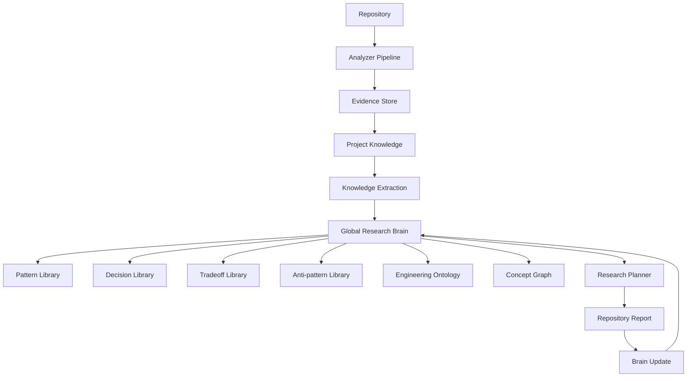

我认为这是你整个 `research-repo` 最值得做的升级，而且**价值远大于继续增加 Analyzer**。

因为你现在的设计，本质还是：

> **Repository-Centric Research（仓库中心）**

每次分析结束，Knowledge 就结束了。

而真正优秀的 Research System（Palantir、Google Research、Sourcegraph Cody、GitHub 内部知识平台）更接近：

> **Knowledge-Centric Research（知识中心）**

Repository 只是 Evidence。

真正长期积累的是 Knowledge。

---

# 我建议整体升级成三层架构

不要把 Evidence Store 当最终结果。

而是：

```text
                Repository A
                     │
                Analyzer Pipeline
                     │
                     ▼
              Evidence Store
                     │
                     ▼
           Knowledge Extraction
                     │
──────────────────────────────────
          Global Knowledge Base
──────────────────────────────────
                     ▲
                     │
              Repository B
                     │
                Analyzer Pipeline
```

这里：

Evidence

只是：

Raw Facts。

Knowledge Base

才是真正的大脑。

---

# 三层模型

我建议以后整个系统只有三层。

## 第一层

Repository Memory（局部）

就是你现在的：

```text
research-openai-agents/

research-langgraph/

research-duckdb/
```

里面：

```
Evidence

Hypothesis

Report

Questions
```

完全保留。

这是：

Project Memory。

---

## 第二层

Global Knowledge

新增：

例如：

```
knowledge/

patterns/

decisions/

ontology/

comparisons/

anti-patterns/

```

例如：

```
knowledge/

    patterns/
        planner-executor.json
        event-bus.json
        plugin-system.json
        workflow-engine.json

    decisions/
        runner-centric.json
        stateless-tool.json
        memory-layer.json

    anti-patterns/
        god-context.json
        prompt-spaghetti.json

    glossary/
        ontology.json
```

这是：

所有 Repository 共用。

---

## 第三层

Research Brain

真正的大脑。

例如：

```
brain/

knowledge-index.json

concept-graph.json

learning-history.json

confidence.json
```

以后：

LLM：

不是：

直接读：

Evidence。

而是：

先问：

Brain。

---

# 整个流程应该改变

现在：

```text
Repository

↓

Evidence

↓

Report
```

升级：

```text
Repository

↓

Evidence

↓

Knowledge Extraction

↓

Global Brain

↓

Report
```

注意：

Report

只是：

副产品。

Knowledge

才是真正产品。

---

# Brain 存什么？

千万不要存：

代码。

应该存：

抽象。

例如：

不是：

```
Runner

位于：

runner.py
```

而是：

```
Pattern

Planner-Executor Separation

Observed

OpenAI Agents

Claude Code

LangGraph

Confidence

98%
```

以后：

研究：

第四个项目：

Brain：

已经知道：

Planner。

---

例如：

```
Pattern

Tool Registry

```

Observed：

```
OpenHands

OpenAI Agents

MCP

Codex CLI

Continue
```

以后：

新项目：

发现：

又有：

Tool Registry。

Brain：

自动：

Confidence++

---

# Knowledge Unit

不要存：

Markdown。

应该：

Knowledge Object。

例如：

```json
{
  "id":"pattern.planner-executor",

  "type":"ArchitecturePattern",

  "title":"Planner Executor Separation",

  "description":"Planning and execution are isolated.",

  "evidence":[
      "openai-agents",
      "langgraph",
      "autogen"
  ],

  "confidence":0.96,

  "tradeoffs":[
      "...",
      "..."
  ],

  "counterExamples":[
      "aider"
  ]
}
```

这才是真正知识。

---

# Brain 最重要的是 Pattern

例如：

Pattern Library：

```
Planner Executor

Workflow Engine

Plugin Registry

Actor

Event Bus

Context Compression

Retry Queue

Checkpoint

Snapshot

Guardrail

Reflection

State Machine
```

以后：

任何 Repository：

都：

Mapping。

而不是：

重新总结。

---

# 第二个：

Decision Library

例如：

```
Decision

Why Runner

```

Observed：

```
OpenAI Agents

Reason

Streaming

Cancellation

Tracing
```

以后：

Claude：

如果：

也是：

Runner。

Brain：

自动：

关联。

---

# 第三个：

Tradeoff Library

例如：

```
Decision

Single Runner

```

Tradeoff：

```
Pros

简单

Cons

扩展困难
```

Observed：

```
DuckDB

OpenAI

LangGraph
```

以后：

LLM：

不用：

重新分析。

---

# 第四个：

Anti-pattern

例如：

```
Prompt Spaghetti

```

Observed：

```
Old AutoGPT
```

Later：

```
CrewAI
```

Confidence++

以后：

看到：

Prompt：

乱。

自动：

提醒。

---

# 第五个：

Engineering Vocabulary

这是：

最重要。

例如：

不要：

每次：

重新发明术语。

统一：

```
Planner

Executor

Harness

Guardrail

Checkpoint

Workflow

Observation

Resolution

Ontology

Decision

Constraint
```

以后：

整个 Report：

一致。

---

# 我更建议加入 Concept Graph

例如：

```text
Planner

↓

produces

↓

Plan

↓

executed_by

↓

Runner

↓

calls

↓

Tool

↓

returns

↓

Observation

↓

updates

↓

Memory
```

以后：

不仅：

Repository。

整个：

Knowledge。

都有：

Graph。

---

# 新增一个 Brain Update Stage

现在：

最后：

```
Stage7

Report
```

建议：

变：

```
Stage7

Report

↓

Stage8

Knowledge Extraction

↓

Stage9

Brain Update
```

Brain Update：

回答：

```
新的Pattern？

新的Decision？

新的Tradeoff？

新的AntiPattern？

新的Vocabulary？

是否修改已有知识？
```

不是：

生成：

Report。

而是：

更新：

Brain。

---

# 每次研究开始

不要：

直接：

Question Planner。

先：

Brain。

例如：

```
Brain

↓

Repository

↓

Diff

↓

Novelty Detection

↓

Research Question
```

例如：

Brain：

已经知道：

```
Planner
```

那么：

Question：

不会：

问：

```
Planner是什么？
```

而会：

问：

```
这里为什么不用State Machine？
```

Question：

越来越高级。

---

# 最终我建议的整体架构



## 我认为最关键的一点

**不要把它设计成“Repository 分析器”，而要设计成“持续学习的工程研究系统”。**

也就是说，每个 Repository 的 Evidence Store 仍然保持独立、可复现、可缓存；但在此之上建立一个全局的 **Research Brain**，它沉淀的是经过验证的知识，而不是源码事实。

我建议 Brain 至少维护六类长期资产：

| 知识类型                 | 内容                                           | 来源                                         |
| -------------------- | -------------------------------------------- | ------------------------------------------ |
| Pattern Library      | 可复用架构模式（Planner、Plugin Registry、Event Bus 等） | 多个 Repository 共同验证                         |
| Decision Library     | 为什么采用某种设计及其适用条件                              | Research Report 中验证后的 Engineering Decision |
| Tradeoff Library     | 每种设计的收益、成本和适用边界                              | 多项目对比与反例                                   |
| Anti-pattern Library | 常见设计问题及失败案例                                  | 历史项目、被废弃方案                                 |
| Engineering Ontology | 统一术语、关系和对象模型                                 | 全部研究成果持续收敛                                 |
| Concept Graph        | Pattern、Decision、Tradeoff、Repository 之间的关系图  | Brain 自动维护                                 |

这样，当你研究第 30 个 Repository 时，系统不再是“重新分析一个仓库”，而是在回答两个问题：

1. **这个 Repository 与已有知识相比，有哪些相同与不同？**
2. **它为整个知识库贡献了哪些新的模式、决策或反例？**

这一层，才是真正的“统一大脑”。
