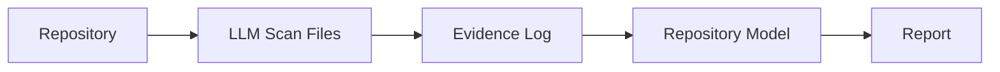
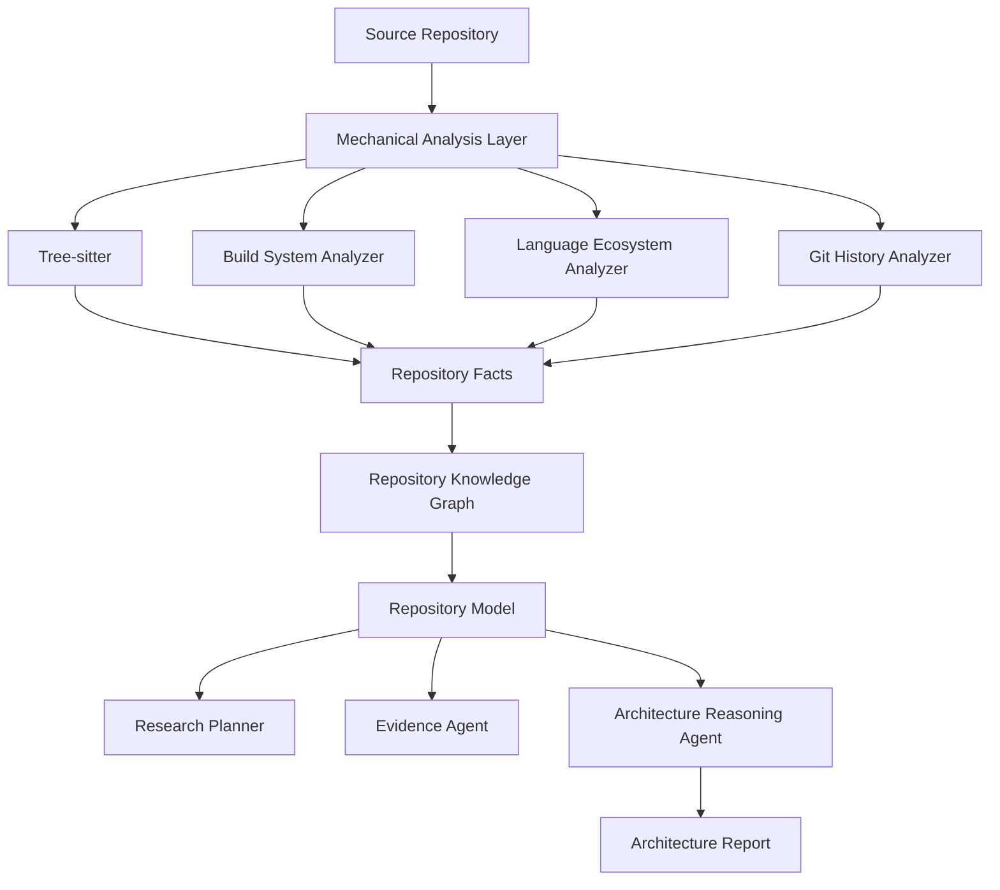
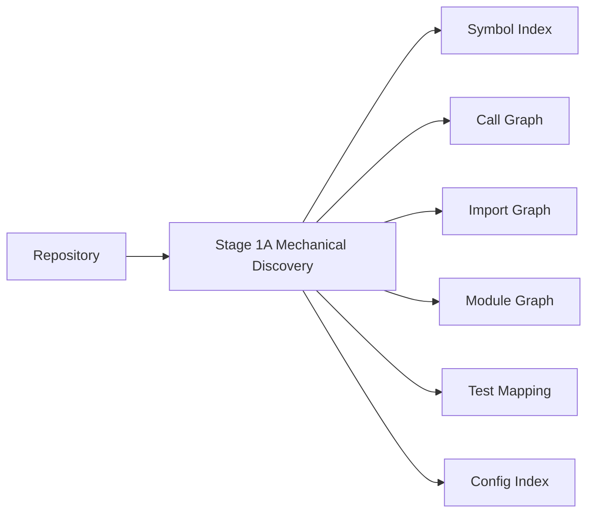
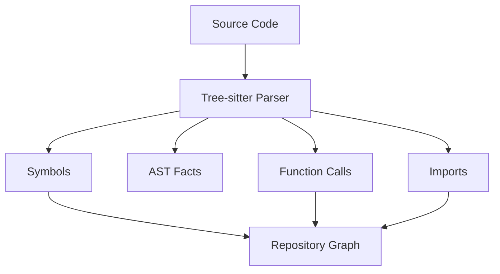
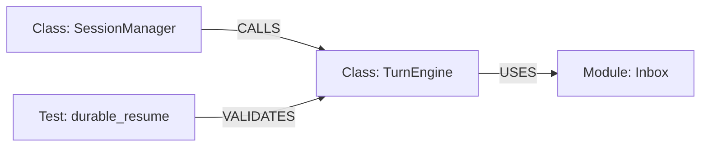
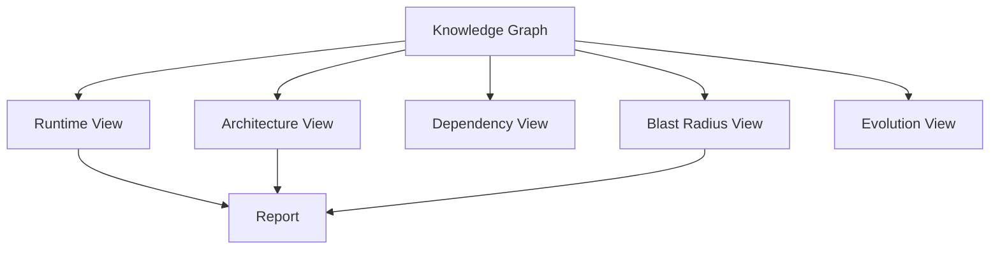
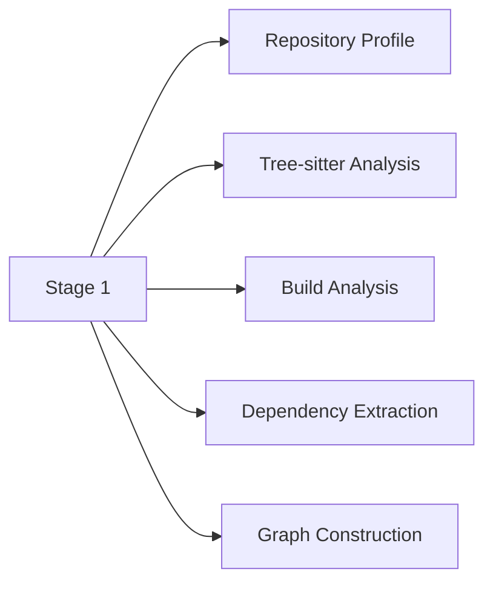
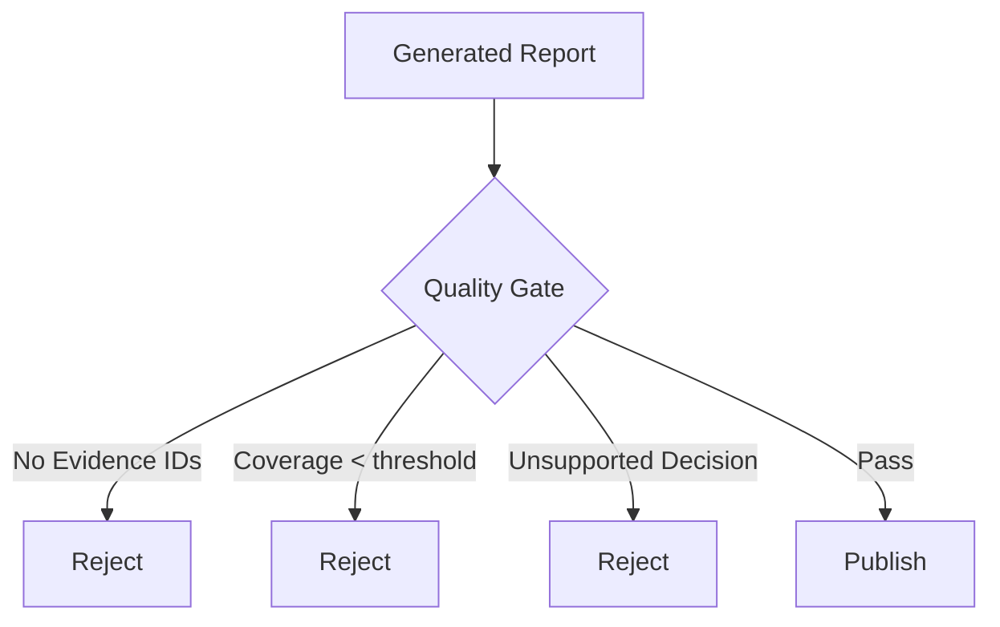
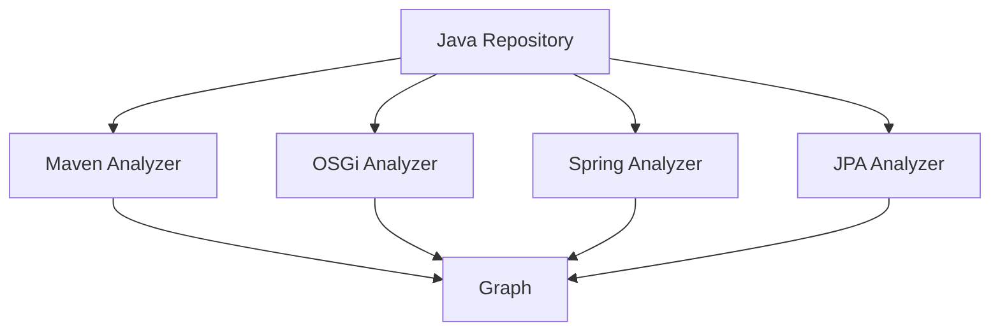
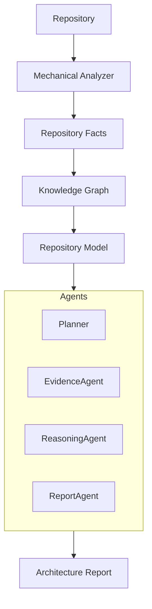

我重新整理一下。结合你现在 `repo-research-v2` 的问题，我会调整之前建议的重点：

**不要把 Tree-sitter / Graphology 当作“增加一个工具”，而应该把它们作为 Repository Research Pipeline 的基础设施层。**

核心目标：

> 把 repo research 从 “LLM 阅读代码并总结” 升级为 “机器建立事实图谱，LLM 在事实约束下推理架构”。

---

# 一、当前问题重新定位

现在 pipeline：



主要问题：

## 1. LLM 同时承担 Fact Extraction + Reasoning

例如：

代码：

```
feature.xml
plugin.xml
MANIFEST.MF
pom.xml
```

LLM 看到：

```
feature
plugin
dependency
```

直接推理：

```
Eclipse Feature-Based Product Assembly
```

中间缺少：

```
事实层
```

所以容易出现：

* 架构小说
* 过度抽象
* 设计意图幻觉

---

# 二、目标架构

建议演进为：



---

# 三、新增 Mechanical Analysis Layer

这是最大收益点。

现在 Stage 1：

```
Scan repository
```

建议拆成：



这一层：

## 不允许 LLM 参与解释

只产生事实。

例如：

---

## 原来

evidence：

```json
{
 "finding":
 "SessionManager orchestrates TurnEngine"
}
```

问题：

这是结论。

---

## 新设计

Fact：

```json
{
 "entity":"SessionManager",
 "type":"class",
 "relations":[
   {
     "type":"CALLS",
     "target":"TurnEngine.run"
   }
 ]
}
```

然后 LLM 才推理：

```
SessionManager likely acts as orchestrator
```

---

# 四、Tree-sitter 的定位

## 不要让 Tree-sitter 直接生成报告

它的职责：

> 代码结构事实提取。

输出：



---

## 第一阶段支持语言

优先：

| 语言         | 收益    |
| ---------- | ----- |
| Java       | ★★★★★ |
| Python     | ★★★★★ |
| TypeScript | ★★★★☆ |
| Go         | ★★★★☆ |
| Rust       | ★★★☆☆ |

原因：

你的目标领域：

* 金融系统
* 企业项目
* agent infra

大量：

* Java backend
* Python data
* SQL

---

# 五、Graphology 的定位

Graphology 不负责解析。

它负责：

> Repository Knowledge Graph。

替换目前：

```
repository-model.json
```

---

现在：

```json
{
 "components":[
   "TurnEngine",
   "SessionManager"
 ]
}
```

信息太弱。

改：

Graph:



---

# 六、Repository Model 应该变成 Graph View

不是：

```
repository-model.json
```

作为事实来源。

应该：



---

# 七、针对你当前 skill 的具体修改

## Stage 0

保持。

加载：

```
context
repository-model
questions
```

---

## Stage 1 修改

现在：

```
Scan Repository
```

改：



产生：

```
.work/
 ├── facts/
 │    ├── symbols.json
 │    ├── calls.json
 │    ├── imports.json
 │    ├── modules.json
 │    └── tests.json
 │
 ├── repository-graph.json
```

---

# 八、Evidence Log 需要升级

现在：

```json
{
 "key_findings":[]
}
```

问题：

容易塞解释。

建议：

```json
{
 "file":"manager.py",

 "observations":[
   "Class SessionManager contains method deliver_to_session",
   "Method invokes build_engine",
   "build_engine returns TurnEngine"
 ],

 "derived_insights":[
   "SessionManager may own engine lifecycle"
 ],

 "evidence_strength":"A"
}
```

分离：

```
事实
 |
 v
解释
```

---

# 九、增加 Quality Gate

现在 Quality Gate 太软。

增加：



规则：

## 所有：

* Architecture Claim
* Design Decision
* Risk
* Pattern

必须：

```
evidence_ids >= 1
```

---

# 十、针对 Java / 金融项目额外增加 Analyzer

Tree-sitter 不够。

增加：



---

## 金融领域特别有价值：

自动发现：

### Spring

```
Controller
   |
Service
   |
Repository
   |
Database
```

### SQL

```
Table
 |
Query
 |
DAO
 |
Service
```

### Batch

```
Scheduler
 |
Job
 |
Transaction
```

这些都是架构报告核心。

---

# 十一、实施路线（建议）

## Phase 0（立即）

不用改架构。

增加：

* Evidence Gate
* Claim → Evidence ID

收益：

★★★★★

---

## Phase 1（1-2 周）

加入：

* Tree-sitter
* Symbol Graph
* Call Graph

收益：

★★★★★

解决：

* runtime 0%
* architecture 空洞
* hallucination

---

## Phase 2

加入：

* Graphology
* Repository Knowledge Graph

收益：

★★★★☆

解决：

* blast radius
* architecture model
* cross-module reasoning

---

## Phase 3

加入生态 analyzer：

```
Java:
 Maven
 OSGi
 Spring

Python:
 FastAPI
 SQLAlchemy

SQL:
 schema
 lineage
```

收益：

★★★★★（金融项目）

---

# 最终架构总结

未来版本应该是：



一句话总结：

> **Tree-sitter 负责让系统“知道代码是什么”，Graphology 负责让系统“知道代码之间如何关联”，LLM 负责回答“为什么这样设计”。**

你当前 skill 最大的问题，就是让 LLM 同时负责这三件事。把这三层拆开，报告质量会有一个数量级提升。
