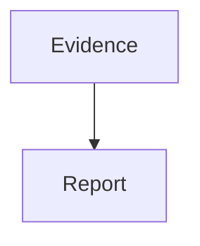
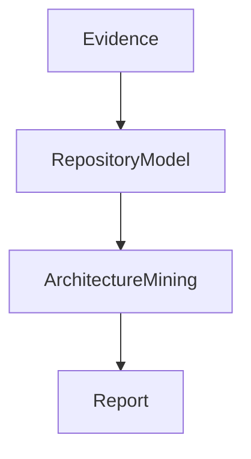
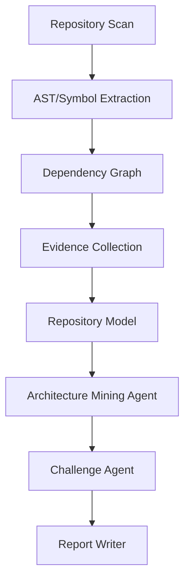

需要调整，而且我认为**不是简单调整 prompt wording，而是需要调整 agent skill 的“推理约束”**。

从你现在 DBeaver 报告的表现看，GLM5.2 的问题不是能力不足，而是它在当前 skill 约束下采取了一个合理策略：

> “完成模板比深入推理风险低。”

也就是说，skill 给它的任务形态更像：

```
扫描结果
  ↓
填 Architecture Report Template
```

而不是：

```
证据
 ↓
形成架构模型
 ↓
提出假设
 ↓
挑战假设
 ↓
生成架构解释
```

GLM 这种模型尤其容易遵循显式结构。如果中间没有强制步骤，它会 shortcut。

---

## 1. 当前 prompt 最大的问题

你现在的 skill 里面类似：

> Generate architecture explanation from model + evidence log

这个描述太弱。

LLM 会理解成：

> 根据已有信息写一篇解释。

但是你真正想要：

> 从代码证据中推导架构机制。

两个任务完全不同。

应该改成：

---

## 增加 Architecture Interpretation Agent

现在：



改：



新增一个 agent。

---

# 2. 增加“禁止机械总结”规则

GLM5.2 很吃这种约束。

加入：

```text
Architecture reports must not summarize directories or list modules.

A module/file/class is not an architectural concept unless:
1. it has architectural responsibility,
2. it has dependency influence,
3. it participates in a runtime flow,
4. or it represents a design boundary.

For every major component explain:
- why it exists
- what problem it solves
- what constraint created it
- what alternatives were rejected
```

这会直接改善：

现在：

> org.jkiss.dbeaver.model provides metadata

变：

> The model module acts as the stability boundary between vendor-specific database implementations and product-level features. It centralizes metadata semantics because 100+ extensions require a database-independent contract.

---

# 3. 强制生成“架构张力”

目前你的报告缺少这个。

加入：

```text
Before writing the report, identify at least 3 architectural tensions.

Examples:
- abstraction vs performance
- extensibility vs complexity
- modularity vs shared state
- flexibility vs consistency
- automation vs safety

Do not write a decision section before identifying the tension.
```

为什么重要？

因为真正架构来自 trade-off。

没有 tension：

就只能：

```
用了OSGi
用了插件
用了模块
```

这就是现在的问题。

---

# 4. 修改 Key Decision 生成规则

现在：

```
Decision:
Use DBUtils

Evidence:
DBUtils.java
```

太低级。

改：

```text
A Key Decision must satisfy:

Decision != implementation detail.

Bad:
"Created DBUtils class"

Good:
"Centralized database semantic operations behind the model layer to prevent vendor-specific behavior leaking into UI and feature modules."

Evidence should prove:
- constraint
- alternative
- consequence
```

---

# 5. 增加 Architectural Gravity 分析

这个非常适合 GLM。

加入：

```text
Identify architectural gravity centers.

A gravity center is a component that:
- has high dependency centrality,
- defines contracts,
- receives cross-cutting usage,
- influences many modules.

Explain:
- why the component became central
- whether this centrality is intentional or accidental
- risks created by it
```

这样 DBUtils 不会简单变：

> God class

而会：

可能：

> DBUtils represents accumulated database semantic gravity. It reduces duplicated driver logic but creates a change amplification hotspot.

---

# 6. 强制区分 Mechanism 和 Intent

这是目前最大问题。

报告：

> Adopt OSGi modularity

其实：

OSGi = mechanism

Intent:

应该：

> Allow database vendors and product editions to evolve independently without rebuilding the entire IDE.

加入：

```text
For every architecture mechanism, separate:

Mechanism:
What technology/code implements it.

Intent:
What architectural problem it solves.

Do not report mechanisms alone.
```

---

# 7. 对 GLM5.2 特别建议：减少开放式生成

GLM5.2 比 GPT 类模型更容易：

* 接受已有假设
* 填补缺失信息
* 生成漂亮但弱证据文本

所以增加：

```text
Confidence discipline:

Every architectural claim must include:
- evidence
- inference level
- alternative explanation

If evidence only shows implementation,
do not claim design intent.
```

例如：

错误：

> DBUtils exists to prevent fragmentation

正确：

> DBUtils centralizes 156 database operations. This is consistent with a shared semantic access pattern, but the repository does not directly prove whether the choice was intentional or evolved historically.

---

# 8. 你的 report schema 也需要改

目前：

```
Executive Summary
Runtime
Architecture
Key Decisions
Risks
```

太像咨询报告。

建议增加：

```yaml
architecture_insights:

  mental_model:

  architectural_centers:

  boundaries:

  tensions:

  evolution:

  invariant:

  accidental_complexity:
```

尤其：

## mental_model

这是你缺失最大的。

例如：

DBeaver:

```text
Maintainer mental model:

DBeaver is not organized around databases.
It is organized around a database-independent semantic model,
where database-specific behavior is injected through extensions.
```

这才是架构研究。

---

# 9. Agent workflow 建议

我会改成：



重点：

Report Writer **不能直接接 Evidence**。

必须接：

```
Architecture Mining output
```

---

# 10. 如果只改 prompt，最低成本版本

你可以先加这一段到 skill：

```
You are not writing a code inventory report.

Your task is architecture archaeology.

Do not describe what files exist.
Infer why the system is shaped this way.

Before writing:
1. Find architectural gravity centers.
2. Identify subsystem boundaries.
3. Identify at least three architectural tensions.
4. Separate mechanism from intent.
5. Distinguish evidence from inference.

A high-quality answer should explain:
- maintainer mental model
- runtime ownership
- extension mechanism
- architectural invariants
- trade-offs
- failure boundaries

Never promote a class/file/module into a design decision without explaining the architectural problem it solves.
```

---

我的判断：

**GLM5.2 不需要换。**

你的 OpenWorker 报告已经证明：

> 当 evidence/model 足够丰富时，它能输出很好的架构洞察。

现在 DBeaver 失败说明：

* 中间模型不足
* architecture interpretation 缺失
* prompt 没强制“考古式推理”

优先级：

1. ✅ 加 Architecture Mining Agent
2. ✅ 加 gravity/tension/mental-model 输出
3. ✅ 修改 decision 规则
4. ✅ Tree-sitter + graphology 提供输入

这几个改完，GLM5.2 的输出质量应该会有一个明显跃迁。
