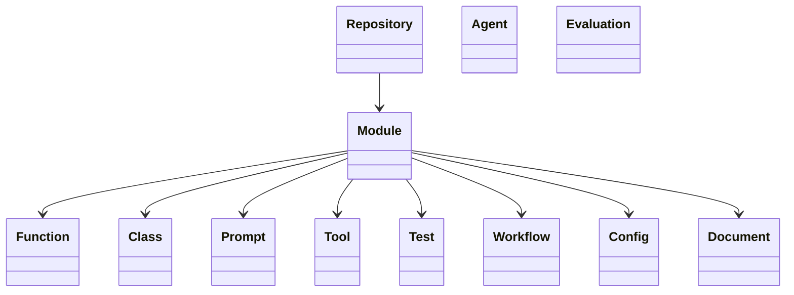
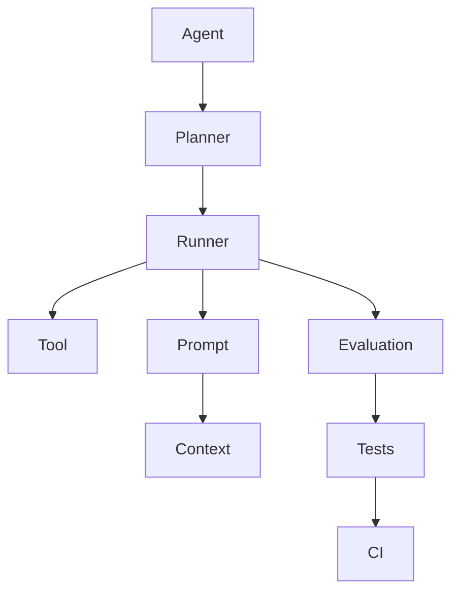

建议**借鉴 Palantir Ontology 的思想，而不是照搬 Ontology 本身**。

很多人看到 Ontology，就开始设计：

* RDF
* OWL
* SPARQL
* 三元组
* 推理引擎

对于 Repository Research 来说，我认为**完全没必要**，这是典型的 over engineering。

Palantir 真正值得学习的不是 RDF，而是它的几个核心思想：

1. Everything is an Entity（万物皆对象）
2. Everything has Relationships（对象之间有关系）
3. Evidence is linked to Objects（证据关联对象）
4. Actions operate on Objects（分析围绕对象展开）
5. Questions query the graph（问题驱动查询）

这几个思想，完全可以应用到 Repository Research。

---

# 我建议把 Repository 看成一个 Ontology

不是：

```
Repository
    ↓
Files
```

而是：



这样整个分析过程都是围绕 Object。

而不是 File。

---

# 第一层：Object Discovery（★★★★★）

Skill 第一件事不是：

```
Read README
```

而是：

```
Discover Objects
```

例如：

自动建立：

| Object     | 来源              |
| ---------- | --------------- |
| Agent      | class Agent     |
| Planner    | planner.ts      |
| Runner     | runner.ts       |
| Prompt     | prompt.md       |
| Tool       | tool.ts         |
| Test       | planner.test.ts |
| Evaluation | eval/           |
| Workflow   | github actions  |
| Config     | yaml            |

整个 Repo 先变成：

```
Objects
```

---

# 第二层：Relationship Discovery

Palantir 最重要的是：

Object

不是重点。

Relationship

才是重点。

例如：


Repository Research 应该自动发现：

### Structural

```
imports

extends

implements

calls

creates
```

### AI

```
uses Prompt

uses Tool

uses Memory

uses Evaluation

uses Context
```

### Engineering

```
tested by

configured by

documented by

benchmarked by
```

以后：

LLM：

不是：

grep。

而是：

查询：

Relationship。

---

# 第三层：Evidence Link（★★★★★）

Palantir：

最厉害的是：

Object

永远：

可以追溯。

例如：

```
Planner

↓

Evidence

↓

planner.ts

↓

planner.test.ts

↓

README
```

你的 Skill：

建议：

所有结论：

必须：

绑定：

Evidence。

例如：

```
Object

Planner

Evidence

planner.ts

planner.test.ts

README

Confidence

High
```

以后：

Report：

自动：

生成。

---

# 第四层：Ontology View

例如：

Prompt：

不要：

只是：

Prompt。

应该：

是：

Object。

例如：

```
Prompt

Properties

name

purpose

tokens

variables

used by

tests

```

Tool：

也是：

Object。

```
Tool

Properties

schema

permission

timeout

retry

```

Test：

```
Test

covers

Planner

Runner

Prompt
```

---

# 第五层：Question Driven Research（★★★★★）

这是 Palantir 我最喜欢的一点。

不是：

```
Read everything
```

而是：

```
Question

↓

Object

↓

Relationship

↓

Evidence

↓

Answer
```

例如：

Question：

```
How does Agent avoid infinite loops?
```

自动：

找到：

```
Loop

↓

Runner

↓

Retry

↓

Config

↓

Tests
```

然后：

回答。

不是：

全文搜索。

---

# 第六层：Object Types

我建议 Skill：

固定：

Object 类型。

例如：

| Type       | Examples      |
| ---------- | ------------- |
| Repository | Root          |
| Module     | planner       |
| Function   | execute       |
| Class      | Runner        |
| Prompt     | SYSTEM        |
| Tool       | shell         |
| Agent      | CodingAgent   |
| Workflow   | GitHub Action |
| Evaluation | Replay        |
| Test       | planner.test  |
| Config     | YAML          |
| Dataset    | benchmark     |

以后：

Analyzer：

全部：

输出：

Object。

---

# 第七层：Relationship Types

建议：

固定：

Relationship。

例如：

```
imports

calls

extends

implements

creates

owns

uses

references

configuredBy

testedBy

evaluatedBy

documentedBy

benchmarkedBy
```

以后：

Graph：

统一。

---

# 第八层：Object Properties

例如：

Prompt：

```
Prompt

name

purpose

tokens

variables

temperature

usedBy
```

Tool：

```
Tool

inputSchema

outputSchema

approval

timeout
```

Agent：

```
Agent

planner

memory

tools

guardrails

evaluation
```

---

# 第九层：Research Output

现在：

Report：

写：

```
Planner
```

建议：

写：

```
Object

Planner

Relationships

calls Runner

uses Prompt

tested by planner.test.ts

configured by planner.yaml

Evidence

...

Insights

...
```

非常像：

Palantir。

---

# 第十层：Knowledge Graph

最后：

整个 Repo：

其实：

就是：

Graph。

例如：



以后：

LLM：

所有分析：

都：

围绕：

Graph。

---

# 我会对 Skill 增加一节：Ontology-driven Research

例如：

```text
## Ontology-driven Research

Treat the repository as a graph of engineering objects rather than a collection of files.

Every significant concept should be represented as an object.

Examples:

- Agent
- Planner
- Runner
- Tool
- Prompt
- Memory
- Context
- Evaluation
- Test
- Workflow
- Config

For every object:

- Discover its properties.
- Discover its relationships.
- Link supporting evidence.
- Record confidence.

Prefer reasoning over objects and relationships instead of filenames and directories.

Every conclusion should be traceable through:

Question
→ Object
→ Relationship
→ Evidence
→ Conclusion
```

---

## 我还建议借鉴 Palantir 的另一点——Operational Ontology

Palantir 的 Ontology 不只是**描述世界（Objects）**，还支持**操作世界（Actions）**。

对应到你的 Skill，可以定义一组标准的 Research Actions，例如：

* **Discover**：发现对象（Prompt、Tool、Agent、Test）。
* **Classify**：给对象分类（Core、Infrastructure、Evaluation 等）。
* **Link**：建立对象关系（uses、testedBy、configuredBy）。
* **Validate**：用测试、文档、CI 等交叉验证关系。
* **Compare**：与其他仓库的同类对象进行对比。
* **Summarize**：围绕对象生成研究结论。

这样，整个分析过程就从“遍历文件”变成了“围绕对象执行一系列标准动作”。这既保留了 Palantir Ontology 的核心思想，又不会引入 RDF/OWL 等复杂基础设施，非常适合作为 Repository Research Skill 的长期演进方向。
