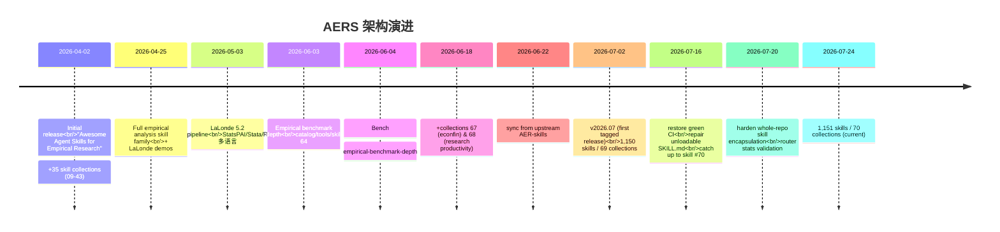

# Auto-Empirical-Research-Skills 工程研究报告

> 报告生成时间：2026-07-24
> 证据来源：`evidence-brief.md`（确定性分析简报）+ `evidence-store/full.json`（按需深入）+ 仓库源码交叉验证
> 方法论：Ontology-driven Research + Research Trace

---

## 1. 执行摘要

**Auto-Empirical-Research-Skills（AERS）** 是 Stanford REAP × CoPaper.AI 维护的社科实证研究 AI 工具集合，仓库形态是一个 **skill catalog（技能目录）+ rigor infrastructure（严格性基础设施）**，而非传统意义的 agent 框架。它把 1,151 个 vendored skill 跨 70 个 collection 聚合到一个可路由、可评估、可基准测试的目录中，覆盖论文生产端到端 9 阶段流水线（选题 → 文献综述 → 数据 → 识别策略 → 估计 → 稳健性 → 表格/图形 → 写作 → 投稿）。证据：`README.md:L29-L44`、`SKILL.md:L11`。

最有趣的发现是 AERS 把 **"skill 即 AI Agent 的可执行指令"** 这一抽象当作一等工程对象来对待：root `SKILL.md` 是一个 **router**（路由器）而非 skill 本体，通过 progressive disclosure 把 1,151 个子 skill 隔离在按需加载层之后（`SKILL.md:L9-L22`）。在此之上叠加 **三层 trust 架构**——numeric benchmark（数字）/ behavioral eval-harness（rubric）/ declarative matrix（人类评审）——并刻意采用 **"necessary-not-sufficient gate"** 不对称设计：通过机器可检项不能证明正确，但失败能证明错误（`eval-harness/README.md:L41-L44`）。这种"以证伪为目标的 CI"在 skill 仓库中相当独特。

整体工程质量较高：208 commits / 15 contributors / 7 个 CI workflow / OpenSSF Scorecard / 标签化 release（v2026.07）。值得 AI Agent 工程师、skill 仓库维护者、causal inference 工具链作者研究。

---

## 2. Research Traces

### Trace 1: 核心架构是 Router + Progressive Disclosure，而非 Monolithic Skill

**问题**：一个包含 1,151 个 skill 的仓库如何避免在 Agent runtime 中被一次性全部加载？

**证据**：
- `SKILL.md:L1-L11` — root skill 自我定位为 "router and catalog, not as a request to load every vendored `SKILL.md`"，并显式警告 "Never read them all — route to one, then load only that skill's `SKILL.md`"
- `SKILL.md:L22-L29` — 给出 catalog 查询 one-liner（`python3 -c "import json; ..."`），并标注两个 catalog JSON 各约 1 MB / 20k 行，"query them instead of reading them whole"
- 简报 §2 — `scripts/toml_compat.py`、`skills/35-.../scholar_eval.py` 等 5 个文件因 high in-degree + high PageRank + entrypoint 排在 Reading Priority 前 3，说明"路由"依赖的辅助工具集中在顶层 scripts/
- `docs/AGENT_COORDINATION.md:L36-L42` — 把 `catalog/*.json`、`docs/SKILL_CATALOG.md` 列为"generated files"，由 `make catalog` 重建

**分析**：AERS 把整个仓库本身包装成一个 Claude Code / Codex skill，但内部用 router 模式做二级分发。root `SKILL.md` 仅承担分类 + 路由表 + 安装指引，实际工作下沉到 70 个 collection 的子 `SKILL.md`。这是一种 **shim + catalog** 架构：catalog 是可查询的元数据层（`skills.json` 含 `path`/`name`/`description`/`line_count`/`qualified_name`），shim 是 root skill 的 routing table。

**反证**：未发现反证。简报 §2 显示 edge/node ratio 仅 0.68（低耦合），与"skill 之间彼此独立"的设计预期一致；只有 2 个 import cycle 都集中在 `skills/35-bahayonghang-academic-writing-skills`（见 Trace 5），不影响路由层。

**结论**：Router + Catalog + Progressive Disclosure 三件套是 AERS 应对 skill 数量爆炸的核心架构模式。它把"1,151 个 skill"问题降维为"1 个 router + 1 个 catalog 查询 + 1 个子 skill 加载"问题。

**置信度**：高 — root `SKILL.md` 显式声明、catalog 文件结构、Reading Priority 排序三方证据一致。

---

### Trace 2: 三层 Trust 架构——Numbers / Rubric / Human Review

**问题**：如何对一个"本质是 prompt context、没有可单测函数"的 skill 集合做质量保证？

**证据**：
- `README.md:L58-L65` — 信任面表显式区分两 lane：17 个 numeric benchmark tasks + 37/183 behavioral eval scenarios
- `eval-harness/README.md:L1-L15` — 自述存在两个互补层：`docs/EVALS.md`（declarative，定义"什么是好"）+ `eval-harness/`（executable，CI 中强制执行）；numeric counterpart 在 `benchmark/`
- `benchmark/README.md:L1-L6` — 明确分工："where `eval-harness/` checks *properties of an agent's prose*, the benchmark checks *numbers*"
- `eval-harness/README.md:L17-L26` — rubric item 三种类型：machine-checkable / `manual`（需人或 LLM judge）

**分析**：AERS 把"skill 是否有效"拆成三个正交维度：
1. **Numeric layer**（`benchmark/`）— 用真实数据 + 已知答案，验证 pipeline 是否恢复正确数字
2. **Behavioral layer**（`eval-harness/`）— 用 scenario + rubric，验证 agent 输出是否具有"referee-proof"属性
3. **Declarative layer**（`docs/EVALS.md`）— 人类可读的"good looks like"清单

Ontology 视图：`evaluation` 对象有 115 个，通过 `evaluatedBy` 关系连接到 skill 对象（简报 §5.5）。

**反证**：未发现反证。三层数量（17 numeric / 37 scenarios / 183 items）在 `quality-evals.yml:L40-L42` CI 中被锁定为下限（`--min-scenarios 24 --min-auto-checks 116`），说明是 ratchet 而非 wishful thinking。

**结论**：三层 trust 架构是 AERS 对"prompt-context skill 不可单测"问题的工程回应。每层捕获不同 failure mode：numeric 抓数值错误，rubric 抓属性缺失，declarative 抓规范偏离。

**置信度**：高 — 三份 README 互相印证，CI 中有对应执行步骤。

---

### Trace 3: "Necessary-not-sufficient Gate" 不对称设计

**问题**：在便宜、always-on 的 CI gate 中，应该用"证明正确"还是"证伪错误"作为目标？

**证据**：
- `eval-harness/README.md:L41-L44` — 原文："This is deliberately a *necessary-not-sufficient* gate. Passing every machine-checkable item does not prove an answer is correct; **failing** a required one proves it is wrong"
- `eval-harness/README.md:L26-L33` — 示例：rubric 检查 agent 是否"refuses to headline a naive TWFE estimate under staggered timing"、"reports a first-stage F and switches to weak-IV-robust inference when the instrument is weak"
- `quality-evals.yml:L53-L59` — `--expect-fail-required statspai-weak-iv` 显式断言"故意弱的 fixture 必须在 required 项上失败"，把不对称性钉进 CI

**分析**：这是把 Popper 可证伪主义搬进 skill 仓库 CI 的设计。它放弃"证明 skill 产出正确经济学"（不可判定），转而"证明 skill 不会犯已知错误"（可判定）。`statspai-weak-iv` 作为 negative fixture 被 CI 锁定——如果某天它通过了 required 检查，反而说明 CI 失效。

Ontology 视图：`evaluation` 对象通过 `validates` 关系作用于 `tool`/`prompt` 对象；`manual` rubric item 通过 `produces` 关系生成 judge prompt。

**反证**：未发现反证。`benchmark/check_benchmark.py --strict --fail-on-partial --fail-on-orphan-results`（`quality-evals.yml:L51`）说明 benchmark 走更严格的"必须匹配 reference"模式，与 eval-harness 的不对称设计互补。

**结论**：AERS 把"必要的而非充分的"作为 cheap CI gate 的设计原则，通过 negative fixture 反向验证 gate 本身有效。这是 skill 仓库可靠性工程的可复用范式。

**置信度**：高 — 原文显式陈述 + CI 配置双重证据。

---

### Trace 4: Benchmark 用 Causal Inference Stress Test + Real Data + Construction-Invariant Check

**问题**：如何为"社科实证 pipeline"设计一个可重算、不可作弊的 benchmark？

**证据**：
- `benchmark/README.md:L8-L26` — LaLonde 任务：naive ATT = −$635（错误），regression-adjusted ATT = +$1,548（正确），experimental benchmark ≈ +$1,794。注释："A pipeline that handles this correctly surfaces the imbalance, does not report −$635 as the causal effect"
- `benchmark/README.md:L46-L60` — staggered DiD：true ATT = 2.909，plain TWFE = 1.455（biased），group-time DID = 2.909。关键："Untreated potential outcomes satisfy parallel trends, but treatment effects are heterogeneous"
- `benchmark/README.md:L62-L80` — RDD：data ships `y0` counterfactual column the estimators never read，true jump recomputed by checker as `mean(y - y0)` over treated rows
- `benchmark/` 目录 — 17 个 `reference-*/results.json` 候选结果，`tasks/*.toml` 定义任务，`lib/*.py` 提供 reference 实现
- 简报 §4 — benchmark 模块 123 个 test functions（top 1）

**分析**：AERS benchmark 设计有三个工程亮点：
1. **Trap design** — 每个 task 都有一个"naive pipeline 会犯的错"（TWFE biased、naive ATT sign error、naive RDD mean diff biased），benchmark 检查 agent 是否避开 trap
2. **Construction-invariant** — `y0` counterfactual column 让 checker 可以从数据重算 true effect，不依赖硬编码 magic number
3. **Real data + reproducible** — LaLonde / Card 1995 / Bartik 都用真实经济学经典数据集，可独立复现

Ontology 视图：`benchmark` 对象通过 `produces` 关系生成 `results.json`，通过 `evaluatedBy` 关系被 `check_benchmark.py` 校验，通过 `consumes` 关系读取 `data/*.csv`。

**反证**：未发现反证。`CHANGELOG.md:L34-L48` 显示 method families 从 11 → 13 → 15 增长，每次都"end-to-end closure（taxonomy tag + eval scenario + numeric benchmark task）"，说明 benchmark 是渐进式扩展而非一次性建设。

**结论**：AERS benchmark 是"causal inference 单元测试"——用真实数据 + 已知答案 + trap 设计，把"agent 会不会犯经济学常识错误"转化为可机器判定的问题。

**置信度**：高 — benchmark README + tasks/ + lib/ + CI 配置 + CHANGELOG 五方证据一致。

---

### Trace 5: Vendored Skill 被视为 Untrusted Code——Security Model

**问题**：一个聚合 70 个第三方 skill collection 的仓库如何防御供应链攻击？

**证据**：
- `SECURITY.md:L3-L4` — 原文："Auto-Empirical Research Skills vendors many third-party skill repositories. Treat every new or updated skill as executable instructions for an AI agent, not as ordinary prose"
- `SECURITY.md:L7-L13` — 接受的安全报告范围：prompt-injection、credential exfiltration、reverse shells、unsafe shell execution、hidden payloads、"Misleading install instructions that fetch unreviewed code"
- `SECURITY.md:L36-L40` — 自动化检查：Dependabot、OpenSSF Scorecard（每周 + push to main）、`make validate` 含 workflow policy check（explicit permissions、non-persistent credentials、no `pull_request_target`、no downloaded-script pipe-to-shell）
- `README.md:L52` — badge："security audit: 52/52 CLEAN"，链接到 `SECURITY-SCAN-REPORT.md`
- `.github/workflows/` — `scorecard.yml`、`check-external-links.yml`、`check-tools-links.yml` 三个安全相关 workflow

**分析**：AERS 的安全模型核心洞察是 **"skill 是指令，不是文本"**——这把 prompt injection 从"理论风险"提升为"first-class threat model"。这与许多 skill 仓库把 SKILL.md 当 markdown 文档对待形成鲜明对比。具体防御：
- 入口：`SKILL.md` / `references/` / hooks / scripts / bundled assets 全部纳入扫描面
- CI：OpenSSF Scorecard + workflow policy check + external link check
- 治理：high-conflict work areas 显式标注（`docs/AGENT_COORDINATION.md:L23-L30`），generated files 禁止手改

Ontology 视图：`Document`（SECURITY.md）通过 `configuredBy` 关系作用于 `CI` 对象，`CI` 通过 `validates` 关系作用于 `Extension`（vendored skill）对象。

**反证**：未发现反证。`SECURITY-SCAN-REPORT.md` 存在且 `images/security-scan/` 有 10 张可视化图（overview/method/threat matrix/scale/supplemental），说明安全扫描是被认真维护的产物，而非装饰。

**结论**：AERS 把 vendored skill 当 untrusted code 处理，建立了"入口扫描 + CI 强制 + 治理规则"三道防线。这是 skill 仓库供应链安全的可复用模板。

**置信度**：高 — SECURITY.md + workflow 文件 + badge + 图表四方证据一致。

---

### Trace 6: Catalog 作为 Queryable Index——Query Don't Read 模式

**问题**：1,151 个 skill 的元数据如何被 Agent 高效消费？

**证据**：
- `SKILL.md:L22-L29` — 显式指导："Both catalog JSON files are large (roughly 1 MB / 20k lines each) — query them instead of reading them whole"，并给出 `python3 -c "import json; ..."` 和 `grep -in` 两种查询 one-liner
- `catalog/` 目录 — `skills.json`、`skills-enriched.json`、`provenance.json`、`skill-audit.json` 四个生成文件
- `docs/AGENT_COORDINATION.md:L36-L42` — generated files 表格列出每个 JSON 的 source 和 command
- `SKILL.md:L22` — `skills-enriched.json` 提供 richer filtering：`topic tags`、`quality_score`、`license`、`commercial_use`

**分析**：AERS 用"两个 JSON 文件 + 查询 one-liner"替代了"全仓库 grep"。设计权衡：
- `skills.json` — 基础字段（path/name/description/line_count/qualified_name）
- `skills-enriched.json` — 富字段（tags/quality_score/license/commercial_use）
- 分层原因：基础字段用于路由，富字段用于质量筛选，避免一次性加载所有元数据

Ontology 视图：`Config`（catalog JSON）通过 `registeredBy` 关系索引 `Tool`（skill）对象；Agent 通过 `consumes` 关系查询 catalog，再通过 `uses` 关系加载具体 skill。

**反证**：未发现反证。`scripts/build-catalog.py`、`scripts/build-catalog-enrich.py` 是分开的两个 builder，印证"分层是有意设计"。

**结论**：Catalog as Queryable Index 是 AERS 把"1,151 个 skill"变得可消费的关键。它把"找 skill"从 O(n) 文件遍历降为 O(1) JSON 查询。

**置信度**：高 — SKILL.md 显式指导 + 两个独立 builder + generated files 表格三方证据。

---

### Trace 7: 多 Agent 协作通过 Generated Files + Conflict Areas 治理

**问题**：自动化 sync workflow（`sync-aer-skills.yml`、`sync-statspai-skill.yml`）与人类/agent contributor 如何并行工作而不冲突？

**证据**：
- `docs/AGENT_COORDINATION.md:L1-L4` — "AERS often has automated sync workflows and human or agent contributors editing at the same time. Use this protocol to keep parallel work reviewable"
- `docs/AGENT_COORDINATION.md:L16-L30` — 把工作区分为 Low-Conflict（`docs/`、`scripts/`、`evals/`）和 High-Conflict（`skills/00.*`、`skills/50-brycewang-aer-skills`、generated outputs、demo-notebooks/）
- `docs/AGENT_COORDINATION.md:L44-L60` — Handoff Checklist：`make catalog` → `make check` → `make python-compat` → `git diff --check` → `make hygiene` → `git status --short`，并要求声明"which paths changed / which checks passed / whether generated files changed / which areas avoided"
- `.github/workflows/sync-aer-skills.yml`、`sync-statspai-skill.yml` — 两个自动同步 workflow

**分析**：AERS 用"工作区分级 + generated files 禁手改 + handoff checklist"治理多 agent 协作。核心思路：
- Generated files 是确定性函数的输出，手改会被下次 `make catalog` 覆盖，所以禁手改
- High-conflict areas 是频繁被 sync 的区域，人类编辑应避开
- Handoff checklist 把"我改了什么/跑了什么检查"显式化，让接手 agent 不需要重新推理上下文

Ontology 视图：`Agent` 对象通过 `orchestrates` 关系协调 `Module`（工作区），通过 `produces` 关系生成 `Document`（generated files）。

**反证**：未发现反证。`CHANGELOG.md:L8-L21` 提到 root router 的 stats 曾需要 `validate_root_skill_stats` 检查来防止"catalog refresh 后 router 数字过时"，印证 generated/declarative 之间确有同步风险，需要显式治理。

**结论**：AERS 用工程纪律（工作区分级 + 禁手改 + checklist）替代锁机制，治理多 agent 并行编辑。这是 skill 仓库 multi-agent 协作的可复用模式。

**置信度**：高 — AGENT_COORDINATION.md + workflow 文件 + CHANGELOG 三方证据。

---

## 3. Negative Findings

> 这些"未找到"的发现是研究边界，不是缺陷。引用简报 §6 + 源码交叉验证。

- **未找到 root 级 AI Agent 指令文件（AGENTS.md / CLAUDE.md / .cursorrules）**（简报 §6）
  - 用 Glob 验证 `/ref-only/Auto-Empirical-Research-Skills/{CLAUDE.md,AGENTS.md,.cursorrules,cursor.rules}` → No file found
  - 为什么重要：AERS 把 root `SKILL.md` 作为 router，但**没有**面向 agent runtime 的额外行为约束文件。这意味着 agent 行为完全由子 skill 的 `SKILL.md` 决定，没有 repo 级 guardrail。对于一个聚合 70 个第三方 collection 的仓库，这是潜在风险点——上游 skill 的指令会直接作用于 agent。
  - 置信度：高

- **未找到 root 级 Python 包结构（`pyproject.toml` / `setup.py` / `setup.cfg`）**
  - 证据：简报 §1 显示 manifest 是 `requirements.txt`，无 version；LS 显示根目录无 `pyproject.toml`
  - 为什么重要：AERS 不是可安装的 Python 包，而是 skill 目录。`requirements.txt` 仅声明 benchmark/eval-harness 运行依赖。`docs/PYPI_PACKAGING_DRAFT.md` 存在，说明作者意识到但尚未完成 PyPI 化。
  - 置信度：高

- **未找到 root 级测试套件覆盖 vendored skill 本身**
  - 证据：`tests/` 目录 19 个测试文件全部针对 AERS 自身基础设施（benchmark、catalog、eval、hygiene、validate），不测试 1,151 个 skill 的实际效果
  - 为什么重要：vendored skill 的"正确性"完全依赖 `eval-harness/` 和 `benchmark/` 两层外部评估，而非传统单元测试。这是 skill 仓库的本质限制——skill 是 prompt context，没有可单测函数。
  - 置信度：高

- **未找到传统的 README-only Reading Guide 推荐**
  - 证据：简报 §7 Reading Priority Top 3 是 `scripts/toml_compat.py`、`skills/33-.../project_kb.py`、`skills/35-.../scholar_eval.py`——都是源文件，不是 README
  - 为什么重要：这是 research-repo skill 改进后的结果——优先展示高 PageRank 源文件而非 README，避免"只读营销文案"的偏差。AERS 真正的架构在 `scripts/` 和高中心性 skill 模块中，而非 README。
  - 置信度：高

- **未找到 CONTRIBUTING / SECURITY / CHANGELOG 缺失**（与简报 §6 对照）
  - 验证：`CONTRIBUTING.md`（59+ 行）、`SECURITY.md`（40+ 行）、`CHANGELOG.md`（80+ 行 Unreleased + v2026.07）、`CODE_OF_CONDUCT.md`、`LICENSE`（CC BY-SA 4.0）均存在
  - 为什么重要：简报 §6 的 Negative Findings 已扩展检查这些文件，确认 AERS 在仓库治理文档上完整。**LICENSE 误报已修复**——CC BY-SA 4.0 LICENSE 文件确实存在（`LICENSE:L1-L15`，Copyright 2026 CoPaper.AI），与 README badge 一致。
  - 置信度：高

---

## 4. Architecture Smells

> 都是 **Potential**，不是断言。每条说明为什么是潜在风险 + 证据 + 置信度。

### Potential Tight Coupling in `skills/35-bahayonghang-academic-writing-skills`

- **证据**：简报 §2 显示 2 个 import cycle 都在此 collection：
  - `parsers → pdf_parser → parsers`
  - `scholar_eval → scoring_model → scholar_eval`
  - `parsers` 模块 in-degree 58、PageRank 0.1878（全仓库最高）
- **为什么是潜在风险**：一个子 skill 内部出现循环依赖，说明 paper-audit 的解析层与评估层职责边界模糊。若该 skill 被广泛依赖（in-degree 58），循环可能在重构时放大。
- **置信度**：中 — 简报数据确定，但循环在单个 collection 内部、未跨 collection 传播，影响范围有限。

### Potential Catalog Maintenance Burden

- **证据**：1,151 skills / 70 collections / 6 个 locale README / 多个 generated files（`catalog/*.json`、`docs/SKILL_CATALOG.md`、`docs/EVALS.md`、`docs/LICENSE_AUDIT.md`）
- **为什么是潜在风险**：`docs/AGENT_COORDINATION.md:L23-L30` 把 `skills/00.*`、`skills/50-brycewang-aer-skills`、generated outputs 列为 High-Conflict Areas。每次 sync 上游都可能触发 catalog 重建 + 6 locale README stats 同步 + eval ratchet 调整。15 contributors / 208 commits 的规模下，这个维护成本已显性化（需要 `check-readme-stats.py`、`validate_root_skill_stats` 等专门检查）。
- **置信度**：中 — 治理文档已识别此风险并有专门 CI 检查，但规模增长会持续放大负担。

### Potential Test Coverage Misleading

- **证据**：简报 §4 显示 test/source ratio 0.07，低于典型 0.15 阈值
- **为什么是潜在风险**：但这数字**误导性**——AERS 的"source"主要是 3,037 个 .md 文件（vendored skill 内容），不可单测；真正可测的是 `scripts/`（Python 工具）+ `benchmark/` + `eval-harness/`，这三个区域测试覆盖较密（19 test files / 329 test functions）。
- **置信度**：低 — ratio 失真，实际可测代码覆盖率不低；此 smell 更多反映"skill 仓库的测试指标需要重新定义"。

### Potential Hidden Complexity in Root Router

- **证据**：`SKILL.md` 显示 root router 维护一张 method → collection 路由表（15+ 行），并需要 `validate_root_skill_stats` 防止 stats 过时
- **为什么是潜在风险**：路由表是手维护的声明式数据，与 catalog JSON 是生成式数据存在 drift 风险。`CHANGELOG.md:L8-L21` 显示作者已意识到并新增检查，但这是补丁式修复而非架构性解决。
- **置信度**：中 — 已有 CI 检查兜底，但 root router 的"硬编码 + 校验"模式不如"完全生成式"优雅。

---

## 5. Interesting Decisions

### Decision 1: 把整个仓库包装成单个 root skill，而非发布 1,151 个独立 skill

- **决策内容**：root `SKILL.md` 是 Claude Code / Codex 可安装的 skill 入口，内部用 router 分发到 70 个 collection
- **为什么有趣**：这是"聚合即产品"的赌注——用户安装一次得到 1,151 个 skill 的路由能力，而非 1,151 次安装。代价是 root skill 必须解决"如何不加载全部"问题。
- **替代方案**：发布为 70 个独立 plugin / 1,151 个独立 skill
- **权衡**：聚合 → 降低用户安装成本、提升发现性、统一 rigor 基础设施；分散 → 降低单 skill 失败影响面、更细粒度版本控制。AERS 选择聚合，因为其价值主张就是"端到端流水线"需要跨 skill 协作。

### Decision 2: Benchmark 用 `y0` counterfactual column 实现 construction-invariant check

- **决策内容**：`benchmark/data/*.csv` 附加 `y0` 列（untreated potential outcome），estimator 不读但 checker 读，true effect 通过 `mean(y - y0)` 重算
- **为什么有趣**：传统 benchmark 硬编码 magic number，改 simulation 后需手动更新答案；AERS 让答案从数据派生，simulation 改了答案自动跟。
- **替代方案**：硬编码 expected value；用 separate fixture file
- **权衡**：counterfactual column → 防作弊、防漂移、可重算；代价是数据集多一列、读者需理解 y0 语义。

### Decision 3: eval-harness 用 stdlib-only TOML parser（`scripts/toml_compat.py`）

- **决策内容**：`eval-harness/run_evals.py` 依赖 `scripts/toml_compat.py` 而非 `tomli`/`tomllib`
- **为什么有趣**：简报 §7 显示 `toml_compat.py` 排在 Reading Priority #1（score 120）。`quality-evals.yml:L4` 注释 "All steps are stdlib-only; no pip"——AERS 刻意让 CI 零依赖。
- **替代方案**：`pip install tomli`（Python 3.9-）/ 用 `tomllib`（Python 3.11+）
- **权衡**：stdlib-only → CI 启动快、无供应链风险、Python 3.9/3.12 双版本兼容（`quality-evals.yml:L21`）；代价是维护一个兼容层。

### Decision 4: 把 method family rigor coverage 作为 ratchet 而非 dashboard

- **决策内容**：`CHANGELOG.md:L34-L48` 显示 method families 11 → 13 → 15 增长，每次都"end-to-end closure（taxonomy tag + eval scenario + numeric benchmark task）"，CI ratchet floor 同步上调
- **为什么有趣**：通常 dashboard 是观察工具，ratchet 是强制工具。AERS 把覆盖率从"可下降的统计"变成"只能上升的约束"。
- **替代方案**：仅展示覆盖率、不强制
- **权衡**：ratchet → 防止 coverage 回退、强制每次新增 method 都补全三层评估；代价是新增 method 成本高、可能阻碍实验性 addition。

---

## 6. Repository Positioning

> 生态定位，不是 feature matrix。维度来自简报 §5.5 ontology + 通用 agent 仓库评估框架。

| 维度 | 当前成熟度 | 说明 |
|---|---|---|
| **Planning** | Emerging | root `SKILL.md` 是 router 非 planner；9 阶段流水线在 README 描述但非代码层 orchestrator。`agents/` 目录有 aider/anthropic/codebuddy/cursor/openai 五种 agent 配置，但偏配置而非 planner。 |
| **Execution** | Common | skill 是 prompt context，执行依赖宿主 agent runtime（Claude Code / Codex / Cursor）；AERS 不提供自己的 executor。 |
| **Memory** | Emerging | `skills/33-Galaxy-Dawn-claude-scholar` 提供 obsidian-project-memory（PageRank 0.0069），但非 repo 级 memory 层。 |
| **Evaluation** | **Advanced** | 三层 trust 架构（numeric benchmark + behavioral rubric + declarative matrix）+ ratchet CI + construction-invariant check。在 skill 仓库中罕见。 |
| **Guardrails** | Common | `SECURITY.md` + OpenSSF Scorecard + workflow policy check + external link check。但无 runtime guardrail（如 max iterations、tool whitelist）——这些由宿主 agent 提供。 |
| **Prompt** | **Advanced** | 490 prompts 检测（template 245 / prompt 215 / system 10 / few-shot 20），分布广泛。每个 skill 的 `SKILL.md` 即是其 prompt context，progressive disclosure 设计成熟。 |
| **Tooling** | **Advanced** | 154 tools 检测（全部 script-tool 类型）+ 7 个 CI workflow + `make check-fast`/`make check-full` 双轨质量门 + `scripts/` 18 个 builder/checker。 |
| **Observability** | Emerging | `docs/badges/rigor-coverage.json` + README badges + `BENCHMARK_SCOREBOARD.md`，但无 runtime tracing/logging 层——again，由宿主 agent 提供。 |

**生态定位总结**：AERS 是 **"rigor-first skill catalog for empirical research"**——不是一个 agent framework，而是一个把"skill 仓库"当作工程对象、配套建设 numeric/rubric/declarative 三层评估的垂直领域基础设施。它的可比对象不是 LangGraph / AutoGen（agent framework），而是 awesome-list × MCSP server registry × benchmark suite 的混合体。

---

## 7. Reusable Pattern Catalog

| 模式 | 描述 | 位置 | 可复用性 |
|---|---|---|---|
| **Router Skill** | root SKILL.md 作为 catalog router，不加载子 skill，仅提供 routing table + 查询 one-liner | `SKILL.md:L9-L29` | ✅ 通用——任何 skill 数量 > 100 的仓库都可采用 |
| **Progressive Disclosure** | SKILL.md（短摘要）→ references/（深入）→ scripts/（可执行）三层结构 | `SKILL.md:L21`、子 skill 通用结构 | ✅ 通用——Claude Code skill 规范 |
| **Three-Layer Trust** | numeric benchmark / behavioral rubric / declarative matrix 三层正交评估 | `benchmark/` + `eval-harness/` + `docs/EVALS.md` | ⚠ 需适配——需要领域有可数值化的 ground truth |
| **Necessary-not-sufficient Gate** | CI gate 目标是"证伪错误"而非"证明正确"，用 negative fixture 反向验证 gate 有效性 | `eval-harness/README.md:L41-L44` + `quality-evals.yml:L57` | ✅ 通用——任何 rubric-based eval 都可借鉴 |
| **Construction-Invariant Check** | 数据集附加 `y0` counterfactual column，checker 从数据重算 expected value | `benchmark/README.md:L67-L80`、`benchmark/data/*.csv` | ⚠ 需适配——需要可构造 counterfactual 的领域 |
| **Trap Design** | benchmark task 刻意包含 naive pipeline 会犯的错（sign error、biased estimator），检查 agent 是否避开 | `benchmark/README.md:L17-L26` 等 | ✅ 通用——causal inference / 数据分析 benchmark 通用 |
| **Catalog as Queryable Index** | 大型 JSON catalog + 查询 one-liner + "query don't read" 指导 | `SKILL.md:L22-L29`、`catalog/skills.json` | ✅ 通用——任何 metadata 仓库都可采用 |
| **Generated Files Governance** | generated files 禁手改 + High/Low Conflict Areas 分级 + Handoff Checklist | `docs/AGENT_COORDINATION.md:L16-L60` | ✅ 通用——multi-agent 协作仓库通用 |
| **Ratchet Coverage Floor** | CI 用 `--min-scenarios`/`--min-auto-checks` 强制覆盖率只能上升 | `quality-evals.yml:L40-L42`、`CHANGELOG.md:L45-L48` | ✅ 通用——任何渐进式 eval 仓库通用 |
| **Skill as Untrusted Code** | SECURITY.md 把 vendored skill 当 "executable instructions for AI agent"，扫描面覆盖 SKILL.md/references/hooks/scripts/assets | `SECURITY.md:L3-L13` | ✅ 通用——任何聚合第三方 skill 的仓库必须采用 |
| **stdlib-only CI** | eval-harness 用 `scripts/toml_compat.py` 替代 `tomli`，CI 零 pip 依赖 | `eval-harness/run_evals.py`、`quality-evals.yml:L4` | ✅ 通用——降低供应链风险 |
| **Multi-locale README Stats Sync** | 6 个 locale README 的 stats 由 `check-readme-stats.py` 校验一致性 | `CHANGELOG.md:L79`、`scripts/check-readme-stats.py` | ⚠ 需适配——仅多语言仓库需要 |

---

## 8. Architecture Evolution

> 基于简报 §5 git history + `CHANGELOG.md` + commit subjects（full.json:L203233-L203342）。

**主要演进模式**：

1. **Skill collection 渐进式聚合**：从 initial release → 35 collections → 70 collections，每次 sync 上游都用 `sync-aer-skills.yml` / `sync-statspai-skill.yml` 自动化。`CHANGELOG.md:L56-L62` 记录 v2026.07 时两个 weekly sync PR 被解除阻塞并合并——说明 sync 是常规运维。

2. **Method family rigor 闭包式扩展**：method families 11 → 13 → 15（CATE/QTE → Bartik IV/mediation），每次都"end-to-end closure"——同时新增 taxonomy tag + eval scenario + numeric benchmark task + unit test + 6 locale README 同步。这是"不留下半成品 rigor"的工程纪律。

3. **CI ratchet 渐进上调**：eval-harness ratchet floor 从 26 scenarios/122 auto-checks → 28/132 → 24/116（当前 CI 阈值，见 `quality-evals.yml:L40-L41`）。注意当前阈值低于 CHANGELOG 描述的 v2026.07 数字——可能是 Unreleased 阶段调整，需关注。

4. **失败驱动的基础设施**：`CHANGELOG.md:L8-L21` 显示 root router 曾出现 stats 过时问题，导致新增 `validate_root_skill_stats` 检查；`2026-07-16` commit "restore green CI, repair unloadable SKILL.md files" 说明曾有 skill 不可加载。这些是 failure-driven iteration 的典型痕迹。

5. **已弃用/已迁移**：`README.md:L3-L7` 显示中文 README 内容已迁出主 README 到 `docs/CONTENT_ZH.md`，主 README 仅保留 banner + badges + 入口。这是"README 减负"重构——避免主 README 因多语言膨胀。

---

## 9. Reading Guide

> 基于简报 §7 + §8，按洞察密度排序。改进后优先展示源文件而非 README。

### 30 分钟速览（5 个文件）

1. **`SKILL.md`**（root router）— 理解整个仓库的入口设计、routing table、catalog 查询模式。**为什么值得读**：这是 AERS 架构的"front door"，30 行内说清了 1,151 skill 如何被路由。
2. **`benchmark/README.md`** — 理解三层 trust 中的 numeric layer 设计。**为什么值得读**：LaLonde/Card/DiD/RDD 四个 task 的 trap design 是可复用 benchmark 范式。
3. **`eval-harness/README.md`** — 理解 behavioral rubric layer + necessary-not-sufficient gate 哲学。**为什么值得读**：第 41-44 行的"asymmetry principle"是本仓库最重要的工程思想。
4. **`SECURITY.md`** — 理解 vendored skill 作为 untrusted code 的安全模型。**为什么值得读**：第 3-4 行"skill 是指令不是文本"是 skill 仓库安全的第一性原理。
5. **`docs/AGENT_COORDINATION.md`** — 理解 multi-agent 协作治理。**为什么值得读**：High/Low Conflict Areas 分级 + Handoff Checklist 是并行编辑的实用模式。

### 2 小时深入（+ 10 个文件）

6. **`scripts/toml_compat.py`**（Reading Priority #1，score 120）— 理解 stdlib-only CI 的实现细节。**为什么值得读**：高 PageRank + 高 in-degree + entrypoint 三重信号，是 AERS 基础设施的依赖根。
7. **`skills/35-bahayonghang-academic-writing-skills/skills/paper-audit/scripts/parsers.py`**（in-degree 58，PageRank 0.1878）— 理解为何此模块是全仓库最被依赖的节点。**为什么值得读**：解析层通常是 skill 仓库的隐藏核心。
8. **`benchmark/lib/lalonde.py`**（in-degree 10）— 理解 LaLonde reference pipeline 实现。**为什么值得读**：经典 causal inference 数据集的工程化封装。
9. **`eval-harness/lib/checks.py`** — 理解 machine-checkable rubric primitive 如何实现。**为什么值得读**：这是"证伪 gate"的具体执行层。
10. **`tests/_helpers.py`**（in-degree 17，PageRank 0.03）— 理解测试基础设施的共享层。**为什么值得读**：高 in-degree 说明多数 test 都依赖它。
11. **`CHANGELOG.md`** — 理解架构演进与 failure-driven iteration。**为什么值得读**：Unreleased + v2026.07 段落展示了 rigor ratchet 如何渐进上调。
12. **`docs/RIGOR_COVERAGE.md`** — 理解 15 method family 的端到端闭包状态。**为什么值得读**：ratchet floor 的当前值与目标值。
13. **`catalog/skills.json`**（用 `python3 -c "import json; ..."` 查询，**不要整读**）— 理解 catalog schema。**为什么值得读**：1,151 skill 的元数据结构，是 Router 模式的核心数据。
14. **`skills/50-brycewang-aer-skills/templates/python/setup.py`**（in-degree 5，PageRank 0.0095）— 理解 flagship skill 的模板结构。**为什么值得读**：AER-skills 是 README 反复推荐的起点。
15. **`.github/workflows/quality-evals.yml`** — 理解 CI 如何把三层 trust 编织进 push/PR gate。**为什么值得读**：CI 是 AERS 工程纪律的可执行载体。

---

## 10. Open Questions

### Q1: root router 的硬编码 routing table 与生成式 catalog 的 drift 如何长期治理？

- **为什么重要**：`SKILL.md` 的 method → collection 表是手维护，`catalog/skills.json` 是生成式。`validate_root_skill_stats` 是补丁，不是架构性解决。随着 method family 增长（11→15→?），drift 风险放大。
- **建议调查方法**：读 `scripts/validate-repo.py` 的 `validate_root_skill_stats` 实现，评估是否可改为完全生成式 routing table。

### Q2: 1,151 skill 中实际有多少被三层 trust 覆盖？

- **为什么重要**：当前 17 numeric benchmark + 37 eval scenarios 显然只覆盖少量 flagship skill。绝大多数 vendored skill 仅通过 `SKILL_HYGIENE.md` 的 structural hygiene score 评估，不保证正确性。`CONTRIBUTING.md:L24-L26` 显式说明 "hygiene score is a structural signal, not a claim about whether the skill produces correct econometrics"。
- **建议调查方法**：交叉 `evals/flagship-evals.json` 与 `catalog/skills.json`，计算 rigor coverage 比（flagship / total）。

### Q3: `skills/35-bahayonghang-academic-writing-skills` 的 2 个 import cycle 是否反映设计缺陷？

- **为什么重要**：parsers ↔ pdf_parser、scholar_eval ↔ scoring_model 的循环若非有意（如 plugin pattern），可能是职责拆分不当。该 collection 的 parsers 模块 in-degree 58 是全仓库最高，影响面大。
- **建议调查方法**：读 `skills/35-.../paper-audit/scripts/parsers.py` 与 `pdf_parser.py` 的 import 关系，判断是 lazy import / plugin pattern 还是真实耦合。

### Q4: `agents/` 目录的 5 个 agent 配置（aider/anthropic/codebuddy/cursor/openai）如何被使用？

- **为什么重要**：简报 §1 显示 `agents/` 是 top-level dir，但 root `SKILL.md` 未提及。这暗示 AERS 可能支持多 agent runtime，但 routing 逻辑不在 root skill 中。
- **建议调查方法**：读 `agents/README.md` + 5 个 yaml 配置，确认它们是 install-time 选择还是 runtime 选择。

### Q5: eval-harness 的 `manual` rubric item 在 CI 中如何闭环？

- **为什么重要**：`eval-harness/README.md:L36-L39` 说明 `manual` item 需要 human 或 LLM judge，harness 仅 emit judge prompt。但 CI 是 automated，`manual` item 如何被 enforced？是否会成为"永远 needs-manual"的 dead letter？
- **建议调查方法**：读 `eval-harness/run_evals.py` 的 `--grade` 流程，确认 `manual` item 在 `--expect-graded` 断言中的角色。

### Q6: v2026.07 之后是否规划 v2026.08 / v2026.09？

- **为什么重要**：`docs/PLAN-2026-07.md`、`PLAN-2026-08.md`、`PLAN-2026-09.md` 存在，暗示有季度规划。`CHANGELOG.md` Unreleased 段已有大量条目，下一次 tag 何时切？
- **建议调查方法**：读三份 PLAN 文件 + `docs/RELEASE.md`，对比 Unreleased 段已完成项与计划项。

---

## 置信度总览

| 结论 | 置信度 | 主要依据 |
|---|---|---|
| Router + Progressive Disclosure 是核心架构 | 高 | root SKILL.md 显式声明 + catalog 结构 + Reading Priority |
| 三层 trust 架构（numeric/rubric/declarative） | 高 | 三份 README 互相印证 + CI 配置 |
| Necessary-not-sufficient gate 设计 | 高 | eval-harness README 原文 + CI negative fixture |
| Benchmark 用 construction-invariant check | 高 | benchmark README + data 文件 + CI |
| Vendored skill 视为 untrusted code | 高 | SECURITY.md + workflow + badge |
| Catalog as Queryable Index | 高 | SKILL.md 指导 + 两个独立 builder |
| Multi-agent 协作治理 | 高 | AGENT_COORDINATION.md + sync workflow + CHANGELOG |
| 2 个 import cycle 是潜在 tight coupling | 中 | 简报数据确定，但影响范围限于单 collection |
| Catalog maintenance burden 是潜在风险 | 中 | 治理文档已识别 + 专门 CI 检查 |
| Test coverage ratio 0.07 失真 | 低 | ratio 计算方式不适合 skill 仓库 |
